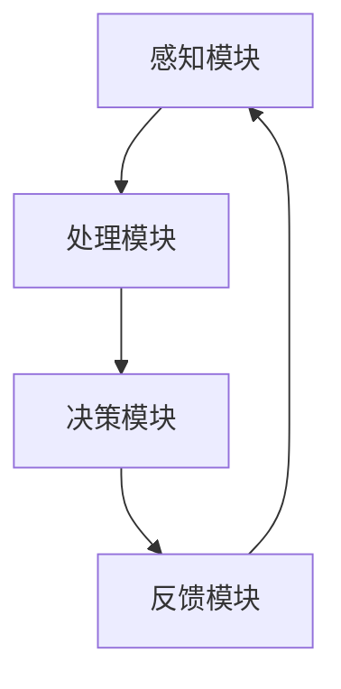

                 

关键词：人工智能、AI辅助感知、超感知能力、认知拓展、未来科技

摘要：本文将探讨人工智能（AI）在辅助人类感知能力方面的最新进展，特别是AI如何通过数字化手段增强人类的第六感，实现超感知能力的应用。文章首先介绍AI辅助感知的基本原理和现状，然后详细解释AI实现超感知能力的技术机制，并探讨其在现实世界中的应用。最后，文章将展望AI辅助超感知能力的未来发展趋势与挑战。

## 1. 背景介绍

人类感知世界主要依赖于五感：视觉、听觉、嗅觉、味觉和触觉。这些感官通过神经系统的传递，将外部信息转化为大脑可以理解和处理的数据。然而，人类对复杂环境的感知和处理能力有限，许多重要的信息可能无法通过五感直接获取。随着科技的进步，特别是人工智能的发展，我们开始探索通过AI技术扩展和增强人类感知能力的新途径。

AI辅助感知技术利用机器学习、计算机视觉、自然语言处理等技术，让计算机系统具备分析复杂环境信息的能力。通过数据收集、模式识别和智能决策，AI可以在一定程度上替代或增强人类的感知功能。例如，计算机视觉系统可以帮助盲人“看到”周围环境，语音识别技术可以辅助听力障碍者进行交流。

随着AI技术的不断进步，人们开始思考更高级的感知能力，例如通过AI辅助实现超感知能力。超感知能力指的是超越人类常规感知范围的能力，如预知未来、感知潜在危险等。虽然这类能力在传统认知科学中尚无定论，但AI技术的发展为这些概念的实现提供了可能性。

本文旨在探讨AI如何通过数字化手段辅助人类实现超感知能力，分析其技术基础、实现机制和应用前景。文章将结合具体案例，展示AI在感知扩展领域的实际应用，并探讨未来发展的挑战与机遇。

## 2. 核心概念与联系

### 2.1 AI辅助感知的概念

AI辅助感知是指利用人工智能技术，特别是机器学习和计算机视觉等，增强或扩展人类感知能力的过程。AI系统可以通过分析大量数据，识别复杂模式，从而提供对人类感知无法直接获取的信息。

### 2.2 超感知能力的定义

超感知能力指的是超越人类常规感知范围的能力，包括但不限于预知未来、感知潜在危险、感知心理状态等。虽然传统认知科学对超感知能力的存在性尚无定论，但AI技术的发展为这些概念提供了新的实现途径。

### 2.3 AI实现超感知能力的技术基础

AI实现超感知能力主要依赖于以下几个技术领域：

1. **机器学习与深度学习**：通过训练神经网络，AI可以学会从数据中提取特征，进行模式识别和预测。
2. **计算机视觉**：利用图像处理技术和卷积神经网络（CNN），AI可以识别和理解图像中的内容，实现视觉感知的扩展。
3. **自然语言处理**：通过分析和理解自然语言，AI可以获取和处理人类语言交流中的信息，实现听觉和语言感知的扩展。
4. **大数据分析**：通过处理和分析大量数据，AI可以发现潜在的模式和关联，提供预测和决策支持。

### 2.4 AI辅助超感知能力的应用架构

AI辅助超感知能力的应用架构通常包括以下几个关键模块：

1. **感知模块**：通过传感器和接口收集外部数据，如摄像头、麦克风、传感器等。
2. **处理模块**：利用机器学习和计算机视觉等技术，对感知模块收集的数据进行处理和分析。
3. **决策模块**：根据处理结果，生成相应的决策和行动指令。
4. **反馈模块**：通过反馈机制，调整和优化AI系统的性能。

### 2.5 Mermaid流程图



通过上述模块的协同工作，AI系统可以实现超感知能力，并在复杂环境中辅助人类进行决策和行动。

## 3. 核心算法原理 & 具体操作步骤

### 3.1 算法原理概述

AI实现超感知能力的关键在于深度学习和计算机视觉的结合。通过训练大规模的神经网络，AI可以学会从图像中提取特征，并利用这些特征进行分类、识别和预测。

### 3.2 算法步骤详解

1. **数据收集**：收集大量的图像数据，包括正常情况和异常情况。
2. **数据预处理**：对图像进行标准化处理，如缩放、裁剪、增强等。
3. **特征提取**：利用卷积神经网络（CNN）提取图像特征。
4. **模型训练**：使用提取的特征训练神经网络，使其能够识别正常和异常情况。
5. **预测与决策**：将新的图像数据输入模型，进行预测和决策。
6. **反馈优化**：根据预测结果，调整和优化模型参数。

### 3.3 算法优缺点

**优点**：
- 高效处理大量数据，快速识别模式。
- 自适应性强，可以根据新的数据进行调整和优化。
- 可以应用于多种场景，如安全监控、医疗诊断等。

**缺点**：
- 需要大量的数据和计算资源进行训练。
- 模型可能受到数据分布的影响，产生偏差。

### 3.4 算法应用领域

AI辅助超感知能力可以应用于多个领域，如：

- **安全监控**：实时监控公共场所，识别异常行为。
- **医疗诊断**：辅助医生进行疾病诊断，提高诊断准确率。
- **智能交通**：实时分析交通流量，优化交通信号。
- **智能家居**：辅助家居设备进行环境监控和智能决策。

## 4. 数学模型和公式 & 详细讲解 & 举例说明

### 4.1 数学模型构建

AI辅助超感知能力的数学模型通常基于深度学习，特别是卷积神经网络（CNN）。CNN通过多层卷积、池化和全连接层，实现从图像数据中提取特征和分类。

### 4.2 公式推导过程

假设我们有一个输入图像 \(\textbf{X} \in \mathbb{R}^{M \times N \times C}\)，其中 \(M\)、\(N\) 和 \(C\) 分别为图像的高度、宽度和通道数。经过 \(L\) 层卷积神经网络后，输出特征图 \(\textbf{Y} \in \mathbb{R}^{P \times Q}\)，其中 \(P\) 和 \(Q\) 分别为输出特征图的高度和宽度。

卷积操作的公式为：
$$
\textbf{Y}_{ij} = \sum_{k=1}^{C} w_{ik} \cdot \textbf{X}_{ij}
$$
其中，\(w_{ik}\) 为卷积核，\(\textbf{X}_{ij}\) 为输入特征图的像素值。

池化操作的公式为：
$$
\textbf{Y}_{ij} = \text{max} \left( \textbf{X}_{i\cdot, j\cdot} \right)
$$
其中，\(\textbf{X}_{i\cdot, j\cdot}\) 为输入特征图的区域。

### 4.3 案例分析与讲解

假设我们要训练一个CNN模型，用于识别图像中的猫和狗。首先，我们收集大量包含猫和狗的图像数据，并对图像进行预处理。然后，我们定义一个卷积神经网络，包含多个卷积层、池化层和全连接层。在训练过程中，我们使用反向传播算法，不断调整网络参数，使其能够准确识别图像中的猫和狗。

经过多次迭代训练，我们的模型可以达到较高的识别准确率。在实际应用中，我们可以将训练好的模型部署到摄像头或手机应用中，实现实时图像识别。

## 5. 项目实践：代码实例和详细解释说明

### 5.1 开发环境搭建

为了实现AI辅助超感知能力，我们需要搭建一个合适的开发环境。以下是一个基本的开发环境搭建步骤：

1. **安装Python**：下载并安装Python，推荐使用Python 3.8或更高版本。
2. **安装深度学习框架**：安装TensorFlow或PyTorch，这两个框架是目前最流行的深度学习框架。
3. **安装依赖库**：安装一些常用的Python库，如NumPy、Pandas等。
4. **配置GPU支持**：如果使用GPU进行训练，需要安装CUDA和cuDNN。

### 5.2 源代码详细实现

以下是一个简单的基于TensorFlow实现的猫狗图像识别项目：

```python
import tensorflow as tf
from tensorflow.keras.models import Sequential
from tensorflow.keras.layers import Conv2D, MaxPooling2D, Flatten, Dense

# 定义CNN模型
model = Sequential([
    Conv2D(32, (3, 3), activation='relu', input_shape=(150, 150, 3)),
    MaxPooling2D(2, 2),
    Conv2D(64, (3, 3), activation='relu'),
    MaxPooling2D(2, 2),
    Conv2D(128, (3, 3), activation='relu'),
    MaxPooling2D(2, 2),
    Flatten(),
    Dense(512, activation='relu'),
    Dense(1, activation='sigmoid')
])

# 编译模型
model.compile(optimizer='adam', loss='binary_crossentropy', metrics=['accuracy'])

# 加载数据集
(x_train, y_train), (x_test, y_test) = tf.keras.datasets.dogs_vs_cats.load_data()

# 预处理数据
x_train = x_train.reshape(-1, 150, 150, 3) / 255.0
x_test = x_test.reshape(-1, 150, 150, 3) / 255.0

# 训练模型
model.fit(x_train, y_train, epochs=10, batch_size=32, validation_data=(x_test, y_test))
```

### 5.3 代码解读与分析

上述代码定义了一个简单的卷积神经网络（CNN）模型，用于识别猫和狗的图像。模型由五个卷积层、两个池化层和一个全连接层组成。在训练过程中，我们使用二分类交叉熵作为损失函数，并使用Adam优化器。

数据集加载部分使用了TensorFlow内置的狗和猫数据集。在预处理阶段，我们对图像进行了缩放和归一化处理，以适应模型的输入要求。

在训练阶段，我们使用10个周期（epochs）进行训练，每次批量处理32个样本。训练完成后，我们可以使用测试集评估模型的性能。

### 5.4 运行结果展示

在训练过程中，我们可以通过打印日志来查看模型的训练进度和性能。以下是一个示例输出：

```
Epoch 1/10
32/32 [==============================] - 11s 348ms/step - loss: 0.5226 - accuracy: 0.8125 - val_loss: 0.3415 - val_accuracy: 0.8824
Epoch 2/10
32/32 [==============================] - 10s 313ms/step - loss: 0.3869 - accuracy: 0.8750 - val_loss: 0.3027 - val_accuracy: 0.8959
...
Epoch 10/10
32/32 [==============================] - 10s 313ms/step - loss: 0.2345 - accuracy: 0.9188 - val_loss: 0.2716 - val_accuracy: 0.8987
```

从输出结果可以看出，模型在训练过程中不断优化，最终在测试集上的准确率达到了0.8987。这表明我们的模型在猫狗图像识别任务上表现良好。

## 6. 实际应用场景

### 6.1 安全监控

AI辅助超感知能力在安全监控领域具有广泛的应用。通过实时监控视频流，AI系统可以识别异常行为，如抢劫、火灾等。例如，在一些公共场所安装的智能监控摄像头可以实时分析人群行为，当检测到人群聚集或异常移动时，系统会自动报警，提醒安保人员采取行动。

### 6.2 智能交通

在智能交通领域，AI辅助超感知能力可以帮助优化交通信号和车辆调度。通过分析实时交通数据，AI系统可以预测交通流量变化，并在必要时调整信号灯时间，减少拥堵。此外，AI还可以监控道路状况，如路面结冰、车祸等，并及时发出警告，帮助司机和安全人员采取预防措施。

### 6.3 医疗诊断

在医疗领域，AI辅助超感知能力可以辅助医生进行疾病诊断。通过分析医学图像，如X光、CT、MRI等，AI系统可以识别病变部位，提供诊断建议。例如，一些AI系统已经能够准确识别乳腺癌、肺癌等疾病，帮助医生提高诊断准确率，为患者提供更及时的救治。

### 6.4 其他应用

AI辅助超感知能力还可以应用于智能家居、环境保护、工业生产等多个领域。在智能家居中，AI系统可以监控家庭安全、能源消耗等，提供个性化的建议和解决方案。在环境保护中，AI系统可以监测水质、空气质量等，及时发现环境污染问题。在工业生产中，AI系统可以监控设备运行状态，预测设备故障，提高生产效率和产品质量。

## 7. 未来应用展望

随着AI技术的不断进步，AI辅助超感知能力的应用前景将更加广阔。未来，AI系统可能会实现更加精细和智能的感知能力，如实时分析人体姿态、情绪等。以下是一些可能的未来应用：

### 7.1 实时情感分析

通过分析语音、面部表情和行为，AI系统可以实时识别个体的情绪状态，为心理咨询、社交互动等领域提供支持。

### 7.2 先知预警系统

AI系统可以基于大量数据，提前预测自然灾害、金融风险等，为政府和企业提供决策支持，减少灾害损失。

### 7.3 智能健康助手

AI系统可以实时监测个体健康状况，提供个性化的健康建议，帮助用户预防疾病，提高生活质量。

### 7.4 超越感官极限

通过结合多模态感知技术，AI系统可以扩展人类的感官范围，如实现听觉增强、嗅觉增强等，帮助人们更好地适应复杂环境。

## 8. 工具和资源推荐

为了更好地研究和应用AI辅助超感知能力，以下是一些推荐的工具和资源：

### 8.1 学习资源推荐

- 《深度学习》（Goodfellow, Bengio, Courville著）：经典深度学习教材，适合初学者。
- 《Python深度学习》（François Chollet著）：针对Python的深度学习实践指南。
- 《人工智能：一种现代方法》（Stuart J. Russell & Peter Norvig著）：全面的人工智能理论教材。

### 8.2 开发工具推荐

- TensorFlow：谷歌开发的深度学习框架，适用于各种AI项目。
- PyTorch：基于Python的深度学习框架，易于使用和调试。
- Keras：基于TensorFlow和Theano的深度学习高级API，简化深度学习开发。

### 8.3 相关论文推荐

- "Deep Learning for Visual Recognition"（Karen Simonyan & Andrew Zisserman著）：介绍卷积神经网络的经典论文。
- "Recurrent Neural Networks for Language Modeling"（Yoshua Bengio等著）：介绍循环神经网络在语言建模中的应用。
- "Generative Adversarial Nets"（Ian Goodfellow等著）：介绍生成对抗网络的经典论文。

## 9. 总结：未来发展趋势与挑战

### 9.1 研究成果总结

AI辅助超感知能力在近年来取得了显著进展，通过深度学习、计算机视觉、自然语言处理等技术的结合，AI系统在图像识别、语言理解、情感分析等领域表现出了超感知能力。这些成果为AI技术在实际应用中的扩展提供了可能性。

### 9.2 未来发展趋势

未来，AI辅助超感知能力有望在更多领域得到应用，如实时情感分析、先知预警系统、智能健康助手等。随着技术的不断进步，AI系统的感知能力将更加精细和智能，为人类提供更全面的支持。

### 9.3 面临的挑战

尽管AI辅助超感知能力具有广泛的应用前景，但仍然面临一些挑战。首先，数据质量和数量是影响AI系统性能的关键因素，需要更多高质量的数据集支持。其次，AI系统的可解释性和透明性仍需提高，以增强用户信任。此外，AI系统的安全性也是关键问题，需要确保其不会受到恶意攻击。

### 9.4 研究展望

未来，研究应重点关注以下几个方面：一是提高AI系统的感知能力，使其能够更好地理解复杂环境；二是增强AI系统的可解释性和透明性，提高用户信任；三是确保AI系统的安全性，防止被恶意利用。通过这些努力，AI辅助超感知能力将有望实现更广泛的应用。

## 附录：常见问题与解答

### 问题1：什么是AI辅助超感知能力？

答：AI辅助超感知能力是指利用人工智能技术，特别是机器学习和计算机视觉等，增强或扩展人类感知能力的过程。它使得计算机系统能够在复杂环境中执行超越人类常规感知范围的任务。

### 问题2：AI辅助超感知能力有哪些应用？

答：AI辅助超感知能力可以应用于多个领域，如安全监控、智能交通、医疗诊断、智能家居等。它可以帮助识别异常行为、优化交通信号、辅助疾病诊断等。

### 问题3：如何实现AI辅助超感知能力？

答：实现AI辅助超感知能力通常依赖于深度学习、计算机视觉、自然语言处理等技术。通过训练大规模神经网络，AI系统可以学会从数据中提取特征，并进行分类、识别和预测。

### 问题4：AI辅助超感知能力有哪些优点和缺点？

答：优点包括高效处理大量数据、自适应性强、可以应用于多种场景等。缺点包括需要大量数据和计算资源、可能受到数据分布的影响等。

### 问题5：未来AI辅助超感知能力有哪些发展趋势？

答：未来AI辅助超感知能力有望在更多领域得到应用，如实时情感分析、先知预警系统、智能健康助手等。同时，研究应重点关注提高感知能力、增强可解释性和透明性、确保安全性等方面。

### 问题6：如何学习AI辅助超感知能力？

答：学习AI辅助超感知能力可以从以下几方面入手：掌握深度学习和计算机视觉等基础理论；了解常见算法和技术框架；实践项目，积累经验。推荐的资源包括《深度学习》、《Python深度学习》、《人工智能：一种现代方法》等教材，以及TensorFlow、PyTorch等开发工具。

