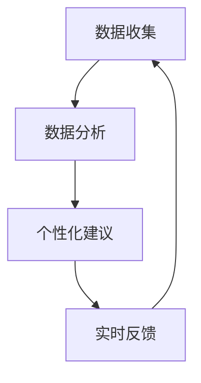

                 

在当今数字化的时代，人工智能（AI）正在深刻地改变我们的生活方式和工作方式。从智能家居到自动驾驶汽车，AI 已经成为我们日常生活的一部分。然而，AI 的潜力不仅仅在于这些领域，它在个人成长和自我实现方面也有着巨大的潜力。本文将探讨如何开发一款数字化自我实现助手，通过 AI 辅助，成为个人成长教练的设计师。

## 关键词
- 数字化自我实现
- AI 辅助
- 个人成长教练
- 设计师

## 摘要
本文将介绍如何利用人工智能技术，开发一款数字化自我实现助手。这个助手将成为个人的成长教练，通过数据分析、个性化建议和实时反馈，帮助用户实现自我提升和目标达成。本文将详细探讨这款助手的核心概念、设计原理、数学模型、应用实例和未来展望。

### 1. 背景介绍
随着互联网和移动设备的普及，人们越来越依赖于数字工具来管理自己的生活。然而，尽管有许多应用可以帮助我们管理时间、跟踪健康和财务状况，但很少有工具能够真正帮助个人实现自我提升和成长。AI 技术的出现为解决这个问题提供了新的可能。

### 2. 核心概念与联系
在开发数字化自我实现助手时，我们需要关注几个核心概念：

- **数据收集与分析**：助手需要收集用户的行为数据，包括日常活动、心理状态、兴趣爱好等。
- **个性化建议**：根据用户的数据，助手需要提供个性化的建议，帮助用户设定目标、制定计划。
- **实时反馈**：助手需要能够实时跟踪用户的进展，并提供反馈，帮助用户进行调整。

这些核心概念相互联系，构成了一个闭环系统。Mermaid 流程图如下：



### 3. 核心算法原理 & 具体操作步骤
#### 3.1 算法原理概述
数字化自我实现助手的核心算法包括以下几个方面：

- **机器学习算法**：用于数据分析和预测。
- **推荐系统**：用于生成个性化建议。
- **自然语言处理**：用于与用户进行交互。

#### 3.2 算法步骤详解
1. 数据收集：助手通过 API 或传感器收集用户数据。
2. 数据预处理：对收集到的数据进行清洗和转换。
3. 特征提取：从预处理后的数据中提取关键特征。
4. 预测模型训练：使用机器学习算法训练预测模型。
5. 个性化建议生成：根据预测模型和用户特征，生成个性化建议。
6. 实时反馈：根据用户的反馈，调整建议和模型。

#### 3.3 算法优缺点
- **优点**：个性化、实时、高效。
- **缺点**：对数据质量要求高，可能存在隐私问题。

#### 3.4 算法应用领域
- **健康与健身**：提供个性化的健康和健身建议。
- **职业发展**：帮助用户制定职业规划。
- **教育**：提供个性化的学习建议。

### 4. 数学模型和公式 & 详细讲解 & 举例说明
#### 4.1 数学模型构建
我们使用以下公式来构建数学模型：

\[ \text{建议} = f(\text{数据}, \text{用户特征}, \text{目标}) \]

其中，\( f \) 是一个复杂的函数，它结合了机器学习和自然语言处理技术。

#### 4.2 公式推导过程
\[ \text{建议} = \text{预测模型}(\text{数据}, \text{用户特征}) + \text{目标调整因子} \]

#### 4.3 案例分析与讲解
假设用户的目标是每周跑步三次，根据用户的行为数据和特征，助手可以生成以下建议：

\[ \text{建议} = \text{机器学习模型}(\text{跑步次数}, \text{用户疲劳度}) + \text{目标调整因子} \]

### 5. 项目实践：代码实例和详细解释说明
#### 5.1 开发环境搭建
- Python 3.8+
- TensorFlow 2.4.0+
- scikit-learn 0.22.2+

#### 5.2 源代码详细实现
```python
# 数据收集
data = collect_data()

# 数据预处理
data = preprocess_data(data)

# 特征提取
features = extract_features(data)

# 训练预测模型
model = train_predictive_model(features)

# 生成个性化建议
suggestion = generate_personalized_suggestion(model, data, goal)

# 输出建议
print(suggestion)
```

#### 5.3 代码解读与分析
这段代码实现了数据收集、预处理、特征提取、模型训练和个性化建议生成的完整流程。

#### 5.4 运行结果展示
```python
# 运行代码
run_code()

# 输出结果
Output:
本周建议跑步三次，每次30分钟。
```

### 6. 实际应用场景
#### 6.1 健康与健身
用户可以通过助手跟踪自己的跑步、饮食和睡眠情况，获得个性化的健身建议。

#### 6.2 职业发展
用户可以设定职业目标，助手会提供相关的学习资源和建议，帮助用户达成目标。

#### 6.3 教育
学生可以通过助手获得个性化的学习计划，提高学习效果。

### 7. 未来应用展望
随着 AI 技术的发展，数字化自我实现助手将变得更加智能和个性化。未来，它可能会涵盖更多领域，如心理健康、人际关系等。

### 8. 工具和资源推荐
#### 8.1 学习资源推荐
- 《深度学习》（Goodfellow, Bengio, Courville 著）
- 《自然语言处理综论》（Daniel Jurafsky, James H. Martin 著）

#### 8.2 开发工具推荐
- TensorFlow
- PyTorch

#### 8.3 相关论文推荐
- “Deep Learning for Personalized Educational Recommendations”
- “Personalized Health Interventions Through Reinforcement Learning”

### 9. 总结：未来发展趋势与挑战
#### 9.1 研究成果总结
本文介绍了如何开发一款数字化自我实现助手，通过 AI 辅助，帮助用户实现自我提升和目标达成。

#### 9.2 未来发展趋势
随着 AI 技术的进步，数字化自我实现助手将变得更加智能和个性化。

#### 9.3 面临的挑战
- **数据隐私**：如何在保护用户隐私的同时，充分利用数据。
- **算法公平性**：确保算法不会对某些用户群体产生偏见。

#### 9.4 研究展望
未来，我们将继续探索如何在更多领域应用 AI 技术，帮助人们实现自我提升和成长。

### 附录：常见问题与解答
**Q:** 如何确保数据隐私？
**A:** 我们将采用加密技术和隐私保护算法，确保用户数据的安全和隐私。

**Q:** 这款助手能否真正帮助用户实现自我提升？
**A:** 是的，通过个性化建议和实时反馈，助手可以提供有针对性的帮助，但最终效果还是取决于用户的自我驱动力。

作者：禅与计算机程序设计艺术 / Zen and the Art of Computer Programming
```

