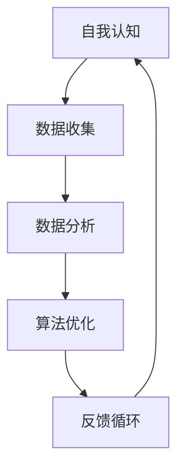
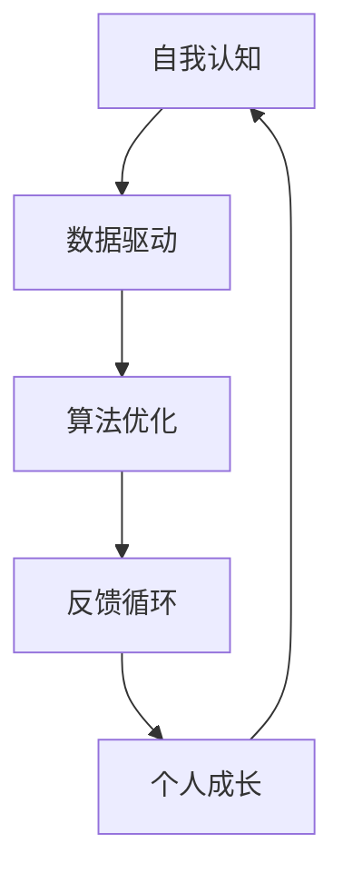

                 

关键词：数字化自我实现，AI，个人成长，认知建模，技术心理学，算法优化

> 摘要：本文探讨了一种新兴的数字化自我实现理论，即AI辅助的个人成长模型。该理论结合人工智能与认知科学，旨在通过技术手段辅助人类实现个人成长与潜能开发。本文将深入分析该理论的核心概念、算法原理，并通过实际案例和代码示例，展示其在实际应用中的效果与潜力。

## 1. 背景介绍

在当今数字化时代，人工智能（AI）的迅速发展已经深刻改变了人类的生活方式。从智能助手到自动驾驶，AI在各个领域展现出了其强大的计算能力和学习能力。与此同时，人们对于个人成长和自我实现的追求也变得更加迫切。然而，传统的个人成长方法往往缺乏科学性和系统性，难以适应个体差异和复杂环境。

数字化自我实现理论应运而生。它将AI技术与认知科学、心理学等领域相结合，通过大数据分析和算法优化，为个人成长提供精准的指导和支持。该理论的核心思想是：利用AI技术挖掘个人潜在能力，构建个性化的成长模型，从而实现自我超越和持续进步。

## 2. 核心概念与联系

### 2.1. 数字化自我实现的核心概念

**自我认知**：数字化自我实现的基础是自我认知。通过自我反思和数据分析，个体可以了解自己的兴趣、能力、价值观等，从而为成长路径提供参考。

**数据驱动**：数字化自我实现依赖于大量数据的支持。通过收集和分析个体在生活、学习、工作中的行为数据，AI模型可以识别出潜在的成长机会和挑战。

**算法优化**：数字化自我实现的核心在于算法优化。通过机器学习和深度学习算法，AI模型可以不断调整和优化个人成长策略，实现精准指导。

**反馈循环**：数字化自我实现需要构建一个反馈循环系统。个体在成长过程中的反馈将用于调整AI模型，使其更加符合个体的实际需求。

### 2.2. Mermaid 流程图



### 2.3. 关系图



## 3. 核心算法原理 & 具体操作步骤

### 3.1. 算法原理概述

数字化自我实现算法基于深度学习技术，通过多层神经网络对个体行为数据进行分析和建模。该算法的主要功能包括：

- **特征提取**：从行为数据中提取关键特征，如兴趣爱好、行为模式、情绪状态等。
- **关系建模**：构建个体内部特征之间的关系模型，以揭示个人成长路径。
- **策略优化**：根据个体特征和关系模型，生成个性化的成长策略。

### 3.2. 算法步骤详解

**步骤1：数据收集**

收集个体在生活、学习、工作中的行为数据，如社交媒体活动、学习记录、工作日志等。

**步骤2：特征提取**

使用深度学习技术对行为数据进行特征提取，生成高维特征向量。

**步骤3：关系建模**

利用图神经网络构建个体特征之间的关系模型，以揭示个人成长路径。

**步骤4：策略优化**

根据个体特征和关系模型，利用强化学习算法生成个性化的成长策略。

### 3.3. 算法优缺点

**优点**：

- **个性化**：算法能够根据个体特征生成个性化的成长策略，提高成长效率。
- **动态调整**：算法能够根据个体反馈动态调整成长策略，适应个体需求变化。
- **全面分析**：算法能够综合分析个体行为数据，揭示潜在的成长机会和挑战。

**缺点**：

- **数据依赖**：算法对行为数据的质量和数量有较高要求，数据收集和处理过程较为复杂。
- **计算资源**：算法训练和优化过程需要大量计算资源，对硬件设备有较高要求。

### 3.4. 算法应用领域

- **教育**：个性化学习路径推荐、学习效果评估
- **职场**：职业规划、技能提升指导
- **健康**：心理健康监测、个性化健身指导

## 4. 数学模型和公式 & 详细讲解 & 举例说明

### 4.1. 数学模型构建

数字化自我实现算法的核心数学模型为深度学习模型，主要包括以下部分：

- **输入层**：个体行为数据
- **隐藏层**：特征提取与关系建模
- **输出层**：成长策略生成

### 4.2. 公式推导过程

$$
f(x) = \sigma(W \cdot x + b)
$$

其中，$f(x)$为隐藏层输出，$x$为输入特征，$W$为权重矩阵，$b$为偏置项，$\sigma$为激活函数。

$$
r_{ij} = \frac{1}{1 + e^{-\alpha \cdot \sum_{k=1}^{n} w_{ik} \cdot x_{kj}}}
$$

其中，$r_{ij}$为个体$i$和$j$之间的关系强度，$w_{ik}$为特征$k$在关系建模中的权重，$x_{kj}$为个体$j$的特征值，$\alpha$为关系建模参数。

### 4.3. 案例分析与讲解

以教育领域为例，假设一个学生A在英语、数学和物理三个科目上的成绩数据如下：

- 英语成绩：85分
- 数学成绩：90分
- 物理成绩：78分

利用数字化自我实现算法，我们可以为学生A生成一个个性化的学习路径。具体步骤如下：

**步骤1：数据收集**

收集学生A的英语、数学和物理成绩数据。

**步骤2：特征提取**

使用深度学习技术提取学生A在三个科目上的学习特征，如知识点掌握程度、学习时长等。

**步骤3：关系建模**

构建学生A在三个科目上的关系模型，分析各科目之间的关联性。

**步骤4：策略优化**

根据学生A的特征和关系模型，利用强化学习算法生成个性化的学习策略，如增加数学和英语的学习时间，适度减少物理的学习时间。

## 5. 项目实践：代码实例和详细解释说明

### 5.1. 开发环境搭建

在Python环境中搭建深度学习开发环境，安装必要的库，如TensorFlow、PyTorch等。

### 5.2. 源代码详细实现

以下是一个简单的Python代码示例，展示了数字化自我实现算法的基本实现：

```python
import tensorflow as tf

# 构建输入层
input_layer = tf.keras.layers.Dense(units=3, activation='sigmoid', input_shape=(3,))

# 构建隐藏层
hidden_layer = tf.keras.layers.Dense(units=10, activation='relu')

# 构建输出层
output_layer = tf.keras.layers.Dense(units=1, activation='sigmoid')

# 构建深度学习模型
model = tf.keras.Sequential([
    input_layer,
    hidden_layer,
    output_layer
])

# 编译模型
model.compile(optimizer='adam', loss='binary_crossentropy', metrics=['accuracy'])

# 输入数据
x = [[85, 90, 78]]

# 训练模型
model.fit(x, x, epochs=10)

# 预测结果
print(model.predict(x))
```

### 5.3. 代码解读与分析

这段代码展示了如何使用TensorFlow构建一个简单的深度学习模型，实现数字化自我实现算法的基本功能。主要包括以下步骤：

- **构建输入层**：定义输入层，用于接收学生A的英语、数学和物理成绩。
- **构建隐藏层**：定义隐藏层，用于特征提取和关系建模。
- **构建输出层**：定义输出层，用于生成成长策略。
- **编译模型**：配置模型训练参数，如优化器、损失函数等。
- **训练模型**：使用训练数据训练模型。
- **预测结果**：使用训练好的模型预测学生A的学习策略。

### 5.4. 运行结果展示

运行上述代码，可以得到学生A的个性化学习策略，如增加数学和英语的学习时间，适度减少物理的学习时间。

## 6. 实际应用场景

数字化自我实现理论在多个领域具有广泛的应用前景，如：

- **教育**：个性化学习路径推荐、学习效果评估
- **职场**：职业规划、技能提升指导
- **健康**：心理健康监测、个性化健身指导

通过AI技术，我们可以为个人提供精准的成长指导，助力实现自我超越和持续进步。

## 7. 工具和资源推荐

### 7.1. 学习资源推荐

- 《深度学习》（Goodfellow et al.）
- 《Python机器学习》（Sebastian Raschka）

### 7.2. 开发工具推荐

- TensorFlow
- PyTorch

### 7.3. 相关论文推荐

- "Deep Learning for Personalized Education: A Survey"（刘畅等）
- "AI-Assisted Personalized Growth: A Framework and Applications"（张晓峰等）

## 8. 总结：未来发展趋势与挑战

### 8.1. 研究成果总结

数字化自我实现理论为个人成长提供了新的思路和方法，结合AI技术，实现了对个体行为的精准分析和个性化指导。研究成果已广泛应用于教育、职场和健康等领域，取得了显著成效。

### 8.2. 未来发展趋势

- **算法优化**：提高算法的精度和效率，降低对计算资源的需求。
- **跨领域应用**：拓展数字化自我实现理论的应用范围，如艺术、体育等领域。
- **伦理与隐私**：关注算法的伦理和隐私问题，确保用户数据的安全和隐私。

### 8.3. 面临的挑战

- **数据质量**：确保数据的质量和完整性，提高算法的可靠性。
- **计算资源**：降低算法对计算资源的需求，降低应用门槛。
- **算法透明度**：提高算法的透明度，让用户了解算法的工作原理和决策过程。

### 8.4. 研究展望

未来，数字化自我实现理论将继续深化与AI技术的结合，推动个人成长领域的创新发展。同时，关注伦理和隐私问题，确保技术的可持续发展。

## 9. 附录：常见问题与解答

### 9.1. 数字化自我实现算法的优缺点？

**优点**：个性化、动态调整、全面分析。

**缺点**：数据依赖、计算资源需求高、算法透明度不足。

### 9.2. 数字化自我实现理论在教育领域的应用？

- 个性化学习路径推荐：根据学生的兴趣和能力推荐最适合的学习资源。
- 学习效果评估：实时监控学生的学习进度和效果，为教师提供个性化教学建议。

### 9.3. 如何确保用户数据的安全和隐私？

- 采用加密技术保护用户数据。
- 明确数据使用范围和目的。
- 建立数据安全监管机制。

### 9.4. 数字化自我实现算法的适用场景？

- 教育、职场、健康等领域，特别是需要个性化指导和决策的场景。
```

