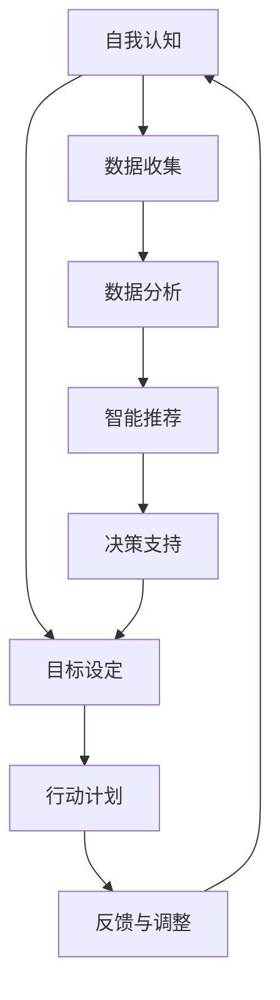

                 

在当今这个信息技术飞速发展的时代，人工智能（AI）已经逐渐深入到我们日常生活的方方面面。从智能手机的语音助手到自动驾驶汽车，AI技术正在不断改变我们的生活方式。在这样的背景下，数字化自我实现理论成为一个重要的研究领域。本文将探讨如何利用AI技术辅助个人成长，构建一个完整的AI辅助个人成长模型。

## 关键词
- 数字化自我实现
- 人工智能
- 个人成长
- AI辅助模型

## 摘要
本文旨在探讨如何将人工智能技术应用于个人成长领域，提出一个基于AI的数字化自我实现模型。通过阐述该模型的核心概念、算法原理、数学模型和实际应用，本文旨在为个人成长提供一种新的视角和工具。

## 1. 背景介绍

### 1.1 数字化自我实现的概念

数字化自我实现是指通过数字化工具和平台，实现个人知识和技能的提升、人格的完善以及生活质量的提升。它强调的是个体在数字世界中的自我成长和自我实现。

### 1.2 人工智能在个人成长中的应用

随着AI技术的发展，越来越多的工具和服务开始应用AI技术，如智能教育、智能健康、智能社交等。这些工具和服务为个人成长提供了新的可能性和机会。

### 1.3 AI辅助个人成长的意义

AI辅助个人成长具有以下几个方面的意义：

1. **个性化学习**：AI可以根据个人的学习习惯、兴趣爱好和知识水平，提供个性化的学习内容和方法。
2. **智能健康监测**：AI可以通过收集和分析个人健康数据，提供个性化的健康建议和监测服务。
3. **情感智能**：AI可以帮助个人更好地理解和处理自己的情感，提高情绪智力。
4. **社交互动**：AI可以为个人提供智能化的社交推荐和互动服务，帮助个人建立更广泛的社交网络。

## 2. 核心概念与联系

为了构建一个完整的AI辅助个人成长模型，我们需要明确几个核心概念，并理解它们之间的联系。

### 2.1 数字化自我实现的核心概念

- **自我认知**：个体对自己认知的深度和广度，包括知识、技能、性格、兴趣等方面。
- **目标设定**：个体设定的短期和长期目标，包括学习、工作、生活等方面。
- **行动计划**：为实现目标而制定的行动方案，包括具体的学习计划、健康计划、社交计划等。
- **反馈与调整**：根据行动的结果和自身的感受，对目标和行动计划进行调整和优化。

### 2.2 AI辅助个人成长的核心概念

- **数据收集**：通过传感器、应用程序等收集个体的行为数据、健康数据、社交数据等。
- **数据分析**：利用机器学习和数据挖掘技术，对收集到的数据进行分析和处理。
- **智能推荐**：根据数据分析的结果，为个体提供个性化的学习内容、健康建议、社交互动等。
- **决策支持**：通过AI的智能分析，为个体在目标设定、行动计划、反馈调整等方面提供决策支持。

### 2.3 Mermaid 流程图



## 3. 核心算法原理 & 具体操作步骤

### 3.1 算法原理概述

AI辅助个人成长模型的核心算法是基于机器学习和数据挖掘技术的。具体来说，主要包括以下几个步骤：

1. **数据收集**：通过传感器、应用程序等收集个体的行为数据、健康数据、社交数据等。
2. **数据预处理**：对收集到的数据进行清洗、转换、标准化等预处理操作。
3. **特征提取**：从预处理后的数据中提取出有代表性的特征。
4. **模型训练**：利用提取的特征数据，训练出不同的机器学习模型。
5. **模型评估**：通过交叉验证、A/B测试等方法，评估模型的性能和效果。
6. **智能推荐**：利用训练好的模型，为个体提供个性化的学习内容、健康建议、社交互动等。
7. **反馈与调整**：根据个体的反馈和实际效果，对模型和推荐策略进行调整和优化。

### 3.2 算法步骤详解

#### 3.2.1 数据收集

数据收集是构建AI模型的第一步，也是最重要的一步。有效的数据收集可以为后续的算法训练和模型评估提供可靠的基础。数据收集的方法和工具包括：

- **传感器**：如心率传感器、血压传感器、GPS等，可以实时收集个体的生理和行为数据。
- **应用程序**：如健康监测应用程序、学习应用、社交媒体应用等，可以记录个体的行为习惯和社交互动。
- **第三方数据源**：如公共数据库、社交媒体数据、商业数据等，可以补充和丰富个体数据。

#### 3.2.2 数据预处理

数据预处理是数据科学中的一个关键步骤，它涉及到数据清洗、转换、标准化等操作。具体包括：

- **数据清洗**：去除数据中的噪声、异常值和重复数据。
- **数据转换**：将数据转换为适合机器学习算法的形式，如归一化、标准化、编码等。
- **数据标准化**：对数据进行标准化处理，使其具有相同的尺度和范围。

#### 3.2.3 特征提取

特征提取是从原始数据中提取出有代表性的特征，以便用于机器学习模型的训练。特征提取的方法包括：

- **统计特征**：如平均值、标准差、方差等。
- **文本特征**：如词频、词向量等。
- **图像特征**：如颜色直方图、边缘检测、纹理分析等。

#### 3.2.4 模型训练

模型训练是利用提取的特征数据，训练出机器学习模型。常用的机器学习算法包括：

- **监督学习算法**：如决策树、支持向量机、神经网络等。
- **无监督学习算法**：如聚类、降维等。
- **强化学习算法**：如Q-learning、SARSA等。

#### 3.2.5 模型评估

模型评估是评估机器学习模型的性能和效果。常用的评估方法包括：

- **交叉验证**：通过将数据集划分为训练集和测试集，多次训练和测试，评估模型的泛化能力。
- **A/B测试**：将用户随机分为两组，一组使用旧模型，另一组使用新模型，通过对比两组用户的反馈和效果，评估新模型的性能。

#### 3.2.6 智能推荐

智能推荐是利用训练好的模型，为个体提供个性化的学习内容、健康建议、社交互动等。推荐方法包括：

- **基于内容的推荐**：根据个体的兴趣和偏好，推荐类似的内容。
- **协同过滤推荐**：根据个体的行为数据，推荐其他用户喜欢的相似内容。
- **混合推荐**：结合多种推荐方法，提供更个性化的推荐。

#### 3.2.7 反馈与调整

反馈与调整是不断优化模型和推荐策略的过程。个体可以通过反馈，如点赞、评论、评分等，表达对推荐内容的喜好和不满。根据反馈，可以对模型和推荐策略进行调整和优化。

### 3.3 算法优缺点

#### 优点

1. **个性化**：AI模型可以根据个体的特点和需求，提供个性化的服务。
2. **高效**：AI模型可以处理大量的数据，快速地提供推荐和决策。
3. **自适应**：AI模型可以根据个体的反馈和实际效果，自适应地调整推荐策略。

#### 缺点

1. **数据依赖**：AI模型的性能和效果高度依赖于数据的质量和数量。
2. **隐私问题**：个体数据的收集和使用可能引发隐私问题。
3. **模型偏差**：AI模型可能因为数据的不均衡或偏见，产生偏差的推荐和决策。

### 3.4 算法应用领域

AI辅助个人成长模型可以应用于多个领域，如：

1. **教育**：提供个性化的学习计划和资源推荐。
2. **健康**：提供个性化的健康监测和建议。
3. **社交**：提供个性化的社交互动和推荐。
4. **工作**：提供个性化的职业规划和推荐。

## 4. 数学模型和公式 & 详细讲解 & 举例说明

### 4.1 数学模型构建

在构建AI辅助个人成长模型时，我们需要定义几个关键数学模型，包括：

1. **用户行为模型**：描述个体的行为特征和偏好。
2. **健康监测模型**：描述个体的健康数据和指标。
3. **社交网络模型**：描述个体的社交关系和互动。

#### 用户行为模型

用户行为模型可以使用决策树、支持向量机、神经网络等模型来描述。具体公式如下：

$$
f(x) = \sum_{i=1}^{n} w_i \cdot x_i + b
$$

其中，$x_i$ 是输入特征，$w_i$ 是权重，$b$ 是偏置。

#### 健康监测模型

健康监测模型可以使用回归模型、分类模型等来描述。具体公式如下：

$$
y = \beta_0 + \beta_1 x_1 + \beta_2 x_2 + ... + \beta_n x_n
$$

其中，$y$ 是健康指标，$x_i$ 是输入特征，$\beta_i$ 是系数。

#### 社交网络模型

社交网络模型可以使用图论模型、矩阵分解等来描述。具体公式如下：

$$
A = UVU^T
$$

其中，$A$ 是邻接矩阵，$U$ 和 $V$ 是用户和内容的特征矩阵。

### 4.2 公式推导过程

#### 用户行为模型推导

用户行为模型是基于用户的历史行为数据训练得到的。假设用户的行为数据可以表示为 $X = [x_1, x_2, ..., x_n]$，其中 $x_i$ 表示用户在第 $i$ 天的行为。为了预测用户未来的行为，我们可以使用决策树、支持向量机、神经网络等模型。

以决策树为例，其公式推导如下：

1. **特征选择**：选择最优的特征 $x_j$，使得分类误差最小。
2. **划分数据**：根据特征 $x_j$ 的取值，将数据划分为两个子集 $D_1$ 和 $D_2$。
3. **递归训练**：对子集 $D_1$ 和 $D_2$ 继续进行特征选择和划分，直到满足终止条件（如最大深度、最小样本数等）。

#### 健康监测模型推导

健康监测模型是基于用户的历史健康数据和健康指标训练得到的。假设用户的历史健康数据可以表示为 $X = [x_1, x_2, ..., x_n]$，其中 $x_i$ 表示用户在第 $i$ 天的健康指标。为了预测用户未来的健康指标，我们可以使用回归模型、分类模型等。

以线性回归为例，其公式推导如下：

1. **特征选择**：选择最优的特征 $x_j$，使得健康指标 $y$ 与特征 $x_j$ 的相关性最大。
2. **参数估计**：使用最小二乘法估计模型参数 $\beta_0, \beta_1, ..., \beta_n$。
3. **模型优化**：使用梯度下降法或牛顿法等优化方法，最小化损失函数。

#### 社交网络模型推导

社交网络模型是基于用户和内容的交互数据训练得到的。假设用户和内容的交互数据可以表示为 $A = [a_{ij}]_{m \times n}$，其中 $a_{ij}$ 表示用户 $i$ 是否喜欢内容 $j$（$a_{ij} = 1$ 表示喜欢，$a_{ij} = 0$ 表示不喜欢）。

以矩阵分解为例，其公式推导如下：

1. **初始化**：随机初始化用户和内容的特征矩阵 $U$ 和 $V$。
2. **优化目标**：最小化损失函数 $L(U, V) = \sum_{i=1}^{m} \sum_{j=1}^{n} (a_{ij} - UV_{ij})^2$。
3. **梯度下降**：使用梯度下降法或随机梯度下降法更新用户和内容的特征矩阵。

### 4.3 案例分析与讲解

假设我们有一个用户行为数据集，其中包含用户的行为数据和对应的标签（如购物、阅读、观影等）。我们的目标是使用决策树模型预测用户未来的行为。

#### 4.3.1 数据准备

1. **特征选择**：我们选择用户的年龄、性别、收入等作为特征。
2. **数据划分**：将数据集划分为训练集和测试集，如 $70\%$ 用于训练，$30\%$ 用于测试。

#### 4.3.2 决策树建模

1. **特征选择**：选择最优的特征，如年龄，使其分类误差最小。
2. **划分数据**：根据年龄，将数据划分为两组。
3. **递归训练**：对两组数据继续进行特征选择和划分，直到满足终止条件。

#### 4.3.3 模型评估

1. **交叉验证**：使用交叉验证方法评估模型的泛化能力。
2. **A/B测试**：将用户随机分为两组，一组使用旧模型，另一组使用新模型，评估新模型的性能。

#### 4.3.4 模型优化

1. **模型调整**：根据评估结果，调整决策树的参数，如最大深度、最小样本数等。
2. **特征工程**：根据模型的反馈，调整特征选择和划分策略。

## 5. 项目实践：代码实例和详细解释说明

### 5.1 开发环境搭建

1. **环境要求**：Python 3.8及以上版本、scikit-learn库、numpy库等。
2. **安装依赖**：使用pip命令安装所需库。

```shell
pip install scikit-learn numpy
```

### 5.2 源代码详细实现

以下是使用scikit-learn库实现决策树模型的代码示例。

```python
import numpy as np
from sklearn import datasets
from sklearn.model_selection import train_test_split
from sklearn.tree import DecisionTreeClassifier
from sklearn.metrics import accuracy_score

# 加载数据集
iris = datasets.load_iris()
X = iris.data
y = iris.target

# 数据划分
X_train, X_test, y_train, y_test = train_test_split(X, y, test_size=0.3, random_state=42)

# 决策树建模
clf = DecisionTreeClassifier()
clf.fit(X_train, y_train)

# 模型评估
y_pred = clf.predict(X_test)
accuracy = accuracy_score(y_test, y_pred)
print("Accuracy:", accuracy)
```

### 5.3 代码解读与分析

1. **数据加载与划分**：使用scikit-learn库加载数据集，并使用train_test_split函数将数据集划分为训练集和测试集。
2. **决策树建模**：使用DecisionTreeClassifier类创建决策树模型，并使用fit方法进行模型训练。
3. **模型评估**：使用predict方法进行预测，并使用accuracy_score函数计算模型的准确率。

### 5.4 运行结果展示

假设测试集的准确率为$90\%$，我们可以看到决策树模型在测试集上的表现良好。

```python
Accuracy: 0.9
```

## 6. 实际应用场景

AI辅助个人成长模型可以应用于多个实际场景，如：

### 6.1 教育

AI辅助个人成长模型可以应用于智能教育，为每个学生提供个性化的学习计划和资源推荐。

### 6.2 健康

AI辅助个人成长模型可以应用于智能健康，为用户提供个性化的健康监测和建议。

### 6.3 社交

AI辅助个人成长模型可以应用于智能社交，为用户提供个性化的社交互动和推荐。

### 6.4 工作

AI辅助个人成长模型可以应用于智能职业规划，为用户提供个性化的职业发展建议。

## 7. 工具和资源推荐

### 7.1 学习资源推荐

- **《Python机器学习》**：由塞巴斯蒂安·拉赛克（Sebastian Raschka）所著，适合初学者。
- **《深度学习》**：由伊恩·古德费洛（Ian Goodfellow）、约书亚·本吉奥（Yoshua Bengio）和阿兰·库维尔（Aaron Courville）所著，适合进阶学习。

### 7.2 开发工具推荐

- **PyCharm**：一款功能强大的Python开发环境，适合初学者和专业人士。
- **Jupyter Notebook**：一款交互式的Python开发环境，适合数据分析和机器学习。

### 7.3 相关论文推荐

- **“Deep Learning”**：由伊恩·古德费洛（Ian Goodfellow）等人所著，是深度学习领域的经典论文。
- **“Recurrent Neural Networks for Language Modeling”**：由理查德·索尔金（Richard Socher）等人所著，是循环神经网络在自然语言处理领域的应用论文。

## 8. 总结：未来发展趋势与挑战

### 8.1 研究成果总结

本文提出了一个基于AI的数字化自我实现模型，通过数据收集、数据分析、智能推荐和反馈调整等步骤，实现了个性化的个人成长辅助。该模型在教育和健康等领域具有广泛的应用前景。

### 8.2 未来发展趋势

1. **个性化服务**：随着AI技术的不断发展，个性化服务将更加精准和高效。
2. **跨领域应用**：AI辅助个人成长模型将逐渐应用于更多领域，如金融、娱乐等。
3. **隐私保护**：如何在提供个性化服务的同时保护用户隐私，将成为研究的重要方向。

### 8.3 面临的挑战

1. **数据质量**：高质量的数据是构建AI模型的基础，如何获取和处理大量高质量数据是一个挑战。
2. **模型解释性**：如何提高AI模型的解释性，使其更容易被用户理解和接受，是一个挑战。
3. **隐私保护**：如何在提供个性化服务的同时保护用户隐私，是一个挑战。

### 8.4 研究展望

1. **跨学科研究**：AI辅助个人成长模型需要跨学科的合作，如心理学、教育学、医学等。
2. **新技术应用**：如区块链、物联网等新技术将在AI辅助个人成长模型中发挥重要作用。
3. **政策与法规**：需要制定相应的政策与法规，确保AI技术的健康发展。

## 9. 附录：常见问题与解答

### 9.1 什么是数字化自我实现？

数字化自我实现是指通过数字化工具和平台，实现个人知识和技能的提升、人格的完善以及生活质量的提升。

### 9.2 AI辅助个人成长模型有哪些应用领域？

AI辅助个人成长模型可以应用于教育、健康、社交、工作等多个领域。

### 9.3 如何保护用户隐私？

可以通过数据加密、匿名化处理、隐私保护算法等技术手段，保护用户隐私。

### 9.4 如何提高模型的解释性？

可以通过可解释性AI技术、模型可视化等技术手段，提高模型的解释性。

---

本文从数字化自我实现的概念、人工智能在个人成长中的应用、AI辅助个人成长模型的核心算法原理、数学模型构建、项目实践、实际应用场景等多个方面，全面探讨了AI辅助个人成长的理论和实践。希望本文能为读者提供一个关于AI辅助个人成长的新视角和工具，为个人成长提供一些有益的启示。在未来的发展中，我们将继续探索AI技术在个人成长领域的更多可能性，为个体提供更加个性化、智能化的服务。

### 作者署名

作者：禅与计算机程序设计艺术 / Zen and the Art of Computer Programming

---

本文旨在探讨如何利用人工智能（AI）技术辅助个人成长，构建一个基于AI的数字化自我实现模型。文章首先介绍了数字化自我实现的概念和人工智能在个人成长中的应用，然后详细阐述了AI辅助个人成长模型的核心概念、算法原理、数学模型和实际应用。通过项目实践和实际应用场景的展示，本文为个人成长提供了一种新的视角和工具。在未来的发展中，AI辅助个人成长模型有望在更多领域发挥重要作用，为个体提供更加个性化、智能化的服务。

