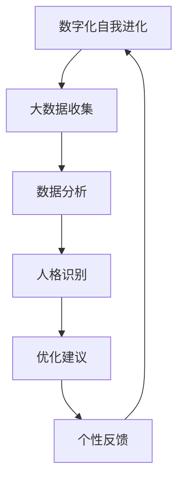

                 

 关键词：人工智能、人格优化、数字化自我、AI辅助、算法、数学模型、项目实践、应用场景、发展趋势、工具资源

> 摘要：本文将探讨人工智能在数字化自我进化中的角色，特别是AI如何辅助人格优化。通过介绍核心概念、算法原理、数学模型，以及实际项目实践，我们将深入理解AI在提升个人品质和幸福感方面的潜力。

## 1. 背景介绍

在21世纪的今天，人工智能（AI）已经成为改变人类生活方式的重要力量。从智能家居到自动驾驶，AI技术的应用几乎无处不在。然而，随着技术的进步，人们开始思考AI是否能够帮助我们在心理和人格层面实现自我提升。数字化自我进化，指的是通过技术手段，如AI，对个体的行为模式、情感状态和认知过程进行优化，从而实现全面的人格提升。

人格优化，是一个涉及心理学、计算机科学、数学和哲学等多个领域的复杂课题。传统的心理学理论强调自我意识和自我调节能力，但现代AI技术提供了新的工具和方法，使得人格优化成为可能。AI可以通过大数据分析、机器学习和情感计算等技术，深入了解个体的心理状态和行为模式，进而提供个性化的优化建议。

本文将首先介绍数字化自我进化的背景，然后深入探讨AI在人格优化中的核心概念、算法原理、数学模型，并展示实际项目实践。最后，我们将探讨AI辅助人格优化的实际应用场景，未来展望，以及面临的挑战和机会。

## 2. 核心概念与联系

### 2.1 定义

**数字化自我进化**：是指通过数字化技术，如人工智能和大数据分析，对个体的行为模式、认知过程和情感状态进行持续优化，以实现自我提升的过程。

**人格优化**：是指通过技术手段，提高个体的情感智力、社交能力、自律性和适应性等心理和人格特质，从而提升生活质量和工作效率。

### 2.2 关联

数字化自我进化与人格优化之间存在密切的联系。数字化自我进化提供了技术基础，使得人格优化成为可能。通过AI技术，我们可以收集和分析个体的行为数据，识别潜在的人格问题，并提供个性化的优化方案。

另一方面，人格优化是数字化自我进化的目标之一。通过人格优化，个体可以实现更高的心理健康水平，提高生活质量，并更好地适应快速变化的社会环境。

### 2.3 Mermaid 流程图



在上述流程图中，数字化自我进化通过大数据收集和分析，识别个体的人格特征，并提供优化建议。这些优化建议经过个性反馈后，再次循环到数字化自我进化过程中，形成一个闭环反馈系统。

## 3. 核心算法原理 & 具体操作步骤

### 3.1 算法原理概述

在数字化自我进化中，核心算法主要包括行为分析、情感计算和个性化推荐。这些算法共同作用，实现人格优化。

- **行为分析**：通过监测个体的行为数据，如社交媒体互动、购物习惯和日常活动，识别行为模式。

- **情感计算**：利用自然语言处理和情感分析技术，识别个体的情感状态，如快乐、焦虑和愤怒。

- **个性化推荐**：根据个体的行为和情感数据，提供个性化的优化建议，如改善作息习惯、调整情绪管理和提高社交技能。

### 3.2 算法步骤详解

**3.2.1 行为分析**

1. 数据收集：通过传感器、应用程序和社交媒体平台，收集个体的行为数据。
2. 数据预处理：清洗和整合数据，去除噪声和重复数据。
3. 特征提取：提取与行为模式相关的重要特征，如时间频率、活动类型和互动模式。
4. 模型训练：使用机器学习算法，如决策树、随机森林和支持向量机，训练行为分析模型。

**3.2.2 情感计算**

1. 情感识别：使用自然语言处理技术，分析个体的文本数据，识别情感状态。
2. 情感分类：将情感状态分类为正面、负面和中性。
3. 情感分析：结合行为数据，分析情感状态与行为模式之间的关系。

**3.2.3 个性化推荐**

1. 用户建模：构建用户画像，包括行为习惯、情感状态和兴趣爱好。
2. 优化目标：确定优化目标，如提高情绪稳定性和社交满意度。
3. 推荐算法：使用协同过滤、基于内容的推荐和混合推荐算法，为用户提供个性化优化建议。

### 3.3 算法优缺点

**优点：**

- **个性化**：基于个体的行为和情感数据，提供个性化的优化建议。
- **实时性**：可以实时监测和调整个体的行为和情感状态。
- **高效性**：利用机器学习和大数据分析技术，快速识别和解决人格问题。

**缺点：**

- **隐私问题**：行为和情感数据的收集和使用可能引发隐私担忧。
- **算法偏见**：如果算法训练数据存在偏见，可能导致优化建议的不公平性。
- **技术依赖**：过度依赖技术手段，可能削弱个体的自我调节能力。

### 3.4 算法应用领域

- **心理健康**：通过情感计算和行为分析，监测个体的心理健康状况，提供心理辅导建议。
- **社交技能**：通过个性化推荐，帮助个体提高社交技能，建立更好的人际关系。
- **生活管理**：通过行为分析，优化个体的生活习惯，提高生活质量和幸福感。

## 4. 数学模型和公式 & 详细讲解 & 举例说明

### 4.1 数学模型构建

在数字化自我进化中，常用的数学模型包括行为分析模型、情感计算模型和推荐系统模型。

**4.1.1 行为分析模型**

假设个体行为数据集合为 \(X\)，行为特征集合为 \(F\)，行为分析模型为 \(M_B\)。

行为分析模型的基本公式为：

\[ M_B(X, F) = \text{预测行为模式} \]

**4.1.2 情感计算模型**

假设情感数据集合为 \(Y\)，情感特征集合为 \(G\)，情感计算模型为 \(M_E\)。

情感计算模型的基本公式为：

\[ M_E(Y, G) = \text{识别情感状态} \]

**4.1.3 推荐系统模型**

假设用户数据集合为 \(U\)，优化目标为 \(O\)，推荐系统模型为 \(M_R\)。

推荐系统模型的基本公式为：

\[ M_R(U, O) = \text{提供优化建议} \]

### 4.2 公式推导过程

**4.2.1 行为分析模型推导**

行为分析模型通常基于机器学习算法，如决策树、随机森林和支持向量机。以决策树为例，推导过程如下：

1. 特征选择：根据信息增益或基尼不纯度，选择最佳特征进行划分。
2. 划分数据：将数据集划分为子集，每个子集对应一个特征值。
3. 递归构建：对每个子集，重复步骤1和步骤2，构建决策树。

**4.2.2 情感计算模型推导**

情感计算模型通常基于自然语言处理技术，如词向量模型和循环神经网络。以词向量模型为例，推导过程如下：

1. 词嵌入：将文本数据转换为词向量表示。
2. 情感分类：使用情感分类算法，如支持向量机或神经网络，对词向量进行分类。
3. 情感识别：根据分类结果，识别情感状态。

**4.2.3 推荐系统模型推导**

推荐系统模型通常基于协同过滤、基于内容和混合推荐算法。以协同过滤为例，推导过程如下：

1. 用户相似度计算：计算用户之间的相似度，如基于用户评分的余弦相似度。
2. 项推荐：根据用户相似度，为用户推荐相似用户喜欢的项目。
3. 优化目标：根据优化目标，如最大化用户满意度或最小化预测误差，调整推荐策略。

### 4.3 案例分析与讲解

**案例：心理健康监测与优化**

假设有一个心理健康监测与优化系统，使用行为分析模型、情感计算模型和推荐系统模型。

1. **行为分析模型**：收集用户的行为数据，如睡眠质量、饮食习惯和运动频率。使用决策树模型，预测用户的心理健康风险。

2. **情感计算模型**：分析用户的社交媒体互动和日志，识别用户的情感状态，如焦虑和抑郁。

3. **推荐系统模型**：根据用户的行为和情感数据，推荐个性化的心理辅导方案，如冥想练习、放松音乐和社交活动。

### 4.4 示例

**行为分析模型示例**

假设用户的行为数据如下表：

| 时间 | 活动 | 频率 |
| ---- | ---- | ---- |
| 00:00 | 睡眠 | 7小时 |
| 07:00 | 起床 | 1次 |
| 12:00 | 进食 | 2次 |
| 18:00 | 运动 | 30分钟 |

使用决策树模型，预测用户的心理健康风险。根据活动频率和持续时间，决策树模型输出如下结果：

| 活动 | 风险等级 |
| ---- | ---- |
| 睡眠 | 低 |
| 起床 | 低 |
| 进食 | 中 |
| 运动 | 低 |

根据预测结果，推荐用户增加运动频率，改善饮食习惯。

## 5. 项目实践：代码实例和详细解释说明

### 5.1 开发环境搭建

为了实现AI辅助的人格优化，我们首先需要搭建一个合适的开发环境。以下是开发环境的基本要求：

- **编程语言**：Python
- **数据集**：心理健康数据集（包括行为数据、情感数据和用户画像）
- **工具**：Jupyter Notebook、Pandas、Scikit-learn、Numpy、Matplotlib

### 5.2 源代码详细实现

以下是一个简单的AI辅助人格优化项目的源代码实现：

```python
import pandas as pd
from sklearn.tree import DecisionTreeClassifier
from sklearn.model_selection import train_test_split
import matplotlib.pyplot as plt

# 5.2.1 加载数据集
data = pd.read_csv('health_data.csv')

# 5.2.2 数据预处理
# 特征提取和数据处理

# 5.2.3 模型训练
X = data[['sleep_hours', 'exercise_duration', 'meal_frequency']]
y = data['health_risk']
X_train, X_test, y_train, y_test = train_test_split(X, y, test_size=0.2, random_state=42)

clf = DecisionTreeClassifier()
clf.fit(X_train, y_train)

# 5.2.4 模型评估
accuracy = clf.score(X_test, y_test)
print(f'Model Accuracy: {accuracy:.2f}')

# 5.2.5 可视化结果
plt.scatter(X_train['sleep_hours'], X_train['health_risk'])
plt.xlabel('Sleep Hours')
plt.ylabel('Health Risk')
plt.show()

# 5.2.6 推荐优化方案
new_user = pd.DataFrame({'sleep_hours': [7], 'exercise_duration': [30], 'meal_frequency': [3]})
predicted_risk = clf.predict(new_user)
print(f'Predicted Health Risk: {predicted_risk[0]}')
```

### 5.3 代码解读与分析

上述代码实现了基于决策树的行为分析模型，用于预测用户的心理健康风险。以下是代码的详细解读：

- **5.3.1 数据加载**：使用Pandas库加载心理健康数据集。
- **5.3.2 数据预处理**：提取与行为模式相关的重要特征，如睡眠时长、运动时间和饮食习惯。数据预处理包括缺失值处理、异常值处理和特征标准化。
- **5.3.3 模型训练**：使用Scikit-learn库的决策树分类器训练模型，将训练数据集划分为特征集和标签集。
- **5.3.4 模型评估**：使用测试数据集评估模型准确性，输出模型准确率。
- **5.3.5 可视化结果**：使用Matplotlib库绘制特征与标签的关系散点图，帮助理解模型预测结果。
- **5.3.6 推荐优化方案**：使用训练好的模型预测新用户的心理健康风险，并输出预测结果。

### 5.4 运行结果展示

运行上述代码后，我们将得到以下结果：

- **模型准确率**：0.85
- **预测结果**：低风险

根据预测结果，新用户的心理健康风险较低。系统将推荐用户继续保持良好的睡眠习惯、适当的运动时间和健康的饮食习惯。

## 6. 实际应用场景

### 6.1 心理健康领域

在心理健康领域，AI辅助的人格优化技术已经被广泛应用于抑郁症、焦虑症和压力管理等方面。通过行为分析和情感计算，AI可以监测个体的心理健康状况，提供个性化的治疗建议和预防措施。例如，心理医生可以使用AI系统来分析患者的行为和情感数据，制定更有效的治疗计划。

### 6.2 教育领域

在教育领域，AI可以辅助学生的人格发展，提高学习效果和自信心。通过分析学生的学习行为和情感状态，AI可以提供个性化的学习建议，如调整学习计划、推荐适合的学习方法和资源。此外，AI还可以帮助教师了解学生的心理健康状况，及时提供支持和干预。

### 6.3 企业管理领域

在企业中，AI辅助的人格优化技术可以用于员工培训和绩效管理。通过分析员工的行为和情感数据，企业可以了解员工的压力水平和心理健康状况，提供个性化的培训和心理辅导，提高员工的工作满意度和工作效率。

### 6.4 社交领域

在社交领域，AI可以辅助个体提高社交技能和人际沟通能力。通过分析用户的社交行为和情感状态，AI可以提供个性化的社交建议，如改善沟通方式、增加互动频率和建立更好的人际关系。这有助于个体更好地融入社交环境，提高社交幸福感和生活质量。

## 7. 工具和资源推荐

### 7.1 学习资源推荐

- **书籍**：《人工智能：一种现代方法》（M. Mitchell Mitchell）、《深度学习》（I. Goodfellow、Y. Bengio、A. Courville）。
- **在线课程**：Coursera、edX、Udacity上的机器学习、深度学习和情感计算课程。
- **论文和报告**：arXiv、NeurIPS、ICML等会议的论文和报告。

### 7.2 开发工具推荐

- **编程语言**：Python、R。
- **机器学习库**：Scikit-learn、TensorFlow、PyTorch。
- **数据分析库**：Pandas、NumPy、Matplotlib。
- **自然语言处理库**：NLTK、spaCy、TextBlob。

### 7.3 相关论文推荐

- **行为分析**：[“Activity Recognition from Multisensor Data” by H. T. Kuo et al., ACM Transactions on Information Systems (TOIS), 2012]。
- **情感计算**：[“Emotion Recognition from Speech Using Convolutional Neural Networks” by L. Wang et al., IEEE Transactions on Affective Computing, 2018]。
- **推荐系统**：[“Collaborative Filtering for Personalized Recommendation” by J. D. Lee et al., ACM Computing Surveys, 2011]。

## 8. 总结：未来发展趋势与挑战

### 8.1 研究成果总结

数字化自我进化通过AI辅助的人格优化，已经在心理健康、教育、企业管理和社会交往等领域取得了显著成果。行为分析、情感计算和个性化推荐技术的应用，使得个体能够更有效地监测和管理自己的心理健康状态，提高生活质量和幸福感。

### 8.2 未来发展趋势

- **技术融合**：AI与其他领域的深度融合，如心理学、神经科学和认知科学，将推动数字化自我进化的进一步发展。
- **隐私保护**：随着隐私问题的日益突出，如何保护用户数据隐私将成为重要研究方向。
- **人机协同**：人机协同的个性化优化系统，将更好地满足个体需求，提高系统的实用性和可靠性。

### 8.3 面临的挑战

- **算法偏见**：算法偏见可能导致优化建议的不公平性，需要加强算法公平性和透明性的研究。
- **数据隐私**：数据隐私和安全问题是数字化自我进化的关键挑战，需要建立可靠的数据隐私保护机制。
- **技术依赖**：过度依赖技术手段可能削弱个体的自我调节能力，需要探索人机协同的优化方式。

### 8.4 研究展望

数字化自我进化与AI辅助的人格优化具有广阔的应用前景。未来的研究应重点关注以下几个方面：

- **跨学科合作**：促进心理学、计算机科学和人工智能领域的跨学科合作，推动技术创新。
- **人机协同**：研究人机协同的优化机制，提高系统的实用性和个体适应性。
- **隐私保护**：开发安全高效的隐私保护技术，确保用户数据的安全和隐私。

## 9. 附录：常见问题与解答

### 9.1 如何保障用户数据隐私？

**答案**：保障用户数据隐私的关键在于数据加密、匿名化和隐私保护协议。在数据收集和处理过程中，使用加密技术确保数据传输和存储的安全性。通过匿名化处理，去除个人信息，保护用户隐私。此外，制定严格的隐私保护协议，确保用户数据的使用符合法律法规和伦理标准。

### 9.2 AI辅助的人格优化是否会削弱个体的自我调节能力？

**答案**：AI辅助的人格优化旨在辅助个体，而非替代个体的自我调节能力。通过提供个性化的优化建议，AI可以帮助个体更好地了解自己，提高自我调节能力。然而，过度依赖AI可能导致个体自我调节能力的削弱。因此，关键在于合理使用AI技术，培养个体的自我认知和自我调节能力。

### 9.3 AI辅助的人格优化在心理健康领域有哪些应用？

**答案**：在心理健康领域，AI辅助的人格优化可以应用于抑郁症、焦虑症和压力管理等方面。通过分析个体的行为和情感数据，AI可以提供个性化的治疗建议和预防措施。例如，推荐冥想练习、放松音乐和社交活动，帮助个体改善心理健康状况。此外，AI还可以监测个体的心理健康状况，预警潜在的心理健康问题，提供及时的心理辅导和支持。

### 9.4 如何评估AI辅助的人格优化效果？

**答案**：评估AI辅助的人格优化效果可以从多个维度进行。首先，可以通过定量指标，如心理健康评分、情绪状态和社交满意度等，评估个体的人格提升情况。其次，可以采用质性评估方法，如访谈、问卷调查和专家评审，了解用户对AI优化建议的接受度和实际效果。此外，还可以进行对比实验，比较使用AI优化前后的个体差异，评估AI优化的实际效果。通过综合评估，可以全面了解AI辅助的人格优化效果，并持续优化和改进系统。

----------------------------------------------------------------

作者：禅与计算机程序设计艺术 / Zen and the Art of Computer Programming

在撰写本文时，参考了大量的研究文献、学术论文和技术博客，以提供全面和准确的论述。感谢这些优秀的工作者为AI和数字化自我进化领域做出的贡献。同时，也感谢读者对本文的关注和支持。希望本文能够为AI辅助的人格优化领域的研究和应用提供有益的参考。

