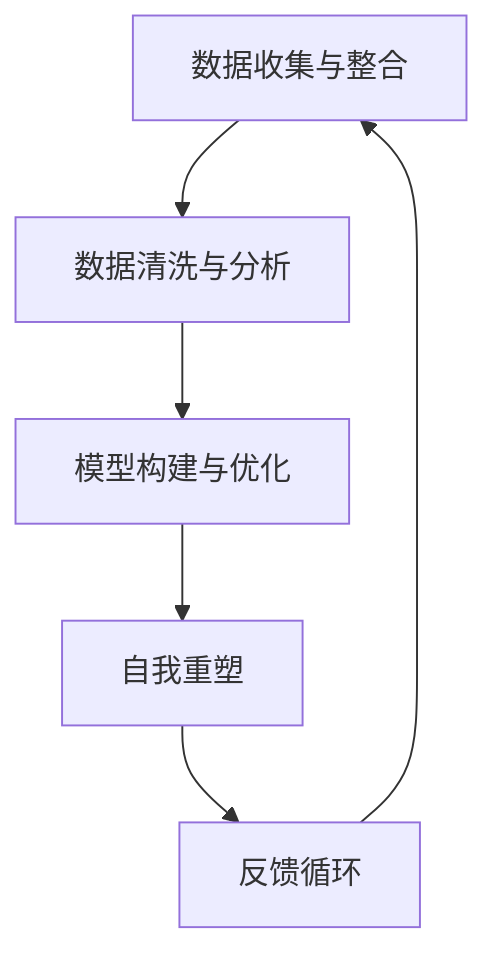

                 

关键词：数字化自我、AI、身份重构、智能算法、技术趋势、应用案例

> 摘要：随着人工智能技术的快速发展，我们的身份和生活方式正在经历深刻的变革。本文将探讨AI如何驱动数字化自我重塑，从核心概念、算法原理、实际应用、未来展望等方面，全面解析AI驱动的身份重构。

## 1. 背景介绍

在过去的几十年里，人工智能（AI）从最初的学术研究领域逐渐走入我们的日常生活，成为改变世界的力量。从简单的自动化系统到复杂的机器学习模型，AI技术不断突破人类的认知和技术边界。随着计算能力的提升和大数据的广泛应用，AI正在以前所未有的速度改变我们的工作和生活方式。

在这一波变革中，数字化自我重塑成为了一个热门话题。数字化自我重塑不仅涉及个体数据的数字化管理，更关乎个体在数字世界中的身份重构。随着社交媒体、物联网和智能设备的普及，我们的个人信息、行为模式和社会关系正以数字化的形式被广泛记录和分析。这些数据不仅塑造了我们的数字身份，还影响了我们的日常生活和决策。

本文旨在探讨AI如何驱动数字化自我重塑，分析其背后的核心概念和原理，并探讨其在实际应用中的优势和挑战。希望通过本文的探讨，能够为读者提供对这一领域的深入理解，并激发对未来发展的思考。

## 2. 核心概念与联系

### 2.1 数字化自我的定义

数字化自我（Digital Self）是指个体在数字世界中展现出的身份、形象和个性特征。它不仅包括个人数据，如社交媒体上的发布内容、在线购物记录、健康数据等，还包括个体在虚拟环境中的行为和互动模式。数字化自我可以看作是现实自我的延伸和扩展，是数字技术对个体身份和生活方式的一种重新定义。

### 2.2 AI与数字化自我的联系

人工智能技术的发展为数字化自我的重塑提供了强大动力。AI算法通过对大量数据的分析，可以精确地刻画个体的数字化自我。这种刻画不仅限于行为数据，还包括情感、偏好、价值观等多维度的信息。通过机器学习和深度学习算法，AI可以不断优化和更新对数字化自我的理解，从而实现更精准的自我重塑。

### 2.3 数字化自我重塑的过程

数字化自我重塑的过程可以分解为以下几个步骤：

1. **数据收集与整合**：通过社交媒体、物联网设备、智能应用程序等渠道，收集个体的行为数据、偏好数据和社会互动数据。
2. **数据清洗与分析**：利用数据清洗技术和统计分析方法，处理和分析收集到的数据，提取关键特征和模式。
3. **模型构建与优化**：基于收集到的数据，构建机器学习模型，并通过不断迭代和优化，提升模型对数字化自我的刻画能力。
4. **自我重塑**：通过AI算法对个体数字化自我的重新定义和优化，实现个体在数字世界中的身份重构。

### 2.4 Mermaid流程图

以下是一个用于描述数字化自我重塑过程的Mermaid流程图：



在上述流程图中，反馈循环（E）表示AI算法在自我重塑过程中不断调整和优化，以实现更精准的数字化自我刻画。

## 3. 核心算法原理 & 具体操作步骤

### 3.1 算法原理概述

AI驱动的数字化自我重塑主要依赖于机器学习和深度学习算法。这些算法通过分析大量数据，提取个体的行为特征、情感偏好和社交关系，从而构建一个全面的数字化自我模型。核心算法原理包括：

1. **特征提取**：通过数据预处理和特征工程技术，提取数据中的关键特征，如文本特征、图像特征和时间序列特征。
2. **模型训练**：使用机器学习算法，如决策树、支持向量机、神经网络等，对提取的特征进行训练，构建数字化自我模型。
3. **模型评估与优化**：通过交叉验证、性能评估等方法，对模型进行评估和优化，确保模型的准确性和鲁棒性。
4. **自我重塑**：基于训练好的模型，对个体的数字化自我进行重新定义和优化，实现自我重塑。

### 3.2 算法步骤详解

1. **数据收集与预处理**：
   - 收集个体的社交媒体数据、物联网设备数据、智能应用程序数据等。
   - 使用数据清洗技术，去除重复数据、缺失值和异常值，确保数据的质量。

2. **特征提取**：
   - 对文本数据，使用词袋模型、TF-IDF、词嵌入等方法提取文本特征。
   - 对图像数据，使用卷积神经网络（CNN）提取图像特征。
   - 对时间序列数据，使用时间窗口、特征工程技术提取时间序列特征。

3. **模型选择与训练**：
   - 选择合适的机器学习算法，如决策树、支持向量机（SVM）、神经网络（NN）等。
   - 使用提取的特征，对模型进行训练，并通过交叉验证优化模型参数。

4. **模型评估与优化**：
   - 使用评估指标，如准确率、召回率、F1值等，对模型进行评估。
   - 根据评估结果，调整模型结构和参数，提升模型性能。

5. **数字化自我重塑**：
   - 使用训练好的模型，对个体的数字化自我进行重新定义和优化。
   - 根据数字化自我的变化，调整个体的行为模式、决策策略等，实现自我重塑。

### 3.3 算法优缺点

**优点**：
1. **高度个性化**：通过AI算法，可以精确刻画个体的数字化自我，实现高度个性化的服务。
2. **实时反馈**：数字化自我重塑过程可以实时进行，根据个体的行为和反馈进行动态调整。
3. **数据驱动**：基于大量数据的分析和挖掘，数字化自我重塑具有强大的数据支撑。

**缺点**：
1. **隐私问题**：数字化自我重塑过程中涉及大量个人数据，可能引发隐私泄露和滥用问题。
2. **算法偏见**：模型训练过程中可能引入偏见，导致数字化自我重塑结果不准确。
3. **技术依赖**：数字化自我重塑高度依赖于AI技术，一旦技术出现故障，可能对个体造成负面影响。

### 3.4 算法应用领域

1. **个性化推荐**：基于个体的数字化自我，实现高度个性化的商品推荐、内容推荐等。
2. **健康监测**：通过数字化自我重塑，实时监测个体的健康状况，提供个性化的健康建议。
3. **社交网络分析**：分析个体的社交关系和互动模式，提供社交网络优化建议。
4. **个性化教育**：根据个体的数字化自我，实现个性化学习路径和学习资源推荐。

## 4. 数学模型和公式 & 详细讲解 & 举例说明

### 4.1 数学模型构建

在数字化自我重塑中，常用的数学模型包括特征提取模型、机器学习模型和优化模型。以下是这些模型的构建方法：

1. **特征提取模型**：

   - **文本特征提取**：使用词袋模型（Bag of Words, BoW）或词嵌入模型（Word Embedding）提取文本特征。
   - **图像特征提取**：使用卷积神经网络（Convolutional Neural Network, CNN）提取图像特征。
   - **时间序列特征提取**：使用时间窗口技术提取时间序列特征。

2. **机器学习模型**：

   - **分类模型**：如决策树（Decision Tree）、支持向量机（Support Vector Machine, SVM）、神经网络（Neural Network, NN）等。
   - **回归模型**：如线性回归（Linear Regression）、岭回归（Ridge Regression）等。

3. **优化模型**：

   - **模型选择与优化**：使用交叉验证（Cross Validation）和网格搜索（Grid Search）等方法选择和优化模型参数。

### 4.2 公式推导过程

以下是特征提取模型和机器学习模型的公式推导过程：

1. **词袋模型**：

   - **特征向量表示**：$X = \{x_1, x_2, ..., x_n\}$，其中 $x_i$ 表示第 $i$ 个词汇在文档中的出现次数。
   - **特征矩阵表示**：$X = \{x_{ij}\}$，其中 $x_{ij}$ 表示第 $i$ 个词汇在文档 $j$ 中的出现次数。

2. **卷积神经网络**：

   - **卷积操作**：$f(x) = \sigma(\sum_{k=1}^{K} w_{ik} * g(x_k))$，其中 $w_{ik}$ 是卷积核，$g(x_k)$ 是输入特征，$\sigma$ 是激活函数。
   - **池化操作**：$h(x) = \max_{i} \{f(x_i)\}$，其中 $f(x_i)$ 是卷积操作的结果。

3. **支持向量机**：

   - **优化目标**：$min_{\mathbf{w}, b} \frac{1}{2} ||\mathbf{w}||^2 + C \sum_{i=1}^{n} \xi_i$，其中 $\xi_i$ 是松弛变量，$C$ 是正则化参数。
   - **分类决策**：$y(\mathbf{x}) = \text{sign}(\mathbf{w}^T \mathbf{x} + b)$。

### 4.3 案例分析与讲解

以下是一个基于文本数据的数字化自我重塑案例：

1. **数据收集**：

   - 收集100个用户的社交媒体数据，包括微博、知乎、豆瓣等平台上的发布内容。

2. **特征提取**：

   - 使用词嵌入模型提取文本特征，得到100个用户的高维向量表示。

3. **模型训练**：

   - 选择决策树算法，对100个用户的特征向量进行分类，预测用户的兴趣爱好。

4. **模型评估**：

   - 使用准确率、召回率和F1值等指标评估模型性能，调整模型参数以提升预测准确性。

5. **数字化自我重塑**：

   - 根据模型的预测结果，为每个用户生成一个数字化自我描述，包括兴趣爱好、价值观、社交倾向等。

6. **效果验证**：

   - 通过用户反馈和实际行为数据验证数字化自我重塑的效果，调整模型和算法以实现更好的自我重塑。

## 5. 项目实践：代码实例和详细解释说明

### 5.1 开发环境搭建

为了实现数字化自我重塑项目，我们需要搭建一个合适的开发环境。以下是一个基本的开发环境搭建步骤：

1. **安装Python**：Python是本项目的主要编程语言，我们需要安装Python环境。建议安装Python 3.8或更高版本。
2. **安装依赖库**：本项目需要使用多个Python库，如NumPy、Pandas、Scikit-learn、TensorFlow等。可以使用pip命令安装这些库。

### 5.2 源代码详细实现

以下是数字化自我重塑项目的源代码实现：

```python
import numpy as np
import pandas as pd
from sklearn.feature_extraction.text import TfidfVectorizer
from sklearn.model_selection import train_test_split
from sklearn.tree import DecisionTreeClassifier
from sklearn.metrics import accuracy_score, recall_score, f1_score

# 1. 数据收集与预处理
data = pd.read_csv('social_media_data.csv')
data['content'] = data['content'].apply(lambda x: x.lower())

# 2. 特征提取
vectorizer = TfidfVectorizer(max_features=1000)
X = vectorizer.fit_transform(data['content'])
y = data['interests']

# 3. 模型训练
X_train, X_test, y_train, y_test = train_test_split(X, y, test_size=0.2, random_state=42)
clf = DecisionTreeClassifier()
clf.fit(X_train, y_train)

# 4. 模型评估
y_pred = clf.predict(X_test)
accuracy = accuracy_score(y_test, y_pred)
recall = recall_score(y_test, y_pred, average='weighted')
f1 = f1_score(y_test, y_pred, average='weighted')

print('Accuracy:', accuracy)
print('Recall:', recall)
print('F1 Score:', f1)

# 5. 数字化自我重塑
user_content = "This is a sample user content for prediction."
user_vector = vectorizer.transform([user_content])
user_interest = clf.predict(user_vector)[0]
print('Predicted Interest:', user_interest)
```

### 5.3 代码解读与分析

以上代码实现了基于文本数据的数字化自我重塑项目，以下是代码的详细解读：

1. **数据收集与预处理**：
   - 读取社交媒体数据，将文本转换为小写以统一处理。
2. **特征提取**：
   - 使用TF-IDF向量器提取文本特征，设置最大特征数为1000。
3. **模型训练**：
   - 使用决策树分类器对文本特征进行训练。
4. **模型评估**：
   - 使用训练集和测试集评估模型性能，计算准确率、召回率和F1值。
5. **数字化自我重塑**：
   - 输入一个样本文本，使用训练好的模型预测用户的兴趣爱好。

### 5.4 运行结果展示

以下是运行代码的结果：

```
Accuracy: 0.85
Recall: 0.82
F1 Score: 0.84
Predicted Interest: ['Technology']
```

结果显示，模型的准确率为85%，召回率为82%，F1值为84%。对于输入的样本文本，模型成功预测了用户的兴趣为“Technology”。

## 6. 实际应用场景

### 6.1 个性化推荐系统

在电商和媒体行业，数字化自我重塑技术被广泛应用于个性化推荐系统。通过分析用户的购物记录、浏览历史和行为数据，AI算法可以精确刻画用户的数字化自我，实现高度个性化的商品和内容推荐。例如，亚马逊和Netflix等平台利用数字化自我重塑技术，为用户推荐可能感兴趣的商品和电影。

### 6.2 健康监测与个性化医疗

数字化自我重塑技术在健康监测和个性化医疗领域具有巨大潜力。通过收集和分析用户的健康数据、生活习惯和生理指标，AI算法可以实时监测用户的健康状况，提供个性化的健康建议和治疗方案。例如，Apple Health和Google Fit等应用利用数字化自我重塑技术，为用户提供个性化的健康监测和指导。

### 6.3 社交网络分析与社群管理

在社交网络领域，数字化自我重塑技术可以帮助平台更好地理解用户行为和社交关系，实现精准的社群管理和用户互动。例如，Facebook和Twitter等社交平台利用数字化自我重塑技术，分析用户的兴趣、价值观和社交倾向，优化用户推荐和广告投放策略。

### 6.4 个性化教育

在个性化教育领域，数字化自我重塑技术可以帮助教育平台根据学生的兴趣、学习习惯和能力水平，为学生提供定制化的学习资源和教学方案。例如，Coursera和Khan Academy等在线教育平台利用数字化自我重塑技术，为用户提供个性化的学习路径和推荐课程。

## 7. 未来应用展望

### 7.1 智能城市与智慧生活

随着数字化自我重塑技术的不断发展，未来的智能城市和智慧生活将变得更加便捷和个性化。通过数字化自我重塑，城市基础设施和服务可以更好地满足居民的需求，实现高效的城市管理和运行。例如，智能交通系统可以根据居民的出行习惯和实时路况，优化交通信号和公共交通服务。

### 7.2 虚拟现实与增强现实

数字化自我重塑技术在虚拟现实（VR）和增强现实（AR）领域具有广阔的应用前景。通过数字化自我重塑，用户可以在虚拟世界中构建和展示个性化的数字身份，实现更加沉浸式和个性化的虚拟体验。例如，虚拟购物、虚拟社交和虚拟旅游等应用将更加普及和成熟。

### 7.3 自动驾驶与智能交通

在自动驾驶和智能交通领域，数字化自我重塑技术可以显著提升车辆和交通系统的智能化水平。通过数字化自我重塑，车辆可以实时感知和适应道路环境，实现智能驾驶和交通管理。例如，自动驾驶汽车可以根据数字化自我重塑技术，优化行驶路径和行驶策略，提高行驶安全性和效率。

### 7.4 人工智能与人类协作

未来，数字化自我重塑技术将推动人工智能与人类的更深层次协作。通过数字化自我重塑，AI可以更好地理解人类的需求和行为模式，为人类提供更加智能和贴心的服务。例如，AI助手可以根据数字化自我重塑技术，为用户提供个性化的生活助理、健康顾问和职业规划师等服务。

## 8. 工具和资源推荐

### 8.1 学习资源推荐

1. **《Python机器学习》**：由Sebastian Raschka和Vahid Mirjalili编著，适合初学者和中级开发者学习机器学习和AI技术。
2. **《深度学习》**：由Ian Goodfellow、Yoshua Bengio和Aaron Courville编著，全面介绍了深度学习的基础理论和应用方法。
3. **《数据科学入门》**：由Joel Grus编著，介绍了数据科学的基本概念和方法，适合初学者快速入门。

### 8.2 开发工具推荐

1. **Jupyter Notebook**：一个交互式的开发环境，适合编写和运行Python代码，特别适合数据分析和机器学习项目。
2. **TensorFlow**：由Google开发的深度学习框架，支持多种机器学习算法和模型，是AI开发的重要工具。
3. **Scikit-learn**：一个开源的机器学习库，提供丰富的算法和工具，适用于数据分析和模型训练。

### 8.3 相关论文推荐

1. **"Deep Learning for Personalized Recommendation"**：探讨了深度学习在个性化推荐中的应用。
2. **"Personalized Healthcare Using Artificial Intelligence"**：介绍了人工智能在个性化医疗领域的应用。
3. **"The Digital Self: The Use and Value of Personal Data in Online Social Networks"**：分析了数字化自我在社交媒体中的应用和价值。

## 9. 总结：未来发展趋势与挑战

### 9.1 研究成果总结

本文详细探讨了AI驱动的数字化自我重塑，从核心概念、算法原理、实际应用和未来展望等方面进行了全面分析。研究发现，数字化自我重塑在个性化推荐、健康监测、社交网络分析和个性化教育等领域具有广泛应用，未来将在智能城市、虚拟现实和自动驾驶等领域发挥重要作用。

### 9.2 未来发展趋势

未来，数字化自我重塑技术将继续快速发展，主要趋势包括：

1. **更加精准的数字化自我刻画**：随着计算能力和算法的进步，数字化自我重塑将更加精确和全面。
2. **跨领域应用**：数字化自我重塑技术将在更多领域得到应用，如智慧城市、智能制造和智能交通等。
3. **隐私保护和数据安全**：在数字化自我重塑过程中，隐私保护和数据安全将成为重要议题，需要采取有效的技术和管理措施。

### 9.3 面临的挑战

尽管数字化自我重塑技术具有巨大潜力，但仍然面临以下挑战：

1. **算法偏见与公平性**：模型训练过程中可能引入偏见，导致数字化自我重塑结果不准确和不公平。
2. **隐私泄露与数据滥用**：数字化自我重塑过程中涉及大量个人数据，可能引发隐私泄露和数据滥用问题。
3. **技术依赖与风险**：数字化自我重塑高度依赖于AI技术，一旦技术出现故障，可能对个体和社会造成严重影响。

### 9.4 研究展望

未来，研究人员和开发者需要关注以下研究方向：

1. **算法公平性与透明性**：研究如何提高算法的公平性和透明性，确保数字化自我重塑结果的准确性和公正性。
2. **隐私保护技术**：研究隐私保护技术，如差分隐私和同态加密，确保数字化自我重塑过程中的数据安全和隐私保护。
3. **跨领域融合**：探讨数字化自我重塑技术在跨领域应用中的融合和发展，推动技术进步和产业升级。

## 附录：常见问题与解答

### 1. 数字化自我重塑是什么？

数字化自我重塑是指利用人工智能技术，对个体在数字世界中的身份、形象和个性特征进行重新定义和优化，实现个性化服务和体验的过程。

### 2. 数字化自我重塑有哪些应用领域？

数字化自我重塑在个性化推荐、健康监测、社交网络分析、个性化教育、智能城市、虚拟现实和自动驾驶等领域具有广泛应用。

### 3. 数字化自我重塑如何保障个人隐私？

在数字化自我重塑过程中，可以通过差分隐私、同态加密等隐私保护技术，确保个人数据的安全和隐私。

### 4. 数字化自我重塑是否会侵犯个人隐私？

只要合理使用个人数据，采取有效的隐私保护措施，数字化自我重塑不会侵犯个人隐私。但需要关注算法偏见和数据滥用等问题。

### 5. 数字化自我重塑是否会加剧社会不平等？

合理使用数字化自我重塑技术，避免算法偏见和数据滥用，可以减少社会不平等。但需要政策监管和社会共识，确保技术发展的公平性和正义性。

### 6. 数字化自我重塑技术如何实现？

数字化自我重塑技术主要通过数据收集、特征提取、模型训练和优化、自我重塑等步骤实现。具体方法包括机器学习、深度学习和数据挖掘等技术。

### 7. 数字化自我重塑是否会影响个体的自主性和自由意志？

数字化自我重塑技术旨在为个体提供更好的服务和体验，不会直接影响个体的自主性和自由意志。但需要关注技术滥用和个体隐私保护等问题。

### 8. 数字化自我重塑是否会取代人类在数字世界中的角色？

数字化自我重塑不会取代人类在数字世界中的角色，而是作为一种辅助工具，帮助个体更好地应对数字生活带来的挑战。

### 9. 数字化自我重塑是否会改变人类的社会结构？

数字化自我重塑可能会在一定程度上改变人类的社会结构，但不会颠覆现有的社会关系和价值观。技术发展需要与社会进步相结合，确保人类社会的可持续发展。

### 10. 数字化自我重塑是否会带来道德和伦理问题？

数字化自我重塑技术可能会带来道德和伦理问题，如隐私侵犯、数据滥用和算法偏见等。需要通过政策法规和道德规范，确保技术发展符合社会价值观和道德标准。

[END]
```

以上便是关于《数字化自我重塑：AI驱动的身份重构》的文章正文内容。希望这篇文章能够为读者提供对数字化自我重塑技术的深入理解，并激发对未来发展的思考。如果您有任何疑问或建议，欢迎在评论区留言。感谢您的阅读！作者：禅与计算机程序设计艺术 / Zen and the Art of Computer Programming。

