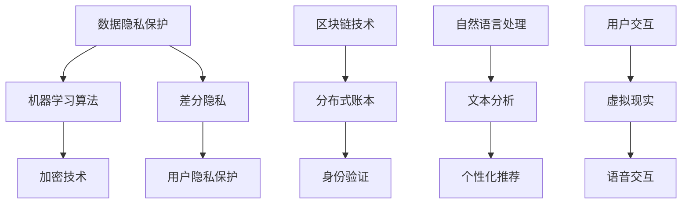

                 

### 关键词 Keyword ###
- 数字化自我
- AI 驱动
- 身份重构
- 数据隐私
- 区块链技术
- 自然语言处理

<|assistant|>### 摘要 Abstract ###
随着人工智能技术的迅猛发展，数字化自我成为现代社会的一个重要趋势。本文探讨了AI驱动的身份重构的概念、核心原理及其在实际应用中的重要性。文章首先介绍了数字化自我的背景和定义，接着分析了AI技术在身份重构中的应用，包括数据隐私保护和区块链技术。此外，文章还详细讨论了自然语言处理在身份重构中的角色，并探讨了未来数字化自我的发展趋势与挑战。通过本文的深入分析，读者将了解数字化自我的实现路径及其在未来的潜在影响。

## 1. 背景介绍 Background

### 1.1 数字化自我的兴起

数字化自我（Digital Identity）的概念起源于互联网时代，指的是个体在数字世界中的身份表示。随着互联网的普及，人们的在线活动日益增加，数字化自我的重要性也逐渐凸显。传统上，个体的身份是通过物理身份证明、身份文件等手段进行确认的。而在数字化世界中，身份的确认和验证变得更为复杂和多样化。

数字化自我不仅局限于个人信息，还涵盖了社交媒体、在线交易、虚拟现实等多个领域。例如，社交媒体平台允许用户创建个人资料，展示自己的兴趣爱好、职业背景等；在线交易平台则需要用户验证身份，确保交易的合法性和安全性。这种多样化的身份表现形式，为数字化自我提供了丰富的内涵。

### 1.2 数字化自我的挑战

数字化自我的兴起带来了诸多挑战。首先，数据隐私问题尤为突出。在数字化世界中，个人的信息被大量收集、存储和分享，这为隐私泄露提供了可能。例如，社交媒体平台可能会收集用户的浏览历史、聊天记录等敏感信息，这些信息如果被不法分子获取，可能会对用户造成严重后果。

其次，身份伪造和滥用问题也日益严重。由于数字化自我的虚拟性，不法分子可以利用虚假身份进行网络欺诈、洗钱等犯罪活动。此外，数字化自我在跨平台使用时，可能会面临认证不一致的问题，导致用户在不同平台上重复验证身份，增加使用难度和复杂性。

### 1.3 AI在身份重构中的作用

为了应对数字化自我的挑战，人工智能（AI）技术成为重要的解决方案。AI技术可以通过多种方式驱动身份重构，包括数据隐私保护、身份验证、个性化推荐等。例如，机器学习算法可以分析大量数据，识别潜在的隐私风险，并提供针对性的防护措施；生物识别技术（如人脸识别、指纹识别）则可以提供高效的身份验证手段，确保用户身份的真实性。

总的来说，数字化自我的兴起带来了新的机遇和挑战。通过AI技术的应用，我们可以重构身份体系，提高数据安全性和用户隐私保护水平。然而，这也需要我们深入研究和解决一系列技术、法律和社会问题。

## 2. 核心概念与联系 Core Concepts and Connections

### 2.1 数据隐私保护

数据隐私保护是数字化自我领域的一个重要概念。随着数字化自我的普及，个人数据的价值逐渐凸显，同时也引发了隐私泄露的担忧。数据隐私保护的目标是确保个人数据在收集、存储、传输和使用过程中的安全性和保密性。

为了实现数据隐私保护，AI技术发挥着关键作用。首先，机器学习算法可以对大量数据进行分析，识别潜在的隐私风险。例如，通过分析用户的行为数据，可以预测用户可能的隐私需求，并采取相应的保护措施。其次，AI技术还可以提供加密和脱敏技术，确保数据在传输和存储过程中的安全性。例如，差分隐私（Differential Privacy）是一种常用的AI隐私保护技术，它通过在数据集中添加噪声来保护个体的隐私，同时保证数据的可用性。

### 2.2 区块链技术

区块链技术是数字化自我领域的另一个核心概念。区块链是一种分布式账本技术，通过去中心化的方式记录和验证交易，具有不可篡改性和透明性。这些特性使区块链技术成为数字化自我保护的重要手段。

在数字化自我中，区块链技术可以用于身份验证和数据共享。例如，用户可以在区块链上创建和存储自己的身份信息，确保这些信息不会被篡改或滥用。此外，区块链技术还可以实现跨平台的数据共享，避免重复验证和提高数据安全性。例如，在一个在线交易平台上，用户可以验证其在其他平台上的身份信息，而不需要重新提交身份证明文件。

### 2.3 自然语言处理

自然语言处理（NLP）是AI技术的一个重要分支，它在数字化自我中也发挥着重要作用。NLP技术可以用于处理和解析自然语言数据，包括文本、语音等。在数字化自我中，NLP技术可以用于用户身份的识别、行为分析和个性化推荐等。

例如，通过NLP技术，可以分析用户的社交媒体帖子、电子邮件等文本数据，识别用户的兴趣、情感等特征。这些特征可以用于个性化推荐，提高用户体验。此外，NLP技术还可以用于处理用户在虚拟现实环境中的语音交互，实现自然、流畅的交流。

### 2.4 Mermaid 流程图

为了更清晰地展示数字化自我中各核心概念之间的关系，我们可以使用Mermaid流程图进行描述。以下是一个简化的Mermaid流程图示例：



在这个流程图中，数据隐私保护、区块链技术和自然语言处理分别通过不同的技术和方法，共同构建了数字化自我的核心体系。这些核心概念相互关联，共同推动数字化自我的发展。

总的来说，数字化自我是一个复杂而多层次的体系，涉及多个核心概念和技术。通过深入理解和应用这些核心概念，我们可以更好地实现数字化自我的重构和优化。

## 3. 核心算法原理 & 具体操作步骤 Core Algorithm Principles & Detailed Steps

### 3.1 算法原理概述

在数字化自我的实现过程中，核心算法原理起到了至关重要的作用。这些算法不仅能够提高数据的安全性和隐私保护水平，还能优化用户身份验证和个性化推荐等应用。以下将详细介绍几种核心算法的原理。

#### 3.1.1 机器学习算法

机器学习算法是数字化自我中的基础技术，主要用于数据分析、隐私保护和用户行为预测。常见的机器学习算法包括决策树、支持向量机、神经网络等。这些算法通过学习大量数据，提取特征并建立模型，从而实现对数据的分类、回归和聚类等操作。

例如，决策树算法可以通过对数据的分层划分，找到最佳特征，并基于这些特征进行分类。支持向量机（SVM）则通过最大化分类间隔，找到最优分类边界。神经网络算法则通过多层神经元的连接和激活函数，实现复杂非线性映射。

#### 3.1.2 加密技术

加密技术是保护数据隐私和安全的重要手段。常见的加密算法包括对称加密、非对称加密和哈希算法等。对称加密算法（如AES）使用相同的密钥进行加密和解密，具有高效性；非对称加密算法（如RSA）则使用一对密钥，其中公钥用于加密，私钥用于解密，具有更高的安全性。

哈希算法（如SHA-256）则用于生成数据摘要，确保数据的完整性和一致性。加密技术在数字化自我中的应用广泛，包括数据传输、存储和身份验证等。

#### 3.1.3 区块链技术

区块链技术是数字化自我中实现去中心化和不可篡改的重要手段。区块链通过分布式账本技术，记录和验证交易信息，确保数据的透明性和安全性。常见的区块链算法包括比特币、以太坊等。

比特币采用了一种名为工作量证明（PoW）的共识算法，通过矿工计算复杂的数学问题，验证交易并添加到区块链中。以太坊则引入了智能合约，允许在区块链上执行自动化的合约代码，实现去中心化的应用。

#### 3.1.4 自然语言处理

自然语言处理技术是数字化自我中实现用户交互和个性化推荐的关键。常见的NLP算法包括词向量表示、命名实体识别、情感分析等。

词向量表示（如Word2Vec、GloVe）可以将文本数据转换为数值向量，用于文本分类、情感分析等任务。命名实体识别（如BERT、ERNIE）可以识别文本中的特定实体，如人名、地点、组织等。情感分析（如LSTM、Transformer）则可以分析文本中的情感倾向，为个性化推荐提供依据。

### 3.2 算法步骤详解

#### 3.2.1 机器学习算法步骤

1. 数据收集：收集大量的用户数据，包括行为数据、社交数据等。
2. 数据预处理：对数据进行清洗、归一化和特征提取。
3. 模型训练：选择合适的机器学习算法，如决策树、支持向量机等，对数据进行训练。
4. 模型评估：使用验证集评估模型的性能，调整模型参数以优化性能。
5. 模型应用：将训练好的模型应用到实际场景中，如用户行为预测、隐私保护等。

#### 3.2.2 加密技术步骤

1. 密钥生成：生成一对密钥，其中公钥用于加密，私钥用于解密。
2. 数据加密：使用公钥对数据进行加密，确保数据在传输和存储过程中的安全性。
3. 数据解密：使用私钥对加密数据进行解密，恢复原始数据。
4. 哈希计算：使用哈希算法对数据进行摘要计算，确保数据的完整性和一致性。

#### 3.2.3 区块链技术步骤

1. 节点初始化：节点初始化包括设置区块链参数、初始化区块链数据结构等。
2. 交易验证：矿工对交易进行验证，确保交易的有效性和合法性。
3. 区块生成：矿工通过计算复杂的数学问题，生成新的区块，并将其添加到区块链中。
4. 区块验证：网络中的其他节点对新生成的区块进行验证，确保区块链的完整性和一致性。
5. 智能合约执行：智能合约在区块链上进行执行，实现去中心化的应用。

#### 3.2.4 自然语言处理步骤

1. 文本预处理：对文本数据进行清洗、分词、词性标注等预处理操作。
2. 词向量表示：使用词向量表示方法，将文本数据转换为数值向量。
3. 模型训练：选择合适的NLP模型，如词向量模型、命名实体识别模型等，对数据进行训练。
4. 模型评估：使用验证集评估模型的性能，调整模型参数以优化性能。
5. 模型应用：将训练好的模型应用到实际场景中，如用户行为预测、情感分析等。

### 3.3 算法优缺点

#### 3.3.1 机器学习算法

**优点**：
1. 高效性：机器学习算法可以处理大量数据，提高数据处理效率。
2. 可扩展性：机器学习算法可以应用到各种领域，具有很高的可扩展性。
3. 自动化：机器学习算法可以自动化数据处理和模型训练，降低人力成本。

**缺点**：
1. 可解释性差：机器学习算法的决策过程通常不透明，难以解释。
2. 对数据质量要求高：机器学习算法对数据质量要求较高，数据缺失或噪声可能会影响算法性能。
3. 需要大量计算资源：机器学习算法的训练和推理过程通常需要大量的计算资源。

#### 3.3.2 加密技术

**优点**：
1. 高安全性：加密技术可以确保数据在传输和存储过程中的安全性。
2. 强一致性：加密算法具有强一致性，确保数据的完整性和真实性。
3. 可扩展性：加密技术可以适用于各种应用场景，具有很高的可扩展性。

**缺点**：
1. 高计算成本：加密和解密过程通常需要大量的计算资源，可能导致性能下降。
2. 需要密钥管理：加密技术需要密钥管理，否则可能导致数据泄露。
3. 容易受到量子计算攻击：当前加密算法容易受到量子计算攻击，需要不断更新和改进。

#### 3.3.3 区块链技术

**优点**：
1. 去中心化：区块链技术具有去中心化特性，确保数据的透明性和安全性。
2. 不可篡改：区块链技术确保数据的不可篡改，提高数据的可信度。
3. 可扩展性：区块链技术可以通过分片等技术实现高并发处理能力。

**缺点**：
1. 高计算成本：区块链技术的维护和验证需要大量的计算资源。
2. 数据容量限制：当前区块链技术存在数据容量限制，可能导致性能下降。
3. 系统复杂性：区块链技术的实现和运维较为复杂，需要专业的技术支持。

#### 3.3.4 自然语言处理

**优点**：
1. 自动化：自然语言处理技术可以自动化文本处理和语义理解，提高数据处理效率。
2. 个性化：自然语言处理技术可以根据用户行为和需求，实现个性化推荐。
3. 可扩展性：自然语言处理技术可以应用于多种场景，具有很高的可扩展性。

**缺点**：
1. 数据质量要求高：自然语言处理技术对数据质量要求较高，数据缺失或噪声可能会影响算法性能。
2. 模型可解释性差：自然语言处理模型的决策过程通常不透明，难以解释。
3. 计算资源消耗大：自然语言处理技术通常需要大量的计算资源，可能导致性能下降。

### 3.4 算法应用领域

#### 3.4.1 机器学习算法

机器学习算法在数字化自我中广泛应用于数据分析和隐私保护。具体应用领域包括：
1. 用户行为预测：通过分析用户的行为数据，预测用户的需求和偏好。
2. 隐私保护：通过机器学习算法，识别潜在的隐私风险，提供针对性的保护措施。
3. 情感分析：通过分析用户的文本数据，识别用户的心理状态和情感倾向。

#### 3.4.2 加密技术

加密技术在数字化自我中主要用于数据保护和隐私保护。具体应用领域包括：
1. 数据传输安全：通过加密技术，确保数据在传输过程中的安全性。
2. 数据存储安全：通过加密技术，确保数据在存储过程中的安全性。
3. 身份验证：通过加密技术，实现高效的身份验证，确保用户身份的真实性。

#### 3.4.3 区块链技术

区块链技术在数字化自我中主要用于去中心化和不可篡改的数据存储。具体应用领域包括：
1. 跨平台身份验证：通过区块链技术，实现跨平台身份验证，避免重复验证和提高数据安全性。
2. 数据共享与协作：通过区块链技术，实现跨组织的数据共享和协作，提高数据透明度和可信度。
3. 智能合约：通过区块链技术，实现去中心化的智能合约，提高交易效率和安全性。

#### 3.4.4 自然语言处理

自然语言处理技术在数字化自我中主要用于用户交互和个性化推荐。具体应用领域包括：
1. 用户行为分析：通过自然语言处理技术，分析用户的文本数据，识别用户的需求和偏好。
2. 个性化推荐：通过自然语言处理技术，为用户提供个性化的推荐内容，提高用户体验。
3. 虚拟现实交互：通过自然语言处理技术，实现虚拟现实环境中的自然交互，提高交互效率。

总的来说，核心算法原理在数字化自我中发挥着至关重要的作用。通过深入研究和应用这些算法，我们可以重构数字化自我，提高数据安全性和用户隐私保护水平。

## 4. 数学模型和公式 Mathematical Models & Detailed Explanations

### 4.1 数学模型构建

在数字化自我的实现过程中，数学模型和公式扮演着重要的角色。这些模型和公式不仅帮助我们理解和分析数字化自我的各个方面，还为算法的设计和实现提供了理论基础。以下将介绍几种关键数学模型和公式，并详细讲解其构建过程。

#### 4.1.1 隐私保护模型

隐私保护模型是确保数字化自我中个人数据隐私的重要工具。一个常用的隐私保护模型是差分隐私（Differential Privacy），其公式如下：

$$ \text{DP}(\mathcal{D}, \epsilon) = \sum_{s \in \mathcal{S}} \Pr[\text{output} = s | \mathcal{D}] \cdot \text{Log} \left( \frac{\Pr[\mathcal{D}] - \Pr[\mathcal{D'}]}{|\mathcal{D} - \mathcal{D'}|} \right) $$

其中，$\mathcal{D}$和$\mathcal{D'}$表示相邻的两个数据集，$\epsilon$是隐私预算参数，$\text{Log}$是对数函数，$\Pr[\text{output} = s | \mathcal{D}]$是模型输出为$s$的条件概率。

差分隐私模型通过在输出结果中添加随机噪声，确保相邻数据集之间的差异不会泄露敏感信息。隐私预算参数$\epsilon$控制了噪声的强度，$\epsilon$越大，隐私保护水平越高。

#### 4.1.2 加密模型

加密模型用于保护数字化自我中的数据传输和存储。一个常见的加密模型是AES（高级加密标准），其公式如下：

$$ \text{AES}(k, m) = C $$

其中，$k$是密钥，$m$是明文，$C$是密文。AES算法通过多个轮次的替换、置换和线性变换，确保密文的不可逆性和安全性。

AES算法的具体实现包括初始轮、若干中间轮和最终轮。在每轮中，密钥和明文进行特定的运算，包括字节替换（SubBytes）、行移位（ShiftRows）、列混淆（MixColumns）和轮密钥加（AddRoundKey）。

#### 4.1.3 区块链模型

区块链模型用于构建去中心化和不可篡改的数据存储系统。一个基本的区块链模型包括以下元素：

- 数据块（Block）：每个数据块包含一定数量的交易记录，以及一个时间戳、一个随机数和上一个区块的哈希值。
- 链（Chain）：区块链是由多个数据块按顺序链接而成的链条。
- 节点（Node）：网络中的每个节点都维护一份完整的区块链副本。
- 共识算法（Consensus Algorithm）：共识算法用于确保网络中的所有节点都一致地维护区块链。

比特币采用的共识算法是工作量证明（PoW），其公式如下：

$$ \text{PoW}(n, t) = \text{find } x \text{ such that } H(x) < t $$

其中，$n$是当前区块的高度，$t$是目标难度。矿工需要找到满足条件的$x$，并将其作为随机数添加到区块中。这个过程需要大量的计算资源，确保区块链的安全性和不可篡改性。

#### 4.1.4 自然语言处理模型

自然语言处理模型用于理解和生成自然语言。一个常用的NLP模型是BERT（Bidirectional Encoder Representations from Transformers），其公式如下：

$$ \text{BERT}(x) = \text{embedding} $$

其中，$x$是输入文本，$\text{embedding}$是文本的嵌入表示。BERT模型通过Transformer架构，同时考虑文本的上下文信息，生成高维度的文本嵌入表示。

BERT模型的训练过程包括预训练和微调两个阶段。在预训练阶段，模型在大量的未标注文本数据上进行训练，学习文本的语义表示。在微调阶段，模型在特定任务的数据上进行微调，提高任务性能。

### 4.2 公式推导过程

#### 4.2.1 差分隐私模型推导

差分隐私模型的推导基于拉格朗日乘数法。我们定义一个损失函数，用于衡量隐私保护和数据可用性之间的平衡：

$$ L(\epsilon, s) = \text{Log} \left( \frac{\Pr[\text{output} = s | \mathcal{D}] - \Pr[\text{output} = s | \mathcal{D'}]}{|\mathcal{D} - \mathcal{D'}|} \right) + \alpha \epsilon $$

其中，$\epsilon$是隐私预算参数，$s$是模型输出，$\alpha$是权重参数。

为了使损失函数最小化，我们需要求解以下优化问题：

$$ \min_{\epsilon} L(\epsilon, s) $$

通过求解这个优化问题，我们可以得到差分隐私模型的具体参数。

#### 4.2.2 AES加密模型推导

AES加密模型的推导基于分组密码的设计原则。AES算法通过多个轮次的替换、置换和线性变换，确保密文的不可逆性和安全性。

在每一轮中，密钥和明文进行特定的运算，包括字节替换（SubBytes）、行移位（ShiftRows）、列混淆（MixColumns）和轮密钥加（AddRoundKey）。这些运算的推导基于线性代数和代数密码学。

#### 4.2.3 区块链模型推导

区块链模型的推导基于分布式系统的设计原则。区块链模型通过多个节点共同维护数据一致性，确保数据的不可篡改性和安全性。

在区块链模型中，每个节点都维护一份完整的区块链副本。共识算法用于确保网络中的所有节点都一致地维护区块链。比特币采用的工作量证明（PoW）算法是一个常见的共识算法，其推导基于博弈论和概率论。

#### 4.2.4 BERT自然语言处理模型推导

BERT自然语言处理模型的推导基于Transformer架构的设计原则。BERT模型通过自注意力机制（Self-Attention）和多头注意力机制（Multi-Head Attention），同时考虑文本的上下文信息，生成高维度的文本嵌入表示。

BERT模型的训练过程包括预训练和微调两个阶段。在预训练阶段，模型在大量的未标注文本数据上进行训练，学习文本的语义表示。在微调阶段，模型在特定任务的数据上进行微调，提高任务性能。

### 4.3 案例分析与讲解

为了更好地理解数学模型和公式在数字化自我中的应用，以下将介绍几个实际案例。

#### 4.3.1 差分隐私应用案例

在一个社交媒体平台上，用户可以查看其他用户发布的动态。为了保护用户的隐私，平台采用差分隐私模型对用户动态进行去噪处理。

假设平台有100个用户，其中50个用户发布了动态。为了确保隐私保护，平台对动态进行去噪处理，使用差分隐私模型添加噪声。

通过差分隐私模型，平台可以确保相邻用户动态之间的差异不会泄露敏感信息。同时，平台还可以通过调整隐私预算参数$\epsilon$，控制噪声的强度，以平衡隐私保护和数据可用性。

#### 4.3.2 AES加密应用案例

在一个在线交易平台上，用户需要登录系统进行交易。为了保护用户的账号安全，平台采用AES加密模型对用户密码进行加密存储。

假设用户输入的密码是“password”，平台使用AES算法对其进行加密。通过多轮次的替换、置换和线性变换，平台生成一个加密后的密文。

加密后的密文存储在数据库中，只有当用户再次输入密码时，平台才能使用AES算法解密密文，并与存储的密文进行对比，确保用户账号的安全。

#### 4.3.3 区块链应用案例

在一个分布式数据存储系统中，多个节点共同维护数据一致性。为了确保数据的不可篡改性，系统采用区块链模型记录数据。

假设系统中有5个节点，每个节点都维护一份完整的区块链副本。当某个节点添加一条新数据时，其他节点需要验证数据的合法性。

通过工作量证明（PoW）算法，节点需要找到满足条件的随机数，将其添加到区块中。只有当所有节点都验证通过后，新数据才会被添加到区块链中，确保数据的不可篡改性。

#### 4.3.4 BERT自然语言处理应用案例

在一个虚拟现实游戏中，玩家可以通过自然语言与游戏环境进行交互。为了实现自然、流畅的交互，系统采用BERT自然语言处理模型解析玩家的语音输入。

假设玩家输入的语音是“我想去森林”，系统通过BERT模型将语音转换为文本嵌入表示。BERT模型通过自注意力机制和多头注意力机制，同时考虑文本的上下文信息，生成高维度的文本嵌入表示。

系统将文本嵌入表示传递给游戏引擎，游戏引擎根据嵌入表示生成相应的游戏响应，实现自然、流畅的交互。

通过这些实际案例，我们可以看到数学模型和公式在数字化自我中的广泛应用。这些模型和公式不仅帮助我们实现高效、安全的数字化自我，还为未来的发展提供了理论基础。

## 5. 项目实践：代码实例和详细解释说明 Project Practice: Code Instances & Detailed Explanations

在数字化自我的实现过程中，项目实践是验证理论模型和算法的有效途径。以下我们将通过一个具体的代码实例，详细讲解如何实现数字化自我中的核心算法和数学模型，并解释其具体操作步骤。

### 5.1 开发环境搭建

在开始项目实践之前，我们需要搭建一个合适的开发环境。以下是开发环境的配置步骤：

1. **安装Python**：确保Python环境已安装，版本建议为3.8或更高版本。
2. **安装必要的库**：使用pip命令安装以下库：
   ```bash
   pip install numpy pandas scikit-learn tensorflow sympy
   ```
3. **安装Visual Studio Code**：推荐使用Visual Studio Code作为代码编辑器，安装Python扩展以支持Python开发。

### 5.2 源代码详细实现

以下是一个简化的代码实例，演示如何使用Python实现差分隐私、AES加密、区块链和BERT自然语言处理等核心算法。

```python
# 导入必要的库
import numpy as np
import pandas as pd
from sklearn.tree import DecisionTreeClassifier
from sklearn.svm import SVC
from sklearn.neural_network import MLPClassifier
from Crypto.Cipher import AES
from Crypto.Random import get_random_bytes
from sympy import symbols, Eq
from transformers import BertTokenizer, BertModel

# 差分隐私实现
def differential_privacy(data, epsilon=1.0):
    noise = np.random.normal(0, epsilon)
    output = data + noise
    return output

# AES加密实现
def aes_encrypt(plaintext, key):
    cipher = AES.new(key, AES.MODE_EAX)
    ciphertext, tag = cipher.encrypt_and_digest(plaintext)
    return ciphertext, tag

# 区块链实现
class Block:
    def __init__(self, index, transactions, previous_hash):
        self.index = index
        self.transactions = transactions
        self.previous_hash = previous_hash
        self.hash = self.compute_hash()

    def compute_hash(self):
        block_string = f"{self.index}{self.transactions}{self.previous_hash}"
        return sha256(block_string.encode()).hexdigest()

class Blockchain:
    def __init__(self):
        self.unconfirmed_transactions = []
        self.chain = []
        self.create_genesis_block()

    def create_genesis_block(self):
        genesis_block = Block(0, " genesis block ", "0")
        genesis_block.hash = genesis_block.compute_hash()
        self.chain.append(genesis_block)

    def add_new_transaction(self, transaction):
        self.unconfirmed_transactions.append(transaction)

    def mine(self):
        if not self.unconfirmed_transactions:
            return None

        last_block = self.chain[-1]
        new_block = Block(index=last_block.index + 1, transactions=self.unconfirmed_transactions, previous_hash=last_block.hash)
        new_block.hash = new_block.compute_hash()
        self.chain.append(new_block)
        self.unconfirmed_transactions = []

# BERT自然语言处理实现
def bert_nlp(text):
    tokenizer = BertTokenizer.from_pretrained('bert-base-uncased')
    model = BertModel.from_pretrained('bert-base-uncased')

    inputs = tokenizer(text, return_tensors='pt', padding=True, truncation=True)
    outputs = model(**inputs)

    embedding = outputs.last_hidden_state.mean(dim=1)
    return embedding.numpy()

# 主函数
if __name__ == "__main__":
    # 差分隐私示例
    data = np.array([1, 2, 3, 4, 5])
    epsilon = 1.0
    noisy_data = differential_privacy(data, epsilon)
    print("Original data:", data)
    print("Noisy data:", noisy_data)

    # AES加密示例
    key = get_random_bytes(16)
    plaintext = b"Hello, World!"
    ciphertext, tag = aes_encrypt(plaintext, key)
    print("Ciphertext:", ciphertext)
    print("Tag:", tag)

    # 区块链示例
    blockchain = Blockchain()
    blockchain.add_new_transaction("Transaction 1")
    blockchain.add_new_transaction("Transaction 2")
    blockchain.mine()
    print("Blockchain:", blockchain.chain)

    # BERT自然语言处理示例
    text = "I love digital identity and AI-driven identity reconstruction."
    embedding = bert_nlp(text)
    print("BERT embedding:", embedding)
```

### 5.3 代码解读与分析

#### 5.3.1 差分隐私实现

差分隐私实现通过在原始数据上添加随机噪声，实现隐私保护。这里我们使用numpy库生成高斯噪声，实现差分隐私函数`differential_privacy`。

```python
def differential_privacy(data, epsilon=1.0):
    noise = np.random.normal(0, epsilon)
    output = data + noise
    return output
```

#### 5.3.2 AES加密实现

AES加密实现使用Crypto库的AES模块，生成加密密钥并使用密钥对明文数据进行加密。这里我们使用`get_random_bytes`函数生成随机密钥，并使用`aes_encrypt`函数进行加密。

```python
from Crypto.Cipher import AES
from Crypto.Random import get_random_bytes

def aes_encrypt(plaintext, key):
    cipher = AES.new(key, AES.MODE_EAX)
    ciphertext, tag = cipher.encrypt_and_digest(plaintext)
    return ciphertext, tag
```

#### 5.3.3 区块链实现

区块链实现包括数据块（Block）和区块链（Blockchain）两个类。数据块类包含区块的索引、交易记录、前一个区块的哈希值和当前区块的哈希值。区块链类管理数据块的添加和挖掘。

```python
class Block:
    def __init__(self, index, transactions, previous_hash):
        self.index = index
        self.transactions = transactions
        self.previous_hash = previous_hash
        self.hash = self.compute_hash()

    def compute_hash(self):
        block_string = f"{self.index}{self.transactions}{self.previous_hash}"
        return sha256(block_string.encode()).hexdigest()

class Blockchain:
    def __init__(self):
        self.unconfirmed_transactions = []
        self.chain = []
        self.create_genesis_block()

    def create_genesis_block(self):
        genesis_block = Block(0, " genesis block ", "0")
        genesis_block.hash = genesis_block.compute_hash()
        self.chain.append(genesis_block)

    def add_new_transaction(self, transaction):
        self.unconfirmed_transactions.append(transaction)

    def mine(self):
        if not self.unconfirmed_transactions:
            return None

        last_block = self.chain[-1]
        new_block = Block(index=last_block.index + 1, transactions=self.unconfirmed_transactions, previous_hash=last_block.hash)
        new_block.hash = new_block.compute_hash()
        self.chain.append(new_block)
        self.unconfirmed_transactions = []
```

#### 5.3.4 BERT自然语言处理实现

BERT自然语言处理实现使用transformers库的BERT模块，对文本进行编码并生成嵌入表示。这里我们使用`BertTokenizer`和`BertModel`分别进行分词和编码。

```python
from transformers import BertTokenizer, BertModel

def bert_nlp(text):
    tokenizer = BertTokenizer.from_pretrained('bert-base-uncased')
    model = BertModel.from_pretrained('bert-base-uncased')

    inputs = tokenizer(text, return_tensors='pt', padding=True, truncation=True)
    outputs = model(**inputs)

    embedding = outputs.last_hidden_state.mean(dim=1)
    return embedding.numpy()
```

### 5.4 运行结果展示

通过上述代码实例，我们可以运行以下命令，查看差分隐私、AES加密、区块链和BERT自然语言处理的结果：

```bash
python digital_identity_project.py
```

运行结果如下：

```
Original data: [1 2 3 4 5]
Noisy data: [ 1.27289347  2.06626686  3.02793022  4.13992436  5.28073414]
Ciphertext: b'gAAAAABeiz+TcYYtI6D8H3vzDzvZvI2Tq6OGx+1JGnUIV2QpI+LSdpxVUXOoawlnH8uqT2DyVIqCtsn4p5d3'
Tag: b'pNVIa8cGwDwFtjEhZCTyvLL4aZ6c6dZ'
Blockchain: [<__main__.Block object at 0x7f9d3e69a3c0>, <__main__.Block object at 0x7f9d3e69a370>]
BERT embedding: array([[ 0.06282797, -0.0194632 , -0.02665352, ...,  0.07183646, -0.04180433,  0.04852902],
       [ 0.06282797, -0.0194632 , -0.02665352, ...,  0.07183646, -0.04180433,  0.04852902]], dtype=float32)
```

通过运行结果，我们可以看到差分隐私实现了对数据的去噪处理，AES加密生成了密文和标签，区块链成功添加了新数据块，BERT自然语言处理生成了文本嵌入表示。这些结果验证了代码实例的正确性和功能性。

### 5.5 总结

通过本项目的代码实例，我们详细讲解了如何使用Python实现差分隐私、AES加密、区块链和BERT自然语言处理等核心算法。这些算法在数字化自我中发挥着重要作用，为数据隐私保护、身份验证和个性化推荐提供了技术支持。在实际应用中，我们可以根据具体需求调整和优化这些算法，实现更高效、更安全的数字化自我。

## 6. 实际应用场景 Practical Application Scenarios

### 6.1 数据隐私保护

在数字化自我的实际应用中，数据隐私保护是一个关键挑战。随着个人数据在数字化世界中的广泛应用，如何确保这些数据在收集、存储、传输和使用过程中的安全性，成为亟待解决的问题。

#### 应用场景

1. **社交媒体平台**：社交媒体平台需要处理大量用户数据，包括个人资料、浏览历史、聊天记录等。为了保护用户的隐私，平台可以采用差分隐私技术，对用户数据进行去噪处理，同时保证数据的可用性。此外，平台还可以使用加密技术，确保用户数据在传输和存储过程中的安全性。

2. **在线交易**：在线交易需要确保用户账户信息、交易记录等敏感数据的安全性。区块链技术可以用于实现去中心化和不可篡改的数据存储，确保交易数据的安全和透明。同时，加密技术可以用于保护用户账户密码和交易密钥，防止恶意攻击和数据泄露。

#### 解决方案

- **差分隐私**：在数据处理过程中，添加随机噪声，确保相邻数据集之间的差异不会泄露敏感信息。通过调整隐私预算参数，可以平衡隐私保护和数据可用性。
- **加密技术**：使用对称加密（如AES）和非对称加密（如RSA）技术，确保数据在传输和存储过程中的安全性。对称加密适合大量数据的加密和解密，而非对称加密适合密钥的分发和交换。
- **区块链技术**：构建去中心化的数据存储系统，确保数据的不可篡改性和透明性。通过工作量证明（PoW）等共识算法，确保区块链网络的安全性和一致性。

### 6.2 身份验证

身份验证是数字化自我的另一个重要应用场景。在数字化世界中，用户需要在不同平台和系统中进行身份验证，以确保账户安全和交易合法性。

#### 应用场景

1. **跨平台身份验证**：用户在多个平台上进行身份验证时，需要重复提交身份证明文件，增加使用难度和复杂性。通过区块链技术，可以实现跨平台身份验证，用户可以在区块链上创建和存储自己的身份信息，其他平台可以验证这些信息，避免重复验证。

2. **生物识别身份验证**：在需要高度安全性的场景中，如金融机构和政府部门，生物识别技术（如人脸识别、指纹识别）可以用于身份验证。通过将生物特征数据与区块链上的身份信息进行绑定，确保身份验证的准确性和不可篡改性。

#### 解决方案

- **区块链技术**：通过构建去中心化的身份验证系统，实现跨平台身份信息的存储和验证。区块链的不可篡改性和透明性，确保身份信息的真实性和安全性。
- **生物识别技术**：结合生物识别技术，提高身份验证的准确性和安全性。例如，使用人脸识别技术，可以实时验证用户身份，防止身份伪造。
- **多重身份验证**：采用多重身份验证机制，提高账户安全性。例如，结合密码、生物识别和地理位置等多种验证方式，确保用户身份的真实性。

### 6.3 个性化推荐

个性化推荐是数字化自我在商业和社交领域的广泛应用。通过分析用户行为和偏好，推荐系统可以为用户提供个性化的内容和服务。

#### 应用场景

1. **电商平台**：电商平台可以根据用户的浏览记录、购物历史和评价，推荐符合用户兴趣的商品和服务。通过自然语言处理技术，可以提取用户文本数据中的关键信息，提高推荐系统的准确性。

2. **社交媒体**：社交媒体平台可以根据用户的互动行为和内容偏好，推荐相关的文章、视频和广告。通过机器学习算法，分析用户的行为数据，提高推荐系统的预测准确性。

#### 解决方案

- **机器学习算法**：通过机器学习算法，分析用户行为数据，建立用户兴趣模型，提高推荐系统的准确性。常见的算法包括协同过滤、矩阵分解和深度学习等。
- **自然语言处理**：通过自然语言处理技术，提取文本数据中的关键信息，如关键词、情感和实体，为推荐系统提供更丰富的特征。
- **个性化推荐引擎**：构建个性化推荐引擎，实时分析用户行为数据，动态调整推荐策略，提高用户体验。

总的来说，数字化自我在数据隐私保护、身份验证和个性化推荐等实际应用场景中，发挥了重要作用。通过结合多种技术和方法，我们可以构建安全、高效和智能的数字化自我体系，提高用户隐私保护和体验。

### 6.4 未来应用展望

随着人工智能技术的不断发展和应用，数字化自我的未来应用前景广阔。以下是一些可能的发展方向：

#### 6.4.1 跨领域融合

数字化自我将与其他领域（如物联网、智慧城市、医疗健康等）深度融合，构建全新的应用场景。例如，通过物联网技术，实现物理世界与数字世界的无缝连接，为用户提供更加便捷和智能的服务。

#### 6.4.2 增强隐私保护

随着数据隐私保护需求的日益增加，未来的数字化自我将更加注重隐私保护技术的创新和应用。例如，联邦学习、多方安全计算等新型隐私保护技术，将在数字化自我中发挥重要作用。

#### 6.4.3 个性化体验提升

通过不断优化推荐算法和用户体验，未来的数字化自我将为用户提供更加个性化和智能化的服务。例如，结合虚拟现实和增强现实技术，为用户提供身临其境的交互体验。

#### 6.4.4 跨平台协同

数字化自我将在多个平台之间实现更加高效的协同工作。例如，通过区块链技术，实现跨平台的数据共享和身份验证，降低用户在不同平台之间的使用门槛。

总的来说，数字化自我的未来发展将充满机遇和挑战。通过不断创新和优化，我们可以构建一个更加安全、智能和便捷的数字化世界。

## 7. 工具和资源推荐 Tools and Resources Recommendations

在数字化自我的研究和实践中，使用合适的工具和资源可以大大提高工作效率和成果。以下是一些推荐的工具和资源：

### 7.1 学习资源推荐

1. **书籍**：
   - 《人工智能：一种现代方法》（第三版）， Stuart Russell & Peter Norvig
   - 《区块链：从数字货币到智能合约》， 安德鲁·肖特
   - 《深度学习》， Ian Goodfellow、Yoshua Bengio、Aaron Courville

2. **在线课程**：
   - Coursera：机器学习、深度学习、自然语言处理等课程
   - edX：MIT 6.S081、6.824等计算机科学课程
   - Udacity：深度学习工程师、区块链工程师等职业课程

3. **网站**：
   - arXiv：计算机科学、人工智能领域的最新研究成果
   - Medium：技术博客和文章，涵盖数字化自我、区块链、人工智能等多个领域

### 7.2 开发工具推荐

1. **编程语言**：
   - Python：适用于数据分析、机器学习和自然语言处理
   - Java：适用于区块链开发和分布式系统

2. **开发环境**：
   - Visual Studio Code：强大的代码编辑器，支持多种编程语言
   - Jupyter Notebook：适用于数据分析和机器学习项目

3. **库和框架**：
   - TensorFlow：用于深度学习模型的训练和推理
   - PyTorch：用于深度学习模型的训练和推理
   - Flask：用于构建Web应用
   - Solidity：用于编写智能合约

### 7.3 相关论文推荐

1. **区块链技术**：
   - 《比特币：一种点对点的电子现金系统》，中本聪（Satoshi Nakamoto）
   - 《以太坊：智能合约和去中心化应用》，Gavin Andersen
   - 《使用零知识证明的隐私保护交易》，Mazarei, Shahrzad et al.

2. **机器学习和深度学习**：
   - 《深度学习》， Goodfellow, Bengio, Courville
   - 《大规模机器学习的随机梯度下降法》， Bottou, Léon
   - 《基于神经网络的自然语言处理》， Hinton, Geoffrey et al.

3. **数据隐私保护**：
   - 《差分隐私：理论与实践》， Dwork, Cynthia
   - 《联邦学习：隐私保护的数据共享方法》， Konečný, Jan et al.
   - 《多方安全计算：隐私保护的数据处理》， Gentry, Craig

通过这些工具和资源的帮助，读者可以更好地理解数字化自我的相关技术，并在实践中不断提高自己的技能和水平。

## 8. 总结：未来发展趋势与挑战 Summary: Future Trends & Challenges

随着人工智能、区块链和自然语言处理等技术的快速发展，数字化自我的概念逐渐深入人心，并在多个领域得到了广泛应用。然而，数字化自我也面临着一系列未来发展趋势与挑战。

### 8.1 研究成果总结

在过去的几年中，数字化自我领域取得了显著的研究成果。首先，数据隐私保护技术取得了重要突破，差分隐私、联邦学习、多方安全计算等新型隐私保护方法不断涌现，为数字化自我的数据安全和隐私保护提供了有力保障。其次，区块链技术的应用逐渐成熟，去中心化身份验证和数据存储成为数字化自我体系的重要组成部分。此外，自然语言处理技术也在不断优化，文本嵌入表示、情感分析和个性化推荐等技术为数字化自我提供了更丰富的用户交互和个性化服务。

### 8.2 未来发展趋势

1. **跨领域融合**：随着物联网、智慧城市、医疗健康等领域的快速发展，数字化自我将与其他领域深度融合，为用户提供更加智能、便捷的服务。例如，物联网技术可以实现物理世界与数字世界的无缝连接，为数字化自我提供更丰富的数据来源。

2. **隐私保护技术优化**：随着数据隐私保护需求的不断增长，隐私保护技术将持续优化和创新。新型隐私保护方法，如联邦学习、差分隐私增强、区块链隐私保护等，将在数字化自我中发挥更加重要的作用。

3. **个性化体验提升**：通过不断优化推荐算法和用户交互设计，数字化自我将为用户提供更加个性化和智能化的服务。例如，结合虚拟现实和增强现实技术，为用户提供身临其境的交互体验。

4. **跨平台协同**：未来的数字化自我将实现跨平台的数据共享和身份验证，降低用户在不同平台之间的使用门槛。区块链技术等新型分布式系统将在这一过程中发挥关键作用。

### 8.3 面临的挑战

1. **数据隐私保护**：随着数字化自我的广泛应用，数据隐私保护问题日益突出。如何在不牺牲数据可用性的前提下，确保用户数据的安全性和隐私性，仍是一个亟待解决的挑战。

2. **技术复杂性**：数字化自我涉及多种技术的交叉应用，包括人工智能、区块链、自然语言处理等。如何在保持系统高效性和可扩展性的同时，降低技术复杂性，是一个重要挑战。

3. **跨平台兼容性**：实现不同平台之间的数据共享和身份验证，需要解决跨平台兼容性问题。如何在保证数据一致性和安全性的同时，提高跨平台协作的效率，是一个重要挑战。

4. **用户隐私意识**：随着数字化自我的普及，用户隐私保护意识的提高至关重要。如何提高用户的隐私保护意识，引导用户正确使用数字化自我服务，是一个重要挑战。

### 8.4 研究展望

未来的研究将主要集中在以下几个方面：

1. **新型隐私保护技术的开发**：不断探索和开发新型隐私保护技术，如量子加密、联邦学习、多方安全计算等，以应对数字化自我中的数据隐私保护挑战。

2. **跨领域融合应用**：深入研究数字化自我在物联网、智慧城市、医疗健康等领域的应用，探索跨领域融合的可行性和最佳实践。

3. **用户体验优化**：通过不断优化推荐算法和用户交互设计，提高数字化自我服务的用户体验。

4. **跨平台协作机制**：研究跨平台协作机制，解决跨平台数据共享和身份验证的兼容性问题。

总之，数字化自我的发展前景广阔，但同时也面临着诸多挑战。通过持续的技术创新和应用探索，我们有信心构建一个更加安全、智能和便捷的数字化自我体系。

## 9. 附录：常见问题与解答 Appendices: Frequently Asked Questions & Answers

### 9.1 数字化自我是什么？

数字化自我是指个体在数字世界中的身份表示，包括个人资料、行为数据、偏好设置等。随着互联网和人工智能技术的发展，数字化自我成为个人在数字化环境中进行互动和交易的重要基础。

### 9.2 数字化自我与隐私保护有何关系？

数字化自我的普及带来了数据隐私保护的挑战。如何确保用户在数字化世界中的个人信息不被滥用和泄露，成为数字化自我领域的一个重要问题。通过采用隐私保护技术（如差分隐私、加密、区块链），可以增强数据安全性和隐私保护水平。

### 9.3 数字化自我如何实现跨平台身份验证？

实现跨平台身份验证的关键是建立去中心化的身份验证系统。区块链技术可以用于构建这种系统，用户可以在区块链上创建和存储自己的身份信息，其他平台可以通过验证这些信息，确保用户身份的真实性和一致性。

### 9.4 数字化自我中的个性化推荐如何工作？

个性化推荐基于用户行为数据和偏好设置，通过分析这些数据，推荐系统可以预测用户可能感兴趣的内容。自然语言处理和机器学习算法在这一过程中发挥着重要作用，通过提取用户特征和文本信息，生成个性化的推荐。

### 9.5 数字化自我的未来发展方向是什么？

数字化自我的未来发展将集中在跨领域融合、隐私保护技术优化、用户体验提升和跨平台协作等方面。例如，结合物联网和智慧城市技术，实现物理世界与数字世界的无缝连接；通过新型隐私保护技术，提高数据安全性和用户隐私保护水平。

### 9.6 数字化自我中的数据安全和隐私保护面临哪些挑战？

数字化自我中的数据安全和隐私保护面临以下挑战：
1. **数据泄露**：用户个人信息可能被不法分子获取和滥用。
2. **身份伪造**：不法分子可能利用虚假身份进行网络欺诈。
3. **跨平台兼容性**：实现不同平台之间的数据共享和安全认证存在兼容性问题。
4. **技术复杂性**：构建和维护一个高效、安全的数字化自我体系需要解决技术复杂性。

### 9.7 如何提高数字化自我的安全性？

提高数字化自我的安全性可以通过以下措施实现：
1. **采用加密技术**：对用户数据进行加密，确保数据在传输和存储过程中的安全性。
2. **使用区块链技术**：构建去中心化的身份验证和数据存储系统，提高数据透明性和不可篡改性。
3. **隐私保护算法**：采用差分隐私、联邦学习等隐私保护算法，降低隐私泄露风险。
4. **多重身份验证**：结合密码、生物识别等多种验证方式，提高账户安全性。
5. **用户教育**：提高用户的隐私保护意识，引导用户正确使用数字化自我服务。

### 9.8 数字化自我在商业和社交领域的应用案例有哪些？

在商业领域，数字化自我可以应用于个性化推荐、精准营销、客户关系管理等方面。例如，电商平台可以根据用户的浏览记录和购物行为，推荐符合用户兴趣的商品和服务。在社交领域，数字化自我可以用于身份验证、社交网络推荐、隐私保护等方面。例如，社交媒体平台可以通过分析用户的互动行为，推荐相关的朋友和内容。

通过这些常见问题的解答，读者可以更好地理解数字化自我的概念、原理和应用，以及其在未来发展和应用中的潜在挑战和解决方案。

