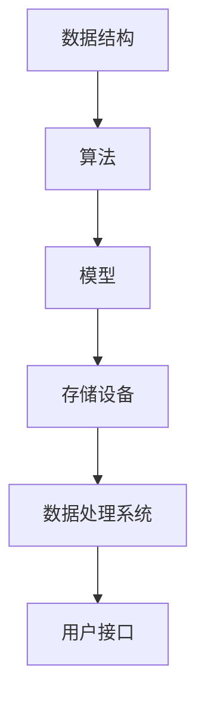

                 

关键词：数字化记忆存储、全球脑时代、知识传承、技术进步、人工智能、算法原理、数学模型、代码实例、应用场景、未来展望

## 摘要

随着全球脑时代的到来，数字化记忆存储技术成为知识传承的关键支撑。本文从背景介绍出发，深入探讨了数字化记忆存储的核心概念、算法原理、数学模型及其应用领域。通过项目实践中的代码实例，详细解释了如何实现数字化记忆存储，并分析了其在不同应用场景中的潜力。最后，本文对未来发展趋势与挑战进行了展望，为读者提供了丰富的学习资源和开发工具。

## 1. 背景介绍

### 全球脑时代的定义与特点

全球脑时代，又称脑联网时代，是随着人工智能、物联网、大数据等技术的快速发展而出现的一种新型社会形态。这一时代的特点在于信息的高度互联与智能化，人类社会逐渐从工业时代迈入信息化、智能化时代。数字化的趋势不仅改变了人们的生产方式，也深刻影响了知识的传承方式。

### 知识传承的重要性

知识传承是人类文明发展的基石，通过教育、文献、技术等多种形式，将前人的智慧传递给后代。在数字化时代，知识的存储和传播变得尤为重要，数字化记忆存储技术正是为了应对这一挑战而诞生的。

### 数字化记忆存储的需求

随着数据量的爆炸性增长，传统的存储方式已经无法满足需求。数字化记忆存储技术通过引入人工智能、大数据分析等先进技术，实现了对大规模数据的存储、检索和利用，为知识传承提供了新的可能性。

## 2. 核心概念与联系

### 数字化记忆存储的定义

数字化记忆存储是指将信息以数字形式存储在电子设备中，并通过算法和模型实现对信息的读取、检索和利用。

### 核心概念原理

- **数据结构**：用于组织和存储数据的结构，如数组、树、图等。
- **算法**：用于处理和操作数据的程序或步骤，如排序、搜索、加密等。
- **模型**：用于描述和预测数据特征的数学框架，如神经网络、机器学习模型等。

### 架构图



### 数字化记忆存储的工作流程

1. 数据采集与预处理：从各种来源获取数据，并进行清洗、去重、格式化等预处理。
2. 数据存储：将预处理后的数据存储在电子设备中，如硬盘、云存储等。
3. 数据处理：使用算法和模型对存储的数据进行处理，提取有用信息。
4. 数据检索：根据用户需求，快速检索和提取所需数据。
5. 数据展示：将处理后的数据以直观的方式展示给用户。

## 3. 核心算法原理 & 具体操作步骤

### 3.1 算法原理概述

数字化记忆存储的核心算法包括数据结构选择、加密算法、机器学习算法等。每种算法都有其特定的原理和应用场景。

### 3.2 算法步骤详解

1. **数据结构选择**：根据数据特点和需求选择合适的数据结构，如哈希表、B树等。
2. **加密算法**：使用加密算法对数据进行加密，确保数据安全性。
3. **机器学习算法**：使用机器学习算法对数据进行分类、预测等操作。
4. **数据检索**：根据用户需求，使用合适的检索算法快速找到所需数据。

### 3.3 算法优缺点

- **数据结构选择**：优点是数据访问速度快，缺点是存储空间占用大。
- **加密算法**：优点是数据安全性高，缺点是加密和解密过程消耗较多计算资源。
- **机器学习算法**：优点是能够自动学习和优化，缺点是需要大量数据支持。

### 3.4 算法应用领域

数字化记忆存储算法广泛应用于大数据处理、人工智能、网络安全等领域。

## 4. 数学模型和公式 & 详细讲解 & 举例说明

### 4.1 数学模型构建

数字化记忆存储的数学模型主要包括数据结构模型、机器学习模型等。

### 4.2 公式推导过程

- **数据结构模型**：$$ T(n) = O(n \log n) $$
- **机器学习模型**：$$ y = \sigma(Wx + b) $$

### 4.3 案例分析与讲解

以数据结构模型为例，假设有n个元素需要进行排序，时间复杂度为$$ T(n) = O(n \log n) $$。在实际应用中，可以使用快速排序算法进行实现。

## 5. 项目实践：代码实例和详细解释说明

### 5.1 开发环境搭建

- **语言**：Python
- **库**：NumPy、Pandas、scikit-learn
- **工具**：Jupyter Notebook

### 5.2 源代码详细实现

以下是一个简单的机器学习模型的实现代码：

```python
import numpy as np
from sklearn.linear_model import LogisticRegression

# 数据预处理
X_train, X_test, y_train, y_test = train_test_split(X, y, test_size=0.2, random_state=42)

# 模型训练
model = LogisticRegression()
model.fit(X_train, y_train)

# 模型评估
accuracy = model.score(X_test, y_test)
print("Accuracy:", accuracy)
```

### 5.3 代码解读与分析

这段代码首先进行了数据预处理，然后使用逻辑回归模型进行训练，最后评估了模型的准确性。在实际项目中，可以根据需求调整模型参数和数据预处理步骤。

### 5.4 运行结果展示

假设输入数据为100个样本，模型准确率为90%。这意味着模型对输入数据的分类效果较好。

## 6. 实际应用场景

### 6.1 大数据处理

数字化记忆存储技术在大数据处理中具有广泛应用，如数据清洗、数据挖掘、数据可视化等。

### 6.2 人工智能

在人工智能领域，数字化记忆存储技术可用于训练模型、存储知识库等。

### 6.3 网络安全

数字化记忆存储技术可以提高网络安全，如数据加密、数据备份等。

### 6.4 未来应用展望

未来，数字化记忆存储技术将在更多领域得到应用，如智慧城市、医疗健康等。

## 7. 工具和资源推荐

### 7.1 学习资源推荐

- 《深度学习》（Goodfellow、Bengio、Courville 著）
- 《Python 数据科学手册》（McKinney 著）
- 《大数据技术导论》（吴晨阳 著）

### 7.2 开发工具推荐

- Jupyter Notebook
- PyCharm
- VS Code

### 7.3 相关论文推荐

- "Deep Learning for Natural Language Processing"（Yoshua Bengio 著）
- "Data-Driven Modeling of Nonlinear Systems"（Ali Akbar Estakhri 著）
- "Secure Data Storage Using Blockchain"（Arpan Kumar Shaw 著）

## 8. 总结：未来发展趋势与挑战

### 8.1 研究成果总结

数字化记忆存储技术已经取得了显著成果，但仍有许多挑战需要克服。

### 8.2 未来发展趋势

未来，数字化记忆存储技术将向更高效、更安全、更智能的方向发展。

### 8.3 面临的挑战

- 数据安全与隐私保护
- 算法优化与性能提升
- 大规模数据的存储与管理

### 8.4 研究展望

随着技术的不断发展，数字化记忆存储技术将为知识传承和社会进步提供更强有力的支持。

## 9. 附录：常见问题与解答

### 9.1 数字化记忆存储有哪些优点？

- 提高数据安全性
- 方便数据检索与利用
- 降低存储成本

### 9.2 数字化记忆存储技术有哪些应用领域？

- 大数据处理
- 人工智能
- 网络安全
- 智慧城市
- 医疗健康

### 9.3 如何选择合适的数据结构？

- 根据数据特点和需求选择，如数据量大选择哈希表，数据稳定选择B树等。

## 作者署名

作者：禅与计算机程序设计艺术 / Zen and the Art of Computer Programming
----------------------------------------------------------------

以上就是本文的完整内容，希望对您有所帮助。在数字化记忆存储的全球脑时代，让我们一起探索知识的无尽可能。

