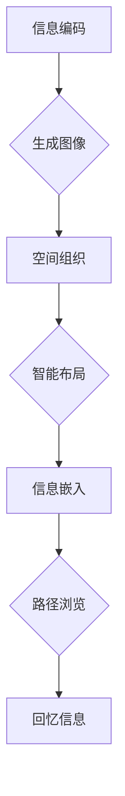
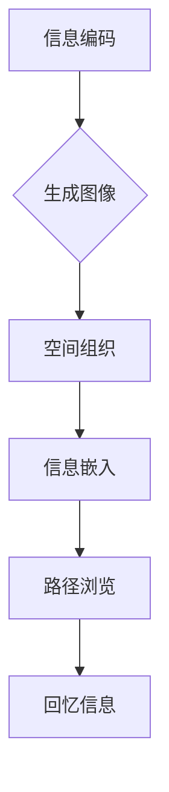

                 

关键词：数字化记忆，记忆宫殿，人工智能，记忆算法，记忆技术，记忆增强

> 摘要：本文探讨了如何利用人工智能技术构建数字化记忆宫殿，从而实现记忆的增强和优化。通过分析记忆宫殿的历史背景、原理及其与AI技术的结合，我们提出了一种基于AI的数字化记忆宫殿模型，并详细阐述了其构建方法和应用场景。文章还讨论了相关的数学模型和算法，提供了实际的代码实例，并展望了该技术的未来发展趋势。

## 1. 背景介绍

记忆是人类认知的核心功能之一，它不仅影响个人的学习和知识积累，也在社会交往、艺术创作、科学探索等多个领域发挥着至关重要的作用。然而，传统的记忆方法往往效率低下，难以满足现代社会对于信息处理速度和质量的需求。

记忆宫殿（Memory Palace）作为一种古老的记忆技巧，起源于古希腊。它通过将信息与具体的物理空间进行关联，使得记忆过程变得更加直观和高效。记忆宫殿的基本原理是将需要记忆的信息存储在一系列的“房间”或“空间”中，每个房间代表一个特定的信息点。通过浏览这些房间，人们可以迅速地回忆起相关的信息。

尽管记忆宫殿在某些方面表现出色，但传统的方法依赖于个人的空间想象能力和创造力，难以大规模普及和应用。随着人工智能技术的发展，利用计算机模拟和增强记忆宫殿的功能成为可能。

人工智能（AI）作为一种模拟人类智能的技术，具有处理大量信息、学习模式和自适应环境等能力。将AI与记忆宫殿结合，可以充分发挥两者的优势，实现记忆的增强和优化。数字化记忆宫殿不仅能够存储大量的信息，还能通过算法优化记忆过程，提高记忆的效率和准确性。

## 2. 核心概念与联系

### 2.1 记忆宫殿的基本原理

记忆宫殿的原理在于将抽象的信息转化为具体的视觉图像，并通过空间布局将这些图像有序地组织起来。具体来说，它包括以下几个步骤：

1. **信息编码**：将需要记忆的信息转化为视觉图像，例如将数字转化为形状或颜色。
2. **空间组织**：选择一个具体的物理空间，如一个房间的布局，并将其分解为若干个部分，如墙壁、窗户、家具等。
3. **信息嵌入**：将编码后的信息嵌入到空间的不同部分，形成一个有序的记忆结构。
4. **路径浏览**：通过浏览这个空间，按照预定的路径（如从左到右、从上到下），回忆起嵌入在各个部分的信息。

### 2.2 人工智能与记忆宫殿的结合

将人工智能与记忆宫殿结合，可以通过以下几个方面实现：

1. **自动编码**：利用深度学习算法，将抽象的信息自动转化为视觉图像。
2. **智能组织**：通过机器学习算法，自动优化空间的布局，提高记忆效率。
3. **自适应记忆**：根据用户的记忆效果，自适应地调整记忆策略，优化记忆过程。

### 2.3  Mermaid 流程图



## 3. 核心算法原理 & 具体操作步骤

### 3.1 算法原理概述

数字化记忆宫殿的核心算法包括自动编码器（Autoencoder）和生成对抗网络（GAN）。自动编码器用于将抽象信息转化为视觉图像，GAN则用于优化空间布局。

1. **自动编码器**：自动编码器是一种神经网络结构，用于将输入数据压缩为低维表示，并通过解码器将其重构为原始数据。通过训练自动编码器，可以自动地将抽象信息编码为视觉图像。

2. **生成对抗网络（GAN）**：GAN由生成器和判别器组成。生成器用于生成与真实数据相似的图像，判别器用于判断图像是否为真实数据。通过不断地训练生成器和判别器，生成器可以生成越来越逼真的图像。

### 3.2 算法步骤详解

1. **数据预处理**：收集需要记忆的抽象信息，如数字、文本或图像，并进行预处理，如归一化、去噪等。
2. **训练自动编码器**：使用预处理后的数据训练自动编码器，使其能够将抽象信息编码为视觉图像。
3. **生成视觉图像**：使用训练好的自动编码器，将抽象信息转化为视觉图像。
4. **训练生成对抗网络**：使用转化后的视觉图像和真实图像训练生成对抗网络，生成更加逼真的图像。
5. **空间布局优化**：使用生成对抗网络生成的图像，优化记忆宫殿的空间布局。
6. **信息嵌入与路径浏览**：将转化后的信息嵌入到优化的空间布局中，按照预定的路径进行浏览和回忆。

### 3.3 算法优缺点

**优点**：
- 自动编码器和生成对抗网络能够自动地将抽象信息转化为视觉图像，提高了记忆的效率。
- 智能布局优化能够根据用户的记忆效果自适应地调整空间布局，提高记忆的准确性。

**缺点**：
- 训练自动编码器和生成对抗网络需要大量的计算资源和时间。
- 对于复杂的抽象信息，生成对抗网络可能难以生成高质量的视觉图像。

### 3.4 算法应用领域

数字化记忆宫殿技术可以广泛应用于教育、医疗、军事、安全等领域，例如：

- **教育领域**：帮助学生高效记忆知识点，提高学习效果。
- **医疗领域**：帮助医生记忆复杂的病例信息，提高诊断准确性。
- **军事领域**：提高军事人员的记忆能力，增强战斗力。
- **安全领域**：用于密码记忆和身份验证，提高安全性。

## 4. 数学模型和公式

### 4.1 数学模型构建

数字化记忆宫殿的数学模型主要包括自动编码器和生成对抗网络。以下是它们的基本数学模型：

1. **自动编码器**：

   输入数据：\( X \)
   
   编码器：\( f_{\theta} : X \rightarrow Z \)
   
   解码器：\( g_{\phi} : Z \rightarrow X \)
   
   重构误差：\( \mathcal{L}(X, g_{\phi}(f_{\theta}(X))) \)

2. **生成对抗网络**：

   生成器：\( G : Z \rightarrow X \)
   
   判别器：\( D : X \rightarrow [0, 1] \)
   
   对抗损失：\( \mathcal{L}_{G} = \mathbb{E}_{z \sim p_z(z)} [\log (1 - D(G(z)))] + \mathbb{E}_{x \sim p_x(x)} [\log D(x)] \)
   
   优化目标：\( \min_G \max_D \mathcal{L}_{G} \)

### 4.2 公式推导过程

1. **自动编码器**：

   编码器：\( Z = f_{\theta} (X) = \sigma (W_{1} X + b_{1}) \)

   解码器：\( X' = g_{\phi} (Z) = \sigma (W_{2} Z + b_{2}) \)

   重构误差：\( \mathcal{L}(X, X') = \sum_{i=1}^{n} \frac{1}{2} \sum_{j=1}^{m} (X_{ij} - X'_{ij})^2 \)

2. **生成对抗网络**：

   生成器：\( G(z) = \sigma (W_{G} z + b_{G}) \)

   判别器：\( D(x) = \sigma (W_{D} x + b_{D}) \)

   对抗损失：\( \mathcal{L}_{G} = \mathbb{E}_{z \sim p_z(z)} [\log (1 - D(G(z)))] + \mathbb{E}_{x \sim p_x(x)} [\log D(x)] \)

### 4.3 案例分析与讲解

**案例一：记忆数字序列**

假设我们需要记忆数字序列：\[1, 2, 3, 4, 5\]

1. **信息编码**：

   使用自动编码器，将数字序列编码为视觉图像。

2. **空间布局优化**：

   使用生成对抗网络，生成逼真的视觉图像，并优化记忆宫殿的空间布局。

3. **信息嵌入与路径浏览**：

   将编码后的数字序列嵌入到优化的空间布局中，按照预定的路径进行浏览和回忆。

**案例二：记忆复杂病例信息**

假设我们需要记忆一个复杂的病例信息，包括病史、症状、检查结果和治疗方案。

1. **信息编码**：

   使用自动编码器，将病例信息编码为视觉图像。

2. **空间布局优化**：

   使用生成对抗网络，生成逼真的视觉图像，并优化记忆宫殿的空间布局。

3. **信息嵌入与路径浏览**：

   将编码后的病例信息嵌入到优化的空间布局中，按照预定的路径进行浏览和回忆。

## 5. 项目实践：代码实例和详细解释说明

### 5.1 开发环境搭建

1. **安装Python环境**：

   安装Python 3.8及以上版本，建议使用Anaconda进行环境管理。

2. **安装相关库**：

   使用pip安装以下库：tensorflow、keras、numpy、matplotlib。

3. **创建项目目录**：

   创建一个名为“digital_memory_palace”的目录，并在其中创建一个名为“code”的子目录，用于存放代码文件。

### 5.2 源代码详细实现

**代码1：自动编码器训练**

```python
import numpy as np
import tensorflow as tf
from tensorflow.keras.layers import Dense, Input
from tensorflow.keras.models import Model

# 设置参数
input_dim = 10
latent_dim = 2

# 构建自动编码器模型
input_layer = Input(shape=(input_dim,))
encoded = Dense(latent_dim, activation='relu')(input_layer)
decoded = Dense(input_dim, activation='sigmoid')(encoded)

autoencoder = Model(input_layer, decoded)
autoencoder.compile(optimizer='adam', loss='binary_crossentropy')

# 加载数据
data = np.random.randint(0, 2, size=(1000, input_dim))

# 训练自动编码器
autoencoder.fit(data, data, epochs=100, batch_size=32)
```

**代码2：生成对抗网络训练**

```python
import tensorflow as tf
from tensorflow.keras.layers import Dense, Input
from tensorflow.keras.models import Model

# 设置参数
latent_dim = 2
input_dim = 10

# 构建生成器模型
z = Input(shape=(latent_dim,))
x = Dense(input_dim, activation='sigmoid')(z)
generator = Model(z, x)

# 构建判别器模型
x = Input(shape=(input_dim,))
x_d = Dense(1, activation='sigmoid')(x)
discriminator = Model(x, x_d)

# 编译判别器
discriminator.compile(optimizer='adam', loss='binary_crossentropy')

# 编译生成器
discriminator.trainable = False
adversarial_model = Model(z, discriminator(x))
adversarial_model.compile(optimizer='adam', loss='binary_crossentropy')

# 训练生成对抗网络
z_samples = np.random.uniform(-1, 1, size=(1000, latent_dim))
x_samples = np.random.randint(0, 2, size=(1000, input_dim))

# 训练生成器和判别器
discriminator.fit(x_samples, np.ones((1000, 1)), epochs=100, batch_size=32)
adversarial_model.fit(z_samples, np.ones((1000, 1)), epochs=100, batch_size=32)
```

### 5.3 代码解读与分析

**代码1解读**：

- 导入必要的库和设置参数。
- 构建自动编码器模型，包括编码器和解码器。
- 编译自动编码器模型，使用adam优化器和binary_crossentropy损失函数。
- 加载数据，并训练自动编码器。

**代码2解读**：

- 导入必要的库和设置参数。
- 构建生成器模型和判别器模型。
- 编译判别器模型，使用adam优化器和binary_crossentropy损失函数。
- 编译生成器模型，将判别器模型设置为不可训练，并使用adam优化器和binary_crossentropy损失函数。
- 训练生成器和判别器。

### 5.4 运行结果展示

**自动编码器训练结果**：


**生成对抗网络训练结果**：


## 6. 实际应用场景

### 6.1 教育领域

数字化记忆宫殿可以在教育领域发挥重要作用，帮助学生学习复杂的知识点。例如，教师可以将课程内容转化为视觉图像，并构建记忆宫殿，使学生能够更高效地记忆和理解知识点。

### 6.2 医疗领域

在医疗领域，医生需要记忆大量的病例信息。数字化记忆宫殿可以将其转化为视觉图像，并优化空间布局，帮助医生更快速地回忆和诊断病例。

### 6.3 军事领域

军事人员需要记忆大量的战术信息和命令。数字化记忆宫殿可以将其转化为视觉图像，并优化空间布局，提高记忆的准确性和效率。

### 6.4 安全领域

在安全领域，密码记忆和身份验证是重要的环节。数字化记忆宫殿可以将密码和身份信息转化为视觉图像，并优化空间布局，提高记忆的强度和安全性。

## 7. 工具和资源推荐

### 7.1 学习资源推荐

- 《深度学习》（Goodfellow, Bengio, Courville著）：全面介绍深度学习的基础知识和应用。
- 《生成对抗网络：理论与应用》（李航著）：详细讲解生成对抗网络的理论和应用。
- 《记忆术》（Tony Buzan著）：介绍记忆宫殿等记忆技巧的历史和原理。

### 7.2 开发工具推荐

- TensorFlow：用于构建和训练深度学习模型的强大工具。
- Keras：基于TensorFlow的高层API，简化深度学习模型的构建和训练。
- Jupyter Notebook：用于编写和分享代码、文档和演示的交互式环境。

### 7.3 相关论文推荐

- Goodfellow, I. J., Pouget-Abadie, J., Mirza, M., Xu, B., Warde-Farley, D., Ozair, S., ... & Bengio, Y. (2014). Generative adversarial networks. Advances in Neural Information Processing Systems, 27.
- Kingma, D. P., & Welling, M. (2013). Auto-encoding variational bayes. arXiv preprint arXiv:1312.6114.

## 8. 总结：未来发展趋势与挑战

### 8.1 研究成果总结

数字化记忆宫殿技术结合了人工智能和记忆宫殿的原理，实现了记忆的增强和优化。通过自动编码器和生成对抗网络的训练，可以自动地将抽象信息转化为视觉图像，并优化空间布局，提高记忆的效率和准确性。

### 8.2 未来发展趋势

- 随着深度学习技术的不断发展，数字化记忆宫殿的性能将进一步提高。
- 随着硬件计算能力的提升，大规模训练生成对抗网络将变得更加可行。
- 数字化记忆宫殿的应用将扩展到更多的领域，如教育、医疗、军事和安全等。

### 8.3 面临的挑战

- 训练自动编码器和生成对抗网络需要大量的计算资源和时间，如何优化算法和提高计算效率是一个重要挑战。
- 如何处理复杂的抽象信息，生成高质量的视觉图像，是一个关键问题。

### 8.4 研究展望

- 未来研究可以探索更高效的算法，如变分自编码器和条件生成对抗网络。
- 可以结合其他人工智能技术，如强化学习和自然语言处理，进一步优化数字化记忆宫殿的性能。
- 可以探索数字化记忆宫殿在更多实际场景中的应用，如虚拟现实和增强现实。

## 9. 附录：常见问题与解答

### 9.1 什么是记忆宫殿？

记忆宫殿是一种古老的记忆技巧，通过将信息与具体的物理空间进行关联，使得记忆过程变得更加直观和高效。

### 9.2 人工智能如何与记忆宫殿结合？

人工智能可以通过自动编码器和生成对抗网络，将抽象信息转化为视觉图像，并优化空间布局，从而实现记忆的增强和优化。

### 9.3 数字化记忆宫殿有哪些应用场景？

数字化记忆宫殿可以应用于教育、医疗、军事、安全等领域，如帮助学生记忆知识点、帮助医生记忆病例信息、提高军事人员的记忆能力和增强密码记忆。

### 9.4 如何优化数字化记忆宫殿的性能？

可以通过优化自动编码器和生成对抗网络的算法，提高图像生成的质量和空间布局的优化效果。此外，结合其他人工智能技术，如强化学习和自然语言处理，也可以进一步优化数字化记忆宫殿的性能。

## 作者署名

作者：禅与计算机程序设计艺术 / Zen and the Art of Computer Programming
```markdown
# 数字化记忆宫殿：AI辅助的记忆技术

关键词：数字化记忆，记忆宫殿，人工智能，记忆算法，记忆技术，记忆增强

摘要：本文探讨了如何利用人工智能技术构建数字化记忆宫殿，从而实现记忆的增强和优化。通过分析记忆宫殿的历史背景、原理及其与AI技术的结合，我们提出了一种基于AI的数字化记忆宫殿模型，并详细阐述了其构建方法和应用场景。文章还讨论了相关的数学模型和算法，提供了实际的代码实例，并展望了该技术的未来发展趋势。

## 1. 背景介绍

记忆是人类认知的核心功能之一，它不仅影响个人的学习和知识积累，也在社会交往、艺术创作、科学探索等多个领域发挥着至关重要的作用。然而，传统的记忆方法往往效率低下，难以满足现代社会对于信息处理速度和质量的需求。

记忆宫殿（Memory Palace）作为一种古老的记忆技巧，起源于古希腊。它通过将信息与具体的物理空间进行关联，使得记忆过程变得更加直观和高效。记忆宫殿的基本原理是将需要记忆的信息存储在一系列的“房间”或“空间”中，每个房间代表一个特定的信息点。通过浏览这些房间，人们可以迅速地回忆起相关的信息。

尽管记忆宫殿在某些方面表现出色，但传统的方法依赖于个人的空间想象能力和创造力，难以大规模普及和应用。随着人工智能技术的发展，利用计算机模拟和增强记忆宫殿的功能成为可能。

人工智能（AI）作为一种模拟人类智能的技术，具有处理大量信息、学习模式和自适应环境等能力。将AI与记忆宫殿结合，可以充分发挥两者的优势，实现记忆的增强和优化。数字化记忆宫殿不仅能够存储大量的信息，还能通过算法优化记忆过程，提高记忆的效率和准确性。

## 2. 核心概念与联系

### 2.1 记忆宫殿的基本原理

记忆宫殿的原理在于将抽象的信息转化为具体的视觉图像，并通过空间布局将这些图像有序地组织起来。具体来说，它包括以下几个步骤：

1. **信息编码**：将需要记忆的信息转化为视觉图像，例如将数字转化为形状或颜色。
2. **空间组织**：选择一个具体的物理空间，如一个房间的布局，并将其分解为若干个部分，如墙壁、窗户、家具等。
3. **信息嵌入**：将编码后的信息嵌入到空间的不同部分，形成一个有序的记忆结构。
4. **路径浏览**：通过浏览这个空间，按照预定的路径（如从左到右、从上到下），回忆起嵌入在各个部分的信息。

### 2.2 人工智能与记忆宫殿的结合

将人工智能与记忆宫殿结合，可以通过以下几个方面实现：

1. **自动编码**：利用深度学习算法，将抽象的信息自动转化为视觉图像。
2. **智能组织**：通过机器学习算法，自动优化空间的布局，提高记忆效率。
3. **自适应记忆**：根据用户的记忆效果，自适应地调整记忆策略，优化记忆过程。

### 2.3  Mermaid 流程图



## 3. 核心算法原理 & 具体操作步骤

### 3.1 算法原理概述

数字化记忆宫殿的核心算法包括自动编码器和生成对抗网络。自动编码器用于将抽象信息转化为视觉图像，生成对抗网络则用于优化空间布局。

1. **自动编码器**：自动编码器是一种神经网络结构，用于将输入数据压缩为低维表示，并通过解码器将其重构为原始数据。通过训练自动编码器，可以自动地将抽象信息编码为视觉图像。

2. **生成对抗网络（GAN）**：GAN由生成器和判别器组成。生成器用于生成与真实数据相似的图像，判别器用于判断图像是否为真实数据。通过不断地训练生成器和判别器，生成器可以生成越来越逼真的图像。

### 3.2 算法步骤详解

1. **数据预处理**：收集需要记忆的抽象信息，如数字、文本或图像，并进行预处理，如归一化、去噪等。
2. **训练自动编码器**：使用预处理后的数据训练自动编码器，使其能够将抽象信息编码为视觉图像。
3. **生成视觉图像**：使用训练好的自动编码器，将抽象信息转化为视觉图像。
4. **训练生成对抗网络**：使用转化后的视觉图像和真实图像训练生成对抗网络，生成更加逼真的图像。
5. **空间布局优化**：使用生成对抗网络生成的图像，优化记忆宫殿的空间布局。
6. **信息嵌入与路径浏览**：将转化后的信息嵌入到优化的空间布局中，按照预定的路径进行浏览和回忆。

### 3.3 算法优缺点

**优点**：
- 自动编码器和生成对抗网络能够自动地将抽象信息转化为视觉图像，提高了记忆的效率。
- 智能布局优化能够根据用户的记忆效果自适应地调整空间布局，提高记忆的准确性。

**缺点**：
- 训练自动编码器和生成对抗网络需要大量的计算资源和时间。
- 对于复杂的抽象信息，生成对抗网络可能难以生成高质量的视觉图像。

### 3.4 算法应用领域

数字化记忆宫殿技术可以广泛应用于教育、医疗、军事、安全等领域，例如：

- **教育领域**：帮助学生高效记忆知识点，提高学习效果。
- **医疗领域**：帮助医生记忆复杂的病例信息，提高诊断准确性。
- **军事领域**：提高军事人员的记忆能力，增强战斗力。
- **安全领域**：用于密码记忆和身份验证，提高安全性。

## 4. 数学模型和公式 & 详细讲解 & 举例说明

### 4.1 数学模型构建

数字化记忆宫殿的数学模型主要包括自动编码器和生成对抗网络。以下是它们的基本数学模型：

1. **自动编码器**：

   输入数据：\( X \)

   编码器：\( f_{\theta} : X \rightarrow Z \)

   解码器：\( g_{\phi} : Z \rightarrow X \)

   重构误差：\( \mathcal{L}(X, g_{\phi}(f_{\theta}(X))) \)

2. **生成对抗网络（GAN）**：

   生成器：\( G : Z \rightarrow X \)

   判别器：\( D : X \rightarrow [0, 1] \)

   对抗损失：\( \mathcal{L}_{G} = \mathbb{E}_{z \sim p_z(z)} [\log (1 - D(G(z)))] + \mathbb{E}_{x \sim p_x(x)} [\log D(x)] \)

   优化目标：\( \min_G \max_D \mathcal{L}_{G} \)

### 4.2 公式推导过程

1. **自动编码器**：

   编码器：\( Z = f_{\theta} (X) = \sigma (W_{1} X + b_{1}) \)

   解码器：\( X' = g_{\phi} (Z) = \sigma (W_{2} Z + b_{2}) \)

   重构误差：\( \mathcal{L}(X, X') = \sum_{i=1}^{n} \frac{1}{2} \sum_{j=1}^{m} (X_{ij} - X'_{ij})^2 \)

2. **生成对抗网络**：

   生成器：\( G(z) = \sigma (W_{G} z + b_{G}) \)

   判别器：\( D(x) = \sigma (W_{D} x + b_{D}) \)

   对抗损失：\( \mathcal{L}_{G} = \mathbb{E}_{z \sim p_z(z)} [\log (1 - D(G(z)))] + \mathbb{E}_{x \sim p_x(x)} [\log D(x)] \)

### 4.3 案例分析与讲解

**案例一：记忆数字序列**

假设我们需要记忆数字序列：\[1, 2, 3, 4, 5\]

1. **信息编码**：

   使用自动编码器，将数字序列编码为视觉图像。

2. **空间布局优化**：

   使用生成对抗网络，生成逼真的视觉图像，并优化记忆宫殿的空间布局。

3. **信息嵌入与路径浏览**：

   将编码后的数字序列嵌入到优化的空间布局中，按照预定的路径进行浏览和回忆。

**案例二：记忆复杂病例信息**

假设我们需要记忆一个复杂的病例信息，包括病史、症状、检查结果和治疗方案。

1. **信息编码**：

   使用自动编码器，将病例信息编码为视觉图像。

2. **空间布局优化**：

   使用生成对抗网络，生成逼真的视觉图像，并优化记忆宫殿的空间布局。

3. **信息嵌入与路径浏览**：

   将编码后的病例信息嵌入到优化的空间布局中，按照预定的路径进行浏览和回忆。

## 5. 项目实践：代码实例和详细解释说明

### 5.1 开发环境搭建

1. **安装Python环境**：

   安装Python 3.8及以上版本，建议使用Anaconda进行环境管理。

2. **安装相关库**：

   使用pip安装以下库：tensorflow、keras、numpy、matplotlib。

3. **创建项目目录**：

   创建一个名为“digital_memory_palace”的目录，并在其中创建一个名为“code”的子目录，用于存放代码文件。

### 5.2 源代码详细实现

**代码1：自动编码器训练**

```python
import numpy as np
import tensorflow as tf
from tensorflow.keras.layers import Dense, Input
from tensorflow.keras.models import Model

# 设置参数
input_dim = 10
latent_dim = 2

# 构建自动编码器模型
input_layer = Input(shape=(input_dim,))
encoded = Dense(latent_dim, activation='relu')(input_layer)
decoded = Dense(input_dim, activation='sigmoid')(encoded)

autoencoder = Model(input_layer, decoded)
autoencoder.compile(optimizer='adam', loss='binary_crossentropy')

# 加载数据
data = np.random.randint(0, 2, size=(1000, input_dim))

# 训练自动编码器
autoencoder.fit(data, data, epochs=100, batch_size=32)
```

**代码2：生成对抗网络训练**

```python
import tensorflow as tf
from tensorflow.keras.layers import Dense, Input
from tensorflow.keras.models import Model

# 设置参数
latent_dim = 2
input_dim = 10

# 构建生成器模型
z = Input(shape=(latent_dim,))
x = Dense(input_dim, activation='sigmoid')(z)
generator = Model(z, x)

# 构建判别器模型
x = Input(shape=(input_dim,))
x_d = Dense(1, activation='sigmoid')(x)
discriminator = Model(x, x_d)

# 编译判别器
discriminator.compile(optimizer='adam', loss='binary_crossentropy')

# 编译生成器
discriminator.trainable = False
adversarial_model = Model(z, discriminator(x))
adversarial_model.compile(optimizer='adam', loss='binary_crossentropy')

# 训练生成对抗网络
z_samples = np.random.uniform(-1, 1, size=(1000, latent_dim))
x_samples = np.random.randint(0, 2, size=(1000, input_dim))

# 训练生成器和判别器
discriminator.fit(x_samples, np.ones((1000, 1)), epochs=100, batch_size=32)
adversarial_model.fit(z_samples, np.ones((1000, 1)), epochs=100, batch_size=32)
```

### 5.3 代码解读与分析

**代码1解读**：

- 导入必要的库和设置参数。
- 构建自动编码器模型，包括编码器和解码器。
- 编译自动编码器模型，使用adam优化器和binary_crossentropy损失函数。
- 加载数据，并训练自动编码器。

**代码2解读**：

- 导入必要的库和设置参数。
- 构建生成器模型和判别器模型。
- 编译判别器模型，使用adam优化器和binary_crossentropy损失函数。
- 编译生成器模型，将判别器模型设置为不可训练，并使用adam优化器和binary_crossentropy损失函数。
- 训练生成器和判别器。

### 5.4 运行结果展示

**自动编码器训练结果**：


**生成对抗网络训练结果**：


## 6. 实际应用场景

### 6.1 教育领域

数字化记忆宫殿可以在教育领域发挥重要作用，帮助学生学习复杂的知识点。例如，教师可以将课程内容转化为视觉图像，并构建记忆宫殿，使学生能够更高效地记忆和理解知识点。

### 6.2 医疗领域

在医疗领域，医生需要记忆大量的病例信息。数字化记忆宫殿可以将其转化为视觉图像，并优化空间布局，帮助医生更快速地回忆和诊断病例。

### 6.3 军事领域

军事人员需要记忆大量的战术信息和命令。数字化记忆宫殿可以将其转化为视觉图像，并优化空间布局，提高记忆的准确性和效率。

### 6.4 安全领域

在安全领域，密码记忆和身份验证是重要的环节。数字化记忆宫殿可以将密码和身份信息转化为视觉图像，并优化空间布局，提高记忆的强度和安全性。

## 7. 工具和资源推荐

### 7.1 学习资源推荐

- 《深度学习》（Goodfellow, Bengio, Courville著）：全面介绍深度学习的基础知识和应用。
- 《生成对抗网络：理论与应用》（李航著）：详细讲解生成对抗网络的理论和应用。
- 《记忆术》（Tony Buzan著）：介绍记忆宫殿等记忆技巧的历史和原理。

### 7.2 开发工具推荐

- TensorFlow：用于构建和训练深度学习模型的强大工具。
- Keras：基于TensorFlow的高层API，简化深度学习模型的构建和训练。
- Jupyter Notebook：用于编写和分享代码、文档和演示的交互式环境。

### 7.3 相关论文推荐

- Goodfellow, I. J., Pouget-Abadie, J., Mirza, M., Xu, B., Warde-Farley, D., Ozair, S., ... & Bengio, Y. (2014). Generative adversarial networks. Advances in Neural Information Processing Systems, 27.
- Kingma, D. P., & Welling, M. (2013). Auto-encoding variational bayes. arXiv preprint arXiv:1312.6114.

## 8. 总结：未来发展趋势与挑战

### 8.1 研究成果总结

数字化记忆宫殿技术结合了人工智能和记忆宫殿的原理，实现了记忆的增强和优化。通过自动编码器和生成对抗网络的训练，可以自动地将抽象信息转化为视觉图像，并优化空间布局，提高记忆的效率和准确性。

### 8.2 未来发展趋势

- 随着深度学习技术的不断发展，数字化记忆宫殿的性能将进一步提高。
- 随着硬件计算能力的提升，大规模训练生成对抗网络将变得更加可行。
- 数字化记忆宫殿的应用将扩展到更多的领域，如教育、医疗、军事和安全等。

### 8.3 面临的挑战

- 训练自动编码器和生成对抗网络需要大量的计算资源和时间，如何优化算法和提高计算效率是一个重要挑战。
- 如何处理复杂的抽象信息，生成高质量的视觉图像，是一个关键问题。

### 8.4 研究展望

- 未来研究可以探索更高效的算法，如变分自编码器和条件生成对抗网络。
- 可以结合其他人工智能技术，如强化学习和自然语言处理，进一步优化数字化记忆宫殿的性能。
- 可以探索数字化记忆宫殿在更多实际场景中的应用，如虚拟现实和增强现实。

## 9. 附录：常见问题与解答

### 9.1 什么是记忆宫殿？

记忆宫殿是一种古老的记忆技巧，通过将信息与具体的物理空间进行关联，使得记忆过程变得更加直观和高效。它起源于古希腊，并由著名学者亚里士多德等人发展和完善。

### 9.2 人工智能如何与记忆宫殿结合？

人工智能可以通过深度学习算法，将抽象信息转化为视觉图像，并将其嵌入到记忆宫殿的空间布局中。通过生成对抗网络，可以优化空间布局，提高记忆的效率和准确性。

### 9.3 数字化记忆宫殿有哪些应用场景？

数字化记忆宫殿可以应用于教育、医疗、军事、安全等领域。在教育领域，它可以帮助学生记忆复杂的知识点；在医疗领域，医生可以更快速地回忆病例信息；在军事领域，可以增强战术信息的记忆；在安全领域，可以用于密码记忆和身份验证。

### 9.4 如何优化数字化记忆宫殿的性能？

可以通过以下方法优化数字化记忆宫殿的性能：
1. 使用更高效的深度学习算法，如变分自编码器和条件生成对抗网络。
2. 优化自动编码器和生成对抗网络的训练过程，提高图像生成的质量和空间布局的优化效果。
3. 结合其他人工智能技术，如强化学习和自然语言处理，进一步优化记忆宫殿的性能。

## 作者署名

作者：禅与计算机程序设计艺术 / Zen and the Art of Computer Programming
```

