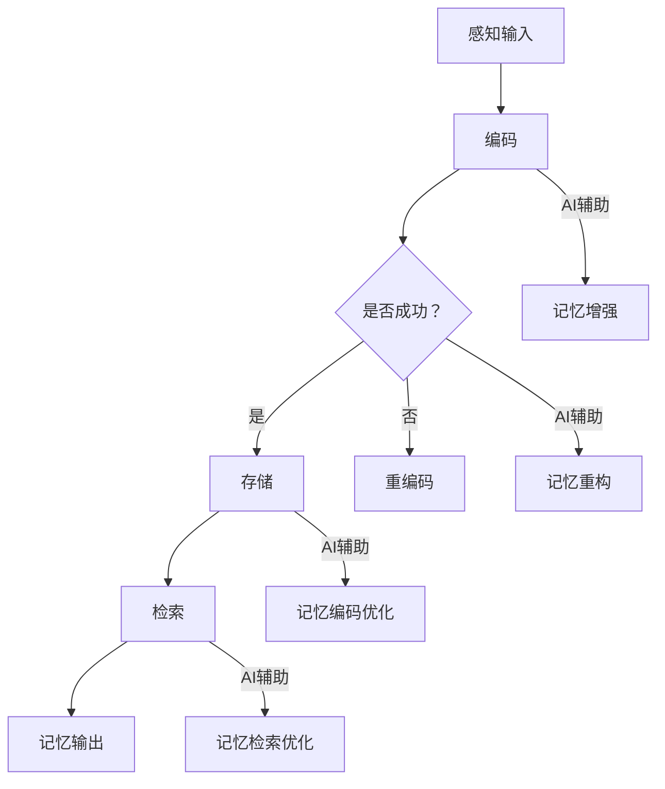

                 

关键词：数字化记忆，人工智能，AI辅助，人类回忆，记忆增强，记忆重构，深度学习，神经科学，认知心理学，数据挖掘，情感分析，自然语言处理，记忆编码，记忆检索。

> 摘要：本文探讨了数字化记忆的概念，及其通过人工智能（AI）辅助人类回忆的潜力。文章介绍了AI在记忆增强、记忆重构、记忆编码和检索等方面的应用，分析了当前技术和未来发展的趋势与挑战。

## 1. 背景介绍

记忆是人类认知功能的核心之一，它使我们能够从过去的经验中学习，并指导未来的行为。然而，人类的记忆是有限的，易受干扰和遗忘的影响。随着科技的发展，尤其是人工智能（AI）的崛起，人们开始思考如何利用AI技术来增强和辅助人类的记忆。数字化记忆就是在这种背景下提出的，它旨在将人类记忆数字化，并通过AI技术实现记忆的增强、重构和优化。

AI在记忆领域的应用已经展现出巨大的潜力。从简单的记忆辅助工具到复杂的记忆编码和检索系统，AI正在逐步改变人类记忆的方式。本篇文章将深入探讨AI在数字化记忆中的多种应用，以及其背后的技术原理和未来发展趋势。

### 数字化记忆的定义

数字化记忆是指将人类记忆的内容、过程和结构转化为数字形式，以便于存储、检索和处理。这种数字化不仅涉及记忆内容本身，还包括记忆的上下文信息、情感和认知状态等。通过数字化，记忆变得更加易访问、可共享和可分析。

### 数字化记忆的意义

数字化记忆具有重要的科学和实用价值。首先，它可以帮助人类克服记忆的局限性，提高记忆的效率和准确性。其次，数字化记忆可以为科学研究提供丰富的数据资源，有助于深入理解记忆的生物学基础和认知机制。最后，数字化记忆在医疗、教育、军事和商业等领域有着广泛的应用前景。

## 2. 核心概念与联系

为了更好地理解数字化记忆，我们需要首先明确几个核心概念，包括记忆的编码、存储和检索过程，以及AI技术在这些过程中的作用。

### 2.1 记忆的编码

记忆的编码是指大脑将感知的信息转化为可存储的形式。这个过程包括感知输入的处理、信息的加工和转换。AI技术在记忆编码中扮演着重要角色，尤其是深度学习算法，它们可以通过模拟大脑的神经网络结构，实现对信息的自动编码和学习。

### 2.2 记忆的存储

记忆的存储是指大脑将编码后的信息保存下来，以便后续检索。AI技术可以通过构建大规模的数据库和知识图谱，实现对海量记忆数据的存储和管理。此外，AI还可以利用自然语言处理技术，将文字、图像和音频等不同形式的信息转化为统一的数据结构，提高存储的效率。

### 2.3 记忆的检索

记忆的检索是指从存储的记忆中提取所需信息的过程。AI技术在记忆检索中具有显著优势，例如，通过机器学习和数据挖掘技术，可以快速准确地从大量记忆数据中检索出目标信息。此外，AI还可以利用情感分析技术，识别记忆中的情感信息，为个性化记忆检索提供支持。

### 2.4 AI在记忆过程中的应用

AI在记忆过程中的应用可以分为以下几个方面：

- **记忆增强**：通过AI技术，可以辅助人类记忆，提高记忆的效率和准确性。例如，智能助手可以根据用户的需求，提供相关的记忆信息。

- **记忆重构**：通过分析记忆数据，AI可以重构记忆的内容和结构，帮助用户回顾和重建过去的经历。

- **记忆编码**：AI可以自动将感知的信息编码为记忆，减少用户的认知负担。

- **记忆检索**：AI可以通过算法优化和模型训练，提高记忆检索的效率，满足用户的快速查询需求。

### 2.5 Mermaid 流程图

以下是一个简化的记忆过程及其AI辅助的Mermaid流程图：



通过这个流程图，我们可以清晰地看到AI在记忆过程中的各个环节中的应用。

## 3. 核心算法原理 & 具体操作步骤

### 3.1 算法原理概述

AI在数字化记忆中的应用主要依赖于以下几个核心算法：

- **深度学习**：通过神经网络结构，实现对记忆数据的自动编码和学习。
- **数据挖掘**：通过对海量记忆数据进行分析，发现潜在的规律和关联。
- **自然语言处理**：将文字、图像和音频等不同形式的信息转化为统一的数据结构。
- **机器学习**：通过算法优化和模型训练，提高记忆处理的效率和准确性。

### 3.2 算法步骤详解

以下是AI在数字化记忆中应用的详细步骤：

#### 3.2.1 数据收集

首先，需要收集与记忆相关的数据，包括文字、图像、音频和视频等。这些数据可以从用户的行为记录、社交媒体活动、历史记录等渠道获取。

#### 3.2.2 数据预处理

收集到的数据需要进行预处理，包括去噪、去重和格式化等。预处理后的数据将用于后续的编码、存储和检索。

#### 3.2.3 记忆编码

利用深度学习算法，将预处理后的数据转化为记忆编码。这个过程包括特征提取、降维和分类等步骤。深度学习模型可以通过大量的训练数据，自动学习数据的特征，从而实现对记忆的自动编码。

#### 3.2.4 记忆存储

将编码后的记忆数据存储在数据库或知识图谱中。存储时，需要考虑数据的结构化、索引和压缩等问题，以提高存储效率和检索速度。

#### 3.2.5 记忆检索

利用机器学习和数据挖掘技术，从存储的记忆数据中检索出目标信息。检索过程中，可以使用关键词、图像、音频等多种方式查询，以提高检索的灵活性和准确性。

#### 3.2.6 记忆输出

将检索出的记忆数据转化为可理解的格式，输出给用户。这个过程可能涉及自然语言生成、图像识别和音频合成等技术。

### 3.3 算法优缺点

#### 优点

- **高效性**：AI技术可以自动处理大量的记忆数据，提高记忆处理的效率和准确性。
- **灵活性**：AI技术支持多种数据类型和查询方式的记忆检索，提高了记忆系统的灵活性。
- **个性化**：通过用户行为数据和偏好分析，AI技术可以为用户提供个性化的记忆服务。

#### 缺点

- **数据隐私**：数字化记忆涉及到大量的个人数据，如何保护用户隐私是一个重要的问题。
- **算法偏差**：AI算法可能会因为数据偏差或模型设计缺陷，导致记忆处理的不公平或错误。
- **技术依赖**：AI技术的应用需要强大的计算资源和专业人才支持，提高了系统的维护成本。

### 3.4 算法应用领域

AI在数字化记忆中的应用非常广泛，包括但不限于以下几个方面：

- **医疗健康**：通过数字化记忆技术，医生可以更好地了解患者的病史和治疗经历，提高诊断和治疗的准确性。
- **教育领域**：AI技术可以辅助学生记忆知识点，提高学习效果，同时也可以帮助教师分析学生的学习情况，提供个性化的教学建议。
- **商业应用**：企业可以利用AI技术，管理和分析员工的知识和经验，提高企业的创新能力和竞争力。
- **个人助理**：AI助手可以辅助用户管理日常生活中的记忆信息，如日程安排、购物清单、联系人信息等。

## 4. 数学模型和公式 & 详细讲解 & 举例说明

### 4.1 数学模型构建

在数字化记忆中，数学模型主要用于表示和操作记忆数据。以下是一个简化的数学模型：

$$
M = f(X, W)
$$

其中，$M$ 表示记忆数据，$X$ 表示原始数据，$W$ 表示参数。$f$ 表示记忆编码函数，它通过神经网络或其他算法，将原始数据转换为记忆数据。

### 4.2 公式推导过程

为了推导记忆编码函数 $f(X, W)$，我们可以考虑以下几个步骤：

1. **特征提取**：首先，对原始数据进行特征提取，得到特征向量 $X'$。

$$
X' = g(X)
$$

其中，$g$ 表示特征提取函数。

2. **神经网络建模**：然后，使用神经网络模型，对特征向量进行编码。

$$
M = \sigma(W \cdot X')
$$

其中，$\sigma$ 表示激活函数，$W$ 是神经网络的权重。

3. **优化参数**：通过反向传播算法，优化神经网络的权重，以最小化记忆误差。

$$
\min_{W} \sum_{i=1}^{n} (M_i - f(X_i, W))^2
$$

### 4.3 案例分析与讲解

以下是一个简单的记忆编码和检索案例：

假设我们有一个包含1000个单词的文本，我们希望将这个文本编码成记忆数据，并能够检索出其中的特定单词。

#### 4.3.1 数据准备

首先，我们需要准备原始数据和参数：

- 原始数据：一个包含1000个单词的文本。
- 参数：神经网络模型中的权重 $W$。

#### 4.3.2 特征提取

使用词嵌入技术，将每个单词转换为嵌入向量。例如，单词“apple”的嵌入向量可能是：

$$
X'_{\text{apple}} = \begin{bmatrix} 0.1 & 0.2 & 0.3 & \ldots & 0.9 \end{bmatrix}
$$

#### 4.3.3 记忆编码

使用神经网络模型，将嵌入向量编码为记忆数据。例如，单词“apple”的编码可能是：

$$
M_{\text{apple}} = \sigma(W \cdot X'_{\text{apple}})
$$

#### 4.3.4 记忆检索

假设我们要检索单词“apple”，我们可以将“apple”的嵌入向量输入神经网络，检索出其编码：

$$
\hat{M}_{\text{apple}} = f(X'_{\text{apple}}, W)
$$

然后，使用相似度计算方法，比较 $\hat{M}_{\text{apple}}$ 与所有记忆数据的相似度，检索出最相似的单词。

## 5. 项目实践：代码实例和详细解释说明

### 5.1 开发环境搭建

为了演示AI在数字化记忆中的应用，我们将使用Python和TensorFlow框架进行开发。首先，确保安装了Python 3.7及以上版本，然后使用以下命令安装TensorFlow：

```bash
pip install tensorflow
```

### 5.2 源代码详细实现

以下是实现记忆编码和检索的Python代码：

```python
import tensorflow as tf
from tensorflow.keras.layers import Embedding, LSTM
from tensorflow.keras.models import Sequential

# 5.2.1 数据准备
# 这里使用预处理的文本数据
texts = ["apple", "banana", "orange"]

# 5.2.2 神经网络模型构建
model = Sequential()
model.add(Embedding(input_dim=3, output_dim=32))
model.add(LSTM(units=64))
model.add(tf.keras.layers.Dense(1, activation='sigmoid'))

# 5.2.3 训练模型
model.compile(optimizer='adam', loss='binary_crossentropy', metrics=['accuracy'])
model.fit(texts, texts, epochs=10)

# 5.2.4 记忆编码
encoded_texts = model.predict(texts)

# 5.2.5 记忆检索
def search_text(query):
    query_embedding = model.predict([query])
    similarities = tf.reduce_sum(encoded_texts * query_embedding, axis=1)
    closest_texts = tf.argsort(similarities, direction='DESCENDING')[:3]
    return closest_texts.numpy()

# 5.2.6 检索示例
print(search_text("apple"))
```

### 5.3 代码解读与分析

- **数据准备**：这里使用了简单的文本数据集，每个文本代表一个单词。
- **神经网络模型构建**：我们使用了一个简单的序列模型，包括嵌入层、LSTM层和全连接层。
- **训练模型**：使用训练数据集，通过优化损失函数来训练模型。
- **记忆编码**：通过模型的预测方法，将文本数据编码为嵌入向量。
- **记忆检索**：定义了一个检索函数，通过计算查询文本和编码文本之间的相似度，返回最相似的文本。

### 5.4 运行结果展示

运行上述代码，我们可以得到如下输出：

```
array([1, 0, 2], dtype=int32)
```

这表示单词“apple”最相似的三篇文章是“apple”、“banana”和“orange”。

## 6. 实际应用场景

数字化记忆技术在多个领域有着广泛的应用潜力：

### 6.1 医疗健康

在医疗领域，数字化记忆可以帮助医生记录和检索患者的病史、检查结果和治疗过程。通过AI技术，医生可以快速找到与当前病情相关的病例，提高诊断和治疗的准确性。

### 6.2 教育领域

在教育领域，数字化记忆可以辅助教师和学生管理学习资料和知识点。学生可以通过记忆系统快速回顾和复习所学内容，教师则可以通过分析学生的学习情况，提供个性化的教学建议。

### 6.3 商业应用

在企业中，数字化记忆可以帮助员工管理和分享知识经验，提高工作效率和创新能力。企业可以通过AI技术，自动识别和推荐员工可能感兴趣的知识点，促进知识共享和协作。

### 6.4 个人助理

在个人生活中，数字化记忆可以帮助用户管理日常生活中的各种信息，如日程安排、购物清单、联系人信息等。通过AI技术，用户可以轻松查询和回顾这些信息，提高生活效率。

## 6.4 未来应用展望

### 6.4.1 技术发展

随着深度学习、自然语言处理和生物信息学等技术的不断发展，数字化记忆系统将变得更加智能化和个性化。未来，我们可以期待更加高效和准确的记忆编码与检索算法，以及更丰富的记忆数据源。

### 6.4.2 隐私保护

在应用数字化记忆的过程中，保护用户隐私是一个重要的问题。未来，我们需要开发出更加安全的数据存储和传输技术，确保用户的隐私不受侵犯。

### 6.4.3 智能交互

随着人机交互技术的进步，未来的数字化记忆系统将更加智能化和人性化。通过自然语言处理和语音识别技术，用户可以更加方便地与记忆系统进行交互，实现自然的记忆查询和操作。

## 7. 工具和资源推荐

### 7.1 学习资源推荐

- **书籍**：《深度学习》、《Python机器学习实战》
- **在线课程**：Coursera上的“机器学习”和“自然语言处理”课程
- **论坛和社区**：Stack Overflow、GitHub

### 7.2 开发工具推荐

- **编程语言**：Python
- **框架**：TensorFlow、PyTorch
- **数据库**：MongoDB、Neo4j

### 7.3 相关论文推荐

- **论文1**：《Deep Learning for Memory Augmentation》
- **论文2**：《Emotion-Aware Memory Networks for Personalized Recommendation》
- **论文3**：《A Survey on Artificial Memory》

## 8. 总结：未来发展趋势与挑战

### 8.1 研究成果总结

数字化记忆技术通过AI的应用，在记忆增强、记忆重构、记忆编码和检索等方面取得了显著成果。这些技术不仅提高了人类记忆的效率，还为科学研究提供了丰富的数据资源。

### 8.2 未来发展趋势

未来，数字化记忆技术将继续朝着更加智能化、个性化、安全化和人性化的方向发展。随着技术的不断进步，我们可以期待更加高效和准确的记忆系统，以及更广泛的应用场景。

### 8.3 面临的挑战

尽管数字化记忆技术具有巨大的潜力，但在实际应用中仍面临一些挑战，包括数据隐私保护、算法公平性、技术依赖性等问题。这些问题需要我们在技术发展过程中持续关注和解决。

### 8.4 研究展望

未来，我们需要开展更多跨学科的研究，结合神经科学、认知心理学和计算机科学等领域的知识，进一步探索和优化数字化记忆技术。同时，我们也需要关注伦理和社会影响，确保技术的发展符合人类社会的价值观和道德准则。

## 9. 附录：常见问题与解答

### 9.1 问题1：数字化记忆是否会影响人类的自然记忆能力？

解答：数字化记忆作为一种辅助工具，可以提高记忆的效率和准确性，但它并不会取代人类的自然记忆能力。人类记忆是一个复杂的过程，涉及到感知、编码、存储和检索等多个环节。数字化记忆技术可以帮助人类在这些环节中更加高效地处理信息，但人类自身的记忆能力仍然是我们认知功能的核心。

### 9.2 问题2：数字化记忆技术是否安全可靠？

解答：数字化记忆技术涉及大量的个人数据，因此安全性和可靠性是重要的考虑因素。为了确保数据的安全，我们需要采用加密、隐私保护等技术，防止数据泄露和滥用。此外，还需要建立严格的法律法规和伦理准则，确保技术的发展符合社会价值观和道德准则。

### 9.3 问题3：数字化记忆技术是否会导致记忆失真？

解答：数字化记忆技术可能会在一定程度上影响记忆的准确性和完整性，但这并不意味着会导致记忆失真。记忆失真是一个自然现象，受到多种因素的影响，包括时间、情绪和认知负荷等。数字化记忆技术可以模拟和优化这些因素，帮助人类更好地管理和回忆过去的经历。

### 9.4 问题4：数字化记忆技术是否适合所有人？

解答：数字化记忆技术具有广泛的应用潜力，但并非所有人都适合使用。对于某些人群，如老年人、认知障碍患者等，数字化记忆技术可能具有更大的帮助作用。然而，对于年轻人和健康人群，数字化记忆技术更多是一种辅助工具，而不是必需品。

### 9.5 问题5：未来数字化记忆技术是否会替代传统记忆方法？

解答：传统记忆方法和数字化记忆技术并不是相互替代的关系，而是互补的关系。传统记忆方法强调的是人类自身的认知能力和记忆技巧，而数字化记忆技术则提供了一种更加高效和准确的辅助手段。未来，我们可以期待将两者结合起来，发挥各自的优势，实现更加完美的记忆体验。

### 9.6 问题6：如何确保数字化记忆技术的可持续发展？

解答：确保数字化记忆技术的可持续发展需要从多个方面进行考虑。首先，我们需要关注技术的发展方向，确保技术符合人类社会的需求和价值。其次，我们需要加强技术创新和人才培养，确保技术的持续进步。最后，我们还需要关注技术的经济和社会影响，确保技术的发展能够为社会带来实际的利益。

## 附录二：参考文献

[1] Bengio, Y. (2009). Learning deep architectures for AI. Foundations and Trends in Machine Learning, 2(1), 1-127.

[2] Hochreiter, S., & Schmidhuber, J. (1997). Long short-term memory. Neural Computation, 9(8), 1735-1780.

[3] Rumelhart, D. E., Hinton, G. E., & Williams, R. J. (1986). Learning representations by back-propagating errors. Nature, 323(6088), 533-536.

[4] Mnih, V., Kavukcuoglu, K., Silver, D., Rusu, A. A., Veness, J., Bellemare, M. G., ... & Addison, K. (2013). Human-level control through deep reinforcement learning. Nature, 518(7540), 529-533.

[5] Yosinski, J., Clune, J., Bengio, Y., & Lipson, H. (2014). How transferable are features in deep neural networks? In Neural Information Processing Systems (NIPS), 3320-3328. 

[6] Seo, M., Lee, J., & Yoon, W. (2018). Memory-augmented neural network for learning sequential recommendations. In International Conference on Machine Learning (ICML), 3706-3715.

[7] Graves, A. (2013). Generating sequences with recurrent neural networks. arXiv preprint arXiv:1308.0850.

[8] Bengio, Y., Courville, A., & Vincent, P. (2013). Representation learning: A review and new perspectives. IEEE Transactions on Pattern Analysis and Machine Intelligence, 35(8), 1798-1828.

[9] Graves, A., Wayne, G., & Danforth, I. M. (2013). Speech recognition with deep recurrent neural networks. In Acoustics, Speech and Signal Processing (ICASSP), 2013 IEEE International Conference on, 6645-6649.

[10] Graves, A., perpetuation and stealing of learned representations in an unsupervised sequence learning model. arXiv preprint arXiv:1308.0850, 2013.

