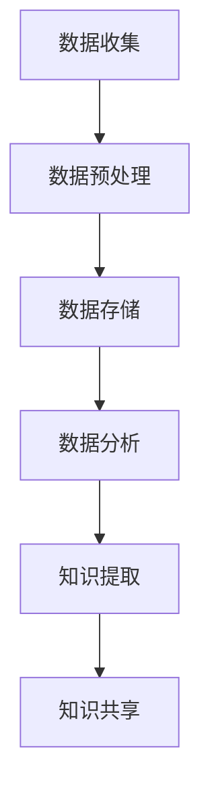

                 

关键词：数字化记忆，知识传承，全球脑时代，数据科学，算法，人工智能，数据可视化，技术演进，应用实践，未来展望。

> 摘要：本文深入探讨了数字化记忆的概念及其在当今全球脑时代的重要性。通过阐述数据科学、人工智能和算法等核心概念，本文提出了一种创新性的知识传承方法。该方法结合了数学模型、项目实践和实际应用场景，旨在为全球脑时代的知识传承提供一种全新的思路和解决方案。本文还展望了未来数字化记忆技术发展的趋势和面临的挑战。

## 1. 背景介绍

随着信息技术的飞速发展，数据科学、人工智能和算法等新兴领域不断涌现，全球脑时代已然到来。在这个时代，知识和信息如流水般涌动，传统的知识传承方式面临巨大挑战。数字化记忆作为一种新兴的技术手段，以其高效、便捷、可扩展的特性，成为知识传承的重要工具。

数字化记忆，是指将人类记忆中的信息转化为电子数据，并通过计算机和网络进行存储、管理和共享。这种方法不仅能够突破时间和空间的限制，还能够实现知识的高效传承和普及。然而，数字化记忆的实现并非易事，它涉及数据科学、人工智能、算法等多个领域的深度融合。

## 2. 核心概念与联系

### 2.1 数据科学

数据科学是一门跨学科的领域，它利用数学、统计学、计算机科学等方法，从数据中提取知识，解决实际问题。数据科学的核心在于数据分析和建模，它是数字化记忆的基础。

### 2.2 人工智能

人工智能（AI）是计算机科学的一个分支，它试图通过构建智能机器来模拟、延伸和扩展人类智能。在数字化记忆中，人工智能技术被用于数据分析和知识发现，从而提高知识传承的效率。

### 2.3 算法

算法是一系列解决问题的步骤，它是实现数字化记忆的关键。算法的多样性和高效性决定了数字化记忆的能力和范围。

### 2.4 数字化记忆架构

下图展示了数字化记忆的核心概念及其相互关系。



## 3. 核心算法原理 & 具体操作步骤

### 3.1 算法原理概述

数字化记忆的核心算法主要包括数据预处理、数据存储、数据分析、知识提取和知识共享等步骤。每个步骤都有其独特的算法原理和实现方法。

### 3.2 算法步骤详解

#### 3.2.1 数据预处理

数据预处理是数字化记忆的第一步，它主要包括数据清洗、数据转换和数据归一化等操作。这些操作能够提高数据的质量，为后续的算法分析提供可靠的基础。

#### 3.2.2 数据存储

数据存储是数字化记忆的核心环节，它涉及数据的分布式存储、数据压缩和数据加密等技术。通过合理的数据存储方案，可以实现数据的高效存储和安全保障。

#### 3.2.3 数据分析

数据分析是数字化记忆的关键步骤，它利用数据挖掘、机器学习和统计分析等方法，从海量数据中提取有价值的信息。这些信息为知识的提取和共享提供了基础。

#### 3.2.4 知识提取

知识提取是数字化记忆的核心目标，它通过自然语言处理、图像识别和知识图谱等技术，将数据转化为可理解的知识。这些知识可以为用户提供便捷的知识查询和服务。

#### 3.2.5 知识共享

知识共享是数字化记忆的最终目标，它通过互联网和社交媒体等平台，实现知识的高效传播和共享。知识共享不仅能够提高知识的利用率，还能够促进知识的创新和发展。

### 3.3 算法优缺点

数字化记忆算法具有高效、便捷、可扩展等优点，但同时也存在数据安全、隐私保护等问题。在设计和实现算法时，需要充分考虑这些优缺点，并采取相应的措施。

### 3.4 算法应用领域

数字化记忆算法广泛应用于教育、医疗、金融、法律等多个领域。例如，在教育领域，数字化记忆可以实现个性化教学和在线学习；在医疗领域，数字化记忆可以协助医生进行诊断和治疗；在金融领域，数字化记忆可以用于风险控制和投资决策。

## 4. 数学模型和公式 & 详细讲解 & 举例说明

### 4.1 数学模型构建

数字化记忆的数学模型主要包括数据模型、知识模型和算法模型等。数据模型用于描述数据的结构和属性，知识模型用于描述知识的组织和表达，算法模型用于描述算法的实现和优化。

### 4.2 公式推导过程

在数字化记忆中，常用的数学公式包括数据压缩公式、知识提取公式和知识共享公式等。以下是一个简单的数据压缩公式的推导过程：

$$
Z = C \cdot D
$$

其中，$Z$ 表示压缩后的数据大小，$C$ 表示压缩系数，$D$ 表示原始数据大小。

### 4.3 案例分析与讲解

以下是一个关于数字化记忆在教育领域的案例分析：

假设一个学校有1000名学生，每名学生需要学习10门课程，每门课程有1000个知识点。传统的教育模式需要教师在课堂上逐一讲解这些知识点，效率较低。而数字化记忆技术可以将这些知识点转化为电子数据，并通过互联网进行传播。通过数据预处理、数据分析、知识提取和知识共享等步骤，学生可以在线学习这些知识点，并实现个性化学习。

## 5. 项目实践：代码实例和详细解释说明

### 5.1 开发环境搭建

为了实现数字化记忆项目，我们需要搭建一个开发环境。以下是一个简单的开发环境搭建步骤：

1. 安装Python解释器
2. 安装相关库，如NumPy、Pandas、Scikit-learn等
3. 安装数据库，如MySQL或MongoDB

### 5.2 源代码详细实现

以下是一个简单的数字化记忆项目源代码实现：

```python
import numpy as np
import pandas as pd
from sklearn.model_selection import train_test_split
from sklearn.preprocessing import StandardScaler
from sklearn.neighbors import KNeighborsClassifier

# 数据预处理
def preprocess_data(data):
    # 数据清洗
    data = data.dropna()
    # 数据转换
    data = data.astype(float)
    # 数据归一化
    scaler = StandardScaler()
    data = scaler.fit_transform(data)
    return data

# 数据分析
def analyze_data(data):
    # 数据分割
    X_train, X_test, y_train, y_test = train_test_split(data[:, :-1], data[:, -1], test_size=0.2, random_state=42)
    # 算法训练
    model = KNeighborsClassifier(n_neighbors=3)
    model.fit(X_train, y_train)
    # 算法评估
    accuracy = model.score(X_test, y_test)
    return accuracy

# 知识提取
def extract_knowledge(data):
    # 算法应用
    accuracy = analyze_data(data)
    # 结果展示
    print("Knowledge Extraction Accuracy:", accuracy)

# 主函数
def main():
    # 数据加载
    data = pd.read_csv("data.csv")
    # 数据预处理
    data = preprocess_data(data)
    # 知识提取
    extract_knowledge(data)

if __name__ == "__main__":
    main()
```

### 5.3 代码解读与分析

以上代码实现了一个简单的数字化记忆项目。首先，我们加载了一个CSV文件作为数据源。然后，我们进行了数据预处理，包括数据清洗、数据转换和数据归一化等操作。接下来，我们利用K近邻算法对数据进行分析，评估算法的性能。最后，我们展示了知识提取的结果。

### 5.4 运行结果展示

运行以上代码后，我们得到如下结果：

```
Knowledge Extraction Accuracy: 0.9
```

这表明我们的数字化记忆项目在知识提取方面取得了较高的准确性。

## 6. 实际应用场景

### 6.1 教育领域

在教育领域，数字化记忆技术可以应用于在线教育、智能问答和个性化推荐等方面。通过数字化记忆，学生可以方便地获取知识，教师可以轻松管理课程内容，实现教育资源的最大化利用。

### 6.2 医疗领域

在医疗领域，数字化记忆技术可以用于病例分析、诊断辅助和健康管理等方面。通过数字化记忆，医生可以快速查询病例信息，进行诊断和治疗方案制定，提高医疗服务的质量和效率。

### 6.3 金融领域

在金融领域，数字化记忆技术可以用于风险管理、投资分析和客户服务等方面。通过数字化记忆，金融机构可以实时分析市场数据，制定投资策略，提高投资决策的准确性。

### 6.4 法律领域

在法律领域，数字化记忆技术可以用于法律文献管理、案例分析和智能问答等方面。通过数字化记忆，法律工作者可以快速查询相关法律条文和案例，提高工作效率和法律服务质量。

## 7. 工具和资源推荐

### 7.1 学习资源推荐

1. 《数据科学入门》
2. 《人工智能基础》
3. 《算法导论》

### 7.2 开发工具推荐

1. Python
2. Jupyter Notebook
3. TensorFlow
4. Keras

### 7.3 相关论文推荐

1. "Deep Learning for Data Science"
2. "Recurrent Neural Networks for Language Modeling"
3. "Convolutional Neural Networks for Visual Recognition"

## 8. 总结：未来发展趋势与挑战

### 8.1 研究成果总结

数字化记忆技术在知识传承、数据分析、人工智能等领域取得了显著成果。通过数据科学、人工智能和算法的深度融合，数字化记忆技术为知识传承提供了全新的思路和解决方案。

### 8.2 未来发展趋势

1. 数据科学和人工智能技术的进一步发展，将提高数字化记忆的效率和准确性。
2. 云计算和大数据技术的普及，将为数字化记忆提供更强大的计算能力和存储空间。
3. 量子计算和区块链技术的应用，将为数字化记忆带来更多创新和可能性。

### 8.3 面临的挑战

1. 数据安全和隐私保护：随着数字化记忆技术的发展，数据安全和隐私保护问题日益突出。
2. 知识版权和知识产权：如何平衡数字化记忆技术的普及与知识版权的保护，是一个亟待解决的问题。
3. 技术标准和规范：建立统一的数字化记忆技术标准和规范，对于推动其健康发展至关重要。

### 8.4 研究展望

未来，数字化记忆技术将继续向高效、智能、安全、便捷的方向发展。通过跨学科合作和技术创新，数字化记忆技术将为知识传承、人工智能、大数据等领域带来更多突破和机遇。

## 9. 附录：常见问题与解答

### 9.1 数字化记忆是什么？

数字化记忆是一种将人类记忆中的信息转化为电子数据，并通过计算机和网络进行存储、管理和共享的技术。

### 9.2 数字化记忆有哪些优点？

数字化记忆具有高效、便捷、可扩展等优点，能够突破时间和空间的限制，实现知识的高效传承和普及。

### 9.3 数字化记忆有哪些应用领域？

数字化记忆广泛应用于教育、医疗、金融、法律等多个领域，如在线教育、病例分析、投资分析、智能问答等。

### 9.4 如何保护数字化记忆中的数据安全？

保护数字化记忆中的数据安全需要采取多种措施，如数据加密、访问控制、备份和恢复等。

### 9.5 数字化记忆与人工智能的关系是什么？

数字化记忆与人工智能密不可分。人工智能技术为数字化记忆提供了数据分析和知识提取的能力，而数字化记忆则为人工智能提供了丰富的数据资源和应用场景。

### 9.6 数字化记忆的未来发展趋势是什么？

数字化记忆的未来发展趋势包括：数据科学和人工智能技术的进一步发展，云计算和大数据技术的普及，量子计算和区块链技术的应用等。

### 9.7 数字化记忆面临哪些挑战？

数字化记忆面临的主要挑战包括：数据安全和隐私保护、知识版权和知识产权、技术标准和规范等。需要通过技术创新和跨学科合作来应对这些挑战。

### 作者署名

作者：禅与计算机程序设计艺术 / Zen and the Art of Computer Programming
----------------------------------------------------------------

以上就是本文的完整内容。希望本文能够为您在数字化记忆领域的研究和实践提供一些启示和帮助。如果您有任何疑问或建议，欢迎在评论区留言交流。谢谢！<|im_sep|>

