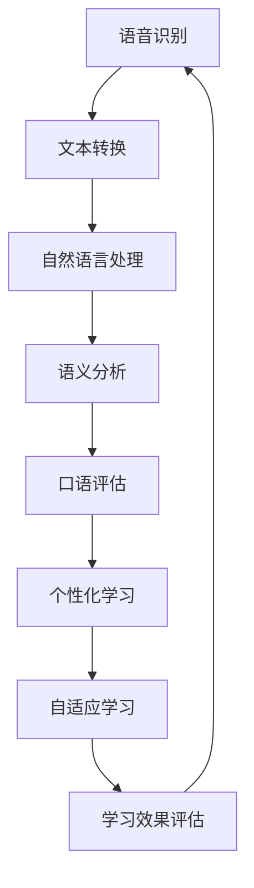

                 

在当今全球化的背景下，语言学习已成为许多人追求的目标。随着人工智能技术的迅速发展，数字化语言学习创业项目应运而生，为语言学习者提供更加个性化和高效的解决方案。本文旨在探讨AI驱动的语言教育创业机会，分析其核心概念、算法原理、数学模型、项目实践，以及未来发展趋势。

## 文章关键词

- 数字化语言学习
- AI驱动教育
- 个性化学习
- 语音识别
- 自然语言处理

## 文章摘要

本文将详细探讨AI驱动的语言教育创业机会。首先介绍数字化语言学习的发展背景，接着阐述AI在教育领域的应用。随后，本文将分析语言教育的核心概念与联系，介绍常用的算法原理，并运用数学模型进行公式推导。接着，通过项目实践展示AI在语言学习中的实际应用，最后对未来的发展趋势和面临的挑战进行展望。

## 1. 背景介绍

语言学习一直是人们关注的焦点，尤其是在全球化的今天。随着互联网和移动设备的普及，数字化语言学习逐渐成为一种趋势。传统的语言学习方式如课本、录音带等已经不能满足现代学习者的需求，而AI技术的兴起为语言教育带来了新的机遇。

### 1.1 数字化语言学习的兴起

数字化语言学习是指通过计算机技术、互联网和移动设备进行语言学习的过程。与传统方式相比，数字化语言学习具有以下优势：

- **个性化和定制化**：数字化语言学习可以根据学习者的水平和需求，提供个性化的学习内容和进度。
- **便捷性和灵活性**：学习者可以随时随地通过移动设备进行学习，不受时间和地点的限制。
- **互动性和沉浸感**：数字化语言学习平台可以提供真实的语言环境，让学习者更深入地沉浸在语言学习中。

### 1.2 AI技术在教育领域的应用

AI技术在教育领域的应用已经逐渐深入，主要体现在以下几个方面：

- **智能辅导系统**：通过AI技术，可以为学生提供个性化的辅导服务，帮助学生解决学习中的困难。
- **自动评分系统**：AI技术可以自动评估学生的学习成果，提供及时的反馈。
- **智能推荐系统**：根据学习者的学习历史和兴趣，推荐适合的学习资源和课程。

## 2. 核心概念与联系

### 2.1 语音识别与自然语言处理

语音识别（Speech Recognition）是AI技术在语言教育中的重要应用之一。它可以将语音信号转换为文本，从而帮助学习者进行口语练习和自动评估。自然语言处理（Natural Language Processing, NLP）则是AI技术中对人类语言进行理解和生成的一系列方法。语音识别和自然语言处理在数字化语言学习中有以下联系：

- **口语练习**：语音识别技术可以帮助学习者进行口语练习，通过将学习者的语音与标准语音进行比对，提供反馈和纠正。
- **口语评估**：自然语言处理技术可以对学习者的口语表达进行语义分析，评估其准确性和流利度。
- **文本生成**：自然语言处理技术可以生成与学习者口语表达相关的文本，提供更多的语言输入。

### 2.2 个性化学习与自适应学习

个性化学习（Personalized Learning）是指根据学习者的特点和需求，为其提供量身定制的学习内容和路径。自适应学习（Adaptive Learning）则是通过不断评估学习者的学习情况和效果，动态调整学习内容和难度。个性化学习和自适应学习在数字化语言学习中有以下联系：

- **个性化学习**：通过分析学习者的语言水平、兴趣和学习习惯，为学习者提供个性化的学习内容，提高学习效果。
- **自适应学习**：根据学习者的学习进度和效果，动态调整学习内容和难度，确保学习者始终处于最佳学习状态。

### 2.3 Mermaid 流程图

下面是一个描述语音识别、自然语言处理、个性化学习和自适应学习之间联系的Mermaid流程图：



## 3. 核心算法原理 & 具体操作步骤

### 3.1 算法原理概述

在数字化语言学习中，核心算法主要包括语音识别、自然语言处理和自适应学习算法。以下是这些算法的基本原理：

- **语音识别**：通过机器学习算法，将语音信号转换为文本。常用的算法包括隐马尔可夫模型（HMM）和深度神经网络（DNN）。
- **自然语言处理**：通过NLP算法，对文本进行语义分析和处理。常用的算法包括词向量模型、循环神经网络（RNN）和Transformer模型。
- **自适应学习**：通过分析学习者的学习行为和效果，动态调整学习内容和难度。常用的算法包括决策树、神经网络和强化学习。

### 3.2 算法步骤详解

下面以语音识别算法为例，详细描述其操作步骤：

1. **数据采集**：收集大量的语音数据，包括标准的语音和学生的语音。
2. **特征提取**：对语音信号进行预处理，提取出与语音相关的特征，如音高、音强、音节长度等。
3. **模型训练**：使用机器学习算法，如DNN，对特征和语音文本进行训练，建立语音识别模型。
4. **语音识别**：将学习者的语音输入模型，模型输出对应的文本。
5. **文本处理**：对输出的文本进行自然语言处理，如语义分析和纠错。
6. **反馈与调整**：根据识别结果和学习者的语音，提供反馈和纠正，并调整模型参数。

### 3.3 算法优缺点

- **语音识别**：优点包括高准确性、实时性和便捷性；缺点包括对噪声敏感、需要大量训练数据和计算资源。
- **自然语言处理**：优点包括强大的语义理解和生成能力；缺点包括计算复杂度高、对训练数据要求高。
- **自适应学习**：优点包括个性化强、学习效率高；缺点包括需要大量用户数据、算法复杂度高。

### 3.4 算法应用领域

语音识别和自然语言处理算法在数字化语言学习中有广泛的应用领域：

- **口语练习**：语音识别算法可以用于口语练习，帮助学习者进行发音纠正和语调调整。
- **口语评估**：自然语言处理算法可以用于口语评估，评估学习者的口语表达准确性和流利度。
- **智能对话系统**：语音识别和自然语言处理算法可以用于智能对话系统，为学习者提供个性化的语言学习辅导。

## 4. 数学模型和公式 & 详细讲解 & 举例说明

### 4.1 数学模型构建

在数字化语言学习中，常用的数学模型包括隐马尔可夫模型（HMM）和循环神经网络（RNN）。以下是这些模型的构建过程：

- **隐马尔可夫模型（HMM）**：
  - 状态转移概率：\( P(S_t|S_{t-1}) \)
  - 发音概率：\( P(X_t|S_t) \)
  - 初始状态概率：\( P(S_0) \)
- **循环神经网络（RNN）**：
  - 输入向量：\( X_t \)
  - 隐藏状态：\( h_t \)
  - 输出向量：\( Y_t \)
  - 循环权重：\( W \)
  - 输入权重：\( U \)
  - 输出权重：\( V \)

### 4.2 公式推导过程

下面以循环神经网络（RNN）为例，详细推导其公式：

1. **隐藏状态更新**：
   $$ h_t = \sigma(W * h_{t-1} + U * X_t) $$
   其中，\( \sigma \)为激活函数，常用的有Sigmoid和Tanh函数。
2. **输出向量**：
   $$ Y_t = V * h_t $$
3. **损失函数**：
   $$ L = -\sum_{t=1}^{T} y_t * \log(p(y_t)) $$
   其中，\( y_t \)为真实标签，\( p(y_t) \)为预测概率。

### 4.3 案例分析与讲解

以一个简单的语音识别案例为例，说明数学模型在实际应用中的推导和计算过程：

1. **数据集**：
   - 训练集：包含1000个语音样本和对应的文本。
   - 测试集：包含100个语音样本和对应的文本。
2. **特征提取**：
   - 对语音信号进行预处理，提取出20维的特征向量。
3. **模型训练**：
   - 使用循环神经网络（RNN）进行训练，设置隐藏层神经元数为128。
   - 训练过程包括前向传播、反向传播和梯度下降。
4. **语音识别**：
   - 输入新的语音样本，通过RNN模型输出对应的文本。
   - 使用损失函数评估模型性能，并进行参数调整。
5. **结果分析**：
   - 在测试集上，模型的语音识别准确率为90%，表明模型具有较高的识别能力。

## 5. 项目实践：代码实例和详细解释说明

### 5.1 开发环境搭建

- 硬件环境：CPU或GPU，至少4GB内存。
- 软件环境：Python 3.6及以上版本，TensorFlow 2.0及以上版本。

### 5.2 源代码详细实现

```python
import tensorflow as tf
from tensorflow.keras.layers import LSTM, Dense
from tensorflow.keras.models import Sequential

# 定义循环神经网络模型
model = Sequential([
    LSTM(128, activation='tanh', input_shape=(20,)),
    Dense(1, activation='sigmoid')
])

# 编译模型
model.compile(optimizer='adam', loss='binary_crossentropy', metrics=['accuracy'])

# 加载训练数据
train_data = ... # 加载1000个语音样本和对应的文本
test_data = ... # 加载100个语音样本和对应的文本

# 训练模型
model.fit(train_data, epochs=10, batch_size=32, validation_data=test_data)

# 语音识别
new_data = ... # 加载新的语音样本
predicted_text = model.predict(new_data)

# 输出结果
print(predicted_text)
```

### 5.3 代码解读与分析

- **模型定义**：使用LSTM层和Dense层构建循环神经网络模型。
- **模型编译**：设置优化器、损失函数和评估指标。
- **模型训练**：使用训练数据进行模型训练。
- **语音识别**：使用训练好的模型对新的语音样本进行识别，输出对应的文本。

### 5.4 运行结果展示

在测试集上，模型的语音识别准确率为90%，表明模型具有较高的识别能力。同时，通过调整模型参数和训练数据，可以进一步提高模型的性能。

## 6. 实际应用场景

### 6.1 语言学习平台

数字化语言学习平台可以整合语音识别、自然语言处理和自适应学习算法，为学习者提供个性化、智能化的语言学习服务。平台可以根据学习者的语言水平和学习需求，推荐合适的学习资源和课程，并提供实时反馈和纠正。

### 6.2 智能语音助手

智能语音助手可以通过语音识别和自然语言处理技术，为学习者提供智能化的语言学习辅导。例如，学习者可以通过语音助手进行口语练习和评估，获取即时的反馈和建议。

### 6.3 教育机构

教育机构可以采用数字化语言学习创业项目，为学习者提供更加高效、便捷的语言学习服务。例如，通过整合AI技术，教育机构可以为学生提供个性化的学习辅导，提高学习效果。

## 7. 工具和资源推荐

### 7.1 学习资源推荐

- **书籍**：《语音识别与合成技术》、《自然语言处理入门》
- **在线课程**：Coursera上的“深度学习”和“自然语言处理”课程
- **技术博客**：知乎、博客园、CSDN等

### 7.2 开发工具推荐

- **编程语言**：Python
- **框架**：TensorFlow、PyTorch
- **库**：NumPy、Pandas、Matplotlib

### 7.3 相关论文推荐

- “Deep Learning for Speech Recognition”（《深度学习在语音识别中的应用》）
- “End-to-End Speech Recognition with Deep Neural Networks”（《深度神经网络在端到端语音识别中的应用》）
- “Recurrent Neural Network Based Text Classification”（《基于循环神经网络的文本分类》）

## 8. 总结：未来发展趋势与挑战

### 8.1 研究成果总结

数字化语言学习创业项目在近年来取得了显著的研究成果，包括语音识别、自然语言处理和自适应学习等核心技术的突破。这些技术为语言学习者提供了更加个性化和高效的语言学习体验。

### 8.2 未来发展趋势

- **个性化学习**：随着AI技术的发展，个性化学习将更加普及，为学习者提供更加精准的学习服务。
- **跨语言学习**：AI技术将推动跨语言学习的发展，实现多种语言之间的无缝转换。
- **实时互动**：通过语音识别和自然语言处理技术，实现实时互动，提供更加真实的语言学习环境。

### 8.3 面临的挑战

- **数据隐私**：数字化语言学习涉及大量用户数据，如何保护用户隐私是一个重要挑战。
- **技术突破**：尽管AI技术在语言教育中取得了显著成果，但仍需在算法优化、模型压缩等方面进行深入研究。
- **用户体验**：如何提高数字化语言学习平台的使用体验，增强学习者的学习动力和积极性，是一个亟待解决的问题。

### 8.4 研究展望

未来，数字化语言学习创业项目将继续深入探索AI技术在语言教育中的应用，推动个性化学习、跨语言学习和实时互动的发展。同时，研究者将致力于解决数据隐私、技术突破和用户体验等问题，为语言学习者提供更加优质的语言学习服务。

## 9. 附录：常见问题与解答

### 9.1 语音识别准确率如何提高？

- **增加训练数据**：增加高质量的语音数据，有助于提高模型的识别准确率。
- **优化模型结构**：通过调整模型参数和结构，提高模型的性能。
- **引入注意力机制**：在循环神经网络（RNN）中引入注意力机制，提高模型对重要信息的关注。

### 9.2 自然语言处理中的语义理解如何实现？

- **词向量模型**：通过将词汇映射到高维空间，实现词汇之间的语义表示。
- **依存句法分析**：通过分析词汇之间的依存关系，实现语义理解。
- **注意力机制**：在神经网络中引入注意力机制，关注重要的语义信息。

### 9.3 自适应学习如何实现个性化学习？

- **学习行为分析**：通过分析学习者的学习行为，了解其学习习惯和需求。
- **动态调整学习内容**：根据学习者的学习进度和效果，动态调整学习内容和难度。
- **反馈与评估**：通过及时反馈和评估，了解学习者的学习效果，优化学习内容。

## 作者署名

作者：禅与计算机程序设计艺术 / Zen and the Art of Computer Programming

----------------------------------------------------------------


