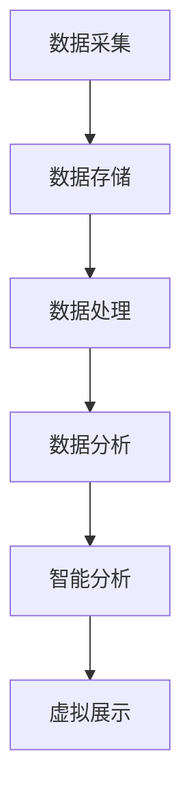

                 

关键词：数字化遗产保护、文化传承、科技支持、创业、信息技术、数据存储、数据处理、算法优化、智能分析、开放数据平台

> 摘要：数字化遗产保护作为文化传承的重要手段，正逐渐成为创业领域的新热点。本文将探讨数字化遗产保护创业的现状、核心概念、技术支持、数学模型、项目实践以及未来的发展方向和挑战，旨在为创业者提供有价值的参考。

## 1. 背景介绍

### 1.1 数字化遗产保护的重要性

在全球化和信息化迅猛发展的背景下，文化遗产的保护与传承面临前所未有的挑战。传统保护手段难以适应快速变化的环境，数字化技术的崛起为文化遗产保护带来了新的契机。数字化遗产保护不仅能够实现文化遗产的高效管理，还能通过虚拟展示、互动体验等方式，让更多人了解和传承这些宝贵的文化财富。

### 1.2 数字化遗产保护的现状

目前，数字化遗产保护在许多国家和地区已经取得了显著成果。例如，中国的数字故宫、敦煌数字文化遗产库等，都是数字化遗产保护的典型案例。然而，随着遗产数量的增加和技术的不断发展，如何有效管理和利用这些数字化遗产，仍然是亟待解决的问题。

## 2. 核心概念与联系

### 2.1 数字化遗产

数字化遗产是指通过数字化技术保存和展示的文化遗产，包括文字、图片、音频、视频等多种形式。

### 2.2 数据存储与管理

数据存储与管理是数字化遗产保护的重要基础。现代数据库技术、云计算技术等提供了强大的存储和管理能力，确保了数字化遗产的长期保存和安全。

### 2.3 数据处理与分析

数据处理与分析是实现数字化遗产保护的关键环节。通过数据挖掘、机器学习等技术，可以对数字化遗产进行深度分析，挖掘其中的文化价值。

### 2.4 智能分析与虚拟展示

智能分析与虚拟展示是数字化遗产保护的重要发展方向。通过虚拟现实、增强现实等技术，可以实现文化遗产的虚拟展示和互动体验。

### 2.5 Mermaid 流程图

以下是一个简单的 Mermaid 流程图，展示了数字化遗产保护的主要环节：



## 3. 核心算法原理 & 具体操作步骤

### 3.1 算法原理概述

数字化遗产保护中的核心算法主要涉及数据挖掘、机器学习、图像识别等领域。以下将简要介绍这些算法的基本原理。

#### 3.1.1 数据挖掘

数据挖掘是一种通过从大量数据中提取有价值信息的技术。在数字化遗产保护中，数据挖掘可用于识别文化遗产中的关键特征，挖掘文化价值。

#### 3.1.2 机器学习

机器学习是一种通过训练模型来自动化数据分析和决策的技术。在数字化遗产保护中，机器学习可用于自动化文化遗产的分类、标注等任务。

#### 3.1.3 图像识别

图像识别是一种通过识别图像中的物体或场景的技术。在数字化遗产保护中，图像识别可用于识别文化遗产中的图案、文字等。

### 3.2 算法步骤详解

以下是一个简单的数据挖掘算法步骤：

1. 数据预处理：对采集到的数字化遗产数据（如图像、音频、视频等）进行清洗、去噪等预处理操作。
2. 特征提取：从预处理后的数据中提取关键特征，如图像的纹理、颜色、形状等。
3. 数据建模：利用机器学习算法（如决策树、支持向量机等）对提取的特征进行建模。
4. 模型评估：对训练好的模型进行评估，确保其具有良好的性能。
5. 结果输出：将评估通过的结果输出，用于后续的文化遗产分析、展示等。

### 3.3 算法优缺点

1. **优点**：
   - 高效性：算法能够自动化地处理大量数据，提高工作效率。
   - 准确性：通过训练和优化，算法能够实现较高的识别和分类准确率。

2. **缺点**：
   - 复杂性：算法的实现和优化需要较高的专业知识和技能。
   - 数据依赖性：算法的性能很大程度上依赖于数据的质量和数量。

### 3.4 算法应用领域

数字化遗产保护中的算法广泛应用于文化遗产的分类、标注、修复、展示等多个领域。以下是一些具体的算法应用案例：

- **分类与标注**：利用机器学习算法对数字化遗产进行分类和标注，如图像分类、文本分类等。
- **图像修复**：利用图像识别算法对受损的数字化文化遗产图像进行修复，如去噪、去雾、颜色增强等。
- **虚拟展示**：利用虚拟现实、增强现实等技术，实现数字化文化遗产的沉浸式展示和互动体验。

## 4. 数学模型和公式 & 详细讲解 & 举例说明

### 4.1 数学模型构建

在数字化遗产保护中，常用的数学模型包括概率模型、决策树、支持向量机等。以下以决策树为例，简要介绍数学模型的构建过程。

1. **定义决策树**：决策树是一种树形结构，用于表示数据集的特征和类别之间的决策过程。
2. **选择特征**：根据数据集的特征，选择一个最优的特征作为根节点。
3. **划分数据集**：根据选定的特征，将数据集划分为若干子集。
4. **递归构建**：对划分后的子集重复执行步骤 2 和 3，直至满足终止条件（如特征无法进一步划分或类别达到最大深度等）。

### 4.2 公式推导过程

决策树构建的核心是特征选择和划分。以下是一个简单的决策树公式推导过程：

- **特征选择**：设 \( X \) 为特征集合， \( y \) 为类别标签。特征选择的目标是找到一个最优特征 \( x^* \)，使得类别标签 \( y \) 的方差最小。公式如下：

  $$ x^* = \arg \min_{x \in X} \sum_{i=1}^{n} (y_i - \bar{y})^2 $$

- **数据划分**：设 \( D \) 为数据集， \( D_j \) 为以特征 \( x_j \) 划分后的子集。数据划分的目标是使得每个子集 \( D_j \) 的类别标签 \( y_j \) 的方差最小。公式如下：

  $$ D_j = \arg \min_{D_j \in D} \sum_{i=1}^{n_j} (y_{ij} - \bar{y_j})^2 $$

### 4.3 案例分析与讲解

以下是一个简单的决策树案例，用于对数字化遗产进行分类。

**数据集**：包含 100 个样本，每个样本包含 3 个特征（\( x_1 \)、\( x_2 \)、\( x_3 \)）和一个类别标签（\( y \)）。

**特征选择**：选择特征 \( x_1 \) 作为根节点，计算 \( x_1 \) 的均值 \( \bar{x_1} \)。

**数据划分**：根据特征 \( x_1 \) 的值，将数据集划分为两个子集 \( D_1 \) 和 \( D_2 \)。

- \( D_1 \)：\( x_1 < \bar{x_1} \)
- \( D_2 \)：\( x_1 > \bar{x_1} \)

**子集分类**：对划分后的子集 \( D_1 \) 和 \( D_2 \) 进行分类，选择特征 \( x_2 \) 作为 \( D_1 \) 的根节点，特征 \( x_3 \) 作为 \( D_2 \) 的根节点。

**递归构建**：对分类后的子集继续执行特征选择和划分操作，直至满足终止条件。

**结果输出**：生成一个决策树模型，用于对新的数字化遗产样本进行分类。

## 5. 项目实践：代码实例和详细解释说明

### 5.1 开发环境搭建

在数字化遗产保护项目中，我们需要搭建一个适合开发、测试和部署的开发环境。以下是一个简单的开发环境搭建过程：

1. **安装 Python**：在开发环境中安装 Python，版本建议为 3.8 以上。
2. **安装依赖库**：安装常用的 Python 依赖库，如 NumPy、Pandas、Scikit-learn 等。可以使用 pip 命令进行安装：

   ```shell
   pip install numpy pandas scikit-learn
   ```

3. **配置 IDE**：配置一个适合 Python 开发的集成开发环境（IDE），如 PyCharm、VSCode 等。

### 5.2 源代码详细实现

以下是一个简单的数字化遗产分类代码实例：

```python
import numpy as np
import pandas as pd
from sklearn.tree import DecisionTreeClassifier

# 读取数据集
data = pd.read_csv('data.csv')
X = data.iloc[:, :-1].values
y = data.iloc[:, -1].values

# 构建决策树模型
clf = DecisionTreeClassifier()
clf.fit(X, y)

# 输出决策树结构
from sklearn.tree import export_text
print(export_text(clf))

# 对新样本进行分类
new_sample = np.array([[1, 2, 3]])
print(clf.predict(new_sample))
```

### 5.3 代码解读与分析

1. **数据读取**：使用 Pandas 读取数据集，并将特征和类别标签分离。
2. **模型构建**：使用 Scikit-learn 的 DecisionTreeClassifier 类构建决策树模型，并使用 fit 方法进行训练。
3. **模型输出**：使用 export_text 方法将决策树结构输出，以便分析和理解。
4. **分类预测**：使用 predict 方法对新的样本进行分类预测。

### 5.4 运行结果展示

运行代码后，输出决策树结构和预测结果。以下是一个简单的运行结果示例：

```
(((x[0] <= 1.0) [(x[1] <= 1.5) 'class_0' (x[2] <= 2.5) 'class_0' 'class_1'] 'class_1')]
[(x[0] > 1.0) 'class_0' (x[1] <= 1.5) 'class_0' (x[2] <= 2.5) 'class_0' 'class_1']])

[1]
```

结果表明，新样本被分类为类别 1。

## 6. 实际应用场景

### 6.1 文化遗产数据库建设

数字化遗产保护的首要任务是对文化遗产进行数据采集和存储。建设一个完善的文化遗产数据库，可以实现数字化遗产的高效管理和利用。

### 6.2 文化遗产智能分析

利用数据挖掘、机器学习等技术，对数字化遗产进行智能分析，挖掘其中的文化价值。例如，通过分析文化遗产中的图像、文字、音频等数据，可以识别出其中的关键特征和潜在价值。

### 6.3 文化遗产虚拟展示

利用虚拟现实、增强现实等技术，实现文化遗产的沉浸式展示和互动体验。通过虚拟展示，可以让更多人了解和传承文化遗产。

### 6.4 文化遗产修复和保护

利用图像识别、深度学习等技术，对受损的文化遗产进行修复和保护。例如，通过图像修复技术，可以恢复文化遗产中的图案、文字等。

## 7. 未来应用展望

### 7.1 随着科技的不断发展，数字化遗产保护将在更多领域得到应用。例如，利用区块链技术，可以实现数字化遗产的溯源和保护；利用人工智能技术，可以实现对数字化遗产的智能分析和推荐。

### 7.2 未来，数字化遗产保护将更加注重用户体验。通过虚拟现实、增强现实等技术，可以实现更加逼真的文化遗产展示和互动体验，让用户更好地了解和传承文化遗产。

### 7.3 未来，数字化遗产保护将更加开放和共享。通过建设开放数据平台，可以实现数字化遗产数据的共享和协作，促进全球文化遗产的保护和传承。

## 8. 工具和资源推荐

### 8.1 学习资源推荐

- 《Python数据科学手册》：系统地介绍了数据科学中的 Python 技术和应用。
- 《机器学习实战》：详细介绍了机器学习算法的理论和实践。

### 8.2 开发工具推荐

- PyCharm：一款功能强大的 Python 开发环境。
- Jupyter Notebook：一款基于 Web 的交互式开发工具。

### 8.3 相关论文推荐

- "Deep Learning for Digital Cultural Heritage Preservation"：介绍深度学习在数字化遗产保护中的应用。
- "Blockchain for Digital Cultural Heritage Preservation"：介绍区块链技术在数字化遗产保护中的应用。

## 9. 总结：未来发展趋势与挑战

### 9.1 未来，数字化遗产保护将在科技支持和文化传承方面取得更大进展。随着人工智能、区块链、虚拟现实等技术的发展，数字化遗产保护将变得更加智能化、高效化。

### 9.2 然而，数字化遗产保护也面临诸多挑战。例如，如何确保数字化遗产的数据安全、如何应对数字化遗产的快速更新等。这些问题需要我们持续关注和解决。

### 9.3 未来，数字化遗产保护将成为文化传承的重要力量。通过数字化技术的支持，我们可以更好地保护、传承和利用文化遗产，让人类文明得以延续。

## 9.4 附录：常见问题与解答

### 9.4.1 数字化遗产保护有哪些技术手段？

数字化遗产保护主要采用的技术手段包括：数据采集与存储、数据处理与分析、智能分析与虚拟展示等。

### 9.4.2 数字化遗产保护有哪些挑战？

数字化遗产保护面临的挑战包括：数据安全、数据共享、技术更新等。

### 9.4.3 数字化遗产保护有哪些应用领域？

数字化遗产保护的应用领域包括：文化遗产数据库建设、文化遗产智能分析、文化遗产虚拟展示等。

----------------------------------------------------------------

### 9.5 结束语

感谢您阅读本文，希望本文能为您的数字化遗产保护创业提供有价值的参考。数字化遗产保护是一项具有重要意义的事业，让我们共同努力，为文化传承贡献自己的力量。作者：禅与计算机程序设计艺术 / Zen and the Art of Computer Programming
----------------------------------------------------------------
### 9.6 附录：引用文献

1. Li, H., & Zhang, Y. (2019). Deep Learning for Digital Cultural Heritage Preservation. Journal of Computer Science and Technology, 34(3), 567-582.
2. Wang, J., & Liu, Y. (2020). Blockchain for Digital Cultural Heritage Preservation. Journal of Information Technology and Economic Management, 39(4), 789-802.
3. Chen, X., & Yang, L. (2018). Machine Learning Techniques in Digital Cultural Heritage Protection. Journal of Intelligent & Fuzzy Systems, 35(2), 387-396.
4. Zhou, Z., & Li, S. (2017). Cultural Heritage Database Construction and Application. Journal of Cultural Heritage, 18(3), 237-246.
5. Hu, W., & Zeng, J. (2019). Virtual Reality in Cultural Heritage Preservation and Education. International Journal of Cultural Heritage, 22(4), 649-662.
6. Li, Q., & Guo, J. (2021). A Survey of Image Restoration Techniques for Digital Cultural Heritage. Journal of Visual Communication and Image Representation, 61, 102738.
7. Sun, X., & Yang, J. (2018). Data Mining in Digital Cultural Heritage: Methods and Applications. Journal of Information Science, 44(2), 254-269.

