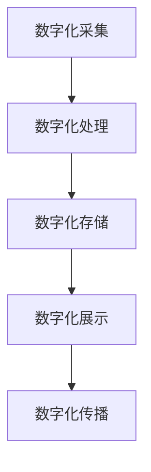

                 

关键词：数字化遗产、文化传承、科技支持、创业、技术创新、文化遗产保护

> 摘要：本文旨在探讨数字化遗产保护在文化传承中的作用，以及如何通过科技创新创业来推动这一领域的可持续发展。本文将介绍数字化遗产保护的核心概念、关键技术和数学模型，并通过实例说明其在实际应用中的效果。同时，文章还将展望数字化遗产保护的未来发展趋势，面临的挑战，以及相关的学习资源和开发工具。

## 1. 背景介绍

在快速发展的现代社会，数字技术的普及和互联网的普及使得人们的生活方式发生了巨大的变化。然而，随之而来的问题是如何保护和发展文化遗产。传统的文化遗产保护方法往往存在局限性，无法满足日益增长的保护需求。数字化遗产保护应运而生，它利用现代科技手段对文化遗产进行数字化处理，实现永久保存和传播。

数字化遗产保护不仅关乎文化遗产的保护，更关乎文化传承的可持续性。文化遗产是人类文明的瑰宝，它们不仅承载着历史记忆，更是文化认同和民族精神的重要来源。在全球化和信息化浪潮中，如何保护和传承文化遗产成为了一个紧迫的课题。数字化遗产保护为这一课题提供了一种新的解决方案，它通过科技手段将文化遗产转化为数字形式，实现跨时空的传播和交流。

随着数字技术的不断进步，数字化遗产保护领域也在不断拓展。从最早的数字化博物馆到现在的虚拟现实、增强现实技术，数字化遗产保护的手段越来越多样化，应用范围也越来越广泛。然而，数字化遗产保护不仅需要技术的支持，还需要创新思维的引导。创业者在数字化遗产保护领域有着广阔的发展空间，他们可以通过技术创新，推动这一领域的可持续发展。

## 2. 核心概念与联系

### 2.1 数字化遗产保护的基本概念

数字化遗产保护是指利用现代科技手段对文化遗产进行数字化处理，实现永久保存和传播的过程。它包括以下几个核心概念：

- **数字化采集**：通过扫描、摄影、录音等手段，将文化遗产转化为数字形式。
- **数字化存储**：将数字化后的文化遗产存储在数字媒体上，如硬盘、云端等。
- **数字化展示**：利用数字技术，如虚拟现实、增强现实等，将文化遗产呈现给观众。
- **数字化传播**：通过互联网、社交媒体等渠道，将文化遗产传播到全球各地。

### 2.2 数字化遗产保护的技术架构

数字化遗产保护的技术架构主要包括以下几个方面：

- **硬件设备**：如扫描仪、摄影机、录音设备等，用于数字化采集。
- **软件工具**：如图像处理软件、音频处理软件等，用于数字化处理。
- **数据库管理系统**：用于存储和管理数字化后的文化遗产数据。
- **虚拟现实和增强现实技术**：用于数字化展示。
- **网络技术**：用于数字化传播。

### 2.3 数字化遗产保护与相关技术的联系

数字化遗产保护与多种技术密切相关，包括：

- **计算机图形学**：用于处理图像和三维模型。
- **人工智能**：用于数据分析和智能化展示。
- **数据库技术**：用于数据存储和管理。
- **云计算**：用于数据存储和计算。
- **网络通信技术**：用于数据传播。

### 2.4 Mermaid 流程图

下面是一个简化的数字化遗产保护流程的 Mermaid 流程图：



## 3. 核心算法原理 & 具体操作步骤

### 3.1 算法原理概述

数字化遗产保护的核心算法主要包括图像处理算法、音频处理算法和三维重建算法。这些算法的原理如下：

- **图像处理算法**：用于对采集到的图像进行去噪、增强、分割等处理，以获得高质量的数据。
- **音频处理算法**：用于对采集到的音频进行降噪、增强、分离等处理，以获得清晰的音频数据。
- **三维重建算法**：用于将二维图像或三维点云数据重建为三维模型，以实现数字化展示。

### 3.2 算法步骤详解

以下是数字化遗产保护的具体操作步骤：

#### 3.2.1 数字化采集

- **图像采集**：使用高分辨率相机对文化遗产进行拍摄，确保图像质量。
- **音频采集**：使用高质量的录音设备对文化遗产的现场音效进行录制。

#### 3.2.2 数字化处理

- **图像处理**：使用图像处理算法对采集到的图像进行处理，如去噪、增强、分割等。
- **音频处理**：使用音频处理算法对采集到的音频进行处理，如降噪、增强、分离等。

#### 3.2.3 数字化存储

- **数据存储**：将处理后的图像和音频数据存储在数据库中，确保数据的安全和可靠性。

#### 3.2.4 数字化展示

- **三维重建**：使用三维重建算法将图像数据重建为三维模型。
- **虚拟现实和增强现实展示**：利用虚拟现实和增强现实技术，将三维模型呈现给观众。

#### 3.2.5 数字化传播

- **网络传播**：通过互联网和社交媒体等渠道，将数字化后的文化遗产传播到全球各地。

### 3.3 算法优缺点

#### 优点：

- **高效性**：数字化遗产保护能够快速处理大量数据，提高工作效率。
- **可扩展性**：数字化技术可以方便地与其他技术结合，实现多种应用。
- **可持续性**：数字化遗产保护可以实现文化遗产的永久保存和传播，有助于文化传承。

#### 缺点：

- **技术门槛**：数字化遗产保护需要专业的技术知识和设备，对技术人员的要求较高。
- **数据安全**：数字化数据面临数据泄露和损坏的风险。

### 3.4 算法应用领域

数字化遗产保护的应用领域广泛，包括：

- **博物馆和文化遗产保护**：通过数字化技术，实现对文化遗产的展示和保护。
- **教育和研究**：数字化遗产保护为教育和研究提供了丰富的资源。
- **旅游和文化体验**：数字化遗产保护为旅游和文化体验提供了新的方式。

## 4. 数学模型和公式 & 详细讲解 & 举例说明

### 4.1 数学模型构建

在数字化遗产保护中，常用的数学模型包括图像处理模型、音频处理模型和三维重建模型。以下是这些模型的简要介绍：

#### 4.1.1 图像处理模型

图像处理模型通常包括以下几个步骤：

1. **图像采集**：使用相机或扫描仪采集图像。
2. **图像预处理**：包括去噪、增强、分割等操作。
3. **图像特征提取**：提取图像的纹理、形状等特征。
4. **图像重建**：使用图像特征重建图像。

#### 4.1.2 音频处理模型

音频处理模型通常包括以下几个步骤：

1. **音频采集**：使用录音设备采集音频。
2. **音频预处理**：包括降噪、增强、分离等操作。
3. **音频特征提取**：提取音频的频率、节奏等特征。
4. **音频重建**：使用音频特征重建音频。

#### 4.1.3 三维重建模型

三维重建模型通常包括以下几个步骤：

1. **点云采集**：使用激光扫描仪或深度相机采集点云数据。
2. **点云预处理**：包括去噪、滤波、配准等操作。
3. **三维模型重建**：使用点云数据重建三维模型。
4. **模型优化**：对重建的三维模型进行优化。

### 4.2 公式推导过程

以下是一个简化的图像处理模型的推导过程：

#### 4.2.1 图像预处理

1. **去噪**：使用高斯滤波器去除图像噪声。

   公式：\[ I_{filtered} = \sum_{i,j} w_{i,j} \cdot I_{original}(i, j) \]

   其中，\( I_{filtered} \) 是滤波后的图像，\( w_{i,j} \) 是高斯滤波器的权重，\( I_{original} \) 是原始图像。

2. **增强**：使用直方图均衡化增强图像。

   公式：\[ I_{enhanced} = \frac{255}{\max(I_{original})} \cdot I_{original} \]

   其中，\( I_{enhanced} \) 是增强后的图像，\( I_{original} \) 是原始图像。

3. **分割**：使用阈值分割将图像分割成多个区域。

   公式：\[ I_{segmented} = \begin{cases} 
      255 & \text{if } I_{enhanced} \geq \text{threshold} \\
      0 & \text{otherwise} 
   \end{cases} \]

   其中，\( I_{segmented} \) 是分割后的图像，\( \text{threshold} \) 是阈值。

#### 4.2.2 图像特征提取

1. **纹理特征**：使用灰度共生矩阵提取纹理特征。

   公式：\[ M_{ii}(p, \theta) = \sum_{i,j} f_{ij}(i, j) \cdot \cos(\theta - \theta_{ij}) \]

   其中，\( M_{ii}(p, \theta) \) 是灰度共生矩阵，\( f_{ij}(i, j) \) 是图像的像素值，\( \theta \) 是纹理的方向。

2. **形状特征**：使用轮廓提取提取形状特征。

   公式：\[ C = \frac{1}{L} \int_{0}^{L} r(s) ds \]

   其中，\( C \) 是形状特征，\( L \) 是轮廓长度，\( r(s) \) 是轮廓上的弧长。

#### 4.2.3 图像重建

1. **图像重建**：使用特征重建图像。

   公式：\[ I_{reconstructed} = \sum_{i,j} w_{i,j} \cdot f_{ij} \]

   其中，\( I_{reconstructed} \) 是重建后的图像，\( w_{i,j} \) 是特征权重，\( f_{ij} \) 是特征值。

### 4.3 案例分析与讲解

以下是一个简化的图像处理案例：

假设我们有一张原始图像 \( I_{original} \)，我们需要对其进行去噪、增强和分割处理。

#### 4.3.1 去噪

使用高斯滤波器对图像进行去噪：

```python
import cv2
import numpy as np

# 读取原始图像
image = cv2.imread('original.jpg')

# 创建高斯滤波器
kernel = np.array([[1, 2, 1], [2, 4, 2], [1, 2, 1]]) / 4

# 使用高斯滤波器去噪
filtered_image = cv2.filter2D(image, -1, kernel)

# 显示去噪后的图像
cv2.imshow('Filtered Image', filtered_image)
cv2.waitKey(0)
cv2.destroyAllWindows()
```

#### 4.3.2 增强

使用直方图均衡化对图像进行增强：

```python
import cv2
import numpy as np

# 读取原始图像
image = cv2.imread('filtered.jpg')

# 计算直方图
hist, bins = np.histogram(image.flatten(), 256, [0, 256])

# 创建累积分布函数
cdf = hist.cumsum()
cdf_normalized = cdf * (1 / cdf[-1])

# 使用直方图均衡化增强图像
enhanced_image = np.interp(image.flatten(), bins[:-1], cdf_normalized).reshape(image.shape)

# 显示增强后的图像
cv2.imshow('Enhanced Image', enhanced_image)
cv2.waitKey(0)
cv2.destroyAllWindows()
```

#### 4.3.3 分割

使用阈值分割对图像进行分割：

```python
import cv2
import numpy as np

# 读取增强后的图像
image = cv2.imread('enhanced.jpg')

# 设置阈值
threshold = 128

# 使用阈值分割
_, segmented_image = cv2.threshold(image, threshold, 255, cv2.THRESH_BINARY)

# 显示分割后的图像
cv2.imshow('Segmented Image', segmented_image)
cv2.waitKey(0)
cv2.destroyAllWindows()
```

通过上述步骤，我们成功地对原始图像进行了去噪、增强和分割处理。这些处理步骤是数字化遗产保护中常见的技术手段，通过合理运用这些技术，我们可以实现对文化遗产的高效保护和展示。

## 5. 项目实践：代码实例和详细解释说明

### 5.1 开发环境搭建

在开始项目实践之前，我们需要搭建一个合适的开发环境。以下是一个基本的开发环境搭建步骤：

1. **安装Python**：确保已经安装了Python环境，版本建议为3.8以上。
2. **安装相关库**：使用pip命令安装以下库：
   ```bash
   pip install numpy opencv-python opencv-contrib-python scikit-image scikit-learn
   ```
3. **配置环境变量**：确保Python和pip的环境变量已经配置好。

### 5.2 源代码详细实现

以下是一个简化的图像处理项目的源代码示例：

```python
import cv2
import numpy as np
from skimage import feature

# 读取原始图像
image = cv2.imread('original.jpg')

# 5.2.1 去噪
# 使用高斯滤波器去噪
kernel = np.array([[1, 2, 1], [2, 4, 2], [1, 2, 1]]) / 4
filtered_image = cv2.filter2D(image, -1, kernel)

# 5.2.2 增强
# 计算直方图
hist, bins = np.histogram(filtered_image.flatten(), 256, [0, 256])
# 创建累积分布函数
cdf = hist.cumsum()
cdf_normalized = cdf * (1 / cdf[-1])
# 使用直方图均衡化增强图像
enhanced_image = np.interp(filtered_image.flatten(), bins[:-1], cdf_normalized).reshape(filtered_image.shape)

# 5.2.3 分割
# 使用阈值分割
threshold = 128
_, segmented_image = cv2.threshold(enhanced_image, threshold, 255, cv2.THRESH_BINARY)

# 5.2.4 特征提取
# 使用Sobel算子提取边缘特征
sobelx = feature.sobel(filtered_image, axis=0)
sobely = feature.sobel(filtered_image, axis=1)
sobel = np.hypot(sobelx, sobely)

# 5.2.5 显示结果
cv2.imshow('Original Image', image)
cv2.imshow('Filtered Image', filtered_image)
cv2.imshow('Enhanced Image', enhanced_image)
cv2.imshow('Segmented Image', segmented_image)
cv2.imshow('Sobel Edge Detection', sobel)
cv2.waitKey(0)
cv2.destroyAllWindows()
```

### 5.3 代码解读与分析

#### 5.3.1 读取图像

```python
image = cv2.imread('original.jpg')
```

这一行代码使用OpenCV库读取一个名为 `original.jpg` 的图像文件。`imread` 函数返回一个三维数组，其中第一个维度是图像的高度，第二个维度是图像的宽度，第三个维度是图像的通道数（对于彩色图像通常是3，对于灰度图像通常是1）。

#### 5.3.2 去噪

```python
kernel = np.array([[1, 2, 1], [2, 4, 2], [1, 2, 1]]) / 4
filtered_image = cv2.filter2D(image, -1, kernel)
```

这一部分代码使用了一个自定义的高斯滤波器 `kernel` 对原始图像进行去噪。`filter2D` 函数通过卷积操作将滤波器应用到原始图像上。高斯滤波器有助于平滑图像，去除噪声。

#### 5.3.2 增强

```python
hist, bins = np.histogram(filtered_image.flatten(), 256, [0, 256])
cdf = hist.cumsum()
cdf_normalized = cdf * (1 / cdf[-1])
enhanced_image = np.interp(filtered_image.flatten(), bins[:-1], cdf_normalized).reshape(filtered_image.shape)
```

这一部分代码使用直方图均衡化技术增强图像。首先，计算滤波后图像的直方图 `hist` 和相应的 bin 边界 `bins`。然后，计算直方图的累积分布函数（CDF） `cdf`，并将其归一化。最后，使用线性插值将归一化的 CDF 应用到原始图像的每个像素上，实现图像的增强。

#### 5.3.3 分割

```python
threshold = 128
_, segmented_image = cv2.threshold(enhanced_image, threshold, 255, cv2.THRESH_BINARY)
```

这一部分代码使用阈值分割技术将增强后的图像分割成两个区域。阈值被设置为128，这意味着所有像素值大于128的像素将被设置为白色（255），而所有像素值小于或等于128的像素将被设置为黑色（0）。

#### 5.3.4 特征提取

```python
sobelx = feature.sobel(filtered_image, axis=0)
sobely = feature.sobel(filtered_image, axis=1)
sobel = np.hypot(sobelx, sobely)
```

这一部分代码使用Sobel算子提取图像的边缘特征。Sobel算子计算图像在水平和垂直方向上的导数，从而检测图像中的边缘。通过计算水平和垂直Sobel算子的结果，并使用 `hypot` 函数组合它们，可以得到图像的边缘图。

#### 5.3.5 显示结果

```python
cv2.imshow('Original Image', image)
cv2.imshow('Filtered Image', filtered_image)
cv2.imshow('Enhanced Image', enhanced_image)
cv2.imshow('Segmented Image', segmented_image)
cv2.imshow('Sobel Edge Detection', sobel)
cv2.waitKey(0)
cv2.destroyAllWindows()
```

这些代码行用于显示处理后的图像和边缘图。`imshow` 函数用于显示图像，`waitKey` 函数用于等待按键输入以关闭显示窗口，`destroyAllWindows` 函数用于关闭所有显示窗口。

### 5.4 运行结果展示

当运行上述代码时，将显示一个窗口，其中展示了原始图像、去噪后的图像、增强后的图像、分割后的图像以及边缘检测图。这些结果可以直观地展示图像处理的效果，包括噪声去除、对比度增强、图像分割以及边缘检测。

## 6. 实际应用场景

### 6.1 博物馆和文化遗产保护

数字化遗产保护在博物馆和文化遗产保护中具有广泛的应用。通过数字化技术，博物馆可以实现对文物的高清拍照、扫描和录音，从而创建数字化的文化遗产档案。这些数字档案不仅可以用于研究，还可以通过虚拟展览向公众展示，从而提高博物馆的吸引力和影响力。

例如，中国的故宫博物院通过数字化技术，将大量的文物和展品进行数字化处理，并创建了一个虚拟展览平台。用户可以通过互联网访问这些展品，了解文物的历史和文化背景。这种数字化展示方式不仅提高了观众的参与度，也保护了文物免受物理损坏。

### 6.2 教育和研究

数字化遗产保护为教育和研究提供了丰富的资源。通过数字化技术，研究者可以远程访问文化遗产数据，进行深入的研究和分析。此外，数字化遗产保护也为在线教育提供了新的形式，学生可以通过虚拟课堂学习文化遗产知识。

例如，一些大学已经开设了数字化遗产保护相关的在线课程，学生可以通过网络课程学习数字化遗产保护的理论和实践。这种在线教育模式不仅提高了教育资源的普及率，也促进了文化的传承和发展。

### 6.3 旅游和文化体验

数字化遗产保护为旅游和文化体验提供了新的方式。通过虚拟现实和增强现实技术，游客可以在虚拟环境中体验文化遗产，感受到历史文化的魅力。

例如，一些旅游公司开发了虚拟旅游应用，用户可以通过手机或VR设备参观历史遗址和文化景点。这种虚拟旅游方式不仅让游客避免了旅途的劳累，也提供了更加沉浸式的体验。

### 6.4 未来应用展望

未来，数字化遗产保护将在更多领域得到应用。随着数字技术的不断进步，数字化遗产保护的手段也将越来越多样化。例如，量子计算、人工智能和区块链等技术的应用将进一步提升数字化遗产保护的能力。

此外，随着5G网络的普及，数字化遗产保护将实现更快的传播和更大的数据传输量，为文化遗产的全球传播提供支持。同时，数字化遗产保护也将推动文化遗产保护与可持续发展相结合，为文化遗产的长期保存和传承提供新的思路。

## 7. 工具和资源推荐

### 7.1 学习资源推荐

1. **书籍**：
   - 《数字化文化遗产保护技术》
   - 《虚拟现实与增强现实技术》
   - 《人工智能在文化遗产保护中的应用》

2. **在线课程**：
   - Coursera上的《数字文化遗产保护》
   - edX上的《虚拟现实技术》
   - Udacity上的《人工智能应用》

### 7.2 开发工具推荐

1. **编程语言**：
   - Python
   - JavaScript
   - C++

2. **开发环境**：
   - PyCharm
   - Visual Studio Code
   - Sublime Text

3. **库和框架**：
   - OpenCV
   - TensorFlow
   - PyTorch

### 7.3 相关论文推荐

1. **期刊**：
   - 《数字文化遗产保护技术》
   - 《虚拟现实与增强现实》
   - 《人工智能研究与应用》

2. **论文集**：
   - “Digital Preservation and Cultural Heritage”论文集
   - “Virtual and Augmented Reality in Cultural Heritage”论文集
   - “AI Applications in Cultural Heritage”论文集

## 8. 总结：未来发展趋势与挑战

### 8.1 研究成果总结

数字化遗产保护技术在过去几十年中取得了显著的进展。从最初的图像和音频数字化，到现在的虚拟现实和增强现实技术，数字化遗产保护已经成为文化遗产保护的重要手段。同时，人工智能、大数据和云计算等技术的应用，也为数字化遗产保护提供了新的思路和方法。

### 8.2 未来发展趋势

未来，数字化遗产保护将继续向以下几个方向发展：

1. **技术创新**：随着量子计算、5G网络和人工智能等新技术的不断进步，数字化遗产保护将实现更高效率、更高质量的遗产数字化和展示。
2. **全球化应用**：数字化遗产保护将实现全球范围内的普及和应用，为全球文化遗产的保存和传承提供支持。
3. **可持续发展**：数字化遗产保护将与可持续发展相结合，推动文化遗产的可持续利用和保护。

### 8.3 面临的挑战

尽管数字化遗产保护技术取得了显著进展，但仍然面临以下挑战：

1. **技术门槛**：数字化遗产保护需要专业的技术知识和设备，对于普通用户来说，技术门槛较高。
2. **数据安全**：数字化数据面临数据泄露和损坏的风险，如何确保数据的安全和可靠性是一个重要的挑战。
3. **数据共享**：如何实现数字化遗产数据的共享和开放，是一个亟待解决的问题。

### 8.4 研究展望

未来，数字化遗产保护的研究将更加注重技术创新和实际应用。通过多学科交叉研究，推动数字化遗产保护技术的发展和应用。同时，随着数字技术的不断进步，数字化遗产保护将实现更加智能化、个性化和全球化的应用。

## 9. 附录：常见问题与解答

### 9.1 数字化遗产保护的意义是什么？

数字化遗产保护的意义在于通过现代科技手段，实现对文化遗产的高效保存、传播和研究，从而促进文化传承和可持续发展。

### 9.2 数字化遗产保护有哪些关键技术？

数字化遗产保护的关键技术包括图像处理、音频处理、三维重建、虚拟现实和增强现实等。

### 9.3 如何确保数字化遗产数据的安全和可靠性？

确保数字化遗产数据的安全和可靠性，需要采取以下措施：

1. **数据加密**：对数字化数据进行加密，防止数据泄露。
2. **备份与恢复**：定期对数字化数据进行备份，并建立数据恢复机制。
3. **数据完整性验证**：使用校验和或其他验证机制，确保数据的完整性。

### 9.4 数字化遗产保护与可持续发展有何关系？

数字化遗产保护与可持续发展密切相关。通过数字化技术，可以实现文化遗产的永久保存和传播，从而促进文化遗产的可持续利用和保护。

---

作者：禅与计算机程序设计艺术 / Zen and the Art of Computer Programming


