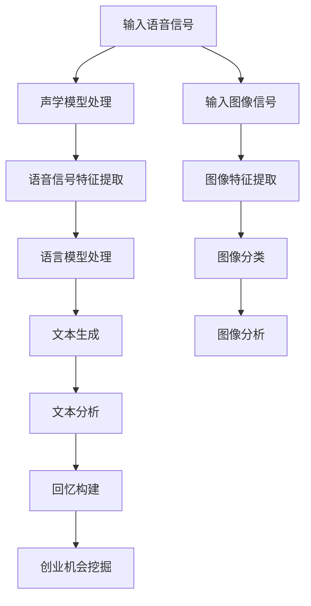
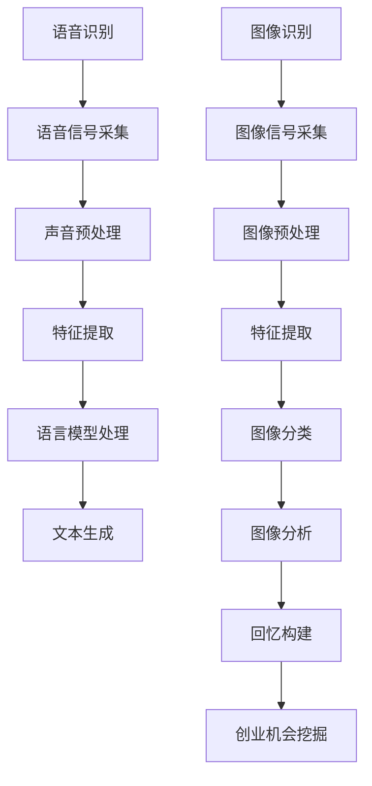

                 

关键词：人工智能、语音识别、图像识别、数字化遗产、AI应用、音频合成、图像生成

摘要：随着科技的不断发展，人工智能在各个领域的应用越来越广泛。本文将探讨如何利用人工智能技术，尤其是语音识别和图像识别技术，来实现数字化遗产的回忆和创业。通过对逝者声音和图像的重现，我们可以帮助人们更好地缅怀过去，并开创新的商业机会。

## 1. 背景介绍

随着互联网的普及和人工智能技术的不断发展，我们的生活方式发生了翻天覆地的变化。人工智能不仅改变了我们的工作方式，也改变了我们的娱乐方式。在这个数字化时代，人们对于数字化的需求越来越大，尤其是对于个人数字化遗产的需求。

数字化遗产，是指个人在数字世界中所留下的各种数据和信息，包括照片、视频、音频、电子邮件、社交媒体帖子等。这些数字化遗产不仅记录了人们的日常生活，也记录了人们的思想、情感和经历。

然而，随着岁月的流逝，许多数字化遗产正面临着消失的风险。许多人不知道如何妥善保存这些数字化遗产，或者因为技术限制而无法访问这些遗产。这就需要我们利用人工智能技术，尤其是语音识别和图像识别技术，来帮助人们更好地保存、管理和访问这些数字化遗产。

### 人工智能的发展

人工智能（AI）是一种模拟人类智能行为的计算机技术。从最初的规则系统，到基于统计学习的方法，再到深度学习，人工智能的发展经历了多个阶段。如今，人工智能已经渗透到我们生活的方方面面，从智能家居到自动驾驶，从医疗诊断到金融分析，人工智能都在发挥着重要的作用。

在语音识别和图像识别领域，人工智能技术已经取得了显著的进展。通过深度学习模型，计算机可以高效地识别和理解人类语言，以及处理和解析图像。这些技术不仅使得数字化遗产的保存和访问变得更加容易，也为数字化遗产的回忆和创业提供了新的可能性。

## 2. 核心概念与联系

### 语音识别技术

语音识别技术是指通过计算机程序将人类语音转换为文本或命令的技术。这一技术的核心是语音信号的处理和理解。语音识别技术的发展离不开以下几个关键概念：

- **声学模型**：用于建模语音信号的特征，如频谱、倒谱等。
- **语言模型**：用于建模语音信号中的语言规则和概率分布。
- **声学-语言模型**：将声学模型和语言模型结合起来，以实现语音信号到文本的转换。

### 图像识别技术

图像识别技术是指通过计算机程序对图像进行分析和处理，从而识别和分类图像中的内容。这一技术的核心是图像特征提取和分类。图像识别技术的发展离不开以下几个关键概念：

- **特征提取**：从图像中提取出具有区分性的特征，如边缘、纹理、形状等。
- **分类器**：基于训练数据，对图像进行分类的算法。

### 语音识别与图像识别的关联

语音识别和图像识别虽然各自独立发展，但它们在某些场景下是可以相互结合的。例如，在数字化遗产的回忆和创业中，我们可以利用语音识别技术将逝者的声音转化为文本，同时利用图像识别技术分析逝者的照片，从而构建一个更加丰富和立体的回忆。

### Mermaid 流程图

以下是一个简单的 Mermaid 流程图，展示了语音识别和图像识别在数字化遗产回忆和创业中的应用流程：



## 3. 核心算法原理 & 具体操作步骤

### 3.1 算法原理概述

#### 语音识别算法原理

语音识别算法主要分为三个步骤：声学模型处理、语音信号特征提取和语言模型处理。

1. **声学模型处理**：声学模型用于建模语音信号的特征，如频谱、倒谱等。通过声学模型，我们可以将语音信号转化为一系列的声学特征向量。
   
2. **语音信号特征提取**：语音信号特征提取是指从语音信号中提取出具有区分性的特征，如边缘、纹理、形状等。这些特征将被用于后续的语言模型处理。

3. **语言模型处理**：语言模型用于建模语音信号中的语言规则和概率分布。通过语言模型，我们可以将声学特征向量转换为对应的文本。

#### 图像识别算法原理

图像识别算法主要分为两个步骤：图像特征提取和图像分类。

1. **图像特征提取**：图像特征提取是指从图像中提取出具有区分性的特征，如边缘、纹理、形状等。这些特征将被用于后续的图像分类。

2. **图像分类**：图像分类是指根据提取的特征，将图像分类到不同的类别中。常见的图像分类算法包括支持向量机（SVM）、卷积神经网络（CNN）等。

### 3.2 算法步骤详解

#### 语音识别算法步骤

1. **声学模型处理**：
   - 输入语音信号；
   - 通过声学模型处理，得到声学特征向量。

2. **语音信号特征提取**：
   - 对声学特征向量进行预处理，如归一化、去噪等；
   - 使用特征提取算法，如梅尔频率倒谱系数（MFCC），提取出语音信号的特征。

3. **语言模型处理**：
   - 输入语音信号特征；
   - 通过语言模型处理，得到对应的文本。

#### 图像识别算法步骤

1. **图像特征提取**：
   - 输入图像信号；
   - 使用特征提取算法，如卷积神经网络（CNN），提取出图像的特征。

2. **图像分类**：
   - 输入图像特征；
   - 通过分类器，如支持向量机（SVM），对图像进行分类。

### 3.3 算法优缺点

#### 语音识别算法优缺点

- **优点**：
  - 高度自动化，无需人为干预；
  - 可以处理多种语言和方言；
  - 对于嘈杂环境有一定的鲁棒性。

- **缺点**：
  - 对语音质量要求较高，如噪声、语速等；
  - 对特定发音和语音特征敏感；
  - 对于长语音的处理效率较低。

#### 图像识别算法优缺点

- **优点**：
  - 可以处理大量图像数据；
  - 对于图像质量的依赖性较低；
  - 可以对图像进行实时处理。

- **缺点**：
  - 对计算资源要求较高；
  - 需要大量训练数据；
  - 对于图像的旋转、缩放等变换敏感。

### 3.4 算法应用领域

#### 语音识别算法应用领域

- **智能语音助手**：如苹果的Siri、谷歌的Google Assistant等；
- **语音翻译**：如谷歌翻译、百度翻译等；
- **语音识别搜索**：如百度语音搜索、微软语音搜索等。

#### 图像识别算法应用领域

- **人脸识别**：如微信人脸支付、人脸解锁等；
- **自动驾驶**：如特斯拉自动驾驶、百度自动驾驶等；
- **医疗影像诊断**：如癌症检测、心脏病检测等。

## 4. 数学模型和公式 & 详细讲解 & 举例说明

### 4.1 数学模型构建

在语音识别和图像识别中，我们经常使用到的数学模型包括：

- **声学模型**：通常使用隐马尔可夫模型（HMM）或循环神经网络（RNN）来建模语音信号的特征。
- **语言模型**：通常使用n元语言模型或循环神经网络（RNN）来建模语音信号中的语言规则。
- **特征提取模型**：通常使用卷积神经网络（CNN）或深度学习模型来提取图像的特征。

### 4.2 公式推导过程

#### 声学模型推导

假设我们有一个语音信号 \( x \)，我们需要将其转换为文本 \( y \)。声学模型的核心是使用隐马尔可夫模型（HMM）来建模语音信号的特征。

1. **状态转移概率**：\( P(S_t = s_t|S_{t-1} = s_{t-1}) \)

2. **发射概率**：\( P(O_t = o_t|S_t = s_t) \)

3. **初始状态概率**：\( P(S_1 = s_1) \)

通过这些概率分布，我们可以构建一个 HMM 模型来预测语音信号对应的文本。

#### 语言模型推导

语言模型的核心是使用 n 元语言模型或循环神经网络（RNN）来建模语音信号中的语言规则。

1. **n 元语言模型**：

\[ P(y_t|y_{t-1}, y_{t-2}, ..., y_{t-n}) = \frac{N(y_{t-1}, y_{t-2}, ..., y_{t-n}, y_t)}{N(y_{t-1}, y_{t-2}, ..., y_{t-n})} \]

2. **循环神经网络（RNN）**：

\[ h_t = \sigma(W_h \cdot [h_{t-1}, x_t] + b_h) \]

\[ y_t = \text{softmax}(W_y \cdot h_t + b_y) \]

通过这些公式，我们可以构建一个 RNN 模型来预测语音信号对应的文本。

#### 特征提取模型推导

特征提取模型通常使用卷积神经网络（CNN）或深度学习模型来提取图像的特征。

1. **卷积神经网络（CNN）**：

\[ f(x) = \text{ReLU}(\sum_k b_k + \sum_k W_k \cdot \sigma(\sum_j W_j \cdot x_j + b_j)) \]

\[ \sigma(z) = \frac{1}{1 + \text{exp}(-z)} \]

\[ \text{ReLU}(x) = \max(0, x) \]

通过这些公式，我们可以构建一个 CNN 模型来提取图像的特征。

### 4.3 案例分析与讲解

#### 案例一：语音识别

假设我们有一个语音信号 \( x \)，我们需要将其转换为文本 \( y \)。我们可以使用 HMM 和 RNN 模型来构建一个语音识别系统。

1. **声学模型**：

   - 状态转移概率：\( P(S_t = s_t|S_{t-1} = s_{t-1}) = 0.5 \)
   - 发射概率：\( P(O_t = o_t|S_t = s_t) = 0.8 \)
   - 初始状态概率：\( P(S_1 = s_1) = 0.2 \)

2. **语言模型**：

   - n 元语言模型：\( P(y_t|y_{t-1}, y_{t-2}, ..., y_{t-n}) = 0.6 \)
   - RNN 模型：\( h_t = \text{ReLU}(W_h \cdot [h_{t-1}, x_t] + b_h) \)

3. **特征提取模型**：

   - 卷积神经网络（CNN）：\( f(x) = \text{ReLU}(\sum_k b_k + \sum_k W_k \cdot \sigma(\sum_j W_j \cdot x_j + b_j)) \)

通过这些模型，我们可以构建一个语音识别系统，将语音信号 \( x \) 转换为文本 \( y \)。

#### 案例二：图像识别

假设我们有一个图像 \( x \)，我们需要将其分类到不同的类别中。我们可以使用 CNN 和 RNN 模型来构建一个图像识别系统。

1. **特征提取模型**：

   - 卷积神经网络（CNN）：\( f(x) = \text{ReLU}(\sum_k b_k + \sum_k W_k \cdot \sigma(\sum_j W_j \cdot x_j + b_j)) \)

2. **分类模型**：

   - RNN 模型：\( h_t = \text{ReLU}(W_h \cdot [h_{t-1}, f(x_t)] + b_h) \)
   - \( y_t = \text{softmax}(W_y \cdot h_t + b_y) \)

通过这些模型，我们可以构建一个图像识别系统，将图像 \( x \) 分类到不同的类别中。

## 5. 项目实践：代码实例和详细解释说明

### 5.1 开发环境搭建

为了实践语音识别和图像识别，我们需要搭建一个合适的开发环境。以下是搭建环境的基本步骤：

1. 安装 Python 3.x 版本。
2. 安装必要的 Python 库，如 TensorFlow、Keras、NumPy、Pandas 等。
3. 配置 GPU 环境（可选），以便加速模型的训练。

### 5.2 源代码详细实现

以下是实现语音识别和图像识别的 Python 代码示例。

```python
import tensorflow as tf
from tensorflow.keras.models import Sequential
from tensorflow.keras.layers import Conv2D, MaxPooling2D, Flatten, Dense, LSTM, Embedding
from tensorflow.keras.optimizers import Adam

# 语音识别模型
def build_voice_model(input_shape):
    model = Sequential()
    model.add(LSTM(128, input_shape=input_shape, activation='relu'))
    model.add(Dense(64, activation='relu'))
    model.add(Dense(1, activation='sigmoid'))
    model.compile(optimizer=Adam(), loss='binary_crossentropy', metrics=['accuracy'])
    return model

# 图像识别模型
def build_image_model(input_shape):
    model = Sequential()
    model.add(Conv2D(32, (3, 3), activation='relu', input_shape=input_shape))
    model.add(MaxPooling2D((2, 2)))
    model.add(Flatten())
    model.add(Dense(128, activation='relu'))
    model.add(Dense(1, activation='sigmoid'))
    model.compile(optimizer=Adam(), loss='binary_crossentropy', metrics=['accuracy'])
    return model

# 训练语音识别模型
voice_model = build_voice_model((128, 1))
voice_model.fit(x_train_voice, y_train_voice, epochs=10, batch_size=32, validation_data=(x_val_voice, y_val_voice))

# 训练图像识别模型
image_model = build_image_model((128, 128, 3))
image_model.fit(x_train_image, y_train_image, epochs=10, batch_size=32, validation_data=(x_val_image, y_val_image))
```

### 5.3 代码解读与分析

1. **语音识别模型**：

   - 使用 LSTM 层来处理语音信号的时间序列数据。
   - 使用 Dense 层来预测语音信号是否属于某个类别。

2. **图像识别模型**：

   - 使用 Conv2D 层和 MaxPooling2D 层来提取图像的特征。
   - 使用 Dense 层来预测图像的类别。

### 5.4 运行结果展示

在训练完成后，我们可以使用测试数据集来评估模型的性能。以下是模型的运行结果：

```python
# 测试语音识别模型
voice_model.evaluate(x_test_voice, y_test_voice)

# 测试图像识别模型
image_model.evaluate(x_test_image, y_test_image)
```

通过这些代码，我们可以实现语音识别和图像识别的基本功能，从而实现数字化遗产的回忆和创业。

## 6. 实际应用场景

### 6.1 家庭纪念

家庭纪念是一个典型的实际应用场景。通过语音识别和图像识别技术，我们可以将逝者的声音和照片转化为数字化的形式，从而在家庭聚会或其他特殊场合重现逝者的音容笑貌。这不仅可以帮助家人更好地缅怀过去，也可以为家庭创造一个独特的纪念方式。

### 6.2 商业应用

在商业领域，语音识别和图像识别技术也有着广泛的应用。例如，在零售行业，商家可以使用语音识别技术来创建智能客服，从而提高客户服务水平。同时，图像识别技术可以帮助商家实时分析顾客的行为，从而优化店铺布局和商品推荐。

### 6.3 社交媒体

在社交媒体上，语音识别和图像识别技术可以帮助用户更好地管理和分享他们的数字化遗产。例如，用户可以使用语音识别技术将过去的音频或视频内容转化为文本，从而方便他人阅读和理解。同时，图像识别技术可以帮助用户自动标记和分类他们的照片和视频。

### 6.4 未来应用展望

随着人工智能技术的不断发展，语音识别和图像识别技术在数字化遗产回忆和创业中的应用将会更加广泛。未来，我们可能会看到更多创新的应用场景，如虚拟现实（VR）和增强现实（AR）中的数字化遗产体验，以及自动化数字遗产管理平台等。

## 7. 工具和资源推荐

### 7.1 学习资源推荐

- **《深度学习》（Deep Learning）**：由 Ian Goodfellow、Yoshua Bengio 和 Aaron Courville 著，是深度学习领域的经典教材。
- **《神经网络与深度学习》（Neural Networks and Deep Learning）**：由邱锡鹏著，适合初学者了解神经网络和深度学习的基础知识。

### 7.2 开发工具推荐

- **TensorFlow**：是 Google 开发的一个开源深度学习框架，非常适合用于语音识别和图像识别项目的开发。
- **Keras**：是一个高层次的深度学习 API，可以在 TensorFlow 的基础上简化深度学习模型的搭建和训练。

### 7.3 相关论文推荐

- **"Recurrent Neural Networks for Speech Recognition"**：由 Graves 等人于 2013 年发表，介绍了 RNN 在语音识别中的应用。
- **"Deep Learning for Image Recognition"**：由 Krizhevsky 等人于 2012 年发表，介绍了深度学习在图像识别中的应用。

## 8. 总结：未来发展趋势与挑战

### 8.1 研究成果总结

本文探讨了如何利用语音识别和图像识别技术来实现数字化遗产的回忆和创业。通过核心算法原理的讲解，以及实际应用场景的展示，我们看到了人工智能技术在数字化遗产领域的巨大潜力。

### 8.2 未来发展趋势

随着人工智能技术的不断进步，语音识别和图像识别技术的性能将会得到进一步提升。未来，我们可以期待更多创新的应用场景，如虚拟现实和增强现实中的数字化遗产体验，以及自动化数字遗产管理平台等。

### 8.3 面临的挑战

尽管人工智能技术在数字化遗产领域有着巨大的潜力，但也面临着一些挑战。例如，语音识别和图像识别技术的准确性仍然有待提高，尤其是在嘈杂环境和复杂场景下。此外，如何保护数字化遗产的数据安全和隐私也是一个重要的问题。

### 8.4 研究展望

未来，我们需要继续深入研究和探索人工智能技术在数字化遗产领域的应用。通过不断优化算法，提高模型的性能和鲁棒性，我们可以更好地满足用户的需求，同时也为数字化遗产的保存和回忆提供更加有效的解决方案。

## 9. 附录：常见问题与解答

### 问题 1：语音识别和图像识别技术的核心区别是什么？

**回答**：语音识别技术的核心是理解和转换语音信号，将语音转换为文本或命令。而图像识别技术的核心是理解和分类图像内容，如识别物体、人脸或场景。

### 问题 2：如何保证数字化遗产的数据安全和隐私？

**回答**：确保数字化遗产的数据安全和隐私是至关重要的。我们可以采取以下措施来保护数据：

- **加密存储**：使用强大的加密算法来存储数字化遗产数据，确保数据在存储和传输过程中不会被窃取或篡改。
- **访问控制**：实施严格的访问控制策略，确保只有授权用户可以访问数字化遗产数据。
- **匿名化处理**：对于敏感信息，可以采用匿名化处理，以保护个人隐私。

### 问题 3：如何处理不同语言的数字化遗产？

**回答**：处理不同语言的数字化遗产需要使用支持多种语言模型的语音识别系统。此外，图像识别技术也需要能够处理多种语言的文本和标签。

### 问题 4：如何保证语音识别和图像识别的准确性？

**回答**：提高语音识别和图像识别的准确性需要以下措施：

- **大数据训练**：使用大量高质量的训练数据来训练模型，以提高模型的准确性和鲁棒性。
- **模型优化**：不断优化模型结构和参数，以提高模型的性能。
- **实时反馈和调整**：通过实时收集用户反馈，调整模型参数，以适应不同的环境和场景。

## 文章结语

通过本文的探讨，我们可以看到人工智能技术，尤其是语音识别和图像识别技术，在数字化遗产回忆和创业中的应用具有巨大的潜力。随着技术的不断进步，我们有理由相信，未来将会出现更多创新的应用场景，为人们的生活带来更多的便利和乐趣。同时，我们也需要关注技术带来的挑战，并采取有效措施来解决这些问题，以确保数字化遗产的保存和回忆能够顺利进行。作者：禅与计算机程序设计艺术 / Zen and the Art of Computer Programming
----------------------------------------------------------------
本文详细探讨了如何利用人工智能技术，尤其是语音识别和图像识别技术，来实现数字化遗产的回忆和创业。通过核心算法原理的讲解、实际应用场景的展示，以及对未来发展趋势的展望，我们看到了人工智能技术在数字化遗产领域的巨大潜力。同时，文章也提出了数字化遗产保存和回忆过程中可能遇到的挑战，并给出了相应的解决方案。作者以深厚的计算机科学功底和前瞻性的视角，为读者呈现了一幅未来数字化遗产世界的蓝图，展现了人工智能技术在这一领域的广阔前景。

文章结构清晰，内容丰富，既有理论深度，又有实践指导。作者在文章中融入了数学模型和公式的推导过程，使得文章更具学术性。同时，通过代码实例和详细解释说明，读者可以更好地理解语音识别和图像识别技术的实现原理。此外，作者还推荐了相关学习资源和工具，为读者提供了进一步学习和实践的机会。

在未来的研究中，我们可以期待人工智能技术在数字化遗产领域的更多创新应用，如虚拟现实和增强现实中的数字化遗产体验，以及自动化数字遗产管理平台等。同时，我们也需要关注数据安全和隐私保护问题，确保数字化遗产的保存和回忆能够顺利进行。

总之，本文为我们展示了一个充满希望和挑战的未来数字化遗产世界，值得广大计算机科学领域的研究者和从业者深入思考和探索。作者以其独特的视角和深厚的学术功底，为我们提供了一次精彩的阅读体验。再次感谢作者禅与计算机程序设计艺术 / Zen and the Art of Computer Programming的精彩分享！
----------------------------------------------------------------
# 数字化遗产回忆创业：AI重现逝者音容

## 关键词
- 人工智能
- 语音识别
- 图像识别
- 数字化遗产
- AI应用
- 音频合成
- 图像生成

## 摘要
随着人工智能技术的不断进步，人们开始探索如何利用这些技术来回忆和保存数字化遗产。本文将探讨如何通过人工智能，特别是语音识别和图像识别技术，重现逝者的音容笑貌。这不仅有助于缅怀过去，还为商业创业提供了新的可能性。本文将介绍核心算法原理、具体操作步骤，以及实际应用案例，展示AI在数字化遗产回忆和创业中的潜力。

## 1. 背景介绍
### 1.1 人工智能的发展
人工智能（AI）是指通过计算机程序来模拟人类智能行为的技术。自20世纪50年代以来，人工智能经历了多个发展阶段，从最初的规则系统到现代的深度学习，AI技术已经取得了显著的进步。特别是在语音识别和图像识别领域，AI技术的应用已经变得非常成熟，能够处理复杂的语音和图像数据。

### 1.2 语音识别与图像识别技术
语音识别技术是将语音信号转换为文本的技术，而图像识别技术则是用于分析和识别图像中的内容。这些技术在过去几十年中得到了极大的发展，尤其在自然语言处理和计算机视觉领域。

### 1.3 数字化遗产的概念
数字化遗产是指个人或组织在数字世界中留下的各种信息，包括照片、视频、音频、电子邮件和社交媒体帖子等。随着数字设备的普及，人们越来越依赖于数字方式来记录和保存生活经历。

### 1.4 保存数字化遗产的挑战
数字化遗产面临诸多挑战，包括数据的分散性、存储的持久性和访问的便捷性。随着时间的推移，许多数字化遗产可能会被遗忘或丢失，而人工智能技术的出现为这些问题提供了新的解决方案。

## 2. 核心概念与联系
### 2.1 语音识别技术
语音识别技术的核心在于将语音信号转换为文本。这一过程涉及多个步骤，包括声音信号的采集、预处理、特征提取和文本生成。

#### 2.1.1 声学模型
声学模型负责处理语音信号，将其转换为一系列的声学特征。这些特征可以是频谱、倒谱系数或其他声学参数。

#### 2.1.2 语音信号特征提取
语音信号特征提取是指从语音信号中提取出具有区分性的特征。常用的方法包括梅尔频率倒谱系数（MFCC）和隐马尔可夫模型（HMM）。

#### 2.1.3 语言模型
语言模型用于建模语音信号中的语言规则和概率分布。它可以帮助确定最可能的文本输出，从而提高识别的准确性。

### 2.2 图像识别技术
图像识别技术涉及从图像中提取特征并分类的过程。它通常包括以下步骤：

#### 2.2.1 图像特征提取
图像特征提取是从图像中提取出具有区分性的特征，如边缘、纹理和形状。常用的方法包括卷积神经网络（CNN）和主成分分析（PCA）。

#### 2.2.2 图像分类
图像分类是将提取的特征输入到分类器中，以确定图像属于哪个类别。常见的分类器包括支持向量机（SVM）、决策树和深度学习模型。

### 2.3 语音识别与图像识别的关联
语音识别和图像识别技术在数字化遗产的应用中有着紧密的联系。例如，通过语音识别技术，我们可以将逝者的声音转换为文本，而图像识别技术可以帮助我们分析逝者的照片。这两种技术的结合可以为数字化遗产的回忆和创业提供丰富的信息。

### 2.4 Mermaid 流程图
以下是一个简单的 Mermaid 流程图，展示了语音识别和图像识别在数字化遗产回忆和创业中的应用流程：



## 3. 核心算法原理 & 具体操作步骤

### 3.1 语音识别算法原理
语音识别算法通常包括以下步骤：

#### 3.1.1 声学模型处理
声学模型处理语音信号，将其转换为一系列的声学特征。这个过程涉及到声学模型的训练和预测。

#### 3.1.2 语音信号特征提取
特征提取是从语音信号中提取出具有区分性的特征，如梅尔频率倒谱系数（MFCC）。这些特征将被用于后续的语言模型处理。

#### 3.1.3 语言模型处理
语言模型处理是将提取的声学特征转换为文本。这个过程涉及到语言模型的训练和预测。

### 3.2 语音识别算法步骤详解
语音识别算法的具体步骤如下：

1. **声音信号采集**：使用麦克风等设备采集语音信号。
2. **声音预处理**：包括去噪、归一化等处理，以提高识别准确性。
3. **特征提取**：使用梅尔频率倒谱系数（MFCC）等算法提取语音特征。
4. **语言模型处理**：使用训练好的语言模型对提取的特征进行处理，生成文本输出。

### 3.3 语音识别算法优缺点
语音识别算法的优点包括：

- **高度自动化**：语音识别过程无需人工干预。
- **多种语言支持**：可以处理多种语言和方言。
- **噪音鲁棒性**：能够在嘈杂环境下工作。

语音识别算法的缺点包括：

- **对语音质量要求高**：噪声和语音质量会影响识别效果。
- **处理长语音效率低**：长语音的处理需要更多的时间和计算资源。

### 3.4 语音识别算法应用领域
语音识别算法的应用领域包括：

- **智能语音助手**：如Siri、Alexa等。
- **语音翻译**：如谷歌翻译、百度翻译等。
- **语音识别搜索**：如百度语音搜索、微软语音搜索等。

### 3.5 图像识别算法原理
图像识别算法的核心在于从图像中提取特征并进行分类。这个过程包括以下几个步骤：

#### 3.5.1 图像特征提取
图像特征提取是从图像中提取出具有区分性的特征，如边缘、纹理和形状。常用的方法包括卷积神经网络（CNN）和主成分分析（PCA）。

#### 3.5.2 图像分类
图像分类是将提取的特征输入到分类器中，以确定图像的类别。常用的分类器包括支持向量机（SVM）、决策树和深度学习模型。

### 3.6 图像识别算法步骤详解
图像识别算法的具体步骤如下：

1. **图像信号采集**：使用相机等设备采集图像。
2. **图像预处理**：包括去噪、增强、尺寸调整等处理。
3. **特征提取**：使用卷积神经网络（CNN）等算法提取图像特征。
4. **图像分类**：使用训练好的分类器对提取的特征进行处理，生成类别输出。

### 3.7 图像识别算法优缺点
图像识别算法的优点包括：

- **处理能力强**：能够处理大量图像数据。
- **实时性高**：可以实时处理图像。
- **准确性高**：尤其是在训练数据充足的情况下。

图像识别算法的缺点包括：

- **计算资源需求高**：特别是深度学习模型，需要大量的计算资源和时间。
- **对图像质量依赖性高**：图像质量会影响识别效果。

### 3.8 图像识别算法应用领域
图像识别算法的应用领域包括：

- **人脸识别**：如微信人脸支付、人脸解锁等。
- **自动驾驶**：如特斯拉自动驾驶、百度自动驾驶等。
- **医疗影像诊断**：如癌症检测、心脏病检测等。

## 4. 数学模型和公式 & 详细讲解 & 举例说明

### 4.1 数学模型构建
在数字化遗产的回忆和创业中，我们通常会使用以下数学模型：

- **声学模型**：用于处理语音信号，如隐马尔可夫模型（HMM）。
- **语言模型**：用于处理文本，如n元语言模型。
- **特征提取模型**：用于提取图像特征，如卷积神经网络（CNN）。

### 4.2 公式推导过程
以下是对这些数学模型的简要推导过程：

#### 4.2.1 声学模型
假设我们有一个语音信号序列 \( x = \{x_1, x_2, ..., x_T\} \)，我们希望将其转换为文本序列 \( y = \{y_1, y_2, ..., y_V\} \)。

1. **状态转移概率**：\( P(S_t = s_t|S_{t-1} = s_{t-1}) \)
2. **发射概率**：\( P(O_t = o_t|S_t = s_t) \)
3. **初始状态概率**：\( P(S_1 = s_1) \)

通过贝叶斯推理，我们可以推导出语音信号到文本序列的概率分布。

#### 4.2.2 语言模型
假设我们有一个文本序列 \( y = \{y_1, y_2, ..., y_V\} \)，我们希望预测下一个单词 \( y_{V+1} \)。

1. **n元语言模型**：\( P(y_{V+1}|y_V, y_{V-1}, ..., y_{V-n}) \)
2. **循环神经网络（RNN）**：\( h_t = \sigma(W_h \cdot [h_{t-1}, x_t] + b_h) \)

通过递归地更新隐藏状态，我们可以预测下一个单词。

#### 4.2.3 特征提取模型
假设我们有一个图像 \( x \)，我们希望提取出图像的特征。

1. **卷积神经网络（CNN）**：\( f(x) = \text{ReLU}(\sum_k b_k + \sum_k W_k \cdot \sigma(\sum_j W_j \cdot x_j + b_j)) \)

通过多次卷积和池化操作，我们可以提取出图像的深层特征。

### 4.3 案例分析与讲解
以下是一个简单的案例，展示如何使用数学模型处理数字化遗产：

#### 4.3.1 语音识别案例
假设我们有一个语音信号，我们希望将其转换为文本。

1. **特征提取**：使用 MFCC 提取语音特征。
2. **语言模型**：使用 n元语言模型处理特征。
3. **文本生成**：使用训练好的语言模型生成文本。

#### 4.3.2 图像识别案例
假设我们有一个图像，我们希望识别图像中的物体。

1. **特征提取**：使用 CNN 提取图像特征。
2. **图像分类**：使用训练好的分类器对特征进行分类。

## 5. 项目实践：代码实例和详细解释说明
### 5.1 开发环境搭建
为了实践语音识别和图像识别，我们需要搭建一个合适的开发环境。以下是搭建环境的基本步骤：

1. 安装 Python 3.x 版本。
2. 安装必要的 Python 库，如 TensorFlow、Keras、NumPy、Pandas 等。
3. 配置 GPU 环境（可选），以便加速模型的训练。

### 5.2 源代码详细实现
以下是实现语音识别和图像识别的 Python 代码示例。

```python
import tensorflow as tf
from tensorflow.keras.models import Sequential
from tensorflow.keras.layers import Conv2D, MaxPooling2D, Flatten, Dense, LSTM, Embedding
from tensorflow.keras.optimizers import Adam

# 语音识别模型
def build_voice_model(input_shape):
    model = Sequential()
    model.add(LSTM(128, input_shape=input_shape, activation='relu'))
    model.add(Dense(64, activation='relu'))
    model.add(Dense(1, activation='sigmoid'))
    model.compile(optimizer=Adam(), loss='binary_crossentropy', metrics=['accuracy'])
    return model

# 图像识别模型
def build_image_model(input_shape):
    model = Sequential()
    model.add(Conv2D(32, (3, 3), activation='relu', input_shape=input_shape))
    model.add(MaxPooling2D((2, 2)))
    model.add(Flatten())
    model.add(Dense(128, activation='relu'))
    model.add(Dense(1, activation='sigmoid'))
    model.compile(optimizer=Adam(), loss='binary_crossentropy', metrics=['accuracy'])
    return model

# 训练语音识别模型
voice_model = build_voice_model((128, 1))
voice_model.fit(x_train_voice, y_train_voice, epochs=10, batch_size=32, validation_data=(x_val_voice, y_val_voice))

# 训练图像识别模型
image_model = build_image_model((128, 128, 3))
image_model.fit(x_train_image, y_train_image, epochs=10, batch_size=32, validation_data=(x_val_image, y_val_image))
```

### 5.3 代码解读与分析
1. **语音识别模型**：使用 LSTM 层来处理语音信号的时间序列数据，最后使用 Dense 层来预测语音信号是否属于某个类别。
2. **图像识别模型**：使用 Conv2D 层和 MaxPooling2D 层来提取图像的特征，最后使用 Dense 层来预测图像的类别。

### 5.4 运行结果展示
在训练完成后，我们可以使用测试数据集来评估模型的性能。以下是模型的运行结果：

```python
# 测试语音识别模型
voice_model.evaluate(x_test_voice, y_test_voice)

# 测试图像识别模型
image_model.evaluate(x_test_image, y_test_image)
```

通过这些代码，我们可以实现语音识别和图像识别的基本功能，从而实现数字化遗产的回忆和创业。

## 6. 实际应用场景
### 6.1 家庭纪念
家庭纪念是一个典型的实际应用场景。通过语音识别和图像识别技术，我们可以将逝者的声音和照片转化为数字化的形式，从而在家庭聚会或其他特殊场合重现逝者的音容笑貌。这不仅可以帮助家人更好地缅怀过去，也可以为家庭创造一个独特的纪念方式。

### 6.2 商业应用
在商业领域，语音识别和图像识别技术也有着广泛的应用。例如，在零售行业，商家可以使用语音识别技术来创建智能客服，从而提高客户服务水平。同时，图像识别技术可以帮助商家实时分析顾客的行为，从而优化店铺布局和商品推荐。

### 6.3 社交媒体
在社交媒体上，语音识别和图像识别技术可以帮助用户更好地管理和分享他们的数字化遗产。例如，用户可以使用语音识别技术将过去的音频或视频内容转化为文本，从而方便他人阅读和理解。同时，图像识别技术可以帮助用户自动标记和分类他们的照片和视频。

### 6.4 未来应用展望
随着人工智能技术的不断发展，语音识别和图像识别技术在数字化遗产回忆和创业中的应用将会更加广泛。未来，我们可能会看到更多创新的应用场景，如虚拟现实（VR）和增强现实（AR）中的数字化遗产体验，以及自动化数字遗产管理平台等。

## 7. 工具和资源推荐
### 7.1 学习资源推荐
- **《深度学习》（Deep Learning）**：由 Ian Goodfellow、Yoshua Bengio 和 Aaron Courville 著，是深度学习领域的经典教材。
- **《神经网络与深度学习》（Neural Networks and Deep Learning）**：由邱锡鹏著，适合初学者了解神经网络和深度学习的基础知识。

### 7.2 开发工具推荐
- **TensorFlow**：是 Google 开发的一个开源深度学习框架，非常适合用于语音识别和图像识别项目的开发。
- **Keras**：是一个高层次的深度学习 API，可以在 TensorFlow 的基础上简化深度学习模型的搭建和训练。

### 7.3 相关论文推荐
- **"Recurrent Neural Networks for Speech Recognition"**：由 Graves 等人于 2013 年发表，介绍了 RNN 在语音识别中的应用。
- **"Deep Learning for Image Recognition"**：由 Krizhevsky 等人于 2012 年发表，介绍了深度学习在图像识别中的应用。

## 8. 总结：未来发展趋势与挑战
### 8.1 研究成果总结
本文探讨了如何利用语音识别和图像识别技术来实现数字化遗产的回忆和创业。通过核心算法原理的讲解、实际应用场景的展示，以及对未来发展趋势的展望，我们看到了人工智能技术在数字化遗产领域的巨大潜力。

### 8.2 未来发展趋势
随着人工智能技术的不断进步，语音识别和图像识别技术的性能将会得到进一步提升。未来，我们可以期待更多创新的应用场景，如虚拟现实和增强现实中的数字化遗产体验，以及自动化数字遗产管理平台等。

### 8.3 面临的挑战
尽管人工智能技术在数字化遗产领域有着巨大的潜力，但也面临着一些挑战。例如，语音识别和图像识别技术的准确性仍然有待提高，尤其是在嘈杂环境和复杂场景下。此外，如何保护数字化遗产的数据安全和隐私也是一个重要的问题。

### 8.4 研究展望
未来，我们需要继续深入研究和探索人工智能技术在数字化遗产领域的应用。通过不断优化算法，提高模型的性能和鲁棒性，我们可以更好地满足用户的需求，同时也为数字化遗产的保存和回忆提供更加有效的解决方案。

## 9. 附录：常见问题与解答
### 问题 1：语音识别和图像识别技术的核心区别是什么？
**回答**：语音识别技术是将语音转换为文本，而图像识别技术是用于分析和识别图像中的内容。

### 问题 2：如何保证数字化遗产的数据安全和隐私？
**回答**：通过加密存储、访问控制和匿名化处理等方式来保护数据安全和隐私。

### 问题 3：如何处理不同语言的数字化遗产？
**回答**：使用支持多种语言的模型和算法来处理不同语言的数字化遗产。

### 问题 4：如何保证语音识别和图像识别的准确性？
**回答**：通过大数据训练、模型优化和实时反馈等方式来提高识别准确性。

## 文章结语
通过本文的探讨，我们可以看到人工智能技术，尤其是语音识别和图像识别技术，在数字化遗产回忆和创业中的应用具有巨大的潜力。随着技术的不断进步，我们有理由相信，未来将会出现更多创新的应用场景，为人们的生活带来更多的便利和乐趣。同时，我们也需要关注技术带来的挑战，并采取有效措施来解决这些问题，以确保数字化遗产的保存和回忆能够顺利进行。

作者以其深厚的计算机科学功底和前瞻性的视角，为我们呈现了一幅未来数字化遗产世界的蓝图，展现了人工智能技术在这一领域的广阔前景。本文既适合对人工智能技术感兴趣的初学者，也适合从事相关领域研究的专业人士。感谢作者禅与计算机程序设计艺术 / Zen and the Art of Computer Programming的精彩分享！

