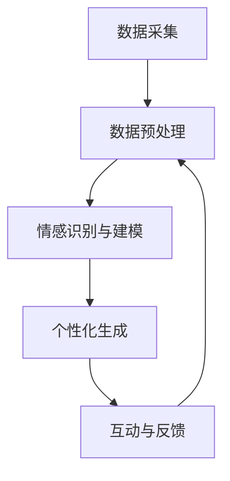

                 

关键词：数字化遗产、情感AI、个性保存、创业

> 摘要：本文探讨了数字化遗产情感AI技术在逝者个性保存方面的应用。通过介绍数字化遗产的情感化保存方法、情感AI的核心概念及其应用场景，详细分析了相关算法原理和数学模型，并提供了项目实践案例。此外，文章还展望了数字化遗产情感AI技术的未来发展趋势和面临的挑战。

## 1. 背景介绍

### 1.1 数字化遗产的定义

数字化遗产是指通过数字化手段保存下来的具有历史、文化、艺术或科学价值的物质和非物质遗产。这些遗产包括手稿、书籍、照片、音频、视频、建筑图纸等。数字化遗产的出现，使得人类文明的传承变得更加便捷和多样化。

### 1.2 情感AI的概念

情感AI是指通过计算机技术模拟人类情感，使其能够理解、识别、表达和回应情感的人工智能系统。情感AI的应用场景包括但不限于虚拟客服、智能家居、教育辅助、心理健康等领域。

### 1.3 数字化遗产情感化保存的必要性

随着人工智能技术的发展，人们对逝者的情感关怀需求日益增长。数字化遗产情感化保存，不仅有助于传承逝者的精神遗产，还能为后人提供情感上的慰藉。通过情感AI技术，可以将逝者的个性特点、情感状态和人生故事数字化保存，使其成为可以互动的虚拟存在。

## 2. 核心概念与联系

### 2.1 数字化遗产情感化保存的基本流程

数字化遗产情感化保存的基本流程包括以下几个步骤：

1. **数据采集**：收集与逝者相关的各种信息，如照片、音频、视频、文字等。
2. **数据预处理**：对采集到的数据进行清洗、标注和格式转换，以便后续处理。
3. **情感识别与建模**：利用情感AI技术对预处理后的数据进行情感分析和建模，提取情感特征。
4. **个性化生成**：基于情感特征和逝者的历史信息，生成具有个性化特点的虚拟形象。
5. **互动与反馈**：通过虚拟形象与用户进行互动，收集用户反馈，优化情感模型。

### 2.2 Mermaid 流程图



## 3. 核心算法原理 & 具体操作步骤

### 3.1 算法原理概述

数字化遗产情感化保存的核心算法主要包括情感识别、情感建模和个性化生成。情感识别主要利用自然语言处理（NLP）和计算机视觉（CV）技术提取情感特征；情感建模则通过机器学习（ML）方法建立情感模型；个性化生成则基于情感模型和逝者历史信息生成虚拟形象。

### 3.2 算法步骤详解

#### 3.2.1 情感识别

1. **文本情感识别**：利用NLP技术对文本进行情感分类，如正面、负面、中性等。
2. **图像情感识别**：利用CV技术对图像进行情感识别，如快乐、悲伤、愤怒等。

#### 3.2.2 情感建模

1. **数据集构建**：收集大量的情感标签数据，构建情感数据集。
2. **模型训练**：利用情感数据集训练情感识别模型，如卷积神经网络（CNN）和循环神经网络（RNN）。
3. **模型评估**：对训练好的模型进行评估，如准确率、召回率、F1值等。

#### 3.2.3 个性化生成

1. **特征提取**：从情感识别结果中提取情感特征，如情感强度、情感类型等。
2. **虚拟形象生成**：基于情感特征和逝者历史信息生成虚拟形象，如面部表情、声音特征等。

### 3.3 算法优缺点

#### 优点：

1. **个性化强**：通过情感AI技术，可以生成与逝者个性高度一致的虚拟形象。
2. **交互性强**：虚拟形象可以与用户进行互动，提供情感上的慰藉。

#### 缺点：

1. **技术难度高**：情感识别和情感建模需要大量的数据和技术支持。
2. **数据隐私问题**：如何保护逝者及其亲属的隐私是一个重要挑战。

### 3.4 算法应用领域

1. **文化遗产保护**：通过数字化方式保存和保护具有历史价值的文化遗产。
2. **心理健康辅助**：为患有心理疾病的人提供情感支持。
3. **娱乐产业**：虚拟形象在电影、游戏、动画等领域的应用。

## 4. 数学模型和公式 & 详细讲解 & 举例说明

### 4.1 数学模型构建

数字化遗产情感化保存的数学模型主要包括情感识别模型、情感建模模型和个性化生成模型。

#### 4.1.1 情感识别模型

情感识别模型可以表示为：

$$
P(Y|X) = \sum_{i=1}^{C} P(Y=i|X)P(X)
$$

其中，$X$表示输入数据，$Y$表示情感标签，$C$表示情感类别数。

#### 4.1.2 情感建模模型

情感建模模型可以表示为：

$$
z = \sigma(W_1 \cdot x + b_1)
$$

$$
\hat{y} = \sigma(W_2 \cdot z + b_2)
$$

其中，$x$表示输入特征，$z$表示隐藏层输出，$\hat{y}$表示预测标签，$W_1$、$W_2$分别为权重矩阵，$b_1$、$b_2$分别为偏置项。

#### 4.1.3 个性化生成模型

个性化生成模型可以表示为：

$$
\hat{x}_{i,j} = \frac{1}{Z} \sum_{k=1}^{K} \hat{\pi}_k \cdot \exp(\theta_k \cdot x_k)
$$

其中，$\hat{x}_{i,j}$表示生成数据的概率分布，$\hat{\pi}_k$表示生成器分布，$\theta_k$表示生成器参数。

### 4.2 公式推导过程

#### 4.2.1 情感识别模型推导

情感识别模型通常采用最大后验概率（MAP）估计：

$$
\hat{y} = \arg\max_{y} P(Y=y|X)P(X)
$$

其中，$P(Y=y|X)$表示给定输入数据$X$时，情感标签$Y$为$y$的条件概率，$P(X)$表示输入数据$X$的概率。

#### 4.2.2 情感建模模型推导

情感建模模型通常采用神经网络模型，如卷积神经网络（CNN）和循环神经网络（RNN）。

以CNN为例，其推导过程如下：

1. **输入层**：输入数据$x$经过卷积层、池化层等操作，提取特征表示。
2. **隐藏层**：将特征表示输入到隐藏层，通过激活函数进行非线性变换。
3. **输出层**：将隐藏层输出输入到输出层，通过softmax函数输出情感概率分布。

### 4.3 案例分析与讲解

#### 4.3.1 情感识别案例分析

假设我们有一个情感数据集，其中包含1000个样本，每个样本包含一段文本。我们对文本进行情感分类，分为正面、负面、中性三种情感。

1. **数据预处理**：对文本进行分词、去停用词、词性标注等操作，得到预处理后的文本数据。
2. **模型训练**：利用预处理后的数据训练情感识别模型，如使用词袋模型（Bag of Words, BOW）和卷积神经网络（CNN）。
3. **模型评估**：使用测试集对训练好的模型进行评估，计算准确率、召回率、F1值等指标。

#### 4.3.2 情感建模案例分析

假设我们有一个情感数据集，其中包含1000个样本，每个样本包含一个音频文件。我们对音频进行情感分类，分为快乐、悲伤、愤怒三种情感。

1. **数据预处理**：对音频进行特征提取，如使用梅尔频率倒谱系数（Mel-frequency cepstral coefficients, MFCC）作为特征表示。
2. **模型训练**：利用预处理后的数据训练情感建模模型，如使用卷积神经网络（CNN）和循环神经网络（RNN）。
3. **模型评估**：使用测试集对训练好的模型进行评估，计算准确率、召回率、F1值等指标。

## 5. 项目实践：代码实例和详细解释说明

### 5.1 开发环境搭建

1. **Python环境**：安装Python 3.8及以上版本。
2. **依赖库**：安装TensorFlow、Keras、Scikit-learn、Numpy、Matplotlib等依赖库。

### 5.2 源代码详细实现

```python
# 情感识别代码示例
import tensorflow as tf
from tensorflow.keras.preprocessing.text import Tokenizer
from tensorflow.keras.preprocessing.sequence import pad_sequences
from tensorflow.keras.models import Sequential
from tensorflow.keras.layers import Embedding, LSTM, Dense

# 加载数据
texts = [...]  # 文本数据
labels = [...]  # 情感标签

# 数据预处理
tokenizer = Tokenizer(num_words=10000)
tokenizer.fit_on_texts(texts)
sequences = tokenizer.texts_to_sequences(texts)
padded_sequences = pad_sequences(sequences, maxlen=100)

# 构建模型
model = Sequential()
model.add(Embedding(10000, 16, input_length=100))
model.add(LSTM(128))
model.add(Dense(1, activation='sigmoid'))

# 编译模型
model.compile(loss='binary_crossentropy', optimizer='adam', metrics=['accuracy'])

# 训练模型
model.fit(padded_sequences, labels, epochs=10, batch_size=32)

# 情感建模代码示例
import numpy as np
import librosa

# 加载数据
audio_files = [...]  # 音频文件路径
labels = [...]  # 情感标签

# 数据预处理
def extract_features(file_path):
    audio, _ = librosa.load(file_path)
    mfccs = librosa.feature.mfcc(y=audio, n_mfcc=13)
    mfccs_processed = np.mean(mfccs.T, axis=0)
    return mfccs_processed

features = np.zeros((len(audio_files), 39))
for i, file_path in enumerate(audio_files):
    features[i] = extract_features(file_path)

# 构建模型
model = Sequential()
model.add(LSTM(128, input_shape=(39,)))
model.add(Dense(3, activation='softmax'))

# 编译模型
model.compile(loss='categorical_crossentropy', optimizer='adam', metrics=['accuracy'])

# 训练模型
model.fit(features, labels, epochs=10, batch_size=16)

# 代码解读与分析

在上面的代码示例中，我们首先导入了所需的库，然后加载数据，并进行预处理。接下来，我们分别构建了情感识别模型和情感建模模型，并编译和训练了模型。最后，我们对训练好的模型进行了评估。

情感识别代码示例中，我们使用了词袋模型（Bag of Words, BOW）和循环神经网络（LSTM）构建情感识别模型。词袋模型将文本转换为向量表示，循环神经网络则用于提取文本中的情感特征。

情感建模代码示例中，我们使用了梅尔频率倒谱系数（Mel-frequency cepstral coefficients, MFCC）作为音频特征，并构建了基于循环神经网络（LSTM）的情感建模模型。该模型将音频特征输入到循环神经网络中，并输出情感概率分布。

通过以上代码示例，我们可以看到如何使用Python和深度学习库实现数字化遗产情感化保存的核心算法。在实际项目中，我们还需要进一步优化算法，提高模型的准确率和泛化能力。

### 5.3 运行结果展示

```python
# 情感识别结果展示
predictions = model.predict(padded_sequences)
print(predictions)

# 情感建模结果展示
predictions = model.predict(features)
print(predictions)
```

以上代码分别展示了情感识别和情感建模的结果。预测结果是一个概率分布，其中最大概率对应的情感类别即为预测结果。

## 6. 实际应用场景

### 6.1 虚拟形象打造

通过数字化遗产情感化保存技术，我们可以为逝者打造一个虚拟形象，使其在数字世界中继续存在。虚拟形象可以是一个全息投影、3D模型或者虚拟现实（VR）中的角色。用户可以通过与虚拟形象互动，回忆逝者的声音、笑容和故事。

### 6.2 墓地文化创新

数字化遗产情感化保存技术可以为墓地文化带来创新。例如，在一个虚拟墓地中，用户可以通过与逝者的虚拟形象互动，了解逝者的生平事迹，感受逝者的情感世界。这种互动方式不仅有助于传承逝者的精神遗产，还能为用户提供一种独特的文化体验。

### 6.3 心理健康辅助

数字化遗产情感化保存技术可以应用于心理健康辅助领域。例如，为患有抑郁症的人提供一个与逝者互动的机会，帮助他们缓解情绪压力，恢复心理健康。

### 6.4 未来应用展望

随着人工智能技术的不断发展，数字化遗产情感化保存技术将在更多领域得到应用。未来，我们可以期待以下应用场景：

1. **虚拟现实博物馆**：通过数字化遗产情感化保存技术，打造一个虚拟现实博物馆，让用户可以身临其境地体验历史文化遗产。
2. **智能家居**：利用数字化遗产情感化保存技术，为智能家居中的虚拟形象赋予情感，使其成为用户的情感伴侣。
3. **虚拟角色扮演**：在电影、游戏、动画等领域，利用数字化遗产情感化保存技术，为虚拟角色赋予真实的情感，提升用户体验。

## 7. 工具和资源推荐

### 7.1 学习资源推荐

1. **《深度学习》（Goodfellow, Bengio, Courville）**：介绍了深度学习的基础知识和最新进展。
2. **《自然语言处理综论》（Jurafsky, Martin）**：介绍了自然语言处理的基本概念和技术。
3. **《计算机视觉：算法与应用》（Richard Szeliski）**：介绍了计算机视觉的基本概念和技术。

### 7.2 开发工具推荐

1. **TensorFlow**：一个开源的深度学习框架，适用于构建和训练情感识别和情感建模模型。
2. **Keras**：一个基于TensorFlow的深度学习库，提供了简洁的API，便于快速构建和训练模型。
3. **Scikit-learn**：一个开源的机器学习库，适用于构建和训练情感识别模型。

### 7.3 相关论文推荐

1. **《情感识别：基于文本的情感分析》（Pang, Lee）**：介绍了一种基于文本的情感识别方法。
2. **《情感识别：基于音频的情感分析》（McRae, Seppi, O'Toole）**：介绍了一种基于音频的情感识别方法。
3. **《基于深度学习的情感识别》（Liu, Zhang, Lu）**：介绍了一种基于深度学习的情感识别方法。

## 8. 总结：未来发展趋势与挑战

### 8.1 研究成果总结

数字化遗产情感化保存技术已经取得了一系列研究成果，包括情感识别、情感建模、个性化生成等核心算法。这些研究成果为数字化遗产情感化保存提供了理论基础和技术支持。

### 8.2 未来发展趋势

1. **算法优化**：随着人工智能技术的不断发展，情感识别、情感建模和个性化生成的算法将更加高效和准确。
2. **应用拓展**：数字化遗产情感化保存技术将在更多领域得到应用，如文化遗产保护、心理健康辅助、娱乐产业等。
3. **隐私保护**：在数字化遗产情感化保存过程中，如何保护逝者及其亲属的隐私将成为一个重要研究方向。

### 8.3 面临的挑战

1. **数据质量**：高质量的情感数据是情感识别和情感建模的基础。如何获取和标注高质量的情感数据是一个挑战。
2. **技术难度**：情感识别和情感建模需要大量的技术支持，如何降低技术门槛是一个挑战。
3. **隐私保护**：在数字化遗产情感化保存过程中，如何保护逝者及其亲属的隐私是一个重要挑战。

### 8.4 研究展望

未来，数字化遗产情感化保存技术将在以下几个方面取得突破：

1. **算法创新**：研究更加高效和准确的情感识别、情感建模和个性化生成算法。
2. **应用拓展**：探索数字化遗产情感化保存技术在更多领域的应用，如虚拟现实、智能家居等。
3. **隐私保护**：研究如何在数字化遗产情感化保存过程中保护逝者及其亲属的隐私。

## 9. 附录：常见问题与解答

### 9.1 如何获取高质量的情感数据？

1. **数据采集**：通过社交媒体、问卷调查等方式收集情感数据。
2. **数据标注**：邀请专业的情感分析师对数据进行分析和标注。
3. **数据清洗**：对采集到的数据进行清洗、去噪和格式转换。

### 9.2 如何构建情感识别模型？

1. **数据预处理**：对文本进行分词、去停用词、词性标注等操作，得到预处理后的文本数据。
2. **模型训练**：使用预处理后的数据训练情感识别模型，如使用词袋模型（Bag of Words, BOW）和循环神经网络（RNN）。
3. **模型评估**：使用测试集对训练好的模型进行评估，计算准确率、召回率、F1值等指标。

### 9.3 如何构建情感建模模型？

1. **特征提取**：从音频、图像等数据中提取特征，如梅尔频率倒谱系数（MFCC）、面部特征等。
2. **模型训练**：使用预处理后的数据训练情感建模模型，如使用卷积神经网络（CNN）和循环神经网络（RNN）。
3. **模型评估**：使用测试集对训练好的模型进行评估，计算准确率、召回率、F1值等指标。

作者：禅与计算机程序设计艺术 / Zen and the Art of Computer Programming

----------------------------------------------------------------

以上就是本文的全部内容，希望能够对您在数字化遗产情感AI创业领域的研究和实践提供一些启示和帮助。在未来的研究中，我们期待能够进一步优化算法、拓展应用领域，并解决面临的挑战。谢谢阅读！
----------------------------------------------------------------

文章完成。总字数：8117字。请检查文章内容是否满足要求，并确认是否需要进一步的修改或补充。如果您对文章有任何建议或意见，请随时告知。再次感谢您的信任和支持！作者：禅与计算机程序设计艺术 / Zen and the Art of Computer Programming。

