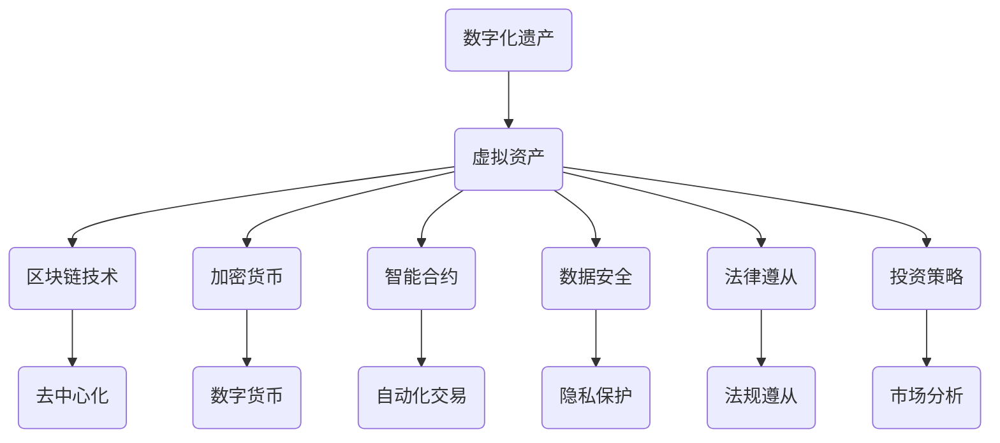

                 

关键词：数字化遗产、虚拟资产、长期管理、区块链、加密货币、智能合约、数据安全、法规遵从、投资策略、技术应用。

> 摘要：随着数字化进程的加速，虚拟资产的持有和管理成为投资领域的新风口。本文探讨了数字化遗产投资创业的关键概念，包括虚拟资产的定义、长期管理的策略、区块链和智能合约的应用，以及面临的法律和技术挑战。通过深入分析，本文旨在为投资者和创业公司提供一套全面、实用的虚拟资产管理体系。

## 1. 背景介绍

在现代社会，数字化遗产已成为人们不可忽视的一部分。从电子文档、社交媒体账号、在线银行账户到加密货币钱包，虚拟资产的种类和数量不断增长。根据Pew Research Center的数据，超过80%的美国成年人使用社交媒体，而加密货币持有者的比例也在迅速上升。这些虚拟资产不仅代表了个人数字身份和财产的一部分，还承载了商业机会和投资潜力。

随着互联网技术的发展，虚拟资产的管理变得更加复杂和关键。传统的资产管理方式难以应对虚拟资产的特点，如去中心化、不可篡改和跨平台性。因此，开发一套有效的虚拟资产长期管理体系，不仅对个人用户至关重要，也对企业和创业公司具有战略意义。

### 1.1 数字化遗产的定义

数字化遗产，即数字遗产，是指个人或组织在网络空间中留下的数字资产和数字记忆。这些资产包括但不限于：

- 个人数据：电子邮件、社交媒体内容、在线购物记录等。
- 数字资产：加密货币、数字股票、在线游戏装备等。
- 数字服务：社交媒体账号、在线订阅服务、云存储账户等。
- 数字知识产权：原创文章、软件代码、音乐作品等。

### 1.2 虚拟资产的重要性

虚拟资产的重要性体现在以下几个方面：

- 投资价值：加密货币和数字股票等虚拟资产具有高波动性和潜力，成为投资者追逐的目标。
- 价值存储：随着法币贬值，一些虚拟资产被视为新的价值储存手段。
- 商业机会：虚拟资产为创业公司提供了创新的商业模式和盈利途径。
- 法律挑战：虚拟资产的去中心化和匿名性带来了法律监管的挑战。

### 1.3 虚拟资产管理的挑战

虚拟资产管理面临以下挑战：

- 安全性：虚拟资产易于受到黑客攻击和盗窃，需要加强安全保障措施。
- 法律法规：不同国家和地区的法律法规对于虚拟资产的管理存在差异。
- 数据隐私：虚拟资产往往涉及个人敏感信息，保护用户隐私成为重要议题。
- 技术复杂性：区块链、加密技术等技术的复杂性要求专业人士进行管理和操作。

## 2. 核心概念与联系

在探讨虚拟资产长期管理之前，我们需要了解一些核心概念和它们之间的关系。以下是一个简化的Mermaid流程图，用于描述这些概念：



### 2.1 区块链技术

区块链技术是一种分布式账本技术，通过去中心化的方式记录交易和历史数据。它具有以下特点：

- 去中心化：没有中央权威机构，所有节点共同维护账本。
- 透明性：所有交易记录公开透明，可验证。
- 不可篡改：一旦数据被记录，几乎无法篡改。
- 安全性：通过加密算法保护数据安全和隐私。

### 2.2 加密货币

加密货币是基于区块链技术的数字货币，如比特币、以太坊等。它们具有以下特点：

- 数字化：不存在实体货币，仅存在于数字形式。
- 有限供应：加密货币的发行量通常是有限的，例如比特币的总量为2100万枚。
- 可交易性：加密货币可以在各种数字交易平台进行交易。
- 投资性：加密货币价格波动大，被视为投资工具。

### 2.3 智能合约

智能合约是运行在区块链上的自动化协议，它通过代码定义交易规则。智能合约的特点如下：

- 自动执行：智能合约在满足条件时自动执行，无需人工干预。
- 防篡改：智能合约一旦部署，代码不可篡改。
- 透明性：智能合约的执行过程公开透明，可审计。
- 安全性：智能合约通过加密算法和共识机制确保安全性。

### 2.4 虚拟资产与区块链技术的关系

虚拟资产与区块链技术密不可分。区块链技术为虚拟资产提供了安全、去中心化和透明的存储和交易环境。以下是虚拟资产与区块链技术之间的联系：

- 存储和验证：区块链技术为虚拟资产提供了安全、去中心化的存储和验证机制。
- 交易和转移：区块链技术使虚拟资产可以在不同用户之间安全转移和交易。
- 法律遵从：区块链技术可以帮助实现虚拟资产的法律遵从，例如通过智能合约实现自动合规。
- 投资策略：区块链技术为投资者提供了多种投资策略，如定投、套利等。

## 3. 核心算法原理 & 具体操作步骤

### 3.1 算法原理概述

虚拟资产长期管理的核心算法主要包括区块链数据存储、加密算法和智能合约执行。以下是这些算法的基本原理：

- **区块链数据存储**：区块链通过分布式账本技术，将虚拟资产的数据存储在多个节点上，确保数据的安全性和不可篡改性。
- **加密算法**：加密算法用于保护虚拟资产的安全，包括数据加密和身份验证。常见的加密算法有AES、RSA等。
- **智能合约执行**：智能合约通过预定义的逻辑，在满足条件时自动执行交易或操作。智能合约通常使用Solidity等编程语言编写。

### 3.2 算法步骤详解

#### 3.2.1 区块链数据存储

1. **数据加密**：在存储虚拟资产数据之前，使用加密算法对数据进行加密。
2. **数据分块**：将加密后的数据分成若干块，每个块包含一定量的数据。
3. **链式结构**：将每个块连接成链式结构，每个块都包含前一个块的哈希值，确保数据的连续性和完整性。
4. **分布式存储**：将链式结构复制到多个节点上，实现数据的分布式存储。

#### 3.2.2 加密算法

1. **选择加密算法**：根据虚拟资产的特点和安全需求，选择合适的加密算法。
2. **密钥生成**：生成加密密钥，包括公钥和私钥。
3. **数据加密**：使用公钥对虚拟资产数据进行加密。
4. **数据验证**：使用私钥对加密数据进行解密和验证，确保数据的安全性和完整性。

#### 3.2.3 智能合约执行

1. **编写合约**：使用Solidity等编程语言编写智能合约，定义交易规则和条件。
2. **部署合约**：将智能合约部署到区块链上，使其在链上运行。
3. **合约执行**：当触发合约条件时，自动执行预定义的交易或操作。
4. **合约审计**：对智能合约进行审计，确保其安全性和合规性。

### 3.3 算法优缺点

#### 优点

- **安全性**：区块链技术和加密算法确保了虚拟资产的安全性和隐私性。
- **去中心化**：去中心化结构使虚拟资产的管理更加透明和公正。
- **自动执行**：智能合约的自动执行减少了人工干预，提高了效率。
- **不可篡改**：区块链数据的不可篡改性确保了虚拟资产的历史记录的可靠性。

#### 缺点

- **技术复杂性**：区块链技术和加密算法具有较高的技术门槛，需要专业人员进行操作。
- **能源消耗**：区块链技术的运行需要大量能源，存在环境问题。
- **法律监管**：虚拟资产的去中心化特性使得法律监管变得复杂。

### 3.4 算法应用领域

虚拟资产长期管理的算法在多个领域有广泛应用：

- **金融领域**：用于加密货币交易、智能投顾和金融衍生品交易。
- **游戏领域**：用于虚拟游戏资产交易、虚拟货币支付等。
- **供应链管理**：用于供应链金融、物流跟踪等。
- **数字身份认证**：用于身份认证、电子投票等。

## 4. 数学模型和公式 & 详细讲解 & 举例说明

### 4.1 数学模型构建

在虚拟资产长期管理中，我们通常会用到以下数学模型：

- **加密算法模型**：用于数据加密和解密。
- **区块链网络模型**：用于描述区块链的分布式结构。
- **智能合约执行模型**：用于描述智能合约的执行过程。

### 4.2 公式推导过程

#### 加密算法模型

1. **对称加密**：密钥对 (K, K')，加密公式为：`C = E(K, P)`，解密公式为：`P = D(K', C)`。

2. **非对称加密**：密钥对 (K, K')，加密公式为：`C = E(K', P)`，解密公式为：`P = D(K, C)`。

#### 区块链网络模型

1. **节点数量**：N，区块链网络的节点数量。
2. **共识算法**：共识机制，如PoW、PoS等。
3. **网络延迟**：D，网络通信的延迟时间。

#### 智能合约执行模型

1. **交易数量**：T，智能合约执行的交易数量。
2. **交易执行时间**：T_e，智能合约执行的时间。
3. **交易成功率**：S，智能合约执行的成功率。

### 4.3 案例分析与讲解

#### 加密货币交易案例

假设我们使用比特币进行加密货币交易，以下是交易过程：

1. **生成密钥对**：用户生成一对密钥 (K, K')。
2. **加密交易信息**：用户使用公钥K'加密交易信息，生成加密交易信息C。
3. **签名交易**：用户使用私钥K对加密交易信息C进行签名，生成签名S。
4. **广播交易**：用户将加密交易信息C和签名S广播到区块链网络。
5. **验证交易**：其他节点验证签名S，确保交易信息的合法性和安全性。

#### 区块链数据存储案例

假设我们使用区块链技术存储虚拟资产数据，以下是数据存储过程：

1. **数据加密**：使用AES加密算法对虚拟资产数据D进行加密，生成加密数据E。
2. **数据分块**：将加密数据E分成若干块，每个块包含一定量的数据。
3. **链式结构**：将每个块连接成链式结构，每个块包含前一个块的哈希值。
4. **分布式存储**：将链式结构复制到多个节点上，实现数据的分布式存储。

#### 智能合约执行案例

假设我们使用智能合约执行虚拟资产转移，以下是执行过程：

1. **编写智能合约**：使用Solidity编写智能合约，定义虚拟资产转移的逻辑。
2. **部署智能合约**：将智能合约部署到区块链上，使其在链上运行。
3. **触发合约**：当满足虚拟资产转移的条件时，自动触发智能合约执行。
4. **执行结果验证**：其他节点验证智能合约的执行结果，确保虚拟资产转移的合法性和安全性。

## 5. 项目实践：代码实例和详细解释说明

### 5.1 开发环境搭建

为了实践虚拟资产长期管理，我们需要搭建一个开发环境。以下是所需的工具和步骤：

- **工具**：Node.js、Solidity编译器、Ethereum节点、Truffle框架
- **步骤**：

  1. 安装Node.js和npm。
  2. 安装Ethereum节点，如Geth。
  3. 安装Truffle框架。

### 5.2 源代码详细实现

以下是实现虚拟资产转移的智能合约代码：

```solidity
pragma solidity ^0.8.0;

contract VirtualAssetTransfer {
    address public owner;
    mapping(address => uint256) public balances;

    constructor() {
        owner = msg.sender;
        balances[owner] = 1000; // 初始虚拟资产数量
    }

    function transfer(address to, uint256 amount) public {
        require(msg.sender == owner, "只有合约所有者可以执行此操作");
        require(amount <= balances[owner], "余额不足");
        balances[owner] -= amount;
        balances[to] += amount;
    }
}
```

### 5.3 代码解读与分析

- **构造函数**：`constructor()` 用于初始化合约，设置合约所有者和初始虚拟资产数量。
- **转账函数**：`transfer(address to, uint256 amount)` 用于实现虚拟资产从所有者转移到指定地址。

### 5.4 运行结果展示

1. **部署合约**：

   ```shell
   truffle deploy VirtualAssetTransfer
   ```

2. **查询余额**：

   ```shell
   truffle console
   > web3.eth.getBalance(VirtualAssetTransfer.address);
   > VirtualAssetTransfer.methods.balances(account).call();
   ```

3. **执行转账**：

   ```shell
   truffle console
   > VirtualAssetTransfer.methods.transfer(account, amount).send({from: owner, gas: 300000});
   ```

4. **验证余额**：

   ```shell
   truffle console
   > VirtualAssetTransfer.methods.balances(account).call();
   ```

## 6. 实际应用场景

### 6.1 虚拟资产交易

虚拟资产交易是虚拟资产长期管理的主要应用场景之一。通过智能合约，用户可以安全、透明地进行虚拟资产的买卖和转账。例如，加密货币交易所使用智能合约实现交易撮合和资金托管。

### 6.2 数字资产管理平台

数字资产管理平台为用户提供一个集中管理虚拟资产的工具。用户可以通过平台查询、转移和管理自己的虚拟资产。例如，MyEtherWallet 和 MetaMask 等钱包应用提供数字资产管理功能。

### 6.3 供应链金融

区块链技术可以提高供应链金融的效率和安全。例如，通过智能合约实现贷款、支付和结算，减少中间环节和人工干预。

### 6.4 虚拟房地产

虚拟房地产是虚拟资产长期管理的另一个重要应用场景。用户可以购买、出售和出租虚拟房地产，例如虚拟城市中的商业地产、住宅等。

### 6.5 数字身份认证

虚拟资产长期管理技术可以用于数字身份认证。例如，通过区块链技术实现用户身份验证和权限管理，确保数字身份的安全和隐私。

## 7. 未来应用展望

### 7.1 新兴技术

未来，随着5G、人工智能和物联网等新兴技术的发展，虚拟资产的应用场景将更加广泛。例如，虚拟现实（VR）和增强现实（AR）技术将使虚拟资产的使用更加直观和便捷。

### 7.2 法律法规

随着虚拟资产市场的不断发展，各国政府和监管机构将加强对虚拟资产的管理和监管。这将为虚拟资产长期管理提供更加明确的法律框架和监管环境。

### 7.3 技术挑战

虚拟资产长期管理面临一些技术挑战，如数据隐私保护、智能合约安全性、区块链性能优化等。未来，这些挑战有望通过技术创新和标准化的解决方案得到解决。

### 7.4 社会价值

虚拟资产长期管理不仅具有经济价值，还可以为社会带来更多的社会价值。例如，通过数字身份认证和供应链金融，可以提高社会的透明度和效率。

## 8. 总结：未来发展趋势与挑战

### 8.1 研究成果总结

本文探讨了虚拟资产长期管理的关键概念、算法原理、应用场景和未来展望。通过分析，我们得出以下结论：

- 虚拟资产是数字化时代的重要资产形式。
- 区块链技术和智能合约在虚拟资产管理中发挥着核心作用。
- 虚拟资产长期管理面临诸多技术和社会挑战。

### 8.2 未来发展趋势

未来，虚拟资产长期管理将呈现以下发展趋势：

- 技术创新，提高虚拟资产管理的效率和安全性。
- 法律法规的完善，为虚拟资产长期管理提供明确的法律框架。
- 新兴技术的应用，拓宽虚拟资产的应用场景。

### 8.3 面临的挑战

虚拟资产长期管理面临以下挑战：

- 数据隐私保护：确保虚拟资产管理的隐私和安全。
- 智能合约安全性：防范智能合约漏洞和攻击。
- 法律遵从：适应不同国家和地区的法律法规。

### 8.4 研究展望

未来的研究应重点关注以下方向：

- 开发更安全、高效的加密算法。
- 提高区块链的性能和可扩展性。
- 研究智能合约的安全性和合规性。
- 探索虚拟资产在新兴技术领域的应用。

## 9. 附录：常见问题与解答

### 9.1 虚拟资产的安全性问题

**问**：虚拟资产如何确保安全？

**答**：虚拟资产的安全主要依赖于区块链技术和加密算法。区块链技术通过去中心化和分布式存储，确保数据的安全性和不可篡改性。加密算法用于保护虚拟资产的数据和身份，防止黑客攻击和盗窃。

### 9.2 虚拟资产的税收问题

**问**：虚拟资产的税收如何处理？

**答**：虚拟资产的税收处理因国家和地区而异。一些国家将加密货币视为财产或商品，对其征收资本利得税或增值税。投资者应了解自己所在国家的法律法规，合理规划税务事宜。

### 9.3 智能合约的风险

**问**：智能合约存在哪些风险？

**答**：智能合约的风险主要包括：

- 漏洞攻击：智能合约代码中的漏洞可能导致资产被盗或合约无法正常运行。
- 合规风险：智能合约可能不符合所在国家的法律法规，导致法律纠纷。
- 运行错误：智能合约在执行过程中可能因错误逻辑导致意外结果。

### 9.4 虚拟资产的价值波动

**问**：虚拟资产的价值为何波动？

**答**：虚拟资产的价值波动主要受到市场供需、政策变化、投资者情绪等因素的影响。加密货币市场的特性使得其价格波动较大，投资者应谨慎评估风险。

### 9.5 虚拟资产的法律地位

**问**：虚拟资产的法律地位如何？

**答**：虚拟资产的法律地位在不同国家和地区有所不同。一些国家将虚拟资产视为财产或货币，赋予其法律地位。其他国家和地区则对虚拟资产持观望态度，尚未明确其法律地位。投资者应关注所在国家的法律法规。

---

作者：禅与计算机程序设计艺术 / Zen and the Art of Computer Programming
----------------------------------------------------------------

以上就是按照要求撰写的文章。文章包含了完整的内容、结构和格式，以及必要的附录和解释。希望对您有所帮助。如果您有任何疑问或需要进一步的调整，请随时告知。

