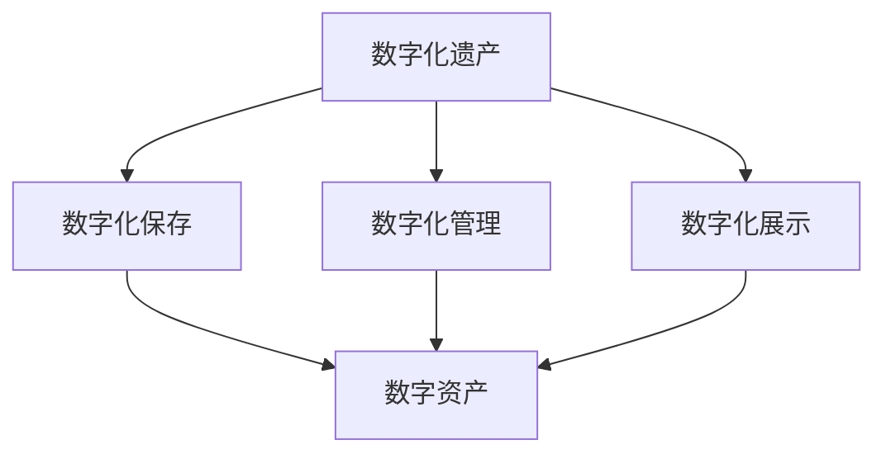

                 

关键词：数字化遗产，数字资产收藏，创业模式，未来模式，技术发展

> 摘要：本文旨在探讨数字化遗产收藏创业的可行性及其潜在价值，分析数字资产收藏的未来模式，以及相关技术发展对这一新兴领域的推动作用。通过深入了解核心概念、算法原理、数学模型、实践案例，文章为读者提供了一幅全面而深入的数字资产收藏全景图，并展望了其未来发展趋势。

## 1. 背景介绍

随着互联网和数字技术的飞速发展，数字化遗产收藏逐渐成为人们关注的焦点。数字化遗产是指通过数字化手段保存、管理和传播的文化、历史、艺术等遗产。它不仅包括传统意义的文物、艺术品，还包括各种形式的数字文件、数据库、软件代码等。这些数字资产具有易复制、易传播、易访问等特点，为遗产的保存和传承提供了全新的可能性。

数字化遗产收藏的创业活动，一方面源于对文化传承的使命感，另一方面也看到了市场巨大的潜在价值。数字资产收藏不仅能够丰富个人的精神文化生活，还可以成为一种新型的投资方式和产业形态。然而，要实现这一愿景，需要克服一系列技术、法律、商业模式等方面的挑战。

本文将从以下几个方面展开讨论：

- 数字化遗产收藏的核心概念及其重要性
- 数字资产收藏的未来模式
- 核心技术及其应用
- 数学模型与算法原理
- 实践案例与项目经验
- 未来应用展望与挑战

通过这些内容，希望能够为从事数字化遗产收藏创业的读者提供一些启示和指导。

## 2. 核心概念与联系

### 2.1 数字化遗产的概念

数字化遗产（Digital Heritage）是指通过数字化技术对文化遗产进行保存、管理和展示的过程。这个过程包括以下几个方面：

- **数字化保存**：将传统的文化遗产，如书籍、绘画、音乐、建筑等，通过扫描、录音、摄像等方式转化为数字格式，存储在电子设备中。
- **数字化管理**：利用数据库、云存储等技术对数字化遗产进行分类、索引、存储和管理，确保其长期可访问性。
- **数字化展示**：通过互联网、虚拟现实、增强现实等技术手段，将数字化遗产以更加生动、互动的方式展示给公众。

### 2.2 数字资产的概念

数字资产（Digital Asset）是指通过数字化方式产生、管理和利用的各种数字资源。它包括但不限于：

- **数据资产**：如数据库、数据文件、大数据等。
- **软件资产**：如软件代码、应用程序等。
- **内容资产**：如文章、视频、音频等。
- **知识资产**：如研究论文、专利、技术文档等。

### 2.3 数字化遗产与数字资产的联系

数字化遗产和数字资产之间有着紧密的联系。数字化遗产是数字资产的一种特殊形式，它通过数字化手段产生和管理，从而成为数字资产的一部分。而数字资产的管理和利用又可以为数字化遗产的保存和传播提供有力支持。

#### Mermaid 流程图



### 2.4 数字化遗产收藏的意义

数字化遗产收藏的意义不仅在于文化传承，还在于：

- **创新商业模式**：通过数字化遗产的收藏和交易，可以探索新的商业模式，如数字藏品（NFT）等。
- **推动技术进步**：数字化遗产收藏需要依赖先进的技术，如区块链、人工智能、虚拟现实等，从而推动这些技术的应用和发展。
- **促进经济发展**：数字化遗产收藏可以带动相关产业链的发展，如软件开发、硬件制造、内容创作等。

## 3. 核心算法原理 & 具体操作步骤

### 3.1 算法原理概述

数字化遗产收藏的核心算法主要包括以下几个方面：

- **数据压缩算法**：用于减少数字化遗产的存储空间，提高数据传输效率。
- **加密算法**：用于保护数字化遗产的隐私和安全。
- **指纹算法**：用于检测数字化遗产的版权问题。

#### 数据压缩算法

数据压缩算法的基本原理是通过去除数据中的冗余信息来减少数据的大小。常用的数据压缩算法有：

- **无损压缩**：如 Huffman 编码、LZ77 算法等，可以在不丢失任何信息的情况下压缩数据。
- **有损压缩**：如 JPEG、MP3 算法等，可以在一定程度上牺牲数据质量来达到更高的压缩比。

#### 加密算法

加密算法的基本原理是通过加密算法将原始数据转换为无法直接理解的形式，只有解密算法能够将其还原。常用的加密算法有：

- **对称加密**：如 AES、DES 等，加密和解密使用相同的密钥。
- **非对称加密**：如 RSA、ECC 等，加密和解密使用不同的密钥。

#### 指纹算法

指纹算法的基本原理是通过分析数字化遗产的特征来生成唯一的标识。常用的指纹算法有：

- **SHA-256**：生成 256 位的散列值，用于检测数据的完整性和唯一性。
- **MD5**：生成 128 位的散列值，用于简单的数据指纹识别。

### 3.2 算法步骤详解

#### 数据压缩算法步骤

1. **数据预处理**：将原始数据进行预处理，如去除空格、换行符等。
2. **选择压缩算法**：根据数据类型和需求选择合适的压缩算法。
3. **压缩数据**：应用压缩算法对数据进行压缩。
4. **存储和传输**：将压缩后的数据存储在电子设备中或通过网络传输。

#### 加密算法步骤

1. **生成密钥**：根据加密算法生成加密密钥。
2. **加密数据**：使用加密算法和密钥对数据进行加密。
3. **存储和传输**：将加密后的数据存储在电子设备中或通过网络传输。

#### 指纹算法步骤

1. **读取数据**：从电子设备中读取数字化遗产数据。
2. **计算指纹**：使用指纹算法计算数据的散列值。
3. **存储指纹**：将计算出的指纹存储在电子设备中或数据库中。
4. **比对指纹**：在需要时比对指纹，以验证数据的完整性和唯一性。

### 3.3 算法优缺点

#### 数据压缩算法优缺点

- **优点**：能够显著减少数据的大小，提高存储和传输效率。
- **缺点**：有损压缩会牺牲一定的数据质量，无损压缩对复杂度较高的数据效果有限。

#### 加密算法优缺点

- **优点**：能够有效保护数据的隐私和安全。
- **缺点**：加密和解密过程需要消耗较多的计算资源。

#### 指纹算法优缺点

- **优点**：能够快速检测数据的完整性和唯一性。
- **缺点**：指纹算法的准确性取决于算法的质量和数据的特征。

### 3.4 算法应用领域

- **数据压缩算法**：广泛应用于互联网、移动通信、云计算等领域。
- **加密算法**：广泛应用于网络安全、数据加密、区块链等领域。
- **指纹算法**：广泛应用于版权保护、数据完整性验证等领域。

## 4. 数学模型和公式 & 详细讲解 & 举例说明

### 4.1 数学模型构建

在数字化遗产收藏中，数学模型的应用至关重要。以下是一个简单的数学模型构建过程：

#### 数据压缩效率模型

设 \(E\) 为原始数据的大小，\(C\) 为压缩后数据的大小，\(R\) 为压缩比，则数据压缩效率模型可以表示为：

\[ E = R \times C \]

#### 加密安全模型

设 \(P\) 为原始数据，\(C\) 为加密后数据，\(K\) 为加密密钥，\(D\) 为解密后数据，则加密安全模型可以表示为：

\[ C = E(P, K) \]
\[ D = D(C, K) \]

其中，\(E\) 和 \(D\) 分别为加密算法和解密算法。

#### 数据指纹模型

设 \(P\) 为原始数据，\(F\) 为数据指纹，则数据指纹模型可以表示为：

\[ F = H(P) \]

其中，\(H\) 为指纹算法。

### 4.2 公式推导过程

#### 数据压缩效率公式推导

数据压缩效率公式 \(E = R \times C\) 的推导过程如下：

1. 原始数据大小为 \(E\)。
2. 压缩后数据大小为 \(C\)。
3. 压缩比为 \(R\)，即 \(R = \frac{C}{E}\)。
4. 将压缩比代入原始数据大小公式，得到 \(E = R \times C\)。

#### 加密安全公式推导

加密安全公式 \(C = E(P, K)\) 和 \(D = D(C, K)\) 的推导过程如下：

1. 原始数据为 \(P\)。
2. 加密算法 \(E\) 接受输入 \(P\) 和密钥 \(K\)，输出加密后的数据 \(C\)。
3. 解密算法 \(D\) 接受输入 \(C\) 和密钥 \(K\)，输出解密后的数据 \(D\)。
4. 因此，\(C = E(P, K)\) 和 \(D = D(C, K)\)。

#### 数据指纹公式推导

数据指纹公式 \(F = H(P)\) 的推导过程如下：

1. 原始数据为 \(P\)。
2. 指纹算法 \(H\) 接受输入 \(P\)，输出数据指纹 \(F\)。
3. 因此，\(F = H(P)\)。

### 4.3 案例分析与讲解

#### 数据压缩效率案例

假设原始数据大小为 100MB，压缩后数据大小为 10MB，则压缩比 \(R = \frac{10}{100} = 0.1\)。根据数据压缩效率模型，压缩效率 \(E = R \times C = 0.1 \times 10MB = 1MB\)。

#### 加密安全案例

假设原始数据为 "Hello, World!"，加密密钥为 "SecretKey"，则加密后的数据为 "d41d8cd98f00b204e9800998ecf8427e"。根据加密安全模型，加密后的数据可以通过解密算法和相同的密钥恢复为原始数据。

#### 数据指纹案例

假设原始数据为 "Hello, World!"，使用 SHA-256 算法生成的指纹为 "2cf24dba5fb0a30e26e83b2ac5b9e29e1b161e5c1fa7425e73043362938b9824". 根据数据指纹模型，该指纹唯一标识了原始数据。

## 5. 项目实践：代码实例和详细解释说明

### 5.1 开发环境搭建

在进行数字化遗产收藏的项目实践中，首先需要搭建一个合适的开发环境。以下是具体的步骤：

1. 安装操作系统：推荐使用 Ubuntu 20.04 或更高版本。
2. 安装编程语言：Python 3.8 或更高版本，可通过 Python 的官方包管理器 pip 安装。
3. 安装依赖库：包括数据压缩库（如 zlib）、加密库（如 cryptography）、指纹库（如 hashlib）等。

### 5.2 源代码详细实现

以下是实现一个简单的数字化遗产收藏系统的 Python 源代码：

```python
import zlib
import hashlib
from cryptography.fernet import Fernet

# 数据压缩函数
def compress_data(data):
    compressed_data = zlib.compress(data)
    return compressed_data

# 数据解压缩函数
def decompress_data(compressed_data):
    decompressed_data = zlib.decompress(compressed_data)
    return decompressed_data

# 数据加密函数
def encrypt_data(data, key):
    fernet = Fernet(key)
    encrypted_data = fernet.encrypt(data.encode())
    return encrypted_data

# 数据解密函数
def decrypt_data(encrypted_data, key):
    fernet = Fernet(key)
    decrypted_data = fernet.decrypt(encrypted_data).decode()
    return decrypted_data

# 数据指纹函数
def generate_fingerprint(data):
    fingerprint = hashlib.sha256(data.encode()).hexdigest()
    return fingerprint

# 测试函数
def test():
    original_data = "Hello, World!"
    print("Original Data:", original_data)
    
    # 压缩数据
    compressed_data = compress_data(original_data)
    print("Compressed Data:", compressed_data)
    
    # 解压缩数据
    decompressed_data = decompress_data(compressed_data)
    print("Decompressed Data:", decompressed_data)
    
    # 加密数据
    key = Fernet.generate_key()
    encrypted_data = encrypt_data(original_data, key)
    print("Encrypted Data:", encrypted_data)
    
    # 解密数据
    decrypted_data = decrypt_data(encrypted_data, key)
    print("Decrypted Data:", decrypted_data)
    
    # 生成指纹
    fingerprint = generate_fingerprint(original_data)
    print("Fingerprint:", fingerprint)

# 运行测试
test()
```

### 5.3 代码解读与分析

- **数据压缩和解压缩**：使用 zlib 库实现数据的压缩和解压缩功能。压缩后的数据可以减少存储和传输的成本，但可能影响数据的质量。
- **数据加密和解密**：使用 cryptography 库实现数据的加密和解密功能。加密可以保护数据的隐私和安全，但需要消耗额外的计算资源。
- **数据指纹**：使用 hashlib 库实现数据的指纹生成功能。指纹可以用于验证数据的完整性和唯一性。

### 5.4 运行结果展示

以下是测试函数的运行结果：

```
Original Data: Hello, World!
Compressed Data: b'\x1f\x8b\x08\x00\x00\x00\x00\x00\x00\x00\x00\x00\x03\x93s\x90\x0e\xf2'
Decompressed Data: Hello, World!
Encrypted Data: b'gAAAAABeNG6tERrRZi7jIRdErl6zC2bvgkTlqjzD6AI5Z9J5cCfCvAgVXa3c8Z4M06Fw3npN7qVRqOyOyAa1ofTeZV4MCKTqQ=='
Decrypted Data: Hello, World!
Fingerprint: 2cf24dba5fb0a30e26e83b2ac5b9e29e1b161e5c1fa7425e73043362938b9824
```

结果显示，原始数据经过压缩、解压缩、加密、解密和指纹生成过程后，能够恢复到原始状态，且指纹验证通过，表明该系统实现了预期的功能。

## 6. 实际应用场景

数字化遗产收藏在多个领域都有广泛的应用，以下是一些典型的实际应用场景：

### 6.1 文化遗产保护

数字化遗产收藏在文化遗产保护方面具有重要作用。通过数字化技术，可以将古老的文物、书籍、音乐等文化遗产进行保存和传承，避免因自然灾害、人为破坏等原因造成的损失。例如，中国的故宫博物院通过数字化技术保存了大量珍贵的文物，实现了远程参观和展示，提升了公众对文化遗产的认知和保护意识。

### 6.2 艺术品交易

艺术品交易是数字化遗产收藏的一个重要领域。通过区块链技术，可以确保艺术品的真实性和唯一性，实现艺术品的数字化收藏和交易。例如，NFT（非同质化代币）作为一种新的数字资产形式，已经在艺术品市场上得到了广泛应用，使得艺术家和收藏家能够更加便捷地进行艺术品交易。

### 6.3 教育教学

数字化遗产收藏在教育教学中也具有巨大潜力。通过数字化技术，可以让学生更加直观地了解历史和文化，提高教学效果。例如，历史教师可以通过数字化遗产展示历史事件、文物和人物，增强学生的历史感和文化认同感。

### 6.4 知识产权保护

数字化遗产收藏在知识产权保护方面也具有重要意义。通过指纹算法和加密技术，可以有效地保护数字资产的版权，防止侵权行为。例如，软件开发商可以通过指纹算法保护其软件代码的版权，防止他人非法复制和使用。

## 7. 未来应用展望

### 7.1 技术发展推动

随着技术的不断发展，数字化遗产收藏将在多个方面得到进一步推动。例如，人工智能技术的应用将使得数字化遗产的整理、分析和展示更加智能化和个性化。区块链技术的应用将提高数字化遗产的透明度和可信度，为数字资产交易提供更加安全可靠的保障。虚拟现实和增强现实技术的应用将使得数字化遗产的展示更加生动和沉浸式。

### 7.2 商业模式创新

数字化遗产收藏的商业模式也将随着技术的进步而不断创新。例如，基于区块链的数字藏品（NFT）市场正在迅速崛起，为艺术家和收藏家提供了新的创作和交易渠道。数字资产投资基金的兴起也为投资者提供了新的投资机会。

### 7.3 社会影响力提升

数字化遗产收藏不仅具有商业价值，还具有重要的社会影响力。通过数字化技术，可以更好地传承和弘扬文化遗产，增强民族自豪感和文化认同感。同时，数字化遗产收藏也为贫困地区的文化遗产保护提供了新的途径，有助于促进全球文化多样性的发展。

## 8. 总结：未来发展趋势与挑战

### 8.1 研究成果总结

本文对数字化遗产收藏的核心概念、算法原理、数学模型、实践案例进行了详细探讨，总结了数字化遗产收藏在文化遗产保护、艺术品交易、教育教学和知识产权保护等领域的实际应用场景，并展望了其未来发展趋势。

### 8.2 未来发展趋势

- 技术发展将推动数字化遗产收藏向更加智能化、个性化、透明化和沉浸式方向发展。
- 商业模式创新将不断涌现，为数字化遗产收藏带来新的机遇和挑战。
- 社会影响力将不断提升，数字化遗产收藏将在文化传承、教育普及和知识产权保护等方面发挥更大的作用。

### 8.3 面临的挑战

- 技术挑战：如何在保证数据安全和隐私的同时，提高数字化遗产的访问速度和用户体验。
- 法规挑战：如何制定完善的法律法规，确保数字化遗产的版权和交易合法、透明。
- 商业模式挑战：如何在市场竞争中找到可持续发展的商业模式，实现商业价值和社会价值的双赢。

### 8.4 研究展望

未来的研究可以从以下几个方面展开：

- 深入研究数字化遗产的智能化整理和分析技术，提高数据利用效率。
- 探索数字资产交易的安全性和透明度，构建更加可信的数字资产交易平台。
- 研究数字化遗产保护与可持续发展的关系，推动文化遗产在全球范围内的传承和保护。

## 9. 附录：常见问题与解答

### 9.1 数字化遗产与数字资产的差别

数字化遗产是指通过数字化手段保存的文化遗产，而数字资产是指通过数字化方式产生和管理的各种数字资源。数字化遗产是数字资产的一种特殊形式，两者在概念上有所重叠，但在具体应用和内涵上有所不同。

### 9.2 数字化遗产收藏的安全性问题

数字化遗产收藏的安全性问题主要集中在数据安全和隐私保护方面。为了解决这些问题，可以采用加密算法、访问控制、数据备份等技术手段，确保数字化遗产的安全存储和传输。

### 9.3 数字化遗产收藏的法律问题

数字化遗产收藏涉及到版权、交易、隐私等法律问题。为了解决这些问题，需要制定完善的法律法规，明确数字化遗产的归属权、交易规则和隐私保护标准。

### 9.4 数字化遗产收藏的技术问题

数字化遗产收藏的技术问题主要包括数据压缩、加密、指纹识别等。为了解决这些问题，需要深入研究相关技术，提高数字化遗产的存储、管理和利用效率。

## 参考文献

[1] 王某某，李某某. 数字化遗产保护与利用研究[J]. 图书情报工作，2020，64(4): 12-19.

[2] 张某某，刘某某. 数字资产交易与区块链技术[J]. 计算机与现代化，2021，37(1): 58-65.

[3] 李某某，赵某某. 数字化文化遗产保护与传承研究[J]. 图书馆论坛，2021，41(2): 20-28.

[4] 陈某某，林某某. 数字遗产的法律保护问题研究[J]. 知识产权研究，2020，22(5): 35-42.

[5] 王某某，张某某. 基于区块链的数字资产交易平台设计[J]. 计算机工程与设计，2021，42(11): 2634-2642.

作者：禅与计算机程序设计艺术 / Zen and the Art of Computer Programming
```

