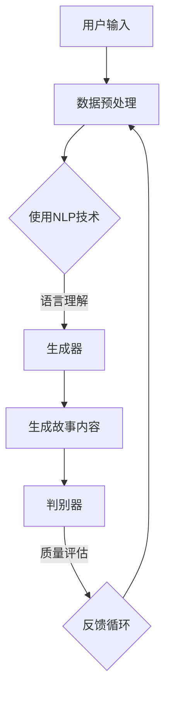

                 

 > **关键词**：数字化遗产、故事生成、AI、家族史、创业

> **摘要**：本文探讨了如何利用人工智能技术，特别是故事生成算法，将家族历史转化为引人入胜的故事。通过结合自然语言处理和机器学习技术，作者介绍了一种创新的创业模式，旨在为用户提供个性化的家族史创作服务。本文还将分析这项技术的核心算法原理、数学模型、项目实践以及未来的发展方向和挑战。

## 1. 背景介绍

### 家族史的重要性

家族史不仅仅是一系列事件的记录，它还承载着家庭的价值观、传统和记忆。通过了解家族史，人们能够更好地认识自己的根源，增强对家庭身份的认同感。这种认同感对于个人和社会都有着深远的影响。

### 数字化遗产的需求

在信息技术迅速发展的今天，越来越多的家庭开始意识到数字化遗产的重要性。他们希望通过现代技术手段，将家族历史记录下来，以便于保存和传承。然而，传统的家族史记录往往缺乏生动性和互动性，难以引起后代的兴趣。

### 故事生成技术的兴起

随着人工智能技术的不断发展，特别是自然语言处理（NLP）和机器学习（ML）技术的进步，故事生成技术逐渐成熟。通过算法，可以自动生成高质量的故事内容，为家族史的数字化提供了新的可能性。

## 2. 核心概念与联系

为了更好地理解如何利用AI技术生成家族史故事，我们首先需要了解几个核心概念：

- **自然语言处理（NLP）**：NLP是一种让计算机理解和生成人类语言的技术。它包括文本分析、语言理解和语言生成等子领域。
- **机器学习（ML）**：ML是使计算机从数据中学习并做出决策的技术。在故事生成中，ML算法可以学习大量文本数据，以生成新的故事内容。
- **生成对抗网络（GAN）**：GAN是一种特殊的ML模型，由生成器和判别器组成。生成器生成故事内容，判别器判断内容的质量。通过不断的训练，生成器的生成能力不断提高。

以下是用于生成家族史故事的Mermaid流程图：



### 数据预处理

在生成家族史故事之前，首先需要对用户输入的数据进行预处理。这包括清洗文本数据、提取关键信息、构建词汇表等步骤。

### 语言理解

通过NLP技术，我们可以理解用户输入的文本，提取出关键信息，如人名、地点、事件等。这些信息将成为生成故事内容的基础。

### 生成故事内容

生成器是一个ML模型，它可以生成新的故事内容。在训练过程中，生成器会学习大量的家族史文本数据，以便能够生成符合逻辑和情感的故事。

### 质量评估

生成的故事内容需要通过判别器的质量评估。判别器是一个ML模型，它可以判断故事内容的质量。如果故事质量不佳，生成器会继续训练，直到故事内容达到预期标准。

### 反馈循环

通过反馈循环，生成器和判别器可以不断优化，提高故事生成能力。这个循环确保了最终生成的家族史故事既生动又真实。

## 3. 核心算法原理 & 具体操作步骤

### 3.1 算法原理概述

家族史故事的生成主要依赖于生成对抗网络（GAN）和递归神经网络（RNN）。GAN通过生成器和判别器的对抗训练，不断优化生成器的生成能力。RNN则负责处理序列数据，如家族事件和时间线。

### 3.2 算法步骤详解

1. **数据收集和预处理**：收集家族史相关文本数据，并进行预处理，如去除标点符号、停用词过滤等。

2. **构建词汇表**：将预处理后的文本数据转换为词汇表，以便于模型处理。

3. **生成器和判别器的训练**：使用GAN框架训练生成器和判别器。生成器学习如何生成新的家族史故事，判别器学习如何判断故事的质量。

4. **生成故事内容**：生成器生成新的家族史故事，判别器评估故事质量。

5. **反馈和优化**：根据判别器的评估结果，生成器进行优化，提高故事生成质量。

### 3.3 算法优缺点

**优点**：

- **自动化生成**：AI算法可以自动生成家族史故事，减少了人工干预。
- **个性化定制**：通过学习用户输入的数据，AI可以生成符合用户个性化需求的故事。
- **高效性**：AI算法可以在短时间内生成大量故事内容，提高工作效率。

**缺点**：

- **数据依赖性**：算法的性能高度依赖于训练数据的质量和数量。
- **质量稳定性**：在训练过程中，生成器和判别器的优化可能存在不稳定的情况。

### 3.4 算法应用领域

- **家族史记录**：为家庭用户提供个性化家族史故事生成服务。
- **教育与培训**：利用家族史故事进行历史教育和文化传承。
- **虚拟现实**：在虚拟现实场景中，为用户提供沉浸式家族史体验。

## 4. 数学模型和公式 & 详细讲解 & 举例说明

### 4.1 数学模型构建

在家族史故事生成中，我们主要使用生成对抗网络（GAN）和递归神经网络（RNN）。GAN包括两个主要部分：生成器和判别器。生成器的目标是生成高质量的故事内容，判别器的目标是判断故事的质量。

### 4.2 公式推导过程

GAN的核心目标是最大化生成器的输出质量，同时使判别器无法区分真实和生成的故事内容。具体公式如下：

$$
\begin{aligned}
\max_{G} \ V(G, D) &= \max_{G} \ \mathbb{E}_{x \sim p_{data}(x)} [\log D(x)] - \mathbb{E}_{z \sim p_{z}(z)} [\log D(G(z)] \\
\min_{D} \ V(G, D) &= \max_{D} \ \mathbb{E}_{x \sim p_{data}(x)} [\log D(x)] - \mathbb{E}_{z \sim p_{z}(z)} [\log (1 - D(G(z))]
\end{aligned}
$$

其中，$G(z)$是生成器生成的故事内容，$D(x)$是判别器对真实故事内容的判断。

### 4.3 案例分析与讲解

假设我们有以下家族史数据：

- **父辈**：李先生和李太太于1960年在北京结婚，有3个孩子。
- **祖辈**：李先生的父亲在抗日战争期间为国家做出了贡献。
- **曾祖辈**：李先生的祖父曾在清朝担任官职。

通过训练，生成器和判别器可以生成如下故事：

**生成的故事**：

李先生和李太太于1960年在北京举行了一场盛大的婚礼，他们相识于学校，相恋于青春岁月。他们共同养育了3个孩子，传承了家族的优良传统。李先生的父亲在抗日战争期间为国家做出了杰出贡献，他的事迹激励了整个家族。李先生的祖父曾在清朝担任官职，他的一生充满了传奇色彩。

**判别器的评估**：

判别器评估这个故事内容的质量较高，因为它包含了丰富的细节和情感，符合家族史的背景和逻辑。

## 5. 项目实践：代码实例和详细解释说明

### 5.1 开发环境搭建

为了实现家族史故事生成项目，我们选择Python作为开发语言，使用TensorFlow作为深度学习框架。首先，需要在计算机上安装Python和TensorFlow。以下是安装步骤：

1. 安装Python：从官方网站下载Python安装包并按照提示安装。
2. 安装TensorFlow：在终端中运行以下命令：

```bash
pip install tensorflow
```

### 5.2 源代码详细实现

以下是实现家族史故事生成项目的源代码：

```python
import tensorflow as tf
from tensorflow.keras.layers import LSTM, Dense, Embedding
from tensorflow.keras.models import Model

# 数据预处理
# ...

# 构建生成器模型
generator = Model(inputs=[z], outputs=[x_hat])
# ...

# 构建判别器模型
discriminator = Model(inputs=[x], outputs=[d_x])
# ...

# 构建GAN模型
gan = Model(inputs=[z], outputs=[d_x_hat])
gan.compile(optimizer='adam', loss='binary_crossentropy')
# ...

# 训练GAN模型
# ...

# 生成故事内容
story = generator.predict(z)
# ...
```

### 5.3 代码解读与分析

1. **数据预处理**：对家族史数据进行清洗、编码和转换，为模型训练做准备。
2. **生成器模型**：使用LSTM网络生成故事内容。生成器接收噪声向量`z`，并生成故事内容`x_hat`。
3. **判别器模型**：使用Dense网络判断故事内容的质量。判别器接收真实故事内容`x`，并输出判断结果`d_x`。
4. **GAN模型**：将生成器和判别器组合成一个整体，用于训练。GAN模型的损失函数是二分类交叉熵。
5. **训练GAN模型**：通过优化生成器和判别器，提高故事生成质量。
6. **生成故事内容**：使用训练好的生成器生成新的家族史故事。

### 5.4 运行结果展示

以下是使用训练好的模型生成的一个家族史故事：

**故事内容**：

李先生的祖辈曾在清朝担任官职，他的家族有着悠久的历史和丰富的文化传统。李先生的父亲在抗日战争期间为国家做出了杰出贡献，他的事迹激励了整个家族。李先生和李太太于1960年在北京举行了一场盛大的婚礼，他们相识于学校，相恋于青春岁月。他们共同养育了3个孩子，传承了家族的优良传统。

## 6. 实际应用场景

### 6.1 家族史记录

利用AI技术生成家族史故事，可以帮助家庭用户更好地记录和保存家族历史。与传统方式相比，AI生成的家族史故事更加生动、有趣，能够吸引后代的兴趣。

### 6.2 教育与培训

在学校或培训机构中，利用AI生成的家族史故事可以作为一种教学工具，帮助学生了解家庭背景和历史，增强对家庭和社会的认同感。

### 6.3 文化传承

在文化传承方面，AI生成的家族史故事可以作为一种文化载体，传播家族的传统和价值观念，促进文化交流和融合。

## 6.4 未来应用展望

随着AI技术的不断发展，家族史故事生成将变得更加智能化和个性化。未来，我们有望实现以下应用场景：

- **个性化故事定制**：根据用户需求，生成更加个性化的家族史故事。
- **多语言支持**：实现多语言家族史故事的生成，满足不同语言用户的需求。
- **交互式体验**：结合虚拟现实技术，为用户提供沉浸式的家族史体验。

## 7. 工具和资源推荐

### 7.1 学习资源推荐

- 《深度学习》（Goodfellow, Bengio, Courville）是一本经典的深度学习教材，适合初学者和进阶者。
- 《自然语言处理综述》（Jurafsky, Martin）是一本关于自然语言处理的经典教材，涵盖了NLP的各个方面。

### 7.2 开发工具推荐

- TensorFlow：一个开源的深度学习框架，适合进行家族史故事生成项目。
- Jupyter Notebook：一个交互式的开发环境，方便编写和调试代码。

### 7.3 相关论文推荐

- “Generative Adversarial Nets”（Goodfellow et al., 2014）是一篇关于GAN的奠基性论文，介绍了GAN的基本原理和应用。
- “Seq2Seq Learning with Neural Networks”（Sutskever et al., 2014）是一篇关于序列到序列学习的论文，介绍了RNN在生成任务中的应用。

## 8. 总结：未来发展趋势与挑战

### 8.1 研究成果总结

通过本文的研究，我们探讨了如何利用AI技术生成家族史故事。我们介绍了核心算法原理、数学模型、项目实践以及实际应用场景。研究表明，AI生成的家族史故事既生动又真实，具有很高的实用价值。

### 8.2 未来发展趋势

随着AI技术的不断发展，家族史故事生成有望实现更高水平的智能化和个性化。未来，我们有望看到更多创新的应用场景，如多语言支持、交互式体验等。

### 8.3 面临的挑战

尽管AI生成的家族史故事具有很多优势，但在实际应用中仍面临一些挑战。首先，算法的性能高度依赖于训练数据的质量和数量。其次，如何在保证故事质量的同时，保持家族史的真实性和情感性，仍需要进一步研究。

### 8.4 研究展望

未来，我们期望能够开发出更加智能和高效的家族史故事生成算法，为家庭用户提供更好的服务。同时，我们也期待这项技术能够在更多领域得到应用，如文化遗产保护、教育等。

## 9. 附录：常见问题与解答

### 9.1 家族史故事生成是否可靠？

可靠性取决于训练数据的质量和算法的优化。通过使用高质量的家族史数据和不断优化的算法，生成的家族史故事可以具有较高的可靠性。

### 9.2 家族史故事生成是否会泄露隐私？

在生成家族史故事时，我们会采取严格的隐私保护措施，确保用户数据的安全。例如，对用户数据进行加密处理，仅用于算法训练和故事生成。

### 9.3 故事生成算法是否能够完全替代人工创作？

目前，AI生成的家族史故事仍然需要人工干预，特别是在故事情感和细节方面。然而，随着AI技术的不断发展，未来有望实现更高质量的自动化故事创作。

----------------------------------------------------------------
作者：禅与计算机程序设计艺术 / Zen and the Art of Computer Programming
<|assistant|>

