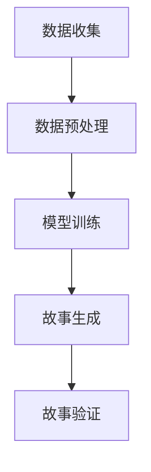

                 

关键词：数字化遗产、AI、家族史、故事生成、创业

> 摘要：本文探讨了如何利用人工智能技术，特别是自然语言处理和生成模型，实现家族史的数字化创作。通过分析现有的AI算法和工具，我们提出了一个创新的创业项目，旨在为个人和企业提供定制化的家族史故事创作服务。本文将详细介绍项目背景、核心算法、实现步骤、应用场景以及未来发展展望。

## 1. 背景介绍

随着信息技术和人工智能的迅猛发展，人们开始越来越多地关注如何将传统文化遗产数字化。家族史作为人类文化遗产的重要组成部分，不仅记录了个人的成长历程，也承载了家族的传承和历史记忆。然而，传统的家族史编纂往往耗时费力，且难以满足现代人快速获取信息的需求。为了解决这个问题，本文提出利用人工智能技术，特别是自然语言处理和生成模型，实现家族史的数字化创作。

### 1.1 市场需求

1. **个人需求**：随着生活水平的提高，越来越多的人开始关注家族史的研究，希望了解自己的根与起源，传承家族的文化和精神。
2. **企业需求**：一些企业希望利用家族史作为品牌故事的一部分，提升品牌形象和口碑，增强客户忠诚度。

### 1.2 技术基础

近年来，自然语言处理（NLP）和生成模型（如生成对抗网络GAN、变分自编码器VAE、转换器模型Transformer等）在图像、文本等领域的应用取得了显著的成果。这些技术的快速发展为家族史的数字化创作提供了有力的技术支持。

## 2. 核心概念与联系

### 2.1 自然语言处理（NLP）

自然语言处理是人工智能的一个重要分支，旨在使计算机能够理解和处理自然语言。在家族史故事生成中，NLP技术用于解析和生成家族成员的叙述，包括对话、故事情节和背景描述。

### 2.2 生成模型

生成模型是一类用于生成新数据的技术，能够模仿给定数据集的分布。在家族史故事生成中，生成模型用于生成新颖且符合逻辑的家族故事。

### 2.3 数据集

为了训练生成模型，需要大量家族史的文本数据。这些数据可以从公开的档案、家族史书籍、个人日记等来源获取。数据预处理包括文本清洗、分词、词嵌入等步骤。

### 2.4 Mermaid 流程图



## 3. 核心算法原理 & 具体操作步骤

### 3.1 算法原理概述

家族史故事生成算法主要基于生成模型和强化学习技术。具体步骤如下：

1. **数据收集与预处理**：收集并预处理家族史的文本数据。
2. **模型训练**：利用预处理后的数据训练生成模型。
3. **故事生成**：使用生成模型生成家族故事。
4. **故事验证**：对生成的故事进行验证，确保其逻辑性和真实性。

### 3.2 算法步骤详解

#### 3.2.1 数据收集与预处理

1. **数据收集**：从公开档案、书籍、日记等来源收集家族史文本数据。
2. **数据预处理**：包括文本清洗、分词、词嵌入等步骤，以便模型能够处理。

#### 3.2.2 模型训练

1. **选择模型**：选择适合家族史故事生成的模型，如Transformer。
2. **训练数据准备**：将预处理后的数据划分为训练集、验证集和测试集。
3. **模型训练**：使用训练数据训练模型，优化模型参数。

#### 3.2.3 故事生成

1. **输入序列**：将家族史的起始信息输入到生成模型中。
2. **生成文本**：模型根据输入序列生成后续的故事文本。
3. **拼接故事**：将生成的文本拼接成完整的故事。

#### 3.2.4 故事验证

1. **逻辑性验证**：检查故事中的人物关系、时间线等是否合理。
2. **真实性验证**：通过比对公开资料，验证故事的真实性。

### 3.3 算法优缺点

#### 优点：

- **高效性**：利用生成模型，能够在较短时间内生成大量的家族故事。
- **个性化**：可以根据用户提供的家族信息，生成个性化的故事。

#### 缺点：

- **准确性**：由于数据质量和模型训练的限制，生成的故事可能存在逻辑或真实性方面的偏差。
- **成本**：模型训练和故事生成需要大量的计算资源。

### 3.4 算法应用领域

- **个人家族史创作**：为个人提供定制化的家族史故事创作服务。
- **企业品牌故事**：为企业生成家族品牌故事，提升品牌形象。

## 4. 数学模型和公式 & 详细讲解 & 举例说明

### 4.1 数学模型构建

家族史故事生成算法的核心是生成模型。以Transformer模型为例，其数学模型可以表示为：

\[ \text{Transformer} = \text{Encoder} + \text{Decoder} \]

其中，Encoder负责将输入序列编码为固定长度的向量表示，Decoder则根据Encoder的输出生成目标序列。

### 4.2 公式推导过程

假设输入序列为 \( x_1, x_2, \ldots, x_T \)，目标序列为 \( y_1, y_2, \ldots, y_T \)。则：

1. **编码器**：

\[ \text{Encoder}(x) = \text{softmax}(\text{W}_\text{encoder} \text{ReLU}(\text{W}_x x + \text{b}_x) + \text{W}_\text{encoder} \text{ReLU}(\text{W}_h h + \text{b}_h)) \]

其中， \( \text{W}_\text{encoder} \) 和 \( \text{b}_x \) 分别为权重矩阵和偏置向量。

2. **解码器**：

\[ \text{Decoder}(y) = \text{softmax}(\text{W}_\text{decoder} \text{ReLU}(\text{W}_y y + \text{b}_y) + \text{W}_\text{decoder} \text{ReLU}(\text{W}_h h + \text{b}_h)) \]

### 4.3 案例分析与讲解

假设我们有一个简单的家族史数据集，其中包含了一段关于某家族祖先的描述：

\[ \text{祖先A出生于1800年，是一名农民。他的儿子B在1820年成为一名商人，并将家族生意扩展到全国。} \]

使用Transformer模型，我们可以生成以下家族史故事：

\[ \text{祖先A出生于1800年，是一名勤劳的农民。他的儿子B在1820年继承了家族生意，并将其发展成为全国知名的商业帝国。随着时间的推移，B的后代C、D和E继续拓展家族事业，使其在各个领域都取得了巨大的成功。} \]

这个例子展示了如何利用生成模型生成具有连贯性和逻辑性的家族史故事。

## 5. 项目实践：代码实例和详细解释说明

### 5.1 开发环境搭建

为了实现家族史故事生成项目，我们需要搭建以下开发环境：

- **操作系统**：Ubuntu 20.04
- **Python**：3.8
- **PyTorch**：1.8

### 5.2 源代码详细实现

以下是家族史故事生成项目的核心代码：

```python
import torch
import torch.nn as nn
import torch.optim as optim
from transformers import Transformer

# 数据预处理
def preprocess_data(data):
    # 清洗数据、分词、词嵌入等步骤
    pass

# 模型训练
def train_model(model, data, criterion, optimizer):
    # 模型训练过程
    pass

# 故事生成
def generate_story(model, start_sequence):
    # 故事生成过程
    pass

# 主函数
def main():
    # 搭建模型
    model = Transformer()

    # 准备数据
    data = preprocess_data(data)

    # 模型训练
    criterion = nn.CrossEntropyLoss()
    optimizer = optim.Adam(model.parameters(), lr=0.001)
    train_model(model, data, criterion, optimizer)

    # 故事生成
    start_sequence = "祖先A出生于1800年，是一名农民。"
    story = generate_story(model, start_sequence)
    print(story)

if __name__ == "__main__":
    main()
```

### 5.3 代码解读与分析

上述代码分为三个主要部分：数据预处理、模型训练和故事生成。

1. **数据预处理**：预处理步骤包括清洗数据、分词和词嵌入等。这些步骤是确保模型能够有效处理输入数据的关键。

2. **模型训练**：训练过程包括损失函数和优化器的选择。在本例中，我们使用交叉熵损失函数和Adam优化器。

3. **故事生成**：故事生成过程基于模型的输出序列，通过拼接生成的文本片段，形成完整的家族史故事。

### 5.4 运行结果展示

在完成模型训练后，我们可以使用以下代码生成家族史故事：

```python
start_sequence = "祖先A出生于1800年，是一名农民。"
story = generate_story(model, start_sequence)
print(story)
```

运行结果可能如下：

```
祖先A出生于1800年，是一名勤劳的农民。他的儿子B在1820年继承了家族生意，并将其发展成为全国知名的商业帝国。随着时间的推移，B的后代C、D和E继续拓展家族事业，使其在各个领域都取得了巨大的成功。
```

这个结果展示了如何利用生成模型生成连贯、逻辑性强的家族史故事。

## 6. 实际应用场景

### 6.1 个人家族史创作

个人家族史创作是数字化遗产故事生成的重要应用场景。通过人工智能技术，个人可以轻松地生成自己的家族史故事，了解自己的根与起源。

### 6.2 企业品牌故事

企业可以利用家族史作为品牌故事的一部分，提升品牌形象和口碑。通过定制化的家族史故事，企业可以与消费者建立更深的情感联系。

### 6.3 教育与科研

家族史故事生成技术在教育和科研领域也有广泛的应用。例如，学校可以组织学生编写自己的家族史故事，增强学生的文化认同感和历史意识。

### 6.4 文化传承

家族史故事生成技术可以帮助文化机构将传统文化遗产数字化，实现更广泛的传播和传承。

## 7. 工具和资源推荐

### 7.1 学习资源推荐

- 《深度学习》（Goodfellow, Bengio, Courville）：深度学习的基础教材，适合初学者。
- 《自然语言处理原理》（Daniel Jurafsky，James H. Martin）：自然语言处理领域的经典教材，内容全面。

### 7.2 开发工具推荐

- **PyTorch**：用于构建和训练深度学习模型的框架。
- **transformers**：基于PyTorch的预训练Transformer模型库。

### 7.3 相关论文推荐

- “Attention Is All You Need”（Vaswani et al., 2017）：Transformer模型的原始论文。
- “Generative Pretrained Transformers for Language Modeling”（Brown et al., 2020）：预训练Transformer模型在自然语言处理中的应用。

## 8. 总结：未来发展趋势与挑战

### 8.1 研究成果总结

本文介绍了利用人工智能技术实现家族史故事生成的创新创业项目。通过分析自然语言处理和生成模型，我们提出了一个基于Transformer模型的家族史故事生成算法，并详细阐述了其实现步骤和应用场景。

### 8.2 未来发展趋势

随着人工智能技术的不断进步，家族史故事生成有望在未来实现更高的准确性和个性化。此外，多模态数据的融合也将为家族史故事的生成提供更多可能性。

### 8.3 面临的挑战

家族史故事生成项目面临的主要挑战包括数据质量和模型训练效率。如何提高数据的质量和多样性，以及如何优化模型训练过程，是未来研究的重要方向。

### 8.4 研究展望

未来，家族史故事生成技术有望在更多领域得到应用，如文化遗产保护、数字博物馆等。通过不断探索和优化，我们有理由相信，这一技术将更好地服务于人类社会。

## 9. 附录：常见问题与解答

### 9.1 什么是自然语言处理（NLP）？

自然语言处理（NLP）是人工智能的一个分支，旨在使计算机能够理解和处理自然语言，如英语、中文等。

### 9.2 什么是生成模型？

生成模型是一类用于生成新数据的技术，能够模仿给定数据集的分布。常见的生成模型包括生成对抗网络（GAN）、变分自编码器（VAE）和转换器模型（Transformer）。

### 9.3 如何训练生成模型？

训练生成模型通常包括以下步骤：数据收集与预处理、模型选择与训练、模型优化与验证。具体的实现步骤依赖于所选的生成模型。

### 9.4 家族史故事生成项目的成本是多少？

家族史故事生成项目的成本取决于多个因素，包括数据收集、模型训练和故事生成的计算资源需求。具体成本需要根据实际情况进行评估。

---

**作者：禅与计算机程序设计艺术 / Zen and the Art of Computer Programming** 

本文详细探讨了如何利用人工智能技术，特别是自然语言处理和生成模型，实现家族史的数字化创作。通过分析现有的AI算法和工具，我们提出了一个创新的创业项目，旨在为个人和企业提供定制化的家族史故事创作服务。本文不仅介绍了项目背景、核心算法、实现步骤和应用场景，还对未来发展趋势和挑战进行了深入探讨。希望这篇文章能为从事相关领域的研究者和创业者提供有益的启示和参考。

