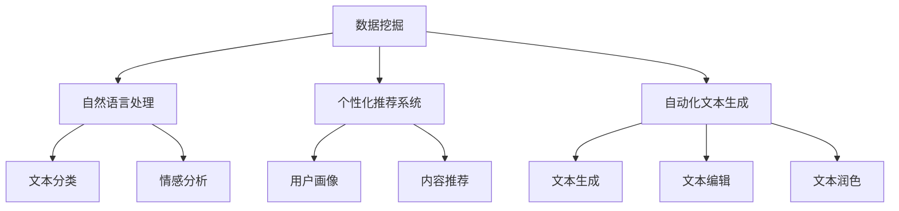

                 

关键词：数字化遗产，AI个人传记，数据挖掘，自然语言处理，个性化推荐系统

> 摘要：随着人工智能技术的发展，利用AI技术为个人撰写传记逐渐成为可能。本文将探讨如何通过数字化遗产和AI技术相结合，实现自动化、个性化的个人传记创作，从而为人们留下宝贵的数字化回忆。

## 1. 背景介绍

在数字化时代，人们越来越依赖数字技术来记录和保存个人生活。社交媒体、照片、视频、电子邮件等数字痕迹构成了个人数字化遗产。这些数字资料不仅记录了我们的生活点滴，还蕴含着丰富的故事和回忆。然而，随着数字资料的不断增加，如何有效地管理和利用这些数据成为一个重要课题。

传统的个人传记撰写过程往往耗时耗力，需要大量的手工整理和编辑工作。而随着人工智能（AI）技术的不断发展，我们可以借助AI的力量，实现自动化、个性化的个人传记创作。本文将探讨如何利用AI驱动的数据挖掘、自然语言处理（NLP）和个性化推荐系统等技术，为个人撰写传记。

### 1.1 数字化遗产的概念

数字化遗产是指通过数字化方式保存和记录的个人生活资料。这些资料可以包括照片、视频、电子邮件、社交媒体动态、日记、文档等。数字化遗产不仅涵盖了个人生活的方方面面，还记录了我们的思想、情感、经历和成长过程。

### 1.2 人工智能在个人传记创作中的应用

人工智能技术在个人传记创作中的应用主要体现在以下几个方面：

- **数据挖掘**：通过分析大量的数字化遗产数据，提取有价值的信息和故事。
- **自然语言处理（NLP）**：将非结构化的文本数据转化为可读性强的文本内容。
- **个性化推荐系统**：根据用户的兴趣和偏好，推荐相关的故事和回忆。
- **自动化文本生成**：利用AI技术生成个性化的传记内容。

### 1.3 本文目标

本文的目标是探讨如何利用AI技术实现自动化、个性化的个人传记创作，从而帮助人们更好地管理和利用数字化遗产。文章将分为以下几个部分：

- **第2部分：核心概念与联系**：介绍本文涉及的核心概念和技术，并使用Mermaid流程图展示技术架构。
- **第3部分：核心算法原理 & 具体操作步骤**：详细讲解AI驱动个人传记创作的核心算法原理和操作步骤。
- **第4部分：数学模型和公式 & 详细讲解 & 举例说明**：介绍用于个人传记创作的数学模型和公式，并给出具体案例进行讲解。
- **第5部分：项目实践：代码实例和详细解释说明**：通过一个实际项目，展示如何使用AI技术撰写个人传记。
- **第6部分：实际应用场景**：探讨AI驱动个人传记创作的实际应用场景。
- **第7部分：工具和资源推荐**：推荐用于个人传记创作的学习资源、开发工具和论文。
- **第8部分：总结：未来发展趋势与挑战**：总结研究成果，探讨未来发展趋势和面临的挑战。
- **第9部分：附录：常见问题与解答**：回答读者可能关心的问题。

## 2. 核心概念与联系

在本文中，我们将介绍与AI驱动个人传记创作相关的核心概念和技术，并使用Mermaid流程图展示它们之间的联系。

### 2.1 数据挖掘

数据挖掘是一种从大量数据中提取有价值信息和知识的方法。在个人传记创作中，数据挖掘可以用于分析数字化遗产数据，提取有价值的故事和回忆。数据挖掘的主要步骤包括数据预处理、特征提取、模式识别和结果评估。

### 2.2 自然语言处理（NLP）

自然语言处理是一种使计算机能够理解和处理人类语言的技术。在个人传记创作中，NLP可以用于将非结构化的文本数据（如日记、电子邮件、社交媒体动态等）转化为可读性强的文本内容。NLP的主要任务包括文本分类、情感分析、实体识别、句法分析和语义分析。

### 2.3 个性化推荐系统

个性化推荐系统是一种根据用户的兴趣和偏好推荐相关内容的技术。在个人传记创作中，个性化推荐系统可以用于根据用户的需求和兴趣，推荐与其生活经历相关的传记内容。个性化推荐系统的主要任务包括用户画像、内容推荐和反馈调整。

### 2.4 自动化文本生成

自动化文本生成是一种利用AI技术生成文本内容的方法。在个人传记创作中，自动化文本生成可以用于生成个性化的传记内容，从而节省时间和人力成本。自动化文本生成的主要任务包括文本生成、文本编辑和文本润色。

### 2.5 Mermaid流程图

为了更好地展示AI驱动个人传记创作中的核心概念和技术，我们使用Mermaid流程图来表示它们之间的联系。

## 3. 核心算法原理 & 具体操作步骤

在AI驱动个人传记创作中，核心算法主要包括数据挖掘、自然语言处理、个性化推荐系统和自动化文本生成。以下将分别介绍这些算法的原理和具体操作步骤。

### 3.1 数据挖掘

数据挖掘算法的基本原理是从大量数据中提取有价值的信息和知识。在个人传记创作中，数据挖掘算法可以用于分析数字化遗产数据，提取有价值的故事和回忆。

**具体操作步骤**：

1. **数据收集**：收集个人数字化遗产数据，如照片、视频、电子邮件、社交媒体动态、日记等。
2. **数据预处理**：对收集到的数据进行清洗、去重、归一化等处理，以确保数据质量。
3. **特征提取**：从预处理后的数据中提取关键特征，如时间、地点、人物、事件等。
4. **模式识别**：利用机器学习算法，对提取出的特征进行模式识别，找出有价值的信息和故事。
5. **结果评估**：对识别出的故事进行评估，确保其符合个人传记的创作要求。

### 3.2 自然语言处理（NLP）

自然语言处理算法的基本原理是使计算机能够理解和处理人类语言。在个人传记创作中，NLP算法可以用于将非结构化的文本数据转化为可读性强的文本内容。

**具体操作步骤**：

1. **文本分类**：将非结构化的文本数据分类到不同的主题类别，如家庭、工作、旅行等。
2. **情感分析**：分析文本数据中的情感倾向，如正面、负面或中性。
3. **实体识别**：识别文本数据中的关键实体，如人物、地点、组织等。
4. **句法分析**：对文本数据进行分析，提取句子结构、语法关系等。
5. **语义分析**：理解文本数据中的语义信息，如含义、意图等。

### 3.3 个性化推荐系统

个性化推荐系统算法的基本原理是根据用户的兴趣和偏好推荐相关内容。在个人传记创作中，个性化推荐系统可以用于根据用户的需求和兴趣，推荐与其生活经历相关的传记内容。

**具体操作步骤**：

1. **用户画像**：根据用户的行为、偏好和需求，构建用户画像。
2. **内容推荐**：利用用户画像，为用户推荐与其生活经历相关的传记内容。
3. **反馈调整**：根据用户的反馈，调整推荐算法，提高推荐质量。

### 3.4 自动化文本生成

自动化文本生成算法的基本原理是利用AI技术生成文本内容。在个人传记创作中，自动化文本生成可以用于生成个性化的传记内容，从而节省时间和人力成本。

**具体操作步骤**：

1. **文本生成**：利用生成式模型，如GPT-3，生成传记内容。
2. **文本编辑**：对生成的文本内容进行编辑，确保内容符合语法和逻辑要求。
3. **文本润色**：对编辑后的文本内容进行润色，提高文本质量和可读性。

### 3.5 算法优缺点

**数据挖掘**：

- **优点**：可以快速地从大量数据中提取有价值的信息和故事。
- **缺点**：对数据质量和特征提取的依赖较大，可能存在信息丢失和偏差。

**自然语言处理（NLP）**：

- **优点**：可以处理非结构化的文本数据，提高文本内容的可读性。
- **缺点**：对语言理解能力的依赖较大，可能存在误解和歧义。

**个性化推荐系统**：

- **优点**：可以根据用户的兴趣和偏好推荐相关内容，提高用户满意度。
- **缺点**：对用户数据的依赖较大，可能存在数据隐私和安全问题。

**自动化文本生成**：

- **优点**：可以快速生成高质量的文本内容，节省时间和人力成本。
- **缺点**：对生成模型的依赖较大，可能存在内容质量不稳定的问题。

### 3.6 算法应用领域

- **个人传记创作**：利用数据挖掘、NLP、个性化推荐系统和自动化文本生成等技术，实现自动化、个性化的个人传记创作。
- **社交媒体分析**：通过分析社交媒体数据，提取有价值的信息和故事，为用户提供个性化的内容推荐。
- **企业报告**：利用数据挖掘和自动化文本生成技术，快速生成企业报告和年报。
- **教育领域**：利用个性化推荐系统和自动化文本生成技术，为教师和学生提供个性化的教学内容和辅导。

## 4. 数学模型和公式 & 详细讲解 & 举例说明

在AI驱动个人传记创作中，数学模型和公式起着关键作用。以下将介绍常用的数学模型和公式，并给出具体案例进行讲解。

### 4.1 数学模型构建

在个人传记创作中，常用的数学模型包括线性回归、逻辑回归、贝叶斯网络和生成对抗网络（GAN）等。

**线性回归模型**：

线性回归模型是一种用于预测数值型变量的统计模型。在个人传记创作中，线性回归模型可以用于预测个人生

