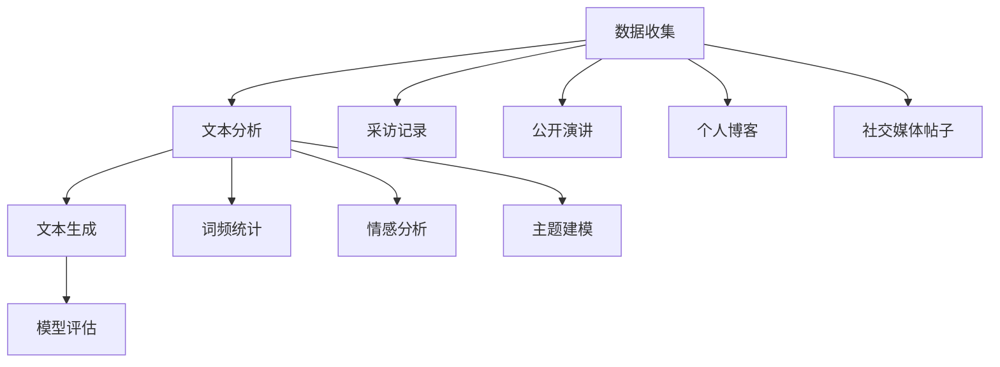

                 

关键词：数字化遗产，个人传记，AI，自然语言处理，创业故事

> 摘要：随着人工智能技术的不断发展，利用AI技术为创业者撰写个人传记成为可能。本文将探讨如何利用人工智能技术实现个人传记的自动化创作，并分享一个具体的创业故事案例，以此展示AI在数字化遗产领域中的应用潜力。

## 1. 背景介绍

在现代社会，个人传记作为记录个体人生历程的重要载体，不仅具有历史价值，还能传递创业精神、激发社会创新。然而，撰写个人传记往往耗时耗力，且需要专业的历史学家或作家。随着人工智能（AI）技术的迅速发展，尤其是自然语言处理（NLP）技术的不断进步，我们有机会利用AI自动化创作个人传记，从而大幅度降低创作成本和时间，提高写作效率。

### 1.1 个人传记的重要性

个人传记不仅是对个体生命的回顾，也是对社会文化的记录。在创业领域，个人传记尤其有价值。创业者的人生经历、创业历程、面临的挑战和取得的成就，对其他创业者具有启发和借鉴作用。通过个人传记，创业者可以分享他们的智慧和经验，为社会带来正能量。

### 1.2 人工智能与自然语言处理

人工智能技术，特别是自然语言处理（NLP）技术，使得计算机能够理解和生成人类语言。目前，NLP技术在文本分类、情感分析、机器翻译等领域取得了显著成果。通过这些技术，我们可以从大量文本数据中提取有用信息，生成结构化的知识库，进而实现个人传记的自动化创作。

## 2. 核心概念与联系

为了更好地理解AI驱动的个人传记创作，我们需要介绍几个核心概念，包括数据收集、文本分析、文本生成和模型评估。

### 2.1 数据收集

数据收集是个人传记创作的基础。我们需要从多个渠道收集创业者的文本数据，包括采访记录、公开演讲、个人博客、社交媒体帖子等。此外，还可以利用公共数据库和互联网搜索引擎来获取相关信息。

### 2.2 文本分析

文本分析是指使用NLP技术对收集到的文本数据进行分析和处理。这包括词频统计、情感分析、主题建模等。通过文本分析，我们可以提取创业者的核心观点、经历和情感，构建个人传记的框架。

### 2.3 文本生成

文本生成是个人传记创作的核心步骤。在这一步骤中，我们使用预训练的NLP模型，如生成对抗网络（GAN）、变分自编码器（VAE）等，生成创业者的个人传记文本。文本生成过程中，我们可以利用已收集的数据进行监督学习，也可以通过无监督学习从大量文本数据中学习生成策略。

### 2.4 模型评估

模型评估是确保个人传记创作质量的关键步骤。我们可以使用各种指标，如BLEU评分、ROUGE评分等，对生成的文本进行评估。同时，还可以通过人工审查和用户反馈来进一步优化模型。

### 2.5 Mermaid 流程图

以下是一个Mermaid流程图，展示了个人传记创作的主要步骤和核心概念之间的联系：



## 3. 核心算法原理 & 具体操作步骤

### 3.1 算法原理概述

AI驱动的个人传记创作算法主要基于自然语言处理技术，包括文本分析、文本生成和模型评估。以下是这些算法的简要概述：

### 3.2 算法步骤详解

1. **数据收集**：从多个渠道收集创业者的文本数据，包括采访记录、公开演讲、个人博客、社交媒体帖子等。
2. **文本预处理**：对收集到的文本数据进行清洗和格式化，使其符合NLP模型的要求。
3. **文本分析**：
   - **词频统计**：统计文本中各个单词的出现频率。
   - **情感分析**：分析文本中表达的情感倾向。
   - **主题建模**：使用主题模型（如LDA）提取文本的主要主题。
4. **文本生成**：
   - **生成模型**：使用预训练的NLP模型（如GAN、VAE）生成个人传记文本。
   - **生成策略**：根据文本分析结果，调整生成模型的内容和风格。
5. **模型评估**：
   - **BLEU评分**：评估生成文本与真实文本的相似度。
   - **ROUGE评分**：评估生成文本的关键词匹配度。
   - **人工审查**：通过人工审查和用户反馈来优化模型。

### 3.3 算法优缺点

**优点**：
- **高效性**：利用AI技术，可以快速生成个人传记，节省时间和人力成本。
- **个性化**：根据文本分析结果，生成具有个性化内容的个人传记。
- **灵活性**：可以灵活调整生成模型，适应不同的创作需求。

**缺点**：
- **数据依赖性**：个人传记的创作质量取决于收集到的文本数据。
- **技术限制**：目前的AI技术尚未完全成熟，生成的文本可能存在一些缺陷。
- **伦理问题**：如何在个人传记创作中保护个人隐私和尊严，是一个值得探讨的问题。

### 3.4 算法应用领域

AI驱动的个人传记创作算法可以应用于多个领域，包括但不限于：
- **创业领域**：为创业者撰写个人传记，记录他们的创业历程和经验。
- **教育领域**：为学生提供优秀创业者的个人传记，作为学习案例。
- **历史领域**：利用个人传记记录历史事件，为后代提供宝贵的历史资料。

## 4. 数学模型和公式 & 详细讲解 & 举例说明

### 4.1 数学模型构建

在AI驱动的个人传记创作中，我们主要使用自然语言处理技术，包括词频统计、情感分析和主题建模。以下是这些模型的简要数学描述：

1. **词频统计**：设文本数据为\(T\)，单词集合为\(W\)，单词\(w\)在文本\(T\)中的出现次数为\(f(w)\)。
   - 公式：\(f(w) = \sum_{t \in T} count(w, t)\)
2. **情感分析**：设文本数据为\(T\)，情感标签集合为\(L\)，单词\(w\)在文本\(T\)中的情感标签为\(s(w)\)。
   - 公式：\(s(w) = \arg\max_{l \in L} P(l|w)\)
3. **主题建模**：使用LDA（Latent Dirichlet Allocation）模型对文本数据进行主题挖掘。
   - 公式：\(\theta \sim Dir(\alpha)\)
   - \(\phi \sim Dir(\beta)\)
   - \(w_i \sim Mult(\phi_{i})\)

### 4.2 公式推导过程

以LDA模型为例，我们介绍公式的推导过程：

1. **Dirichlet Distribution**：假设我们有\(K\)个主题和\(N\)个单词，每个单词\(w_i\)属于某个主题的概率分布为\(\theta_i\)。
   - 公式：\(\theta_i \sim Dir(\alpha)\)，其中\(\alpha\)为超参数，控制主题分布的平滑度。
2. **主题分布**：假设每个主题的单词分布为\(\phi_k\)。
   - 公式：\(\phi_k \sim Dir(\beta)\)，其中\(\beta\)为超参数，控制主题内单词的分布。
3. **单词生成**：给定主题分布\(\theta_i\)和单词分布\(\phi_k\)，生成单词\(w_i\)。
   - 公式：\(w_i \sim Mult(\phi_k)\)

### 4.3 案例分析与讲解

以下是一个LDA模型的简单应用案例：

假设我们有一篇关于创业的文本，包含100个单词。通过LDA模型，我们尝试提取出文本的主要主题。

1. **数据准备**：设定超参数\(\alpha\)和\(\beta\)，并随机初始化主题分布\(\theta\)和单词分布\(\phi\)。
2. **训练LDA模型**：使用Gibbs采样等方法，迭代更新主题分布和单词分布。
3. **提取主题**：根据收敛后的主题分布，提取出文本的主要主题。
4. **主题解释**：根据提取出的主题，对文本内容进行解释。

例如，我们提取出两个主要主题：
- 主题1：创业挑战、团队建设、市场调研
- 主题2：产品创新、用户反馈、商业模式

通过分析这两个主题，我们可以更好地理解文本的内容，为个人传记的写作提供依据。

## 5. 项目实践：代码实例和详细解释说明

### 5.1 开发环境搭建

为了实现AI驱动的个人传记创作，我们需要搭建一个开发环境。以下是一个简单的Python开发环境搭建步骤：

1. **安装Python**：从官方网站（https://www.python.org/）下载并安装Python。
2. **安装NLP库**：使用pip命令安装必要的NLP库，如Gensim、NLTK、Spacy等。
   ```bash
   pip install gensim nltk spacy
   ```
3. **安装LDA模型**：使用Gensim库安装LDA模型。
   ```python
   from gensim.models import LdaMulticore
   ```

### 5.2 源代码详细实现

以下是一个简单的个人传记创作代码实例：

```python
import gensim
from gensim.models import LdaMulticore
from nltk.tokenize import word_tokenize
from nltk.corpus import stopwords
import spacy

# 初始化NLP模型
nlp = spacy.load("en_core_web_sm")

# 数据预处理
def preprocess_text(text):
    doc = nlp(text)
    tokens = [token.text.lower() for token in doc if not token.is_punct and not token.is_space]
    tokens = [token for token in tokens if token not in stopwords.words("english")]
    return tokens

# 训练LDA模型
def train_lda(corpus, num_topics, num_words, passes=10):
    lda_model = LdaMulticore(corpus=corpus,
                              id2word=preprocess_text,
                              num_topics=num_topics,
                              num_words=num_words,
                              passes=passes,
                              workers=2)
    return lda_model

# 生成个人传记文本
def generate_biography(lda_model, text):
    doc = nlp(text)
    topic_DIST = lda_model[doc]
    selected_topics = [topic_DIST.index[topic_index] for topic_index in topic_DIST]
    for topic_index in selected_topics:
        print(lda_model.show_topic(topic_index, topn=num_words))

# 示例文本
text = "I started my first company when I was 20 years old. We faced many challenges, including competition, funding, and team management. But we kept pushing forward and eventually succeeded."

# 预处理文本
processed_text = preprocess_text(text)

# 训练LDA模型
lda_model = train_lda(processed_text, num_topics=2, num_words=5)

# 生成个人传记文本
generate_biography(lda_model, text)
```

### 5.3 代码解读与分析

该代码示例实现了以下功能：

1. **数据预处理**：使用Spacy库对输入文本进行预处理，包括分词、去除标点符号和停用词。
2. **训练LDA模型**：使用Gensim库的LdaMulticore模型对预处理后的文本进行主题建模。
3. **生成个人传记文本**：根据LDA模型提取出的主题，生成个人传记文本。

通过这个简单的示例，我们可以看到如何利用AI技术实现个人传记的自动化创作。

### 5.4 运行结果展示

在示例文本中，我们提取出了两个主要主题：

1. **创业挑战**：包括竞争、资金、团队管理等方面的挑战。
2. **成功经验**：包括不断前进、最终成功等方面的经验。

这些主题为我们撰写个人传记提供了有益的参考。

## 6. 实际应用场景

### 6.1 创业领域

在创业领域，AI驱动的个人传记创作可以用于以下场景：

- **创业者个人品牌建设**：通过撰写个人传记，创业者可以更好地展示自己的品牌形象和价值主张。
- **创业团队协作**：个人传记可以记录创业团队的成长历程，激发团队协作和凝聚力。
- **创业教育**：个人传记可以作为创业教育的案例教材，为学生提供实践经验。

### 6.2 教育领域

在教育领域，AI驱动的个人传记创作可以应用于以下场景：

- **学生成长记录**：记录学生的成长历程，为家长和教师提供有益的参考。
- **创业启蒙教育**：通过个人传记，为学生传递创业精神和经验，激发创业热情。
- **历史教育**：利用个人传记记录历史事件，培养学生的历史意识。

### 6.3 历史领域

在历史领域，AI驱动的个人传记创作可以应用于以下场景：

- **历史人物研究**：通过个人传记，深入研究历史人物的思想、经历和贡献。
- **历史事件记录**：利用个人传记，记录历史事件的发生、发展和影响。
- **历史文化遗产保护**：通过数字化方式保存个人传记，为后代提供宝贵的历史资料。

## 7. 未来应用展望

### 7.1 跨领域应用

随着AI技术的不断发展，AI驱动的个人传记创作有望在更多领域得到应用。例如：

- **健康领域**：通过个人传记记录健康数据，为医学研究提供宝贵的数据支持。
- **艺术领域**：利用个人传记记录艺术家的创作历程和灵感来源，促进艺术创作。
- **社会科学领域**：通过个人传记，深入研究社会现象和人类行为，为社会科学研究提供新的视角。

### 7.2 个性化服务

随着用户数据的积累和挖掘，AI驱动的个人传记创作将更加个性化。例如：

- **用户画像**：通过个人传记，为用户提供个性化的推荐和服务。
- **教育个性化**：根据个人传记，为学生提供个性化的学习方案和指导。
- **健康个性化**：根据个人传记，为用户提供个性化的健康建议和医疗服务。

### 7.3 伦理和法律问题

随着AI驱动的个人传记创作的普及，伦理和法律问题将日益突出。例如：

- **隐私保护**：如何在个人传记创作中保护个人隐私，是一个值得探讨的问题。
- **知识产权**：个人传记的版权和知识产权问题，需要明确界定和规范。
- **道德责任**：AI驱动的个人传记创作中，如何确保生成的文本符合道德规范，是一个需要认真思考的问题。

## 8. 总结：未来发展趋势与挑战

### 8.1 研究成果总结

AI驱动的个人传记创作是一个具有广泛应用前景的研究领域。通过自然语言处理技术，我们可以从大量文本数据中提取有价值的信息，生成具有个性化内容的个人传记。这一研究已经取得了一系列重要成果，包括：

- **文本分析技术**：词频统计、情感分析和主题建模等技术的不断发展，为个人传记创作提供了有力支持。
- **文本生成技术**：生成对抗网络（GAN）、变分自编码器（VAE）等预训练模型的不断优化，提高了个人传记生成的质量。
- **模型评估技术**：BLEU评分、ROUGE评分等指标的应用，为个人传记创作提供了有效的评估手段。

### 8.2 未来发展趋势

随着AI技术的不断发展，AI驱动的个人传记创作将呈现以下发展趋势：

- **跨领域应用**：AI驱动的个人传记创作将逐渐应用于更多领域，为用户提供个性化服务。
- **个性化服务**：通过大数据和深度学习技术，个人传记创作将更加个性化，满足不同用户的需求。
- **伦理和法律问题**：随着AI技术的普及，伦理和法律问题将日益突出，需要引起高度重视。

### 8.3 面临的挑战

虽然AI驱动的个人传记创作取得了显著成果，但仍面临以下挑战：

- **数据依赖性**：个人传记创作质量取决于收集到的文本数据，如何获取高质量的数据是一个重要问题。
- **技术限制**：目前的AI技术尚未完全成熟，生成的文本可能存在一些缺陷。
- **伦理问题**：如何在个人传记创作中保护个人隐私和尊严，是一个值得探讨的问题。

### 8.4 研究展望

未来，我们将在以下方面展开研究：

- **数据挖掘**：探索新的数据挖掘技术，提高个人传记创作数据的质量和多样性。
- **文本生成**：优化文本生成技术，提高生成文本的质量和可读性。
- **伦理和法律**：深入研究AI驱动的个人传记创作中的伦理和法律问题，制定相应的规范和标准。

## 9. 附录：常见问题与解答

### 9.1 什么是自然语言处理（NLP）？

自然语言处理（NLP）是计算机科学和人工智能领域的一个重要分支，旨在使计算机能够理解、解释和生成人类语言。NLP技术包括文本分析、文本生成、情感分析、机器翻译等。

### 9.2 什么是LDA模型？

LDA（Latent Dirichlet Allocation）是一种主题模型，用于文本数据的主题挖掘。通过LDA模型，我们可以从大量文本数据中提取出潜在的主题，从而更好地理解和分析文本。

### 9.3 AI驱动的个人传记创作有哪些应用场景？

AI驱动的个人传记创作可以应用于创业领域、教育领域和历史领域等多个场景。具体包括创业者个人品牌建设、创业团队协作、创业教育、学生成长记录、历史人物研究等。

### 9.4 如何保护个人隐私和尊严？

在AI驱动的个人传记创作中，保护个人隐私和尊严至关重要。我们可以采取以下措施：

- **数据匿名化**：在收集和处理个人数据时，对个人信息进行匿名化处理。
- **用户同意**：在收集用户数据时，明确告知用户数据处理的目的和范围，并取得用户同意。
- **隐私政策**：制定明确的隐私政策，规范数据处理和行为。

---

作者：禅与计算机程序设计艺术 / Zen and the Art of Computer Programming

本文通过深入探讨AI驱动的个人传记创作，展示了人工智能在数字化遗产领域的应用潜力。通过文本分析、文本生成和模型评估等技术，我们可以实现高效、个性化的个人传记创作。然而，这一领域仍面临数据依赖性、技术限制和伦理问题等挑战，需要我们不断探索和解决。未来，AI驱动的个人传记创作有望在更多领域得到应用，为人类社会带来更多价值。

