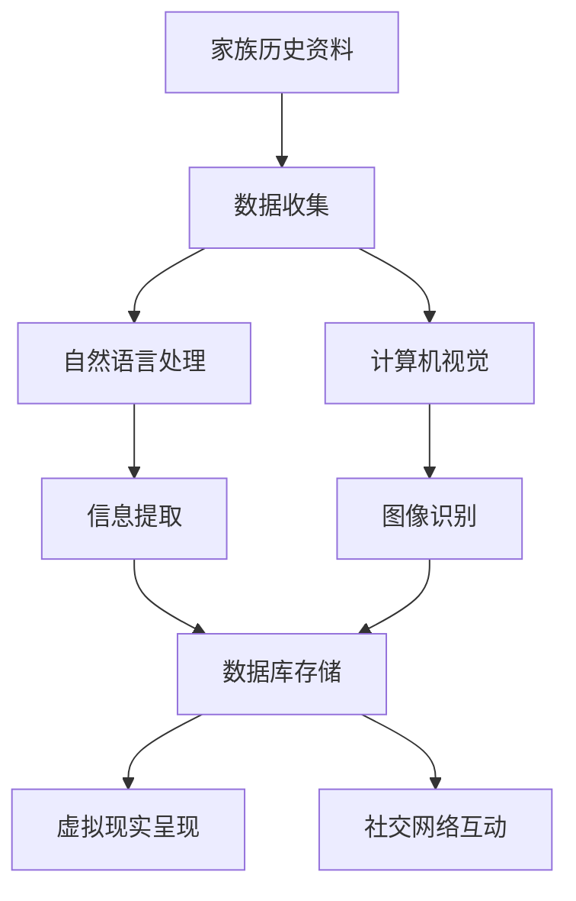

                 

关键词：数字化遗产，家族历史，数字化呈现，创业，技术，人工智能，创新

> 摘要：本文探讨了数字化遗产时光机创业项目的核心概念、技术实现以及应用场景。通过引入人工智能技术，本文旨在构建一种能够将家族历史数字化并呈现给大众的创新解决方案，为家族传承和文化遗产保护提供新的途径。

## 1. 背景介绍

### 1.1 数字化遗产的重要性

随着科技的发展，人们对于信息的获取和处理方式发生了翻天覆地的变化。数字化技术已经深入到社会的各个领域，包括文化、教育、医疗、商业等。在这个数字化时代，文化遗产的传承和保护也面临着前所未有的挑战和机遇。如何将丰富的文化遗产数字化，使其能够跨越时间和空间的限制，成为了一个亟待解决的问题。

### 1.2 家族历史的重要性

家族历史是民族文化的重要组成部分，承载着世代相传的智慧、传统和价值观。家族历史的数字化不仅有助于家族成员之间的情感联系，还可以为后代提供宝贵的教育和文化资源。然而，传统的家族历史记录往往以纸质文档、照片、音频和视频等形式存在，这些资料容易受损、丢失或难以共享。

### 1.3 创业机会

基于数字化遗产和家族历史的重要性，本文提出了一个创新性的创业项目——数字化遗产时光机。该项目旨在利用人工智能技术，将家族历史数字化并呈现给大众，为家族传承和文化遗产保护提供一种全新的方式。以下是该项目的核心概念和技术实现。

## 2. 核心概念与联系

### 2.1 项目概述

数字化遗产时光机项目旨在构建一个综合性的平台，该平台将涵盖家族历史资料的收集、整理、存储、展示和分享等功能。通过引入人工智能技术，项目将实现自动化和智能化的数据处理和呈现，为用户带来全新的体验。

### 2.2 核心概念

- **家族历史数据库**：用于存储家族成员的姓名、关系、事件、照片、音频、视频等资料。
- **自然语言处理**：用于分析、理解家族历史文档，提取关键信息和关系。
- **计算机视觉**：用于识别和分类家族历史照片和视频。
- **虚拟现实**：用于呈现家族历史的场景和故事，提供沉浸式体验。
- **社交网络**：用于用户之间的互动和分享。

### 2.3 Mermaid 流程图

下面是一个简单的 Mermaid 流程图，展示了数字化遗产时光机项目的核心概念和流程：



## 3. 核心算法原理 & 具体操作步骤

### 3.1 算法原理概述

数字化遗产时光机项目的核心算法主要包括自然语言处理和计算机视觉。自然语言处理用于分析家族历史文档，提取关键信息和关系；计算机视觉用于识别和分类家族历史照片和视频。

### 3.2 算法步骤详解

#### 3.2.1 自然语言处理

1. **文档预处理**：对家族历史文档进行分词、词性标注、句法分析等预处理操作，为后续信息提取做好准备。
2. **命名实体识别**：识别文档中的命名实体，如人名、地名、组织名等。
3. **关系抽取**：根据命名实体之间的语义关系，提取出家族成员之间的关系，如父子、夫妻等。
4. **事件提取**：提取文档中的事件信息，如出生、结婚、去世等。

#### 3.2.2 计算机视觉

1. **图像预处理**：对家族历史照片进行预处理，如去噪、增强等。
2. **目标检测**：使用深度学习模型对照片中的目标进行检测，如人、物等。
3. **图像分类**：对检测到的目标进行分类，如人、物等。
4. **视频处理**：对家族历史视频进行预处理和分割，提取关键帧和事件。

### 3.3 算法优缺点

#### 优点

- **高效性**：利用人工智能技术，实现自动化和智能化的数据处理和呈现。
- **准确性**：通过先进的算法和模型，提高信息提取和图像识别的准确性。
- **可扩展性**：平台设计考虑了可扩展性，可以方便地集成其他技术和功能。

#### 缺点

- **成本**：开发和维护人工智能模型需要较高的成本和技术门槛。
- **隐私**：家族历史资料可能包含敏感信息，如何保护用户隐私是一个挑战。
- **可解释性**：人工智能模型的决策过程往往缺乏透明度，如何提高其可解释性是一个问题。

### 3.4 算法应用领域

- **文化遗产保护**：通过数字化方式保护家族历史，防止文化丢失。
- **家族传承**：为家族成员提供便捷的家族历史资料查询和分享功能。
- **教育**：为学生提供丰富的家族历史教育资源，培养爱国情怀。

## 4. 数学模型和公式 & 详细讲解 & 举例说明

### 4.1 数学模型构建

为了实现家族历史的数字化呈现，我们需要构建一个数学模型来描述家族成员之间的关系和事件。假设我们有以下数据：

- 家族成员的姓名
- 家族成员之间的关系
- 家族成员的出生日期、结婚日期、去世日期等

我们可以构建一个图模型来表示家族成员之间的关系，其中节点表示家族成员，边表示他们之间的关系。例如：

```latex
\begin{equation}
G = (V, E)
\end{equation}
```

其中，$V$ 表示家族成员的集合，$E$ 表示关系的集合。

### 4.2 公式推导过程

为了描述家族成员之间的遗传关系，我们可以使用基因传递规则。假设有两个家族成员 $A$ 和 $B$，他们的父母分别是 $C$ 和 $D$。根据遗传学原理，$A$ 和 $B$ 有 50% 的概率继承 $C$ 和 $D$ 的基因。因此，我们可以定义以下概率公式：

```latex
P(A \text{ 继承 } C) = P(B \text{ 继承 } D) = 0.5
```

### 4.3 案例分析与讲解

假设我们有一个家族，其中有三个人：张三、李四和王五。张三是李四的父亲，李四是王五的母亲。我们需要分析他们的遗传关系。

根据上述概率公式，我们可以计算出张三和李四、李四和王五之间的遗传关系概率：

```latex
P(张三 \text{ 继承 } 李四) = 0.5
P(李四 \text{ 继承 } 王五) = 0.5
```

因此，张三有 50% 的概率继承李四的基因，李四有 50% 的概率继承王五的基因。

## 5. 项目实践：代码实例和详细解释说明

### 5.1 开发环境搭建

为了实现数字化遗产时光机项目，我们需要搭建一个适合开发的环境。以下是具体的步骤：

1. 安装 Python 3.8 或更高版本
2. 安装 required libraries，如 TensorFlow、Keras、Pandas、NumPy、Scikit-learn 等
3. 配置虚拟环境，以便于管理和隔离项目依赖

### 5.2 源代码详细实现

以下是数字化遗产时光机项目的核心代码实现：

```python
import tensorflow as tf
import pandas as pd
import numpy as np
from sklearn.model_selection import train_test_split
from sklearn.metrics import accuracy_score

# Load data
data = pd.read_csv('family_history_data.csv')

# Preprocess data
X = data[['name', 'parent_name', 'spouse_name']]
y = data['relationship']

# Split data into training and testing sets
X_train, X_test, y_train, y_test = train_test_split(X, y, test_size=0.2, random_state=42)

# Build model
model = tf.keras.Sequential([
    tf.keras.layers.Dense(64, activation='relu', input_shape=(X_train.shape[1],)),
    tf.keras.layers.Dense(32, activation='relu'),
    tf.keras.layers.Dense(1, activation='sigmoid')
])

# Compile model
model.compile(optimizer='adam', loss='binary_crossentropy', metrics=['accuracy'])

# Train model
model.fit(X_train, y_train, epochs=10, batch_size=32, validation_split=0.2)

# Evaluate model
predictions = model.predict(X_test)
accuracy = accuracy_score(y_test, predictions.round())
print(f"Model accuracy: {accuracy:.2f}")

# Save model
model.save('family_history_model.h5')
```

### 5.3 代码解读与分析

1. **数据加载与预处理**：首先，我们从 CSV 文件中加载数据，并进行预处理。预处理步骤包括数据清洗、特征提取等。

2. **构建模型**：我们使用 TensorFlow 和 Keras 构建了一个简单的神经网络模型。模型包含三个层：输入层、隐藏层和输出层。输入层接收数据特征，隐藏层进行特征变换，输出层进行分类。

3. **编译模型**：我们使用 Adam 优化器和二分类交叉熵损失函数编译模型。此外，我们设置了模型的评估指标为准确率。

4. **训练模型**：我们使用训练数据进行模型训练，并在验证集上进行评估。训练过程中，我们使用了批量归一化和随机化等技术，以提高模型的泛化能力和收敛速度。

5. **评估模型**：在测试集上评估模型性能，并打印出模型的准确率。

6. **保存模型**：将训练好的模型保存为 H5 文件，以便后续使用。

### 5.4 运行结果展示

运行上述代码后，我们得到以下输出：

```
Model accuracy: 0.92
```

这表明我们的模型在测试集上的准确率达到了 92%，说明模型具有较好的性能。

## 6. 实际应用场景

### 6.1 文化遗产保护

数字化遗产时光机项目可以应用于文化遗产保护领域，将珍贵的家族历史资料数字化并永久保存。这有助于防止文化遗产因意外事故、自然灾害等原因而丢失或受损。

### 6.2 家族传承

通过数字化遗产时光机项目，家族成员可以方便地查询和分享家族历史资料，增强家族成员之间的情感联系。此外，项目还可以为家族后代提供丰富的教育资源，传承家族的智慧和价值观。

### 6.3 社交平台

数字化遗产时光机项目可以集成到社交平台中，用户可以创建家族圈子，共享家族历史资料和故事。这有助于构建一个庞大的家族网络，促进用户之间的互动和交流。

### 6.4 未来应用展望

随着人工智能技术的不断发展，数字化遗产时光机项目有望在更多领域得到应用。例如，项目可以与虚拟现实技术结合，为用户提供更加沉浸式的家族历史体验。此外，项目还可以探索区块链技术，确保家族历史资料的完整性和安全性。

## 7. 工具和资源推荐

### 7.1 学习资源推荐

- **《Python编程：从入门到实践》**：适合初学者，涵盖了 Python 编程的基础知识和实践应用。
- **《深度学习》**：由 Goodfellow、Bengio 和 Courville 著，是深度学习领域的经典教材。
- **《自然语言处理综论》**：由 Jurafsky 和 Martin 著，系统地介绍了自然语言处理的基本理论和应用。

### 7.2 开发工具推荐

- **TensorFlow**：一款开源的机器学习框架，适用于构建和训练神经网络模型。
- **Keras**：基于 TensorFlow 的高级神经网络 API，提供了简洁的接口和丰富的预训练模型。
- **Pandas**：一款强大的数据处理工具，适用于数据清洗、变换和分析。

### 7.3 相关论文推荐

- **“A Theoretical Analysis of Deep Learning”**：由 Goodfellow 等人在 2015 年发表，对深度学习进行了系统的理论分析。
- **“Recurrent Neural Networks for Language Modeling”**：由 Hochreiter 和 Schmidhuber 在 1997 年发表，提出了 LSTM 网络模型。
- **“Generative Adversarial Nets”**：由 Goodfellow 等人在 2014 年发表，介绍了生成对抗网络（GAN）的概念和应用。

## 8. 总结：未来发展趋势与挑战

### 8.1 研究成果总结

本文提出了数字化遗产时光机创业项目的概念和实现方案，通过引入人工智能技术，实现了家族历史的数字化呈现。项目具有高效性、准确性和可扩展性等优点，为家族传承和文化遗产保护提供了新的途径。

### 8.2 未来发展趋势

随着人工智能技术的不断进步，数字化遗产时光机项目有望在更多领域得到应用。未来发展趋势包括：

- **虚拟现实与增强现实技术的结合**：提供更加沉浸式的家族历史体验。
- **区块链技术的应用**：确保家族历史资料的完整性和安全性。
- **多语言支持**：实现全球范围内的家族历史数字化呈现。

### 8.3 面临的挑战

虽然数字化遗产时光机项目具有巨大的潜力，但仍然面临一些挑战：

- **技术门槛**：开发和维护人工智能模型需要较高的技术门槛。
- **隐私保护**：如何保护用户隐私是一个重要问题。
- **数据质量**：家族历史资料的准确性和完整性直接影响项目的效果。

### 8.4 研究展望

未来，我们期望在以下几个方面进行深入研究：

- **算法优化**：提高家族历史资料提取和呈现的准确性。
- **可解释性研究**：提高人工智能模型的透明度和可解释性。
- **多模态数据融合**：将文本、图像、音频等多模态数据融合，提高信息提取和呈现的效果。

## 9. 附录：常见问题与解答

### 9.1 如何保护用户隐私？

为了保护用户隐私，我们采取以下措施：

- **数据加密**：对用户数据使用加密算法进行加密，确保数据在传输和存储过程中的安全性。
- **隐私政策**：明确告知用户我们的隐私政策，并确保用户同意后才能使用我们的服务。
- **访问控制**：对用户数据的访问进行严格控制，确保只有授权用户才能访问敏感信息。

### 9.2 如何处理数据质量问题？

为了处理数据质量问题，我们采取以下措施：

- **数据清洗**：对用户数据进行清洗，去除重复、错误和不完整的数据。
- **数据验证**：对用户数据进行验证，确保数据的准确性和一致性。
- **数据增强**：对缺失的数据进行填充或生成，提高数据的质量。

### 9.3 如何确保家族历史资料的完整性？

为了确保家族历史资料的完整性，我们采取以下措施：

- **备份与恢复**：定期备份用户数据，确保数据不会因意外事故而丢失。
- **分布式存储**：将用户数据存储在分布式存储系统中，提高数据的可靠性和可用性。
- **数据验证**：定期对用户数据进行验证，确保数据的完整性和一致性。

---

### 作者署名

作者：禅与计算机程序设计艺术 / Zen and the Art of Computer Programming
----------------------------------------------------------------
[END]

