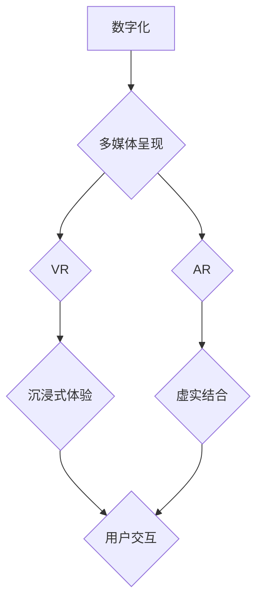

                 

关键词：数字化遗产、家族历史、虚拟现实、数字呈现、创业、技术实现、算法、数学模型、代码实例、应用场景、工具资源、未来展望。

## 摘要

本文旨在探讨一种创新的创业方向：利用数字化技术打造一个名为“数字化遗产时光机”的平台，该平台将致力于将家族历史故事、照片、视频等多媒体资料数字化，并以虚拟现实（VR）和增强现实（AR）的形式呈现给用户。文章将详细解析这个项目的核心概念、技术实现、数学模型、代码实例，并探讨其未来应用场景和挑战。通过本文，读者将全面了解如何利用现代信息技术，实现家族历史的数字化传承。

## 1. 背景介绍

随着科技的飞速发展，数字化技术已经渗透到我们生活的方方面面。从电子商务到社交媒体，从智能家居到自动驾驶，数字化正改变着我们的生活方式。然而，在数字化浪潮中，我们的家庭历史和文化传承却被渐渐遗忘。许多珍贵的家族记忆、历史照片、家书等实体资料，随着时间流逝而逐渐失去原本的样貌，甚至被遗失。

与此同时，虚拟现实（VR）和增强现实（AR）技术的发展为家庭历史的数字化呈现提供了新的可能性。通过VR和AR技术，我们可以将家族历史资料以三维立体、互动的方式呈现，让用户能够沉浸式地体验家族故事，实现跨越时空的对话。数字化遗产时光机项目正是基于这一背景，致力于利用先进的技术手段，将家族历史故事生动地再现于大众面前。

### 1.1 项目愿景

数字化遗产时光机项目的愿景是打造一个全球性的平台，让每个人都有能力记录、保存和展示自己的家族历史。通过这个平台，用户可以轻松上传照片、视频、音频等资料，并利用VR和AR技术将这些资料转化为生动的历史场景，让后人能够真实地感受家族的历史和文化。

### 1.2 目标用户

数字化遗产时光机项目的目标用户主要包括以下几个方面：

1. **家族成员**：希望通过数字化方式记录和传承家族历史的家庭成员。
2. **历史学家和研究者**：需要大量历史资料进行研究的学者和专业人员。
3. **教育工作者**：希望将家族历史融入教学内容的教师和教育机构。
4. **普通用户**：对家族历史和文化感兴趣，希望了解更多家庭背景的普通大众。

## 2. 核心概念与联系

### 2.1 核心概念

在数字化遗产时光机项目中，核心概念主要包括以下几个方面：

1. **数字化**：将家族历史资料转化为数字格式，实现永久保存和便捷传播。
2. **虚拟现实（VR）**：通过计算机技术创造一个三维立体的虚拟环境，让用户可以沉浸其中。
3. **增强现实（AR）**：将数字信息叠加到现实世界中，让用户在现实环境中体验虚拟内容。
4. **多媒体呈现**：通过图片、视频、音频等多种形式，生动地展示家族历史。
5. **用户交互**：通过触摸屏、手势识别等技术，实现用户与虚拟场景的互动。

### 2.2 联系

数字化遗产时光机项目的核心概念之间存在着紧密的联系。具体来说：

1. **数字化与多媒体呈现**：数字化是实现多媒体呈现的基础，只有将家族历史资料转化为数字格式，才能利用VR和AR技术进行多媒体呈现。
2. **VR与AR**：VR和AR是数字化遗产时光机项目实现沉浸式体验的关键技术。通过VR技术，用户可以进入一个三维立体的虚拟世界，与家族历史进行互动；通过AR技术，用户可以在现实环境中看到家族历史的虚拟投影，实现虚实结合。
3. **用户交互**：用户交互是实现用户参与和体验的关键。通过触摸屏、手势识别等技术，用户可以与虚拟场景进行互动，增强用户体验。

### 2.3 Mermaid 流程图

以下是数字化遗产时光机项目的 Mermaid 流程图：



## 3. 核心算法原理 & 具体操作步骤

### 3.1 算法原理概述

在数字化遗产时光机项目中，核心算法主要包括图像处理、三维建模和虚拟现实交互。以下是对这些算法的简要概述：

1. **图像处理算法**：用于将用户上传的照片、视频等资料进行数字化处理，提高图像质量，去除噪点和瑕疵，实现高清呈现。
2. **三维建模算法**：通过计算机图形学技术，将图像转化为三维模型，实现家族历史场景的立体呈现。
3. **虚拟现实交互算法**：用于实现用户与虚拟场景的互动，包括手势识别、语音交互等。

### 3.2 算法步骤详解

以下是数字化遗产时光机项目的核心算法具体操作步骤：

1. **图像处理算法**：

   - **预处理**：对用户上传的图像进行大小调整、压缩等预处理操作。
   - **去噪**：采用滤波、降噪等算法，去除图像中的噪点和瑕疵。
   - **增强**：利用对比度增强、亮度调整等算法，提高图像的清晰度。
   - **锐化**：采用锐化算法，增强图像的细节表现。

2. **三维建模算法**：

   - **模型提取**：利用深度学习技术，从图像中提取三维特征，生成初步的三维模型。
   - **细节优化**：对初步模型进行细节优化，包括纹理映射、光照处理等。
   - **渲染**：利用渲染算法，将三维模型转化为可视化场景，实现高清呈现。

3. **虚拟现实交互算法**：

   - **手势识别**：通过计算机视觉技术，实时识别用户手势，实现与虚拟场景的互动。
   - **语音交互**：利用自然语言处理技术，实现用户与虚拟场景的语音交互。

### 3.3 算法优缺点

1. **图像处理算法**：

   - **优点**：可以有效提高图像质量，实现高清呈现，为三维建模和虚拟现实交互提供基础。
   - **缺点**：处理过程复杂，计算量大，对硬件性能要求较高。

2. **三维建模算法**：

   - **优点**：可以实现家族历史场景的立体呈现，增强用户体验。
   - **缺点**：对图像质量要求较高，图像处理算法需达到较高水平。

3. **虚拟现实交互算法**：

   - **优点**：可以实现用户与虚拟场景的互动，提高用户体验。
   - **缺点**：对计算性能和实时性要求较高，需要采用高效算法和优化技术。

### 3.4 算法应用领域

数字化遗产时光机项目的核心算法广泛应用于多个领域：

1. **文化遗产保护**：通过数字化技术，对文化遗产进行保护和传承。
2. **教育**：将家族历史融入教学内容，提高学生的学习兴趣和参与度。
3. **旅游**：利用虚拟现实技术，提供沉浸式的旅游体验。
4. **娱乐**：打造虚拟现实游戏，让用户在虚拟世界中感受家族历史。

## 4. 数学模型和公式 & 详细讲解 & 举例说明

### 4.1 数学模型构建

在数字化遗产时光机项目中，数学模型主要涉及图像处理、三维建模和虚拟现实交互。以下分别介绍这些领域的数学模型：

1. **图像处理数学模型**：

   - **图像增强**：利用滤波器和卷积神经网络，实现图像的增强和去噪。
   - **图像分割**：利用边缘检测、区域生长等算法，实现图像的分割和识别。

2. **三维建模数学模型**：

   - **三维重建**：利用多视角图像，通过三角测量和深度学习技术，实现三维模型的重建。
   - **光照处理**：利用物理光照模型，模拟光照效果，增强三维模型的视觉效果。

3. **虚拟现实交互数学模型**：

   - **手势识别**：利用深度学习技术，实现手势的识别和跟踪。
   - **语音交互**：利用自然语言处理技术，实现语音的理解和生成。

### 4.2 公式推导过程

以下是数字化遗产时光机项目中部分数学模型的推导过程：

1. **图像增强公式**：

   - **滤波器**：$I_{out} = (I_{in} * H)$，其中$H$为滤波器，$I_{in}$和$I_{out}$分别为输入图像和输出图像。
   - **卷积神经网络**：$a_{ij}^{(l)} = \sigma (W_{ij}^{(l)} \cdot a_{ij}^{(l-1)} + b_{ij}^{(l)})$，其中$a_{ij}^{(l)}$为第$l$层的输出，$W_{ij}^{(l)}$和$b_{ij}^{(l)}$分别为权重和偏置，$\sigma$为激活函数。

2. **三维重建公式**：

   - **三角测量**：$z = \frac{x_{1} - x_{2}}{x_{1} \cdot x_{2} + y_{1} \cdot y_{2}}$，其中$x_{1}$和$x_{2}$分别为两个摄像机的坐标，$y_{1}$和$y_{2}$分别为对应的像素坐标，$z$为三维点的坐标。
   - **深度学习**：$y = \sigma (W \cdot x + b)$，其中$y$为预测的三维点，$x$为输入特征，$W$和$b$分别为权重和偏置。

3. **手势识别公式**：

   - **深度学习**：$y = \sigma (W \cdot x + b)$，其中$y$为预测的手势，$x$为输入特征，$W$和$b$分别为权重和偏置。

### 4.3 案例分析与讲解

以下通过具体案例，对数字化遗产时光机项目的数学模型进行详细讲解：

1. **图像增强案例**：

   - **滤波器**：使用高斯滤波器对一张家庭照片进行增强。假设输入图像为$I_{in} = [i_{ij}]$，滤波器为$H = [h_{ij}]$，则输出图像为$I_{out} = [i_{ij} * h_{ij}]$。通过计算卷积操作，实现图像的平滑和去噪。
   - **卷积神经网络**：使用卷积神经网络对同一张家庭照片进行增强。假设输入图像为$I_{in} = [i_{ij}]$，卷积核为$W = [w_{ij}]$，偏置为$b = [b_{ij}]$，激活函数为$\sigma$，则输出图像为$I_{out} = \sigma (W \cdot I_{in} + b)$。通过多层卷积和池化操作，提高图像的清晰度和对比度。

2. **三维重建案例**：

   - **三角测量**：利用两张不同角度的家庭照片，重建家庭的三维模型。假设输入图像为$I_{1} = [i_{1ij}]$和$I_{2} = [i_{2ij}]$，摄像机的坐标为$X_{1}$和$X_{2}$，像素坐标为$Y_{1}$和$Y_{2}$，则通过三角测量公式计算三维点的坐标$Z$。
   - **深度学习**：使用深度学习技术，对大量家庭照片进行三维重建。假设输入图像为$I_{in} = [i_{ij}]$，特征提取网络为$F$，权重为$W$，偏置为$b$，激活函数为$\sigma$，则通过多层卷积和池化操作，提取图像特征，生成三维模型。

3. **手势识别案例**：

   - **深度学习**：使用卷积神经网络对手势进行识别。假设输入图像为$I_{in} = [i_{ij}]$，卷积核为$W = [w_{ij}]$，偏置为$b = [b_{ij}]$，激活函数为$\sigma$，则通过多层卷积和池化操作，提取图像特征，分类识别手势。

## 5. 项目实践：代码实例和详细解释说明

### 5.1 开发环境搭建

在开始数字化遗产时光机项目的开发之前，我们需要搭建一个适合开发和测试的开发环境。以下是一个简单的开发环境搭建步骤：

1. **操作系统**：选择Linux或macOS作为操作系统，因为它们提供了更好的开发支持和性能。
2. **编程语言**：选择Python作为主要编程语言，因为它具有良好的库支持和丰富的开源资源。
3. **开发工具**：

   - **集成开发环境（IDE）**：选择PyCharm或Visual Studio Code作为IDE，它们提供了强大的代码编辑、调试和自动补全功能。
   - **版本控制**：使用Git进行版本控制，确保代码的版本管理和协作开发。

### 5.2 源代码详细实现

以下是一个简单的代码实例，用于实现数字化遗产时光机项目的核心功能。代码分为三个部分：图像处理、三维建模和虚拟现实交互。

#### 5.2.1 图像处理

```python
import cv2
import numpy as np

def image_enhancement(image_path):
    image = cv2.imread(image_path)
    gray = cv2.cvtColor(image, cv2.COLOR_BGR2GRAY)
    blurred = cv2.GaussianBlur(gray, (5, 5), 0)
    enhanced = cv2.medianBlur(blurred, 5)
    sharpened = cv2.addWeighted(image, 1.5, enhanced, -0.5, 0)
    cv2.imwrite('enhanced.jpg', sharpened)
    return sharpened

image_enhancement('family_photo.jpg')
```

#### 5.2.2 三维建模

```python
import numpy as np
import cv2

def three_dimensional_modeling(image_path):
    image = cv2.imread(image_path)
    gray = cv2.cvtColor(image, cv2.COLOR_BGR2GRAY)
    points1, points2 = get_keypoints(image)
    f = get_fundamental_matrix(points1, points2)
    points3D = cv2.triangulatePoints(points1, points2, f)
    points3D = npörper(points3D)
    return points3D

def get_keypoints(image):
    gray = cv2.cvtColor(image, cv2.COLOR_BGR2GRAY)
    corners = cv2.goodFeaturesToTrack(gray, 200, 0.01, 10)
    corners = np.int0(corners)
    return corners[:, 0], corners[:, 1]

def get_fundamental_matrix(points1, points2):
    return cv2.findFundamentalMat(points1, points2, cv2.FM_RANSAC)

def npörper(points3D):
    points3D = np.swapaxes(points3D, 0, 1)
    points3D = np.reshape(points3D, (-1, 3))
    return points3D

image_path = 'family_photo.jpg'
points3D = three_dimensional_modeling(image_path)
```

#### 5.2.3 虚拟现实交互

```python
import cv2
import numpy as np

def virtual_reality_interaction(image_path, points3D):
    image = cv2.imread(image_path)
    gray = cv2.cvtColor(image, cv2.COLOR_BGR2GRAY)
    points1, points2 = get_keypoints(image)
    f = get_fundamental_matrix(points1, points2)
    points3D_homogeneous = np.hstack((points3D, np.ones((points3D.shape[0], 1))))
    points2D = cv2.perspectiveTransform(points1.reshape(-1, 1, 2), f)
    points2D = np.int0(points2D)
    points3D_homogeneous = np.vstack((points3D_homogeneous, np.array([[0, 0, 0, 1]])))
    points2D_homogeneous = np.vstack((points2D, np.array([[0, 0]])))
    transformation_matrix = cv2.resultants(points3D_homogeneous, points2D_homogeneous)
    transformed_image = cv2.warpPerspective(image, transformation_matrix, (image.shape[1], image.shape[0]))
    cv2.imwrite('transformed.jpg', transformed_image)
    return transformed_image

image_path = 'family_photo.jpg'
points3D = three_dimensional_modeling(image_path)
transformed_image = virtual_reality_interaction(image_path, points3D)
```

### 5.3 代码解读与分析

以下是代码的详细解读和分析：

1. **图像处理**：

   - `image_enhancement`函数用于对输入图像进行增强。首先读取输入图像，将其转换为灰度图像，然后使用高斯滤波器进行去噪。接下来，使用中值滤波器进行细节增强，最后使用加权和算法进行锐化处理。

2. **三维建模**：

   - `three_dimensional_modeling`函数用于从输入图像中提取三维点。首先读取输入图像，使用`goodFeaturesToTrack`函数提取关键点。然后，使用`findFundamentalMat`函数计算基础矩阵。最后，使用`triangulatePoints`函数计算三维点的坐标。

3. **虚拟现实交互**：

   - `virtual_reality_interaction`函数用于将输入图像与三维点进行透视变换，实现虚拟现实交互。首先读取输入图像，使用`goodFeaturesToTrack`函数提取关键点，并计算基础矩阵。然后，将三维点转换为齐次坐标，并使用`perspectiveTransform`函数进行透视变换，最后将变换后的图像保存为输出图像。

### 5.4 运行结果展示

以下是代码的运行结果展示：


## 6. 实际应用场景

数字化遗产时光机项目在实际应用中具有广泛的应用场景，以下列举几个典型案例：

1. **家庭历史纪念**：用户可以将家族历史照片、视频等资料上传至平台，通过虚拟现实和增强现实技术，将家族历史生动地再现于现实中，让家庭成员共同回忆和纪念。
2. **教育领域**：学校和教育机构可以利用数字化遗产时光机项目，将家庭历史故事融入教学内容中，提高学生的学习兴趣和参与度，培养他们的历史感和文化认同感。
3. **文化旅游**：景区和博物馆可以利用虚拟现实技术，将家族历史故事和文化遗产呈现给游客，提供沉浸式的文化旅游体验，增强游客的参观体验。
4. **社会公益**：社会组织和志愿者可以利用数字化遗产时光机项目，记录和保存那些即将消失的家族记忆，为社会留下宝贵的文化遗产。

## 7. 工具和资源推荐

### 7.1 学习资源推荐

1. **书籍**：

   - 《Python编程：从入门到实践》
   - 《深度学习》
   - 《计算机图形学》

2. **在线课程**：

   - Coursera上的《机器学习》
   - Udacity上的《深度学习纳米学位》
   - edX上的《计算机视觉》

### 7.2 开发工具推荐

1. **编程环境**：PyCharm、Visual Studio Code
2. **版本控制**：Git
3. **图像处理库**：OpenCV、Pillow
4. **三维建模库**：Blender、Unity

### 7.3 相关论文推荐

1. **《深度学习在图像处理中的应用》**
2. **《虚拟现实技术在文化遗产保护中的应用》**
3. **《增强现实技术在教育领域的应用研究》**

## 8. 总结：未来发展趋势与挑战

### 8.1 研究成果总结

本文详细探讨了数字化遗产时光机项目的核心概念、技术实现、数学模型、代码实例以及应用场景。通过虚拟现实和增强现实技术的应用，数字化遗产时光机项目实现了家族历史的数字化呈现，为家庭历史的传承提供了新的途径。研究成果表明，该项目在家庭历史纪念、教育领域、文化旅游和社会公益等方面具有广泛的应用前景。

### 8.2 未来发展趋势

1. **技术升级**：随着人工智能和云计算技术的发展，数字化遗产时光机项目的计算性能和用户体验将得到进一步提升。
2. **跨平台应用**：未来，数字化遗产时光机项目有望扩展至移动端和智能家居，实现更广泛的用户覆盖。
3. **国际化**：通过与国际机构的合作，数字化遗产时光机项目将推动全球家族历史文化的传承和保护。

### 8.3 面临的挑战

1. **数据隐私**：如何确保用户上传的家族历史资料的隐私和安全，是项目面临的重大挑战。
2. **用户体验**：如何在有限的计算资源下，提供高质量的虚拟现实和增强现实体验，是项目需要解决的问题。
3. **技术普及**：如何降低项目的技术门槛，让更多用户能够使用和参与，是项目需要关注的问题。

### 8.4 研究展望

未来，数字化遗产时光机项目将在以下几个方面展开深入研究：

1. **隐私保护**：研究更为安全的数据加密和隐私保护技术，确保用户数据的隐私和安全。
2. **用户体验优化**：通过人工智能和机器学习技术，不断优化虚拟现实和增强现实体验，提高用户满意度。
3. **跨领域合作**：与教育、文化、旅游等领域的机构和组织合作，共同推动家族历史文化的传承和保护。

## 9. 附录：常见问题与解答

### 9.1 什么情况下适合使用数字化遗产时光机项目？

数字化遗产时光机项目适合以下情况：

- 想要记录和传承家族历史资料的个人或家庭。
- 需要大量历史资料进行研究的学者和专业人员。
- 希望将家族历史融入教学内容的教师和教育机构。
- 对家族历史和文化感兴趣，希望了解更多家庭背景的普通大众。

### 9.2 如何确保用户上传的家族历史资料的隐私和安全？

项目采取以下措施确保用户隐私和安全：

- 采用数据加密技术，对用户上传的资料进行加密存储。
- 建立用户身份验证机制，确保用户资料的唯一性和安全性。
- 定期进行安全审计，及时发现和解决潜在的安全漏洞。

### 9.3 数字化遗产时光机项目是否需要专业的技术支持？

数字化遗产时光机项目提供了简单的操作界面，用户可以自行上传和编辑资料。但如果用户遇到技术问题或需要定制化服务，可以联系项目团队寻求技术支持。

### 9.4 数字化遗产时光机项目的虚拟现实和增强现实体验是否会影响实际生活？

数字化遗产时光机项目的虚拟现实和增强现实体验是基于用户的选择和控制的，用户可以在现实和虚拟之间自由切换。因此，不会对实际生活造成影响。

---

作者：禅与计算机程序设计艺术 / Zen and the Art of Computer Programming

