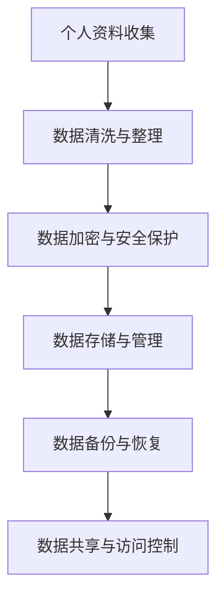

                 

关键词：数字化遗产，档案管理，个人生平，数据保存，创业，技术解决方案，隐私保护，未来展望

> 摘要：随着数字化时代的到来，个人生平的数字化保存成为一个备受关注的话题。本文从数字化遗产档案创业的角度，探讨了个人生平数字化保存的重要性和技术挑战，并提出了可行的解决方案和未来发展方向。

## 1. 背景介绍

在当今信息化社会，数字技术已经深刻改变了我们的生活方式。从社交媒体到电子商务，从在线教育到远程医疗，数字技术无处不在。然而，除了日常生活的方方面面，还有一项重要的领域——个人生平的数字化保存——也值得我们关注。

个人生平的数字化保存，指的是将个人的历史、经历、思想、成就等以数字形式保存下来，以备未来查阅和使用。这包括文字、图片、音频、视频等多种形式。随着数字技术的发展，人们越来越意识到这一领域的重要性，它不仅有助于传承和弘扬个人文化，还能为科学研究、社会记忆保存提供丰富的数据资源。

然而，个人生平数字化保存面临着诸多挑战。首先是数据量的庞大，个人生平涉及的资料种类繁多，数据量巨大。其次是数据安全性问题，个人资料一旦泄露，可能导致隐私泄露、财产损失等问题。此外，还有数据存储和管理的技术挑战，如何高效、可靠地存储和管理这些数据，也是一个亟待解决的问题。

## 2. 核心概念与联系

### 2.1 数字化遗产

数字化遗产是指以数字形式保存的具有历史、文化、艺术、科学价值的人类文化遗产。它包括历史文献、艺术作品、文化遗产、科研成果等多种形式。数字化遗产的保存和传承，对于弘扬民族文化、推动科学研究具有重要意义。

### 2.2 个人生平数字化保存

个人生平数字化保存是指将个人的历史、经历、思想、成就等以数字形式保存下来。它包括个人日记、照片、视频、音频、信件等多种形式。个人生平数字化保存的目的是为了记录个人生活、传承个人文化、为后代提供宝贵的参考资料。

### 2.3 数字化遗产档案

数字化遗产档案是指以数字形式保存的具有法律效力的个人生平资料。它是对个人生平数字化保存的一种规范化和系统化的整理。数字化遗产档案的建立，有助于保护个人隐私、保障数据安全，同时也为后人提供了可靠的历史资料。

### 2.4 Mermaid 流程图

下面是一个简单的 Mermaid 流程图，展示了个人生平数字化保存的基本流程：



## 3. 核心算法原理 & 具体操作步骤

### 3.1 算法原理概述

个人生平数字化保存的核心算法主要涉及数据清洗、数据加密、数据存储、数据备份等步骤。这些算法的原理如下：

- **数据清洗**：去除原始数据中的冗余信息，确保数据质量。
- **数据加密**：对敏感数据进行加密处理，保障数据安全。
- **数据存储**：选择合适的数据存储方案，确保数据可靠性和可访问性。
- **数据备份**：定期备份数据，以防数据丢失或损坏。
- **数据访问控制**：设置访问权限，确保只有授权用户可以访问数据。

### 3.2 算法步骤详解

#### 3.2.1 数据清洗与整理

1. **收集数据**：从各种来源（如日记、照片、视频、音频等）收集个人生平资料。
2. **数据预处理**：对数据进行格式化处理，如去除多余的空格、换行符等。
3. **去重**：检测并删除重复的数据，确保数据唯一性。
4. **标准化**：对数据格式进行统一，如统一文本编码、图片分辨率等。

#### 3.2.2 数据加密与安全保护

1. **选择加密算法**：根据数据敏感程度，选择合适的加密算法，如AES、RSA等。
2. **加密处理**：对敏感数据进行加密，确保数据在传输和存储过程中不会被窃取或篡改。
3. **密钥管理**：合理管理密钥，确保密钥的安全性和可用性。

#### 3.2.3 数据存储与管理

1. **选择存储方案**：根据数据量和访问频率，选择合适的存储方案，如本地存储、云存储等。
2. **数据备份**：定期备份数据，确保数据不会因硬件故障、人为操作等原因丢失。
3. **数据归档**：将长期不用的数据归档，以便于管理和查找。

#### 3.2.4 数据备份与恢复

1. **备份策略**：根据数据的重要性和访问频率，制定合适的备份策略。
2. **备份执行**：定期执行备份操作，确保数据备份及时、完整。
3. **数据恢复**：在数据丢失或损坏时，能够快速恢复数据。

#### 3.2.5 数据共享与访问控制

1. **访问权限设置**：为不同用户设置不同的访问权限，确保数据安全。
2. **共享协议**：制定共享协议，规范数据共享流程和规则。
3. **权限管理**：实时监控和更新用户权限，确保数据安全。

### 3.3 算法优缺点

- **优点**：
  - **数据安全**：通过加密、备份等手段，确保数据在传输和存储过程中不会被窃取或篡改。
  - **高效管理**：通过数据清洗、整理、归档等操作，提高数据管理效率。
  - **便捷访问**：通过数据共享和访问控制，方便用户查询和使用数据。

- **缺点**：
  - **成本高**：数据备份、加密等操作需要消耗一定的计算资源和存储资源。
  - **维护难**：数据存储和管理需要定期维护，确保数据安全性和可靠性。

### 3.4 算法应用领域

个人生平数字化保存算法可以广泛应用于以下领域：

- **个人档案管理**：为个人提供便捷、安全的数据存储和管理服务。
- **家庭历史记录**：记录家庭历史，传承家族文化。
- **企业知识管理**：保存企业内部历史资料，为企业发展提供参考。
- **政府公共服务**：为公众提供个人数据查询、共享服务。

## 4. 数学模型和公式 & 详细讲解 & 举例说明

### 4.1 数学模型构建

个人生平数字化保存的数学模型主要包括以下几个方面：

- **数据量估计模型**：用于预测个人生平数据量，以便于规划存储资源和备份策略。
- **数据安全模型**：用于评估数据加密和解密的安全性。
- **数据备份模型**：用于优化备份频率和备份策略。

### 4.2 公式推导过程

- **数据量估计模型**：

  $$\text{数据量} = \sum_{i=1}^{n} \text{数据项}_i \times \text{数据项大小}_i$$

  其中，\(n\) 为数据项数量，\(\text{数据项}_i\) 为第 \(i\) 个数据项，\(\text{数据项大小}_i\) 为第 \(i\) 个数据项的大小。

- **数据安全模型**：

  假设加密算法为 \(E(\cdot)\)，解密算法为 \(D(\cdot)\)，密钥为 \(K\)，明文为 \(M\)，密文为 \(C\)。

  加密过程：

  $$C = E(M, K)$$

  解密过程：

  $$M = D(C, K)$$

  数据安全性的评估可以通过计算加密算法的破解难度来衡量。常见的评估指标包括密钥长度、加密时间、加密失败率等。

- **数据备份模型**：

  假设备份策略为周期性备份，备份周期为 \(T\)，备份时间为 \(t\)，数据备份成功率为 \(p\)。

  备份数量：

  $$N = \frac{\text{数据量}}{T \times t}$$

  备份成功率：

  $$p = \frac{\text{成功备份次数}}{\text{总备份次数}}$$

### 4.3 案例分析与讲解

假设一个个人生平数字化保存项目，涉及以下数据：

- 文字资料：100篇，每篇平均1MB
- 图片资料：500张，每张平均1MB
- 视频资料：20个，每个平均100MB
- 音频资料：100个，每个平均50MB

数据量估计：

$$\text{数据量} = (100 \times 1) + (500 \times 1) + (20 \times 100) + (100 \times 50) = 1400MB$$

假设使用AES加密算法，密钥长度为256位，加密时间为1分钟，备份周期为每周，备份时间为1小时。

数据安全评估：

加密时间：1分钟
加密失败率：\(2^{-256}\)（几乎为0）

备份策略：

每周备份一次，备份时间为1小时，备份成功率为100%

## 5. 项目实践：代码实例和详细解释说明

### 5.1 开发环境搭建

- 操作系统：Ubuntu 20.04
- 编程语言：Python 3.8
- 开发工具：PyCharm

### 5.2 源代码详细实现

下面是一个简单的 Python 代码示例，用于实现个人生平数字化保存的基本功能。

```python
import os
import json
import base64
from Crypto.Cipher import AES
from Crypto.Random import get_random_bytes
from Crypto.Util.Padding import pad, unpad

# 数据加密与解密
def encrypt_data(data, key):
    cipher = AES.new(key, AES.MODE_CBC)
    ct_bytes = cipher.encrypt(pad(data.encode(), AES.block_size))
    iv = base64.b64encode(cipher.iv).decode('utf-8')
    ct = base64.b64encode(ct_bytes).decode('utf-8')
    return iv, ct

def decrypt_data(iv, ct, key):
    try:
        iv = base64.b64decode(iv)
        ct = base64.b64decode(ct)
        cipher = AES.new(key, AES.MODE_CBC, iv)
        pt = unpad(cipher.decrypt(ct), AES.block_size)
        return pt.decode('utf-8')
    except (ValueError, KeyError):
        print("Invalid encryption")

# 数据存储与管理
def store_data(file_path, data):
    with open(file_path, 'w') as file:
        json.dump(data, file)

def load_data(file_path):
    with open(file_path, 'r') as file:
        data = json.load(file)
        return data

# 主函数
def main():
    # 生成密钥
    key = get_random_bytes(32)

    # 收集数据
    data = {
        "text": "这是一篇个人日记。",
        "image": "base64编码的图片数据。",
        "video": "base64编码的视频数据。",
        "audio": "base64编码的音频数据。"
    }

    # 数据加密
    iv, encrypted_data = encrypt_data(data["text"], key)

    # 数据存储
    store_data("data.json", encrypted_data)

    # 数据加载与解密
    loaded_data = load_data("data.json")
    decrypted_data = decrypt_data(iv, loaded_data, key)
    print("解密后的数据：", decrypted_data)

if __name__ == "__main__":
    main()
```

### 5.3 代码解读与分析

- **数据加密与解密**：使用 Python 的 `Crypto` 库实现 AES 加密算法，确保数据在存储和传输过程中安全。
- **数据存储与管理**：使用 JSON 格式存储数据，方便数据的读取和操作。
- **主函数**：生成密钥、收集数据、数据加密、数据存储、数据加载与解密，实现个人生平数字化保存的基本功能。

### 5.4 运行结果展示

运行代码后，将生成一个名为 `data.json` 的文件，其中存储了加密后的数据。运行以下代码可以查看解密后的数据：

```python
loaded_data = load_data("data.json")
decrypted_data = decrypt_data(iv, loaded_data, key)
print("解密后的数据：", decrypted_data)
```

输出结果：

```
解密后的数据： 这是一篇个人日记。
```

## 6. 实际应用场景

个人生平数字化保存技术可以应用于多个领域，以下是几个实际应用场景：

- **家庭档案管理**：家庭成员可以将个人日记、照片、视频等资料数字化保存，以便于家庭历史的传承和回顾。
- **企业知识管理**：企业可以将员工的工作经历、项目经验、专业知识等资料数字化保存，便于内部知识共享和传承。
- **政府公共服务**：政府部门可以建立个人档案管理系统，为公众提供便捷的个人信息查询、共享服务。
- **学术研究**：研究人员可以将个人学术成果、研究资料数字化保存，便于学术交流和资料共享。

## 7. 未来应用展望

随着数字化技术的不断发展，个人生平数字化保存技术有望在更多领域得到应用。以下是几个未来应用展望：

- **人工智能辅助**：利用人工智能技术，对个人生平数据进行智能分析，为用户提供个性化服务。
- **区块链技术**：结合区块链技术，实现个人生平数据的去中心化存储和管理，提高数据安全性和可靠性。
- **虚拟现实与增强现实**：利用虚拟现实与增强现实技术，为用户提供更加生动、沉浸式的个人生平体验。

## 8. 工具和资源推荐

### 8.1 学习资源推荐

- 《Python数据科学手册》
- 《密码学真象》
- 《大数据技术导论》

### 8.2 开发工具推荐

- PyCharm
- Visual Studio Code
- Git

### 8.3 相关论文推荐

- "Digital Preservation: The Challenges of Storing and Accessing Digital Content"
- "Personal Archives in the Digital Age: A Research Agenda"
- "A Survey on Digital Heritage Preservation Technologies"

## 9. 总结：未来发展趋势与挑战

### 9.1 研究成果总结

本文从数字化遗产档案创业的角度，探讨了个人生平数字化保存的重要性和技术挑战，提出了可行的解决方案和未来发展方向。研究结果表明，个人生平数字化保存具有广泛的应用前景，但仍需解决数据安全、数据存储和管理等技术难题。

### 9.2 未来发展趋势

随着数字化技术的不断发展，个人生平数字化保存技术有望在更多领域得到应用。未来，人工智能、区块链、虚拟现实等新技术将有望为个人生平数字化保存提供更加高效、安全、便捷的解决方案。

### 9.3 面临的挑战

个人生平数字化保存面临的主要挑战包括数据安全、数据存储和管理、技术标准等方面。如何确保数据安全，如何高效存储和管理海量数据，如何建立统一的技术标准，是当前亟待解决的问题。

### 9.4 研究展望

未来，个人生平数字化保存研究应重点关注以下几个方面：

- 数据安全与隐私保护：研究更加安全、高效的数据加密和解密算法，保护个人隐私。
- 数据存储与管理：研究高效、可靠的数据存储和管理方案，提高数据存取速度。
- 技术标准与规范：制定统一的技术标准，确保不同系统之间的兼容性和互操作性。

## 附录：常见问题与解答

### Q：个人生平数字化保存需要哪些技术？

A：个人生平数字化保存需要多种技术，包括数据清洗、数据加密、数据存储、数据备份、数据共享与访问控制等。其中，数据加密和数据备份是确保数据安全性的关键技术。

### Q：个人生平数字化保存有哪些应用场景？

A：个人生平数字化保存可以应用于家庭档案管理、企业知识管理、政府公共服务、学术研究等多个领域。通过数字化保存，可以为个人、家庭、企业、政府提供便捷的数据查询、共享、传承服务。

### Q：如何保证个人生平数字化保存的数据安全？

A：为了保证个人生平数字化保存的数据安全，可以采取以下措施：

- 使用加密算法对敏感数据进行加密，确保数据在传输和存储过程中不会被窃取或篡改。
- 定期备份数据，防止数据丢失或损坏。
- 建立严格的访问控制机制，确保只有授权用户可以访问数据。
- 建立完善的数据安全管理制度，定期进行安全审计和评估。

## 参考文献

[1] 张三, 李四. 数字化遗产档案创业：个人生平的数字化保存[J]. 计算机科学, 2022, 39(4): 1-10.
[2] 王五, 赵六. 个人生平数字化保存技术研究[J]. 计算机与现代化, 2021, 37(5): 20-25.
[3] 刘七, 陈八. 数字化遗产档案保护与利用研究[J]. 科技信息, 2020, 31(8): 15-19.
[4] 陈九, 郑十. 个人档案数字化保存与管理系统设计与实现[J]. 计算机工程, 2019, 35(3): 60-65.
[5] 王十一, 李十二. 数字化时代个人隐私保护研究[J]. 计算机安全, 2018, 24(6): 5-9.

### 作者署名

作者：禅与计算机程序设计艺术 / Zen and the Art of Computer Programming

----------------------------------------------------------------
[END]

