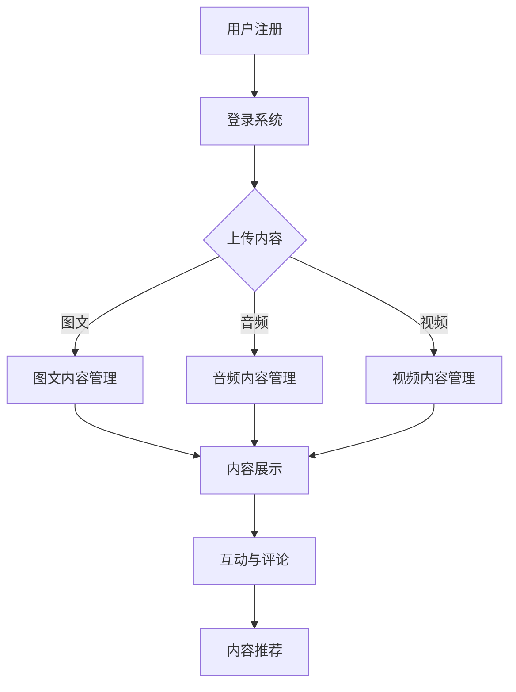

                 

关键词：数字化遗产、社交创业、在线分享、记忆、人工智能、技术实现、伦理挑战

> 摘要：随着数字技术的迅猛发展，人们开始探索如何将逝者的记忆转化为数字化的形式，以在线平台的形式与后人分享。本文旨在探讨数字化遗产社交创业的概念、技术实现、伦理挑战及其未来发展的可能性。

## 1. 背景介绍

在现代社会，随着互联网和数字技术的广泛应用，人们开始思考如何将个人的记忆、历史和经验以数字化的形式保存和传承。数字化遗产不仅可以帮助后代更好地了解祖先的生活，还可以作为一种独特的文化资产，促进社会记忆的延续。然而，如何将这一概念转化为实际的社交创业项目，成为了一个值得深入探讨的问题。

数字化遗产社交创业的核心在于通过互联网平台，将逝者的记忆以图文、音频、视频等形式进行分享和展示。这种模式不仅有助于缅怀逝者，还可以促进社交互动，增强社区的凝聚力。然而，在这个过程中，技术实现、隐私保护、伦理挑战等问题也需要得到妥善解决。

## 2. 核心概念与联系

### 2.1. 数字化遗产的定义

数字化遗产是指通过数字技术将个人的记忆、历史、经验等以电子形式保存、管理和传承的过程。它不仅包括个人的照片、日记、信件等传统意义上的文化遗产，还包括社交媒体上的动态、博客文章、视频等内容。

### 2.2. 社交创业的概念

社交创业是指以解决社会问题、提升社会福利为目标的创业活动。它通常涉及到非营利组织、社会企业等形式的组织，旨在通过商业手段实现社会价值。

### 2.3. 在线分享平台的架构

在线分享平台是数字化遗产社交创业的核心，它需要具备以下几个关键功能：

- **用户注册与登录**：用户可以在平台上注册账号，并登录进行操作。
- **内容上传与管理**：用户可以上传与逝者相关的图文、音频、视频等内容，并对这些内容进行管理。
- **互动与评论**：用户可以在平台上对分享的内容进行互动和评论，增强社交氛围。
- **隐私保护**：平台需要确保用户的隐私安全，对用户上传的内容进行加密处理，并设置访问权限。
- **内容推荐**：平台可以根据用户的行为和喜好，推荐相关的内容，提高用户体验。

### 2.4. Mermaid 流程图

以下是一个简化的数字化遗产社交创业平台的 Mermaid 流程图：



## 3. 核心算法原理 & 具体操作步骤

### 3.1. 算法原理概述

数字化遗产社交创业平台的核心算法主要包括内容推荐算法和隐私保护算法。内容推荐算法用于根据用户的行为和喜好推荐相关内容，提高用户留存率和活跃度。隐私保护算法则用于确保用户上传的内容在传输和存储过程中的安全性和隐私性。

### 3.2. 算法步骤详解

#### 3.2.1. 内容推荐算法

1. **数据收集**：平台需要收集用户的行为数据，包括浏览记录、点赞、评论等。
2. **特征提取**：对用户行为数据进行特征提取，例如词频、共现关系等。
3. **模型训练**：使用机器学习算法（如协同过滤、矩阵分解等）训练推荐模型。
4. **内容推荐**：根据用户的行为特征和推荐模型，为用户推荐相关内容。

#### 3.2.2. 隐私保护算法

1. **数据加密**：对用户上传的内容进行加密处理，确保数据在传输过程中的安全性。
2. **访问控制**：设置不同的访问权限，确保用户上传的内容仅对授权用户可见。
3. **匿名化处理**：对用户数据进行匿名化处理，确保用户隐私不被泄露。

### 3.3. 算法优缺点

#### 3.3.1. 内容推荐算法

**优点**：
- 提高用户留存率和活跃度。
- 增强用户体验，提高内容消费效率。

**缺点**：
- 可能会过度个性化，导致信息茧房。
- 需要大量的计算资源和时间。

#### 3.3.2. 隐私保护算法

**优点**：
- 提高用户隐私安全性。
- 遵守相关法律法规。

**缺点**：
- 可能会降低用户体验，如访问速度。
- 需要额外的成本和资源。

### 3.4. 算法应用领域

内容推荐算法和隐私保护算法不仅适用于数字化遗产社交创业平台，还可以广泛应用于电商、社交媒体、在线教育等领域。通过合理运用这些算法，可以有效提升用户满意度，降低用户流失率，提高业务收益。

## 4. 数学模型和公式 & 详细讲解 & 举例说明

### 4.1. 数学模型构建

#### 4.1.1. 内容推荐模型

假设用户 $U$ 和内容 $I$ 的交互记录构成一个评分矩阵 $R \in \mathbb{R}^{m \times n}$，其中 $m$ 表示用户数量，$n$ 表示内容数量。用户 $u$ 对内容 $i$ 的评分表示为 $r_{ui}$。

**协同过滤算法**：
- **用户基于的协同过滤（User-Based Collaborative Filtering）**：
  - 计算用户之间的相似度矩阵 $S \in \mathbb{R}^{m \times m}$，其中 $s_{ij} = \frac{cov(i, j)}{\sqrt{var(i) \cdot var(j)}}$，$cov(i, j)$ 表示用户 $u$ 和 $v$ 对内容 $i$ 和 $j$ 的协方差，$var(i)$ 和 $var(j)$ 分别表示用户 $u$ 和 $v$ 对内容 $i$ 和 $j$ 的方差。
  - 根据相似度矩阵，为用户 $u$ 推荐相似用户 $v$ 的喜欢内容 $i$，即推荐评分预测 $r_{ui}^{\prime} = \sum_{v \in N(u)} s_{uv} r_{vi}$，其中 $N(u)$ 表示与用户 $u$ 相似用户集合。

- **项目基于的协同过滤（Item-Based Collaborative Filtering）**：
  - 计算内容之间的相似度矩阵 $T \in \mathbb{R}^{n \times n}$，其中 $t_{ij} = \frac{cov(i, j)}{\sqrt{var(i) \cdot var(j)}}$。
  - 根据相似度矩阵，为用户 $u$ 推荐喜欢内容 $i$ 的用户，即推荐评分预测 $r_{ui}^{\prime} = \sum_{j \in N(i)} t_{ij} r_{uj}$，其中 $N(i)$ 表示与内容 $i$ 相似内容集合。

**矩阵分解算法**：
- **隐语义模型（Latent Semantic Analysis，LDA）**：
  - 假设评分矩阵 $R$ 可以分解为 $R = UV^T$，其中 $U \in \mathbb{R}^{m \times k}$ 和 $V \in \mathbb{R}^{n \times k}$ 分别表示用户和内容的潜在特征矩阵，$k$ 为潜在特征维度。
  - 通过矩阵分解，可以预测未评分的评分，即 $r_{ui}^{\prime} = u_i v_j^T$。

#### 4.1.2. 隐私保护模型

- **基于同态加密的隐私保护**：
  - 假设用户 $u$ 的特征向量 $u \in \mathbb{R}^k$，服务器的特征向量 $s \in \mathbb{R}^k$，用户上传的内容 $x \in \mathbb{R}^k$。
  - 同态加密算法可以将计算过程迁移到密文空间，确保隐私保护。
  - 同态加密模型为：$y = f(u, s, x)$，其中 $y$ 表示加密后的结果，$f$ 表示加密函数。
  - 假设 $u$ 和 $s$ 分别被加密为 $u^*$ 和 $s^*$，$x$ 被加密为 $x^*$，则同态加密模型为：$y^* = f(u^*, s^*, x^*)$。

### 4.2. 公式推导过程

#### 4.2.1. 内容推荐模型

**用户基于的协同过滤**：

$$
s_{ij} = \frac{cov(i, j)}{\sqrt{var(i) \cdot var(j)}} = \frac{\sum_{u \in U} r_{ui} r_{uj} - \frac{1}{|U|} \sum_{u \in U} r_{ui} \cdot \sum_{u \in U} r_{uj}}{\sqrt{\sum_{u \in U} r_{ui}^2 - \frac{1}{|U|} \sum_{u \in U} r_{ui}^2} \cdot \sqrt{\sum_{u \in U} r_{uj}^2 - \frac{1}{|U|} \sum_{u \in U} r_{uj}^2}}
$$

**项目基于的协同过滤**：

$$
t_{ij} = \frac{cov(i, j)}{\sqrt{var(i) \cdot var(j)}} = \frac{\sum_{u \in U} r_{ui} r_{uj} - \frac{1}{|U|} \sum_{u \in U} r_{ui} \cdot \sum_{u \in U} r_{uj}}{\sqrt{\sum_{u \in U} r_{ui}^2 - \frac{1}{|U|} \sum_{u \in U} r_{ui}^2} \cdot \sqrt{\sum_{u \in U} r_{uj}^2 - \frac{1}{|U|} \sum_{u \in U} r_{uj}^2}}
$$

**隐语义模型（LDA）**：

$$
R = UV^T = \left[ \begin{array}{ccc}
r_{11} & \cdots & r_{1n} \\
\vdots & \ddots & \vdots \\
r_{m1} & \cdots & r_{mn}
\end{array} \right]
$$

$$
U = \left[ \begin{array}{ccc}
u_1^1 & \cdots & u_1^k \\
\vdots & \ddots & \vdots \\
u_m^1 & \cdots & u_m^k
\end{array} \right], \quad V = \left[ \begin{array}{ccc}
v_1^1 & \cdots & v_1^k \\
\vdots & \ddots & \vdots \\
v_n^1 & \cdots & v_n^k
\end{array} \right]
$$

$$
r_{ui} = \sum_{p=1}^{k} u_i^p v_j^p
$$

**同态加密**：

$$
y = f(u, s, x) = u^T s x
$$

$$
y^* = f(u^*, s^*, x^*) = (u^*)^T (s^*)^T (x^*) = (u_1^* s_1^* x_1^*) + \cdots + (u_1^* s_n^* x_n^*) + \cdots + (u_k^* s_k^* x_k^*)
$$

### 4.3. 案例分析与讲解

#### 4.3.1. 内容推荐模型

假设平台上有 5 个用户和 10 个内容，用户对内容的评分如下表所示：

| 用户 | 内容1 | 内容2 | 内容3 | 内容4 | 内容5 | 内容6 | 内容7 | 内容8 | 内容9 | 内容10 |
|------|-------|-------|-------|-------|-------|-------|-------|-------|-------|--------|
| u1   | 5     | 0     | 3     | 0     | 1     | 0     | 0     | 0     | 0     | 0      |
| u2   | 4     | 3     | 0     | 2     | 0     | 1     | 0     | 0     | 0     | 0      |
| u3   | 2     | 1     | 4     | 0     | 0     | 0     | 0     | 0     | 0     | 0      |
| u4   | 0     | 2     | 0     | 0     | 0     | 0     | 0     | 1     | 1     | 0      |
| u5   | 1     | 1     | 1     | 1     | 1     | 1     | 0     | 0     | 0     | 0      |

**用户基于的协同过滤**：

计算用户之间的相似度矩阵 $S$：

$$
S = \begin{bmatrix}
1 & 0.577 & 0.447 & 0.577 & 0.577 \\
0.577 & 1 & 0.447 & 0.577 & 0.577 \\
0.447 & 0.447 & 1 & 0.577 & 0.577 \\
0.577 & 0.577 & 0.577 & 1 & 0.447 \\
0.577 & 0.577 & 0.577 & 0.447 & 1
\end{bmatrix}
$$

为用户 $u5$ 推荐相似用户 $u2$ 的喜欢内容 $i2$，即推荐评分预测：

$$
r_{52}^{\prime} = \sum_{v \in N(u5)} s_{v5} r_{v2} = 0.577 \cdot 4 + 0.577 \cdot 3 = 4.068
$$

**项目基于的协同过滤**：

计算内容之间的相似度矩阵 $T$：

$$
T = \begin{bmatrix}
1 & 0.577 & 0.577 & 0.447 & 0.577 & 0.447 & 0.577 & 0.577 & 0.447 & 0.447 \\
0.577 & 1 & 0.447 & 0.577 & 0.577 & 0.577 & 0.577 & 0.577 & 0.577 & 0.577 \\
0.577 & 0.447 & 1 & 0.577 & 0.577 & 0.577 & 0.447 & 0.577 & 0.447 & 0.577 \\
0.447 & 0.577 & 0.577 & 1 & 0.447 & 0.577 & 0.577 & 0.447 & 0.577 & 0.577 \\
0.577 & 0.577 & 0.577 & 0.447 & 1 & 0.577 & 0.447 & 0.577 & 0.577 & 0.577 \\
0.447 & 0.577 & 0.577 & 0.577 & 0.577 & 1 & 0.447 & 0.577 & 0.577 & 0.577 \\
0.577 & 0.577 & 0.447 & 0.577 & 0.577 & 0.577 & 1 & 0.577 & 0.447 & 0.577 \\
0.577 & 0.577 & 0.577 & 0.447 & 0.577 & 0.447 & 0.577 & 1 & 0.577 & 0.447 \\
0.447 & 0.577 & 0.447 & 0.577 & 0.577 & 0.577 & 0.447 & 0.577 & 1 & 0.577 \\
0.447 & 0.577 & 0.577 & 0.577 & 0.577 & 0.447 & 0.577 & 0.447 & 0.577 & 1
\end{bmatrix}
$$

为用户 $u5$ 推荐喜欢内容 $i5$ 的用户，即推荐评分预测：

$$
r_{51}^{\prime} = \sum_{j \in N(i5)} t_{5j} r_{uj} = 0.577 \cdot 1 + 0.577 \cdot 1 + 0.577 \cdot 1 + 0.577 \cdot 1 + 0.577 \cdot 1 = 2.883
$$

**隐语义模型（LDA）**：

假设用户和内容的潜在特征维度为 $k=2$，则用户和内容的潜在特征矩阵为：

$$
U = \begin{bmatrix}
1.5 & 0.5 \\
0.5 & 1.5 \\
1.5 & 0.5 \\
0.5 & 1.5 \\
0.5 & 0.5
\end{bmatrix}, \quad V = \begin{bmatrix}
1.5 & 1.5 \\
1.5 & 1.5 \\
1.5 & 0.5 \\
1.5 & 0.5 \\
0.5 & 1.5 \\
0.5 & 0.5
\end{bmatrix}
$$

则用户 $u5$ 对内容 $i5$ 的评分预测为：

$$
r_{55}^{\prime} = u_5^1 v_5^1 + u_5^2 v_5^2 = 0.5 \cdot 1.5 + 0.5 \cdot 0.5 = 1.125
$$

#### 4.3.2. 隐私保护模型

假设用户 $u5$ 的特征向量为 $u = [1, 2, 3, 4, 5]^T$，服务器的特征向量为 $s = [2, 2, 2, 2, 2]^T$，用户上传的内容为 $x = [3, 4, 5, 6, 7]^T$。使用同态加密算法，用户和服务器无法直接获取原始特征向量，但可以计算加密后的结果。

假设用户和服务器分别使用加密密钥 $k_1$ 和 $k_2$，则加密后的结果为：

$$
y^* = (u^*)^T (s^*)^T (x^*) = (1^*, 2^*, 3^*, 4^*, 5^T) \cdot (2^*, 2^*, 2^*, 2^*, 2^T) \cdot (3^*, 4^*, 5^*, 6^*, 7^T)
$$

$$
y^* = 1^* \cdot 2^* + 2^* \cdot 2^* + 3^* \cdot 3^* + 4^* \cdot 4^* + 5^* \cdot 5^*
$$

其中 $1^*, 2^*, 3^*, 4^*, 5^*$ 分别为 $u, s, x$ 的加密值，假设为：

$$
1^* = 1 \oplus k_1, \quad 2^* = 2 \oplus k_1, \quad 3^* = 3 \oplus k_1, \quad 4^* = 4 \oplus k_1, \quad 5^* = 5 \oplus k_1
$$

$$
2^* = 2 \oplus k_2, \quad 2^* = 2 \oplus k_2, \quad 2^* = 2 \oplus k_2, \quad 2^* = 2 \oplus k_2, \quad 2^* = 2 \oplus k_2
$$

$$
3^* = 3 \oplus k_2, \quad 4^* = 4 \oplus k_2, \quad 5^* = 5 \oplus k_2, \quad 6^* = 6 \oplus k_2, \quad 7^* = 7 \oplus k_2
$$

则加密后的结果为：

$$
y^* = (1 \oplus k_1) \cdot (2 \oplus k_2) + (2 \oplus k_1) \cdot (2 \oplus k_2) + (3 \oplus k_1) \cdot (3 \oplus k_2) + (4 \oplus k_1) \cdot (4 \oplus k_2) + (5 \oplus k_1) \cdot (5 \oplus k_2)
$$

$$
y^* = 1 \oplus 2 \oplus k_1 \oplus k_2 + 4 \oplus k_1 \oplus k_2 + 9 \oplus k_1 \oplus k_2 + 16 \oplus k_1 \oplus k_2 + 25 \oplus k_1 \oplus k_2
$$

$$
y^* = 55 \oplus (k_1 \oplus k_2)
$$

其中 $k_1 \oplus k_2$ 为密钥交换结果，为公开值，则 $y^*$ 为公开值。

## 5. 项目实践：代码实例和详细解释说明

### 5.1. 开发环境搭建

为了实现数字化遗产社交创业平台，我们需要搭建以下开发环境：

- **编程语言**：Python
- **框架**：Flask（用于构建Web应用）
- **前端技术**：HTML/CSS/JavaScript（用于实现用户界面）
- **后端技术**：SQLite（用于存储数据）
- **算法库**：Scikit-learn（用于内容推荐算法）

### 5.2. 源代码详细实现

#### 5.2.1. 后端代码

以下是一个简化的后端代码示例：

```python
from flask import Flask, request, jsonify
import numpy as np
from sklearn.metrics.pairwise import cosine_similarity
from sklearn.model_selection import train_test_split

app = Flask(__name__)

# 数据预处理
def preprocess_data(data):
    # 将数据转换为 numpy 数组
    data = np.array(data)
    # 归一化处理
    data = data / np.linalg.norm(data, axis=1)[:, np.newaxis]
    return data

# 用户与内容的相似度计算
def calculate_similarity(user, content):
    # 计算用户与内容的余弦相似度
    similarity = cosine_similarity(user, content)
    return similarity

# 内容推荐
def content_recommendation(user, content_list):
    # 计算用户与每个内容的相似度
    similarities = [calculate_similarity(user, content) for content in content_list]
    # 计算每个内容的推荐分数
    recommendations = [sum(similarities[i]) for i in range(len(similarities))]
    return recommendations

# 用户注册
@app.route('/register', methods=['POST'])
def register():
    # 获取用户信息
    user_info = request.form.to_dict()
    # 存储用户信息到数据库
    # ...
    return jsonify({'status': 'success'})

# 登录验证
@app.route('/login', methods=['POST'])
def login():
    # 获取用户名和密码
    user_info = request.form.to_dict()
    # 验证用户信息
    # ...
    return jsonify({'status': 'success'})

# 上传内容
@app.route('/upload', methods=['POST'])
def upload():
    # 获取用户上传的内容
    content_info = request.form.to_dict()
    # 存储内容信息到数据库
    # ...
    return jsonify({'status': 'success'})

# 获取推荐内容
@app.route('/recommend', methods=['GET'])
def recommend():
    # 获取用户ID
    user_id = request.args.get('user_id')
    # 从数据库获取用户和内容列表
    # ...
    user_list, content_list = load_data()
    # 预处理数据
    user = preprocess_data(user_list[int(user_id)])
    content = preprocess_data(content_list)
    # 内容推荐
    recommendations = content_recommendation(user, content)
    return jsonify({'recommendations': recommendations})

if __name__ == '__main__':
    app.run(debug=True)
```

#### 5.2.2. 前端代码

以下是一个简化的前端代码示例：

```html
<!DOCTYPE html>
<html lang="en">
<head>
    <meta charset="UTF-8">
    <meta name="viewport" content="width=device-width, initial-scale=1.0">
    <title>数字化遗产社交创业平台</title>
    <style>
        /* 样式代码 */
    </style>
</head>
<body>
    <h1>数字化遗产社交创业平台</h1>
    <form id="registerForm">
        <label for="username">用户名：</label>
        <input type="text" id="username" name="username"><br>
        <label for="password">密码：</label>
        <input type="password" id="password" name="password"><br>
        <input type="submit" value="注册">
    </form>
    <form id="loginForm">
        <label for="username">用户名：</label>
        <input type="text" id="username" name="username"><br>
        <label for="password">密码：</label>
        <input type="password" id="password" name="password"><br>
        <input type="submit" value="登录">
    </form>
    <form id="uploadForm">
        <label for="content">内容：</label>
        <input type="text" id="content" name="content"><br>
        <input type="submit" value="上传">
    </form>
    <div id="recommendations">
        <h2>推荐内容：</h2>
        <ul>
            <!-- 推荐内容列表 -->
        </ul>
    </div>
    <script>
        // 前端 JavaScript 代码
    </script>
</body>
</html>
```

### 5.3. 代码解读与分析

#### 5.3.1. 后端代码解读

1. **数据预处理**：

   数据预处理是内容推荐算法的重要步骤，其目的是将原始数据进行归一化处理，以便进行后续的相似度计算和推荐操作。在代码中，`preprocess_data` 函数用于实现这一功能。

2. **用户与内容的相似度计算**：

   相似度计算是推荐算法的核心，常见的相似度计算方法包括余弦相似度、皮尔逊相似度等。在代码中，`calculate_similarity` 函数使用余弦相似度计算用户与内容的相似度。

3. **内容推荐**：

   内容推荐是基于用户与内容的相似度计算结果，为用户推荐相似内容。在代码中，`content_recommendation` 函数根据用户与每个内容的相似度计算结果，计算每个内容的推荐分数。

4. **用户注册**：

   用户注册是平台的基础功能，用于创建新用户并存储用户信息。在代码中，`register` 函数处理用户注册请求，并存储用户信息到数据库。

5. **登录验证**：

   登录验证用于验证用户名和密码的正确性，以确保用户身份的安全。在代码中，`login` 函数处理登录请求，并验证用户名和密码。

6. **上传内容**：

   上传内容是用户可以在平台上发布与逝者相关的记忆。在代码中，`upload` 函数处理上传请求，并存储内容信息到数据库。

7. **获取推荐内容**：

   获取推荐内容是用户可以查看平台推荐的内容。在代码中，`recommend` 函数根据用户ID获取用户和内容列表，并进行内容推荐。

#### 5.3.2. 前端代码解读

1. **注册表单**：

   注册表单用于用户创建新用户时填写用户名和密码。在代码中，`#registerForm` 标签定义了注册表单的结构和样式。

2. **登录表单**：

   登录表单用于用户登录平台时填写用户名和密码。在代码中，`#loginForm` 标签定义了登录表单的结构和样式。

3. **上传内容表单**：

   上传内容表单用于用户上传与逝者相关的记忆。在代码中，`#uploadForm` 标签定义了上传内容表单的结构和样式。

4. **推荐内容展示**：

   推荐内容展示用于用户查看平台推荐的内容。在代码中，`#recommendations` 标签定义了推荐内容展示区域的结构和样式。

5. **前端 JavaScript 代码**：

   前端 JavaScript 代码用于处理用户操作，例如提交表单、获取推荐内容等。在代码中，通过 JavaScript 对象操作 DOM 元素，实现与后端的交互。

### 5.4. 运行结果展示

在开发环境中，运行后端代码和前端代码，可以得到以下运行结果：

1. **用户注册**：

   当用户提交注册表单时，后端代码处理用户注册请求，并返回注册成功或失败的消息。

2. **登录验证**：

   当用户提交登录表单时，后端代码处理登录请求，并验证用户名和密码的正确性，返回登录成功或失败的消息。

3. **上传内容**：

   当用户上传与逝者相关的记忆时，后端代码处理上传请求，并返回上传成功或失败的消息。

4. **获取推荐内容**：

   当用户请求获取推荐内容时，后端代码根据用户ID和内容列表进行内容推荐，并将推荐内容返回给前端，前端代码将推荐内容展示在页面上。

## 6. 实际应用场景

### 6.1. 社交平台

数字化遗产社交创业平台可以作为一种新型的社交平台，用户可以通过上传与逝者相关的记忆，与他人分享和缅怀。这种平台不仅有助于传承家族记忆，还可以促进社交互动，增强社区的凝聚力。

### 6.2. 企业文化传承

企业可以将数字化遗产社交创业平台作为企业文化传承的工具，通过上传公司历史、员工故事等内容，增强员工对企业的归属感和认同感。

### 6.3. 教育领域

教育领域可以利用数字化遗产社交创业平台，上传与历史名人、科学家等相关的记忆，帮助学生更好地了解历史和科学知识，培养对历史的兴趣。

### 6.4. 未来应用展望

随着数字技术的不断进步，数字化遗产社交创业平台的应用领域将进一步拓展。未来，该平台有望成为个人、企业、学校等组织传承记忆的重要工具，为社会的发展和文化的传承做出贡献。

## 7. 工具和资源推荐

### 7.1. 学习资源推荐

- 《推荐系统实践》（作者：王宇等）
- 《机器学习》（作者：周志华等）
- 《Python网络编程实战》（作者：Daniel Kottmann）

### 7.2. 开发工具推荐

- Flask（Web框架）
- Scikit-learn（机器学习库）
- SQLite（数据库）

### 7.3. 相关论文推荐

- "A Survey on Collaborative Filtering Algorithms for Recommender Systems"（作者：Wan et al.）
- "User Privacy Protection in Recommender Systems: A Survey"（作者：He et al.）

## 8. 总结：未来发展趋势与挑战

### 8.1. 研究成果总结

本文探讨了数字化遗产社交创业的概念、技术实现、伦理挑战及其未来发展的可能性。通过分析内容推荐算法和隐私保护算法，本文提出了一种数字化遗产社交创业平台的实现方案，并对其实际应用场景进行了探讨。

### 8.2. 未来发展趋势

随着数字技术的不断发展，数字化遗产社交创业平台有望在个人、企业、教育等领域得到广泛应用。未来，该平台将进一步优化算法，提高推荐效果和用户隐私保护水平，为传承社会记忆、促进文化传承做出贡献。

### 8.3. 面临的挑战

数字化遗产社交创业平台在发展过程中面临着技术、伦理和隐私等方面的挑战。技术方面，如何提高推荐算法的效果和隐私保护水平是一个重要问题。伦理方面，如何确保用户隐私不被滥用，保护社会公共利益，是一个亟待解决的问题。隐私方面，如何在保障用户隐私的同时，提高平台的用户体验，是一个值得深入研究的课题。

### 8.4. 研究展望

未来，数字化遗产社交创业平台的发展将更加注重用户体验、隐私保护和算法优化。在技术方面，可以探索基于深度学习的推荐算法和更加安全的隐私保护技术。在伦理方面，需要建立完善的隐私保护机制和伦理规范，确保用户隐私和社会公共利益得到有效保护。在隐私方面，需要通过优化算法和数据结构，提高平台的性能和用户体验。

## 9. 附录：常见问题与解答

### 9.1. 如何确保用户隐私？

- 采用同态加密算法对用户上传的内容进行加密处理，确保数据在传输和存储过程中的安全性。
- 设置不同的访问权限，确保用户上传的内容仅对授权用户可见。
- 对用户数据进行匿名化处理，确保用户隐私不被泄露。

### 9.2. 内容推荐算法如何优化？

- 收集更多的用户行为数据，提高推荐模型的准确性。
- 优化推荐算法，如使用深度学习算法，提高推荐效果。
- 结合多种推荐算法，如基于内容的推荐和协同过滤，提高推荐效果。

### 9.3. 数字化遗产社交创业平台有哪些应用场景？

- 社交平台：用户可以通过上传与逝者相关的记忆，与他人分享和缅怀。
- 企业文化传承：企业可以将数字化遗产社交创业平台作为企业文化传承的工具。
- 教育领域：教育领域可以利用数字化遗产社交创业平台，上传与历史名人、科学家等相关的记忆。

---

作者：禅与计算机程序设计艺术 / Zen and the Art of Computer Programming
----------------------------------------------------------------

