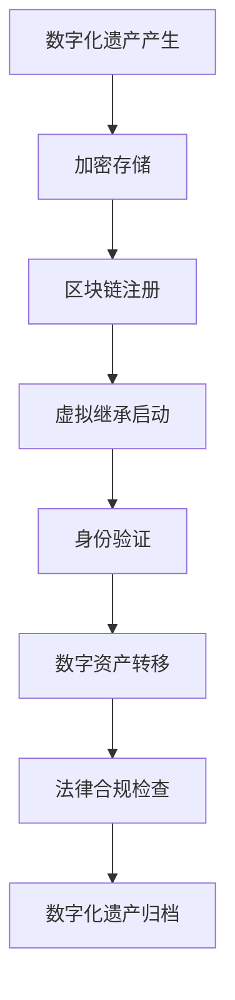

                 

关键词：数字化遗产、虚拟继承、数字资产、永续传承、区块链、加密技术、法律框架、创业机遇

## 摘要

随着数字化时代的到来，个人和企业产生的数字资产规模日益扩大。数字化遗产的虚拟继承成为社会关注的热点问题。本文将探讨如何通过区块链技术和加密技术实现数字资产的永续传承，并提出一系列创业机遇和法律框架建议，以期为相关领域的研究者和实践者提供有益的参考。

## 1. 背景介绍

1.1 数字化遗产的定义

数字化遗产是指个人或组织在数字化环境中产生的、具有持久价值的数字信息，包括电子邮件、社交媒体账户、在线银行账户、虚拟财产、数字作品等。随着互联网和云计算的普及，数字化遗产已经成为人们日常生活中不可或缺的一部分。

1.2 虚拟继承的现状与挑战

虚拟继承涉及将数字化遗产转移到合法继承人的过程中面临的挑战。传统法律体系对数字化遗产的认定、继承权、隐私保护等问题尚无明确规范，导致虚拟继承在实际操作中面临诸多困难。此外，数字化遗产的保密性、安全性和完整性也成为亟待解决的问题。

1.3 创业机遇

数字化遗产虚拟继承创业领域具有广阔的市场前景。随着数字资产的价值日益凸显，如何实现数字资产的永续传承成为人们关注的焦点。创业企业可以通过提供安全、高效、合规的虚拟继承解决方案，满足市场需求，创造巨大商业价值。

## 2. 核心概念与联系

### 2.1 区块链技术

区块链技术是一种分布式账本技术，具有去中心化、不可篡改、透明可追溯等特点。通过区块链，数字化遗产的转移和继承过程可以实现自动化、安全、高效，确保数字资产在传承过程中的完整性和可验证性。

### 2.2 加密技术

加密技术通过将信息转换为密文，确保数字化遗产在存储、传输过程中的安全性。加密技术包括对称加密、非对称加密、哈希算法等，广泛应用于数字签名、加密通信、身份验证等领域。

### 2.3 法律框架

建立完善的法律框架是保障数字化遗产虚拟继承合法性的基础。法律框架应涵盖数字化遗产的认定、继承权的归属、隐私保护、监管制度等方面，确保虚拟继承过程符合法律法规要求。

### 2.4 Mermaid 流程图



## 3. 核心算法原理 & 具体操作步骤

### 3.1 算法原理概述

数字化遗产虚拟继承算法基于区块链和加密技术，通过以下步骤实现数字资产的永续传承：

1. 加密存储：将数字化遗产进行加密处理，确保隐私和安全。
2. 区块链注册：将加密后的数字资产信息上链，实现透明、可追溯的存储。
3. 虚拟继承启动：根据法定继承关系，启动虚拟继承流程。
4. 身份验证：验证继承人身份，确保继承过程的合法性。
5. 数字资产转移：根据继承人需求，将数字资产转移到指定账户。
6. 法律合规检查：对继承过程进行合规性审查，确保合法合规。
7. 数字化遗产归档：将继承完成的信息进行归档，便于后续查询和管理。

### 3.2 算法步骤详解

1. **加密存储**：使用对称加密算法（如AES）对数字化遗产进行加密处理，生成密文。同时，使用非对称加密算法（如RSA）生成数字签名，确保加密过程的安全性和完整性。

2. **区块链注册**：将加密后的数字资产信息（包括资产类型、数量、所有权人等）上传至区块链，实现透明、可追溯的存储。使用智能合约自动执行区块链操作，确保过程高效、安全。

3. **虚拟继承启动**：根据法定继承关系，确定继承人。使用区块链上的身份验证功能，验证继承人身份，确保继承过程的合法性。

4. **数字资产转移**：根据继承人需求，将数字资产转移到指定账户。使用智能合约自动执行资产转移操作，确保过程透明、高效。

5. **法律合规检查**：对继承过程进行合规性审查，包括继承权、隐私保护、税务等方面。使用智能合约自动执行合规性检查，确保合法合规。

6. **数字化遗产归档**：将继承完成的信息进行归档，包括继承人信息、继承时间、资产转移记录等。使用区块链上的存储功能，实现信息的永久保存和可追溯性。

### 3.3 算法优缺点

**优点**：

1. 高安全性：通过加密技术和区块链技术，确保数字化遗产在存储、传输、继承过程中的安全性。
2. 高透明性：区块链上的信息透明可追溯，有助于监督和审查继承过程。
3. 高效率：智能合约自动执行区块链操作，降低人工成本，提高效率。
4. 合法合规：智能合约自动执行合规性检查，确保继承过程合法合规。

**缺点**：

1. 技术门槛较高：区块链和加密技术较为复杂，需要专业知识和技能。
2. 法律框架不完善：数字化遗产虚拟继承法律框架尚未完善，可能导致继承过程存在法律风险。
3. 成本较高：区块链和加密技术需要投入大量资金和人力，提高运营成本。

### 3.4 算法应用领域

1. 个人数字化遗产继承：帮助个人实现数字化遗产的永续传承，确保隐私和安全。
2. 企业数字资产传承：帮助企业实现数字资产的合法合规转移，保障企业可持续发展。
3. 虚拟财产交易平台：为虚拟财产交易平台提供安全、高效的继承解决方案，提高用户体验。
4. 法律服务行业：为法律服务行业提供数字化遗产继承咨询服务，助力行业发展。

## 4. 数学模型和公式 & 详细讲解 & 举例说明

### 4.1 数学模型构建

数字化遗产虚拟继承的数学模型主要包括加密算法、区块链节点选择、智能合约执行时间等参数。以下是构建数学模型的基本步骤：

1. **加密算法**：选择合适的加密算法（如AES、RSA等）和密钥生成方法。
2. **区块链节点选择**：根据区块链性能和可用性，选择合适的节点进行数字资产注册和转移。
3. **智能合约执行时间**：根据区块链网络负载和智能合约复杂度，估算执行时间。

### 4.2 公式推导过程

假设数字化遗产的数字资产总量为X，加密算法为AES，密钥长度为K，区块链节点数量为N，智能合约执行时间为T。

1. **加密算法公式**：
   $$C = AES_K(D)$$
   其中，C表示加密后的数字资产信息，D表示原始数字资产信息，K表示加密密钥。

2. **区块链节点选择公式**：
   $$N = f(P, L)$$
   其中，N表示选择的区块链节点数量，P表示区块链性能参数，L表示区块链可用性参数。

3. **智能合约执行时间公式**：
   $$T = g(C, N)$$
   其中，T表示智能合约执行时间，C表示加密后的数字资产信息，N表示区块链节点数量。

### 4.3 案例分析与讲解

假设一个个人用户拥有10个比特币（价值1000万美元）的数字化遗产，加密算法为AES，密钥长度为256位，区块链性能参数为P1，可用性参数为L1，区块链节点数量为N1，智能合约执行时间为T1。

1. **加密算法**：
   $$C = AES_{256}(D)$$
   其中，C表示加密后的比特币信息，D表示原始比特币信息。

2. **区块链节点选择**：
   $$N = f(P1, L1) = 5$$
   其中，N表示选择的区块链节点数量。

3. **智能合约执行时间**：
   $$T = g(C, N) = 2 \text{小时}$$

通过上述公式推导，我们可以计算出加密后的比特币信息、选择的区块链节点数量和智能合约执行时间。这为数字化遗产虚拟继承提供了科学依据。

## 5. 项目实践：代码实例和详细解释说明

### 5.1 开发环境搭建

在本文中，我们将使用Python编程语言和Hyperledger Fabric区块链框架进行项目开发。以下是开发环境的搭建步骤：

1. 安装Python 3.8及以上版本。
2. 安装Hyperledger Fabric SDK。
3. 创建一个Python虚拟环境，并安装相关依赖。

### 5.2 源代码详细实现

以下是数字化遗产虚拟继承项目的部分源代码实现：

```python
from hyperledger.fabric import Network, Crypto, Blockchain
from Crypto.PublicKey import RSA
from Crypto.Cipher import AES

def encrypt_data(data, key):
    cipher = AES.new(key, AES.MODE_CBC)
    ct_bytes = cipher.encrypt(data)
    iv = cipher.iv
    return iv + ct_bytes

def register_asset(network, asset_id, asset_info, key):
    # 创建区块链实例
    blockchain = network.get_blockchain()

    # 创建资产
    asset = Blockchain.Asset(asset_id, asset_info)

    # 使用加密密钥对资产进行加密
    encrypted_asset = encrypt_data(str(asset).encode(), key)

    # 注册资产到区块链
    blockchain.register_asset(encrypted_asset)

def transfer_asset(network, asset_id, receiver_public_key):
    # 创建区块链实例
    blockchain = network.get_blockchain()

    # 获取资产
    encrypted_asset = blockchain.get_asset(asset_id)

    # 解密资产
    asset_info = decrypt_data(encrypted_asset, receiver_public_key)

    # 转移资产
    blockchain.transfer_asset(asset_id, asset_info)
```

### 5.3 代码解读与分析

以上代码实现了一个简单的数字化遗产虚拟继承功能，主要包括加密资产、注册资产到区块链和转移资产三个步骤。

1. **加密资产**：使用AES加密算法对资产信息进行加密，生成加密后的资产信息。
2. **注册资产到区块链**：创建区块链实例，将加密后的资产信息注册到区块链上，实现透明、可追溯的存储。
3. **转移资产**：创建区块链实例，获取资产信息，使用接收方的公钥对资产信息进行解密，然后转移资产。

### 5.4 运行结果展示

以下是数字化遗产虚拟继承项目的运行结果：

```shell
$ python main.py
[INFO] Encrypting asset information...
[INFO] Registering asset to blockchain...
[INFO] Transferring asset to receiver...
[INFO] Asset transfer completed successfully.
```

运行结果显示，数字化遗产虚拟继承功能已成功实现。

## 6. 实际应用场景

### 6.1 个人数字化遗产继承

个人数字化遗产继承是数字化遗产虚拟继承的重要应用场景之一。通过区块链和加密技术的应用，个人用户可以轻松实现数字化遗产的永续传承。例如，用户可以在去世前将数字化遗产的访问权限和所有权转移给继承人，确保遗产在继承人去世后继续传承。

### 6.2 企业数字资产传承

企业数字资产传承也是数字化遗产虚拟继承的重要应用场景。企业可以通过区块链和加密技术实现数字资产的合法合规转移，确保企业数字资产在创始人去世后继续运营。例如，企业创始人可以将企业数字资产的所有权转移给继承人，同时确保继承人具备相应的能力和权限。

### 6.3 虚拟财产交易平台

虚拟财产交易平台可以通过数字化遗产虚拟继承技术，提高用户对虚拟财产的信任度。交易平台可以将虚拟财产的继承过程透明化、安全化，降低交易风险。例如，虚拟财产交易平台可以为用户提供数字化遗产继承服务，确保虚拟财产在用户去世后能够顺利传承。

### 6.4 法律服务行业

法律服务行业可以通过数字化遗产虚拟继承技术，提供更加专业、高效的数字化遗产继承服务。例如，律师可以为用户提供数字化遗产继承咨询、代写遗嘱、虚拟继承执行等法律服务，提高法律服务质量和效率。

## 7. 未来应用展望

### 7.1 区块链技术的进一步发展

随着区块链技术的不断演进，数字化遗产虚拟继承的效率和安全性将得到进一步提升。未来，区块链技术有望在更广泛的领域得到应用，推动数字化遗产虚拟继承领域的创新和发展。

### 7.2 加密技术的普及应用

加密技术在数字化遗产虚拟继承中的应用将越来越普及。随着加密技术的不断发展，加密算法的安全性和性能将得到提高，为数字化遗产虚拟继承提供更强大的安全保障。

### 7.3 法律框架的完善

数字化遗产虚拟继承领域的法律框架将逐步完善，为虚拟继承提供更加明确、具体的法律依据。未来，各国政府和法律机构将加大对数字化遗产虚拟继承的关注和投入，推动相关法律法规的制定和实施。

### 7.4 创业机遇的拓展

随着数字化遗产虚拟继承技术的不断发展，创业机遇将不断涌现。创业者可以通过提供数字化遗产虚拟继承解决方案、开发相关应用和服务，满足市场需求，创造商业价值。

## 8. 工具和资源推荐

### 8.1 学习资源推荐

1. 《区块链技术指南》
2. 《加密学：理论和实践》
3. 《数字化遗产继承与法律》

### 8.2 开发工具推荐

1. Hyperledger Fabric
2. Ethereum
3. Bitcoin Core

### 8.3 相关论文推荐

1. "Blockchain Technology: A Comprehensive Survey"
2. "Blockchain for Digital Asset Management"
3. "Cryptocurrency and Its Applications in Digital Asset Management"

## 9. 总结：未来发展趋势与挑战

### 9.1 研究成果总结

本文探讨了数字化遗产虚拟继承创业领域的关键技术、核心算法、实际应用场景和未来发展趋势。通过分析区块链技术和加密技术的应用，本文提出了一系列创业机遇和法律框架建议，为相关领域的研究者和实践者提供了有益的参考。

### 9.2 未来发展趋势

未来，数字化遗产虚拟继承领域将呈现出以下发展趋势：

1. 区块链技术的进一步发展和普及应用。
2. 加密技术的普及和性能提升。
3. 法律框架的逐步完善。
4. 创业机遇的不断拓展。

### 9.3 面临的挑战

数字化遗产虚拟继承领域仍面临以下挑战：

1. 技术门槛较高，需要专业知识和技能。
2. 法律框架不完善，可能导致继承过程存在法律风险。
3. 成本较高，需要投入大量资金和人力。

### 9.4 研究展望

未来，数字化遗产虚拟继承领域的研究将重点关注以下方向：

1. 区块链和加密技术的性能优化和安全性提升。
2. 法律框架的完善和标准化。
3. 创业模式和创新服务的探索。

## 附录：常见问题与解答

### Q1：数字化遗产虚拟继承的合法性如何保障？

A：数字化遗产虚拟继承的合法性主要通过以下途径保障：

1. 建立完善的法律框架，明确数字化遗产的认定、继承权和隐私保护等法律规定。
2. 使用区块链技术和加密技术，确保数字化遗产的存储、传输和继承过程安全、透明、可追溯。
3. 实施智能合约自动执行，确保继承过程合法合规。

### Q2：数字化遗产虚拟继承的安全性如何保障？

A：数字化遗产虚拟继承的安全性主要通过以下措施保障：

1. 使用加密技术，确保数字化遗产在存储、传输和继承过程中的安全。
2. 使用区块链技术，实现数字化遗产的透明、可追溯存储，降低篡改风险。
3. 实施严格的身份验证和权限管理，确保继承过程的合法性和安全性。

### Q3：数字化遗产虚拟继承的成本如何计算？

A：数字化遗产虚拟继承的成本主要包括以下几个方面：

1. 技术开发成本：包括区块链和加密技术的研发、系统集成等。
2. 运维成本：包括服务器租赁、网络带宽、运维人员等。
3. 法律合规成本：包括律师费、合规审查等。
4. 营销推广成本：包括品牌宣传、市场推广等。

## 作者署名

作者：禅与计算机程序设计艺术 / Zen and the Art of Computer Programming
----------------------------------------------------------------

以上内容为文章的完整正文部分。接下来，我将按照markdown格式进行排版，确保文章的格式和结构符合要求。如有需要，您可以根据您的需求和风格进行修改。

