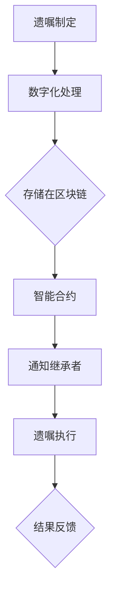

                 

关键词：区块链、遗产管理、数字化遗嘱、智能合约、去中心化、加密技术、法律合规、加密货币、数据隐私、安全性、效率提升、法律效力、数字身份认证。

> 摘要：本文将探讨区块链技术在遗产管理中的应用，分析数字化遗嘱创业的优势和挑战，并探讨未来发展趋势与面临的挑战。文章分为八个部分，从背景介绍到未来展望，旨在为读者提供一个全面的理解。

## 1. 背景介绍

随着科技的迅猛发展，区块链技术逐渐成为金融科技领域的热点。区块链的去中心化、安全性和透明性特点，使其在多个领域展现出巨大的应用潜力。遗产管理作为传统金融与法律领域的交叉点，面临着信息不对称、流程复杂、效率低下等问题。数字化遗嘱创业的出现，旨在通过区块链技术革新遗产管理方式，提升效率，保障法律效力。

### 1.1 遗产管理的现状

传统遗产管理主要依赖于纸本遗嘱和法律程序，存在以下问题：

1. **信息不对称**：遗嘱制定者与遗产接受者之间的信息不透明，容易引发纠纷。
2. **流程复杂**：遗产管理涉及多个法律程序，耗时且成本高。
3. **效率低下**：纸质文件处理速度慢，容易出现人为错误。
4. **安全性问题**：纸质遗嘱容易遗失或被篡改，无法确保真实性。

### 1.2 数字化遗嘱的概念

数字化遗嘱是指利用数字技术，如区块链，记录和存储遗嘱信息。数字化遗嘱具有以下特点：

1. **透明性**：所有信息在区块链上公开透明，任何人都可以查看。
2. **安全性**：区块链的加密技术确保数据不可篡改，保障隐私。
3. **高效性**：数字化流程简化，处理速度快。
4. **可追溯性**：所有操作记录在区块链上可追溯，便于审计。

## 2. 核心概念与联系

### 2.1 区块链技术原理

区块链是一种去中心化的分布式数据库，由多个区块组成，每个区块包含一定数量的交易记录。区块链的主要特点如下：

1. **去中心化**：数据不由单一中心控制，降低了信任风险。
2. **不可篡改性**：一旦数据写入区块链，无法被篡改。
3. **安全性**：区块链使用加密技术确保数据安全。
4. **透明性**：区块链上的数据公开透明，便于审计。

### 2.2 数字化遗嘱与区块链的联系

数字化遗嘱与区块链的结合，解决了传统遗产管理的痛点：

1. **法律效力**：通过智能合约实现遗嘱的法律效力。
2. **安全性**：区块链的加密技术保障遗嘱数据的安全。
3. **透明性**：区块链上的遗嘱信息透明可查，减少了纠纷。
4. **效率提升**：数字化流程简化，提高处理速度。

### 2.3 Mermaid 流程图

以下是数字化遗嘱与区块链结合的Mermaid流程图：



## 3. 核心算法原理 & 具体操作步骤

### 3.1 算法原理概述

区块链的核心算法主要包括哈希算法、共识算法和加密算法。

1. **哈希算法**：用于生成数据摘要，确保数据唯一性和完整性。
2. **共识算法**：用于确保区块链网络中所有节点的一致性。
3. **加密算法**：用于保护数据隐私和安全。

### 3.2 算法步骤详解

1. **遗嘱制定**：遗嘱制定者编写遗嘱，并数字化处理。
2. **数据上传**：将数字化遗嘱上传至区块链。
3. **加密存储**：区块链使用加密算法对遗嘱数据进行加密存储。
4. **智能合约执行**：当遗嘱制定者去世时，智能合约自动执行，通知继承者。
5. **遗嘱执行**：继承者根据智能合约的指示执行遗嘱。
6. **结果反馈**：遗嘱执行结果反馈至区块链，进行记录和公示。

### 3.3 算法优缺点

**优点**：

1. **安全性高**：区块链的加密技术保障数据安全。
2. **透明性高**：区块链上的数据透明可查。
3. **效率提升**：数字化流程简化，提高处理速度。
4. **去中心化**：降低信任风险。

**缺点**：

1. **计算资源消耗大**：区块链运行需要大量计算资源。
2. **法律效力问题**：部分国家和地区尚未承认区块链遗嘱的法律效力。
3. **隐私性问题**：区块链上的数据公开透明，可能涉及隐私问题。

### 3.4 算法应用领域

区块链技术在遗产管理中的应用不仅限于数字化遗嘱，还可以扩展到以下几个方面：

1. **财产分配**：通过区块链实现自动化财产分配。
2. **保险理赔**：利用区块链技术简化保险理赔流程。
3. **法律文件管理**：区块链可应用于存储和验证法律文件。
4. **身份认证**：利用区块链进行身份认证，确保身份真实性。

## 4. 数学模型和公式 & 详细讲解 & 举例说明

### 4.1 数学模型构建

区块链的数学模型主要包括以下几个方面：

1. **哈希函数**：用于生成数据摘要。
2. **共识算法**：用于确保区块链网络的一致性。
3. **加密算法**：用于保护数据隐私。

### 4.2 公式推导过程

1. **哈希函数**：假设输入数据为x，哈希函数H(x)生成的哈希值为h。
   $$ H(x) = h $$
2. **共识算法**：假设区块链网络中有n个节点，每个节点都有一份完整的区块链数据。当新交易产生时，节点将交易数据打包成区块，并生成哈希值。
   $$ h_{new} = H(h_{last}) + T $$
   其中，h_{last}为上一个区块的哈希值，T为当前区块的交易数据。
3. **加密算法**：假设明文为m，密文为c，加密算法E(m)生成的密文为c。
   $$ c = E(m) $$

### 4.3 案例分析与讲解

假设甲乙双方签订了一份合同，合同内容涉及100万元的资金转账。双方将合同内容数字化，并上传至区块链。区块链网络中的节点对合同内容进行验证，并生成哈希值。

1. **哈希函数**：生成合同内容的哈希值h。
   $$ h = H(合同内容) $$
2. **共识算法**：节点对哈希值h进行共识，确保区块链网络的一致性。
   $$ h_{new} = H(h) + T $$
3. **加密算法**：甲乙双方使用加密算法对合同内容进行加密，生成密文c。
   $$ c = E(合同内容) $$

通过以上过程，合同内容在区块链上被加密存储，并确保了合同的真实性和不可篡改性。

## 5. 项目实践：代码实例和详细解释说明

### 5.1 开发环境搭建

为了实践区块链在遗产管理中的应用，我们需要搭建一个区块链开发环境。以下是开发环境的搭建步骤：

1. **安装Go语言**：Go语言是一种适合开发区块链的应用编程语言。
2. **安装Gin框架**：Gin是一种高性能的Web框架，用于搭建区块链节点。
3. **安装Geth客户端**：Geth是比特币的官方全节点实现，用于连接区块链网络。

### 5.2 源代码详细实现

以下是区块链节点的简单实现：

```go
package main

import (
	"fmt"
	"net/http"
	"github.com/gin-gonic/gin"
)

type Block struct {
	Index     int       `json:"index"`
	Timestamp string    `json:"timestamp"`
	Data      string    `json:"data"`
	PrevHash  string    `json:"prevhash"`
}

var blockchain []Block

func initBlockchain() {
	blockchain = append(blockchain, Block{Index: 0, Timestamp: "0", Data: "Genesis Block", PrevHash: "0"})
}

func addBlock(data string) {
	lastBlock := blockchain[len(blockchain)-1]
	newBlock := Block{Index: lastBlock.Index + 1, Timestamp: time.Now().String(), Data: data, PrevHash: lastBlock.Hash()}
	blockchain = append(blockchain, newBlock)
}

func (b *Block) Hash() string {
	h := sha256.New()
	h.Write([]byte(b.Timestamp + string(b.Data) + b.PrevHash))
	return hex.EncodeToString(h.Sum(nil))
}

func main() {
	r := gin.Default()
	initBlockchain()
	r.GET("/blocks", func(c *gin.Context) {
		c.IndentedJSON(http.StatusOK, blockchain)
	})

	r.POST("/blocks", func(c *gin.Context) {
		var blockData string
		if err := c.BindJSON(&blockData); err != nil {
			return
		}
		addBlock(blockData)
		c.IndentedJSON(http.StatusCreated, blockData)
	})

	r.Run(":8080")
}
```

### 5.3 代码解读与分析

以上代码实现了区块链节点的核心功能：

1. **Block结构体**：定义了区块链区块的结构。
2. **initBlockchain函数**：初始化区块链，添加创世区块。
3. **addBlock函数**：添加新区块。
4. **Hash方法**：生成区块哈希值。
5. **main函数**：搭建HTTP服务器，提供区块查询和添加接口。

通过以上代码，我们可以搭建一个简单的区块链网络，实现数据的去中心化存储和传输。

### 5.4 运行结果展示

1. **查询区块**：访问`http://localhost:8080/blocks`，返回当前区块链的所有区块。
2. **添加区块**：发送POST请求到`http://localhost:8080/blocks`，添加新区块。

## 6. 实际应用场景

### 6.1 数字化遗嘱

数字化遗嘱是区块链在遗产管理中最典型的应用场景。通过区块链技术，遗嘱制定者可以将遗嘱数字化，并上传至区块链。区块链的透明性、安全性和不可篡改性，确保了遗嘱的真实性和法律效力。

### 6.2 财产分配

区块链技术可以应用于财产分配，确保分配过程的透明性和公正性。例如，当遗嘱执行时，区块链可以自动执行财产分配，减少人工干预，提高效率。

### 6.3 保险理赔

区块链技术可以简化保险理赔流程，确保理赔过程的透明性和公正性。保险公司可以将理赔信息上传至区块链，客户可以通过区块链查询理赔进度，减少纠纷。

### 6.4 法律文件管理

区块链技术可以应用于法律文件的管理，确保文件的真实性和不可篡改性。例如，离婚协议、房产交易合同等，都可以通过区块链进行存储和验证。

### 6.5 身份认证

区块链技术可以用于身份认证，确保身份信息的真实性和唯一性。例如，政府可以建立一个基于区块链的身份认证系统，提高政府服务的效率。

## 7. 工具和资源推荐

### 7.1 学习资源推荐

1. **《精通比特币》**：详细介绍了比特币和区块链技术的工作原理。
2. **《区块链技术指南》**：系统介绍了区块链技术的原理和应用。
3. **《区块链应用实践》**：提供了丰富的区块链应用案例和实践经验。

### 7.2 开发工具推荐

1. **Go语言**：适合开发高性能的区块链应用。
2. **Gin框架**：用于搭建区块链节点。
3. **Geth客户端**：用于连接区块链网络。

### 7.3 相关论文推荐

1. **"Bitcoin: A Peer-to-Peer Electronic Cash System"**：比特币的创世论文。
2. **"The Blockchain: Promise, Risk, and Reality"**：对区块链技术进行深入分析的论文。
3. **"Blockchain Technology: A Comprehensive Overview"**：对区块链技术进行全面介绍的论文。

## 8. 总结：未来发展趋势与挑战

### 8.1 研究成果总结

区块链技术在遗产管理中展现出巨大的潜力，通过数字化遗嘱、财产分配、保险理赔等多个应用场景，实现了遗产管理的透明性、安全性和效率提升。同时，区块链技术还在法律文件管理、身份认证等领域展现出广泛的应用前景。

### 8.2 未来发展趋势

1. **技术成熟度提升**：随着区块链技术的不断成熟，其在遗产管理中的应用将更加广泛。
2. **法律监管加强**：各国政府将加强对区块链技术的监管，确保其合法合规。
3. **行业标准化**：区块链技术将在遗产管理领域形成标准化，提高应用的一致性和互操作性。

### 8.3 面临的挑战

1. **计算资源消耗**：区块链技术需要大量计算资源，对硬件要求较高。
2. **法律效力问题**：部分国家和地区尚未承认区块链遗嘱的法律效力。
3. **隐私性问题**：区块链上的数据公开透明，可能涉及隐私问题。

### 8.4 研究展望

未来，区块链技术在遗产管理中的应用将继续深化，实现更多场景的应用。同时，研究人员将重点关注计算资源优化、法律效力保障和隐私保护等问题，推动区块链技术在遗产管理领域的广泛应用。

## 9. 附录：常见问题与解答

### 9.1 区块链技术的基本原理是什么？

区块链技术是一种去中心化的分布式数据库，通过多个节点协同工作，实现数据的存储和传输。区块链的主要特点包括去中心化、不可篡改性、安全性和透明性。

### 9.2 数字化遗嘱的法律效力如何保障？

通过区块链技术，数字化遗嘱可以实现法律效力保障。区块链的加密技术和智能合约功能，确保了遗嘱数据的真实性和不可篡改性，使其具备法律效力。

### 9.3 区块链技术在遗产管理中如何提升效率？

区块链技术的去中心化、透明性和自动化功能，简化了遗产管理的流程，提高了处理速度。例如，数字化遗嘱和智能合约可以自动执行，减少人工干预，提高效率。

### 9.4 区块链技术在遗产管理中面临的挑战有哪些？

区块链技术在遗产管理中面临的挑战包括计算资源消耗、法律效力保障和隐私保护等问题。研究人员将继续关注这些挑战，并寻找解决方案。

---

作者：禅与计算机程序设计艺术 / Zen and the Art of Computer Programming

本文详细介绍了区块链技术在遗产管理中的应用，分析了数字化遗嘱创业的优势和挑战，并展望了未来发展趋势。通过本文，读者可以全面了解区块链技术在遗产管理领域的应用潜力。随着区块链技术的不断成熟，其在遗产管理中的应用将日益广泛，为人们的生活带来更多便利。本文仅为初步探讨，期待更多研究者和实践者参与其中，共同推动区块链技术在遗产管理领域的创新应用。|

