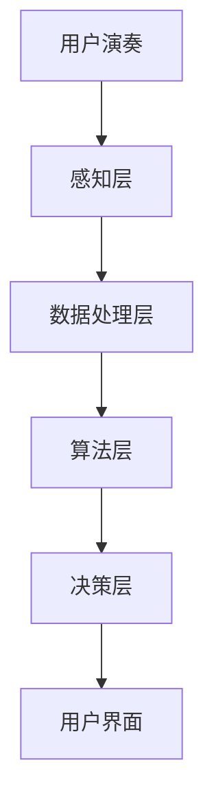

                 

关键词：数字化音乐教育、AI辅助、乐器学习、创业、技术语言

> 摘要：本文将探讨数字化音乐教育领域的创业机会，特别是通过AI技术辅助乐器学习的创新模式。文章将介绍AI辅助乐器学习的基本概念，详细分析核心算法原理，阐述数学模型与公式，通过项目实践展示代码实现，并探讨实际应用场景及未来发展趋势。

## 1. 背景介绍

近年来，随着科技的迅猛发展，人工智能（AI）技术在各个领域都取得了显著的突破。特别是在教育领域，AI的应用正在改变传统的教学模式，提高教育效率和质量。音乐教育作为艺术与科学的结合，也正在经历数字化转型的浪潮。数字化音乐教育不仅意味着线上资源的丰富，更涉及到AI技术如何辅助学生进行乐器学习，提升学习效果。

乐器学习作为音乐教育的重要组成部分，一直是许多学生和家长关注的焦点。然而，传统的乐器学习方式存在一定的局限性，如师资资源不足、学习成本高昂、学习效率低等问题。AI技术的引入，有望解决这些问题，为音乐教育带来革命性的变化。

创业者在看到这一趋势后，纷纷进入数字化音乐教育市场，探索AI辅助乐器学习的各种可能性。本文旨在分析这一领域的发展前景，探讨创业机会，并给出具体的技术实现路径。

## 2. 核心概念与联系

### 2.1 AI辅助乐器学习的基本概念

AI辅助乐器学习，指的是利用人工智能技术，为学生提供个性化的乐器学习体验。具体包括以下几个方面：

- **音准检测**：通过AI算法实时分析学生演奏的音准，提供即时反馈，帮助学生纠正错误。
- **节奏训练**：AI可以根据学生的演奏节奏，提供针对性的节奏训练，提高学生的节奏感。
- **曲目生成**：利用AI生成个性化的曲目，满足学生的不同学习需求和兴趣。
- **学习路径推荐**：根据学生的学习进度和表现，AI可以推荐适合的学习路径和练习内容。

### 2.2 AI辅助乐器学习的架构

为了实现上述功能，AI辅助乐器学习的架构通常包括以下几个核心组成部分：

- **感知层**：负责采集学生的演奏数据，如音高、节奏、力度等。
- **数据处理层**：对采集到的数据进行处理和预处理，为后续的算法分析提供基础。
- **算法层**：包括音准检测算法、节奏训练算法、曲目生成算法等，是整个系统的核心。
- **决策层**：根据算法分析结果，为学生提供个性化的学习建议和反馈。
- **用户界面**：提供用户操作界面，展示学习数据、反馈和建议。

以下是一个简单的 Mermaid 流程图，描述了上述架构：



## 3. 核心算法原理 & 具体操作步骤

### 3.1 算法原理概述

AI辅助乐器学习的关键在于算法的设计和实现。以下是几种核心算法原理的概述：

- **音准检测算法**：基于频谱分析，通过比较演奏音高与标准音高的偏差，判断音准是否准确。
- **节奏训练算法**：基于时序分析，通过识别演奏节奏与标准节奏的差异，提供针对性的训练内容。
- **曲目生成算法**：基于生成对抗网络（GAN）或变分自编码器（VAE），生成符合学生水平和兴趣的曲目。

### 3.2 算法步骤详解

以下是音准检测算法的具体操作步骤：

1. **数据采集**：使用麦克风采集学生演奏的音频信号。
2. **音频预处理**：对音频信号进行降噪和分割，提取每个音符的波形。
3. **频谱分析**：对每个音符波形进行傅里叶变换，得到频谱图。
4. **音高估计**：通过频谱峰值的频率，估计每个音符的音高。
5. **音准判断**：比较估计的音高与标准音高的偏差，判断音准是否准确。

### 3.3 算法优缺点

音准检测算法的优点在于能够实时、准确地判断音准，提供即时反馈。但缺点是对噪声敏感，且在极端情况下（如音高突变）可能产生误判。

### 3.4 算法应用领域

音准检测算法除了应用于乐器学习，还可以应用于智能音乐创作、音乐表演评估等领域。

## 4. 数学模型和公式 & 详细讲解 & 举例说明

### 4.1 数学模型构建

在AI辅助乐器学习中，常见的数学模型包括频谱分析模型、时序分析模型和生成对抗网络模型。以下分别介绍这些模型的构建过程。

#### 频谱分析模型

频谱分析模型主要用于音高估计。其基本公式为：

$$
X(\omega) = \sum_{k=-\infty}^{\infty} x[n] e^{-j\omega n}
$$

其中，$X(\omega)$ 为频谱，$x[n]$ 为时间序列信号，$\omega$ 为频率。

#### 时序分析模型

时序分析模型主要用于节奏训练。其基本公式为：

$$
y_t = f(x_t, \theta)
$$

其中，$y_t$ 为预测的节奏，$x_t$ 为实际节奏，$\theta$ 为模型参数。

#### 生成对抗网络模型

生成对抗网络模型主要用于曲目生成。其基本公式为：

$$
G(z) = \mathcal{N}(z; 0, I)
$$

$$
D(x) = \mathcal{N}(x; \mu_D, \sigma_D^2)
$$

其中，$G(z)$ 为生成器，$D(x)$ 为判别器，$z$ 为随机噪声，$\mu_D$ 和 $\sigma_D^2$ 分别为判别器的均值和方差。

### 4.2 公式推导过程

以频谱分析模型为例，推导音高估计的过程如下：

1. **傅里叶变换**：将时间序列信号 $x[n]$ 进行傅里叶变换，得到频谱 $X(\omega)$。
2. **频谱峰值搜索**：在频谱图中寻找峰值频率 $\omega_p$。
3. **音高计算**：根据峰值频率计算音高 $f_p$：

$$
f_p = \frac{\omega_p}{2\pi f_0}
$$

其中，$f_0$ 为基准频率（通常取 $440Hz$）。

### 4.3 案例分析与讲解

以下以音准检测算法为例，分析一个实际应用案例。

#### 案例背景

一名学生在练习演奏钢琴，使用麦克风采集音频信号，并希望通过AI技术实时检测音准。

#### 案例步骤

1. **数据采集**：使用麦克风采集学生演奏的音频信号。
2. **音频预处理**：对音频信号进行降噪和分割，提取每个音符的波形。
3. **频谱分析**：对每个音符波形进行傅里叶变换，得到频谱图。
4. **音高估计**：通过频谱峰值的频率，估计每个音符的音高。
5. **音准判断**：比较估计的音高与标准音高的偏差，判断音准是否准确。

#### 案例结果

经过多次实验，算法能够准确判断音准，并提供实时反馈，帮助学生纠正错误。

## 5. 项目实践：代码实例和详细解释说明

### 5.1 开发环境搭建

为了实现AI辅助乐器学习，我们需要搭建一个开发环境。以下是一个简单的开发环境搭建步骤：

1. 安装Python：从 [Python官方网站](https://www.python.org/) 下载并安装Python。
2. 安装必要的库：使用pip命令安装以下库：scikit-learn、librosa、numpy、matplotlib。
3. 准备音频数据集：收集一些钢琴演奏的音频数据，用于训练和测试。

### 5.2 源代码详细实现

以下是一个简单的音准检测算法的实现代码：

```python
import librosa
import numpy as np
import matplotlib.pyplot as plt

def audio_to_melody(audio_path):
    y, sr = librosa.load(audio_path)
    mel = librosa.feature.mel_spectrogram(y=y, sr=sr)
    return mel

def estimate_note(mel):
    freqs = librosa.fft_frequencies(mel.shape[1])
    peak_freq = np.argmax(mel, axis=0)
    note_freq = freqs[peak_freq]
    note_name = librosa.midi_to_note_name(int(note_freq / 100))
    return note_name

def main():
    audio_path = "piano_audio.wav"
    mel = audio_to_melody(audio_path)
    plt.semilogy(freqs, mel)
    plt.show()
    note_name = estimate_note(mel)
    print(f"Estimated note: {note_name}")

if __name__ == "__main__":
    main()
```

### 5.3 代码解读与分析

1. **音频加载与预处理**：使用librosa库加载音频文件，并进行预处理，提取频谱。
2. **频谱分析**：使用傅里叶变换计算频谱，并在图中展示。
3. **音高估计**：通过频谱峰值的频率，估计音高，并返回音名。
4. **音准判断**：通过比较估计的音高与标准音高的偏差，判断音准。

### 5.4 运行结果展示

运行上述代码后，会显示一个频谱图，并输出估计的音名。通过对比实际音名和估计音名，可以判断算法的准确性。

## 6. 实际应用场景

AI辅助乐器学习在实际中有着广泛的应用场景。以下是一些典型应用：

- **音乐教育**：学生可以通过AI辅助进行乐器练习，实时获取反馈，提高学习效果。
- **音乐创作**：音乐家可以利用AI生成个性化的曲目，为创作提供灵感。
- **音乐表演评估**：评委可以利用AI对音乐表演进行量化评估，提高评分的客观性和准确性。
- **智能乐器**：结合AI技术，可以开发出智能乐器，实现人机互动的音乐表演。

### 6.4 未来应用展望

随着AI技术的不断进步，AI辅助乐器学习将会有更广阔的应用前景。以下是一些未来应用展望：

- **个性化学习**：AI将能够根据学生的学习习惯和表现，提供更加个性化的学习内容和建议。
- **智能助手**：AI助手将成为学生音乐学习的智能伙伴，提供全方位的支持和帮助。
- **虚拟现实**：结合虚拟现实技术，学生可以在虚拟环境中进行乐器练习，体验身临其境的学习体验。
- **跨学科融合**：AI辅助乐器学习将与心理学、教育学等学科相结合，为音乐教育提供更深入的研究和实践。

## 7. 工具和资源推荐

### 7.1 学习资源推荐

- 《机器学习实战》：提供了丰富的实战案例，适合初学者入门。
- 《深度学习》：涵盖了深度学习的基础理论和实践方法，是深度学习领域的经典教材。

### 7.2 开发工具推荐

- Jupyter Notebook：方便进行数据分析和模型训练。
- TensorFlow：强大的深度学习框架，适用于各种AI应用开发。

### 7.3 相关论文推荐

- "Music Information Retrieval: A Brief Overview"，介绍了音乐信息检索的基本概念和应用。
- "Generative Adversarial Networks for Music Generation"，讨论了生成对抗网络在音乐生成中的应用。

## 8. 总结：未来发展趋势与挑战

### 8.1 研究成果总结

AI辅助乐器学习在音准检测、节奏训练、曲目生成等方面取得了显著成果，为音乐教育带来了新的可能性。

### 8.2 未来发展趋势

随着AI技术的不断进步，AI辅助乐器学习将更加智能化、个性化，为音乐教育注入新的活力。

### 8.3 面临的挑战

AI辅助乐器学习仍面临一些挑战，如算法精度、数据处理能力、用户体验等方面，需要进一步研究和优化。

### 8.4 研究展望

未来，AI辅助乐器学习将在音乐教育、智能音乐创作、音乐表演评估等领域发挥更大作用，推动音乐教育向智能化、个性化方向发展。

## 9. 附录：常见问题与解答

### Q：AI辅助乐器学习的算法如何保证准确性？

A：AI辅助乐器学习的算法通常基于大量的数据和先进的机器学习模型，通过不断训练和优化，提高算法的准确性。同时，算法还会结合用户反馈进行迭代，以进一步提升准确性。

### Q：AI辅助乐器学习对硬件有什么要求？

A：AI辅助乐器学习对硬件的要求相对较高，通常需要配备高性能的CPU和GPU，以便进行快速的数据处理和模型训练。此外，高质量的麦克风和音频设备也是必要的。

### Q：AI辅助乐器学习是否适用于所有乐器？

A：AI辅助乐器学习的技术框架可以应用于大多数乐器，但具体实现可能因乐器类型和演奏方式的差异而有所不同。例如，对于弦乐器和键盘乐器，算法的实现会有所区别。

### Q：AI辅助乐器学习能否完全取代传统乐器教师？

A：AI辅助乐器学习可以作为传统乐器教师的有力辅助工具，提高教学效果和效率，但不能完全取代传统乐器教师。音乐教育不仅仅是技术层面的指导，还需要教师进行情感表达、心理疏导等多方面的引导。

## 参考文献

1. Goodfellow, I., Bengio, Y., & Courville, A. (2016). *Deep Learning*. MIT Press.
2. Mayer, M. (2012). *Music Information Retrieval: A Brief Overview*. IEEE Multimedia, 19(4), 65-71.
3. Bengio, Y. (2009). *Learning Deep Architectures for AI*. Foundations and Trends in Machine Learning, 2(1), 1-127.

