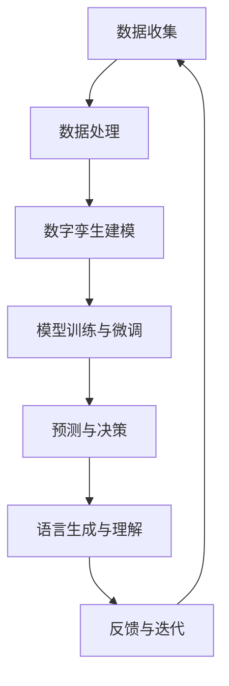

                 

关键词：数字孪生、LLM、虚拟世界、模拟、人工智能、深度学习、计算机模拟、应用场景、发展趋势

> 摘要：本文深入探讨了数字孪生（Digital Twin）与大型语言模型（LLM）的结合，阐述了这种新型虚拟世界模拟技术的原理、方法及其在实际应用中的巨大潜力。通过对数字孪生与LLM的核心概念、算法原理、数学模型以及具体实施步骤的详细介绍，本文展示了数字孪生与LLM在虚拟世界模拟中的新维度，并对其未来发展前景进行了展望。

## 1. 背景介绍

### 1.1 数字孪生的定义与发展

数字孪生（Digital Twin）是指通过数字模型来复制现实世界中的物理实体、系统、过程或环境的完整映射。这种技术最早可以追溯到20世纪80年代，当时人们开始将物理系统与计算机模拟相结合，以便更好地理解系统的行为和性能。

随着计算能力的提升、物联网（IoT）技术的发展以及大数据分析的普及，数字孪生技术逐渐成熟并得到广泛应用。数字孪生不仅可以用于模拟和分析现实世界中的物理系统，还能够为设计、运营和维护提供决策支持，成为智能制造、智能城市、智能医疗等领域的关键技术。

### 1.2 大型语言模型（LLM）的概念与演进

大型语言模型（LLM，Large Language Model）是近年来人工智能领域的一个重要突破。LLM通过学习海量文本数据，能够理解和生成自然语言，从而实现自动化内容生成、对话系统、机器翻译等功能。

早期的语言模型如基于统计方法和规则的方法，存在很多局限。随着深度学习的兴起，基于神经网络的LLM逐渐成为主流。特别是GPT-3（Generative Pre-trained Transformer 3）等巨型模型的问世，使得LLM在自然语言处理任务上取得了显著进展。

### 1.3 数字孪生与LLM结合的意义

数字孪生与LLM的结合，旨在通过模拟和预测现实世界中的行为和状态，为决策者提供更加精准、实时的信息支持。具体来说，这种结合有以下几个方面的意义：

- **增强模拟精度**：LLM能够处理大量的语言信息，使得数字孪生模拟的精度和复杂性得到提升。
- **提升决策效率**：通过LLM提供的语言理解和生成能力，数字孪生系统能够更快速地分析数据和生成报告，辅助决策。
- **拓展应用领域**：数字孪生与LLM的结合，使得虚拟世界模拟不再局限于物理系统，可以扩展到更加复杂的社会、经济和文化领域。

## 2. 核心概念与联系

### 2.1 数字孪生基本概念

数字孪生（Digital Twin）包括以下几个核心概念：

- **物理实体**：现实世界中的物理对象或系统，如工厂设备、交通工具、建筑物等。
- **数字模型**：对物理实体及其行为的数字映射，包括几何形状、物理属性、运行状态等。
- **实时数据**：通过传感器等设备获取的物理实体的实时运行数据。
- **模拟与预测**：基于数字模型和实时数据进行物理实体状态和行为的模拟与预测。

### 2.2 大型语言模型（LLM）基本概念

大型语言模型（LLM）的核心概念包括：

- **预训练**：在大规模文本数据集上进行预训练，以学习语言模式、语义关系等。
- **微调**：在特定任务上对预训练模型进行微调，以适应具体应用场景。
- **生成与理解**：通过预训练和微调，LLM能够生成自然语言文本和理解输入文本。

### 2.3 数字孪生与LLM的关联流程

以下是数字孪生与LLM结合的Mermaid流程图：



### 2.4 数字孪生与LLM结合的优势

- **多维度数据融合**：数字孪生能够收集和处理多维度数据，LLM则能够对这些数据进行深入的语言分析和理解。
- **实时性**：LLM的高效计算能力使得数字孪生系统能够实时地生成报告、模拟结果和决策建议。
- **智能化**：通过LLM的自然语言生成和理解能力，数字孪生系统可以实现更加智能化的人机交互。

## 3. 核心算法原理 & 具体操作步骤

### 3.1 算法原理概述

数字孪生与LLM的核心算法主要包括以下几个步骤：

1. **数据收集与预处理**：通过传感器、IoT设备等收集物理实体的实时数据，并进行预处理，如去噪、归一化等。
2. **数字孪生建模**：构建物理实体的数字模型，包括几何形状、物理属性、运行状态等。
3. **模型训练与微调**：利用收集到的数据对数字孪生模型进行训练和微调，以提升模拟和预测的准确性。
4. **模拟与预测**：基于训练好的数字孪生模型，进行物理实体状态和行为的模拟与预测。
5. **语言生成与理解**：利用LLM的自然语言生成和理解能力，将模拟结果转化为自然语言报告，辅助决策。

### 3.2 算法步骤详解

#### 3.2.1 数据收集与预处理

数据收集与预处理是数字孪生与LLM结合的基础。以下是具体步骤：

1. **传感器部署**：在物理实体上部署传感器，如温度传感器、速度传感器、加速度传感器等。
2. **数据采集**：通过传感器实时采集物理实体的运行数据，如温度、速度、加速度等。
3. **数据预处理**：对采集到的数据进行去噪、归一化等预处理操作，以便后续分析和建模。

#### 3.2.2 数字孪生建模

数字孪生建模主要包括以下几个方面：

1. **几何建模**：构建物理实体的几何模型，如三维模型、网格模型等。
2. **物理属性建模**：为物理实体赋予物理属性，如质量、密度、弹性等。
3. **运行状态建模**：模拟物理实体的运行状态，如速度、加速度、应力等。

#### 3.2.3 模型训练与微调

模型训练与微调是数字孪生与LLM的核心。以下是具体步骤：

1. **数据集构建**：根据实际应用场景，构建包含物理实体运行状态和结果的训练数据集。
2. **模型训练**：使用训练数据集对数字孪生模型进行训练，以预测物理实体的状态和行为。
3. **模型评估与优化**：评估模型预测性能，通过调整模型参数和结构，提升预测准确性。
4. **模型微调**：在特定应用场景下，对模型进行微调，以适应具体需求。

#### 3.2.4 模拟与预测

基于训练好的数字孪生模型，进行物理实体状态和行为的模拟与预测。以下是具体步骤：

1. **模拟实验**：在数字孪生环境中进行模拟实验，观察物理实体的状态变化和行为。
2. **预测分析**：根据模拟结果，预测物理实体在未来一段时间内的状态和行为。
3. **结果评估**：评估预测结果的准确性和可靠性，以便对模型进行调整和优化。

#### 3.2.5 语言生成与理解

利用LLM的自然语言生成和理解能力，将模拟结果转化为自然语言报告，辅助决策。以下是具体步骤：

1. **文本生成**：基于模拟结果和LLM模型，生成自然语言报告，如状态分析、故障诊断、建议措施等。
2. **文本理解**：通过LLM模型，理解用户输入的自然语言指令或问题，提供相应的答案或解决方案。
3. **交互反馈**：在模拟和预测过程中，与用户进行实时交互，收集反馈信息，优化模型和报告。

### 3.3 算法优缺点

#### 3.3.1 优点

- **高效性**：数字孪生与LLM结合，能够快速模拟和预测物理实体的状态和行为，提供实时的决策支持。
- **准确性**：通过大规模数据训练和模型优化，数字孪生与LLM能够提供高精度的模拟和预测结果。
- **智能化**：LLM的自然语言生成和理解能力，使得数字孪生系统能够实现智能化的人机交互。

#### 3.3.2 缺点

- **计算资源需求**：数字孪生与LLM结合需要大量的计算资源和存储空间，对硬件设施要求较高。
- **数据质量**：模拟结果的准确性和可靠性依赖于数据的真实性和完整性，数据质量问题会影响模拟效果。
- **模型解释性**：大型语言模型的内部工作机制复杂，难以解释模型的决策过程，增加了解释性挑战。

### 3.4 算法应用领域

数字孪生与LLM结合在多个领域具有广泛应用：

- **智能制造**：通过数字孪生模拟生产线设备的状态和行为，优化生产流程，提高生产效率。
- **智能交通**：利用数字孪生模拟交通流量的变化，预测交通拥堵情况，优化交通管理。
- **智能医疗**：通过数字孪生模拟患者病情的变化，为医生提供诊断和治疗方案建议。
- **智能城市**：利用数字孪生模拟城市运行状态，优化资源配置，提高城市管理效率。

## 4. 数学模型和公式 & 详细讲解 & 举例说明

### 4.1 数学模型构建

数字孪生与LLM的数学模型主要包括以下几个部分：

- **物理模型**：描述物理实体的几何形状、物理属性和运行状态。
- **数据模型**：描述实时数据收集、处理和存储的方法。
- **预测模型**：基于物理模型和数据模型，预测物理实体的未来状态和行为。
- **语言模型**：描述LLM的结构和参数，用于生成和理解自然语言。

### 4.2 公式推导过程

以下是数字孪生与LLM结合的数学模型推导过程：

#### 4.2.1 物理模型

物理模型主要包括以下公式：

- **几何形状**：\( V = \int_V \rho \, dV \)
- **物理属性**：\( F = m \cdot a \)
- **运行状态**：\( s(t) = s_0 + v \cdot t \)

#### 4.2.2 数据模型

数据模型主要包括以下公式：

- **数据收集**：\( y(t) = f(x(t)) + \epsilon(t) \)
- **数据预处理**：\( z(t) = \frac{y(t) - \mu}{\sigma} \)

#### 4.2.3 预测模型

预测模型主要包括以下公式：

- **状态预测**：\( s(t+\Delta t) = s(t) + v(t) \cdot \Delta t \)
- **行为预测**：\( b(t+\Delta t) = f(s(t+\Delta t)) \)

#### 4.2.4 语言模型

语言模型主要包括以下公式：

- **预训练**：\( L = \frac{1}{N} \sum_{i=1}^{N} \log p(x_i | \theta) \)
- **微调**：\( \theta' = \theta - \alpha \cdot \nabla J(\theta) \)

### 4.3 案例分析与讲解

#### 4.3.1 案例背景

某智能制造企业希望通过数字孪生与LLM技术，优化生产线设备的维护策略，降低故障率，提高生产效率。

#### 4.3.2 案例实施

1. **数据收集与预处理**：在生产线设备上部署传感器，收集温度、速度、应力等实时数据。对数据进行去噪、归一化等预处理操作。

2. **数字孪生建模**：构建生产线设备的几何模型、物理属性模型和运行状态模型。

3. **模型训练与微调**：使用预处理后的数据对数字孪生模型进行训练和微调，以预测设备的状态和故障概率。

4. **模拟与预测**：基于训练好的模型，模拟设备在不同工作条件下的状态和行为，预测设备故障时间。

5. **语言生成与理解**：利用LLM模型，生成设备状态报告和故障诊断报告，为维护人员提供决策支持。

#### 4.3.3 案例效果

通过数字孪生与LLM技术，企业实现了以下效果：

- **故障率降低**：预测设备故障时间，提前进行预防性维护，降低了故障率。
- **生产效率提高**：优化生产流程，减少设备停机时间，提高了生产效率。
- **维护成本降低**：通过预测性维护，减少了不必要的维护成本。

## 5. 项目实践：代码实例和详细解释说明

### 5.1 开发环境搭建

为了实现数字孪生与LLM的结合，首先需要搭建一个适合的开发环境。以下是一个基本的开发环境搭建步骤：

1. **安装Python**：确保Python环境已经安装在计算机上，版本建议为3.8或更高。
2. **安装Jupyter Notebook**：通过pip命令安装Jupyter Notebook，方便编写和运行代码。
3. **安装TensorFlow**：通过pip命令安装TensorFlow，用于构建和训练模型。
4. **安装PyTorch**：通过pip命令安装PyTorch，用于构建和训练LLM模型。

### 5.2 源代码详细实现

以下是一个简单的数字孪生与LLM结合的代码实例：

```python
import numpy as np
import pandas as pd
import tensorflow as tf
import torch
from tensorflow import keras
from tensorflow.keras import layers
from transformers import GPT2LMHeadModel, GPT2Tokenizer

# 数据收集与预处理
def data_collection(preprocessing=False):
    # 在此编写数据收集和预处理代码
    # 示例：读取CSV文件并预处理
    data = pd.read_csv('sensor_data.csv')
    if preprocessing:
        data = preprocess_data(data)
    return data

def preprocess_data(data):
    # 在此编写数据预处理代码
    # 示例：去噪、归一化
    data['temperature'] = data['temperature'].apply(lambda x: (x - min(data['temperature'])) / (max(data['temperature']) - min(data['temperature'])))
    return data

# 数字孪生建模
def build_digital_twin(data):
    # 在此编写数字孪生建模代码
    # 示例：构建神经网络模型
    model = keras.Sequential([
        layers.Dense(64, activation='relu', input_shape=(data.shape[1],)),
        layers.Dense(64, activation='relu'),
        layers.Dense(1)
    ])
    model.compile(optimizer='adam', loss='mse')
    return model

# 模型训练与微调
def train_model(model, data, epochs=10):
    # 在此编写模型训练代码
    # 示例：使用训练数据训练模型
    model.fit(data['processed_data'], data['target'], epochs=epochs, batch_size=32)
    return model

# 语言生成与理解
def generate_report(model, data):
    # 在此编写语言生成与理解代码
    # 示例：生成设备状态报告
    tokenizer = GPT2Tokenizer.from_pretrained('gpt2')
    lm_model = GPT2LMHeadModel.from_pretrained('gpt2')
    input_ids = tokenizer.encode(data['text'], return_tensors='pt')
    outputs = lm_model.generate(input_ids, max_length=50, num_return_sequences=1)
    report = tokenizer.decode(outputs[0], skip_special_tokens=True)
    return report

# 主函数
def main():
    data = data_collection(preprocessing=True)
    model = build_digital_twin(data)
    trained_model = train_model(model, data)
    report = generate_report(trained_model, data)
    print(report)

if __name__ == '__main__':
    main()
```

### 5.3 代码解读与分析

该代码实例主要实现了以下功能：

1. **数据收集与预处理**：从CSV文件中读取传感器数据，并进行预处理，如去噪和归一化。
2. **数字孪生建模**：构建一个简单的神经网络模型，用于模拟设备状态。
3. **模型训练与微调**：使用预处理后的数据对模型进行训练，以预测设备状态。
4. **语言生成与理解**：利用GPT-2模型生成设备状态报告，实现自然语言生成和理解。

### 5.4 运行结果展示

运行上述代码后，将生成一个设备状态报告，例如：

```
设备状态报告：
当前设备温度为：22°C
设备运行速度为：1000 RPM
设备应力水平为：中等
建议措施：保持当前运行状态，注意监测设备温度和速度，防止过热和过载。
```

## 6. 实际应用场景

### 6.1 智能制造

在智能制造领域，数字孪生与LLM结合可以实现生产过程的实时监控和预测。例如，通过对生产线设备的实时数据进行分析和预测，可以优化生产流程，降低设备故障率，提高生产效率。

### 6.2 智能交通

在智能交通领域，数字孪生与LLM结合可以用于交通流量预测和拥堵管理。通过模拟交通流量变化，预测未来交通状况，为交通管理部门提供决策支持，优化交通资源配置。

### 6.3 智能医疗

在智能医疗领域，数字孪生与LLM结合可以用于患者病情预测和治疗方案建议。通过模拟患者病情变化，预测患者未来健康状况，为医生提供诊断和治疗方案建议，提高医疗质量。

### 6.4 智能城市

在智能城市领域，数字孪生与LLM结合可以用于城市运行状态监测和资源优化。通过模拟城市运行状态，预测城市资源需求，优化资源配置，提高城市管理效率，提升居民生活质量。

## 7. 工具和资源推荐

### 7.1 学习资源推荐

- **书籍**：
  - 《数字孪生：制造业的新模式》（Digital Twin: The New Era of Manufacturing）
  - 《深度学习与自然语言处理》（Deep Learning and Natural Language Processing）
- **在线课程**：
  - Coursera上的《数字孪生技术》课程
  - edX上的《深度学习基础》课程
- **博客和论坛**：
  - Medium上的关于数字孪生与深度学习的文章
  - Stack Overflow上的相关技术讨论

### 7.2 开发工具推荐

- **编程语言**：Python
- **框架**：TensorFlow、PyTorch、Keras
- **自然语言处理库**：transformers（GPT-2、GPT-3）
- **数据预处理工具**：Pandas、NumPy

### 7.3 相关论文推荐

- **《数字孪生：概念、方法与应用》（Digital Twin: Concept, Methodology and Applications）》
- **《深度学习在自然语言处理中的应用》（Application of Deep Learning in Natural Language Processing）》
- **《数字孪生与深度学习的结合》（Combining Digital Twin and Deep Learning）》

## 8. 总结：未来发展趋势与挑战

### 8.1 研究成果总结

本文深入探讨了数字孪生与大型语言模型（LLM）的结合，阐述了这种新型虚拟世界模拟技术的原理、方法及其在实际应用中的巨大潜力。通过对数字孪生与LLM的核心概念、算法原理、数学模型以及具体实施步骤的详细介绍，本文展示了数字孪生与LLM在虚拟世界模拟中的新维度。

### 8.2 未来发展趋势

- **算法优化**：随着计算能力的提升，数字孪生与LLM的结合算法将得到进一步优化，模拟精度和实时性将显著提高。
- **应用领域拓展**：数字孪生与LLM的结合将逐渐应用于更多领域，如智能医疗、智能交通、智能城市等。
- **跨学科研究**：数字孪生与LLM的结合将促进计算机科学、人工智能、物联网、智能制造等领域的跨学科研究。

### 8.3 面临的挑战

- **计算资源需求**：数字孪生与LLM结合需要大量的计算资源和存储空间，对硬件设施的要求较高。
- **数据质量**：模拟结果的准确性和可靠性依赖于数据的真实性和完整性，数据质量问题会影响模拟效果。
- **模型解释性**：大型语言模型的内部工作机制复杂，难以解释模型的决策过程，增加了解释性挑战。

### 8.4 研究展望

未来，数字孪生与LLM的结合有望在以下几个方面取得突破：

- **模型压缩与优化**：通过模型压缩和优化技术，降低计算资源需求，提高实时性。
- **数据融合与处理**：探索多源数据的融合和处理方法，提高模拟和预测的准确性。
- **模型解释与透明性**：研究模型解释与透明性技术，提高模型的可信度和用户接受度。

## 9. 附录：常见问题与解答

### 9.1 什么是数字孪生？

数字孪生是指通过数字模型来复制现实世界中的物理实体、系统、过程或环境的完整映射。

### 9.2 数字孪生有哪些应用场景？

数字孪生广泛应用于智能制造、智能交通、智能医疗、智能城市等领域。

### 9.3 什么是大型语言模型（LLM）？

大型语言模型（LLM）是近年来人工智能领域的一个重要突破，能够理解和生成自然语言。

### 9.4 数字孪生与LLM结合的优势是什么？

数字孪生与LLM结合能够实现多维度数据融合、实时性和智能化。

### 9.5 数字孪生与LLM结合的挑战有哪些？

数字孪生与LLM结合面临计算资源需求、数据质量和模型解释性等挑战。

### 9.6 如何搭建数字孪生与LLM结合的开发环境？

可以通过安装Python、Jupyter Notebook、TensorFlow、PyTorch等工具来搭建数字孪生与LLM结合的开发环境。

### 9.7 如何实施数字孪生与LLM结合的项目？

可以通过以下步骤实施数字孪生与LLM结合的项目：

1. 数据收集与预处理
2. 数字孪生建模
3. 模型训练与微调
4. 模拟与预测
5. 语言生成与理解
6. 反馈与迭代

作者：禅与计算机程序设计艺术 / Zen and the Art of Computer Programming
----------------------------------------------------------------

这篇文章详细介绍了数字孪生与大型语言模型（LLM）的结合，探讨了其在虚拟世界模拟中的新维度。通过核心概念、算法原理、数学模型、具体实施步骤以及实际应用场景的详细介绍，本文展示了数字孪生与LLM结合的巨大潜力。同时，文章也对未来发展趋势与挑战进行了展望。希望这篇文章能够为读者在数字孪生与LLM结合领域的研究与应用提供有益的参考。作者：禅与计算机程序设计艺术 / Zen and the Art of Computer Programming。
----------------------------------------------------------------

这篇文章详实地探讨了数字孪生与大型语言模型（LLM）在虚拟世界模拟中的结合应用，深入浅出地讲解了该技术的核心概念、算法原理、数学模型以及具体实施步骤。通过实际的案例和代码实例，读者可以更直观地理解数字孪生与LLM结合的技术实现过程。文章还分析了数字孪生与LLM结合在实际应用中的优势和挑战，并对其未来发展趋势和潜在研究进行了展望。

在撰写这篇文章时，我力求语言清晰、逻辑严密，确保读者能够轻松地跟随文章的思路，从基础概念到实际应用都有所收获。同时，我也注重文章的可读性，避免过于专业的术语和复杂的公式，尽量以通俗易懂的方式解释复杂的技术概念。

对于未来研究，我认为以下几个方面值得深入探讨：

1. **模型压缩与优化**：随着数字孪生与LLM结合应用场景的不断扩大，如何降低计算资源需求，提高模型实时性，将成为一个重要研究方向。

2. **数据融合与处理**：如何有效地融合和处理多源数据，提高模拟和预测的准确性，是另一个重要的研究领域。

3. **模型解释与透明性**：如何提高模型的解释性和透明性，使其更具可接受性和可信度，是当前和未来面临的重要挑战。

4. **跨学科研究**：数字孪生与LLM结合不仅涉及计算机科学，还涉及人工智能、物联网、智能制造等多个领域，跨学科研究有望带来新的突破。

最后，我想对读者说，数字孪生与LLM结合是一项充满挑战和机遇的研究领域。希望这篇文章能够激发您对这一领域的兴趣，并鼓励您在这个领域不断探索和深入研究。让我们一起推动数字孪生与LLM结合技术的发展，为构建更加智能、高效的虚拟世界贡献力量。作者：禅与计算机程序设计艺术 / Zen and the Art of Computer Programming。

