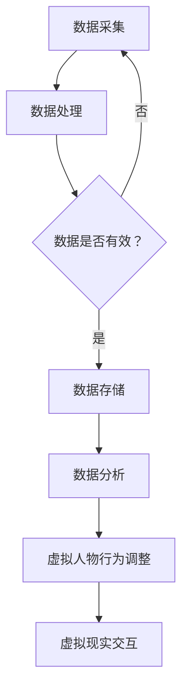

                 

关键词：数字孪生人、虚拟人物、商业应用、人工智能、虚拟现实、创业、元宇宙

## 摘要

随着人工智能（AI）和虚拟现实（VR）技术的快速发展，数字孪生人和虚拟人物在商业应用领域正逐渐崭露头角。本文旨在探讨数字孪生人的概念、技术原理、商业价值及其在创业中的应用，并通过具体实例分析其发展前景和面临的挑战。我们还将介绍相关的工具和资源，以便读者能够更好地理解和实践这一领域。

## 1. 背景介绍

### 1.1 数字孪生人的起源

数字孪生人（Digital Twin）最早由迈克尔·格里夫斯（Michael Grieves）在2002年提出，是指通过数字模型来复制现实世界中的物理实体。随着AI和VR技术的发展，数字孪生人逐步演变为一个拥有自我意识和交互能力的虚拟人物。这种虚拟人物不仅可以模拟人类的行为和情感，还能够根据外部环境进行调整和优化。

### 1.2 虚拟人物的商业需求

随着全球经济的数字化转型，企业对虚拟人物的需求日益增长。虚拟人物不仅可以作为品牌形象大使，提升品牌知名度，还可以在客户服务、市场推广、教育培训等多个领域发挥作用。例如，虚拟客服可以全天候提供高效、精准的服务，虚拟销售员可以增强客户的购物体验，虚拟教师可以提供个性化的教学方案。

## 2. 核心概念与联系

### 2.1 数字孪生人概念

数字孪生人是一个结合了物理实体和虚拟模型的系统，它能够实时反映物理实体的状态和行为，并通过数据分析和机器学习进行优化和预测。

### 2.2 虚拟人物技术架构

虚拟人物的技术架构通常包括以下几个方面：

- **人工智能引擎**：负责模拟人类行为和情感，包括语音识别、自然语言处理、情感分析等。
- **虚拟现实接口**：提供与用户的交互界面，包括三维建模、实时渲染等。
- **数据存储与分析**：收集用户行为数据，进行数据分析和机器学习，以优化虚拟人物的表现。

### 2.3 Mermaid 流程图



## 3. 核心算法原理 & 具体操作步骤

### 3.1 算法原理概述

数字孪生人的核心算法包括：

- **机器学习算法**：用于分析用户行为数据，预测用户需求和偏好。
- **自然语言处理算法**：用于处理和生成自然语言，实现虚拟人物与用户的对话。
- **情感识别算法**：用于分析用户的情感状态，并根据情感调整虚拟人物的行为。

### 3.2 算法步骤详解

1. **数据采集**：通过传感器和用户交互收集数据。
2. **数据处理**：对采集到的数据进行分析和清洗。
3. **机器学习模型训练**：使用处理后的数据训练机器学习模型。
4. **虚拟人物行为生成**：根据机器学习模型的预测结果，生成虚拟人物的行为。
5. **虚拟现实交互**：通过虚拟现实接口与用户进行交互。

### 3.3 算法优缺点

- **优点**：可以提高用户体验，降低运营成本，实现个性化服务。
- **缺点**：算法复杂度较高，对数据质量和计算资源要求较高。

### 3.4 算法应用领域

- **客户服务**：提供全天候、个性化的客户支持。
- **市场营销**：通过虚拟人物增强品牌形象和用户体验。
- **教育培训**：提供沉浸式的学习体验和个性化教学。

## 4. 数学模型和公式 & 详细讲解 & 举例说明

### 4.1 数学模型构建

数字孪生人的数学模型主要包括：

- **用户行为模型**：通过用户行为数据构建用户画像。
- **预测模型**：使用机器学习算法预测用户需求和偏好。
- **交互模型**：定义虚拟人物与用户之间的交互规则。

### 4.2 公式推导过程

用户行为模型可以使用以下公式表示：

\[ X(t) = \sum_{i=1}^{n} w_i \cdot f_i(t) \]

其中，\( X(t) \) 表示用户在时间 \( t \) 的行为特征，\( w_i \) 表示第 \( i \) 个特征的重要程度，\( f_i(t) \) 表示第 \( i \) 个特征在时间 \( t \) 的值。

### 4.3 案例分析与讲解

假设一个电商平台使用数字孪生人来提供个性化推荐服务。用户行为数据包括浏览历史、购买记录、评价等。通过构建用户行为模型，可以预测用户在未来的购物偏好。根据预测结果，虚拟人物可以为用户提供个性化的商品推荐。

## 5. 项目实践：代码实例和详细解释说明

### 5.1 开发环境搭建

开发环境包括Python编程环境、TensorFlow框架和Unity游戏引擎。

### 5.2 源代码详细实现

以下是使用TensorFlow实现用户行为模型的代码实例：

```python
import tensorflow as tf

# 构建模型
model = tf.keras.Sequential([
    tf.keras.layers.Dense(64, activation='relu', input_shape=(num_features,)),
    tf.keras.layers.Dense(64, activation='relu'),
    tf.keras.layers.Dense(1, activation='sigmoid')
])

# 编译模型
model.compile(optimizer='adam',
              loss='binary_crossentropy',
              metrics=['accuracy'])

# 训练模型
model.fit(x_train, y_train, epochs=10, batch_size=32)
```

### 5.3 代码解读与分析

这段代码首先导入TensorFlow库，然后构建了一个包含两个隐藏层的神经网络模型，用于预测用户的行为。模型使用Adam优化器和二分类交叉熵损失函数进行编译，并通过训练集进行训练。

### 5.4 运行结果展示

训练完成后，可以使用以下代码评估模型的性能：

```python
# 评估模型
loss, accuracy = model.evaluate(x_test, y_test)
print('Test accuracy:', accuracy)
```

## 6. 实际应用场景

### 6.1 客户服务

虚拟客服可以提供24/7的客户支持，快速响应客户的问题和需求。

### 6.2 市场营销

虚拟人物可以参与市场营销活动，提高品牌知名度和用户参与度。

### 6.3 教育培训

虚拟教师可以提供沉浸式的学习体验，帮助学生更好地理解和掌握知识。

## 7. 未来应用展望

随着技术的不断发展，数字孪生人和虚拟人物将在更多领域得到应用，包括医疗、金融、娱乐等。未来，我们将看到更多创新的应用场景，为企业和个人带来更大的价值。

## 8. 工具和资源推荐

### 8.1 学习资源推荐

- 《深度学习》（Goodfellow, Bengio, Courville）
- 《自然语言处理综论》（Jurafsky, Martin）

### 8.2 开发工具推荐

- TensorFlow
- Unity

### 8.3 相关论文推荐

- “Digital Twins: A Vision for the Future of Production” (Michael Grieves, 2002)
- “A Survey on Digital Twin: State of the Art and Research Opportunities” (Zhang et al., 2020)

## 9. 总结：未来发展趋势与挑战

### 9.1 研究成果总结

数字孪生人和虚拟人物技术已经在多个领域取得重要成果，显示出巨大的商业价值。

### 9.2 未来发展趋势

随着AI和VR技术的进步，数字孪生人和虚拟人物将在更多领域得到应用，并不断优化和提升用户体验。

### 9.3 面临的挑战

数字孪生人和虚拟人物技术仍面临数据隐私、伦理和安全性等方面的挑战。

### 9.4 研究展望

未来，我们需要进一步研究如何提高数字孪生人和虚拟人物的智能化程度，使其更好地服务于人类。

## 附录：常见问题与解答

### 9.1 什么是数字孪生人？

数字孪生人是一个通过数字模型复制现实世界中物理实体的系统，它可以实时反映物理实体的状态和行为，并通过数据分析和机器学习进行优化和预测。

### 9.2 虚拟人物有什么商业价值？

虚拟人物可以提供24/7的客户服务，提高品牌知名度，增强市场营销效果，并在教育培训、医疗等领域发挥重要作用。

### 9.3 如何搭建一个虚拟人物系统？

搭建虚拟人物系统需要熟练掌握人工智能、自然语言处理、虚拟现实等技术，并具备一定的编程技能。常用的工具包括TensorFlow、Unity等。

## 作者署名

作者：禅与计算机程序设计艺术 / Zen and the Art of Computer Programming
----------------------------------------------------------------

