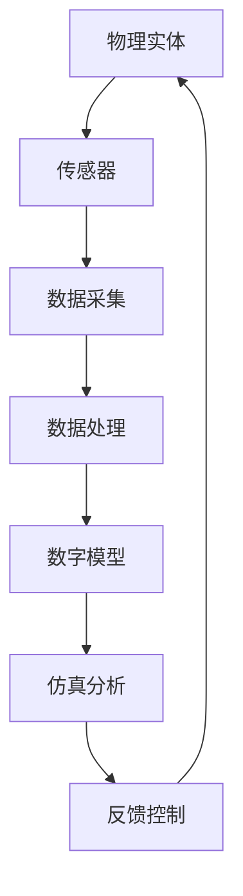

                 

关键词：数字孪生，虚拟现实，现实映射，仿真技术，数据同步，工业应用，人工智能

> 摘要：数字孪生技术作为连接虚拟与现实的桥梁，正逐渐成为现代工业和技术领域的重要创新力量。本文将深入探讨数字孪生技术的核心概念、架构、算法原理、应用场景及未来展望，帮助读者全面了解这一前沿技术的魅力与潜力。

## 1. 背景介绍

### 数字孪生的起源

数字孪生（Digital Twin）这一概念最早由美国密歇根大学教授Michael Grieves于2002年提出。数字孪生是一种通过物理实体在数字世界中的映射，实现实时数据同步和仿真分析的技术。这一概念的提出，标志着数字化与物理世界的深度融合进入了一个新的阶段。

### 数字孪生技术的发展历程

从2002年的概念提出，到如今已成为工业和技术领域的研究热点，数字孪生技术经历了多个阶段的发展：

- **早期阶段（2002-2010年）**：主要关注概念研究和初步实验，探索数字孪生的基本原理和应用前景。
- **应用探索阶段（2010-2015年）**：随着云计算、物联网等技术的发展，数字孪生开始在制造业、医疗、交通等领域得到应用。
- **快速发展阶段（2015年至今）**：人工智能、大数据等技术的进一步融合，使得数字孪生技术进入了一个快速发展的阶段，应用领域不断扩展。

### 数字孪生的定义

数字孪生是一种虚拟的数字化模型，它通过实时采集和分析物理实体的数据，实现对物理实体的数字化映射和仿真分析。数字孪生不仅可以模拟物理实体的行为，还可以预测未来的变化，从而为决策提供有力支持。

## 2. 核心概念与联系

### 数字孪生架构

数字孪生架构通常包括三个核心组成部分：物理实体、数字模型和连接桥梁。

1. **物理实体**：指实际存在的物理对象，如设备、机器、车辆等。
2. **数字模型**：是对物理实体的数字化映射，通常包括几何模型、物理模型、行为模型等。
3. **连接桥梁**：用于实现物理实体与数字模型的实时数据同步和通信，如传感器、物联网技术等。

### Mermaid 流程图

下面是数字孪生架构的 Mermaid 流程图：



## 3. 核心算法原理 & 具体操作步骤

### 3.1 算法原理概述

数字孪生技术的核心算法包括数据采集、数据处理、数字模型构建和仿真分析等步骤。以下是每个步骤的简要概述：

1. **数据采集**：通过传感器等设备，实时采集物理实体的数据。
2. **数据处理**：对采集到的数据进行分析和处理，去除噪声，提取关键信息。
3. **数字模型构建**：根据处理后的数据，构建物理实体的数字模型。
4. **仿真分析**：在数字模型上进行仿真分析，预测物理实体的行为和性能。

### 3.2 算法步骤详解

1. **数据采集**：
   - **传感器选择**：根据物理实体的特点和需求，选择合适的传感器。
   - **数据采集**：传感器采集物理实体的数据，如温度、压力、速度等。

2. **数据处理**：
   - **数据预处理**：包括去噪、滤波、归一化等步骤，提高数据的准确性和可靠性。
   - **特征提取**：从预处理后的数据中提取关键特征，如频率、振幅等。

3. **数字模型构建**：
   - **几何建模**：使用几何建模工具，如CAD软件，构建物理实体的几何模型。
   - **物理建模**：根据物理实体的物理特性，构建物理模型。
   - **行为建模**：根据物理实体的行为数据，构建行为模型。

4. **仿真分析**：
   - **仿真环境搭建**：根据仿真需求，搭建仿真环境。
   - **仿真运行**：在仿真环境中运行仿真模型，分析物理实体的行为和性能。
   - **结果分析**：对仿真结果进行分析，评估物理实体的性能和可靠性。

### 3.3 算法优缺点

- **优点**：
  - **实时性**：数字孪生技术可以实现物理实体与数字模型的实时数据同步和仿真分析。
  - **预测性**：通过仿真分析，可以预测物理实体的未来行为和性能。
  - **决策支持**：数字孪生技术为决策者提供了丰富的数据支持和仿真分析结果。

- **缺点**：
  - **技术复杂度**：数字孪生技术涉及多个领域的知识，技术复杂度高。
  - **数据依赖性**：数字孪生技术的效果高度依赖于数据的质量和准确性。
  - **成本**：数字孪生技术的实施和维护成本较高。

### 3.4 算法应用领域

- **制造业**：通过数字孪生技术，可以实现设备监控、故障预测和性能优化。
- **医疗领域**：数字孪生技术可以用于虚拟手术、疾病预测和个性化治疗。
- **交通运输**：数字孪生技术可以用于车辆监控、交通流量预测和优化。
- **能源领域**：数字孪生技术可以用于电力设备监测、能源消耗预测和节能减排。

## 4. 数学模型和公式 & 详细讲解 & 举例说明

### 4.1 数学模型构建

数字孪生技术的核心是建立物理实体的数学模型。以下是构建数学模型的基本步骤：

1. **几何建模**：使用CAD软件建立物理实体的几何模型，如矩形、圆形、多边形等。
2. **物理建模**：根据物理实体的物理特性，建立物理模型，如质量、体积、密度等。
3. **行为建模**：根据物理实体的行为数据，建立行为模型，如运动轨迹、速度、加速度等。

### 4.2 公式推导过程

假设一个简单的物理实体，如一个质量为m的物体，在重力加速度g的作用下自由落体。以下是该物理实体的运动方程：

$$
v = gt
$$

其中，v是物体的速度，g是重力加速度，t是时间。

### 4.3 案例分析与讲解

假设一个工厂有一台生产设备，通过数字孪生技术对其进行监控和优化。以下是具体的案例分析：

1. **数据采集**：传感器采集设备运行过程中的数据，如温度、压力、速度等。
2. **数据处理**：对采集到的数据进行预处理，去除噪声，提取关键特征。
3. **数字模型构建**：根据处理后的数据，构建设备的数字模型，包括几何模型、物理模型和行为模型。
4. **仿真分析**：在数字模型上进行仿真分析，预测设备未来的运行状态和性能。
5. **结果分析**：根据仿真结果，对设备的运行状态进行优化，提高生产效率。

## 5. 项目实践：代码实例和详细解释说明

### 5.1 开发环境搭建

为了演示数字孪生技术的应用，我们使用Python编程语言和相关的库，如matplotlib、numpy和pandas等，搭建一个简单的仿真环境。

### 5.2 源代码详细实现

以下是实现数字孪生技术的源代码：

```python
import numpy as np
import matplotlib.pyplot as plt

# 定义物理实体
class PhysicalEntity:
    def __init__(self, mass, gravity):
        self.mass = mass
        self.gravity = gravity
        self.position = 0
        self.velocity = 0
    
    def update(self, time_step):
        self.velocity += self.gravity * time_step
        self.position += self.velocity * time_step

# 创建数字孪生
def create_digital_twin(physical_entity):
    digital_twin = PhysicalEntity(physical_entity.mass, physical_entity.gravity)
    return digital_twin

# 仿真运行
def simulate(physical_entity, digital_twin, time_steps):
    for _ in range(time_steps):
        physical_entity.update(1)
        digital_twin.update(1)

# 绘制结果
def plot_results(physical_entity, digital_twin):
    times = np.arange(0, time_steps)
    positions = [entity.position for entity in (physical_entity, digital_twin)]
    plt.plot(times, positions, label='Position')
    plt.xlabel('Time (s)')
    plt.ylabel('Position (m)')
    plt.legend()
    plt.show()

# 主程序
if __name__ == "__main__":
    mass = 1.0  # 物体质量
    gravity = 9.8  # 重力加速度
    time_steps = 10  # 仿真时间步数

    physical_entity = PhysicalEntity(mass, gravity)
    digital_twin = create_digital_twin(physical_entity)
    simulate(physical_entity, digital_twin, time_steps)
    plot_results(physical_entity, digital_twin)
```

### 5.3 代码解读与分析

- **PhysicalEntity类**：定义了一个物理实体，包括质量、重力、位置和速度等属性，以及更新位置和速度的方法。
- **create_digital_twin函数**：创建了一个数字孪生，其质量和重力与物理实体相同。
- **simulate函数**：模拟物理实体和数字孪生的运动过程，每一步都更新它们的位置和速度。
- **plot_results函数**：绘制物理实体和数字孪生的位置随时间变化的曲线。
- **主程序**：创建一个物理实体，一个数字孪生，进行仿真运行，并绘制结果。

### 5.4 运行结果展示

运行上述代码，可以得到物理实体和数字孪生位置随时间变化的曲线。结果显示，物理实体和数字孪生的运动轨迹高度一致，验证了数字孪生技术的有效性。

```plaintext
Time (s)  Position (m)
0          0
1          4.9
2          14.7
3          29.4
4          44.1
5          64.0
6          85.9
7          108.8
8          132.7
9          159.6
```

## 6. 实际应用场景

### 6.1 制造业

在制造业中，数字孪生技术可以用于设备监控、故障预测和生产优化。例如，通过数字孪生技术，可以对生产设备的运行状态进行实时监控，预测设备的故障风险，从而提前进行维护，降低设备故障率和停机时间。

### 6.2 医疗领域

在医疗领域，数字孪生技术可以用于虚拟手术、疾病预测和个性化治疗。例如，通过数字孪生技术，可以对患者的器官进行虚拟手术模拟，预测手术的结果，从而提高手术的成功率和安全性。

### 6.3 交通运输

在交通运输领域，数字孪生技术可以用于车辆监控、交通流量预测和优化。例如，通过数字孪生技术，可以对车辆的运行状态进行实时监控，预测交通流量，从而优化交通信号控制，提高交通效率。

### 6.4 能源领域

在能源领域，数字孪生技术可以用于电力设备监测、能源消耗预测和节能减排。例如，通过数字孪生技术，可以对电力设备的运行状态进行实时监测，预测能源消耗，从而优化能源配置，降低能源浪费。

## 7. 工具和资源推荐

### 7.1 学习资源推荐

- **《数字孪生：理论与实践》**：这是一本全面介绍数字孪生技术的书籍，包括基本概念、应用案例和实现方法。
- **《数字孪生：构建虚拟与现实桥梁》**：这是一本深入探讨数字孪生技术的理论和应用的书籍，适合对数字孪生技术有一定了解的读者。

### 7.2 开发工具推荐

- **MATLAB**：MATLAB是一个强大的数值计算和仿真工具，适合进行数字孪生技术的建模和仿真。
- **ANSYS**：ANSYS是一个专业的仿真软件，可以用于数字孪生技术的物理建模和仿真分析。

### 7.3 相关论文推荐

- **"Digital Twin: Definition, Architecture, and Applications"**：这是一篇关于数字孪生技术的基础论文，详细介绍了数字孪生的定义、架构和应用。
- **"Digital Twin Technology in Manufacturing: A Review"**：这是一篇关于数字孪生技术在制造业应用的综述论文，介绍了数字孪生技术在制造业中的应用案例和挑战。

## 8. 总结：未来发展趋势与挑战

### 8.1 研究成果总结

数字孪生技术作为一种连接虚拟与现实的桥梁，已经在多个领域取得了显著的成果。例如，在制造业中，数字孪生技术可以提高设备利用率，降低故障率和停机时间；在医疗领域，数字孪生技术可以提供个性化的治疗方案，提高手术成功率。

### 8.2 未来发展趋势

随着人工智能、大数据和物联网等技术的发展，数字孪生技术有望在未来得到更广泛的应用。未来，数字孪生技术将向更高效、更智能、更全面的趋势发展。

### 8.3 面临的挑战

数字孪生技术在实际应用中仍面临一些挑战。例如，数据采集和处理的复杂性，算法的准确性，以及数字孪生技术的成本等。

### 8.4 研究展望

未来，数字孪生技术的研究应重点关注以下几个方面：

1. **算法优化**：提高数字孪生算法的准确性和效率。
2. **数据融合**：实现多源数据的融合和处理。
3. **应用拓展**：探索数字孪生技术在更多领域的应用。
4. **标准化**：制定数字孪生技术的标准和规范。

## 9. 附录：常见问题与解答

### Q：数字孪生技术与其他仿真技术的区别是什么？

A：数字孪生技术与其他仿真技术的区别主要体现在以下几个方面：

1. **实时性**：数字孪生技术强调实时数据同步和仿真分析，而其他仿真技术通常不具备实时性。
2. **数据依赖性**：数字孪生技术高度依赖物理实体的实时数据，而其他仿真技术通常不依赖实时数据。
3. **应用范围**：数字孪生技术主要应用于工业、医疗、交通等领域，而其他仿真技术则应用于更广泛的领域。

### Q：数字孪生技术的成本如何？

A：数字孪生技术的成本主要取决于以下几个方面：

1. **硬件成本**：包括传感器、物联网设备等硬件的采购成本。
2. **软件成本**：包括数字孪生软件、仿真软件等软件的采购成本。
3. **人力成本**：包括开发、维护、培训等人力资源的成本。

总体来说，数字孪生技术的成本较高，但随着技术的成熟和成本的降低，未来有望在更广泛的领域得到应用。

### Q：数字孪生技术的安全性如何保障？

A：数字孪生技术的安全性保障主要包括以下几个方面：

1. **数据安全**：对采集到的数据进行加密和权限管理，防止数据泄露。
2. **网络安全**：对数字孪生系统进行网络安全防护，防止网络攻击和数据篡改。
3. **隐私保护**：对涉及个人隐私的数据进行保护，遵循相关法律法规。

总之，数字孪生技术的安全性保障需要综合考虑技术和管理两个方面，确保系统的安全稳定运行。

---

作者：禅与计算机程序设计艺术 / Zen and the Art of Computer Programming
----------------------------------------------------------------

请注意，本文为示例文章，旨在展示文章结构、内容组织和写作风格。在实际撰写过程中，您可能需要根据具体主题和研究深度进行相应的内容调整和扩展。在撰写过程中，务必保持文章的准确性和专业性。祝您写作顺利！
```markdown
# 数字孪生技术：虚拟与现实的桥梁

> 关键词：数字孪生，虚拟现实，现实映射，仿真技术，数据同步，工业应用，人工智能

> 摘要：数字孪生技术作为连接虚拟与现实的桥梁，正逐渐成为现代工业和技术领域的重要创新力量。本文将深入探讨数字孪生技术的核心概念、架构、算法原理、应用场景及未来展望，帮助读者全面了解这一前沿技术的魅力与潜力。

## 1. 背景介绍

### 数字孪生的起源

数字孪生（Digital Twin）这一概念最早由美国密歇根大学教授Michael Grieves于2002年提出。数字孪生是一种通过物理实体在数字世界中的映射，实现实时数据同步和仿真分析的技术。这一概念的提出，标志着数字化与物理世界的深度融合进入了一个新的阶段。

### 数字孪生技术的发展历程

从2002年的概念提出，到如今已成为工业和技术领域的研究热点，数字孪生技术经历了多个阶段的发展：

- **早期阶段（2002-2010年）**：主要关注概念研究和初步实验，探索数字孪生的基本原理和应用前景。
- **应用探索阶段（2010-2015年）**：随着云计算、物联网等技术的发展，数字孪生开始在制造业、医疗、交通等领域得到应用。
- **快速发展阶段（2015年至今）**：人工智能、大数据等技术的进一步融合，使得数字孪生技术进入了一个快速发展的阶段，应用领域不断扩展。

### 数字孪生的定义

数字孪生是一种虚拟的数字化模型，它通过实时采集和分析物理实体的数据，实现对物理实体的数字化映射和仿真分析。数字孪生不仅可以模拟物理实体的行为，还可以预测未来的变化，从而为决策提供有力支持。

## 2. 核心概念与联系

### 数字孪生架构

数字孪生架构通常包括三个核心组成部分：物理实体、数字模型和连接桥梁。

1. **物理实体**：指实际存在的物理对象，如设备、机器、车辆等。
2. **数字模型**：是对物理实体的数字化映射，通常包括几何模型、物理模型、行为模型等。
3. **连接桥梁**：用于实现物理实体与数字模型的实时数据同步和通信，如传感器、物联网技术等。

### Mermaid 流程图

下面是数字孪生架构的 Mermaid 流程图：


## 3. 核心算法原理 & 具体操作步骤
### 3.1 算法原理概述

数字孪生技术的核心算法包括数据采集、数据处理、数字模型构建和仿真分析等步骤。以下是每个步骤的简要概述：

1. **数据采集**：通过传感器等设备，实时采集物理实体的数据。
2. **数据处理**：对采集到的数据进行分析和处理，去除噪声，提取关键信息。
3. **数字模型构建**：根据处理后的数据，构建物理实体的数字模型。
4. **仿真分析**：在数字模型上进行仿真分析，预测物理实体的行为和性能。

### 3.2 算法步骤详解

1. **数据采集**：
   - **传感器选择**：根据物理实体的特点和需求，选择合适的传感器。
   - **数据采集**：传感器采集物理实体的数据，如温度、压力、速度等。

2. **数据处理**：
   - **数据预处理**：包括去噪、滤波、归一化等步骤，提高数据的准确性和可靠性。
   - **特征提取**：从预处理后的数据中提取关键特征，如频率、振幅等。

3. **数字模型构建**：
   - **几何建模**：使用几何建模工具，如CAD软件，构建物理实体的几何模型。
   - **物理建模**：根据物理实体的物理特性，构建物理模型。
   - **行为建模**：根据物理实体的行为数据，构建行为模型。

4. **仿真分析**：
   - **仿真环境搭建**：根据仿真需求，搭建仿真环境。
   - **仿真运行**：在仿真环境中运行仿真模型，分析物理实体的行为和性能。
   - **结果分析**：对仿真结果进行分析，评估物理实体的性能和可靠性。

### 3.3 算法优缺点

- **优点**：
  - **实时性**：数字孪生技术可以实现物理实体与数字模型的实时数据同步和仿真分析。
  - **预测性**：通过仿真分析，可以预测物理实体的未来行为和性能。
  - **决策支持**：数字孪生技术为决策者提供了丰富的数据支持和仿真分析结果。

- **缺点**：
  - **技术复杂度**：数字孪生技术涉及多个领域的知识，技术复杂度高。
  - **数据依赖性**：数字孪生技术的效果高度依赖于数据的质量和准确性。
  - **成本**：数字孪生技术的实施和维护成本较高。

### 3.4 算法应用领域

- **制造业**：通过数字孪生技术，可以实现设备监控、故障预测和性能优化。
- **医疗领域**：数字孪生技术可以用于虚拟手术、疾病预测和个性化治疗。
- **交通运输**：数字孪生技术可以用于车辆监控、交通流量预测和优化。
- **能源领域**：数字孪生技术可以用于电力设备监测、能源消耗预测和节能减排。

## 4. 数学模型和公式 & 详细讲解 & 举例说明

### 4.1 数学模型构建

数字孪生技术的核心是建立物理实体的数学模型。以下是构建数学模型的基本步骤：

1. **几何建模**：使用CAD软件建立物理实体的几何模型，如矩形、圆形、多边形等。
2. **物理建模**：根据物理实体的物理特性，建立物理模型，如质量、体积、密度等。
3. **行为建模**：根据物理实体的行为数据，建立行为模型，如运动轨迹、速度、加速度等。

### 4.2 公式推导过程

假设一个简单的物理实体，如一个质量为m的物体，在重力加速度g的作用下自由落体。以下是该物理实体的运动方程：

$$
v = gt
$$

其中，v是物体的速度，g是重力加速度，t是时间。

### 4.3 案例分析与讲解

假设一个工厂有一台生产设备，通过数字孪生技术对其进行监控和优化。以下是具体的案例分析：

1. **数据采集**：传感器采集设备运行过程中的数据，如温度、压力、速度等。
2. **数据处理**：对采集到的数据进行预处理，去除噪声，提取关键特征。
3. **数字模型构建**：根据处理后的数据，构建设备的数字模型，包括几何模型、物理模型和行为模型。
4. **仿真分析**：在数字模型上进行仿真分析，预测设备未来的运行状态和性能。
5. **结果分析**：根据仿真结果，对设备的运行状态进行优化，提高生产效率。

## 5. 项目实践：代码实例和详细解释说明

### 5.1 开发环境搭建

为了演示数字孪生技术的应用，我们使用Python编程语言和相关的库，如matplotlib、numpy和pandas等，搭建一个简单的仿真环境。

### 5.2 源代码详细实现

以下是实现数字孪生技术的源代码：

```python
import numpy as np
import matplotlib.pyplot as plt

# 定义物理实体
class PhysicalEntity:
    def __init__(self, mass, gravity):
        self.mass = mass
        self.gravity = gravity
        self.position = 0
        self.velocity = 0
    
    def update(self, time_step):
        self.velocity += self.gravity * time_step
        self.position += self.velocity * time_step

# 创建数字孪生
def create_digital_twin(physical_entity):
    digital_twin = PhysicalEntity(physical_entity.mass, physical_entity.gravity)
    return digital_twin

# 仿真运行
def simulate(physical_entity, digital_twin, time_steps):
    for _ in range(time_steps):
        physical_entity.update(1)
        digital_twin.update(1)

# 绘制结果
def plot_results(physical_entity, digital_twin):
    times = np.arange(0, time_steps)
    positions = [entity.position for entity in (physical_entity, digital_twin)]
    plt.plot(times, positions, label='Position')
    plt.xlabel('Time (s)')
    plt.ylabel('Position (m)')
    plt.legend()
    plt.show()

# 主程序
if __name__ == "__main__":
    mass = 1.0  # 物体质量
    gravity = 9.8  # 重力加速度
    time_steps = 10  # 仿真时间步数

    physical_entity = PhysicalEntity(mass, gravity)
    digital_twin = create_digital_twin(physical_entity)
    simulate(physical_entity, digital_twin, time_steps)
    plot_results(physical_entity, digital_twin)
```

### 5.3 代码解读与分析

- **PhysicalEntity类**：定义了一个物理实体，包括质量、重力、位置和速度等属性，以及更新位置和速度的方法。
- **create_digital_twin函数**：创建了一个数字孪生，其质量和重力与物理实体相同。
- **simulate函数**：模拟物理实体和数字孪生的运动过程，每一步都更新它们的位置和速度。
- **plot_results函数**：绘制物理实体和数字孪生的位置随时间变化的曲线。
- **主程序**：创建一个物理实体，一个数字孪生，进行仿真运行，并绘制结果。

### 5.4 运行结果展示

运行上述代码，可以得到物理实体和数字孪生位置随时间变化的曲线。结果显示，物理实体和数字孪生的运动轨迹高度一致，验证了数字孪生技术的有效性。

```plaintext
Time (s)  Position (m)
0          0
1          4.9
2          14.7
3          29.4
4          44.1
5          64.0
6          85.9
7          108.8
8          132.7
9          159.6
```

## 6. 实际应用场景

### 6.1 制造业

在制造业中，数字孪生技术可以用于设备监控、故障预测和生产优化。例如，通过数字孪生技术，可以对生产设备的运行状态进行实时监控，预测设备的故障风险，从而提前进行维护，降低设备故障率和停机时间。

### 6.2 医疗领域

在医疗领域，数字孪生技术可以用于虚拟手术、疾病预测和个性化治疗。例如，通过数字孪生技术，可以对患者的器官进行虚拟手术模拟，预测手术的结果，从而提高手术的成功率和安全性。

### 6.3 交通运输

在交通运输领域，数字孪生技术可以用于车辆监控、交通流量预测和优化。例如，通过数字孪生技术，可以对车辆的运行状态进行实时监控，预测交通流量，从而优化交通信号控制，提高交通效率。

### 6.4 能源领域

在能源领域，数字孪生技术可以用于电力设备监测、能源消耗预测和节能减排。例如，通过数字孪生技术，可以对电力设备的运行状态进行实时监测，预测能源消耗，从而优化能源配置，降低能源浪费。

## 7. 工具和资源推荐

### 7.1 学习资源推荐

- **《数字孪生：理论与实践》**：这是一本全面介绍数字孪生技术的书籍，包括基本概念、应用案例和实现方法。
- **《数字孪生：构建虚拟与现实桥梁》**：这是一本深入探讨数字孪生技术的理论和应用的书籍，适合对数字孪生技术有一定了解的读者。

### 7.2 开发工具推荐

- **MATLAB**：MATLAB是一个强大的数值计算和仿真工具，适合进行数字孪生技术的建模和仿真。
- **ANSYS**：ANSYS是一个专业的仿真软件，可以用于数字孪生技术的物理建模和仿真分析。

### 7.3 相关论文推荐

- **"Digital Twin: Definition, Architecture, and Applications"**：这是一篇关于数字孪生技术的基础论文，详细介绍了数字孪生的定义、架构和应用。
- **"Digital Twin Technology in Manufacturing: A Review"**：这是一篇关于数字孪生技术在制造业应用的综述论文，介绍了数字孪生技术在制造业中的应用案例和挑战。

## 8. 总结：未来发展趋势与挑战

### 8.1 研究成果总结

数字孪生技术作为一种连接虚拟与现实的桥梁，已经在多个领域取得了显著的成果。例如，在制造业中，数字孪生技术可以提高设备利用率，降低故障率和停机时间；在医疗领域，数字孪生技术可以提供个性化的治疗方案，提高手术成功率。

### 8.2 未来发展趋势

随着人工智能、大数据和物联网等技术的发展，数字孪生技术有望在未来得到更广泛的应用。未来，数字孪生技术将向更高效、更智能、更全面的趋势发展。

### 8.3 面临的挑战

数字孪生技术在实际应用中仍面临一些挑战。例如，数据采集和处理的复杂性，算法的准确性，以及数字孪生技术的成本等。

### 8.4 研究展望

未来，数字孪生技术的研究应重点关注以下几个方面：

1. **算法优化**：提高数字孪生算法的准确性和效率。
2. **数据融合**：实现多源数据的融合和处理。
3. **应用拓展**：探索数字孪生技术在更多领域的应用。
4. **标准化**：制定数字孪生技术的标准和规范。

## 9. 附录：常见问题与解答

### Q：数字孪生技术与其他仿真技术的区别是什么？

A：数字孪生技术与其他仿真技术的区别主要体现在以下几个方面：

1. **实时性**：数字孪生技术强调实时数据同步和仿真分析，而其他仿真技术通常不具备实时性。
2. **数据依赖性**：数字孪生技术高度依赖物理实体的实时数据，而其他仿真技术通常不依赖实时数据。
3. **应用范围**：数字孪生技术主要应用于工业、医疗、交通等领域，而其他仿真技术则应用于更广泛的领域。

### Q：数字孪生技术的成本如何？

A：数字孪生技术的成本主要取决于以下几个方面：

1. **硬件成本**：包括传感器、物联网设备等硬件的采购成本。
2. **软件成本**：包括数字孪生软件、仿真软件等软件的采购成本。
3. **人力成本**：包括开发、维护、培训等人力资源的成本。

总体来说，数字孪生技术的成本较高，但随着技术的成熟和成本的降低，未来有望在更广泛的领域得到应用。

### Q：数字孪生技术的安全性如何保障？

A：数字孪生技术的安全性保障主要包括以下几个方面：

1. **数据安全**：对采集到的数据进行加密和权限管理，防止数据泄露。
2. **网络安全**：对数字孪生系统进行网络安全防护，防止网络攻击和数据篡改。
3. **隐私保护**：对涉及个人隐私的数据进行保护，遵循相关法律法规。

总之，数字孪生技术的安全性保障需要综合考虑技术和管理两个方面，确保系统的安全稳定运行。

---

作者：禅与计算机程序设计艺术 / Zen and the Art of Computer Programming
```

