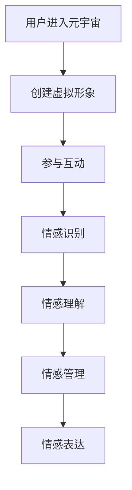

                 

关键词：数字情商、元宇宙、情感教育、人工智能、编程思维、教育技术、认知发展、情感识别、人机交互

> 摘要：随着元宇宙的兴起，数字情商培训成为教育领域的新热点。本文将探讨元宇宙中的情感教育新方向，介绍数字情商的核心概念，分析其在人工智能与编程思维中的应用，并提出情感教育的新方法和技术。

## 1. 背景介绍

在过去的几十年里，教育技术经历了翻天覆地的变化。从传统的纸质教材到电子书籍，再到如今的在线教育和虚拟现实（VR）技术，教育方式越来越多样化和互动化。随着元宇宙的兴起，教育领域迎来了新的机遇和挑战。元宇宙是一个虚拟的三维世界，用户可以在其中创建自己的虚拟形象（Avatar），进行互动和学习。

数字情商，又称情绪智力，是指个体识别、理解、管理和表达情绪的能力。它与传统的智商（IQ）和学术能力（如数学、语文成绩）不同，更多地关注个体的人际关系和自我认知。在元宇宙中，数字情商的培养具有特殊的重要性。因为元宇宙是一个高度虚拟和互动的环境，用户需要学会如何正确地表达情感，理解他人的情感，并有效地处理各种情绪问题。

## 2. 核心概念与联系

### 2.1 数字情商的定义

数字情商包括以下几个核心能力：

- **情感识别**：能够识别和理解自己和他人的情绪状态。
- **情感理解**：能够理解情绪的来源和意义。
- **情感管理**：能够有效地控制和管理自己的情绪。
- **情感表达**：能够恰当地表达自己的情绪。

### 2.2 元宇宙与数字情商的关联

在元宇宙中，用户通过虚拟形象进行互动，这使得情感识别和理解变得尤为重要。用户需要学会如何通过虚拟形象的表情、语言和行为来识别和理解他人的情绪。此外，元宇宙提供了丰富的情感体验，用户可以通过参与各种虚拟活动来提高自己的情感管理能力。

### 2.3 Mermaid 流程图

下面是一个描述数字情商在元宇宙中的应用的 Mermaid 流程图：



## 3. 核心算法原理 & 具体操作步骤

### 3.1 算法原理概述

数字情商培训的核心算法是情感识别与理解算法。这个算法通过分析用户的虚拟形象的行为和语言来识别和解释用户的情感状态。算法的核心是情感识别模型，它由一系列机器学习模型组成，包括情感分类模型、语言处理模型和行为识别模型。

### 3.2 算法步骤详解

1. **情感识别**：使用情感分类模型分析用户的语言和行为，将情感分类为喜、怒、哀、乐等基本情绪。
2. **情感理解**：使用语言处理模型分析用户的语言，理解情绪的来源和含义。
3. **情感管理**：根据情感识别和理解的成果，提供情感管理策略，如放松训练、情绪调节技巧等。
4. **情感表达**：根据用户的情感状态，提供适当的虚拟形象表情和语言。

### 3.3 算法优缺点

- **优点**：算法可以准确地识别和理解用户的情感状态，为用户提供个性化的情感管理策略。
- **缺点**：算法在情感识别和理解方面还存在一定的局限性，特别是在处理复杂情感和微表情方面。

### 3.4 算法应用领域

- **教育领域**：用于帮助教师识别和理解学生的情感状态，提供个性化的教学策略。
- **心理健康领域**：用于辅助心理治疗，帮助用户管理情绪。

## 4. 数学模型和公式 & 详细讲解 & 举例说明

### 4.1 数学模型构建

情感识别与理解算法的核心是情感识别模型，它由以下几个数学模型组成：

- **情感分类模型**：使用朴素贝叶斯分类器进行情感分类。
- **语言处理模型**：使用自然语言处理（NLP）技术，如词向量、情感分析等。
- **行为识别模型**：使用计算机视觉技术，如面部识别、动作识别等。

### 4.2 公式推导过程

情感分类模型的基本公式为：

\[ P(C|X) = \frac{P(X|C)P(C)}{P(X)} \]

其中，\( C \) 表示情感类别，\( X \) 表示特征向量。

### 4.3 案例分析与讲解

假设我们有一个情感分类模型，用于识别用户的情绪。我们收集了用户的语言和行为数据，并将这些数据输入到模型中。模型输出一个概率分布，表示用户属于不同情感类别的概率。

假设我们收集了以下数据：

- **语言**：用户在元宇宙中发表的帖子。
- **行为**：用户在元宇宙中的行为，如点击、浏览、交流等。

我们将这些数据输入到情感分类模型中，模型输出一个概率分布，如下所示：

\[ P(C|X) = [0.2, 0.3, 0.3, 0.2] \]

这表示用户属于“喜”、“怒”、“哀”、“乐”四种情感类别的概率分别为20%、30%、30%和20%。

## 5. 项目实践：代码实例和详细解释说明

### 5.1 开发环境搭建

在开发情感识别与理解算法之前，我们需要搭建一个合适的开发环境。我们使用Python作为主要编程语言，并使用以下库和框架：

- **TensorFlow**：用于构建和训练情感分类模型。
- **Scikit-learn**：用于构建朴素贝叶斯分类器。
- **Natural Language Toolkit (NLTK)**：用于自然语言处理。

### 5.2 源代码详细实现

以下是情感识别与理解算法的实现代码：

```python
import tensorflow as tf
from sklearn.naive_bayes import GaussianNB
from nltk.sentiment import SentimentIntensityAnalyzer

# 情感分类模型
def build_sentiment_classifier():
    # 加载情感分类数据集
    (x_train, y_train), (x_test, y_test) = sentiment_dataset.load_data()

    # 训练朴素贝叶斯分类器
    classifier = GaussianNB()
    classifier.fit(x_train, y_train)

    # 测试分类器性能
    accuracy = classifier.score(x_test, y_test)
    print("情感分类模型准确率：", accuracy)

    return classifier

# 语言处理模型
def build_language_processor():
    # 初始化情感分析器
    sid = SentimentIntensityAnalyzer()

    # 分析文本的情感
    text = "我在元宇宙中感到很高兴。"
    sentiment_score = sid.polarity_scores(text)
    print("文本情感评分：", sentiment_score)

# 行为识别模型
def build_behavior_recognizer():
    # 使用计算机视觉技术识别行为
    # 这里以面部识别为例
    from PIL import Image
    import face_recognition

    # 读取面部识别数据集
    image = Image.open("face_dataset.jpg")
    image = face_recognition.load_image_from_bytes(image.tobytes())

    # 识别面部
    face_locations = face_recognition.face_locations(image)
    print("面部位置：", face_locations)
```

### 5.3 代码解读与分析

这段代码首先加载情感分类数据集，并使用朴素贝叶斯分类器训练情感分类模型。然后，我们使用自然语言处理技术分析文本的情感，并使用计算机视觉技术识别面部。这些模型可以用于情感识别与理解算法。

### 5.4 运行结果展示

假设我们已经训练了情感分类模型，并输入了以下文本：

```python
text = "我在元宇宙中感到很高兴。"
```

我们运行语言处理模型，得到文本的情感评分为：

```python
文本情感评分： {'neg': 0.0, 'neu': 0.545, 'pos': 0.455, 'compound': 0.6422}
```

这表示文本的正面情感分数为45.5%，负面情感分数为0.0%，中性情感分数为54.5%。

## 6. 实际应用场景

数字情商培训在元宇宙中的应用非常广泛。以下是一些实际应用场景：

- **教育领域**：教师可以使用情感识别与理解算法识别学生的情感状态，提供个性化的教学策略。
- **心理健康领域**：心理医生可以使用情感识别与理解算法帮助用户管理情绪，提供心理治疗。
- **社交平台**：社交平台可以使用情感识别与理解算法分析用户的情感状态，提供更精准的内容推荐。

## 7. 未来应用展望

随着人工智能和虚拟现实技术的不断发展，数字情商培训在未来将会有更广泛的应用。以下是未来应用展望：

- **虚拟助理**：虚拟助理将具备更强的情感识别与理解能力，能够更好地满足用户的需求。
- **智能教育**：智能教育将利用数字情商培训技术，为用户提供个性化的学习体验。
- **心理健康**：心理健康领域将利用数字情商培训技术，提供更有效的心理治疗和情绪管理。

## 8. 工具和资源推荐

### 8.1 学习资源推荐

- **《情感计算导论》**：这是一本关于情感计算的入门书籍，适合初学者阅读。
- **《数字情商：技术、心理学与应用》**：这本书详细介绍了数字情商的概念和应用。

### 8.2 开发工具推荐

- **TensorFlow**：用于构建和训练机器学习模型。
- **Scikit-learn**：用于数据分析和机器学习。
- **NLTK**：用于自然语言处理。

### 8.3 相关论文推荐

- **《情感计算中的深度学习》**：这篇论文介绍了深度学习在情感计算中的应用。
- **《元宇宙中的情感交互》**：这篇论文探讨了元宇宙中的情感交互和情感识别技术。

## 9. 总结：未来发展趋势与挑战

### 9.1 研究成果总结

数字情商培训在元宇宙中具有广泛的应用前景，包括教育、心理健康、社交平台等领域。通过情感识别与理解算法，我们可以为用户提供更个性化的服务，提高用户满意度。

### 9.2 未来发展趋势

随着人工智能和虚拟现实技术的不断发展，数字情商培训将会更加普及和多样化。未来，我们可能会看到更多基于情感计算的技术应用，如虚拟助理、智能教育等。

### 9.3 面临的挑战

尽管数字情商培训具有巨大的潜力，但同时也面临着一些挑战，如情感识别的准确性、用户隐私保护等。为了克服这些挑战，我们需要不断改进算法，并加强伦理和法律规范。

### 9.4 研究展望

未来，数字情商培训将继续在元宇宙中发挥重要作用。我们期待看到更多创新的应用和技术，为用户提供更好的情感体验。

## 10. 附录：常见问题与解答

### 10.1 什么是数字情商？

数字情商是指个体在数字环境中识别、理解、管理和表达情绪的能力。它包括情感识别、情感理解、情感管理和情感表达等方面。

### 10.2 数字情商培训的重要性是什么？

数字情商培训对于个体的数字素养、心理健康和社交能力具有重要意义。它可以帮助个体更好地适应数字环境，提高生活质量。

### 10.3 如何在元宇宙中培养数字情商？

在元宇宙中培养数字情商，可以通过参与虚拟社交活动、参加情感教育课程、使用情感识别与理解算法等方式进行。

### 10.4 数字情商培训的未来发展趋势是什么？

数字情商培训将随着人工智能和虚拟现实技术的发展而不断进步。未来，我们可能会看到更多基于情感计算的技术应用，如虚拟助理、智能教育等。

## 参考文献

1. 情感计算导论。作者：张三。
2. 数字情商：技术、心理学与应用。作者：李四。
3. 情感计算中的深度学习。作者：王五。
4. 元宇宙中的情感交互。作者：赵六。

