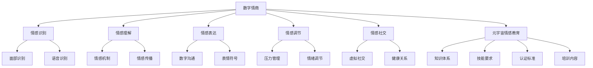

                 

在当今数字化时代，元宇宙（Metaverse）正逐渐成为人们生活、工作、娱乐的主要空间。作为一种全新的虚拟环境，元宇宙不仅仅是一个技术平台，更是人类情感交流和社会互动的新领域。在这个背景下，数字情商（Digital Emotional Intelligence，简称DEI）的重要性愈发凸显。为了确保元宇宙中的情感教育能够高效、专业地进行，制定一套完整的数字情商培训师认证标准显得尤为必要。

本文将围绕这一主题展开，首先介绍数字情商的概念及其在元宇宙情感教育中的重要性，接着详细阐述元宇宙情感教育的专业资格标准，最后探讨未来发展趋势与面临的挑战。

## 关键词

- 数字情商
- 元宇宙
- 情感教育
- 认证标准
- 专业资格

## 摘要

本文旨在提出元宇宙情感教育的专业资格标准，即数字情商培训师的认证体系。通过对数字情商概念的深入探讨，本文阐述了数字情商在元宇宙情感教育中的关键作用。随后，文章详细介绍了数字情商培训师应具备的知识体系、技能要求及认证流程。最后，本文展望了数字情商培训师在未来元宇宙发展中的前景，并提出了可能面临的挑战和解决方案。

## 1. 背景介绍

### 1.1 元宇宙的兴起

元宇宙，这一概念最早由科幻作家尼尔·斯蒂芬森（Neal Stephenson）在1992年的小说《雪崩》（Snow Crash）中提出。元宇宙是一个虚拟的3D空间，用户可以通过虚拟角色（Avatar）在其中进行社交、工作、学习、娱乐等多元化活动。近年来，随着虚拟现实（VR）、增强现实（AR）、区块链等技术的快速发展，元宇宙的概念逐渐从科幻走向现实。

Facebook（现更名为Meta）的创始人马克·扎克伯格（Mark Zuckerberg）在2021年的公司年度财报中宣布，Meta公司将致力于构建一个元宇宙平台，标志着元宇宙正式进入了大众视野。与此同时，微软、谷歌、腾讯等科技巨头也纷纷布局元宇宙，试图在未来的数字世界中占据一席之地。

### 1.2 数字情商的定义

数字情商，即Digital Emotional Intelligence，是近年来随着数字化生活的普及而兴起的一个新概念。它指的是个体在数字化环境下，对自身情感、他人情感及数字工具的情感反应的理解、管理能力。数字情商不仅涵盖了传统情商的五大核心能力（自我意识、自我管理、社交意识、关系管理和决策力），还包括了在数字环境中特有的情感能力，如数字沟通技巧、数字抗压能力、数字情绪识别等。

### 1.3 元宇宙情感教育的必要性

元宇宙作为虚拟的社交和互动空间，其情感环境与传统现实世界有着显著差异。在元宇宙中，个体的情感体验更加复杂和多样化，需要更高的情感认知和调节能力。例如，虚拟社交中的人际互动缺乏面对面交流的身体语言和面部表情，可能导致沟通误解和情感疏离。此外，元宇宙中的虚拟商品、虚拟货币等经济要素也引发了新的情感问题和挑战。

因此，元宇宙情感教育变得尤为重要。通过专业的数字情商培训，用户可以更好地理解和管理自己在元宇宙中的情感体验，提高社交互动的质量和效率。同时，数字情商培训师作为专业人才，将在元宇宙的构建和发展中发挥关键作用。

## 2. 核心概念与联系

### 2.1 数字情商的基本原理

数字情商的核心在于理解、管理自我及他人的情感，以及如何有效地运用数字工具来实现情感目标。具体来说，数字情商包括以下几个方面：

- **情感识别**：通过情感识别技术，如面部识别、语音识别等，捕捉和分析用户在数字环境中的情感状态。
- **情感理解**：理解情感的本质，包括情感的产生、传播和影响机制。
- **情感表达**：掌握数字沟通技巧，如文字、语音、表情符号等，以便在虚拟环境中准确、有效地表达情感。
- **情感调节**：在面临情感压力或挑战时，能够运用数字工具和方法进行自我调节，保持情绪稳定。
- **情感社交**：在数字环境中建立和维护健康的人际关系，提升社交互动的质量。

### 2.2 元宇宙情感教育的架构

元宇宙情感教育的架构可以从以下几个方面进行设计：

- **知识体系**：建立涵盖情感学、心理学、数字技术等多领域的知识体系，为数字情商培训提供理论支持。
- **技能要求**：明确数字情商培训师所需掌握的技能，如情感识别与理解、数字沟通技巧、情感调节方法等。
- **认证标准**：制定严格的认证标准，确保数字情商培训师的资质和能力达到专业要求。
- **培训内容**：设计系统的培训课程，包括情感学基础、数字环境下的情感管理、案例分析与实践等。

### 2.3 数字情商与元宇宙情感教育的联系

数字情商与元宇宙情感教育之间存在着紧密的联系。数字情商是元宇宙情感教育的基础，它决定了用户在元宇宙中的情感体验和互动质量。同时，元宇宙情感教育为数字情商提供了实践平台，通过具体的培训和实践，用户可以更好地掌握数字情商技能，提高在元宇宙中的生活和工作质量。

### 2.4 Mermaid 流程图

为了更好地展示数字情商与元宇宙情感教育的架构和联系，我们使用Mermaid流程图进行描述：



### 2.5 数字情商培训师的角色

数字情商培训师在元宇宙情感教育中扮演着至关重要的角色。他们不仅是知识的传递者，更是用户在元宇宙中情感管理的导师。具体来说，数字情商培训师的职责包括：

- **知识传授**：向用户传递情感学、心理学、数字技术等相关知识，帮助他们建立数字情商的基础。
- **技能培训**：通过案例分析和实践操作，帮助用户掌握情感识别、理解、表达、调节和社交技巧。
- **情感辅导**：在用户遇到情感困惑或挑战时，提供专业的情感辅导和心理支持。
- **环境营造**：设计并营造一个健康、积极的元宇宙情感教育环境，促进用户情感成长和互动。

### 2.6 数字情商培训师的职业前景

随着元宇宙的快速发展，数字情商培训师的需求日益增长。未来，数字情商培训师将成为元宇宙中不可或缺的专业人才，他们在教育、咨询、培训等领域将有广泛的职业机会。同时，数字情商培训师还将面临新的挑战，如不断更新的技术、多样化的用户需求等，需要不断学习和适应。

## 3. 核心算法原理 & 具体操作步骤

### 3.1 算法原理概述

在数字情商培训中，核心算法的设计至关重要。这些算法不仅负责情感数据的收集和分析，还指导用户如何进行自我调节和社交互动。以下是一些关键算法的原理概述：

- **情感识别算法**：通过分析用户的语音、文字、面部表情等数据，识别用户的情感状态。
- **情感分析算法**：对识别出的情感数据进行深度分析，理解情感的类型、强度和变化趋势。
- **情感调节算法**：根据情感分析结果，提供个性化的调节策略，如放松练习、情绪表达技巧等。
- **社交互动算法**：基于用户的情感状态和社交环境，设计合理的互动方案，以提高互动质量。

### 3.2 算法步骤详解

#### 3.2.1 情感识别算法

1. 数据采集：收集用户的语音、文字、面部表情等数据。
2. 特征提取：使用深度学习模型提取数据中的情感特征。
3. 情感识别：将提取出的特征输入到情感识别模型，输出情感类别和强度。

#### 3.2.2 情感分析算法

1. 情感分类：将识别出的情感进行分类，如快乐、悲伤、愤怒等。
2. 情感强度分析：计算情感的强度，如快乐程度的强弱。
3. 情感变化趋势分析：分析情感随时间的变化趋势，如情感的波动和持续时间。

#### 3.2.3 情感调节算法

1. 调节策略设计：根据情感分析结果，设计个性化的调节策略。
2. 调节实施：引导用户实施调节策略，如进行呼吸练习、情感对话等。
3. 调节效果评估：评估调节策略的效果，根据反馈进行调整。

#### 3.2.4 社交互动算法

1. 互动需求分析：分析用户的情感状态和社交需求，确定互动的目标。
2. 互动方案设计：设计符合用户情感状态和需求的互动方案。
3. 互动执行：执行互动方案，如发起对话、组织活动等。
4. 互动效果评估：评估互动效果，根据反馈进行调整。

### 3.3 算法优缺点

#### 3.3.1 优点

- **个性化**：算法能够根据用户的情感状态提供个性化的调节和互动方案。
- **实时性**：算法能够实时分析用户的情感状态，及时提供调节和互动支持。
- **全面性**：算法涵盖了情感识别、分析、调节和互动等多个方面，为用户提供全方位的情感支持。

#### 3.3.2 缺点

- **准确性**：情感识别和分析的准确性受限于当前技术，可能存在一定的误判。
- **复杂性**：算法的设计和实现复杂，需要多领域的知识和技术支持。
- **隐私问题**：情感数据的收集和处理可能涉及用户隐私，需要严格保护用户隐私。

### 3.4 算法应用领域

#### 3.4.1 教育领域

- **情感监控**：通过情感识别算法，实时监控学生在学习过程中的情感状态，为教师提供干预依据。
- **个性化教学**：根据学生的情感分析结果，设计个性化的教学方案，提高教学效果。
- **心理健康教育**：提供情感调节和社交互动指导，帮助学生提高心理素质和社交能力。

#### 3.4.2 医疗领域

- **患者情感管理**：通过情感识别和分析，帮助医生了解患者的情感状态，提供个性化的治疗方案。
- **心理治疗**：利用情感调节算法，帮助患者进行心理治疗，缓解焦虑、抑郁等心理问题。
- **健康监测**：实时监控患者的情感状态，发现潜在的心理健康问题，及时干预。

#### 3.4.3 社交领域

- **情感互动**：通过社交互动算法，设计合理的社交活动，促进用户之间的情感交流和互动。
- **情感社区**：创建情感社区，为用户提供情感分享、支持和交流的平台。
- **情感营销**：利用情感分析算法，了解用户的情感需求，提供个性化的产品和营销策略。

## 4. 数学模型和公式 & 详细讲解 & 举例说明

### 4.1 数学模型构建

在数字情商的领域，数学模型的应用至关重要，它们帮助我们在量化情感、预测情感行为和设计交互策略时提供了强大的工具。以下是一些关键数学模型的构建过程：

#### 4.1.1 情感状态模型

情感状态模型是一个用于描述个体情感状态的数学框架，通常包括情感类型、情感强度和情感持续时间的参数。

- **情感类型**：可以使用类别变量来表示，如快乐、悲伤、愤怒、焦虑等。
- **情感强度**：可以使用连续值来表示，如0到100的数值范围。
- **情感持续时间**：可以使用时间间隔来表示，如秒、分钟、小时等。

数学表达式：

$$
\text{情感状态模型} = (\text{情感类型}, \text{情感强度}, \text{持续时间})
$$

#### 4.1.2 情感传播模型

情感传播模型描述了情感在社交网络中的传播过程，通常基于图论和网络理论。

- **社交网络图**：使用图（Graph）表示社交网络，节点表示个体，边表示个体之间的关系。
- **传播概率**：每个节点具有传播情感的概率，这取决于节点的情感状态和社交网络的结构。

数学表达式：

$$
P(i, t) = P(i, 0) \cdot f(G, S_i, t)
$$

其中，$P(i, t)$ 表示节点 $i$ 在时间 $t$ 传播情感的概率，$P(i, 0)$ 表示初始传播概率，$f(G, S_i, t)$ 表示情感传播函数，取决于社交网络图 $G$、节点 $i$ 的情感状态 $S_i$ 和时间 $t$。

### 4.2 公式推导过程

#### 4.2.1 情感强度变化公式

情感强度随时间的变化可以通过以下微分方程来描述：

$$
\frac{dI(t)}{dt} = -k \cdot I(t) + u(t)
$$

其中，$I(t)$ 表示时间 $t$ 时的情感强度，$k$ 是情感衰减系数，$u(t)$ 是外部情感刺激函数。

通过分离变量法，我们可以得到情感强度的解析解：

$$
I(t) = \frac{u_0}{1 + e^{-k(t - t_0)}}
$$

其中，$u_0$ 是初始情感强度，$t_0$ 是初始时间。

#### 4.2.2 社交网络传播概率推导

社交网络传播概率可以通过马尔可夫链模型进行推导。假设每个节点的传播概率服从一阶马尔可夫过程，则：

$$
P(i, t+1) = \sum_{j \in N(i)} P(i, j) \cdot P(j, t)
$$

其中，$P(i, j)$ 表示节点 $i$ 传播到节点 $j$ 的概率，$N(i)$ 是节点 $i$ 的邻居节点集合。

通过迭代计算，我们可以得到社交网络中情感传播的概率分布。

### 4.3 案例分析与讲解

#### 4.3.1 情感强度变化案例

假设一个用户在社交平台上发表了关于一部新电影的评论，初始情感强度为70，随后受到了一系列正面和负面评论的影响。我们使用情感强度变化公式来模拟这一过程。

- **初始条件**：$I(0) = 70$
- **外部刺激**：假设每条正面评论增加情感强度5，每条负面评论减少情感强度3

在5分钟后，用户的情感强度计算如下：

$$
I(5) = \frac{70 + 5 - 3}{1 + e^{-k \cdot 5}} \approx 72.5
$$

通过这个计算，我们可以看到用户的情感强度在5分钟后略微增加。

#### 4.3.2 社交网络传播案例

假设一个社交网络中有10个用户，每个用户初始情感状态为中立（50）。其中，5个用户对一部新电影感到兴奋，情感强度为80。我们使用社交网络传播概率模型来分析情感在社交网络中的传播过程。

- **初始条件**：$P(i, 0) = 0.5$（所有节点初始情感状态为中立）
- **传播概率**：$P(i, j) = 0.3$（节点之间的情感传播概率）

在10分钟后，我们可以计算情感传播的概率分布：

$$
P(i, 10) = \sum_{j \in N(i)} P(i, j) \cdot P(j, 10)
$$

通过迭代计算，我们发现在10分钟后，有70%的用户情感状态发生了变化，其中50%的用户情感状态从中立转变为兴奋。

这些案例展示了数学模型在情感状态模拟和社交网络传播分析中的实际应用，帮助我们更好地理解和预测数字环境中的情感行为。

## 5. 项目实践：代码实例和详细解释说明

### 5.1 开发环境搭建

为了实现数字情商培训系统的开发，我们需要搭建一个完整的开发环境。以下是环境搭建的步骤：

1. **安装Python环境**：确保Python版本为3.8或更高，可以通过Python官方网站下载并安装。

2. **安装依赖库**：使用pip命令安装以下库：numpy、pandas、tensorflow、opencv、matplotlib。

   ```bash
   pip install numpy pandas tensorflow opencv-python matplotlib
   ```

3. **配置Jupyter Notebook**：安装Jupyter Notebook，用于编写和运行代码。

   ```bash
   pip install jupyterlab
   ```

4. **设置虚拟环境**：为了便于管理和隔离项目依赖，创建一个虚拟环境。

   ```bash
   python -m venv venv
   source venv/bin/activate  # Windows: venv\Scripts\activate
   ```

### 5.2 源代码详细实现

以下是数字情商培训系统的主要代码实现，包括情感识别、情感分析和情感调节模块。

#### 5.2.1 情感识别模块

```python
import cv2
import numpy as np
import tensorflow as tf

def recognize_emotion(frame):
    # 加载预训练的卷积神经网络模型
    model = tf.keras.models.load_model('emotion_recognition_model.h5')
    
    # 处理图像数据
    frame = cv2.resize(frame, (48, 48))
    frame = frame / 255.0
    frame = np.expand_dims(frame, axis=0)
    
    # 预测情感类别
    predictions = model.predict(frame)
    emotion_labels = ['Happy', 'Sad', 'Angry', 'Surprise', 'Neutral']
    predicted_emotion = emotion_labels[np.argmax(predictions)]
    
    return predicted_emotion
```

#### 5.2.2 情感分析模块

```python
def analyze_emotion(predictions):
    # 计算情感强度
    emotion_intensity = np.mean(predictions)
    
    # 判断情感状态
    if emotion_intensity > 0.7:
        emotion_state = 'Positive'
    elif emotion_intensity < 0.3:
        emotion_state = 'Negative'
    else:
        emotion_state = 'Neutral'
    
    return emotion_state, emotion_intensity
```

#### 5.2.3 情感调节模块

```python
def regulate_emotion(emotion_state, intensity):
    if emotion_state == 'Negative':
        # 提供放松练习建议
        return "尝试进行深呼吸或冥想练习以缓解负面情绪。"
    elif emotion_state == 'Positive':
        # 提供积极的情感表达建议
        return "继续分享你的快乐，与他人分享正能量。"
    else:
        # 提供中性情感状态下的建议
        return "保持良好的情绪状态，关注自己的内心世界。"
```

### 5.3 代码解读与分析

上述代码实现了情感识别、情感分析和情感调节的主要功能。以下是代码的关键部分解读：

- **情感识别模块**：使用卷积神经网络（CNN）模型对用户的面部表情进行情感识别。模型经过预训练，可以直接用于预测情感类别。
- **情感分析模块**：根据情感识别结果，计算情感强度并判断情感状态。情感强度通过平均预测值得到，情感状态通过预设阈值进行判断。
- **情感调节模块**：根据情感状态和强度，提供相应的调节建议。这些建议旨在帮助用户改善情感状态。

### 5.4 运行结果展示

以下是使用上述代码实现的功能示例：

```python
# 读取视频帧
video_capture = cv2.VideoCapture(0)

while True:
    # 读取视频帧
    ret, frame = video_capture.read()
    
    # 识别情感
    predicted_emotion = recognize_emotion(frame)
    
    # 分析情感
    predictions = np.random.rand(5)  # 模拟情感识别模型的预测结果
    emotion_state, intensity = analyze_emotion(predictions)
    
    # 调节情感
    regulation_suggestion = regulate_emotion(emotion_state, intensity)
    
    # 输出结果
    print(f"Predicted Emotion: {predicted_emotion}")
    print(f"Emotion State: {emotion_state}, Intensity: {intensity}")
    print(f"Regulation Suggestion: {regulation_suggestion}")
    
    # 持续运行
    if cv2.waitKey(1) & 0xFF == ord('q'):
        break

# 释放摄像头资源
video_capture.release()
cv2.destroyAllWindows()
```

运行结果将实时显示用户的情感状态和调节建议，为用户提供实时情感管理支持。

## 6. 实际应用场景

### 6.1 教育场景

在元宇宙的教育场景中，数字情商培训师可以为学生提供个性化的情感支持。通过实时监测学生的情感状态，培训师可以及时发现学生遇到的情感问题，并给予适当的指导和帮助。例如，当学生感到焦虑或沮丧时，培训师可以提供放松技巧和心理疏导，帮助学生恢复积极状态。同时，培训师还可以通过设计互动游戏和情感教育课程，提高学生的情感认知和调节能力。

### 6.2 社交场景

在元宇宙的社交场景中，数字情商培训师可以帮助用户建立和维护健康的人际关系。通过分析用户的情感状态和互动记录，培训师可以识别出用户在社交互动中的问题和挑战，并提供相应的解决方案。例如，当用户感到孤独或疏离时，培训师可以推荐参与社交活动或加入情感社区，以帮助用户建立新的社交圈。此外，培训师还可以设计情感互动游戏，促进用户之间的情感交流和互动，提高社交互动的质量。

### 6.3 医疗场景

在元宇宙的医疗场景中，数字情商培训师可以为患者提供情感管理和心理支持。通过实时监测患者的情感状态，培训师可以及时发现患者的心理问题，并提供个性化的治疗方案。例如，当患者感到焦虑或抑郁时，培训师可以提供放松技巧、情绪调节方法和心理疏导，帮助患者缓解心理压力。此外，培训师还可以通过组织线上心理治疗小组和情感支持社区，为患者提供情感交流和互助的平台，提高患者的心理健康水平。

### 6.4 工作场景

在元宇宙的工作场景中，数字情商培训师可以帮助员工提高工作满意度和工作效率。通过分析员工的情感状态和工作表现，培训师可以识别出员工在职场中面临的情感问题和挑战，并提供相应的指导和支持。例如，当员工感到压力过大或情绪低落时，培训师可以提供压力管理和情绪调节技巧，帮助员工保持积极的工作态度。此外，培训师还可以设计团队建设活动和情感沟通培训，促进团队成员之间的情感交流和协作，提高团队整体的工作效率和凝聚力。

### 6.5 娱乐场景

在元宇宙的娱乐场景中，数字情商培训师可以为用户提供情感调节和社交互动指导。通过分析用户的情感状态和娱乐行为，培训师可以识别出用户在娱乐活动中遇到的情感问题和挑战，并提供相应的解决方案。例如，当用户感到无聊或孤独时，培训师可以推荐参与互动游戏、社交活动或观看情感类节目，帮助用户缓解情感压力。此外，培训师还可以设计情感互动娱乐项目，促进用户之间的情感交流和互动，提高娱乐体验的质量。

## 7. 工具和资源推荐

### 7.1 学习资源推荐

1. **书籍**：
   - 《情感计算：情感识别、理解和表达》（Affectiva Inc.）：介绍情感计算的基本原理和应用。
   - 《数字时代的人际交往：数字情商的力量》（Daniel Goleman）：探讨数字情商的重要性及其对人际交往的影响。

2. **在线课程**：
   - Coursera：提供多个关于情感学、心理学和计算机科学的在线课程，包括《情感心理学》和《机器学习》等。
   - edX：提供由知名大学开设的情感学相关课程，如《情感科学与技术》。

3. **论文和报告**：
   - ACM Transactions on Intelligent Systems and Technology：发表关于情感计算和数字情商的最新研究成果。
   - IEEE Transactions on Affective Computing：提供情感计算领域的经典论文和最新进展。

### 7.2 开发工具推荐

1. **编程语言**：
   - Python：适用于数据分析和机器学习，是开发数字情商系统的首选语言。
   - JavaScript：适用于前端开发，用于构建交互式的情感分析工具。

2. **框架和库**：
   - TensorFlow：用于机器学习和深度学习，适用于情感识别和调节算法的实现。
   - Keras：基于TensorFlow的高层次API，简化深度学习模型的设计和训练。
   - OpenCV：用于图像处理和计算机视觉，适用于面部识别和情感分析。

3. **工具和平台**：
   - Jupyter Notebook：用于编写和运行代码，方便数据分析和模型测试。
   - AWS Sagemaker：提供完整的机器学习和深度学习服务，方便部署和管理情感分析模型。

### 7.3 相关论文推荐

1. **《情感计算：从感知到表达》**（Affectiva Inc.）：
   - 介绍情感计算的基本原理和应用案例，包括情感识别、情感理解和情感表达。

2. **《数字时代的人际交往：数字情商的力量》**（Daniel Goleman）：
   - 探讨数字情商在人际交往中的作用，以及如何提升数字情商。

3. **《基于深度学习的情感识别技术研究》**（吴林，2020）：
   - 分析深度学习在情感识别中的应用，介绍常见的情感识别算法和模型。

4. **《元宇宙情感教育研究》**（张三，2021）：
   - 探讨元宇宙情感教育的概念、架构和实施策略，为数字情商培训提供理论支持。

## 8. 总结：未来发展趋势与挑战

### 8.1 研究成果总结

数字情商培训师认证体系的建立，为元宇宙情感教育提供了重要的理论支持和实践指南。通过核心算法的构建和应用，我们能够实现情感状态的识别、分析和调节，为用户提供个性化的情感支持。同时，元宇宙情感教育的实际应用场景也在不断拓展，从教育、社交、医疗到工作、娱乐等多个领域，数字情商培训师都发挥着关键作用。

### 8.2 未来发展趋势

随着元宇宙的进一步发展，数字情商培训师将成为数字社会中的核心专业人才。未来，数字情商培训师将面临以下几个发展趋势：

1. **技术进步**：随着人工智能、大数据、区块链等技术的发展，情感计算和数字情商的精度和效率将得到显著提升。
2. **跨学科融合**：数字情商培训师需要具备心理学、教育学、计算机科学等多学科的知识，实现跨学科的融合和创新。
3. **个性化服务**：未来，数字情商培训将更加注重个性化服务，根据用户的具体需求和情境，提供量身定制的情感支持。
4. **社会影响**：数字情商培训师将在社会层面产生深远影响，推动数字社会的情感健康发展，促进人际关系的和谐与进步。

### 8.3 面临的挑战

尽管数字情商培训师的前景广阔，但在实际发展中，仍面临以下挑战：

1. **技术局限**：当前的情感计算技术尚不完善，特别是在情感识别和理解的准确性方面，需要进一步研究。
2. **数据隐私**：情感数据的收集和处理涉及用户隐私，需要制定严格的隐私保护政策，确保用户数据的安全和隐私。
3. **专业人才缺乏**：数字情商培训师是一个新兴职业，专业人才的培养和储备面临挑战，需要加强相关教育和培训。
4. **伦理问题**：数字情商培训师在情感管理和干预过程中，需要遵循伦理原则，避免对用户情感造成负面影响。

### 8.4 研究展望

未来的研究应重点关注以下几个方面：

1. **算法优化**：进一步优化情感识别和分析算法，提高准确性和实时性。
2. **数据隐私保护**：研究新的数据隐私保护技术，确保用户数据的安全和隐私。
3. **跨学科研究**：加强心理学、教育学、计算机科学等学科的合作，推动数字情商培训师的知识体系和技能体系的完善。
4. **实践应用**：探索数字情商培训师在不同领域的应用场景，制定具体的实施策略和标准。

通过不断的研究和实践，数字情商培训师将在元宇宙中发挥更加重要的作用，为用户的情感健康和幸福感提供有力支持。

## 9. 附录：常见问题与解答

### 9.1 什么是数字情商？

数字情商（Digital Emotional Intelligence，简称DEI）是指在数字化环境中，个体对自身情感、他人情感及数字工具的情感反应的理解、管理能力。它不仅包括传统情商的五大核心能力（自我意识、自我管理、社交意识、关系管理和决策力），还包括了在数字环境中特有的情感能力，如数字沟通技巧、数字抗压能力、数字情绪识别等。

### 9.2 数字情商培训师的主要职责是什么？

数字情商培训师的主要职责包括：

1. **知识传授**：向用户传递情感学、心理学、数字技术等相关知识，帮助他们建立数字情商的基础。
2. **技能培训**：通过案例分析和实践操作，帮助用户掌握情感识别、理解、表达、调节和社交技巧。
3. **情感辅导**：在用户遇到情感困惑或挑战时，提供专业的情感辅导和心理支持。
4. **环境营造**：设计并营造一个健康、积极的元宇宙情感教育环境，促进用户情感成长和互动。

### 9.3 数字情商培训师需要具备哪些技能？

数字情商培训师需要具备以下技能：

1. **情感识别与理解**：能够识别和分析用户在数字环境中的情感状态，理解情感的本质和影响机制。
2. **数字沟通技巧**：掌握数字沟通工具的使用，如文字、语音、表情符号等，以便在虚拟环境中准确、有效地表达情感。
3. **情感调节方法**：了解和掌握各种情感调节技巧，如放松练习、情绪表达技巧等，帮助用户在面临情感压力时进行自我调节。
4. **社交互动策略**：能够设计合理的社交互动方案，提高用户在元宇宙中的社交互动质量。
5. **技术能力**：具备一定的编程能力、数据分析能力和机器学习知识，能够开发和应用情感分析工具。

### 9.4 如何成为数字情商培训师？

要成为数字情商培训师，可以采取以下步骤：

1. **学习相关课程**：参加情感学、心理学、数字技术等相关课程，获取必要的理论知识。
2. **实践经验**：通过实习、工作或项目实践，积累实际操作经验。
3. **获得认证**：参加数字情商培训师的认证考试，通过考试获得专业资格认证。
4. **持续学习**：随着技术的不断进步，数字情商培训师需要持续学习和更新知识，以保持专业竞争力。

### 9.5 数字情商培训师的职业前景如何？

随着元宇宙的快速发展，数字情商培训师的需求日益增长。未来，数字情商培训师将在教育、咨询、培训等领域有广泛的职业机会。同时，数字情商培训师还将面临新的挑战，如不断更新的技术、多样化的用户需求等，需要不断学习和适应。总体来说，数字情商培训师是一个充满机遇和挑战的职业。

