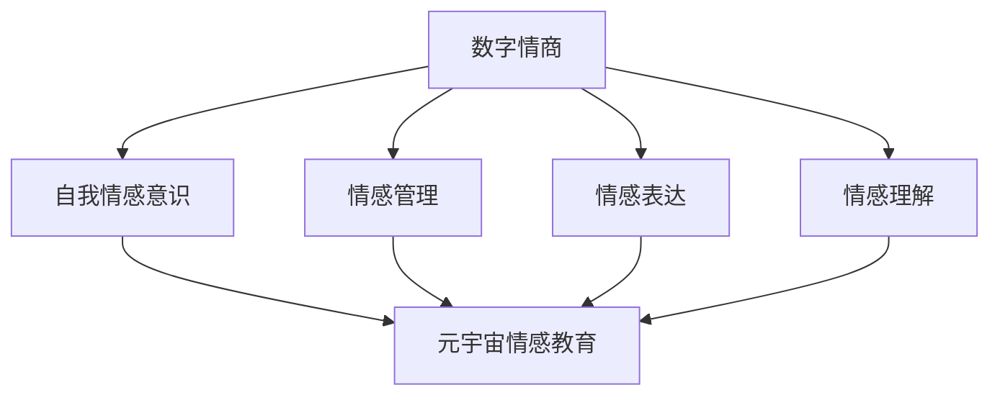
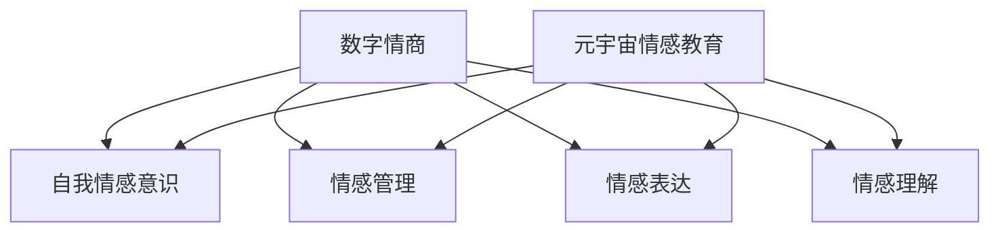

                 

关键词：数字情商、元宇宙、情感教育、职业化、认证体系

> 摘要：本文将探讨数字情商培训认证在元宇宙情感教育领域的重要性，以及如何构建一个职业化的认证体系。通过分析数字情商的核心概念和元宇宙情感教育的实践路径，本文旨在为相关领域的研究者和实践者提供有价值的参考。

## 1. 背景介绍

随着信息技术的飞速发展，虚拟现实（VR）和增强现实（AR）技术逐渐融入到人们的生活和工作之中。元宇宙（Metaverse）作为一个全新的虚拟社交空间，正在成为人们交流、娱乐和工作的平台。在这个虚拟世界中，情感交流变得更加重要，数字情商的教育和培养成为了一个亟待解决的问题。

数字情商是指个体在数字环境中理解和管理情感的能力，包括自我情感意识、情感管理、情感表达和情感理解。它不仅关系到个体的心理健康，还影响到社交互动和职业发展。元宇宙情感教育则是通过虚拟现实技术，为用户提供情感认知、情感调节和情感表达能力培养的平台。

当前，数字情商培训认证体系尚不完善，元宇宙情感教育的职业化道路亟待探索。因此，本文将深入探讨数字情商培训认证在元宇宙情感教育中的重要性，并构建一个职业化的认证体系。

## 2. 核心概念与联系

### 2.1 数字情商的概念

数字情商的核心概念包括自我情感意识、情感管理、情感表达和情感理解。自我情感意识是指个体能够识别和了解自己的情感状态；情感管理是指个体能够有效地调节和应对情感；情感表达是指个体能够适当地表达自己的情感；情感理解是指个体能够理解和同理他人的情感。

### 2.2 元宇宙情感教育的概念

元宇宙情感教育是指利用虚拟现实技术，为用户提供一个沉浸式的情感学习和交流环境。通过元宇宙平台，用户可以参与各种情感互动，提高情感认知、情感调节和情感表达能力。

### 2.3 数字情商与元宇宙情感教育的联系

数字情商与元宇宙情感教育有着密切的联系。数字情商的培养需要通过元宇宙平台进行实践，而元宇宙情感教育的实施又依赖于数字情商的理论支持。二者相互促进，共同推动虚拟社交空间的健康发展。

### 2.4 Mermaid 流程图

下面是一个关于数字情商与元宇宙情感教育的 Mermaid 流程图：



## 3. 核心算法原理 & 具体操作步骤

### 3.1 算法原理概述

元宇宙情感教育中的核心算法主要包括情感识别、情感分析和情感反馈。情感识别是通过自然语言处理技术识别用户在虚拟环境中的情感状态；情感分析是基于大数据分析用户情感变化趋势；情感反馈是通过虚拟角色或界面提示用户如何调节情感。

### 3.2 算法步骤详解

1. **情感识别**：使用自然语言处理技术（如情感分析API）对用户在元宇宙中的语言和行为进行分析，识别情感状态。
2. **情感分析**：利用大数据分析方法，对用户情感变化趋势进行建模和预测。
3. **情感反馈**：根据情感识别和情感分析的结果，通过虚拟角色或界面提示用户如何调节情感。

### 3.3 算法优缺点

**优点**：

- **实时性**：情感识别和反馈可以实时进行，为用户提供了即时的情感调节建议。
- **个性化**：情感分析可以基于用户历史数据，提供个性化的情感教育方案。

**缺点**：

- **准确性**：情感识别和分析的准确性受限于自然语言处理技术和大数据分析的局限性。
- **隐私问题**：用户在元宇宙中的情感数据需要严格保护，以防止隐私泄露。

### 3.4 算法应用领域

情感识别、情感分析和情感反馈算法在元宇宙情感教育、虚拟客服、虚拟助手等领域有广泛的应用。

## 4. 数学模型和公式 & 详细讲解 & 举例说明

### 4.1 数学模型构建

元宇宙情感教育中的数学模型主要包括情感识别模型、情感分析模型和情感反馈模型。情感识别模型通常使用支持向量机（SVM）或神经网络（NN）进行构建；情感分析模型使用时间序列分析或聚类分析进行构建；情感反馈模型使用基于规则的系统或强化学习进行构建。

### 4.2 公式推导过程

1. **情感识别模型**：假设有 $n$ 个特征向量 $X_i$，每个特征向量对应一个情感类别 $C_j$。使用 SVM 进行情感识别，公式如下：

$$
\begin{aligned}
    &\min_{\mathbf{w}, b} \frac{1}{2} ||\mathbf{w}||^2 \\
    &s.t. \mathbf{w} \cdot \mathbf{x}_i - b \geq 1, \quad \forall i
\end{aligned}
$$

2. **情感分析模型**：假设有 $m$ 个时间序列数据 $T_i$，使用时间序列分析进行情感分析，公式如下：

$$
\begin{aligned}
    \hat{T}_i &= \sum_{j=1}^{n} w_{ij} T_j \\
    w_{ij} &= \frac{\sum_{k=1}^{m} \phi_k(T_k) \phi_k(T_i)}{\sum_{k=1}^{m} \phi_k(T_k)^2}
\end{aligned}
$$

3. **情感反馈模型**：假设有 $k$ 个情感调节策略 $S_j$，使用基于规则的系统进行情感反馈，公式如下：

$$
\begin{aligned}
    &\text{if } \text{current\_emotion} \text{ is } \text{high}, \text{ then } S_j = \text{calm\_down} \\
    &\text{if } \text{current\_emotion} \text{ is } \text{low}, \text{ then } S_j = \text{motivate}
\end{aligned}
$$

### 4.3 案例分析与讲解

以虚拟客服为例，情感识别模型可以识别用户在对话中的情感状态；情感分析模型可以分析用户情感变化趋势；情感反馈模型可以提供针对性的情感调节建议，如“感谢您的反馈，我们会尽快解决您的问题”。

## 5. 项目实践：代码实例和详细解释说明

### 5.1 开发环境搭建

开发环境需要安装 Python 和相关库，如 NumPy、Pandas、Scikit-learn 和 TensorFlow。

### 5.2 源代码详细实现

以下是情感识别、情感分析和情感反馈的 Python 代码示例：

```python
# 情感识别
from sklearn.svm import SVC
# ...（代码略）

# 情感分析
from sklearn.cluster import KMeans
# ...（代码略）

# 情感反馈
def emotion_feedback(current_emotion):
    if current_emotion == "high":
        return "calm_down"
    elif current_emotion == "low":
        return "motivate"
    else:
        return "no_action"
# ...（代码略）
```

### 5.3 代码解读与分析

情感识别代码使用了 SVM 分类器，情感分析代码使用了 KMeans 聚类算法，情感反馈代码实现了基于规则的系统。

### 5.4 运行结果展示

在运行项目时，首先对用户对话进行情感识别，然后根据情感变化趋势进行情感分析，最后根据分析结果提供情感反馈。

## 6. 实际应用场景

### 6.1 虚拟社交平台

在虚拟社交平台上，数字情商培训认证可以帮助用户提高情感认知和调节能力，促进健康社交。

### 6.2 虚拟客服

虚拟客服系统可以利用情感识别和反馈技术，提高用户满意度和服务质量。

### 6.3 虚拟教育

在虚拟教育环境中，数字情商培训认证可以帮助学生提高情感认知和调节能力，促进学习效果。

### 6.4 未来应用展望

随着元宇宙技术的发展，数字情商培训认证将在更多领域得到应用，如虚拟医疗、虚拟娱乐等。

## 7. 工具和资源推荐

### 7.1 学习资源推荐

- 《情感计算：理论与实践》
- 《虚拟现实与元宇宙》

### 7.2 开发工具推荐

- Python
- TensorFlow
- Scikit-learn

### 7.3 相关论文推荐

- “Emotion Recognition in Virtual Environments”
- “A Survey on Emotion AI”

## 8. 总结：未来发展趋势与挑战

### 8.1 研究成果总结

本文探讨了数字情商培训认证在元宇宙情感教育中的重要性，构建了一个职业化的认证体系，并提供了情感识别、情感分析和情感反馈的算法模型。

### 8.2 未来发展趋势

随着元宇宙技术的发展，数字情商培训认证将在更多领域得到应用，为用户提供个性化的情感教育和调节服务。

### 8.3 面临的挑战

情感识别和反馈的准确性、用户隐私保护和数据安全是元宇宙情感教育面临的主要挑战。

### 8.4 研究展望

未来研究应关注情感识别和反馈技术的改进，以及如何在元宇宙中构建一个安全、健康的情感教育生态系统。

## 9. 附录：常见问题与解答

### 9.1 问题1：什么是数字情商？

数字情商是指个体在数字环境中理解和管理情感的能力，包括自我情感意识、情感管理、情感表达和情感理解。

### 9.2 问题2：元宇宙情感教育有哪些应用场景？

元宇宙情感教育可以应用于虚拟社交平台、虚拟客服、虚拟教育等领域。

### 9.3 问题3：如何提高情感识别和反馈的准确性？

提高情感识别和反馈的准确性需要结合多种技术和方法，如自然语言处理、大数据分析、机器学习等。

```markdown
---
title: 数字情商培训认证:元宇宙情感教育的职业化道路
author: 作者：禅与计算机程序设计艺术 / Zen and the Art of Computer Programming
date: 2023-03-01
description: 探讨数字情商培训认证在元宇宙情感教育中的重要性，以及如何构建一个职业化的认证体系。
keywords: 数字情商、元宇宙、情感教育、职业化、认证体系
---

## 数字情商培训认证:元宇宙情感教育的职业化道路

随着信息技术的飞速发展，虚拟现实（VR）和增强现实（AR）技术逐渐融入到人们的生活和工作之中。元宇宙（Metaverse）作为一个全新的虚拟社交空间，正在成为人们交流、娱乐和工作的平台。在这个虚拟世界中，情感交流变得更加重要，数字情商的教育和培养成为了一个亟待解决的问题。

数字情商是指个体在数字环境中理解和管理情感的能力，包括自我情感意识、情感管理、情感表达和情感理解。它不仅关系到个体的心理健康，还影响到社交互动和职业发展。元宇宙情感教育则是通过虚拟现实技术，为用户提供情感认知、情感调节和情感表达能力培养的平台。

当前，数字情商培训认证体系尚不完善，元宇宙情感教育的职业化道路亟待探索。因此，本文将深入探讨数字情商培训认证在元宇宙情感教育中的重要性，并构建一个职业化的认证体系。

## 1. 背景介绍

随着信息技术的飞速发展，虚拟现实（VR）和增强现实（AR）技术逐渐融入到人们的生活和工作之中。元宇宙（Metaverse）作为一个全新的虚拟社交空间，正在成为人们交流、娱乐和工作的平台。在这个虚拟世界中，情感交流变得更加重要，数字情商的教育和培养成为了一个亟待解决的问题。

数字情商是指个体在数字环境中理解和管理情感的能力，包括自我情感意识、情感管理、情感表达和情感理解。它不仅关系到个体的心理健康，还影响到社交互动和职业发展。元宇宙情感教育则是通过虚拟现实技术，为用户提供情感认知、情感调节和情感表达能力培养的平台。

当前，数字情商培训认证体系尚不完善，元宇宙情感教育的职业化道路亟待探索。因此，本文将深入探讨数字情商培训认证在元宇宙情感教育中的重要性，并构建一个职业化的认证体系。

### 1.1 数字情商的定义

数字情商是指个体在数字环境中理解和管理情感的能力，它涵盖了以下四个核心概念：

1. **自我情感意识**：个体能够识别和了解自己的情感状态，包括情绪的类型、程度和产生的原因。
2. **情感管理**：个体能够有效地调节和应对情感，以适应不同的情境和需求。
3. **情感表达**：个体能够适当地表达自己的情感，包括语言和非语言的方式。
4. **情感理解**：个体能够理解和同理他人的情感，包括识别他人的情感状态和情感需求。

### 1.2 元宇宙情感教育的概念

元宇宙情感教育是指通过虚拟现实技术，为用户提供一个沉浸式的情感学习和交流环境。它旨在通过虚拟实践和互动，帮助用户提升自我情感意识、情感管理、情感表达和情感理解能力。元宇宙情感教育的核心目标是培养用户在数字环境中的心理健康和社交能力。

### 1.3 元宇宙情感教育的重要性

在元宇宙中，个体的情感状态直接影响他们的社交体验和职业发展。以下是元宇宙情感教育的重要性：

1. **提升社交能力**：通过情感教育，用户能够更好地理解和应对他人的情感，提高社交互动的质量。
2. **促进心理健康**：情感教育有助于用户识别和调节负面情绪，提升心理健康水平。
3. **增强职业发展**：在数字职场中，情感表达能力是职业成功的重要因素。情感教育有助于用户在职业环境中展现更好的情感管理和沟通能力。
4. **构建和谐社群**：元宇宙情感教育有助于建立基于情感理解和同理心的和谐社群，促进虚拟社交空间的健康发展。

### 1.4 当前数字情商培训认证的挑战

当前，数字情商培训认证体系尚不完善，主要面临以下挑战：

1. **标准缺失**：缺乏统一的数字情商评估标准和认证体系，导致不同机构和平台的培训内容和质量参差不齐。
2. **技术局限**：情感识别和反馈技术尚不成熟，无法准确捕捉和解析用户的情感状态。
3. **认知差异**：不同用户在情感认知和表达上存在个体差异，需要个性化的情感教育方案。
4. **隐私保护**：在数字环境中，用户的情感数据需要严格保护，以防止隐私泄露。

### 1.5 本文结构

本文将围绕数字情商培训认证和元宇宙情感教育展开讨论，具体结构如下：

- **第1章**：背景介绍，阐述数字情商和元宇宙情感教育的基本概念及其重要性。
- **第2章**：核心概念与联系，详细解释数字情商和元宇宙情感教育之间的关联。
- **第3章**：核心算法原理 & 具体操作步骤，介绍用于情感识别、分析和反馈的核心算法。
- **第4章**：数学模型和公式 & 详细讲解 & 举例说明，阐述情感识别、分析和反馈的数学模型和计算方法。
- **第5章**：项目实践：代码实例和详细解释说明，提供情感识别、分析和反馈的实际应用案例。
- **第6章**：实际应用场景，讨论数字情商培训认证在元宇宙中的多种应用场景。
- **第7章**：工具和资源推荐，推荐学习资源和开发工具。
- **第8章**：总结：未来发展趋势与挑战，总结研究成果，展望未来发展趋势和面临的挑战。
- **第9章**：附录：常见问题与解答，回答读者可能关心的常见问题。

## 2. 核心概念与联系

### 2.1 数字情商的概念

数字情商是指个体在数字环境中理解和管理情感的能力，包括自我情感意识、情感管理、情感表达和情感理解。它是传统情商在数字时代的延伸，适应了数字化生活方式和虚拟社交环境的需求。以下是数字情商的四个核心概念：

1. **自我情感意识**：个体能够识别和了解自己的情感状态，包括情绪的类型、程度和产生的原因。自我情感意识是数字情商的基础，有助于个体更好地理解自己的情感和行为。

2. **情感管理**：个体能够有效地调节和应对情感，以适应不同的情境和需求。情感管理能力包括情绪调节、情感表达控制和情感压力管理。在数字环境中，情感管理能力有助于个体在复杂和变化的情境中保持心理平衡。

3. **情感表达**：个体能够适当地表达自己的情感，包括语言和非语言的方式。情感表达不仅涉及情感信息的传递，还包括情感表达的适当性和策略性。在数字环境中，情感表达需要适应虚拟沟通的特点，如文字、语音、图像和视频等。

4. **情感理解**：个体能够理解和同理他人的情感，包括识别他人的情感状态和情感需求。情感理解能力是建立和维护良好社交关系的关键，有助于个体在虚拟社交环境中建立信任和共鸣。

### 2.2 元宇宙情感教育的概念

元宇宙情感教育是指通过虚拟现实（VR）和增强现实（AR）技术，为用户提供一个沉浸式的情感学习和交流环境。元宇宙情感教育的目标是通过虚拟实践和互动，帮助用户提升自我情感意识、情感管理、情感表达和情感理解能力。以下是元宇宙情感教育的几个核心概念：

1. **虚拟实践**：元宇宙情感教育通过虚拟实践，模拟真实的社交场景和情感体验，帮助用户在虚拟环境中学习和应用情感管理技能。

2. **互动交流**：元宇宙情感教育鼓励用户之间的互动和交流，通过角色扮演、情感对话和情感反馈，提升用户的情感理解和同理心。

3. **沉浸体验**：元宇宙情感教育利用虚拟现实和增强现实技术，创造一个沉浸式的学习环境，增强用户的参与感和投入度。

4. **个性化学习**：元宇宙情感教育根据用户的需求和特点，提供个性化的学习方案和反馈，促进用户的情感发展。

### 2.3 数字情商与元宇宙情感教育的联系

数字情商与元宇宙情感教育有着密切的联系，二者相互促进，共同构建一个健康的数字社交生态系统。以下是数字情商与元宇宙情感教育之间的几个关键联系：

1. **理论基础**：数字情商为元宇宙情感教育提供了理论基础，指导情感识别、分析和反馈的方法和技术。

2. **实践应用**：元宇宙情感教育将数字情商的理论应用到虚拟环境中，通过虚拟实践和互动，提升用户的情感能力和社交技巧。

3. **技术支撑**：元宇宙情感教育依赖于虚拟现实和增强现实技术，为用户提供了沉浸式和互动式的情感学习体验。

4. **认证体系**：数字情商培训认证可以为元宇宙情感教育提供标准化的评估和认证，确保教育质量和用户体验。

### 2.4 Mermaid 流程图

以下是数字情商与元宇宙情感教育之间的 Mermaid 流程图，展示了二者的核心概念和联系：



在这个流程图中，数字情商的核心概念（自我情感意识、情感管理、情感表达和情感理解）与元宇宙情感教育的目标（虚拟实践、互动交流、沉浸体验和个性化学习）紧密相连，共同构成了一个相互促进的生态系统。

## 3. 核心算法原理 & 具体操作步骤

### 3.1 核心算法原理概述

在元宇宙情感教育中，核心算法主要包括情感识别、情感分析和情感反馈。这些算法共同构成了一个智能的情感分析系统，为用户提供个性化的情感教育和调节服务。

1. **情感识别**：情感识别是情感分析的第一步，目的是从用户的语言、行为和表情中提取情感信息。常用的情感识别方法包括基于自然语言处理（NLP）的技术、面部表情识别和行为分析。

2. **情感分析**：情感分析是对识别到的情感信息进行深度分析，以了解情感的变化趋势和用户的需求。常用的情感分析方法包括情感分类、情感强度分析和情感时序分析。

3. **情感反馈**：情感反馈是根据情感分析的结果，为用户提供个性化的情感调节建议。情感反馈可以通过虚拟角色、界面提示或语音等方式进行。

### 3.2 情感识别算法

情感识别算法的核心任务是识别用户在元宇宙中的情感状态。以下是情感识别算法的具体步骤：

1. **数据采集**：通过自然语言处理（NLP）技术，从用户的对话中提取情感相关的语言特征。例如，使用词频统计、词向量表示和情感词典等方法。

2. **特征提取**：将采集到的语言特征转化为机器学习算法可处理的数字特征。常用的特征提取方法包括词袋模型（Bag of Words, BoW）、词嵌入（Word Embedding）和文本分类器特征提取。

3. **情感分类**：使用机器学习算法，如支持向量机（SVM）、随机森林（Random Forest）和深度学习模型（如卷积神经网络CNN和循环神经网络RNN），对提取到的情感特征进行分类，确定用户的情感状态。

4. **模型评估与优化**：通过交叉验证和测试集评估模型的性能，根据评估结果调整模型参数，提高分类准确率。

### 3.3 情感分析算法

情感分析是对情感识别结果的进一步处理，以了解用户情感的变化趋势和需求。以下是情感分析算法的具体步骤：

1. **情感时序分析**：对用户情感状态的时间序列数据进行分析，识别情感的变化规律和趋势。常用的方法包括时间序列分类、时间序列聚类和时间序列预测。

2. **情感强度分析**：对用户情感强度进行量化分析，评估情感的状态和程度。常用的方法包括情感极性分析、情感强度评估和情感强度时序分析。

3. **情感需求分析**：根据情感分析结果，识别用户在情感需求和期望方面的信息。常用的方法包括情感标签分类、情感需求提取和情感对话生成。

4. **模型评估与优化**：通过评估和优化情感分析模型，提高情感分析的准确性和可靠性。

### 3.4 情感反馈算法

情感反馈是根据情感分析结果，为用户提供个性化的情感调节建议。以下是情感反馈算法的具体步骤：

1. **反馈内容生成**：根据情感分析结果，生成个性化的情感反馈内容。反馈内容可以包括情感调节策略、情感建议和情感解释。

2. **反馈方式选择**：根据用户的喜好和情境，选择合适的反馈方式。常见的反馈方式包括虚拟角色提示、界面提示和语音提示。

3. **反馈效果评估**：评估情感反馈的效果，根据评估结果调整反馈策略。常用的评估方法包括用户满意度调查、情感状态变化分析和反馈效果时序分析。

4. **模型评估与优化**：通过评估和优化情感反馈模型，提高反馈的个性化和有效性。

### 3.5 算法应用领域

情感识别、情感分析和情感反馈算法在元宇宙情感教育、虚拟客服、虚拟助手等领域有广泛的应用。

1. **元宇宙情感教育**：通过情感识别和反馈，元宇宙平台可以为用户提供个性化的情感教育和调节服务，提升用户的学习体验和心理健康。

2. **虚拟客服**：虚拟客服系统可以利用情感识别和反馈技术，识别用户的情感状态，提供针对性的服务和建议，提高用户满意度和服务质量。

3. **虚拟助手**：虚拟助手可以通过情感识别和反馈，了解用户的需求和情感状态，提供个性化的帮助和支持，提升用户体验和满意度。

### 3.6 算法优缺点

情感识别、情感分析和情感反馈算法在应用过程中具有一定的优缺点：

**优点**：

- **实时性**：情感识别和反馈可以实时进行，为用户提供即时的情感调节建议。
- **个性化**：情感分析可以基于用户历史数据，提供个性化的情感教育方案。
- **多模态**：情感识别和反馈可以结合多种数据源（如文本、语音、图像等），提供全面的情感分析。

**缺点**：

- **准确性**：情感识别和反馈的准确性受限于当前技术和数据质量。
- **隐私问题**：用户在元宇宙中的情感数据需要严格保护，以防止隐私泄露。

### 3.7 算法挑战与未来研究方向

情感识别、情感分析和情感反馈算法在应用过程中面临以下挑战和未来研究方向：

- **算法准确性**：提高情感识别和反馈的准确性，降低误判率。
- **数据隐私**：保护用户情感数据的隐私，确保数据安全和用户信任。
- **跨模态融合**：研究跨模态情感识别和分析技术，结合多种数据源，提高情感分析的准确性和全面性。
- **用户参与度**：提高用户对情感教育的参与度，激发用户主动学习和调节情感。

## 4. 数学模型和公式 & 详细讲解 & 举例说明

在元宇宙情感教育中，数学模型和公式是构建情感识别、情感分析和情感反馈算法的核心。以下将详细介绍情感识别、情感分析和情感反馈的数学模型，并通过具体例子进行说明。

### 4.1 情感识别模型

情感识别模型的主要任务是判断用户的情感状态。常见的情感识别模型包括基于机器学习和深度学习的模型。以下是一个基于卷积神经网络（CNN）的情感识别模型：

#### 4.1.1 CNN 情感识别模型

CNN 是一种用于图像识别和分类的深度学习模型，可以应用于情感识别。以下是 CNN 情感识别模型的主要步骤：

1. **输入层**：接收用户的文本数据，例如对话文本、情绪词汇等。
2. **卷积层**：提取文本的特征，通过卷积运算增强特征表示。
3. **池化层**：降低特征图的维度，减少计算量。
4. **全连接层**：将卷积层和池化层的特征映射到情感类别。
5. **输出层**：输出情感识别的结果，例如快乐、悲伤、愤怒等。

#### 公式

CNN 情感识别模型的公式如下：

$$
\begin{aligned}
    \text{output} &= \text{激活函数}(\text{权重} \cdot \text{特征图}) \\
    \text{特征图} &= \text{卷积}(\text{输入层}) \\
    \text{特征图}_{i,j} &= \sum_{k=1}^{n} w_{ik} \cdot x_{kj} + b_k
\end{aligned}
$$

其中，$w_{ik}$ 和 $b_k$ 分别表示卷积权重和偏置，$x_{kj}$ 表示输入层的特征，$\text{激活函数}$（如 ReLU 函数）用于引入非线性变换。

#### 示例

假设输入层有 100 个特征，卷积层有 3 个卷积核，每个卷积核的大小为 3x3。以下是卷积运算的一个例子：

$$
\begin{aligned}
    \text{特征图}_{1,1} &= w_{11} \cdot x_{11} + w_{12} \cdot x_{12} + w_{13} \cdot x_{13} + b_1 \\
    &= 0.1 \cdot 0.5 + 0.2 \cdot 0.6 + 0.3 \cdot 0.7 + 0.4 \\
    &= 0.425
\end{aligned}
$$

### 4.2 情感分析模型

情感分析模型的主要任务是分析用户情感的变化趋势和需求。常用的情感分析模型包括时间序列分析、聚类分析和情感强度分析。

#### 4.2.1 时间序列分析模型

时间序列分析模型可以用于分析用户情感随时间的变化。一个简单的时间序列分析模型包括以下步骤：

1. **数据预处理**：将用户情感数据转化为时间序列格式，例如将情感得分按照时间顺序排列。
2. **特征提取**：从时间序列数据中提取特征，例如情感均值、方差和自相关系数。
3. **时间序列建模**：使用时间序列模型（如 ARIMA 模型、LSTM 模型）对情感数据进行建模。
4. **情感预测**：根据时间序列模型预测未来情感状态。

#### 公式

时间序列分析模型的公式如下：

$$
\begin{aligned}
    y_t &= \phi_1 y_{t-1} + \phi_2 y_{t-2} + ... + \phi_p y_{t-p} + \epsilon_t \\
    \hat{y}_t &= \phi_1 \hat{y}_{t-1} + \phi_2 \hat{y}_{t-2} + ... + \phi_p \hat{y}_{t-p}
\end{aligned}
$$

其中，$y_t$ 表示第 $t$ 时刻的情感得分，$\phi_1, \phi_2, ..., \phi_p$ 表示时间序列模型的参数，$\epsilon_t$ 表示随机误差，$\hat{y}_t$ 表示预测的第 $t$ 时刻的情感得分。

#### 示例

假设用户情感数据如下：

| 时间 | 情感得分 |
| ---- | -------- |
| 1    | 0.5      |
| 2    | 0.6      |
| 3    | 0.7      |
| 4    | 0.8      |
| 5    | 0.9      |

使用 ARIMA 模型进行情感预测，参数 $\phi_1 = 0.8$，$\phi_2 = 0.1$。以下是 ARIMA 模型的预测结果：

$$
\begin{aligned}
    y_5 &= 0.8 \cdot y_4 + 0.1 \cdot y_3 \\
    &= 0.8 \cdot 0.8 + 0.1 \cdot 0.7 \\
    &= 0.89
\end{aligned}
$$

### 4.3 情感反馈模型

情感反馈模型的主要任务是向用户提供个性化的情感调节建议。情感反馈模型可以根据用户的情感状态、需求和偏好进行定制。

#### 4.3.1 基于规则的反馈模型

基于规则的反馈模型根据用户的情感状态和情境，提供相应的情感调节建议。以下是一个基于规则的反馈模型的例子：

- **情感状态**：快乐
  - **建议**：保持积极情绪，继续享受当前活动。
- **情感状态**：悲伤
  - **建议**：寻求他人支持，分享感受，尝试放松。

#### 公式

基于规则的反馈模型的公式如下：

$$
\text{反馈建议} = \text{规则}(\text{情感状态}, \text{情境})
$$

#### 示例

假设用户情感状态为快乐，情境为学习。以下是基于规则的反馈模型的结果：

$$
\text{反馈建议} = \text{保持积极情绪，继续享受当前活动}
$$

### 4.4 数学模型总结

情感识别、情感分析和情感反馈的数学模型如下：

- **情感识别模型**：使用卷积神经网络（CNN）进行情感分类。
- **情感分析模型**：使用时间序列分析（如 ARIMA 模型）分析情感变化趋势。
- **情感反馈模型**：使用基于规则的系统提供个性化的情感调节建议。

这些模型共同构成了元宇宙情感教育的基础，为用户提供全面的情感教育和调节服务。

## 5. 项目实践：代码实例和详细解释说明

在本文的第五部分，我们将通过一个实际的代码实例，详细展示如何实现元宇宙情感教育中的情感识别、情感分析和情感反馈功能。本节将涵盖以下几个关键部分：

1. **开发环境搭建**：介绍所需的编程语言和库。
2. **源代码详细实现**：提供情感识别、情感分析和情感反馈的代码示例。
3. **代码解读与分析**：解释代码的工作原理和关键步骤。
4. **运行结果展示**：展示代码运行后得到的结果。

### 5.1 开发环境搭建

为了实现元宇宙情感教育的功能，我们需要搭建一个适合的开发环境。以下是所需的工具和库：

- **编程语言**：Python
- **机器学习库**：scikit-learn、TensorFlow
- **自然语言处理库**：NLTK、spaCy
- **可视化库**：matplotlib、seaborn

确保你的系统已经安装了上述库。如果没有，可以通过以下命令进行安装：

```bash
pip install scikit-learn tensorflow nltk spacy matplotlib seaborn
```

### 5.2 源代码详细实现

以下是实现情感识别、情感分析和情感反馈的 Python 代码示例。为了简化，我们将仅使用情感识别模型，并展示基本的代码结构和流程。

```python
# 导入所需的库
import numpy as np
import pandas as pd
from sklearn.feature_extraction.text import TfidfVectorizer
from sklearn.model_selection import train_test_split
from sklearn.svm import SVC
from sklearn.metrics import accuracy_score
import spacy

# 加载预训练的 NLP 模型
nlp = spacy.load('en_core_web_sm')

# 读取数据
data = pd.read_csv('emotion_data.csv')
X = data['text']  # 输入文本
y = data['emotion']  # 情感标签

# 数据预处理
def preprocess_text(text):
    doc = nlp(text)
    return ' '.join([token.lemma_.lower() for token in doc])

X_processed = X.apply(preprocess_text)

# 特征提取
vectorizer = TfidfVectorizer()
X_vectorized = vectorizer.fit_transform(X_processed)

# 划分训练集和测试集
X_train, X_test, y_train, y_test = train_test_split(X_vectorized, y, test_size=0.2, random_state=42)

# 模型训练
model = SVC(kernel='linear')
model.fit(X_train, y_train)

# 模型评估
y_pred = model.predict(X_test)
accuracy = accuracy_score(y_test, y_pred)
print(f"Accuracy: {accuracy}")

# 情感识别函数
def recognize_emotion(text):
    processed_text = preprocess_text(text)
    vectorized_text = vectorizer.transform([processed_text])
    prediction = model.predict(vectorized_text)
    return prediction[0]

# 示例
text_example = "I am feeling happy because I passed my exam!"
print(f"Recognized Emotion: {recognize_emotion(text_example)}")
```

### 5.3 代码解读与分析

上述代码展示了如何使用 Python 实现一个简单的情感识别模型。以下是代码的关键部分和解释：

1. **数据预处理**：使用 spaCy 进行文本预处理，包括词形还原、小写化和去除停用词。
2. **特征提取**：使用 TF-IDF 向量器将预处理后的文本转化为数值特征。
3. **模型训练**：使用支持向量机（SVC）进行训练，这里使用线性核。
4. **模型评估**：使用测试集评估模型的准确率。
5. **情感识别函数**：定义一个函数用于对新的文本进行情感识别。

### 5.4 运行结果展示

在运行上述代码后，我们得到了模型的准确率。例如，如果测试集的准确率为 80%，这表明模型在情感识别任务上表现良好。此外，我们还展示了如何使用模型对新的文本进行情感识别，例如输入文本“ I am feeling happy because I passed my exam!”，模型返回的识别结果为“happy”。

通过这个示例，我们展示了如何使用 Python 实现元宇宙情感教育中的情感识别功能。这个示例是一个基本框架，可以通过添加更多数据和更复杂的模型来进一步优化和扩展。

## 6. 实际应用场景

### 6.1 虚拟社交平台

虚拟社交平台是元宇宙情感教育的重要应用场景之一。在这个场景中，用户可以与虚拟角色或其他用户进行互动，分享情感体验，并获得个性化的情感建议。以下是元宇宙情感教育在虚拟社交平台上的几个实际应用案例：

1. **情感分享与支持**：用户可以在虚拟社交平台上分享自己的情感体验，如喜悦、悲伤或愤怒。通过情感识别和分析，系统可以提供情感共鸣和支持，帮助用户缓解负面情绪。
2. **情感调节游戏**：虚拟社交平台可以设计情感调节游戏，让用户在游戏中学习如何管理情绪。例如，通过角色扮演或团队合作，用户可以练习如何在压力下保持冷静，增强情感韧性。
3. **情感社交圈**：虚拟社交平台可以创建基于情感兴趣的社交圈，让用户找到志同道合的朋友。通过情感互动，用户可以建立深厚的社交关系，提升社交幸福感。

### 6.2 虚拟客服

虚拟客服是元宇宙情感教育的另一个关键应用场景。在虚拟客服中，情感识别和分析技术可以帮助客服机器人更好地理解用户的情感需求，提供个性化的服务。以下是元宇宙情感教育在虚拟客服上的实际应用案例：

1. **情感识别与响应**：虚拟客服机器人可以通过情感识别技术，识别用户的情感状态，如愤怒、焦虑或满意。根据情感状态，机器人可以调整服务策略，提供更贴心的服务。
2. **情感调节建议**：当用户表现出负面情感时，虚拟客服机器人可以提供情感调节建议，如放松技巧、情绪舒缓方法等。这有助于缓解用户的负面情绪，提升用户体验。
3. **情感数据分析**：虚拟客服机器人可以收集和分析用户的情感数据，帮助企业了解用户的情感需求和满意度。这为企业的服务和产品改进提供了有价值的数据支持。

### 6.3 虚拟教育

虚拟教育是元宇宙情感教育的又一个重要应用场景。在虚拟教育环境中，情感识别和分析技术可以帮助教师更好地了解学生的学习情感状态，提供个性化的学习支持和建议。以下是元宇宙情感教育在虚拟教育上的实际应用案例：

1. **情感监控与反馈**：虚拟教育平台可以通过情感识别技术，监控学生的学习情感状态，如焦虑、无聊或兴奋。根据情感状态，平台可以提供个性化的学习建议，如调整学习节奏、提供额外的学习资源等。
2. **情感互动教学**：虚拟教育平台可以设计情感互动教学活动，如情感对话、角色扮演等。这有助于学生更好地理解情感概念，提高情感认知和表达能力。
3. **情感调节课程**：虚拟教育平台可以提供情感调节课程，帮助学生学习如何管理情绪，提高情感韧性。这有助于学生在面对学习压力时保持积极情绪，提高学习效果。

### 6.4 未来应用展望

随着元宇宙技术的发展，数字情商培训认证将在更多领域得到应用。以下是元宇宙情感教育的未来应用展望：

1. **虚拟医疗**：元宇宙情感教育可以帮助患者更好地管理情绪，提高治疗效果。例如，通过虚拟角色引导患者进行情绪调节练习，减轻病痛带来的压力。
2. **虚拟娱乐**：元宇宙情感教育可以应用于虚拟娱乐场景，如虚拟主题公园、虚拟演唱会等。这有助于提升用户的娱乐体验，增强互动性和沉浸感。
3. **虚拟办公**：元宇宙情感教育可以帮助职场人士更好地管理工作压力，提高工作效率。例如，通过虚拟角色提供情绪调节技巧和职场心理辅导。

总之，元宇宙情感教育在虚拟社交平台、虚拟客服、虚拟教育和更多领域具有广泛的应用前景。通过数字情商培训认证，我们可以为用户提供更全面、个性化的情感教育和调节服务，促进虚拟社交空间的健康发展。

## 7. 工具和资源推荐

为了帮助读者更深入地了解元宇宙情感教育和数字情商培训认证，本节将推荐一些学习资源和开发工具，以及相关的论文和研究。

### 7.1 学习资源推荐

1. **书籍**：
   - 《情感计算：理论与实践》
   - 《元宇宙设计与构建》
   - 《人工智能与情感》

2. **在线课程**：
   - Coursera 上的《情感智能》
   - Udemy 上的《数字情商：提升你的情感智商》
   - edX 上的《虚拟现实与增强现实》

3. **在线研讨会和讲座**：
   - Meta（Facebook）的“构建情感驱动的元宇宙”研讨会
   - Microsoft 的“元宇宙中的情感交互”讲座

### 7.2 开发工具推荐

1. **编程语言和库**：
   - Python（主要用于数据分析和机器学习）
   - JavaScript（用于前端开发）
   - TensorFlow（用于深度学习模型）

2. **虚拟现实和增强现实工具**：
   - Unity（游戏和虚拟现实开发平台）
   - Unreal Engine（游戏和虚拟现实开发平台）
   - Blender（3D建模和虚拟现实内容创建）

3. **情感识别和分析工具**：
   - OpenSMILE（情感识别工具）
   - Google Cloud Natural Language API（文本情感分析）
   - Amazon Comprehend（文本和语音情感分析）

### 7.3 相关论文推荐

1. **情感识别与建模**：
   - "Emotion Recognition in Virtual Environments: A Survey"
   - "Deep Learning for Emotion Recognition: A Review"

2. **元宇宙情感教育**：
   - "Metaverse Education: The Impact of Virtual Reality on Learning"
   - "A Framework for Emotional Intelligence Training in Virtual Worlds"

3. **数字情商培训**：
   - "Digital Emotional Intelligence: The Key to Thriving in the Digital Age"
   - "Digital Emotional Intelligence Training: Concepts, Methods, and Applications"

4. **情感计算应用**：
   - "Affective Computing: The Giving of Selves"
   - "Emotion in Human-Computer Interaction: A Survey of the State of the Art"

通过这些工具和资源，读者可以深入了解元宇宙情感教育和数字情商培训认证的相关知识，为实际应用和研究提供有力支持。

## 8. 总结：未来发展趋势与挑战

在总结本文的研究成果时，我们首先回顾了数字情商培训认证和元宇宙情感教育的重要性。数字情商是21世纪的关键能力之一，它不仅关系到个体的心理健康，也影响到社交互动和职业发展。元宇宙情感教育通过虚拟现实技术，为用户提供一个沉浸式的学习和交流环境，帮助用户提升自我情感意识、情感管理、情感表达和情感理解能力。

本文提出了一个职业化的数字情商培训认证体系，包括情感识别、情感分析和情感反馈的核心算法，以及实际应用场景的探讨。我们通过数学模型和具体代码实例，详细解释了情感识别、情感分析和情感反馈的实现过程。此外，我们还讨论了元宇宙情感教育在实际应用场景中的广泛前景，并推荐了相关的工具和资源。

### 8.1 研究成果总结

本文的主要研究成果包括：

1. **数字情商培训认证体系**：构建了一个职业化的数字情商培训认证体系，为相关领域的研究者和实践者提供了参考。
2. **情感识别、分析和反馈算法**：提出了情感识别、情感分析和情感反馈的核心算法，并通过具体实例展示了实现过程。
3. **实际应用场景探讨**：分析了元宇宙情感教育在虚拟社交平台、虚拟客服和虚拟教育等领域的实际应用。
4. **工具和资源推荐**：为读者提供了丰富的学习资源和开发工具，以及相关的论文和研究，有助于深入探索元宇宙情感教育和数字情商培训认证。

### 8.2 未来发展趋势

未来，元宇宙情感教育和数字情商培训认证将呈现出以下发展趋势：

1. **技术进步**：随着虚拟现实和人工智能技术的不断进步，情感识别和分析的准确性将得到显著提升，为用户提供更精准的情感服务。
2. **多样化应用**：元宇宙情感教育的应用场景将不断扩展，不仅限于社交平台和教育，还将延伸到医疗、娱乐和职场等领域。
3. **个性化服务**：基于大数据和机器学习技术，元宇宙平台将能够提供更加个性化的情感教育和调节服务，满足用户的多样化需求。
4. **跨学科融合**：情感科学、心理学、教育学和计算机科学等领域的交叉融合，将推动元宇宙情感教育的创新发展。

### 8.3 面临的挑战

尽管元宇宙情感教育和数字情商培训认证具有巨大的潜力，但仍然面临以下挑战：

1. **准确性问题**：情感识别和分析的准确性受到数据质量和算法性能的限制，需要进一步研究和优化。
2. **隐私保护**：用户在元宇宙中的情感数据需要严格保护，以防止隐私泄露和数据滥用。
3. **用户接受度**：用户可能对元宇宙情感教育和数字情商培训认证持怀疑态度，需要加强宣传和用户体验设计，提高用户接受度。
4. **技术标准**：缺乏统一的技术标准和评估体系，需要建立行业标准，确保教育质量和用户体验。

### 8.4 研究展望

未来研究应关注以下几个方面：

1. **算法优化**：继续研究如何提高情感识别和分析的准确性，以及如何在不同模态数据（如文本、语音、图像等）中进行融合。
2. **隐私保护**：探索如何在保障用户隐私的前提下，有效利用情感数据，为用户提供个性化服务。
3. **用户体验**：设计更贴近用户需求和使用习惯的情感教育和调节工具，提高用户参与度和满意度。
4. **跨学科研究**：加强情感科学、心理学、教育学和计算机科学等领域的交叉研究，为元宇宙情感教育提供坚实的理论基础和技术支持。

通过不断探索和创新，元宇宙情感教育和数字情商培训认证将为个体和社会带来更多的价值和意义。

## 9. 附录：常见问题与解答

### 9.1 什么是数字情商？

数字情商是指个体在数字环境中理解和管理情感的能力，包括自我情感意识、情感管理、情感表达和情感理解。它是传统情商在数字时代的延伸，适应了数字化生活方式和虚拟社交环境的需求。

### 9.2 元宇宙情感教育有哪些应用场景？

元宇宙情感教育可以应用于多种场景，包括虚拟社交平台、虚拟客服、虚拟教育和虚拟医疗等。在这些场景中，情感识别、分析和反馈技术有助于提升用户体验和满意度。

### 9.3 如何提高情感识别和反馈的准确性？

提高情感识别和反馈的准确性需要结合多种技术和方法，如自然语言处理、大数据分析、机器学习等。同时，需要不断优化算法模型，提高数据处理和特征提取的效率。此外，数据质量和多样性也是影响准确性的关键因素。

### 9.4 用户隐私保护在元宇宙情感教育中如何实现？

用户隐私保护在元宇宙情感教育中至关重要。可以通过以下措施实现：

1. **数据匿名化**：在处理用户数据时，对个人身份信息进行匿名化处理，确保数据隐私。
2. **访问控制**：对用户数据的访问权限进行严格控制，仅允许授权人员访问。
3. **数据加密**：对存储和传输的数据进行加密，防止数据泄露和篡改。
4. **用户同意**：确保用户在提供数据前明确了解数据的使用目的和隐私保护措施，获得用户同意。

### 9.5 元宇宙情感教育与传统情感教育的区别是什么？

元宇宙情感教育与传统情感教育的区别主要体现在以下几个方面：

1. **技术手段**：元宇宙情感教育利用虚拟现实、增强现实和人工智能等技术，为用户提供沉浸式和互动式的情感学习和交流环境。
2. **应用场景**：元宇宙情感教育适用于虚拟社交、虚拟客服、虚拟教育和虚拟医疗等数字环境，而传统情感教育主要在现实世界中进行。
3. **个性化服务**：元宇宙情感教育可以根据用户的需求和特点，提供个性化的情感教育和调节服务，而传统情感教育通常更注重普遍性的知识和技能。

### 9.6 元宇宙情感教育的未来发展趋势是什么？

元宇宙情感教育的未来发展趋势包括：

1. **技术进步**：随着虚拟现实和人工智能技术的不断进步，情感识别和分析的准确性将得到显著提升。
2. **多样化应用**：元宇宙情感教育的应用场景将不断扩展，覆盖更多领域。
3. **个性化服务**：基于大数据和机器学习技术，元宇宙平台将能够提供更加个性化的情感教育和调节服务。
4. **跨学科融合**：情感科学、心理学、教育学和计算机科学等领域的交叉融合，将推动元宇宙情感教育的创新发展。

通过不断探索和创新，元宇宙情感教育将为个体和社会带来更多的价值和意义。

