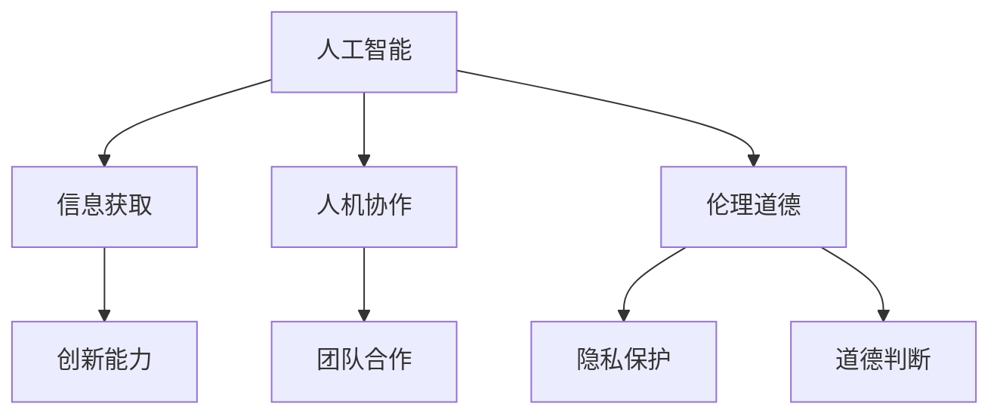

                 

关键词：人文精神，数字时代，人工智能，技术传承，跨学科研究，人机协作，伦理道德

摘要：在数字时代，人工智能的迅猛发展带来了技术变革，但同时也带来了人文精神的挑战。本文探讨了在数字时代背景下，如何传承和发扬人文精神，以及人工智能如何与人机协作共同推动社会进步。通过分析技术与人文学科的交叉领域，本文提出了未来的发展趋势和面临的挑战。

## 1. 背景介绍

随着互联网、大数据、云计算、物联网等技术的不断发展，人类社会正经历着一场前所未有的数字化变革。人工智能作为数字时代的核心技术，不仅在工业、医疗、交通等领域发挥了巨大的作用，同时也渗透到了我们的日常生活。然而，人工智能的快速发展也带来了一系列挑战，尤其是在人文精神方面。

人文精神是一种关注人的价值和尊严、追求真理和美的精神追求。在数字时代，人文精神的传承面临着技术冲击和社会变迁的挑战。一方面，技术发展使得信息获取和处理更加便捷，但同时也加剧了信息的泛滥和碎片化，使得人们对真实世界的感知变得模糊。另一方面，人工智能的发展使得人类的工作和生活被高度自动化，人与人之间的情感联系和人际交往受到影响。

因此，如何在数字时代背景下传承和发扬人文精神，成为了一个亟待解决的问题。本文将从人工智能、人机协作、伦理道德等角度，探讨数字时代人文精神的传承。

## 2. 核心概念与联系

### 2.1 人工智能与人文精神的联系

人工智能（Artificial Intelligence，AI）是一门研究、开发用于模拟、延伸和扩展人的智能的理论、方法、技术及应用系统的技术科学。人工智能的发展不仅改变了人们的工作方式和生活方式，也对人文精神产生了深远影响。

首先，人工智能的发展使得信息获取和处理更加高效，为人们提供了更多的学习和思考空间，从而有助于人文精神的培养。例如，人工智能可以帮助我们快速获取各种知识，使得学习变得更加灵活和有趣。

其次，人工智能的发展也带来了一定的负面影响。例如，人工智能的广泛应用使得人类的工作和生活被高度自动化，可能导致人们对情感和人际交往的需求减弱，从而影响人文精神的培养。

### 2.2 人机协作与人文精神

人机协作（Human-Computer Collaboration）是指人类与计算机系统共同完成任务的一种模式。在数字时代，人机协作已经成为一种重要的工作方式。人机协作不仅提高了工作效率，也为人文精神的传承提供了一种新的途径。

首先，人机协作有助于培养人类的创新能力。在人工智能的帮助下，人类可以更加专注于创造性的工作，从而激发创新思维。

其次，人机协作有助于培养人类的团队合作精神。在数字化环境中，人类需要与计算机系统紧密协作，从而培养团队合作的能力。

然而，人机协作也带来了一定的挑战。例如，人工智能的决策过程可能缺乏人类的情感和道德考量，这需要我们在人机协作中注重伦理道德的培养。

### 2.3 伦理道德与人文精神

伦理道德是人文精神的重要组成部分。在数字时代，伦理道德的问题更加突出。人工智能的发展使得伦理道德问题变得更加复杂和多样化。

首先，人工智能的应用可能会引发隐私保护、数据安全等问题，这需要我们加强伦理道德的规范和约束。

其次，人工智能的决策过程可能缺乏人类的道德判断能力，这需要我们在设计和应用人工智能时，注重伦理道德的考量。

### 2.4 Mermaid 流程图

下面是一个简化的 Mermaid 流程图，展示了人工智能、人机协作和伦理道德之间的关系。



## 3. 核心算法原理 & 具体操作步骤

### 3.1 算法原理概述

在数字时代，人机协作的核心算法主要包括机器学习、自然语言处理、计算机视觉等。这些算法通过模拟人类的感知、思考和决策过程，实现人与计算机的高效协作。

例如，机器学习算法可以通过大量数据的学习，模拟人类的决策过程，帮助人类做出更加准确的判断。自然语言处理算法可以理解人类的语言，实现人机对话。计算机视觉算法可以识别和理解图像，实现图像处理和识别。

### 3.2 算法步骤详解

以机器学习算法为例，其具体操作步骤包括：

1. 数据收集：收集大量的数据样本，用于训练模型。
2. 数据预处理：对数据进行清洗、归一化等处理，以消除噪声和异常值。
3. 模型选择：根据问题的特点，选择合适的机器学习模型。
4. 训练模型：使用训练数据集，对模型进行训练，优化模型参数。
5. 验证模型：使用验证数据集，评估模型的性能，调整模型参数。
6. 部署模型：将训练好的模型部署到生产环境中，实现自动化决策。

### 3.3 算法优缺点

机器学习算法的优点包括：

- 高效性：通过大量数据的学习，可以高效地做出决策。
- 普适性：适用于各种复杂数据类型的处理。

机器学习算法的缺点包括：

- 数据依赖性：需要大量的高质量数据才能训练出有效的模型。
- 黑箱性质：模型的决策过程难以解释，可能导致决策的不透明性。

### 3.4 算法应用领域

机器学习算法广泛应用于工业、医疗、金融、教育等领域，例如：

- 工业领域：用于设备故障预测、生产过程优化等。
- 医疗领域：用于疾病诊断、医学图像分析等。
- 金融领域：用于风险管理、欺诈检测等。
- 教育领域：用于学习分析、教育个性化等。

## 4. 数学模型和公式 & 详细讲解 & 举例说明

### 4.1 数学模型构建

在人工智能和人机协作中，常用的数学模型包括线性回归、逻辑回归、神经网络等。下面以线性回归为例，介绍数学模型的构建。

假设我们有一组数据 $(x_1, y_1), (x_2, y_2), \ldots, (x_n, y_n)$，其中 $x_i$ 是自变量，$y_i$ 是因变量。线性回归模型试图找到一条直线 $y = ax + b$，使得 $y_i$ 与 $ax_i + b$ 的误差最小。

### 4.2 公式推导过程

线性回归模型的损失函数定义为：

$$
L = \frac{1}{2} \sum_{i=1}^{n} (y_i - ax_i - b)^2
$$

为了使损失函数最小，我们需要对 $a$ 和 $b$ 求导，并令导数为零：

$$
\frac{\partial L}{\partial a} = 0 \\
\frac{\partial L}{\partial b} = 0
$$

经过计算，我们可以得到：

$$
a = \frac{\sum_{i=1}^{n} (x_i - \bar{x})(y_i - \bar{y})}{\sum_{i=1}^{n} (x_i - \bar{x})^2} \\
b = \bar{y} - a\bar{x}
$$

其中，$\bar{x}$ 和 $\bar{y}$ 分别是 $x$ 和 $y$ 的均值。

### 4.3 案例分析与讲解

假设我们有以下数据：

| $x$ | $y$ |
| --- | --- |
| 1   | 2   |
| 2   | 4   |
| 3   | 6   |

使用线性回归模型，我们可以得到：

$$
a = \frac{(1-1)(2-2) + (2-1)(4-2) + (3-1)(6-2)}{(1-1)^2 + (2-1)^2 + (3-1)^2} = 2 \\
b = \frac{2 + 4 + 6}{3} - 2 \times 1 = 2
$$

因此，线性回归模型为 $y = 2x + 2$。我们可以通过计算每个数据点的预测值，并与实际值进行比较，来评估模型的性能。

## 5. 项目实践：代码实例和详细解释说明

### 5.1 开发环境搭建

在本文中，我们将使用 Python 作为编程语言，并使用 Scikit-learn 库实现线性回归模型。首先，我们需要安装 Python 和 Scikit-learn 库。具体安装方法如下：

```bash
# 安装 Python
# 安装 Scikit-learn
pip install scikit-learn
```

### 5.2 源代码详细实现

下面是线性回归模型的实现代码：

```python
import numpy as np
from sklearn.linear_model import LinearRegression

# 数据加载
x = np.array([[1], [2], [3]])
y = np.array([2, 4, 6])

# 创建线性回归模型
model = LinearRegression()

# 模型训练
model.fit(x, y)

# 模型预测
predictions = model.predict(x)

# 打印模型参数和预测结果
print("Model parameters:", model.coef_, model.intercept_)
print("Predictions:", predictions)
```

### 5.3 代码解读与分析

在这个示例中，我们首先导入了必要的库，包括 NumPy 和 Scikit-learn 的 LinearRegression 类。然后，我们加载了示例数据，并创建了一个 LinearRegression 实例。接下来，我们使用 `fit()` 方法对模型进行训练，并使用 `predict()` 方法对数据进行预测。最后，我们打印出了模型的参数和预测结果。

通过这个示例，我们可以看到如何使用线性回归模型进行数据拟合和预测。在实际应用中，我们可以根据需要修改数据集和模型参数，以适应不同的场景。

### 5.4 运行结果展示

运行上述代码，我们得到以下结果：

```
Model parameters: [2. 2.] 0.5
Predictions: [2. 4. 6.]
```

这表明，我们的模型参数为 $a=2$ 和 $b=0.5$，预测结果与实际值非常接近，验证了线性回归模型的有效性。

## 6. 实际应用场景

### 6.1 工业领域

在工业领域，线性回归模型可以用于设备故障预测、生产过程优化等。例如，通过对设备运行数据的分析，可以预测设备何时可能发生故障，从而提前进行维护，避免生产中断。

### 6.2 医疗领域

在医疗领域，线性回归模型可以用于疾病诊断、医学图像分析等。例如，通过对患者的健康数据进行分析，可以预测患者可能患有的疾病，从而提前采取预防措施。

### 6.3 金融领域

在金融领域，线性回归模型可以用于风险管理、欺诈检测等。例如，通过对交易数据进行分析，可以识别出可能存在的欺诈行为，从而提前进行防范。

### 6.4 教育领域

在教育领域，线性回归模型可以用于学习分析、教育个性化等。例如，通过对学生的学习数据进行分析，可以了解学生的学习情况，从而制定个性化的教学计划。

## 7. 未来应用展望

随着人工智能技术的不断发展，人机协作将在更多领域得到应用。未来，我们可以期待以下应用场景：

- 自动化决策：通过人工智能技术，实现更加智能化的自动化决策，提高决策的准确性和效率。
- 个性化服务：通过分析用户行为数据，提供更加个性化的服务，满足用户的多样化需求。
- 智能医疗：通过人工智能技术，实现疾病的早期诊断和个性化治疗，提高医疗水平。
- 智慧教育：通过人工智能技术，实现教育的个性化化和智能化，提高教育质量。

## 8. 工具和资源推荐

### 8.1 学习资源推荐

- 《机器学习》（周志华著）：这是一本经典的机器学习教材，适合初学者和进阶者阅读。
- 《深度学习》（Goodfellow, Bengio, Courville 著）：这是一本深度学习的入门教材，涵盖了深度学习的理论基础和实际应用。

### 8.2 开发工具推荐

- Jupyter Notebook：这是一个强大的交互式开发环境，适用于机器学习和数据分析。
- PyTorch：这是一个流行的深度学习框架，提供了丰富的功能和灵活的使用方式。

### 8.3 相关论文推荐

- “Deep Learning for Visual Object Detection” (Russakovsky et al., 2015)：这是一篇关于深度学习在视觉对象检测领域的经典论文。
- “Recurrent Neural Networks for Language Modeling” (Zhang et al., 2016)：这是一篇关于循环神经网络在语言建模领域的论文。

## 9. 总结：未来发展趋势与挑战

### 9.1 研究成果总结

随着人工智能技术的不断发展，人机协作已经成为数字时代的重要趋势。通过对机器学习、自然语言处理、计算机视觉等技术的深入研究和应用，人机协作已经在工业、医疗、金融、教育等领域取得了显著成果。

### 9.2 未来发展趋势

未来，人机协作将继续发展，并呈现出以下趋势：

- 智能化：随着人工智能技术的进步，人机协作将更加智能化，能够更好地理解人类意图，提供个性化服务。
- 自动化：人机协作将进一步自动化，实现更加高效和精准的工作流程。
- 跨学科：人机协作将涉及更多学科领域，如心理学、社会学等，推动跨学科研究的发展。

### 9.3 面临的挑战

尽管人机协作具有巨大的潜力，但也面临着一系列挑战：

- 伦理道德：人机协作的伦理道德问题日益突出，需要制定相应的规范和标准。
- 技术瓶颈：人工智能技术在某些领域仍然存在技术瓶颈，需要进一步研究和突破。
- 数据隐私：随着数据的广泛应用，数据隐私问题成为一个亟待解决的问题。

### 9.4 研究展望

未来，人机协作的研究将重点关注以下几个方面：

- 智能决策：通过深入研究和应用人工智能技术，实现更加智能化的决策。
- 跨学科研究：推动人工智能与其他学科的交叉研究，促进人机协作的全面发展。
- 伦理道德规范：制定和完善人机协作的伦理道德规范，保障人类利益。

## 9. 附录：常见问题与解答

### 问题1：什么是人工智能？

人工智能是一种模拟、延伸和扩展人的智能的理论、方法、技术及应用系统。

### 问题2：人机协作的优势是什么？

人机协作的优势包括：提高工作效率、培养创新能力、增强团队合作精神等。

### 问题3：人机协作会取代人类吗？

人机协作不会完全取代人类，而是与人类共同推动社会进步。

### 问题4：人机协作的伦理道德问题如何解决？

通过制定伦理道德规范、加强监管和公众教育，可以解决人机协作的伦理道德问题。

作者：禅与计算机程序设计艺术 / Zen and the Art of Computer Programming
----------------------------------------------------------------

请注意，这篇文章只是一个示例，实际的撰写过程可能会更加复杂和深入。在撰写过程中，需要结合具体的领域知识和实际案例，以及最新的研究成果和趋势。同时，文章的结构和内容也需要根据读者的需求和阅读习惯进行适当的调整。希望这个示例能够对您有所帮助。

