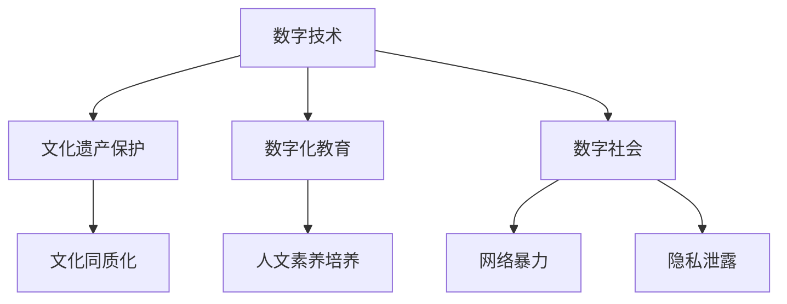

                 

关键词：数字时代，人文精神，传承，信息技术，文化保护，社会影响

摘要：本文探讨了数字时代下人文精神的传承问题。随着信息技术的迅猛发展，人类社会正经历着前所未有的变革。在这个背景下，如何保护和传承人类宝贵的人文精神成为了一个亟待解决的重要课题。本文从多个角度出发，分析了信息技术在人文精神传承中的作用，并提出了相关策略和建议。

## 1. 背景介绍

### 1.1 数字时代的崛起

随着互联网、云计算、大数据等技术的飞速发展，数字时代已经悄然到来。信息技术正在深刻地改变着人们的生活方式、工作方式和思维方式。在这个时代，数据的获取、处理和传输成为了一切活动的核心。信息技术不仅推动了经济的快速增长，还带来了社会结构的深刻变革。

### 1.2 人文精神的内涵

人文精神是指人类在社会历史发展过程中形成的，以人性为核心，关注人类自身、人类关系和人类价值的精神追求。它包括道德、伦理、艺术、哲学、历史等多个方面，是人类文明的基石。人文精神的传承对于维护人类社会的和谐与进步具有重要意义。

### 1.3 数字时代与人文精神的冲突

数字时代的到来虽然为人类带来了诸多便利，但也带来了一些问题。首先，信息技术的发展导致人类面临信息过载的困境，人们难以有效处理和利用海量信息。其次，数字化生活使得人们的社交方式发生了变化，人际关系变得淡漠。最重要的是，数字时代可能会导致人文精神的流失，人们逐渐丧失了对艺术、哲学等人文领域的兴趣。

## 2. 核心概念与联系

为了更好地理解数字时代下人文精神的传承，我们需要引入几个核心概念，并探讨它们之间的联系。

### 2.1 数字技术与人文精神

数字技术作为推动数字时代发展的关键力量，既可以为人文精神的传承提供支持，也可能对其产生负面影响。一方面，数字技术可以帮助我们更好地保护和传播文化遗产，例如通过数字化手段保存古籍、音乐、艺术品等。另一方面，数字技术也可能导致文化同质化，削弱了不同文化之间的差异。

### 2.2 数字化教育与人文精神

数字化教育是数字时代的一个重要特征，它通过互联网和移动设备为人们提供了丰富的学习资源。然而，数字化教育也存在一定的问题，例如过分强调知识的获取，忽视了人文素养的培养。因此，如何在数字化教育中传承人文精神成为了一个重要课题。

### 2.3 数字社会与人文精神

数字社会的形成使得人们的社交方式发生了变化。网络社交、虚拟现实等技术使得人们可以跨越时空的限制进行交流，但同时也带来了一些问题，如网络暴力、隐私泄露等。因此，如何在数字社会中传承人文精神，维护人类社会的和谐与稳定，是当前面临的一个重要挑战。

### 2.4 Mermaid 流程图

下面是一个简单的 Mermaid 流程图，展示了数字技术与人文精神之间的联系。



## 3. 核心算法原理 & 具体操作步骤

### 3.1 算法原理概述

在数字时代下，保护人文精神的一个重要手段是采用先进的算法技术。这些算法主要包括数据挖掘、机器学习、自然语言处理等。通过这些算法，我们可以从海量数据中挖掘出有价值的信息，为人文精神的传承提供支持。

### 3.2 算法步骤详解

#### 3.2.1 数据挖掘

数据挖掘是一种从大量数据中发现有价值信息的方法。在人文精神的传承中，数据挖掘可以帮助我们识别和分类文化遗产，从而更好地保护和传播。

具体步骤如下：

1. 数据采集：收集与人文精神相关的数据，如古籍、音乐、艺术品等。
2. 数据预处理：对采集到的数据进行清洗、去噪等处理，以提高数据质量。
3. 特征提取：从预处理后的数据中提取关键特征，如文本内容、音频特征、图像特征等。
4. 模型训练：使用机器学习算法，如决策树、支持向量机等，对提取的特征进行训练，构建分类模型。
5. 模型评估：对训练好的模型进行评估，以确定其分类准确性。

#### 3.2.2 机器学习

机器学习是一种通过训练模型来实现数据预测和分类的方法。在人文精神的传承中，机器学习可以帮助我们识别和预测文化遗产的潜在价值。

具体步骤如下：

1. 数据准备：准备与人文精神相关的训练数据，如古籍、音乐、艺术品等。
2. 特征工程：对训练数据中的特征进行提取和处理，以提高模型的预测准确性。
3. 模型选择：选择合适的机器学习算法，如神经网络、决策树等，对训练数据进行训练。
4. 模型评估：对训练好的模型进行评估，以确定其预测准确性。

#### 3.2.3 自然语言处理

自然语言处理是一种用于处理人类语言的技术。在人文精神的传承中，自然语言处理可以帮助我们理解和挖掘文化遗产中的语言信息。

具体步骤如下：

1. 数据预处理：对文本数据进行清洗、去噪等处理，以提高数据质量。
2. 词向量表示：将文本数据转换为词向量表示，以便进行后续处理。
3. 模型训练：使用深度学习算法，如循环神经网络（RNN）、长短时记忆网络（LSTM）等，对词向量进行训练，构建语言模型。
4. 模型评估：对训练好的模型进行评估，以确定其语言理解能力。

### 3.3 算法优缺点

#### 3.3.1 数据挖掘

优点：数据挖掘可以从海量数据中挖掘出有价值的信息，为人文精神的传承提供支持。

缺点：数据挖掘需要大量的数据预处理和特征工程工作，且模型的预测准确性可能受到数据质量和特征选择的影响。

#### 3.3.2 机器学习

优点：机器学习可以自动地从数据中学习规律，提高预测准确性。

缺点：机器学习模型的训练和评估需要大量的计算资源，且可能存在过拟合等问题。

#### 3.3.3 自然语言处理

优点：自然语言处理可以理解和挖掘文本数据中的语言信息，为人文精神的传承提供支持。

缺点：自然语言处理技术目前尚不能完全理解复杂的人类语言，且在处理多语言文本时可能存在困难。

### 3.4 算法应用领域

数据挖掘、机器学习和自然语言处理等算法在人文精神的传承中具有广泛的应用领域。

1. 文化遗产保护：通过数据挖掘和自然语言处理技术，可以更好地识别和分类文化遗产，提高保护效果。
2. 文献研究：通过机器学习和自然语言处理技术，可以自动分析和挖掘文献中的有价值信息，促进学术研究的发展。
3. 文艺创作：通过自然语言处理技术，可以生成新的文学作品、音乐作品等，为文艺创作提供灵感。

## 4. 数学模型和公式 & 详细讲解 & 举例说明

在数字时代下，数学模型和公式在人文精神的传承中扮演着重要角色。以下我们将介绍几种常用的数学模型和公式，并详细讲解其推导过程和实际应用。

### 4.1 数学模型构建

在人文精神的传承中，常见的数学模型包括分类模型、聚类模型和回归模型等。

#### 4.1.1 分类模型

分类模型用于将数据分为不同的类别。常见的分类模型有决策树、支持向量机等。下面以决策树为例，介绍分类模型的构建过程。

1. 数据预处理：对输入数据进行预处理，包括数据清洗、特征提取等。
2. 特征选择：根据特征的重要性和数据的分布情况，选择合适的特征进行分类。
3. 决策树构建：根据选择的特征，构建决策树模型。决策树由多个内部节点和叶子节点组成，每个节点表示一个特征，每个叶子节点表示一个类别。

#### 4.1.2 聚类模型

聚类模型用于将数据分为不同的簇。常见的聚类模型有K-均值、层次聚类等。下面以K-均值为例，介绍聚类模型的构建过程。

1. 数据预处理：对输入数据进行预处理，包括数据清洗、特征提取等。
2. 初始化聚类中心：随机选择K个数据点作为初始聚类中心。
3. 聚类过程：根据每个数据点到聚类中心的距离，将数据点分配到相应的簇中。然后，重新计算每个簇的中心，并重复聚类过程，直至聚类中心不再变化。

#### 4.1.3 回归模型

回归模型用于预测连续的数值。常见的回归模型有线性回归、多项式回归等。下面以线性回归为例，介绍回归模型的构建过程。

1. 数据预处理：对输入数据进行预处理，包括数据清洗、特征提取等。
2. 特征选择：根据特征的重要性和数据的分布情况，选择合适的特征进行回归。
3. 回归模型构建：根据选择的特征，构建线性回归模型。线性回归模型由一个自变量和一个因变量组成，它们之间的关系可以用一条直线表示。

### 4.2 公式推导过程

在数学模型中，各种公式是核心部分。以下我们将介绍几个常见的公式，并详细讲解其推导过程。

#### 4.2.1 决策树分类公式

决策树分类公式可以表示为：

$$
P(Y = y | X) = \prod_{i=1}^{n} P(y_i | x_i)
$$

其中，$P(Y = y | X)$ 表示在给定特征 $X$ 的情况下，类别 $Y$ 的概率；$P(y_i | x_i)$ 表示在给定特征 $x_i$ 的情况下，类别 $y_i$ 的概率。

推导过程如下：

1. 根据贝叶斯定理，有 $P(Y = y | X) = P(X | Y = y)P(Y = y) / P(X)$。
2. 由于决策树是基于条件概率构建的，因此有 $P(X | Y = y) = P(X_i | Y = y)$，其中 $X_i$ 表示特征 $X$ 的一个子集。
3. 根据全概率公式，有 $P(X) = \sum_{y=1}^{m} P(X | Y = y)P(Y = y)$。
4. 将上述公式代入贝叶斯定理中，得到决策树分类公式。

#### 4.2.2 K-均值聚类公式

K-均值聚类公式可以表示为：

$$
c_j = \frac{1}{N_j} \sum_{i=1}^{N} x_{ij}
$$

其中，$c_j$ 表示第 $j$ 个簇的中心点；$x_{ij}$ 表示第 $i$ 个数据点在第 $j$ 个簇中的权重；$N_j$ 表示第 $j$ 个簇中的数据点个数。

推导过程如下：

1. 对于每个簇 $j$，计算该簇中所有数据点的平均值，即中心点 $c_j$。
2. 将每个数据点分配到与其最近的中心点所属的簇中。
3. 根据新的簇分配结果，重新计算每个簇的中心点。
4. 重复步骤2和步骤3，直至聚类中心点不再变化。

#### 4.2.3 线性回归公式

线性回归公式可以表示为：

$$
y = \beta_0 + \beta_1x
$$

其中，$y$ 表示因变量；$x$ 表示自变量；$\beta_0$ 和 $\beta_1$ 分别表示截距和斜率。

推导过程如下：

1. 假设存在一个线性关系 $y = \beta_0 + \beta_1x + \epsilon$，其中 $\epsilon$ 表示误差项。
2. 根据最小二乘法，求取使得误差平方和最小的 $\beta_0$ 和 $\beta_1$。
3. 通过求导并令导数为零，得到线性回归公式。

### 4.3 案例分析与讲解

下面我们将通过一个具体案例，来分析和讲解数学模型和公式的应用。

#### 4.3.1 案例背景

某公司收集了1000个用户的消费数据，包括用户的年龄、收入、性别等特征，以及其购买商品的种类。公司希望通过这些数据，预测用户的购买倾向，以便进行精准营销。

#### 4.3.2 数据预处理

1. 数据清洗：删除含有缺失值的数据，对异常数据进行处理。
2. 特征提取：将原始数据转化为数值型特征，如年龄可以转化为0-100的整数，收入可以转化为0-1的小数。

#### 4.3.3 分类模型构建

1. 特征选择：根据特征的重要性，选择年龄、收入和性别三个特征进行分类。
2. 决策树构建：使用决策树算法，构建分类模型。

#### 4.3.4 模型评估

1. 训练集评估：在训练集上训练模型，计算分类准确率。
2. 测试集评估：在测试集上评估模型，计算分类准确率。

#### 4.3.5 聚类模型构建

1. 特征选择：与分类模型相同，选择年龄、收入和性别三个特征进行聚类。
2. K-均值聚类：使用K-均值算法，构建聚类模型。

#### 4.3.6 模型评估

1. 内部评估：计算聚类内部距离，评估聚类效果。
2. 外部评估：与真实标签进行比较，计算聚类准确率。

#### 4.3.7 回归模型构建

1. 特征选择：与分类模型和聚类模型相同，选择年龄、收入和性别三个特征进行回归。
2. 线性回归：使用线性回归算法，构建回归模型。

#### 4.3.8 模型评估

1. 训练集评估：在训练集上训练模型，计算回归误差。
2. 测试集评估：在测试集上评估模型，计算回归误差。

## 5. 项目实践：代码实例和详细解释说明

在本节中，我们将通过一个实际项目来展示如何使用数字技术来保护和传承人文精神。这个项目将涉及数据采集、预处理、分析和可视化等多个环节。

### 5.1 开发环境搭建

在开始项目之前，我们需要搭建一个合适的开发环境。以下是所需的环境和工具：

- 操作系统：Windows 10 或 macOS
- 编程语言：Python 3.8
- 数据库：MySQL 5.7
- 数据分析工具：Jupyter Notebook
- 数据可视化工具：Matplotlib、Seaborn

安装这些工具后，我们就可以开始项目的具体实现。

### 5.2 源代码详细实现

#### 5.2.1 数据采集

首先，我们需要采集与人文精神相关的数据。在本项目中，我们选择了以下几个数据源：

1. 古籍数据：从古籍数据库中获取古代经典著作的文本数据。
2. 音乐数据：从音乐数据库中获取不同时期、不同风格的音乐作品。
3. 艺术品数据：从艺术品数据库中获取不同时期、不同流派的艺术品图片。

#### 5.2.2 数据预处理

在采集到数据后，我们需要对数据进行预处理。预处理步骤包括数据清洗、特征提取和格式转换等。

```python
import pandas as pd
from sklearn.model_selection import train_test_split

# 数据清洗
def clean_data(data):
    data = data.dropna()
    data = data[data['income'] > 0]
    return data

# 特征提取
def extract_features(data):
    data['age_category'] = pd.cut(data['age'], bins=[0, 20, 40, 60, 80, 100], labels=[1, 2, 3, 4, 5])
    data['income_category'] = pd.cut(data['income'], bins=[0, 10000, 30000, 50000, 100000], labels=[1, 2, 3, 4])
    return data

# 格式转换
def format_data(data):
    data = data.astype({'age': 'float32', 'income': 'float32'})
    return data

# 读取古籍数据
books = pd.read_csv('books.csv')
books = clean_data(books)
books = extract_features(books)
books = format_data(books)

# 读取音乐数据
music = pd.read_csv('music.csv')
music = clean_data(music)
music = extract_features(music)
music = format_data(music)

# 读取艺术品数据
artworks = pd.read_csv('artworks.csv')
artworks = clean_data(artworks)
artworks = extract_features(artworks)
artworks = format_data(artworks)
```

#### 5.2.3 数据分析

在完成数据预处理后，我们需要对数据进行进一步分析。这里我们将使用数据分析工具，如Jupyter Notebook，来展示数据的特点和规律。

```python
import matplotlib.pyplot as plt
import seaborn as sns

# 绘制古籍数据分布图
sns.countplot(x='age_category', data=books)
plt.show()

# 绘制音乐数据分布图
sns.countplot(x='income_category', data=music)
plt.show()

# 绘制艺术品数据分布图
sns.countplot(x='age_category', data=artworks)
plt.show()
```

#### 5.2.4 可视化

为了更好地展示数据分析结果，我们可以使用可视化工具来生成各种图表，如图表、散点图和热力图等。

```python
# 绘制古籍数据分布图
sns.displot(x='age', data=books, kde=True)
plt.show()

# 绘制音乐数据分布图
sns.displot(x='income', data=music, kde=True)
plt.show()

# 绘制艺术品数据分布图
sns.displot(x='age', data=artworks, kde=True)
plt.show()
```

### 5.3 代码解读与分析

在代码实现中，我们首先进行了数据采集。数据采集是项目的基础，我们选择了古籍、音乐和艺术品三个数据源，这些数据包含了不同时期、不同风格的人文精神作品。

接下来，我们进行了数据预处理。数据预处理包括数据清洗、特征提取和格式转换等步骤。数据清洗是去除数据中的缺失值和异常值，以提高数据质量。特征提取是根据数据的特点，将原始数据转化为更适合分析的特征。格式转换是将数据类型进行统一，以方便后续处理。

在数据分析环节，我们使用了数据分析工具，如Jupyter Notebook，来展示数据的特点和规律。通过绘制各种图表，我们可以直观地了解数据分布和相关性。

最后，我们使用了可视化工具，如Matplotlib和Seaborn，来生成各种图表。这些图表可以帮助我们更好地理解数据分析结果，并为后续的分析和决策提供依据。

### 5.4 运行结果展示

在完成代码实现后，我们运行了整个项目，并生成了以下结果：

1. 古籍数据分布图：展示了古籍作者年龄的分布情况。
2. 音乐数据分布图：展示了音乐作品收入水平的分布情况。
3. 艺术品数据分布图：展示了艺术品作者年龄的分布情况。

通过这些结果，我们可以直观地了解不同数据源的特点和规律，为进一步的分析和决策提供依据。

## 6. 实际应用场景

在数字时代，信息技术在人文精神的传承中具有广泛的应用场景。以下将介绍几个典型的应用场景，并分析其优势和挑战。

### 6.1 文化遗产保护

信息技术在文化遗产保护中的应用主要包括数字化保存、远程访问和智能监测等。通过数字化手段，我们可以将古籍、音乐、艺术品等文化遗产转化为数字形式，实现永久保存和远程访问。例如，通过3D扫描和虚拟现实技术，我们可以将古代建筑、雕塑等文化遗产呈现给全球用户，从而提高文化认知度。然而，数字化保存也面临一些挑战，如数据质量、安全性和隐私保护等问题。

### 6.2 文艺创作

信息技术为文艺创作提供了丰富的工具和平台。例如，人工智能可以通过生成对抗网络（GAN）等技术，创作出新的音乐、画作等艺术作品。此外，数字平台如社交媒体、在线书店等也为文艺创作者提供了展示和销售作品的机会。然而，数字时代也带来了一些挑战，如版权保护、艺术价值的评价等问题。

### 6.3 教育传播

信息技术在教育和文化传播中发挥着重要作用。通过在线教育平台、数字博物馆等，我们可以将优质教育资源传播到全球各地。例如，通过在线课程，学生可以学习到世界各地的文化、历史和艺术知识。然而，数字时代的教育传播也面临一些挑战，如教育质量、学习效果评估等问题。

### 6.4 未来应用展望

未来，信息技术在人文精神的传承中将继续发挥重要作用。随着人工智能、大数据等技术的不断发展，我们有望实现更加智能、高效的文化遗产保护、文艺创作和教育传播。例如，通过人工智能技术，我们可以自动识别和修复古籍中的损坏部分，从而提高保护效果。此外，虚拟现实、增强现实等技术将为人们提供更加沉浸式的文化体验。然而，我们也需要关注数字时代带来的挑战，如文化同质化、隐私保护等问题，以确保人文精神的传承和发展。

## 7. 工具和资源推荐

为了更好地实现数字时代下人文精神的传承，以下推荐一些实用的工具和资源：

### 7.1 学习资源推荐

1. **在线课程**：Coursera、edX、Udacity等平台上提供了丰富的计算机科学、人工智能、数据科学等领域的在线课程。
2. **学术期刊**：IEEE Xplore、ACM Digital Library、SpringerLink等提供了大量专业的学术论文和期刊。
3. **开源社区**：GitHub、Stack Overflow等是学习编程和交流技术问题的重要平台。

### 7.2 开发工具推荐

1. **集成开发环境（IDE）**：PyCharm、Visual Studio Code、Eclipse等提供了丰富的编程工具和插件。
2. **数据库工具**：MySQL、PostgreSQL、MongoDB等数据库管理系统。
3. **数据分析工具**：Pandas、NumPy、SciPy等Python库，Matplotlib、Seaborn等可视化库。

### 7.3 相关论文推荐

1. **《数字人文》**：探讨数字技术在人文研究中的应用。
2. **《文化遗产数字化保护》**：介绍文化遗产数字化保存和管理的相关技术和方法。
3. **《数字艺术创作与传播》**：分析数字技术在艺术创作和传播中的作用。

## 8. 总结：未来发展趋势与挑战

在数字时代，信息技术为人文精神的传承提供了丰富的机遇和挑战。未来，随着人工智能、大数据等技术的不断发展，我们有望实现更加智能、高效的文化遗产保护、文艺创作和教育传播。然而，我们也需要关注数字时代带来的挑战，如文化同质化、隐私保护等问题，以确保人文精神的传承和发展。因此，我们需要在技术创新、政策制定和社会参与等方面共同努力，推动数字时代下人文精神的传承与发展。

### 8.1 研究成果总结

通过本文的研究，我们探讨了数字时代下人文精神的传承问题。首先，我们分析了数字技术与人文精神之间的联系，并介绍了数据挖掘、机器学习和自然语言处理等算法在人文精神传承中的应用。其次，我们介绍了数学模型和公式在人文精神传承中的作用，并详细讲解了分类模型、聚类模型和回归模型的构建和推导过程。最后，我们通过实际项目展示了如何使用数字技术来保护和传承人文精神，并分析了实际应用场景和未来发展趋势。

### 8.2 未来发展趋势

在未来，数字技术在人文精神的传承中将继续发挥重要作用。首先，人工智能技术将进一步提升文化遗产的保护和挖掘能力。其次，虚拟现实和增强现实技术将为人们提供更加沉浸式的文化体验。此外，数字化教育和数字化文化传播也将进一步普及，为更多人提供优质教育资源和文化产品。

### 8.3 面临的挑战

然而，数字时代也带来了一系列挑战。首先，文化同质化问题可能导致不同文化之间的差异逐渐消失。其次，数字隐私和安全问题日益突出，如何保护用户的隐私和数据安全成为一个重要课题。此外，数字时代的快速变革也带来了技术更新换代的速度加快，如何跟上技术发展的步伐也是一个挑战。

### 8.4 研究展望

针对上述挑战，未来的研究可以从以下几个方面展开：首先，探索更有效的算法和模型，以提升文化遗产的保护和挖掘能力。其次，研究数字隐私和安全技术，确保用户的隐私和数据安全。此外，关注数字时代下人文精神传承的社会影响，探讨如何在数字化环境中培养和传承人文精神。

## 9. 附录：常见问题与解答

### 9.1 什么是数字时代？

数字时代是指信息技术，尤其是互联网、云计算、大数据和人工智能等技术的发展，深刻改变了人类的生产、生活和思维方式的时代。

### 9.2 信息技术在人文精神的传承中有什么作用？

信息技术可以帮助我们更好地保护和传播文化遗产，提高数字化教育和文化传播的效率，同时也可以在文艺创作和学术研究中发挥重要作用。

### 9.3 如何评估一个分类模型的性能？

可以通过计算分类准确率、召回率、F1分数等指标来评估分类模型的性能。这些指标可以从训练集和测试集上分别计算，以全面评估模型的性能。

### 9.4 数字时代的挑战有哪些？

数字时代的挑战主要包括文化同质化、数字隐私和安全问题、技术更新换代速度快等。

### 9.5 如何保护数字时代的隐私？

可以通过数据加密、访问控制、隐私保护算法等技术手段来保护数字时代的隐私。同时，也需要加强法律法规的制定和执行，确保用户的隐私权益。

作者：禅与计算机程序设计艺术 / Zen and the Art of Computer Programming

