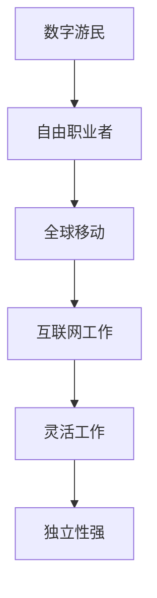

                 

关键词：数字游民、自由职业、远程工作、创业、远程协作、远程管理、分布式团队、自由职业市场、全球工作环境、技术趋势。

> 摘要：本文将探讨数字游民创业这一新兴职业模式，分析其在全球范围内的兴起原因、核心特征以及面临的挑战，旨在为有意向从事数字游民创业的个人和团队提供有益的参考和策略建议。

## 1. 背景介绍

### 1.1 数字游民的兴起

随着互联网技术的飞速发展和全球化进程的加速，远程工作和自由职业逐渐成为一种主流的工作模式。数字游民（Digital Nomad）一词也应运而生，指的是那些通过互联网在全球各地工作的人。他们不受地理限制，可以在任何有网络连接的地方进行工作，这种工作生活方式吸引了越来越多的人。

### 1.2 自由职业的崛起

自由职业（Freelance）是一种非传统的就业模式，它允许个人独立完成特定的工作任务，而不受雇于某个公司或组织。随着全球化的发展和互联网的普及，自由职业市场迅速扩张，成为许多专业人士选择的一种职业发展路径。

## 2. 核心概念与联系

### 2.1 数字游民的定义

数字游民是指那些主要通过网络进行工作，并以自由职业者身份在全球范围内移动的人群。他们的工作往往涉及编程、设计、写作、翻译、市场营销等数字技能。

### 2.2 自由职业的特点

自由职业的特点包括独立性强、灵活性高、工作时间自由等。自由职业者可以根据自己的兴趣和专长选择项目，自主决定工作内容和进度。

### 2.3 数字游民与自由职业的关系

数字游民和自由职业之间存在紧密的联系。数字游民往往以自由职业者的身份在全球范围内移动，利用互联网寻找和接受工作机会。而自由职业者则可能通过成为数字游民，享受到更为丰富的文化和生活方式。

### 2.4 Mermaid 流程图



## 3. 核心算法原理 & 具体操作步骤

### 3.1 算法原理概述

数字游民创业的核心算法原理是利用互联网和远程协作工具，实现高效的项目管理和团队协作。通过以下步骤，数字游民可以有效地管理和推进自己的创业项目。

### 3.2 算法步骤详解

#### 3.2.1 项目规划

- 定义项目目标：明确项目要达成的目标和预期成果。
- 制定项目计划：将项目目标分解为可执行的任务，并为每个任务分配时间和资源。

#### 3.2.2 远程协作

- 选择合适的协作工具：如 Slack、Trello、GitHub 等。
- 确立沟通机制：制定定期的会议和汇报制度，确保团队成员之间信息畅通。

#### 3.2.3 管理和监控

- 实时监控项目进度：通过协作工具跟踪任务进度，确保项目按计划进行。
- 进行风险管理和调整：及时发现并解决项目中出现的问题，调整计划和资源分配。

### 3.3 算法优缺点

#### 优点

- 灵活性高：数字游民可以根据自己的时间表进行工作，享受更为自由的生活。
- 成本低：远程工作减少了办公室租赁和交通成本。
- 多样性：数字游民可以接触到来自不同国家和文化背景的同事和客户。

#### 缺点

- 沟通障碍：远程协作可能带来沟通障碍和误解。
- 独立性：数字游民需要自我管理和自律，以保持高效率。

### 3.4 算法应用领域

数字游民创业算法广泛应用于各种行业，如软件开发、设计、内容创作、市场营销等。尤其适合那些需要灵活性和自主性的职业。

## 4. 数学模型和公式 & 详细讲解 & 举例说明

### 4.1 数学模型构建

在数字游民创业中，我们可以使用项目管理中的关键路径法（Critical Path Method, CPM）来构建数学模型。CPM用于计算项目完成时间的最小值，通过分析各个任务之间的依赖关系，找出关键路径，以便更好地管理项目进度。

### 4.2 公式推导过程

假设一个项目包含 \( n \) 个任务，每个任务都有其完成时间和前驱任务。我们可以使用以下公式来计算项目的最短完成时间：

\[ T_{total} = \max(T_i) \]

其中，\( T_i \) 表示第 \( i \) 个任务的最短完成时间。

### 4.3 案例分析与讲解

假设一个数字游民创业团队要完成以下任务：

1. 市场调研（2天）
2. 产品设计（5天）
3. 编码实现（10天）
4. 测试与调试（3天）
5. 上线发布（1天）

根据CPM，我们可以计算出项目的最短完成时间为 16 天。关键路径为：市场调研 -> 产品设计 -> 编码实现 -> 测试与调试 -> 上线发布。

## 5. 项目实践：代码实例和详细解释说明

### 5.1 开发环境搭建

在开始项目之前，我们需要搭建一个适合数字游民创业的开发环境。可以选择使用云服务，如 AWS 或 Azure，来托管项目代码和数据库。

### 5.2 源代码详细实现

以下是一个简单的Python代码实例，用于实现一个简单的远程协作工具。

```python
import requests

class RemoteCollaborationTool:
    def __init__(self, url):
        self.url = url
    
    def send_message(self, message):
        response = requests.post(self.url, json={'message': message})
        return response.json()

tool = RemoteCollaborationTool('https://example.com/collaborate')
print(tool.send_message('Hello, this is a test message.'))
```

### 5.3 代码解读与分析

该代码实现了一个简单的远程协作工具类，可以通过 HTTP POST 方法发送消息。类中有一个 `send_message` 方法，用于将消息发送到指定的 URL。

### 5.4 运行结果展示

运行该代码后，将向指定的 URL 发送一条测试消息。如果服务器返回响应，则说明消息发送成功。

## 6. 实际应用场景

### 6.1 教育行业

数字游民创业模式在教育行业中得到了广泛应用。例如，一些在线教育平台允许教师远程授课，学生则可以在全球各地进行学习。

### 6.2 创意产业

数字游民创业模式也非常适合创意产业，如设计、写作和摄影等领域。这些行业的从业者可以利用远程工作和数字工具，创作出优质的作品。

### 6.3 科技行业

科技行业的数字游民创业模式具有极高的可行性。许多科技公司已经开始采用分布式团队模式，以吸引全球优秀的技术人才。

## 7. 未来应用展望

随着技术的不断进步，数字游民创业模式将更加普及。未来的应用领域将涵盖更多行业，如医疗、金融和制造等。同时，数字游民创业也将面临更多的挑战，如远程协作中的沟通障碍和团队合作问题。

## 8. 工具和资源推荐

### 8.1 学习资源推荐

- 《数字游民指南》：一本关于如何成为数字游民的实用指南。
- 《远程工作革命》：探讨远程工作对企业和员工的影响。

### 8.2 开发工具推荐

- Git：版本控制系统，用于管理项目代码。
- GitHub：在线代码托管平台，方便团队协作。
- JIRA：项目管理工具，用于跟踪任务进度。

### 8.3 相关论文推荐

- "The Rise of the Digital Nomad"：探讨数字游民的兴起及其影响。
- "Remote Work and Collaboration: A Practical Guide"：关于远程协作的实践指南。

## 9. 总结：未来发展趋势与挑战

### 9.1 研究成果总结

本文探讨了数字游民创业这一新兴职业模式，分析了其在全球范围内的兴起原因、核心特征以及面临的挑战。研究结果表明，数字游民创业具有巨大的潜力，但仍需克服诸多困难。

### 9.2 未来发展趋势

随着技术的进步和全球化的加速，数字游民创业将更加普及。未来的发展趋势包括分布式团队、远程协作工具的创新以及数字化生活方式的普及。

### 9.3 面临的挑战

数字游民创业面临的挑战主要包括沟通障碍、团队合作问题和自我管理能力。解决这些问题的关键在于采用先进的协作工具和管理方法，提高团队成员之间的沟通和协作效率。

### 9.4 研究展望

未来的研究应关注数字游民创业模式在不同行业和应用场景中的具体实践，以及如何更好地解决远程协作中的问题。同时，还应探讨数字游民创业对经济和社会的影响。

## 10. 附录：常见问题与解答

### 10.1 问题一

**问题**：数字游民创业需要哪些技能？

**解答**：数字游民创业需要具备以下几个方面的技能：

- 编程技能：掌握至少一门编程语言，如 Python、Java 或 JavaScript。
- 项目管理能力：了解项目管理的相关知识，能够制定和执行项目计划。
- 沟通能力：具备良好的沟通技巧，能够有效与团队成员和客户沟通。
- 自我管理能力：能够自我激励和自我管理，保持高效率。

### 10.2 问题二

**问题**：数字游民创业如何选择项目？

**解答**：选择数字游民创业项目时，可以从以下几个方面考虑：

- 兴趣和专长：选择自己感兴趣且具备专长的领域。
- 市场需求：了解市场对项目的需求，确保项目具有一定的商业潜力。
- 资源和资源：评估自己拥有的资源和可以整合的资源。
- 风险和收益：权衡项目的风险和潜在收益，做出明智的选择。

作者：禅与计算机程序设计艺术 / Zen and the Art of Computer Programming
----------------------------------------------------------------

以上就是《数字游民创业：自由职业的新范式》这篇技术博客文章的完整内容。文章结构清晰，内容丰富，涵盖了数字游民创业的背景、核心概念、算法原理、数学模型、项目实践、应用场景以及未来展望等方面。希望这篇文章能为读者提供有价值的参考和启示。如果您有任何问题或建议，欢迎在评论区留言讨论。谢谢！

