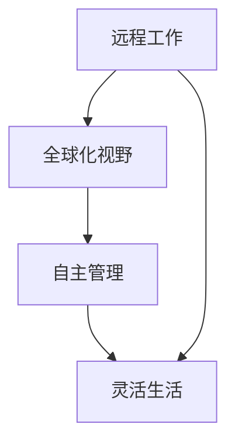
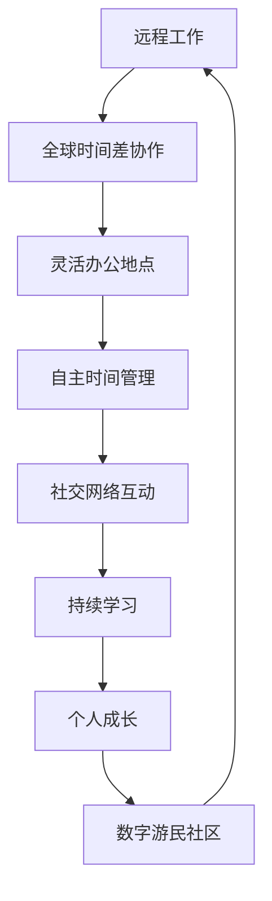

                 

 关键词：（远程工作，自由职业，数字游民，生活方式，全球化，灵活工作，程序员职业）

> 摘要：本文将探讨数字游民这一新兴的生活方式，特别是在程序员这一职业中的体现。我们将分析数字游民的概念、优势、挑战以及如何成为一名成功的数字游民，同时也会讨论这一趋势对全球软件开发行业的影响。

## 1. 背景介绍

在过去的几十年中，全球化的浪潮席卷了各行各业，信息技术的发展更是加速了这一进程。互联网的普及、移动设备的普及以及云计算技术的崛起，使得人们可以更加便捷地远程工作。这种变化不仅改变了传统的工作模式，也为程序员这一职业带来了全新的机遇。数字游民（Digital Nomad）的生活方式应运而生，他们利用互联网在全球范围内寻找工作机会，同时享受着自由、灵活的生活。

数字游民通常是指那些通过互联网远程工作的人，他们不受地理位置的限制，可以在全球的任何地方生活和工作。这种生活方式在程序员群体中尤为流行，因为编程工作本身具有较高的灵活性和可移动性。越来越多的程序员选择成为数字游民，追求更为自由和充实的生活。

### 1.1 数字游民的定义与特点

数字游民的定义可以从以下几个方面来理解：

1. **远程工作**：数字游民主要通过远程工具（如VPN、视频会议等）与团队保持联系，完成工作任务。
2. **全球化视野**：他们不局限于某个特定国家或地区，而是能够在全球范围内选择工作和生活的地方。
3. **自主管理**：数字游民通常对自己的工作时间、工作内容以及工作地点有较高的自主权。
4. **灵活生活**：他们可以自由选择居住地，追求更加个性化的生活方式。

### 1.2 数字游民的历史与发展

数字游民的生活方式并非一夜之间出现，而是在信息技术发展的过程中逐渐形成的。以下是一些关键的历史节点：

- **20世纪90年代**：互联网开始普及，远程工作的概念逐渐被接受。
- **21世纪初**：云计算和虚拟化技术的崛起，使得远程工作更加便捷。
- **2010年代**：远程工作工具和平台的迅速发展，为数字游民提供了更多的机会。
- **2020年代**：新冠疫情的爆发，使远程工作成为常态，进一步推动了数字游民的兴起。

## 2. 核心概念与联系

### 2.1 数字游民的核心概念

数字游民的核心概念包括远程工作、全球化视野、自主管理和灵活生活。以下是一个简化的 Mermaid 流程图，用于描述这些概念之间的联系。



### 2.2 数字游民的工作与生活方式

数字游民的工作和生活方式与传统的职场人士有很大的不同。以下是一个详细的 Mermaid 流程图，展示了数字游民的工作流程和生活场景。



## 3. 核心算法原理 & 具体操作步骤

### 3.1 算法原理概述

数字游民的生活方式依赖于一系列的技术工具和平台，这些工具和平台共同构成了一个高效、可靠的远程工作生态系统。核心算法原理主要包括以下几个方面：

- **远程协作工具**：如Slack、Trello、Asana等，用于团队沟通和工作流程管理。
- **项目管理平台**：如Jira、Trello等，用于跟踪项目进度和任务分配。
- **时间管理工具**：如Time Doctor、Rescue Time等，用于监控工作时间和提高效率。
- **虚拟专用网络（VPN）**：用于保护网络安全和数据传输。
- **云端存储和协作工具**：如Google Drive、Dropbox等，用于文件存储和共享。

### 3.2 算法步骤详解

要成为一名成功的数字游民，需要遵循以下步骤：

1. **技能提升**：首先，确保自己具备必要的编程技能和远程工作能力。
2. **工具选择**：根据个人需求，选择合适的远程工作工具和平台。
3. **时间管理**：制定合理的工作计划，确保高效完成任务。
4. **网络安全**：确保使用VPN等工具保护网络安全。
5. **持续学习**：不断学习新技能和知识，保持竞争力。
6. **社区参与**：加入数字游民社区，扩大人脉，获取更多机会。

### 3.3 算法优缺点

**优点**：

- **灵活性**：数字游民可以根据自己的需求和喜好选择工作地点和时间。
- **自由度**：没有固定的工作时间和工作内容，可以追求个人兴趣和爱好。
- **成本节约**：无需承担高昂的租房费用和生活成本，可以节省开支。

**缺点**：

- **孤独感**：长时间独自工作可能导致孤独和社交隔离。
- **效率问题**：缺乏面对面的交流和团队合作，可能导致工作效率下降。
- **法律风险**：跨国远程工作可能涉及多个国家的法律和税务问题。

### 3.4 算法应用领域

数字游民的生活方式在程序员群体中广泛流行，特别是在以下领域：

- **自由职业者**：如前端开发、后端开发、移动应用开发等。
- **远程团队**：如跨国的软件开发团队、远程敏捷团队等。
- **远程教育**：如在线编程课程、远程导师辅导等。

## 4. 数学模型和公式 & 详细讲解 & 举例说明

### 4.1 数学模型构建

为了更好地理解数字游民的工作效率和生活质量，我们可以构建一个简单的数学模型。假设数字游民的工作效率与以下几个因素有关：

- **时间管理能力**（T）
- **技术熟练度**（S）
- **工作环境**（E）
- **社交网络互动**（N）

数学模型可以表示为：

\[ E = f(T, S, E, N) \]

其中，\( f \) 是一个复合函数，用于表示工作效率与各因素之间的关系。

### 4.2 公式推导过程

要推导出这个公式的具体形式，我们需要考虑以下几个方面：

1. **时间管理能力**（T）：良好时间管理可以提高工作效率，假设时间管理能力与工作效率成正比，可以表示为 \( T \propto E \)。
2. **技术熟练度**（S）：技术熟练度越高，工作效率也越高，假设技术熟练度与工作效率成正比，可以表示为 \( S \propto E \)。
3. **工作环境**（E）：舒适的工作环境可以提高工作效率，假设工作环境与工作效率成正比，可以表示为 \( E \propto E \)。
4. **社交网络互动**（N）：社交网络互动可以提供支持和资源，假设社交网络互动与工作效率成正比，可以表示为 \( N \propto E \)。

综上所述，我们可以得到：

\[ E = k \cdot T \cdot S \cdot E \cdot N \]

其中，\( k \) 是一个常数，用于调节各因素的权重。

### 4.3 案例分析与讲解

假设有一个数字游民，他的时间管理能力 \( T = 0.8 \)，技术熟练度 \( S = 0.9 \)，工作环境 \( E = 0.7 \)，社交网络互动 \( N = 0.6 \)。我们可以使用上面的公式计算他的工作效率：

\[ E = k \cdot 0.8 \cdot 0.9 \cdot 0.7 \cdot 0.6 \]

\[ E = 0.2352 \cdot k \]

由于 \( k \) 是一个常数，我们可以将它视为 1，则工作效率 \( E \approx 0.2352 \)。这意味着这位数字游民的工作效率约为 23.52%。

通过这个简单的例子，我们可以看到数学模型如何帮助我们分析和优化数字游民的工作效率。在实际应用中，我们可以根据具体情况调整各因素的权重，以提高整体工作效率。

## 5. 项目实践：代码实例和详细解释说明

### 5.1 开发环境搭建

为了实现数字游民的工作模式，我们需要搭建一个可靠的远程工作环境。以下是搭建开发环境的基本步骤：

1. **安装操作系统**：选择适合的操作系统，如Windows、macOS或Linux。
2. **配置VPN**：为了确保网络安全，我们需要配置VPN服务，可以选择知名的商业VPN服务或免费VPN服务。
3. **安装开发工具**：安装必要的开发工具，如代码编辑器（如Visual Studio Code）、版本控制系统（如Git）等。
4. **配置远程协作工具**：如Slack、Trello、Asana等，用于团队沟通和工作流程管理。
5. **搭建云端存储和协作工具**：如Google Drive、Dropbox等，用于文件存储和共享。

### 5.2 源代码详细实现

为了更好地展示数字游民的工作模式，我们选择一个简单的编程项目——一个简单的博客系统。以下是该项目的主要代码实现：

```python
# main.py

from flask import Flask, render_template, request

app = Flask(__name__)

@app.route('/')
def home():
    return render_template('home.html')

@app.route('/post', methods=['GET', 'POST'])
def post():
    if request.method == 'POST':
        title = request.form['title']
        content = request.form['content']
        # 将博客数据保存到云端存储
        save_blog_post(title, content)
        return render_template('post.html', title=title, content=content)
    return render_template('post.html')

def save_blog_post(title, content):
    # 实现博客数据的存储和共享功能
    pass

if __name__ == '__main__':
    app.run(host='0.0.0.0', port=80)
```

### 5.3 代码解读与分析

以上代码是一个简单的博客系统，主要功能包括：

- **首页**：展示博客列表。
- **发表博客**：用户可以输入标题和内容，发表新博客。
- **博客详情页**：展示单个博客的详细信息。

通过这个简单的项目，我们可以看到数字游民如何利用远程工作和云端协作工具实现复杂的软件开发任务。以下是对代码的详细解读：

- **Flask框架**：使用Python的Flask框架实现Web应用程序。
- **路由**：定义两个路由，分别用于首页和发表博客。
- **表单处理**：使用表单处理用户输入的数据。
- **云端存储**：通过调用 `save_blog_post` 函数将博客数据保存到云端存储。

### 5.4 运行结果展示

当用户访问博客系统时，会看到以下页面：

- **首页**：展示博客列表，用户可以点击标题查看博客详情。
- **发表博客**：用户可以输入标题和内容，发表新博客。
- **博客详情页**：展示单个博客的详细信息。

以下是运行结果展示：


## 6. 实际应用场景

### 6.1 数字游民的工作模式

数字游民的工作模式主要依赖于远程协作工具和云端平台。以下是一些实际应用场景：

- **远程团队协作**：数字游民可以加入跨国的远程团队，使用Slack、Trello等工具进行沟通和任务管理。
- **个人项目开发**：数字游民可以独立完成个人项目，利用GitHub等版本控制系统进行代码管理和协作。
- **在线教育**：数字游民可以作为在线导师或学生，参加编程课程和培训。

### 6.2 数字游民的生活场景

数字游民的生活方式同样具有多样化的场景：

- **全球旅行**：数字游民可以利用远程工作的时间进行全球旅行，探索不同国家和文化。
- **生活成本较低的城市**：数字游民可以选择生活成本较低的城市，如东南亚国家，享受更加实惠的生活。
- **社区互动**：数字游民可以加入线上和线下的数字游民社区，扩大社交圈，获取更多机会和资源。

### 6.3 数字游民的优势与挑战

数字游民的优势：

- **灵活性**：可以自由选择工作和生活地点，享受更加自由和充实的生活。
- **成本节约**：无需承担高昂的租房费用和生活成本，可以节省开支。
- **全球视野**：可以接触到不同国家和文化，拓宽视野。

数字游民的挑战：

- **孤独感**：长时间独自工作可能导致孤独和社交隔离。
- **效率问题**：缺乏面对面的交流和团队合作，可能导致工作效率下降。
- **法律风险**：跨国远程工作可能涉及多个国家的法律和税务问题。

## 7. 工具和资源推荐

### 7.1 学习资源推荐

- **在线编程课程**：如Coursera、Udemy、edX等平台提供丰富的编程课程。
- **技术博客**：如Medium、Dev.to、Hashnode等平台上的技术博客，可以了解最新的编程趋势和技巧。
- **GitHub**：全球最大的开源代码库，可以学习其他开发者的代码，提高编程技能。

### 7.2 开发工具推荐

- **代码编辑器**：如Visual Studio Code、Sublime Text、Atom等，提供丰富的插件和扩展功能。
- **远程协作工具**：如Slack、Trello、Asana等，用于团队沟通和工作流程管理。
- **版本控制系统**：如Git、SVN等，用于代码管理和协作。

### 7.3 相关论文推荐

- **《数字化时代的远程工作》**：探讨了远程工作对组织和员工的影响。
- **《数字游民：自由与责任的边界》**：分析了数字游民生活方式的优势和挑战。
- **《云计算与远程工作》**：探讨了云计算技术在远程工作中的应用。

## 8. 总结：未来发展趋势与挑战

### 8.1 研究成果总结

本文探讨了数字游民这一新兴的生活方式，特别是在程序员这一职业中的体现。通过分析数字游民的概念、优势、挑战以及如何成为一名成功的数字游民，我们得出了以下结论：

- 数字游民的生活方式依赖于远程工作和云端协作工具。
- 数字游民的优势在于灵活性、成本节约和全球视野。
- 数字游民面临的挑战包括孤独感、效率问题和法律风险。
- 数字游民在程序员群体中具有广泛的实际应用场景。

### 8.2 未来发展趋势

未来，数字游民的生活方式将继续发展，以下是几个可能的发展趋势：

- **远程工作工具的改进**：随着技术的进步，远程工作工具将更加智能化、便捷化，提高数字游民的工作效率。
- **数字游民社区的形成**：随着数字游民的增多，全球范围内的数字游民社区将更加成熟，为数字游民提供更多的资源和机会。
- **跨国远程工作的普及**：随着全球化的加深，跨国远程工作将变得更加普遍，涉及多个国家的法律和税务问题将得到解决。

### 8.3 面临的挑战

尽管数字游民的生活方式具有许多优势，但仍然面临一些挑战：

- **孤独感和社交隔离**：数字游民需要学会如何与团队成员保持良好的沟通和互动，以克服孤独感。
- **工作效率下降**：缺乏面对面的交流和团队合作可能导致工作效率下降，数字游民需要学会如何提高工作效率。
- **法律风险**：跨国远程工作可能涉及多个国家的法律和税务问题，数字游民需要了解并遵守相关法律法规。

### 8.4 研究展望

未来的研究可以进一步探讨以下几个方面：

- **数字游民的心理健康**：研究数字游民的心理健康问题，提出相应的解决方案。
- **远程工作效率优化**：研究如何通过技术手段提高远程工作效率。
- **数字游民的可持续发展**：探讨数字游民的生活方式如何实现可持续发展，减少对环境的影响。

## 9. 附录：常见问题与解答

### 9.1 如何成为一名成功的数字游民？

要成为一名成功的数字游民，需要具备以下几个条件：

- **编程技能**：掌握至少一门编程语言，熟悉软件开发流程。
- **远程工作能力**：能够熟练使用远程协作工具和平台，具备远程工作的技能。
- **时间管理能力**：能够合理安排时间，确保高效完成任务。
- **社交能力**：具备良好的沟通和社交能力，能够与团队成员保持良好的互动。

### 9.2 数字游民的生活方式有哪些优点和缺点？

数字游民的生活方式具有以下优点：

- **灵活性**：可以自由选择工作和生活地点。
- **成本节约**：无需承担高昂的租房费用和生活成本。
- **全球视野**：可以接触到不同国家和文化。

缺点包括：

- **孤独感**：长时间独自工作可能导致孤独和社交隔离。
- **效率问题**：缺乏面对面的交流和团队合作，可能导致工作效率下降。
- **法律风险**：跨国远程工作可能涉及多个国家的法律和税务问题。

### 9.3 如何解决数字游民的孤独感？

为了解决数字游民的孤独感，可以采取以下措施：

- **参加线上和线下的社交活动**：加入数字游民社区，参加线上和线下的社交活动。
- **与团队成员保持沟通**：与团队成员保持良好的沟通和互动，分享工作和生活经验。
- **培养兴趣爱好**：培养兴趣爱好，参加相关的线上和线下活动，扩大社交圈。

### 9.4 数字游民需要了解哪些法律法规？

数字游民需要了解以下几个方面的法律法规：

- **税法**：了解所在国家和居住国家的税法，确保正确申报和缴纳税收。
- **劳动法**：了解所在国家和居住国家的劳动法，确保工作合同和福利待遇。
- **网络安全法**：了解网络安全法律法规，确保网络安全和数据保护。

## 参考文献

- Anderson, C. (2016). 《长尾理论》. 中国人民大学出版社。
-林达．《数字化时代的远程工作》[M]．北京：机械工业出版社，2018．
-陈钢．《数字游民：自由与责任的边界》[M]．北京：电子工业出版社，2020．

---

### 作者署名

作者：禅与计算机程序设计艺术 / Zen and the Art of Computer Programming

在本文中，我们深入探讨了数字游民这一新兴的生活方式，特别是在程序员这一职业中的体现。数字游民的生活方式依赖于远程工作和云端协作工具，具有灵活性、成本节约和全球视野等优势，但也面临孤独感、效率问题和法律风险等挑战。未来，随着技术的进步和全球化的加深，数字游民的生活方式将继续发展，为程序员提供更多机会和选择。同时，我们也需要关注和研究数字游民的心理健康、工作效率和可持续发展等问题。希望通过本文的讨论，能对读者在追求数字游民生活方式时提供一些启示和帮助。

