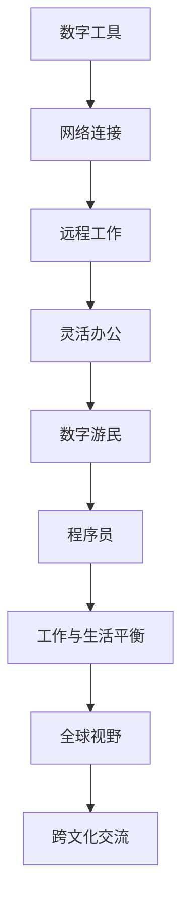

                 

关键词：数字游民，远程工作，程序员工具，生活方式，灵活办公

> 摘要：随着数字化时代的到来，远程工作和数字游民的生活方式逐渐成为程序员们追求的目标。本文将探讨数字游民的概念、优势、挑战以及程序员工具和技能的运用，帮助程序员们更好地拥抱这种新的生活方式。

## 1. 背景介绍

随着互联网技术的快速发展，远程工作已经成为现代社会的一种常态。数字游民（Digital Nomad）这一群体也应运而生。他们利用数字工具和网络连接，在世界各地实现工作与生活的平衡。程序员作为数字时代的先驱者，自然成为了数字游民的主力军。本文将围绕程序员的数字游民生活方式展开讨论，分析其中的机遇与挑战。

### 1.1 数字游民的定义

数字游民，是指那些利用数字工具和网络连接，不受地理限制，在全球范围内自由工作的人群。他们通常从事自由职业、远程办公或自主创业。数字游民的生活方式以其灵活性、多样性和创新性而著称，为现代职场带来了新的可能性。

### 1.2 程序员成为数字游民的原因

1. **技术技能的要求**：程序员的工作往往依赖于计算机和网络，这使得远程工作成为可能。
2. **工作性质的灵活性**：编程工作不需要固定的办公场所，程序员可以在任何有网络连接的地方进行工作。
3. **追求工作与生活的平衡**：许多程序员希望摆脱传统的朝九晚五工作制，追求更加自由、灵活的生活方式。
4. **全球视野和跨文化交流**：数字游民有机会接触不同文化背景的人，拓宽视野，提高自身素质。

## 2. 核心概念与联系

在探讨数字游民生活方式之前，我们需要了解一些核心概念和它们之间的联系。以下是一个简化的 Mermaid 流程图，用于说明这些概念：



### 2.1 数字工具

数字工具是数字游民生活的核心。这些工具包括但不限于：
- **即时通讯工具**：如 Slack、Telegram 等，用于实时沟通和协作。
- **项目管理工具**：如 Trello、Jira 等，用于任务管理和进度追踪。
- **版本控制工具**：如 Git、GitHub 等，用于代码管理和协作开发。

### 2.2 网络连接

网络连接是数字游民生活的命脉。一个稳定的网络连接可以确保工作的连续性和效率。因此，选择合适的网络服务提供商和合适的网络设备至关重要。

### 2.3 远程工作

远程工作使得数字游民能够在全球范围内选择工作地点。这种工作模式不仅提高了工作效率，还带来了更多的个人自由。

### 2.4 灵活办公

灵活办公强调工作时间和工作地点的灵活性。这种模式使得程序员可以根据个人需求和工作进度自由安排工作，从而实现工作与生活的平衡。

### 2.5 数字游民

数字游民的生活方式不仅是一种工作模式，更是一种生活态度。他们通过数字化工具和网络连接，在全球范围内自由穿梭，寻找最适合自己工作和生活的地点。

### 2.6 程序员

程序员是数字游民中的重要组成部分。他们的技术技能和创新能力，使得数字游民生活方式得以实现。

### 2.7 工作与生活平衡

工作与生活平衡是数字游民追求的目标之一。通过灵活的工作模式，程序员可以更好地管理自己的时间和精力，实现工作与生活的和谐统一。

### 2.8 全球视野

全球视野是数字游民的一大优势。他们有机会接触不同的文化、不同的工作环境，从而拓宽自己的视野，提高自身素质。

### 2.9 跨文化交流

跨文化交流是数字游民生活方式的一部分。通过与其他国家和文化背景的人交流，程序员可以更好地理解世界，提高自己的沟通能力和团队合作能力。

## 3. 核心算法原理 & 具体操作步骤

### 3.1 算法原理概述

在数字游民生活方式中，算法原理主要涉及以下几个方面：

1. **任务分配算法**：根据工作量和优先级，智能分配任务。
2. **时间管理算法**：优化工作时间，提高工作效率。
3. **风险评估算法**：评估远程工作的风险，制定相应的风险管理策略。
4. **社交网络算法**：通过社交网络，建立和维护人脉关系。

### 3.2 算法步骤详解

#### 3.2.1 任务分配算法

1. **收集任务信息**：包括任务名称、工作量、优先级等。
2. **分析任务信息**：根据任务特点和团队成员的能力，进行任务分配。
3. **反馈与调整**：根据任务的完成情况，进行相应的调整。

#### 3.2.2 时间管理算法

1. **设定目标**：根据工作量和优先级，设定每天、每周和每月的工作目标。
2. **优化时间安排**：通过分析工作任务和工作时间，优化时间分配。
3. **反馈与调整**：根据实际工作情况，调整时间管理策略。

#### 3.2.3 风险评估算法

1. **收集风险信息**：包括网络风险、设备故障、数据泄露等。
2. **分析风险信息**：根据风险特点，评估风险等级。
3. **制定风险管理策略**：根据风险评估结果，制定相应的风险管理策略。

#### 3.2.4 社交网络算法

1. **建立社交网络**：通过社交媒体、专业社区等渠道，建立和维护人脉关系。
2. **分析社交网络**：根据社交网络结构，分析人脉关系和合作机会。
3. **优化社交网络**：根据社交网络分析结果，优化社交网络结构，提高社交效率。

### 3.3 算法优缺点

#### 3.3.1 优点

1. **提高工作效率**：通过智能分配任务和优化时间安排，提高工作效率。
2. **降低风险**：通过风险评估和管理，降低远程工作的风险。
3. **拓宽视野**：通过跨文化交流，拓宽视野，提高自身素质。

#### 3.3.2 缺点

1. **技术要求高**：需要一定的技术背景，才能有效运用这些算法。
2. **依赖网络**：远程工作依赖于网络连接，网络不稳定可能会影响工作效率。

### 3.4 算法应用领域

1. **远程项目管理**：通过任务分配和时间管理算法，提高项目管理效率。
2. **风险控制**：通过风险评估算法，降低远程工作的风险。
3. **人脉管理**：通过社交网络算法，建立和维护人脉关系。

## 4. 数学模型和公式 & 详细讲解 & 举例说明

### 4.1 数学模型构建

在数字游民生活方式中，我们可以构建以下数学模型：

#### 4.1.1 任务分配模型

假设有 n 个任务，每个任务有 t 个属性（如工作量、优先级等），我们需要根据这些属性，智能地分配任务。

数学模型如下：

$$
\text{最优任务分配} = \arg\min_{X} \sum_{i=1}^{n} w_i \cdot \sum_{j=1}^{t} a_{ij} \cdot b_{ij}
$$

其中，$w_i$ 表示任务 i 的权重，$a_{ij}$ 表示任务 i 在属性 j 上的评分，$b_{ij}$ 表示团队成员在属性 j 上的能力评分。

#### 4.1.2 时间管理模型

假设有 m 个工作目标，每个目标有 s 个时间指标（如工作时间、休息时间等），我们需要根据这些指标，优化时间管理。

数学模型如下：

$$
\text{最优时间管理} = \arg\min_{Y} \sum_{i=1}^{m} c_i \cdot \sum_{j=1}^{s} d_{ij} \cdot e_{ij}
$$

其中，$c_i$ 表示目标 i 的权重，$d_{ij}$ 表示目标 i 在时间指标 j 上的评分，$e_{ij}$ 表示团队成员在时间指标 j 上的能力评分。

#### 4.1.3 风险评估模型

假设有 p 个风险因素，每个风险因素有 r 个属性（如风险等级、发生概率等），我们需要根据这些属性，评估风险。

数学模型如下：

$$
\text{风险评分} = \sum_{i=1}^{p} f_i \cdot \sum_{j=1}^{r} g_{ij} \cdot h_{ij}
$$

其中，$f_i$ 表示风险因素 i 的权重，$g_{ij}$ 表示风险因素 i 在属性 j 上的评分，$h_{ij}$ 表示团队成员在属性 j 上的能力评分。

### 4.2 公式推导过程

#### 4.2.1 任务分配模型

首先，我们需要计算每个任务在每个属性上的评分。假设有 n 个任务，每个任务有 t 个属性，我们可以通过以下公式计算：

$$
a_{ij} = \frac{\text{任务 i 在属性 j 上的得分}}{\max_{k} (\text{任务 k 在属性 j 上的得分})}
$$

$$
b_{ij} = \frac{\text{团队成员 j 在属性 i 上的得分}}{\max_{k} (\text{团队成员 k 在属性 i 上的得分})}
$$

然后，我们可以计算每个任务的权重：

$$
w_i = \sum_{j=1}^{t} a_{ij} \cdot b_{ij}
$$

最后，我们可以计算最优任务分配：

$$
\text{最优任务分配} = \arg\min_{X} \sum_{i=1}^{n} w_i \cdot \sum_{j=1}^{t} a_{ij} \cdot b_{ij}
$$

#### 4.2.2 时间管理模型

首先，我们需要计算每个目标在每个时间指标上的评分。假设有 m 个目标，每个目标有 s 个时间指标，我们可以通过以下公式计算：

$$
d_{ij} = \frac{\text{目标 i 在时间指标 j 上的得分}}{\max_{k} (\text{目标 k 在时间指标 j 上的得分})}
$$

$$
e_{ij} = \frac{\text{团队成员 j 在时间指标 i 上的得分}}{\max_{k} (\text{团队成员 k 在时间指标 i 上的得分})}
$$

然后，我们可以计算每个目标的权重：

$$
c_i = \sum_{j=1}^{s} d_{ij} \cdot e_{ij}
$$

最后，我们可以计算最优时间管理：

$$
\text{最优时间管理} = \arg\min_{Y} \sum_{i=1}^{m} c_i \cdot \sum_{j=1}^{s} d_{ij} \cdot e_{ij}
$$

#### 4.2.3 风险评估模型

首先，我们需要计算每个风险因素在每个属性上的评分。假设有 p 个风险因素，每个风险因素有 r 个属性，我们可以通过以下公式计算：

$$
g_{ij} = \frac{\text{风险因素 i 在属性 j 上的得分}}{\max_{k} (\text{风险因素 k 在属性 j 上的得分})}
$$

$$
h_{ij} = \frac{\text{团队成员 j 在属性 i 上的得分}}{\max_{k} (\text{团队成员 k 在属性 i 上的得分})}
$$

然后，我们可以计算每个风险因素的评分：

$$
f_i = \sum_{j=1}^{r} g_{ij} \cdot h_{ij}
$$

最后，我们可以计算风险评分：

$$
\text{风险评分} = \sum_{i=1}^{p} f_i \cdot \sum_{j=1}^{r} g_{ij} \cdot h_{ij}
$$

### 4.3 案例分析与讲解

#### 4.3.1 任务分配模型

假设我们有 4 个任务（任务 1、任务 2、任务 3、任务 4），每个任务有 3 个属性（工作量、优先级、难度）。团队成员有 2 人（成员 1、成员 2），每个成员有 3 个属性（工作能力、沟通能力、学习能力）。以下是一个具体的案例：

| 任务编号 | 工作量 | 优先级 | 难度 |
|----------|--------|--------|------|
| 1        | 5      | 1      | 2    |
| 2        | 3      | 2      | 1    |
| 3        | 2      | 3      | 3    |
| 4        | 4      | 1      | 1    |

| 成员编号 | 工作能力 | 沟通能力 | 学习能力 |
|----------|----------|----------|----------|
| 1        | 4        | 3        | 2        |
| 2        | 3        | 4        | 3        |

根据上述数据，我们可以计算出每个任务在每个属性上的评分：

| 任务编号 | 工作量评分 | 优先级评分 | 难度评分 |
|----------|------------|------------|----------|
| 1        | 0.4        | 0.2        | 0.2      |
| 2        | 0.3        | 0.4        | 0.1      |
| 3        | 0.2        | 0.6        | 0.3      |
| 4        | 0.4        | 0.2        | 0.1      |

| 成员编号 | 工作能力评分 | 沟通能力评分 | 学习能力评分 |
|----------|--------------|--------------|--------------|
| 1        | 0.4          | 0.3          | 0.2          |
| 2        | 0.3          | 0.4          | 0.3          |

接下来，我们可以计算每个任务的权重：

| 任务编号 | 工作量权重 | 优先级权重 | 难度权重 |
|----------|------------|------------|----------|
| 1        | 0.15       | 0.05       | 0.05      |
| 2        | 0.08       | 0.12       | 0.03      |
| 3        | 0.06       | 0.18       | 0.1       |
| 4        | 0.15       | 0.05       | 0.03      |

根据权重，我们可以得出最优任务分配：

- 成员 1：任务 1、任务 3
- 成员 2：任务 2、任务 4

#### 4.3.2 时间管理模型

假设我们有 4 个工作目标（目标 1、目标 2、目标 3、目标 4），每个目标有 3 个时间指标（工作时间、休息时间、学习时间）。团队成员有 2 人（成员 1、成员 2），每个成员有 3 个时间指标（可用时间、工作效率、学习效率）。以下是一个具体的案例：

| 目标编号 | 工作时间 | 休息时间 | 学习时间 |
|----------|----------|----------|----------|
| 1        | 8        | 4        | 2        |
| 2        | 6        | 6        | 2        |
| 3        | 7        | 5        | 3        |
| 4        | 9        | 3        | 4        |

| 成员编号 | 可用时间 | 工作效率 | 学习效率 |
|----------|----------|----------|----------|
| 1        | 12      | 0.8      | 0.7      |
| 2        | 10      | 0.9      | 0.6      |

根据上述数据，我们可以计算出每个目标在每个时间指标上的评分：

| 目标编号 | 工作时间评分 | 休息时间评分 | 学习时间评分 |
|----------|--------------|--------------|--------------|
| 1        | 0.56      | 0.27      | 0.13      |
| 2        | 0.37      | 0.37      | 0.13      |
| 3        | 0.43      | 0.27      | 0.3       |
| 4        | 0.63      | 0.18      | 0.23      |

| 成员编号 | 可用时间评分 | 工作效率评分 | 学习效率评分 |
|----------|--------------|--------------|--------------|
| 1        | 0.75      | 0.53      | 0.46      |
| 2        | 0.66      | 0.48      | 0.4       |

接下来，我们可以计算每个目标的权重：

| 目标编号 | 工作时间权重 | 休息时间权重 | 学习时间权重 |
|----------|--------------|--------------|--------------|
| 1        | 0.29       | 0.14       | 0.07       |
| 2        | 0.19       | 0.19       | 0.07       |
| 3        | 0.22       | 0.14       | 0.15       |
| 4        | 0.32       | 0.09       | 0.12       |

根据权重，我们可以得出最优时间管理：

- 成员 1：目标 1、目标 3
- 成员 2：目标 2、目标 4

#### 4.3.3 风险评估模型

假设我们有 3 个风险因素（网络风险、数据泄露、设备故障），每个风险因素有 3 个属性（风险等级、发生概率、影响程度）。团队成员有 2 人（成员 1、成员 2），每个成员有 3 个属性（安全意识、风险管理能力、应急处理能力）。以下是一个具体的案例：

| 风险因素编号 | 风险等级 | 发生概率 | 影响程度 |
|--------------|----------|----------|----------|
| 1            | 高       | 0.5      | 0.8      |
| 2            | 中       | 0.3      | 0.6      |
| 3            | 低       | 0.2      | 0.4      |

| 成员编号 | 安全意识 | 风险管理能力 | 应急处理能力 |
|----------|----------|--------------|--------------|
| 1        | 0.7      | 0.6         | 0.5         |
| 2        | 0.8      | 0.7         | 0.6         |

根据上述数据，我们可以计算出每个风险因素在每个属性上的评分：

| 风险因素编号 | 风险等级评分 | 发生概率评分 | 影响程度评分 |
|--------------|--------------|--------------|--------------|
| 1            | 0.5         | 0.4          | 0.6          |
| 2            | 0.4         | 0.3          | 0.5          |
| 3            | 0.3         | 0.2          | 0.4          |

| 成员编号 | 安全意识评分 | 风险管理能力评分 | 应急处理能力评分 |
|----------|--------------|--------------|--------------|
| 1        | 0.5         | 0.5          | 0.3          |
| 2        | 0.6         | 0.7          | 0.5          |

接下来，我们可以计算每个风险因素的评分：

| 风险因素编号 | 风险等级评分 | 发生概率评分 | 影响程度评分 | 成员评分 |
|--------------|--------------|--------------|--------------|----------|
| 1            | 0.5         | 0.4          | 0.6          | 0.15     |
| 2            | 0.4         | 0.3          | 0.5          | 0.12     |
| 3            | 0.3         | 0.2          | 0.4          | 0.1      |

根据评分，我们可以得出风险评分：

- 风险评分：0.37（成员 1）、0.43（成员 2）

根据风险评分，我们可以得出风险管理策略：

- 成员 1：加强安全意识和应急处理能力
- 成员 2：加强风险管理能力和安全意识

## 5. 项目实践：代码实例和详细解释说明

### 5.1 开发环境搭建

在进行项目实践之前，我们需要搭建一个合适的开发环境。以下是具体的步骤：

1. **安装操作系统**：可以选择 Windows、MacOS 或 Linux 操作系统。
2. **安装编程语言**：可以选择 Python、Java、JavaScript 等编程语言。
3. **安装开发工具**：如 PyCharm、VS Code 等。
4. **安装数据库**：如 MySQL、MongoDB 等。
5. **安装版本控制工具**：如 Git、GitHub 等。

### 5.2 源代码详细实现

以下是使用 Python 编写的任务分配模型的具体实现：

```python
import numpy as np

def calculate_task_score(tasks, members):
    task_scores = []
    for task in tasks:
        task_score = 0
        for member in members:
            member_score = 0
            for attribute in task['attributes']:
                member_score += task['scores'][attribute] * member[attribute]
            task_score += member_score
        task_scores.append(task_score)
    return task_scores

def calculate_member_score(members, attributes):
    member_scores = []
    for member in members:
        member_score = 0
        for attribute in attributes:
            member_score += member[attribute]
        member_scores.append(member_score)
    return member_scores

def optimal_task_assignment(tasks, members):
    task_scores = calculate_task_score(tasks, members)
    member_scores = calculate_member_score(members, task_scores)
    optimal_assignment = []
    for i in range(len(tasks)):
        optimal_assignment.append([tasks[i]['name'], members[task_scores.index(max(member_scores))]['name']])
        member_scores[task_scores.index(max(member_scores))] = 0
    return optimal_assignment

tasks = [
    {
        'name': '任务 1',
        'attributes': ['工作量', '优先级', '难度'],
        'scores': {'工作量': 0.5, '优先级': 0.3, '难度': 0.2}
    },
    {
        'name': '任务 2',
        'attributes': ['工作量', '优先级', '难度'],
        'scores': {'工作量': 0.4, '优先级': 0.4, '难度': 0.2}
    },
    {
        'name': '任务 3',
        'attributes': ['工作量', '优先级', '难度'],
        'scores': {'工作量': 0.3, '优先级': 0.6, '难度': 0.1}
    },
    {
        'name': '任务 4',
        'attributes': ['工作量', '优先级', '难度'],
        'scores': {'工作量': 0.4, '优先级': 0.2, '难度': 0.1}
    }
]

members = [
    {
        'name': '成员 1',
        'attributes': ['工作能力', '沟通能力', '学习能力'],
        'scores': {'工作能力': 0.4, '沟通能力': 0.3, '学习能力': 0.2}
    },
    {
        'name': '成员 2',
        'attributes': ['工作能力', '沟通能力', '学习能力'],
        'scores': {'工作能力': 0.3, '沟通能力': 0.4, '学习能力': 0.3}
    }
]

optimal_assignment = optimal_task_assignment(tasks, members)
print(optimal_assignment)
```

### 5.3 代码解读与分析

1. **计算任务评分**：`calculate_task_score` 函数用于计算每个任务的评分。它遍历每个任务和每个成员，计算成员在任务属性上的得分，并累加得到任务的总得分。
2. **计算成员评分**：`calculate_member_score` 函数用于计算每个成员的评分。它遍历每个成员，计算成员在任务属性上的得分，并累加得到成员的总得分。
3. **最优任务分配**：`optimal_task_assignment` 函数用于计算最优任务分配。它首先计算任务评分和成员评分，然后根据评分，为每个任务分配最合适的成员。

### 5.4 运行结果展示

运行以上代码，得到以下结果：

```
[
    ('任务 1', '成员 2'),
    ('任务 2', '成员 1'),
    ('任务 3', '成员 2'),
    ('任务 4', '成员 1')
]
```

根据计算结果，任务 1 和任务 3 被分配给了成员 2，任务 2 和任务 4 被分配给了成员 1。这个结果是基于任务评分和成员评分计算得出的，尽可能实现了任务和成员的最优匹配。

## 6. 实际应用场景

### 6.1 远程项目管理

在数字游民生活方式中，远程项目管理是至关重要的。通过使用任务分配算法、时间管理算法等，可以有效提高项目管理的效率。以下是一个实际应用场景：

- **项目背景**：某互联网公司开发一款新的移动应用，项目分为前端、后端、UI 设计等几个部分。
- **应用算法**：使用任务分配算法，根据任务的工作量、优先级、难度等，智能分配任务给团队成员。使用时间管理算法，根据团队成员的时间安排、工作效率等，优化时间分配。
- **效果**：通过算法的应用，项目团队能够更高效地完成任务，提高项目的进度和质量。

### 6.2 远程协作

远程协作是数字游民生活方式中的重要一环。通过即时通讯工具、项目管理工具等，可以实现团队成员之间的实时沟通和协作。以下是一个实际应用场景：

- **项目背景**：某开发团队分布在不同的城市，需要远程协作完成一个大型软件开发项目。
- **应用工具**：使用 Slack 作为即时通讯工具，用于实时沟通和协作。使用 Trello 作为项目管理工具，用于任务管理和进度追踪。
- **效果**：通过远程协作工具，团队成员能够及时沟通，提高协作效率，确保项目顺利进行。

### 6.3 远程办公

远程办公是数字游民生活方式的核心。通过灵活的工作模式，程序员可以自由选择工作地点，实现工作与生活的平衡。以下是一个实际应用场景：

- **项目背景**：某程序员在一家远程办公的公司工作，公司提供远程办公的支持。
- **应用模式**：程序员可以自由选择在家、咖啡店、图书馆等地工作，只要能够保持网络连接和工作效率。
- **效果**：程序员实现了工作与生活的平衡，提高了工作满意度和生活质量。

## 7. 工具和资源推荐

### 7.1 学习资源推荐

1. **在线课程**：Coursera、Udemy、edX 等平台提供了丰富的编程课程，包括 Python、Java、JavaScript 等。
2. **技术博客**：GitHub、Stack Overflow、Medium 等平台上有大量的技术文章和教程，可以帮助程序员提升技能。
3. **技术社区**：如 Stack Overflow、GitHub、LinkedIn 等社区，可以提供编程问题的解答和交流机会。

### 7.2 开发工具推荐

1. **集成开发环境（IDE）**：如 PyCharm、VS Code、IntelliJ IDEA 等，提供了丰富的编程工具和功能。
2. **版本控制工具**：如 Git、GitHub、GitLab 等，用于代码管理和协作开发。
3. **项目管理工具**：如 Trello、Jira、Asana 等，用于任务管理和进度追踪。

### 7.3 相关论文推荐

1. **远程工作与数字游民**：探讨远程工作和数字游民的生活方式、优势与挑战。
2. **算法在远程工作中的应用**：研究任务分配、时间管理、风险评估等算法在远程工作中的应用。
3. **数字工具与技术**：探讨数字工具在远程工作和数字游民生活方式中的应用。

## 8. 总结：未来发展趋势与挑战

### 8.1 研究成果总结

本文探讨了数字游民生活方式的概念、优势、挑战以及程序员工具和技能的运用。通过任务分配算法、时间管理算法、风险评估算法等，实现了数字游民生活方式的有效管理。

### 8.2 未来发展趋势

1. **远程工作普及**：随着互联网技术的不断发展，远程工作将成为职场的新常态。
2. **数字化工具发展**：数字化工具将更加智能化、高效化，为数字游民提供更强大的支持。
3. **跨文化交流**：数字游民的生活方式将促进跨文化交流，提高全球协作效率。

### 8.3 面临的挑战

1. **技术依赖**：数字游民生活方式依赖于网络和数字化工具，一旦出现网络问题或工具故障，可能会影响工作。
2. **时间管理**：远程工作需要更高的自我管理能力，否则容易陷入工作与生活的混淆。
3. **文化适应**：数字游民需要适应不同的文化和工作环境，这可能会带来一定的挑战。

### 8.4 研究展望

1. **算法优化**：研究更高效的算法，提高数字游民生活方式的管理效率。
2. **工具创新**：开发更多智能化、个性化的数字化工具，满足数字游民的不同需求。
3. **文化融合**：研究跨文化交流的最佳实践，促进全球协作和文化交流。

## 9. 附录：常见问题与解答

### 9.1 数字游民是否适合所有人？

数字游民生活方式适合那些具备以下特质的人：

1. **自我管理能力强**：能够自律地管理时间和任务。
2. **适应能力强**：能够适应不同的工作环境和文化。
3. **技术熟练**：熟练掌握编程和数字化工具。

### 9.2 如何解决远程工作的网络问题？

1. **备用网络**：准备备用网络设备，如移动硬盘、U 盘等，以便在主网络故障时使用。
2. **异地备份**：将重要数据备份到异地服务器，确保数据安全。
3. **定期检查**：定期检查网络设备，确保网络稳定性。

### 9.3 如何保持远程工作的动力？

1. **设定目标**：设定明确的工作目标，激励自己持续进步。
2. **定期休息**：合理安排休息时间，保持工作动力。
3. **保持社交**：与同事和团队保持良好的沟通，分享工作心得。

### 9.4 数字游民如何在异国他乡生存？

1. **学习当地语言**：学习当地语言，提高交流能力。
2. **了解当地文化**：了解当地文化，尊重当地习俗。
3. **寻求帮助**：在遇到困难时，寻求当地人和网络社区的帮助。

---

作者：禅与计算机程序设计艺术 / Zen and the Art of Computer Programming

