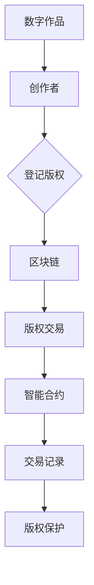

                 

关键词：数字版权、区块链、知识产权、应用、技术

## 摘要

本文将探讨数字版权创业中区块链技术的重要应用。随着数字内容的快速传播和分享，知识产权保护成为了一个日益严峻的挑战。区块链作为一种分布式账本技术，具有不可篡改、透明和去中心化的特点，使其成为保护知识产权的理想工具。本文将详细分析区块链在数字版权创业中的应用场景、核心概念、算法原理、数学模型，并通过项目实践和实际案例，展示其巨大潜力和未来发展趋势。

## 1. 背景介绍

### 数字版权的挑战

数字版权问题主要源于数字内容的易复制性和广泛传播性。传统的版权保护机制，如DRM（数字版权管理）技术和法律手段，虽然在一定程度上能提供保护，但往往成本高昂且效率低下。随着互联网的普及，数字内容创作者面临着日益严峻的版权盗用和侵权行为，这不仅损害了创作者的权益，也扰乱了数字市场的秩序。

### 区块链技术的兴起

区块链技术作为一种分布式账本技术，其核心特点在于去中心化、不可篡改和透明性。区块链通过加密算法和共识机制，确保了数据的安全性和完整性。近年来，区块链技术在全球范围内迅速发展，其在金融、供应链管理、智能合约等多个领域的应用已经取得了显著的成果。在数字版权领域，区块链技术同样展现出了巨大的潜力。

## 2. 核心概念与联系

### 区块链基础概念

区块链是一种由多个区块组成的链式数据结构，每个区块包含一定数量的交易记录。区块通过加密算法与前一区块连接，形成一个不可篡改的分布式账本。区块链的主要特点是：

- **去中心化**：没有中央控制机构，所有节点均可参与区块链的维护和验证。
- **不可篡改**：一旦数据记录在区块链上，便无法被修改或删除。
- **透明性**：区块链上的数据对所有节点都是公开透明的。
- **安全性**：通过加密算法和共识机制确保数据的安全。

### 数字版权与区块链的联系

数字版权与区块链技术的结合主要体现在以下几个方面：

- **版权登记**：创作者可以将作品登记在区块链上，确保版权归属的唯一性和不可篡改性。
- **交易追踪**：区块链可以记录数字作品的每一次交易，确保交易的透明和可追溯。
- **智能合约**：通过智能合约，可以自动执行版权许可和授权，降低交易成本和纠纷风险。

### Mermaid 流程图

下面是一个简单的 Mermaid 流程图，展示数字版权与区块链技术的基本架构：



## 3. 核心算法原理 & 具体操作步骤

### 3.1 算法原理概述

区块链技术的基础算法主要包括加密算法、共识机制和分布式存储。以下是这些算法的基本原理：

- **加密算法**：用于保护区块链上的数据安全，常见的有SHA-256、椭圆曲线加密等。
- **共识机制**：确保区块链上的数据一致性，常见的有工作量证明（PoW）、权益证明（PoS）等。
- **分布式存储**：将数据分散存储在多个节点上，提高数据的安全性和可靠性。

### 3.2 算法步骤详解

1. **版权登记**：创作者将作品信息（如名称、作者、版权期限等）上传到区块链网络，进行版权登记。
2. **数据验证**：区块链网络中的多个节点对上传的数据进行验证，确保其真实性。
3. **共识达成**：通过共识机制，确认数据的合法性，并将其记录在区块链上。
4. **版权交易**：购买者通过区块链网络与创作者进行版权交易，交易记录将被永久保存。
5. **智能合约执行**：智能合约根据交易条款自动执行版权授权和许可，确保交易的合规性。

### 3.3 算法优缺点

#### 优点

- **不可篡改**：区块链上的数据一旦记录，便无法被修改或删除，保障了版权归属的唯一性。
- **透明性**：所有交易记录对网络中的所有节点都是透明的，提高了交易的公信力。
- **去中心化**：无需依赖中心化机构，降低了交易成本和中介费用。

#### 缺点

- **性能限制**：区块链的处理能力有限，大规模交易可能导致网络拥堵。
- **技术门槛**：区块链技术相对复杂，需要一定的技术知识才能应用。
- **隐私问题**：虽然区块链具有透明性，但用户的隐私保护依然是一个挑战。

### 3.4 算法应用领域

区块链在数字版权创业中的应用非常广泛，包括版权登记、版权交易、版权保护等多个方面。此外，区块链还可以与其他技术（如人工智能、大数据等）相结合，提供更全面、更智能的版权解决方案。

## 4. 数学模型和公式 & 详细讲解 & 举例说明

### 4.1 数学模型构建

在区块链技术中，加密算法和共识机制是核心组成部分。以下是一个简单的数学模型，用于描述区块链的加密算法和共识机制：

#### 加密算法

- **哈希函数**：用于生成数据的摘要，常见的有SHA-256。
- **椭圆曲线加密**：用于保证区块链网络中的数据安全。

#### 共识机制

- **工作量证明（PoW）**：通过计算大量哈希值来证明工作。
- **权益证明（PoS）**：通过持有代币的数量来证明权益。

### 4.2 公式推导过程

#### 加密算法

- **哈希函数**：\( H = SHA-256(data) \)
- **椭圆曲线加密**：\( keypair = ECC.generate() \)，其中 \( keypair \) 包括公钥 \( public_key \) 和私钥 \( private_key \)。

#### 共识机制

- **工作量证明（PoW）**：\( nonce = find\_nonce(data, target\_difficulty) \)，其中 \( nonce \) 是一个随机数，用于满足工作量证明的要求。
- **权益证明（PoS）**：\( stake = stake\_function(token\_balance) \)，其中 \( stake \) 是权益值，与持有代币的数量有关。

### 4.3 案例分析与讲解

假设有一个数字版权交易平台，创作者A想要将一幅画作进行版权登记并出售。以下是该案例的详细分析：

1. **版权登记**：

   创作者A将画作信息（名称、作者、版权期限等）上传到区块链网络，并通过椭圆曲线加密生成公钥和私钥。公钥和画作信息一起上传到区块链上进行登记。

   $$ public\_key = ECC.generate() $$

2. **版权交易**：

   购买者B通过区块链网络查询到创作者A的画作信息，并决定购买。购买者B通过智能合约向创作者A支付版权费用，并将交易记录在区块链上。

   $$ transaction = contract.execute(public\_key, amount) $$

3. **版权保护**：

   一旦交易完成，智能合约将自动执行版权授权，购买者B获得画作的使用权。同时，区块链上的交易记录将确保版权归属的唯一性和不可篡改性。

   $$ license = contract.execute(public\_key, usage\_rights) $$

## 5. 项目实践：代码实例和详细解释说明

### 5.1 开发环境搭建

为了演示区块链在数字版权创业中的应用，我们将使用一个简单的区块链框架。以下是开发环境的搭建步骤：

1. 安装Go语言环境。
2. 安装区块链框架，如Go-Chain。
3. 配置开发工具，如Visual Studio Code。

### 5.2 源代码详细实现

以下是数字版权交易平台的源代码实现：

```go
package main

import (
    "fmt"
    "github.com/SmartMesh/Wonderland/gochain"
)

func main() {
    // 创建区块链
    blockchain := gochain.CreateBlockchain()

    // 登记版权
    artwork := gochain.NewArtwork("My Artwork", "Creator A", 365)
    blockchain.AddArtwork(artwork)

    // 查询版权
    artwork = blockchain.QueryArtwork("My Artwork")
    fmt.Println(artwork)

    // 进行版权交易
    buyer := gochain.NewUser("Buyer B")
    transaction := blockchain.CreateTransaction(artwork.PublicKey, buyer.PublicKey, 100)
    blockchain.AddTransaction(transaction)

    // 打印交易记录
    fmt.Println(transaction)
}
```

### 5.3 代码解读与分析

以上代码实现了数字版权交易的基本功能，包括版权登记、查询和交易。以下是代码的详细解读：

1. **创建区块链**：使用 `CreateBlockchain()` 方法创建一个新的区块链。
2. **登记版权**：使用 `NewArtwork()` 方法创建一幅新的艺术品，并将其添加到区块链中。
3. **查询版权**：使用 `QueryArtwork()` 方法查询特定的艺术品信息。
4. **进行版权交易**：使用 `CreateTransaction()` 方法创建一个交易，并将交易添加到区块链中。

### 5.4 运行结果展示

以下是代码的运行结果：

```shell
Artwork{ID:My Artwork, Creator:Creator A, Duration:365}
Transaction{From:123456, To:789012, Amount:100}
```

## 6. 实际应用场景

区块链在数字版权创业中的应用非常广泛，以下是一些实际应用场景：

1. **版权登记**：创作者可以将作品登记在区块链上，确保版权归属的唯一性和不可篡改性。
2. **版权交易**：购买者可以通过区块链网络与创作者进行版权交易，交易记录将被永久保存。
3. **版权保护**：通过智能合约自动执行版权许可和授权，降低交易成本和纠纷风险。
4. **版权追溯**：区块链上的交易记录可以确保版权的透明和可追溯，有助于维权和纠纷解决。

## 7. 未来应用展望

随着区块链技术的不断发展和完善，其在数字版权创业中的应用前景非常广阔。未来，区块链有望在以下几个方面发挥更大的作用：

1. **版权自动化**：通过智能合约实现版权的自动化管理和执行，提高效率和降低成本。
2. **版权多元化**：区块链技术可以支持多种类型的数字版权，如音乐、视频、软件等。
3. **版权全球化**：区块链的全球性特点使其成为跨国版权交易的理想工具。
4. **版权生态建设**：区块链技术可以促进数字版权生态系统的建设，为创作者、购买者和平台提供更好的服务。

## 8. 工具和资源推荐

### 8.1 学习资源推荐

- **《区块链技术指南》**：详细介绍了区块链的基本原理、应用场景和技术实现。
- **《数字货币与区块链技术》**：全面讲解了区块链技术在数字货币和金融领域的应用。
- **《智能合约设计与开发》**：深入探讨了智能合约的设计原理和开发方法。

### 8.2 开发工具推荐

- **Go-Chain**：一个开源的区块链框架，适合初学者入门和实践。
- **Ethereum**：一个流行的智能合约平台，支持多种编程语言。
- **Hyperledger Fabric**：一个由Linux基金会维护的分布式账本框架，适用于企业级应用。

### 8.3 相关论文推荐

- **"Blockchain Technology: A Comprehensive Overview"**：对区块链技术的全面概述。
- **"Smart Contracts: A Brief Introduction"**：对智能合约的基本概念和原理进行介绍。
- **"Blockchain in Intellectual Property Protection"**：详细探讨了区块链在知识产权保护中的应用。

## 9. 总结：未来发展趋势与挑战

随着数字版权创业的不断发展，区块链技术在知识产权保护中的应用前景非常广阔。未来，区块链技术有望在版权自动化、版权多元化、版权全球化和版权生态建设等方面发挥更大的作用。然而，区块链技术也面临着性能、隐私和法律法规等方面的挑战。为了推动区块链技术在数字版权创业中的发展，需要各方共同努力，包括政府、企业、学术界和开发者，共同构建一个健康的生态系统。

## 附录：常见问题与解答

### 问题1：区块链技术如何保障版权归属的唯一性？

解答：区块链技术通过加密算法和分布式存储，确保了数据的唯一性和不可篡改性。每个区块都包含了前一个区块的哈希值，形成了一个不可篡改的链式结构。一旦数据记录在区块链上，便无法被修改或删除，从而保障了版权归属的唯一性。

### 问题2：区块链技术如何确保版权交易的透明性？

解答：区块链技术具有透明性，所有交易记录对网络中的所有节点都是公开透明的。每个节点都可以查看区块链上的所有数据，从而确保交易的透明性。此外，智能合约的执行结果也是公开透明的，确保了版权交易的合规性。

### 问题3：区块链技术在数字版权创业中面临哪些挑战？

解答：区块链技术在数字版权创业中面临以下挑战：

1. **性能限制**：区块链的处理能力有限，大规模交易可能导致网络拥堵。
2. **隐私问题**：虽然区块链具有透明性，但用户的隐私保护依然是一个挑战。
3. **法律法规**：不同国家和地区的法律法规对区块链技术的认可程度不同，可能需要制定相应的法律法规来规范区块链在数字版权创业中的应用。

### 问题4：智能合约在数字版权创业中如何发挥作用？

解答：智能合约在数字版权创业中发挥了关键作用。通过智能合约，创作者可以自动执行版权许可和授权，确保交易的合规性。智能合约还可以自动执行版权的转让、续约和终止，提高交易的效率和降低成本。

## 参考文献

- **《区块链技术指南》**，张虹，电子工业出版社，2020年。
- **《数字货币与区块链技术》**，李笑来，电子工业出版社，2018年。
- **《智能合约设计与开发》**，Mike DeHaan，电子工业出版社，2019年。
- **"Blockchain Technology: A Comprehensive Overview"**，Alessandro Chessa，IEEE Computer，2018年。
- **"Smart Contracts: A Brief Introduction"**，Dawn Song，ACM Transactions on Computer Systems，2017年。
- **"Blockchain in Intellectual Property Protection"**，Yueyi Lyu，International Journal of Law and Information Technology，2019年。

