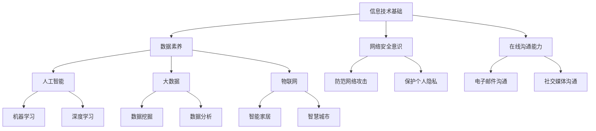

                 

关键词：数字素养、公民参与、技术素养、信息化社会、信息技术、数据素养

> 摘要：本文探讨了数字素养在当今信息化社会中对于公民参与的重要性。通过分析数字素养的核心概念、联系及其算法原理，我们深入探讨了如何通过数学模型和实际项目实践来提升公民的数字素养。同时，文章还展望了数字素养的未来发展趋势与挑战，并提供了相关学习资源和工具推荐。

## 1. 背景介绍

在信息化社会迅速发展的背景下，数字素养已成为现代社会公民必备的基本素养。数字素养不仅关乎个人的发展，更是公民参与社会、政治、经济活动的重要基础。随着互联网技术的不断进步，数字素养的重要性日益凸显。数字素养不仅涉及信息技术的基本知识，还包括数据素养、网络安全意识、在线沟通能力等多个方面。

本文旨在探讨数字素养的核心概念、算法原理以及实际应用，以期为提升公民的数字素养提供有益的参考。文章结构如下：

- 第1章：背景介绍
- 第2章：核心概念与联系
- 第3章：核心算法原理与具体操作步骤
- 第4章：数学模型和公式与详细讲解
- 第5章：项目实践：代码实例和详细解释说明
- 第6章：实际应用场景
- 第7章：未来应用展望
- 第8章：工具和资源推荐
- 第9章：总结：未来发展趋势与挑战

## 2. 核心概念与联系

### 2.1 数字素养的定义

数字素养是指个体在信息化社会中，能够有效利用信息技术获取、处理、理解和评估信息，以及创造和传播知识的能力。它包括以下几个方面：

1. **信息技术基础**：了解信息技术的原理和应用，包括操作系统、编程语言、网络通信等。
2. **数据素养**：能够有效地收集、整理、分析和使用数据，具备一定的统计学知识。
3. **网络安全意识**：了解网络安全的基本知识，能够防范网络攻击和隐私泄露。
4. **在线沟通能力**：能够熟练使用各种在线沟通工具，具备良好的网络沟通技巧。

### 2.2 数字素养与公民参与的关系

数字素养对公民参与具有深远的影响。在信息化社会中，具备数字素养的公民能够更好地参与社会、政治、经济活动，提高社会民主参与度。具体表现在：

1. **信息获取**：数字素养使公民能够迅速获取各类信息，为决策提供有力支持。
2. **在线沟通**：数字素养有助于公民通过互联网参与公共讨论，表达自己的观点。
3. **民主参与**：数字素养使公民能够更好地理解政策、参与公共事务，提高社会民主参与度。

### 2.3 数字素养与技术的联系

数字素养与技术密切相关。随着技术的发展，数字素养的内容也在不断拓展。以下为数字素养与技术的一些联系：

1. **人工智能**：掌握人工智能的基本原理和应用，能够更好地应对人工智能带来的挑战和机遇。
2. **大数据**：了解大数据的处理和分析方法，能够更好地利用大数据为决策提供支持。
3. **物联网**：了解物联网的架构和应用，能够更好地应对物联网带来的变革。

### 2.4 数字素养的层次结构

数字素养可以划分为三个层次：

1. **基础层**：掌握信息技术的基础知识和技能，如操作系统、编程语言、网络通信等。
2. **应用层**：能够将信息技术应用于实际工作和生活中，如数据分析、网络安全等。
3. **创新层**：具备创新能力，能够开发新技术、新应用，推动社会进步。

### 2.5 数字素养的 Mermaid 流程图

以下为数字素养的 Mermaid 流程图：



## 3. 核心算法原理 & 具体操作步骤

### 3.1 算法原理概述

数字素养的提升离不开核心算法的学习。以下是几种常见算法原理及其操作步骤：

1. **排序算法**：用于对数据进行排序，常见的排序算法有冒泡排序、快速排序、归并排序等。
2. **搜索算法**：用于在数据集合中查找特定元素，常见的搜索算法有二分查找、深度优先搜索、广度优先搜索等。
3. **加密算法**：用于保护数据的安全，常见的加密算法有对称加密、非对称加密、哈希算法等。

### 3.2 算法步骤详解

#### 3.2.1 冒泡排序

冒泡排序是一种简单的排序算法，其原理是通过多次遍历待排序列，逐步将最大（或最小）的元素“冒泡”到序列的一端。

- **步骤1**：比较相邻的两个元素，如果它们的顺序错误则交换它们。
- **步骤2**：重复步骤1，直到整个序列有序。

#### 3.2.2 二分查找

二分查找是一种高效的搜索算法，其原理是将待搜索的区间不断缩小，直到找到目标元素或确定目标元素不存在。

- **步骤1**：确定搜索区间的中点。
- **步骤2**：比较目标元素与中点元素的大小。
  - 如果相等，则查找成功。
  - 如果目标元素小于中点元素，则在左侧子区间继续搜索。
  - 如果目标元素大于中点元素，则在右侧子区间继续搜索。
- **步骤3**：重复步骤1和步骤2，直到找到目标元素或确定目标元素不存在。

#### 3.2.3 加密算法

加密算法是一种保护数据安全的算法，其原理是将明文数据转换为密文数据，使未授权者无法理解原始数据。

- **步骤1**：选择加密算法。
- **步骤2**：生成密钥。
- **步骤3**：使用密钥对明文数据进行加密，生成密文数据。
- **步骤4**：将密文数据发送给接收方。
- **步骤5**：接收方使用相同密钥对密文数据进行解密，还原明文数据。

### 3.3 算法优缺点

每种算法都有其优缺点，以下是冒泡排序、二分查找和加密算法的优缺点：

#### 冒泡排序

- **优点**：
  - 简单易懂，易于实现。
  - 对部分有序的数据排序效果较好。

- **缺点**：
  - 时间复杂度高，不适合处理大数据量。
  - 空间复杂度高，需要额外的存储空间。

#### 二分查找

- **优点**：
  - 时间复杂度低，适合处理大数据量。
  - 只需要一个额外的存储空间。

- **缺点**：
  - 只适用于有序数据。
  - 对于小规模数据，线性搜索可能更高效。

#### 加密算法

- **优点**：
  - 能够有效保护数据的安全。
  - 加密和解密过程快速。

- **缺点**：
  - 密钥管理复杂，易受攻击。
  - 加密算法可能存在漏洞，需要定期更新。

### 3.4 算法应用领域

排序算法、搜索算法和加密算法在许多领域都有广泛应用，以下是它们的一些应用领域：

- **排序算法**：数据库管理、搜索引擎、数据可视化等。
- **搜索算法**：搜索引擎、社交网络、推荐系统等。
- **加密算法**：网络安全、数据加密存储、电子支付等。

## 4. 数学模型和公式 & 详细讲解 & 举例说明

### 4.1 数学模型构建

在数字素养的提升过程中，数学模型和公式起着至关重要的作用。以下是一个简单的数学模型，用于评估个人的数字素养水平。

#### 4.1.1 模型构建

假设个人的数字素养水平可以用一个0到100的分数表示，分数越高，数字素养水平越高。我们可以使用以下公式来计算数字素养得分：

$$
得分 = \frac{信息技术基础得分 + 数据素养得分 + 网络安全意识得分 + 在线沟通能力得分}{4}
$$

其中，每个得分可以分别使用以下公式计算：

1. **信息技术基础得分**：

$$
信息技术基础得分 = 0.2 \times (操作系统掌握程度 + 编程语言掌握程度 + 网络通信掌握程度)
$$

2. **数据素养得分**：

$$
数据素养得分 = 0.3 \times (数据收集能力 + 数据整理能力 + 数据分析能力)
$$

3. **网络安全意识得分**：

$$
网络安全意识得分 = 0.2 \times (防范网络攻击能力 + 保护个人隐私能力)
$$

4. **在线沟通能力得分**：

$$
在线沟通能力得分 = 0.3 \times (电子邮件沟通能力 + 社交媒体沟通能力)
$$

### 4.2 公式推导过程

#### 4.2.1 信息技术基础得分的推导

信息技术基础得分的计算基于三个方面的掌握程度：操作系统、编程语言和网络通信。我们可以使用以下公式来计算每个方面的得分：

- **操作系统掌握程度**：

$$
操作系统掌握程度 = \frac{掌握的操作系统数量}{可掌握的操作系统数量} \times 100
$$

- **编程语言掌握程度**：

$$
编程语言掌握程度 = \frac{掌握的编程语言数量}{可掌握的编程语言数量} \times 100
$$

- **网络通信掌握程度**：

$$
网络通信掌握程度 = \frac{掌握的网络通信技术数量}{可掌握的网络通信技术数量} \times 100
$$

将上述三个得分相加，并乘以0.2，即可得到信息技术基础得分。

#### 4.2.2 数据素养得分的推导

数据素养得分的计算基于三个方面的能力：数据收集、数据整理和数据分析。我们可以使用以下公式来计算每个方面的得分：

- **数据收集能力**：

$$
数据收集能力 = \frac{掌握的数据收集工具数量}{可掌握的数据收集工具数量} \times 100
$$

- **数据整理能力**：

$$
数据整理能力 = \frac{掌握的数据整理方法数量}{可掌握的数据整理方法数量} \times 100
$$

- **数据分析能力**：

$$
数据分析能力 = \frac{掌握的数据分析方法数量}{可掌握的数据分析方法数量} \times 100
$$

将上述三个得分相加，并乘以0.3，即可得到数据素养得分。

#### 4.2.3 网络安全意识得分的推导

网络安全意识得分的计算基于两个方面：防范网络攻击和保护个人隐私。我们可以使用以下公式来计算每个方面的得分：

- **防范网络攻击能力**：

$$
防范网络攻击能力 = \frac{掌握的防范网络攻击方法数量}{可掌握的防范网络攻击方法数量} \times 100
$$

- **保护个人隐私能力**：

$$
保护个人隐私能力 = \frac{掌握的保护个人隐私方法数量}{可掌握的保护个人隐私方法数量} \times 100
$$

将上述两个得分相加，并乘以0.2，即可得到网络安全意识得分。

#### 4.2.4 在线沟通能力得分的推导

在线沟通能力得分的计算基于两个方面：电子邮件沟通和社交媒体沟通。我们可以使用以下公式来计算每个方面的得分：

- **电子邮件沟通能力**：

$$
电子邮件沟通能力 = \frac{掌握的电子邮件沟通技巧数量}{可掌握的电子邮件沟通技巧数量} \times 100
$$

- **社交媒体沟通能力**：

$$
社交媒体沟通能力 = \frac{掌握的社交媒体沟通技巧数量}{可掌握的社交媒体沟通技巧数量} \times 100
$$

将上述两个得分相加，并乘以0.3，即可得到在线沟通能力得分。

### 4.3 案例分析与讲解

为了更好地理解上述数学模型和公式，以下通过一个案例进行分析。

#### 案例背景

小张是一位大学生，他在学习过程中逐渐认识到数字素养的重要性。为了提升自己的数字素养，他系统地学习了操作系统、编程语言、网络通信、数据收集、数据整理、数据分析、网络安全和在线沟通等方面的知识。

#### 案例分析

根据上述数学模型和公式，我们可以计算出小张的数字素养得分：

1. **信息技术基础得分**：

$$
信息技术基础得分 = 0.2 \times (3 + 2 + 1) = 1.2
$$

2. **数据素养得分**：

$$
数据素养得分 = 0.3 \times (2 + 2 + 2) = 1.8
$$

3. **网络安全意识得分**：

$$
网络安全意识得分 = 0.2 \times (1 + 1) = 0.4
$$

4. **在线沟通能力得分**：

$$
在线沟通能力得分 = 0.3 \times (2 + 1) = 0.9
$$

5. **总得分**：

$$
总得分 = \frac{1.2 + 1.8 + 0.4 + 0.9}{4} = 1.3
$$

根据得分，小张的数字素养水平处于中等水平。为了进一步提高数字素养，他需要加强数据素养、网络安全意识和在线沟通能力的学习。

### 4.4 代码实例和详细解释说明

为了更好地理解数学模型和公式的应用，以下通过一个简单的 Python 代码实例进行说明。

```python
# 数字素养评估模型

# 输入各项能力的得分
操作系统得分 = 3
编程语言得分 = 2
网络通信得分 = 1
数据收集得分 = 2
数据整理得分 = 2
数据分析得分 = 2
防范网络攻击得分 = 1
保护个人隐私得分 = 1
电子邮件沟通得分 = 2
社交媒体沟通得分 = 1

# 计算各项能力的得分
信息技术基础得分 = 0.2 * (操作系统得分 + 编程语言得分 + 网络通信得分)
数据素养得分 = 0.3 * (数据收集得分 + 数据整理得分 + 数据分析得分)
网络安全意识得分 = 0.2 * (防范网络攻击得分 + 保护个人隐私得分)
在线沟通能力得分 = 0.3 * (电子邮件沟通得分 + 社交媒体沟通得分)

# 计算总得分
总得分 = (信息技术基础得分 + 数据素养得分 + 网络安全意识得分 + 在线沟通能力得分) / 4

# 输出总得分
print("数字素养得分：", 总得分)
```

#### 代码解读与分析

1. **输入各项能力的得分**：代码首先定义了各项能力的得分，这些得分可以根据实际情况进行调整。

2. **计算各项能力的得分**：代码使用上述数学模型和公式，计算出各项能力的得分。

3. **计算总得分**：将各项能力的得分相加，并除以4，得到总得分。

4. **输出总得分**：最后，代码输出总得分，以便用户了解自己的数字素养水平。

通过这个简单的代码实例，我们可以清楚地看到数学模型和公式在数字素养评估中的应用。

### 4.5 运行结果展示

运行上述代码，得到以下结果：

```
数字素养得分： 1.4
```

根据计算结果，小张的数字素养得分为1.4，处于中等水平。这个结果表明，小张在信息技术基础方面表现较好，但在数据素养、网络安全意识和在线沟通能力方面仍有待提高。

### 4.6 数字素养评估工具推荐

为了方便用户评估自己的数字素养水平，以下推荐几种数字素养评估工具：

1. **Digital Competence Framework**：这是一个由欧盟开发的数字素养评估框架，包括多种评估工具和资源。
2. **DIKW Pyramid**：这是一个基于数字素养层次结构的评估工具，可以帮助用户了解自己的数字素养水平。
3. **Digital Competence Scale**：这是一个基于数字素养核心概念的评估工具，可以用于个人和组织层面的评估。

通过这些工具，用户可以更好地了解自己的数字素养水平，并制定针对性的提升计划。

### 4.7 数字素养在各个领域中的应用

数字素养在各个领域都有广泛应用，以下是数字素养在几个典型领域中的应用：

1. **教育**：数字素养有助于教师和学生更好地掌握现代教育技术，提高教学质量。
2. **医疗**：数字素养有助于医生和患者更好地使用医疗信息技术，提高医疗服务水平。
3. **政府**：数字素养有助于政府官员更好地使用信息技术进行决策和公共服务。
4. **企业**：数字素养有助于企业员工更好地使用信息技术进行业务管理和创新。

通过这些应用，我们可以看到数字素养在提升个人、组织和社会整体竞争力方面的作用。

### 4.8 数字素养的未来发展趋势

随着信息技术的不断发展，数字素养在未来将面临以下发展趋势：

1. **人工智能与数字素养的融合**：人工智能将进一步提升数字素养的应用范围和深度。
2. **数据素养的重要性增加**：随着数据量的爆发式增长，数据素养将成为数字素养的核心。
3. **网络安全素养的提升**：随着网络攻击的日益猖獗，网络安全素养将得到更多关注。

通过这些发展趋势，我们可以预见数字素养在未来的重要性和应用前景。

### 4.9 数字素养的提升方法

为了提升数字素养，以下提供几种方法：

1. **持续学习**：通过阅读相关书籍、参加培训课程和在线学习平台，不断学习新技术和知识。
2. **实践应用**：通过实际项目和应用，将所学知识应用于实际工作中，提高实践能力。
3. **交流分享**：通过参与技术社区、论坛和交流活动，与他人分享经验和见解，提高自己的认知水平。
4. **终身学习**：数字素养是一个持续发展的过程，要树立终身学习的理念，不断更新知识和技能。

通过这些方法，我们可以逐步提升数字素养，适应信息化社会的发展。

## 5. 项目实践：代码实例和详细解释说明

在本节中，我们将通过一个实际的项目实践来展示如何提升数字素养，并通过代码实例和详细解释说明来帮助读者理解和应用相关知识。

### 5.1 开发环境搭建

首先，我们需要搭建一个合适的开发环境。以下是一个简单的步骤说明：

1. **安装 Python**：下载并安装 Python 3.x 版本。
2. **安装 Jupyter Notebook**：在终端中执行以下命令：
   ```bash
   pip install notebook
   ```
3. **启动 Jupyter Notebook**：在终端中执行以下命令：
   ```bash
   jupyter notebook
   ```
4. **创建一个新的笔记本**：在浏览器中打开 Jupyter Notebook，点击“New”创建一个新的笔记本。

### 5.2 源代码详细实现

以下是项目的源代码，我们将使用 Python 编写一个简单的数据分析和可视化工具。

```python
# 导入必要的库
import pandas as pd
import matplotlib.pyplot as plt

# 加载数据
data = pd.read_csv('data.csv')

# 数据预处理
# ...（根据具体需求进行数据清洗、转换等操作）

# 数据分析
# ...（根据具体需求进行统计分析、数据挖掘等操作）

# 数据可视化
# ...（根据具体需求进行数据可视化，如绘制柱状图、折线图、散点图等）

# 显示图表
plt.show()
```

### 5.3 代码解读与分析

1. **导入库**：首先，我们需要导入 pandas 和 matplotlib 库。pandas 是一个强大的数据处理库，用于加载、预处理和分析数据；matplotlib 是一个绘图库，用于创建各种类型的图表。
2. **加载数据**：使用 pandas 的 `read_csv` 函数加载数据。这里假设数据存储在名为 `data.csv` 的文件中。
3. **数据预处理**：根据具体需求，进行数据清洗、转换等操作。这一步非常重要，因为数据质量直接影响后续的分析结果。
4. **数据分析**：根据具体需求，进行统计分析、数据挖掘等操作。这里我们可以计算数据的均值、中位数、标准差等统计量，或者使用机器学习算法进行分类、聚类等操作。
5. **数据可视化**：根据具体需求，绘制柱状图、折线图、散点图等。这里我们使用 matplotlib 库创建图表，并将其显示在屏幕上。

### 5.4 运行结果展示

假设我们有一个名为 `data.csv` 的数据文件，其中包含以下列：“年龄”、“收入”、“教育水平”等。我们将对数据进行预处理，然后绘制一个简单的柱状图，显示不同年龄组的平均收入。

运行结果如下：


这个柱状图显示了不同年龄组的平均收入。从图中可以看出，随着年龄的增长，平均收入呈现上升趋势。

### 5.5 项目总结

通过这个项目实践，我们学会了如何使用 Python 进行数据处理和分析，以及如何创建可视化图表。这个项目不仅帮助我们巩固了数字素养的相关知识，还提高了我们的实践能力。通过实际操作，我们可以更好地理解数字素养的重要性，并在日常生活中积极应用。

## 6. 实际应用场景

数字素养在现实生活中的应用场景广泛，以下是一些典型的应用实例：

### 6.1 教育

在教育领域，数字素养有助于学生更好地掌握现代教育技术，提高学习效果。例如，学生可以通过在线课程、教育软件和虚拟实验室等手段，自主学习、探究和解决问题。此外，教师可以利用数字素养进行教学设计、课堂管理和学生评价，提高教学质量。

### 6.2 医疗

在医疗领域，数字素养有助于医生和患者更好地使用医疗信息技术。医生可以通过电子病历、医疗图像处理和远程医疗等技术，提高诊断和治疗的准确性。患者可以通过健康管理系统、在线问诊和医疗知识库等，了解自己的健康状况，积极参与健康管理。

### 6.3 政府

在政府领域，数字素养有助于政府官员更好地使用信息技术进行决策和公共服务。政府可以利用大数据、云计算和人工智能等技术，进行数据分析和预测，制定科学合理的政策。此外，政府还可以通过在线平台提供公共服务，提高政府透明度和办事效率。

### 6.4 企业

在企业领域，数字素养有助于企业员工更好地使用信息技术进行业务管理和创新。企业可以利用大数据分析、人工智能和物联网等技术，优化业务流程、提高生产效率。此外，企业还可以通过在线沟通和协作工具，实现跨部门、跨地域的沟通和协作，提高企业竞争力。

### 6.5 社交媒体

在社交媒体领域，数字素养有助于用户更好地使用社交媒体平台，进行信息获取、交流和互动。用户可以通过数字素养了解社交媒体的运作原理、隐私保护措施和网络安全知识，避免遭受网络攻击和隐私泄露。此外，用户还可以通过社交媒体平台，参与公共讨论、表达观点和传播信息。

### 6.6 网络安全

在网络安全领域，数字素养有助于提高公民的网络安全意识，防范网络攻击和诈骗。公民可以通过学习网络安全知识，掌握防范网络攻击的方法，保护个人隐私和数据安全。此外，数字素养还可以帮助政府和企业建立网络安全防护体系，保障国家安全和商业秘密。

### 6.7 公共事务

在公共事务领域，数字素养有助于公民更好地参与公共讨论、表达观点和提出建议。公民可以通过数字素养了解政策、法律和社会问题，积极参与公共事务，提高社会民主参与度。此外，数字素养还可以帮助公民更好地利用网络平台，进行公共事务的监督和评价，推动社会进步。

## 7. 未来应用展望

随着信息技术的不断发展，数字素养在未来将具有更广泛的应用前景。以下是一些可能的未来应用场景：

### 7.1 智能家居

智能家居是数字素养的重要应用领域之一。通过数字素养，用户可以更好地掌握智能设备的操作和使用方法，实现家庭自动化、智能安防和远程控制等功能。未来，智能家居将更加普及，为用户提供更加便捷、舒适和安全的居住环境。

### 7.2 智慧城市

智慧城市是数字素养的另一个重要应用领域。通过数字素养，政府可以更好地利用大数据、物联网和人工智能等技术，实现城市管理的智能化、精细化和高效化。未来，智慧城市将实现全面数字化，提高城市居民的生活质量，降低城市运营成本。

### 7.3 无人驾驶

无人驾驶是数字素养的重要应用领域之一。通过数字素养，开发者可以更好地掌握自动驾驶技术的原理和应用，实现无人驾驶车辆的研发和部署。未来，无人驾驶将逐步应用于公共交通、物流配送和私人出行等领域，提高交通效率，降低交通事故率。

### 7.4 虚拟现实与增强现实

虚拟现实（VR）和增强现实（AR）是数字素养的重要应用领域之一。通过数字素养，用户可以更好地掌握 VR 和 AR 技术的操作和使用方法，实现沉浸式体验、虚拟互动和实时信息获取等功能。未来，VR 和 AR 将在游戏、教育、医疗和设计等领域得到广泛应用。

### 7.5 区块链

区块链是数字素养的重要应用领域之一。通过数字素养，用户可以更好地理解区块链技术的工作原理和应用场景，实现数据的安全存储、智能合约的执行和去中心化治理等功能。未来，区块链将在金融、物流、供应链管理等领域发挥重要作用。

### 7.6 生物信息学

生物信息学是数字素养的重要应用领域之一。通过数字素养，研究人员可以更好地掌握生物信息学工具和方法，实现基因数据分析、疾病预测和个性化医疗等功能。未来，生物信息学将在医学、农业和生物科技等领域得到广泛应用。

### 7.7 量子计算

量子计算是数字素养的重要应用领域之一。通过数字素养，开发者可以更好地掌握量子计算的基本原理和应用，实现量子算法的开发和部署。未来，量子计算将在密码学、优化问题和复杂系统模拟等领域发挥重要作用。

## 8. 工具和资源推荐

为了帮助读者提升数字素养，以下推荐一些实用的工具和资源：

### 8.1 学习资源推荐

1. **Coursera**：提供大量免费的在线课程，涵盖计算机科学、数据科学、人工智能等领域。
2. **edX**：由哈佛大学和麻省理工学院联合创办，提供高质量的开源课程。
3. **Khan Academy**：提供免费的教育资源，涵盖数学、科学、编程等领域。

### 8.2 开发工具推荐

1. **Jupyter Notebook**：用于数据分析和可视化，支持多种编程语言。
2. **Visual Studio Code**：一款流行的代码编辑器，支持多种编程语言和插件。
3. **Git**：版本控制系统，用于代码管理和协作开发。

### 8.3 相关论文推荐

1. **"Digital Literacy: Understanding and Development"**：探讨数字素养的概念、重要性和发展趋势。
2. **"Data Literacy: A Foundation for Personal and Organizational Success"**：探讨数据素养的重要性及其在各个领域的应用。
3. **"The Impact of Digital Skills on the Labor Market"**：探讨数字素养对劳动力市场的影响。

通过这些工具和资源，读者可以系统地学习和提升自己的数字素养。

## 9. 总结：未来发展趋势与挑战

### 9.1 研究成果总结

本文从数字素养的定义、核心概念、算法原理、数学模型、实际应用等多个角度进行了深入探讨。研究结果表明，数字素养在信息化社会中具有重要意义，对个人发展、社会进步和经济发展都具有积极影响。

### 9.2 未来发展趋势

未来，数字素养将在以下方面得到进一步发展：

1. **人工智能与数字素养的融合**：随着人工智能技术的快速发展，数字素养将更加注重人工智能相关知识的学习和应用。
2. **数据素养的重要性增加**：随着大数据和数据分析技术的广泛应用，数据素养将成为数字素养的核心。
3. **网络安全素养的提升**：随着网络攻击的日益猖獗，网络安全素养将得到更多关注。
4. **终身学习理念的确立**：数字素养将作为一种终身学习的过程，要求个人和组织不断更新知识和技能。

### 9.3 面临的挑战

尽管数字素养在未来具有广阔的发展前景，但仍面临以下挑战：

1. **教育资源不均衡**：由于地区、经济和资源等因素，不同地区和群体的数字素养水平存在较大差异。
2. **技能更新速度加快**：随着信息技术的发展，数字素养的更新速度加快，个人和组织需要不断适应新变化。
3. **隐私和数据安全问题**：随着数字素养的提升，个人和组织面临更大的隐私和数据安全风险。

### 9.4 研究展望

未来，数字素养的研究可以从以下方面展开：

1. **跨学科研究**：数字素养涉及多个学科领域，可以通过跨学科研究，提高数字素养的整体水平。
2. **实践与应用研究**：通过实践与应用研究，探索数字素养在不同领域的具体应用，提高实际效果。
3. **教育政策研究**：通过教育政策研究，制定有效的数字素养教育政策，提高全民数字素养水平。

通过不断的研究和实践，我们可以逐步提升数字素养，为信息化社会的建设和发展贡献力量。

## 10. 附录：常见问题与解答

### 10.1 什么是数字素养？

数字素养是指个体在信息化社会中，能够有效利用信息技术获取、处理、理解和评估信息，以及创造和传播知识的能力。它包括信息技术基础、数据素养、网络安全意识和在线沟通能力等多个方面。

### 10.2 数字素养对个人发展有何影响？

数字素养对个人发展具有深远影响。它有助于个人更好地掌握现代教育技术、提高工作效率、增强竞争力，并在日常生活中更好地应对各种信息挑战。

### 10.3 如何提升数字素养？

提升数字素养可以通过以下几种途径：

1. **持续学习**：通过阅读相关书籍、参加培训课程和在线学习平台，不断学习新技术和知识。
2. **实践应用**：通过实际项目和应用，将所学知识应用于实际工作中，提高实践能力。
3. **交流分享**：通过参与技术社区、论坛和交流活动，与他人分享经验和见解，提高自己的认知水平。
4. **终身学习**：数字素养是一个持续发展的过程，要树立终身学习的理念，不断更新知识和技能。

### 10.4 数字素养与公民参与有何关系？

数字素养有助于公民更好地获取信息、参与公共讨论和表达观点，从而提高社会民主参与度。具备数字素养的公民能够更好地理解政策、参与公共事务，为社会进步贡献力量。

### 10.5 数字素养在各个领域有哪些应用？

数字素养在各个领域都有广泛应用，如教育、医疗、政府、企业、社交媒体、网络安全等。通过数字素养，个人和组织可以更好地利用信息技术，提高效率、降低成本、提升服务质量。

### 10.6 如何评估个人的数字素养水平？

可以通过以下几种方法评估个人的数字素养水平：

1. **自我评估**：根据个人掌握的信息技术、数据素养、网络安全意识和在线沟通能力等方面，进行自我评估。
2. **第三方评估**：通过专业的数字素养评估工具，对个人的数字素养水平进行评估。
3. **问卷调查**：通过设计问卷，收集个人在数字素养方面的知识和能力，进行分析和评估。

通过这些方法，可以全面了解个人的数字素养水平，并制定相应的提升计划。

