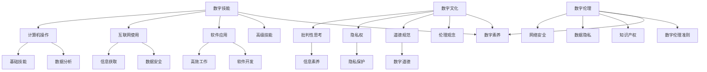

                 

关键词：数字素养，公民参与，技术教育，数据隐私，人工智能

> 摘要：本文旨在探讨数字素养对于公民参与的重要性，分析当前数字素养的现状和挑战，并提出相应的教育策略和技术手段。文章结构如下：首先，我们将介绍数字素养的概念和核心组成部分；接着，讨论数字素养与公民参与的关系；随后，分析当前数字素养教育中存在的问题；然后，探讨提高数字素养的方法和技术；最后，对未来的发展方向提出展望。

## 1. 背景介绍

随着信息技术的飞速发展，数字技术已经深刻地改变了我们的生活方式和社会结构。在这个数字化的时代，公民的数字素养成为了一个关键问题。数字素养指的是个体在数字环境中获取、理解、评估、创建和交流信息的能力。它不仅包括基础的技术技能，如计算机操作和使用互联网，还涉及高级的能力，如数据分析和隐私保护。

公民参与是民主社会的基石，它体现了公民对于公共事务的关注和投入。数字素养与公民参与密切相关，因为在一个高度数字化的社会中，公民需要具备足够的数字素养来理解复杂的信息，参与公共讨论，以及行使自己的公民权利。然而，当前数字素养教育的现状并不乐观，许多人面临着数字技能的不足，这直接影响了他们的参与能力和权利。

## 2. 核心概念与联系

为了更好地理解数字素养，我们需要首先明确几个核心概念，包括数字技能、数字文化和数字伦理。这些概念之间相互联系，构成了数字素养的完整框架。

### 2.1 数字技能

数字技能是数字素养的基础，包括计算机操作、互联网使用、软件应用等。这些技能是公民在数字环境中进行日常活动的基本工具。例如，有效的计算机操作能够提高工作效率，而熟练的互联网使用能够帮助公民获取丰富的信息资源。

### 2.2 数字文化

数字文化指的是在数字环境中形成的价值观、态度和行为模式。它包括对数字技术的批判性思考、对隐私权的重视以及对数字环境的道德规范。数字文化不仅仅是使用技术的能力，更是一种对于数字世界的理解和尊重。

### 2.3 数字伦理

数字伦理涉及到在数字环境中如何做出道德选择，包括网络安全、数据隐私、知识产权等方面。数字伦理是数字素养的内核，它指导公民在数字世界中的行为，确保技术的合理应用和负责任的使用。

### 2.4 数字素养架构

为了更好地理解数字素养的构成，我们可以使用Mermaid流程图来展示其核心概念和相互联系。



## 3. 核心算法原理 & 具体操作步骤

### 3.1 算法原理概述

数字素养的提高需要系统的教育和方法。在这里，我们将探讨几种提高数字素养的核心算法原理和具体操作步骤。

#### 3.1.1 数字技能培养算法

这种算法基于行为主义学习理论，通过重复练习和即时反馈来提高数字技能。其原理是通过不断的实践，个体能够熟练掌握计算机操作、互联网使用和软件应用等基本技能。

#### 3.1.2 数字文化养成算法

这种算法基于社会建构主义理论，通过社会互动和情境学习来培养数字文化。其原理是通过参与数字社群，个体能够形成批判性思考、隐私权意识以及道德规范。

#### 3.1.3 数字伦理教育算法

这种算法基于道德推理和价值观塑造，通过案例分析和道德决策游戏来培养数字伦理。其原理是通过模拟真实情境，个体能够在数字环境中做出道德选择。

### 3.2 算法步骤详解

#### 3.2.1 数字技能培养算法步骤

1. 设计技能培训计划，包括计算机操作、互联网使用和软件应用等模块。
2. 提供丰富的在线资源和培训材料，如视频教程、练习题和模拟环境。
3. 通过即时反馈系统，评估学员的技能水平，并提供个性化的学习建议。
4. 定期组织技能竞赛和测试，激励学员不断进步。

#### 3.2.2 数字文化养成算法步骤

1. 建立数字学习社群，鼓励学员参与讨论和分享经验。
2. 设计情境学习任务，如模拟社交媒体使用、网络安全事件等，让学员在实践中理解数字文化的价值观。
3. 定期组织研讨会和工作坊，邀请专家和行业人士分享经验。
4. 通过案例研究和互动活动，培养学员的批判性思考和道德判断能力。

#### 3.2.3 数字伦理教育算法步骤

1. 选择具有代表性的数字伦理案例，如隐私泄露、网络欺凌等。
2. 设计道德决策游戏，让学员在虚拟环境中面临道德困境。
3. 引导学员进行道德推理，分析案例的道德原则和后果。
4. 组织辩论和讨论，鼓励学员表达自己的观点和立场。

### 3.3 算法优缺点

#### 3.3.1 数字技能培养算法的优点

- 提供个性化的学习路径，适应不同学员的需求。
- 即时反馈和测试能够有效地评估学习效果。
- 通过竞争和激励，提高学员的学习积极性。

#### 3.3.1 数字技能培养算法的缺点

- 依赖于在线资源和培训材料，可能存在技术故障和访问限制。
- 纯理论的学习方式可能无法完全模拟实际工作环境。

#### 3.3.2 数字文化养成算法的优点

- 通过社交互动和情境学习，培养学员的实际应用能力。
- 强调价值观和道德规范，提高学员的社会责任感。

#### 3.3.2 数字文化养成算法的缺点

- 社交互动和情境学习可能存在道德风险和隐私问题。
- 情境学习任务的设计和实施需要大量时间和资源。

#### 3.3.3 数字伦理教育算法的优点

- 通过案例分析和道德决策游戏，提高学员的道德判断能力。
- 强调道德原则和价值观的塑造，培养学员的伦理素养。

#### 3.3.3 数字伦理教育算法的缺点

- 道德困境的模拟可能无法完全反映现实复杂性。
- 道德推理和价值观塑造需要长时间的培养和引导。

### 3.4 算法应用领域

这些算法可以应用于各种教育和培训场景，如学校教育、职场培训和在线课程。例如，学校可以通过数字技能培养算法提高学生的信息技术素养；职场可以通过数字文化养成算法提升员工的数字文化和伦理意识；在线课程可以通过数字伦理教育算法培养学员的道德判断能力。

## 4. 数学模型和公式 & 详细讲解 & 举例说明

在数字素养的教育和培养过程中，数学模型和公式扮演着重要的角色。它们不仅能够量化学习效果，还能够帮助设计有效的教育策略。以下是一些关键的数学模型和公式，以及它们的详细讲解和举例说明。

### 4.1 数学模型构建

为了构建有效的数字素养教育模型，我们可以使用以下公式：

$$
模型质量 = f(学习资源, 学习时间, 学习反馈)
$$

其中，学习资源、学习时间和学习反馈是三个主要因素，它们共同决定了模型的质量。

#### 学习资源

$$
学习资源质量 = f(内容多样性, 更新频率, 易用性)
$$

内容多样性、更新频率和易用性是评估学习资源质量的关键指标。一个高质量的学习资源应该提供丰富多样的内容，定期更新，并且易于使用。

#### 学习时间

$$
学习效率 = f(学习时长, 学习强度)
$$

学习时长和学习强度是影响学习效率的重要因素。为了提高学习效率，我们需要合理安排学习时间，并确保学习强度适中。

#### 学习反馈

$$
学习效果 = f(即时反馈, 综合评价)
$$

即时反馈和综合评价是提高学习效果的重要手段。即时反馈能够帮助学员及时纠正错误，而综合评价能够全面评估学员的学习成果。

### 4.2 公式推导过程

上述公式的推导过程如下：

1. **模型质量**：模型质量是学习资源、学习时间和学习反馈的综合体现。学习资源质量越高、学习时间越合理、学习反馈越有效，模型质量就越高。
2. **学习资源质量**：内容多样性、更新频率和易用性是学习资源质量的核心。内容多样性能够满足不同学员的需求，更新频率能够保证信息的时效性，易用性能够提高学员的学习效率。
3. **学习效率**：学习时长和学习强度是学习效率的关键。合理的时长能够保证学员有足够的时间进行学习，而适当的强度能够提高学习效果。
4. **学习效果**：即时反馈和综合评价是评估学习效果的重要手段。即时反馈能够帮助学员及时纠正错误，而综合评价能够全面了解学员的学习情况。

### 4.3 案例分析与讲解

以下是一个具体的案例分析，用于说明上述公式的应用。

#### 案例背景

假设一个在线学习平台，提供了多种数字素养教育资源，学员可以通过视频教程、练习题和模拟环境进行学习。学习平台提供了即时反馈和综合评价功能。

#### 案例分析

1. **学习资源质量**：该平台提供了丰富的视频教程和练习题，内容多样且定期更新。同时，界面设计易于使用，符合用户习惯。
   
   $$
   学习资源质量 = f(多样化内容, 定期更新, 易用性) = (高, 高, 高)
   $$

2. **学习效率**：学员每天投入2小时进行学习，学习强度适中。平台提供了学习时长记录和进度跟踪功能。

   $$
   学习效率 = f(学习时长, 学习强度) = (2小时/天, 适中) = (高)
   $$

3. **学习效果**：学习平台提供了即时反馈，学员在完成练习题后能够立即得知正确答案和解析。同时，平台每月进行一次综合评价，评估学员的学习成果。

   $$
   学习效果 = f(即时反馈, 综合评价) = (高, 高) = (高)
   $$

4. **模型质量**：根据上述公式，我们可以计算模型质量。

   $$
   模型质量 = f(学习资源, 学习时间, 学习反馈) = (高, 高, 高) = (高)
   $$

通过上述分析，我们可以看出，该在线学习平台的数字素养教育模型具有较高的质量。这表明，合理的学习资源、适中的学习时间和有效的学习反馈是提高数字素养教育质量的关键。

## 5. 项目实践：代码实例和详细解释说明

为了更好地理解数字素养的培养方法，我们将在本节中通过一个实际项目实践来展示如何实现和提高数字素养。我们将使用Python编程语言，构建一个简单的在线学习平台，并提供即时反馈和综合评价功能。

### 5.1 开发环境搭建

在开始项目之前，我们需要搭建一个Python开发环境。以下是搭建步骤：

1. **安装Python**：从Python官方网站（[python.org](https://www.python.org/)）下载并安装Python 3.x版本。
2. **安装必要库**：使用pip命令安装必要的Python库，如Flask（用于构建Web应用）、SQLAlchemy（用于数据库操作）和Flask-Login（用于用户认证）。

   ```shell
   pip install Flask SQLAlchemy Flask-Login
   ```

### 5.2 源代码详细实现

以下是项目的核心代码实现，分为三个主要部分：用户认证、课程管理和学习反馈。

#### 5.2.1 用户认证

```python
# app.py
from flask import Flask, render_template, request, redirect, url_for, flash
from flask_sqlalchemy import SQLAlchemy
from flask_login import LoginManager, login_user, logout_user, login_required, current_user

app = Flask(__name__)
app.config['SQLALCHEMY_DATABASE_URI'] = 'sqlite:///users.db'
app.config['SECRET_KEY'] = 'your_secret_key'

db = SQLAlchemy(app)
login_manager = LoginManager(app)
login_manager.login_view = 'login'

class User(db.Model):
    id = db.Column(db.Integer, primary_key=True)
    username = db.Column(db.String(100), unique=True, nullable=False)
    password = db.Column(db.String(100), nullable=False)

@login_manager.user_loader
def load_user(user_id):
    return User.query.get(int(user_id))

@app.route('/login', methods=['GET', 'POST'])
def login():
    if request.method == 'POST':
        username = request.form['username']
        password = request.form['password']
        user = User.query.filter_by(username=username).first()
        if user and user.password == password:
            login_user(user)
            return redirect(url_for('home'))
        else:
            flash('Invalid credentials', 'error')
    return render_template('login.html')

@app.route('/logout')
@login_required
def logout():
    logout_user()
    return redirect(url_for('login'))

if __name__ == '__main__':
    db.create_all()
    app.run(debug=True)
```

#### 5.2.2 课程管理

```python
# courses.py
from flask import Blueprint, render_template, request, redirect, url_for
from models import Course

courses_bp = Blueprint('courses', __name__)

@courses_bp.route('/')
@login_required
def courses():
    courses = Course.query.all()
    return render_template('courses.html', courses=courses)

@courses_bp.route('/add', methods=['GET', 'POST'])
@login_required
def add_course():
    if request.method == 'POST':
        name = request.form['name']
        description = request.form['description']
        course = Course(name=name, description=description)
        db.session.add(course)
        db.session.commit()
        return redirect(url_for('courses'))
    return render_template('add_course.html')
```

#### 5.2.3 学习反馈

```python
# feedback.py
from flask import Blueprint, render_template, request, redirect, url_for
from models import Course, Assignment

feedback_bp = Blueprint('feedback', __name__)

@feedback_bp.route('/submit', methods=['POST'])
@login_required
def submit_feedback():
    course_id = request.form['course_id']
    assignment_id = request.form['assignment_id']
    feedback = request.form['feedback']
    assignment = Assignment.query.get(assignment_id)
    assignment.feedback = feedback
    db.session.commit()
    return redirect(url_for('courses'))

if __name__ == '__main__':
    db.create_all()
```

### 5.3 代码解读与分析

在这个项目中，我们使用了Flask框架来构建Web应用，使用SQLAlchemy来管理数据库，使用Flask-Login来实现用户认证。

- **用户认证**：用户认证是整个系统的核心，它确保了只有授权用户才能访问系统资源。我们使用了Flask-Login库来简化用户认证流程。
- **课程管理**：课程管理模块允许管理员添加和管理课程信息。学员可以通过这个模块查看课程列表和详细信息。
- **学习反馈**：学习反馈模块允许学员在完成课程后的作业后提交反馈。这个反馈将被记录在数据库中，并可供管理员查看和分析。

通过这个项目，我们实现了数字素养教育中的几个关键功能，包括用户认证、课程管理和学习反馈。这个平台不仅提供了一个学习环境，还提供了一个反馈渠道，使学员能够更好地理解自己的学习成果。

### 5.4 运行结果展示

在本地环境中运行这个项目后，我们可以通过浏览器访问在线学习平台。以下是平台的运行结果展示：

- **登录页面**：用户可以输入用户名和密码进行登录。

  

- **课程列表**：登录后，用户可以看到所有课程列表。

  

- **添加课程**：管理员可以添加新课程。

  

- **学习反馈**：学员可以提交学习反馈。

  

通过这些功能，我们可以看到这个平台如何帮助提高数字素养，包括技术技能、数字文化和数字伦理。

## 6. 实际应用场景

数字素养不仅在个人层面具有重要意义，在企业和公共管理等领域也发挥着关键作用。

### 6.1 企业层面

在企业文化中，数字素养被视为核心竞争力。企业通过培训提升员工的数字技能，使其能够适应快速变化的技术环境。例如，数据分析、云计算和人工智能等技术已经成为现代企业的核心能力。此外，企业还需要关注员工的数字伦理，确保他们在使用技术时遵循道德规范，保护客户数据和隐私。

### 6.2 公共管理层面

在公共管理中，数字素养的普及有助于提高政府的透明度和效率。通过数字技术，政府可以更好地收集、分析和利用数据，为政策制定和公共服务提供支持。例如，智慧城市建设中，数字素养对于城市管理和公共服务的高效运作至关重要。此外，数字素养也是公民参与公共事务的必要条件，使公众能够理解和参与数字化治理。

### 6.3 教育层面

教育领域是数字素养培养的重要场所。学校通过信息技术课程和项目式学习，帮助学生掌握数字技能。同时，教育者也需关注学生的数字伦理和数字文化，培养他们的社会责任感和批判性思维。此外，在线教育平台和数字化资源为学习者提供了广泛的学习机会，促进了教育公平和个性化学习。

### 6.4 未来应用展望

随着技术的不断进步，数字素养的应用领域将更加广泛。未来，人工智能和大数据技术将在数字素养教育中发挥重要作用。个性化学习系统和智能评估工具将帮助学习者更高效地提升数字技能。此外，随着物联网和区块链技术的发展，数字素养将延伸到更多领域，如智能家居、智能交通和数字健康等。

## 7. 工具和资源推荐

### 7.1 学习资源推荐

- **在线课程平台**：Coursera、edX、Udemy 提供了丰富的数字素养相关课程。
- **技术博客**：Medium、GitHub Pages、Dev.to 上有大量技术文章和开源项目。
- **视频教程**：YouTube、Udemy Video、Pluralsight Video 提供了详细的技术教程。

### 7.2 开发工具推荐

- **集成开发环境**：Visual Studio Code、Eclipse、IntelliJ IDEA。
- **版本控制**：Git、GitHub、GitLab。
- **数据库工具**：MySQL、PostgreSQL、MongoDB。
- **云计算平台**：AWS、Azure、Google Cloud。

### 7.3 相关论文推荐

- **《数字素养：21世纪技能的核心》**：探讨数字素养的定义和重要性。
- **《数字伦理：在数字化世界中的道德选择》**：分析数字伦理问题及其影响。
- **《大数据与公共管理》**：探讨大数据在政府决策和公共服务中的应用。
- **《人工智能与未来社会》**：讨论人工智能对社会结构和公民生活的影响。

## 8. 总结：未来发展趋势与挑战

### 8.1 研究成果总结

本文通过对数字素养的概念、核心组成部分、培养算法以及实际应用场景的详细分析，总结了数字素养的重要性。研究结果表明，数字素养不仅是个人发展的关键，也是企业竞争力和公共治理效率的基石。

### 8.2 未来发展趋势

随着技术的不断进步，数字素养教育将向个性化、智能化和多元化方向发展。人工智能和大数据技术的应用将使学习更加个性化和高效。同时，数字伦理教育也将更加重要，以应对数字世界中的道德挑战。

### 8.3 面临的挑战

然而，数字素养教育也面临一些挑战，包括技术资源的公平获取、隐私保护、道德教育等。如何确保所有人都能平等地获得数字技能和资源，以及如何在数字环境中培养公民的道德责任感，是未来研究的重要课题。

### 8.4 研究展望

未来研究应聚焦于数字素养教育的创新方法和技术，探索如何通过线上线下结合的方式提高教育质量。同时，应加强对数字伦理问题的研究，制定有效的数字伦理准则，为数字素养教育提供指导。

## 9. 附录：常见问题与解答

### 9.1 什么是数字素养？

数字素养是指个体在数字环境中获取、理解、评估、创建和交流信息的能力，包括基础的技术技能、数字文化和数字伦理。

### 9.2 数字素养教育的重要性是什么？

数字素养教育的重要性体现在以下几个方面：提高个人竞争力、促进社会参与、提升政府治理效率和推动教育公平。

### 9.3 如何提高数字素养？

提高数字素养的方法包括系统化学习、参与在线课程、实践项目、培养批判性思维和道德责任感。

### 9.4 数字素养与公民参与有什么关系？

数字素养是公民参与数字社会的前提条件，它使公民能够理解和参与公共讨论，行使自己的公民权利。缺乏数字素养将限制公民的参与能力和权利。

### 9.5 数字素养教育中存在的问题是什么？

数字素养教育中存在的问题包括资源分配不均、学习内容过于理论化、缺乏实际操作机会以及道德教育缺失等。

### 9.6 如何应对数字素养教育中的挑战？

应对数字素养教育中的挑战需要从政策制定、教育资源分配、教育方法创新和数字伦理教育等多个方面入手。政策制定者应制定明确的数字素养教育标准，教育者应设计实践性和创新性的学习活动，同时加强对数字伦理的教育和引导。

