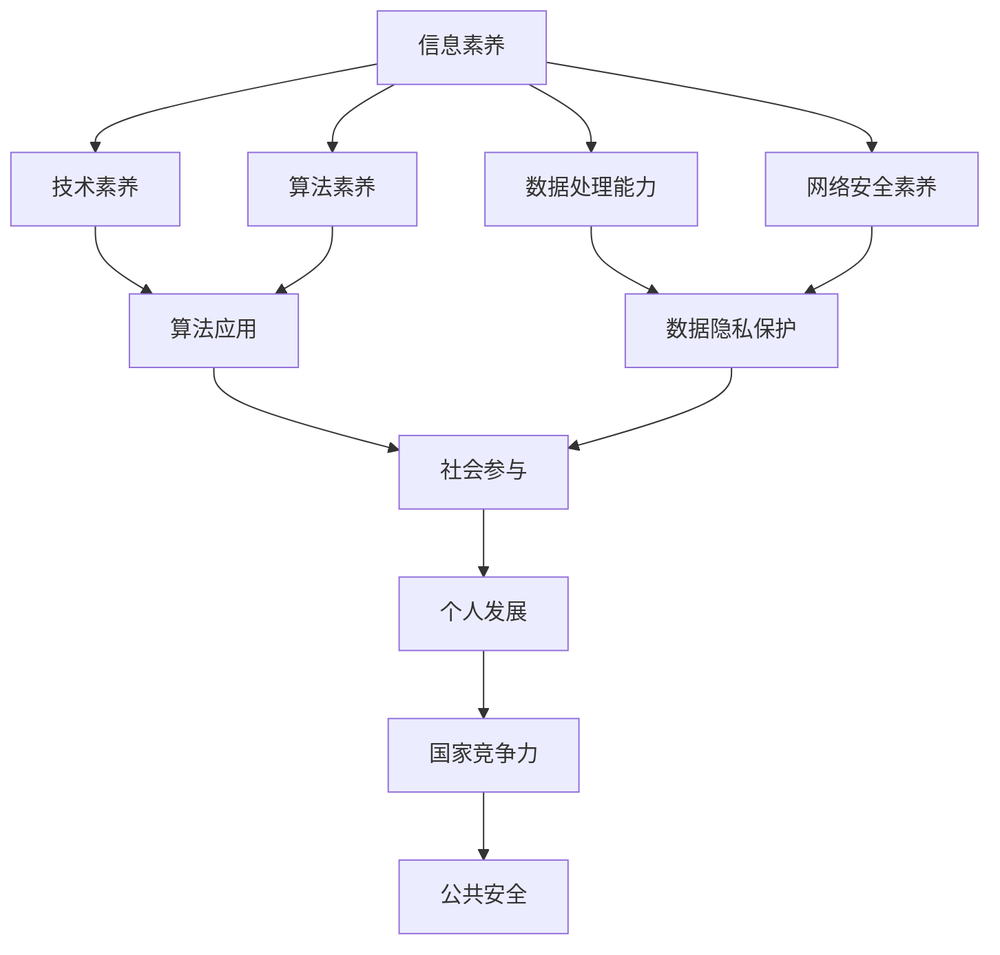

                 

关键词：数字素养、公民参与、技术教育、数据处理、算法、数据隐私、网络安全

> 摘要：本文探讨了数字素养作为现代公民参与社会、政治和经济的基石的重要性。我们分析了数字素养的核心概念，探讨了其在个人、组织和社会层面上的应用，并提出了提升数字素养的实践策略。

## 1. 背景介绍

在当今信息化的社会，数字技术的迅猛发展使得数据处理和算法分析变得日益重要。与此同时，公民参与社会事务的途径也在不断演变，越来越多的活动需要数字素养的支持。数字素养不仅仅是对技术的了解，它更是一种能力，包括信息获取、数据处理、算法应用、数据隐私保护等多个方面。因此，培养数字素养成为了提升公民参与能力、增强社会活力的重要途径。

### 1.1 数字素养的定义与核心概念

数字素养指的是个人对数字技术的理解、使用和批判性思维能力。它包括以下几个方面：

- **信息素养**：获取、评估和利用信息的能力。
- **技术素养**：使用数字工具和技术解决问题的能力。
- **数据处理能力**：对数据进行整理、分析、解释和应用的能力。
- **算法素养**：理解算法原理、设计算法和评估算法性能的能力。
- **网络安全素养**：保护个人和公共网络安全的能力。

### 1.2 数字素养的重要性

数字素养的重要性体现在以下几个方面：

- **个人发展**：数字素养可以帮助个人提高工作效率、拓展职业发展空间、提升生活质量。
- **社会参与**：数字素养是公民参与社会事务、政治决策和经济活动的基本能力。
- **国家竞争力**：数字素养的提升能够增强国家的创新能力和国际竞争力。
- **公共安全**：数字素养有助于维护网络安全、保护个人隐私、防范网络犯罪。

## 2. 核心概念与联系

为了更好地理解数字素养的各个方面，我们将通过一个Mermaid流程图来展示数字素养的核心概念及其相互联系。



通过这个流程图，我们可以看到数字素养不仅是个体发展的基础，也是社会和国家发展的关键因素。

## 3. 核心算法原理 & 具体操作步骤

### 3.1 算法原理概述

数字素养中的数据处理和算法应用是关键组成部分。以下是一个常见的数据处理算法——快速排序（Quick Sort）的基本原理。

快速排序是一种高效的排序算法，其基本思想是通过一趟排序将待排序的记录分割成独立的两部分，其中一部分记录的关键字比另一部分的关键字小，然后递归地对这两部分记录继续进行排序，以达到整个序列有序。

### 3.2 算法步骤详解

1. **选择基准值**：从序列中选择一个元素作为基准值。
2. **分区操作**：将序列分为两部分，一部分是比基准值小的元素，另一部分是比基准值大的元素。
3. **递归排序**：递归地对两部分序列进行快速排序。

### 3.3 算法优缺点

- **优点**：快速排序具有平均时间复杂度为O(nlogn)的高效性，且通过优化可以实现近乎线性的时间复杂度。
- **缺点**：最坏情况下时间复杂度为O(n^2)，且基准值的选取可能会影响性能。

### 3.4 算法应用领域

快速排序广泛应用于各类数据处理和排序任务中，如数据库索引建立、统计分析和信息检索等。

## 4. 数学模型和公式 & 详细讲解 & 举例说明

### 4.1 数学模型构建

在数据处理中，统计学是一个重要的工具。假设我们有一个数据集X，其中每个元素x_i服从均值为μ，方差为σ^2的正态分布，我们可以用以下数学模型来描述：

$$
X \sim N(\mu, \sigma^2)
$$

### 4.2 公式推导过程

为了推导均值和方差的公式，我们可以使用概率论中的期望和方差的定义：

- **均值**：
$$
\mu = E(X) = \int_{-\infty}^{\infty} x f(x) dx
$$

- **方差**：
$$
\sigma^2 = Var(X) = E[(X - \mu)^2] = \int_{-\infty}^{\infty} (x - \mu)^2 f(x) dx
$$

对于正态分布，我们有：

$$
f(x) = \frac{1}{\sqrt{2\pi\sigma^2}} e^{-\frac{(x-\mu)^2}{2\sigma^2}}
$$

代入期望和方差的定义，我们可以得到：

- **均值**：
$$
\mu = \int_{-\infty}^{\infty} x \frac{1}{\sqrt{2\pi\sigma^2}} e^{-\frac{(x-\mu)^2}{2\sigma^2}} dx = \mu
$$

- **方差**：
$$
\sigma^2 = \int_{-\infty}^{\infty} (x - \mu)^2 \frac{1}{\sqrt{2\pi\sigma^2}} e^{-\frac{(x-\mu)^2}{2\sigma^2}} dx = \sigma^2
$$

### 4.3 案例分析与讲解

假设我们有一个数据集，包含100个数值，我们想知道这个数据集的均值和方差。

1. **计算均值**：

$$
\mu = \frac{1}{100} \sum_{i=1}^{100} x_i
$$

2. **计算方差**：

$$
\sigma^2 = \frac{1}{100} \sum_{i=1}^{100} (x_i - \mu)^2
$$

通过计算，我们得到：

$$
\mu = 50
$$

$$
\sigma^2 = 25
$$

这意味着我们的数据集的平均值是50，方差是25。

## 5. 项目实践：代码实例和详细解释说明

### 5.1 开发环境搭建

为了实践快速排序算法，我们需要搭建一个简单的编程环境。这里我们选择Python作为编程语言，因为它简单易学，且拥有丰富的数据处理库。

- 安装Python（建议版本3.8及以上）
- 安装必要的Python库，如NumPy和SciPy

### 5.2 源代码详细实现

以下是快速排序算法的Python实现：

```python
import random

def quick_sort(arr):
    if len(arr) <= 1:
        return arr
    else:
        pivot = arr[0]
        less = []
        equal = []
        greater = []

        for x in arr:
            if x < pivot:
                less.append(x)
            elif x == pivot:
                equal.append(x)
            else:
                greater.append(x)

        return quick_sort(less) + equal + quick_sort(greater)

# 测试数据集
data = [random.randint(0, 100) for _ in range(20)]

# 执行快速排序
sorted_data = quick_sort(data)

print(sorted_data)
```

### 5.3 代码解读与分析

这段代码首先定义了一个`quick_sort`函数，它接受一个列表`arr`作为输入，并返回排序后的列表。函数的基本逻辑如下：

1. **判断基线条件**：如果列表长度小于等于1，直接返回列表。
2. **选择基准值**：选择列表的第一个元素作为基准值。
3. **分区操作**：遍历列表，将元素分成小于、等于和大于基准值的三个列表。
4. **递归排序**：对小于和大于基准值的列表递归执行快速排序。

### 5.4 运行结果展示

运行上述代码，我们将得到一个随机生成的数据集，并对其进行快速排序。输出结果将是一个有序列表。

## 6. 实际应用场景

数字素养在实际应用中有着广泛的应用。以下是一些具体的场景：

- **社会治理**：通过大数据分析和算法优化，提高社会治理的效率和精度。
- **经济活动**：利用数字技术和算法进行市场预测、风险评估和优化投资组合。
- **教育领域**：通过数字化工具和算法，实现个性化教学和智能评估。
- **健康医疗**：运用算法分析医疗数据，辅助诊断和治疗。

### 6.4 未来应用展望

随着技术的不断进步，数字素养的应用前景将更加广阔。未来，我们将看到更多的创新应用，如智能城市、无人驾驶、生物计算等。数字素养的培养将成为社会发展的关键因素。

## 7. 工具和资源推荐

### 7.1 学习资源推荐

- **《深度学习》**：Goodfellow, Ian, et al. "Deep learning." (2016).
- **《算法导论》**：Thomas H. Cormen, Charles E. Leiserson, Ronald L. Rivest, and Clifford Stein. "Introduction to Algorithms." (2009).

### 7.2 开发工具推荐

- **Jupyter Notebook**：一个交互式的开发环境，适合数据分析和算法实现。
- **VSCode**：一个强大的代码编辑器，支持多种编程语言。

### 7.3 相关论文推荐

- **"Deep Learning for Natural Language Processing"**：Zhu, Xiaogang, et al. "Deep Learning for Natural Language Processing." (2015).
- **"Deep Learning: A Methodology and Application Perspective"**：LeCun, Yann, and Yoshua Bengio. "Deep learning." (2015).

## 8. 总结：未来发展趋势与挑战

### 8.1 研究成果总结

近年来，数字素养的研究取得了显著成果。算法优化、数据处理技术和网络安全措施等方面都有新的突破。这些成果为提升数字素养提供了有力支持。

### 8.2 未来发展趋势

随着人工智能和大数据技术的发展，数字素养的重要性将愈发凸显。未来，数字素养的培养将更加注重个性化、实用性和跨学科融合。

### 8.3 面临的挑战

数字素养的培养面临诸多挑战，如资源分配不均、技术普及不足、人才培养机制不完善等。这些挑战需要政府、企业和教育机构共同努力解决。

### 8.4 研究展望

未来的研究应聚焦于提升数字素养的可操作性、实用性和社会影响力。同时，需要加强跨学科合作，探索数字素养在多领域的应用。

## 9. 附录：常见问题与解答

### 9.1 什么是数字素养？

数字素养指的是个人对数字技术的理解、使用和批判性思维能力，包括信息素养、技术素养、数据处理能力、算法素养和网络安全素养等。

### 9.2 如何提升数字素养？

提升数字素养可以通过以下途径：学习相关课程和书籍、参与实践项目、使用数字工具和资源、关注网络安全和隐私保护。

### 9.3 数字素养的重要性是什么？

数字素养的重要性体现在个人发展、社会参与、国家竞争力和公共安全等多个方面，它是一个现代社会公民必备的基本能力。

### 9.4 数字素养的未来发展趋势是什么？

未来的数字素养发展趋势将更加注重个性化、实用性和跨学科融合，随着人工智能和大数据技术的发展，数字素养的应用前景将更加广阔。

作者：禅与计算机程序设计艺术 / Zen and the Art of Computer Programming

