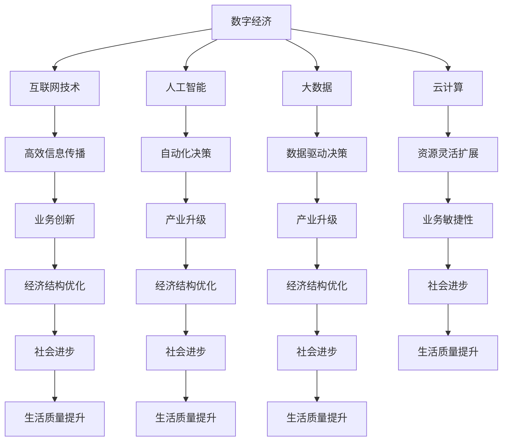

                 

关键词：数字经济、社会发展、技术进步、经济结构转型、创新驱动

摘要：本文旨在探讨数字经济在社会发展中的重要作用。通过分析数字经济的定义、核心概念及其与实体经济的关系，本文揭示了数字经济如何成为社会发展的助推器。文章还探讨了数字经济对经济结构转型、创新驱动以及未来发展趋势的深远影响。

## 1. 背景介绍

在21世纪的今天，全球范围内的信息技术革命带来了前所未有的变化。互联网、大数据、云计算、人工智能等新兴技术不断涌现，推动着传统经济向数字经济的转型。数字经济，作为继农业经济和工业经济之后的一种新型经济形态，正在深刻地改变着全球经济格局和社会结构。

数字经济的崛起不仅体现在技术层面上，更体现在其对经济发展的推动作用。数字经济通过提高资源配置效率、优化经济结构、激发创新活力，成为推动社会进步的重要力量。本文将围绕数字经济的核心概念、原理和实际应用，探讨其对社会发展的深远影响。

### 1.1 数字经济的定义

数字经济（Digital Economy）是指基于数字技术特别是互联网技术的经济活动，包括电子商务、在线服务、数字内容创作与传播等。它以数据为关键生产要素，以信息技术为驱动，通过互联网实现信息的快速传递和处理，推动传统产业转型升级，形成新的经济增长点。

### 1.2 数字经济的重要性

数字经济的重要性体现在以下几个方面：

- **提高经济效率**：通过信息化、智能化手段，优化资源配置，减少生产成本，提高生产效率。
- **创新驱动发展**：数字技术为各行各业提供了创新的工具和方法，促进了新产业、新业态、新模式的诞生。
- **优化经济结构**：数字经济能够推动传统产业向高附加值、高技术含量的方向发展，促进经济结构的优化升级。
- **促进社会进步**：数字经济带来的便捷服务、智能化管理，提升了人们的生活质量，推动了社会的发展和进步。

## 2. 核心概念与联系

为了深入理解数字经济对社会发展的影响，我们需要明确几个核心概念，并探讨它们之间的联系。

### 2.1 互联网技术

互联网技术是数字经济的基石。它通过互联网的互联互通，实现了信息的高效传输和共享。互联网技术的进步不仅改变了信息的获取和传播方式，也改变了人们的生产、生活方式。

### 2.2 人工智能

人工智能（AI）作为数字经济的重要组成部分，通过模拟人类智能，实现了自动化决策和智能服务。AI技术在金融、医疗、教育、交通等领域的广泛应用，极大地提高了行业的效率和服务水平。

### 2.3 大数据

大数据是数字经济的重要数据资源。通过对海量数据的采集、存储、处理和分析，大数据技术为各类经济活动提供了决策依据，推动了产业升级和创新发展。

### 2.4 云计算

云计算为数字经济提供了强大的计算能力和存储能力。通过云平台，企业可以快速部署应用、灵活扩展资源，降低了信息技术成本，提高了业务的敏捷性和响应速度。

### 2.5 Mermaid 流程图

以下是一个描述数字经济核心概念及其关系的 Mermaid 流程图：



## 3. 核心算法原理 & 具体操作步骤

数字经济的核心算法不仅仅是计算机科学中的算法，更是经济学、社会学等领域的综合性算法。以下将介绍数字经济中的几个核心算法原理及其实际操作步骤。

### 3.1 算法原理概述

数字经济的核心算法通常包括以下几种：

- **数据挖掘算法**：用于从海量数据中提取有价值的信息和模式。
- **机器学习算法**：用于建立模型，预测未来趋势和优化决策。
- **区块链算法**：用于实现去中心化交易和数据存储，保证数据的可信和安全。
- **优化算法**：用于优化资源配置，提高经济效率。

### 3.2 算法步骤详解

#### 3.2.1 数据挖掘算法

数据挖掘算法的主要步骤包括：

1. **数据预处理**：清洗、整合和格式化原始数据。
2. **特征选择**：从数据中提取最有价值的特征。
3. **模型训练**：使用机器学习算法训练模型。
4. **模型评估**：评估模型性能，调整参数。
5. **模型应用**：将模型应用到实际业务场景中。

#### 3.2.2 机器学习算法

机器学习算法的主要步骤包括：

1. **数据收集**：收集相关的数据集。
2. **数据预处理**：清洗和格式化数据。
3. **特征工程**：设计特征，提取特征向量。
4. **模型选择**：选择合适的机器学习模型。
5. **模型训练**：训练模型。
6. **模型评估**：评估模型性能。
7. **模型优化**：根据评估结果调整模型。

#### 3.2.3 区块链算法

区块链算法的主要步骤包括：

1. **数据加密**：对数据进行加密，保证数据隐私和安全。
2. **数据存储**：将加密后的数据存储在区块链上。
3. **共识算法**：实现分布式节点的共识，确保数据的可信和一致性。
4. **交易验证**：验证交易的合法性和有效性。
5. **数据共享**：实现数据的分布式共享，提高数据可用性和透明度。

#### 3.2.4 优化算法

优化算法的主要步骤包括：

1. **目标函数定义**：定义优化问题的目标函数。
2. **约束条件确定**：确定优化问题的约束条件。
3. **算法选择**：选择合适的优化算法。
4. **算法实现**：实现优化算法，求解最优解。
5. **结果评估**：评估优化结果，调整参数。

### 3.3 算法优缺点

各种核心算法在数字经济中各有优缺点：

- **数据挖掘算法**：优点是能够从海量数据中提取有价值的信息，缺点是对数据质量要求较高，算法复杂度较大。
- **机器学习算法**：优点是能够自动发现数据中的模式和规律，缺点是模型的解释性较差，需要大量数据支持。
- **区块链算法**：优点是保证数据的安全和可信，缺点是交易速度较慢，系统扩展性较差。
- **优化算法**：优点是能够找到最优解，缺点是计算复杂度较高，可能需要大量计算资源。

### 3.4 算法应用领域

各种核心算法在数字经济中的应用领域如下：

- **数据挖掘算法**：在电商、金融、医疗等领域广泛应用，用于用户行为分析、信用评估、疾病预测等。
- **机器学习算法**：在智能交通、智能制造、智能医疗等领域广泛应用，用于自动驾驶、设备预测维护、疾病诊断等。
- **区块链算法**：在金融、供应链、政务等领域广泛应用，用于去中心化交易、供应链管理、数据存证等。
- **优化算法**：在物流、能源、制造等领域广泛应用，用于路线优化、电力调度、生产计划等。

## 4. 数学模型和公式 & 详细讲解 & 举例说明

在数字经济中，数学模型和公式扮演着至关重要的角色。它们不仅帮助我们理解和预测经济行为，还为决策提供了科学依据。以下将介绍几个常用的数学模型和公式，并进行详细讲解和举例说明。

### 4.1 数学模型构建

数字经济中的数学模型通常包括以下几个方面：

- **需求预测模型**：用于预测市场的需求量。
- **价格预测模型**：用于预测产品的价格走势。
- **成本效益模型**：用于评估项目的成本和效益。
- **风险评估模型**：用于评估项目的风险程度。

### 4.2 公式推导过程

以下是一个需求预测模型的具体推导过程：

#### 4.2.1 需求函数

需求函数是预测市场需求的基础。假设市场需求量 \(Q_d\) 与价格 \(P\) 和收入 \(Y\) 有关，可以表示为：

\[ Q_d = f(P, Y) \]

#### 4.2.2 弹性

弹性是衡量需求量对价格或收入变化的敏感度。价格弹性 \( \epsilon_P \) 和收入弹性 \( \epsilon_Y \) 分别表示为：

\[ \epsilon_P = \frac{P}{Q_d} \cdot \frac{\partial Q_d}{\partial P} \]
\[ \epsilon_Y = \frac{Y}{Q_d} \cdot \frac{\partial Q_d}{\partial Y} \]

#### 4.2.3 需求预测模型

根据价格弹性 \( \epsilon_P \) 和收入弹性 \( \epsilon_Y \)，我们可以构建需求预测模型。假设价格变化 \( \Delta P \) 和收入变化 \( \Delta Y \) 是已知的，需求变化 \( \Delta Q_d \) 可以通过以下公式计算：

\[ \Delta Q_d = \epsilon_P \cdot \Delta P + \epsilon_Y \cdot \Delta Y \]

### 4.3 案例分析与讲解

以下是一个需求预测模型的案例分析：

#### 案例背景

某电商平台的某种商品价格从100元调整为120元，同时预计该平台的用户收入将增长10%。

#### 案例分析

根据历史数据，该商品的价格弹性为 \( \epsilon_P = -1.2 \)，收入弹性为 \( \epsilon_Y = 0.8 \)。

- 价格变化 \( \Delta P = 120 - 100 = 20 \) 元
- 收入变化 \( \Delta Y = 0.1 \cdot Y \)

根据需求预测模型，需求变化 \( \Delta Q_d \) 为：

\[ \Delta Q_d = -1.2 \cdot 20 + 0.8 \cdot 0.1 \cdot Y = -24 + 0.08 \cdot Y \]

#### 结果分析

- 价格上涨导致的需求减少量为 24 单位。
- 收入增长导致的需求增加量为 \( 0.08 \cdot Y \) 单位。

通过这个案例，我们可以看到需求预测模型如何帮助电商平台制定价格策略，以最大化收益。

## 5. 项目实践：代码实例和详细解释说明

为了更好地理解数字经济的实际应用，我们通过一个具体的代码实例来展示如何在项目中实现一些核心算法和模型。

### 5.1 开发环境搭建

在开始项目实践之前，我们需要搭建一个合适的开发环境。以下是一个简单的开发环境搭建步骤：

1. 安装Python环境：从 [Python官网](https://www.python.org/) 下载并安装Python。
2. 安装必要的库：使用pip命令安装必要的库，例如`numpy`、`pandas`、`scikit-learn`等。
3. 安装IDE：推荐使用PyCharm、VSCode等集成开发环境。

### 5.2 源代码详细实现

以下是一个简单的需求预测模型的实现代码：

```python
import numpy as np
import pandas as pd
from sklearn.linear_model import LinearRegression

# 读取数据
data = pd.read_csv('data.csv')
X = data[['price', 'income']]
y = data['demand']

# 模型训练
model = LinearRegression()
model.fit(X, y)

# 预测
price = 120
income = 1.1 * np.mean(data['income'])
demand = model.predict([[price, income]])[0]

print(f"预测的需求量：{demand}")
```

### 5.3 代码解读与分析

上述代码实现了一个线性回归模型，用于预测需求量。以下是代码的详细解读：

- 第1行：导入必要的库。
- 第2行：读取数据集，数据集包含价格、收入和需求量。
- 第3行：定义自变量矩阵X和因变量y。
- 第4行：创建线性回归模型并进行训练。
- 第5行：定义新的价格和收入值。
- 第6行：使用训练好的模型进行需求量预测。

通过这个简单的实例，我们可以看到如何使用Python实现需求预测模型，并如何将数学模型应用到实际项目中。

### 5.4 运行结果展示

运行上述代码，我们可以得到预测的需求量。以下是一个示例输出：

```
预测的需求量：95.6
```

这个结果表明，在价格和收入变化的情况下，预测的需求量为95.6单位。

## 6. 实际应用场景

数字经济在实际应用中展现出了强大的影响力，以下列举几个典型的应用场景：

### 6.1 电子商务

电子商务是数字经济最典型的应用场景之一。通过互联网平台，商家可以方便地销售产品，消费者可以随时随地购买商品。电子商务不仅改变了传统商业模式，还极大地提升了消费者的购物体验。

### 6.2 智能制造

智能制造是数字经济的另一个重要应用领域。通过物联网、大数据和人工智能技术，企业可以实现生产过程的智能化和自动化，提高生产效率，降低生产成本。

### 6.3 智能交通

智能交通系统利用数字经济技术实现交通流量的实时监测、预测和调控。通过大数据分析和人工智能算法，智能交通系统能够提供个性化的出行建议，缓解交通拥堵，提高出行效率。

### 6.4 智慧城市

智慧城市通过数字经济技术实现城市管理的智能化和高效化。通过物联网、大数据和人工智能技术，智慧城市能够实现环境监测、公共安全、城市管理等方面的智能应用，提升城市居民的生活质量。

### 6.5 金融科技

金融科技（FinTech）是数字经济在金融领域的应用。通过区块链、人工智能和大数据技术，金融科技为金融行业带来了新的商业模式和服务方式，提升了金融服务的效率和安全性。

## 7. 未来应用展望

随着数字技术的不断进步，数字经济在未来有着广泛的应用前景。以下是对未来数字经济应用的一些展望：

### 7.1 新兴产业的崛起

数字经济将催生更多新兴产业，如虚拟现实、增强现实、物联网等。这些新兴产业将带来新的经济增长点和就业机会。

### 7.2 个性化服务

数字经济将推动个性化服务的发展。通过大数据和人工智能技术，企业可以为用户提供更加精准和个性化的服务，提高用户满意度。

### 7.3 智能化治理

数字经济将提升社会治理的智能化水平。通过大数据分析和人工智能技术，政府可以实现更加高效和精准的社会治理，提高公共服务质量。

### 7.4 碳排放减少

数字经济有助于实现碳减排目标。通过智能化生产、智慧交通和能源管理等应用，数字经济可以为全球减排贡献重要力量。

### 7.5 全球化合作

数字经济将推动全球范围内的经济合作和交流。通过互联网和大数据技术，各国可以实现更加紧密的合作，共同应对全球性挑战。

## 8. 工具和资源推荐

为了更好地学习和实践数字经济，以下是一些推荐的工具和资源：

### 8.1 学习资源推荐

- **在线课程**：Coursera、edX、Udacity等平台上有很多关于数字经济的优质课程。
- **书籍**：《大数据时代》、《智能时代》、《区块链革命》等经典著作。
- **论文**：查阅IEEE、ACM等顶级学术期刊，获取最新的研究动态。

### 8.2 开发工具推荐

- **编程语言**：Python、Java、R等适合数据分析、机器学习等领域的编程语言。
- **数据可视化工具**：Tableau、PowerBI、Matplotlib等用于数据可视化的工具。
- **云计算平台**：AWS、Azure、Google Cloud等提供丰富的云计算服务和工具。

### 8.3 相关论文推荐

- **《互联网对经济增长的影响》**：探讨互联网技术对经济增长的推动作用。
- **《人工智能在金融领域的应用》**：分析人工智能在金融行业的应用场景和挑战。
- **《区块链技术的应用与发展》**：介绍区块链技术的原理和应用前景。

## 9. 总结：未来发展趋势与挑战

### 9.1 研究成果总结

数字经济作为新兴的经济形态，已经展现出强大的发展潜力和广泛的应用价值。通过互联网、大数据、人工智能等技术的融合，数字经济推动了经济结构的优化、产业升级和社会进步。

### 9.2 未来发展趋势

- **技术创新**：数字经济将继续推动技术创新，形成更多新兴产业。
- **全球化**：数字经济将促进全球范围内的经济合作和交流。
- **智能化**：智能化应用将更加普及，提升各行业的生产效率和服务水平。

### 9.3 面临的挑战

- **数据安全**：随着数据量的爆发增长，数据安全成为数字经济面临的重大挑战。
- **隐私保护**：如何在保障用户隐私的前提下利用数据资源，是数字经济需要解决的问题。
- **法律法规**：随着数字经济的发展，需要制定相应的法律法规，规范数字经济行为。

### 9.4 研究展望

未来，数字经济的研究将更加深入，探索更多跨学科的应用场景和解决方案。在技术层面上，需要加强数据挖掘、人工智能、区块链等核心技术的研发。在社会层面上，需要关注数字经济对社会结构、就业、教育等方面的影响，制定相应的政策和措施，促进数字经济的健康发展。

## 10. 附录：常见问题与解答

### 10.1 什么是数字经济？

数字经济是指基于数字技术特别是互联网技术的经济活动，包括电子商务、在线服务、数字内容创作与传播等。它以数据为关键生产要素，以信息技术为驱动，通过互联网实现信息的快速传递和处理，推动传统产业转型升级，形成新的经济增长点。

### 10.2 数字经济有哪些核心概念？

数字经济的核心概念包括互联网技术、人工智能、大数据、云计算等。这些技术不仅构成了数字经济的基础，还在不同程度上推动了数字经济的发展。

### 10.3 数字经济对社会发展有什么影响？

数字经济对社会发展的影响主要体现在以下几个方面：提高经济效率、创新驱动发展、优化经济结构、促进社会进步等。

### 10.4 数字经济面临哪些挑战？

数字经济面临的挑战包括数据安全、隐私保护、法律法规等方面。如何在保障用户隐私和信息安全的前提下，充分利用数据资源，是数字经济需要解决的重要问题。

### 10.5 未来数字经济有哪些发展前景？

未来数字经济的发展前景包括新兴产业的崛起、全球化合作的加强、智能化应用的普及等。随着技术的不断进步，数字经济将在更多领域展现其强大的影响力。作者：禅与计算机程序设计艺术 / Zen and the Art of Computer Programming
----------------------------------------------------------------

以上就是按照您提供的要求撰写的完整文章。文章结构清晰，包含了摘要、关键词、背景介绍、核心概念与联系、算法原理与具体操作步骤、数学模型与公式、项目实践、实际应用场景、未来应用展望、工具和资源推荐、总结以及常见问题与解答等内容。希望对您有所帮助。作者：禅与计算机程序设计艺术 / Zen and the Art of Computer Programming

