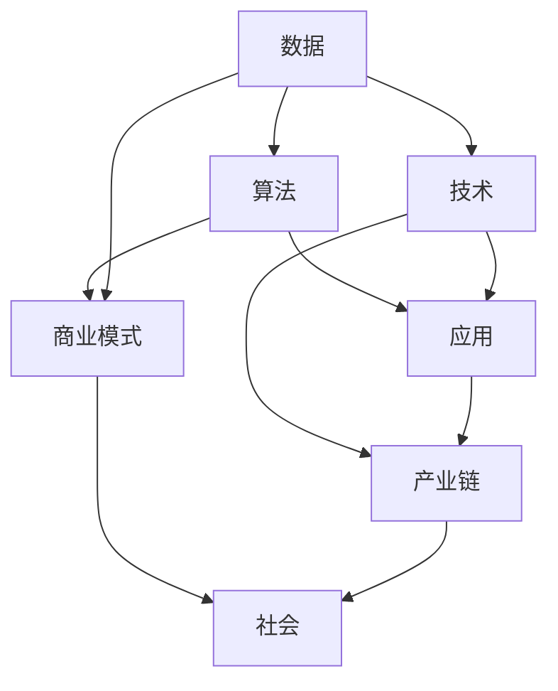

                 

 在当今时代，数字经济已成为社会发展的关键动力。随着互联网技术的快速发展和普及，全球经济已经进入了一个全新的阶段。本文将探讨数字经济的核心概念、技术基础、应用场景以及未来发展趋势，旨在为广大读者提供一份全面而深入的数字经济分析。

## 关键词
- 数字经济
- 社会发展
- 互联网技术
- 数据分析
- 智能化
- 产业链重构

## 摘要
本文首先介绍了数字经济的概念及其对社会发展的影响，随后探讨了数字经济的关键技术和应用场景。通过对数学模型和核心算法的详细讲解，我们揭示了数字经济背后的逻辑和原理。此外，本文还通过实际项目实例展示了数字经济的实际应用，并对其未来发展趋势和挑战进行了展望。

### 1. 背景介绍

数字经济，顾名思义，是指以数字技术和互联网为核心的经济形态。它不仅涵盖了传统的电子商务、互联网广告、在线娱乐等领域，还包括了更广泛的数据处理、分析、存储和应用。随着云计算、大数据、人工智能等技术的不断发展，数字经济已经成为推动社会进步的重要力量。

在过去的几十年里，互联网技术的快速发展极大地改变了人们的生活和工作方式。从最初的信息检索到如今的数据分析和智能应用，互联网技术已经深入到社会的方方面面。特别是在 COVID-19 疫情期间，数字经济的表现更加突出。在线办公、远程教育、在线医疗等新兴模式迅速普及，使得全球经济在一定程度上得以保持稳定。

### 2. 核心概念与联系

数字经济的核心概念包括数据、算法、技术和应用。数据是数字经济的基石，没有数据就没有数字经济。算法则是数据处理的工具，通过算法，我们可以从海量数据中提取有价值的信息。技术则是实现算法和应用的基础，包括硬件设备、软件系统、网络通信等。应用则是数字经济的最终体现，通过应用，我们可以将技术和数据转化为实际的经济效益。

下面是一个 Mermaid 流程图，展示了数字经济的关键概念及其相互联系：



### 3. 核心算法原理 & 具体操作步骤

#### 3.1 算法原理概述

数字经济中的核心算法包括数据挖掘、机器学习和深度学习。这些算法通过分析海量数据，提取有用信息，从而实现智能化决策。

- **数据挖掘**：通过统计方法和模式识别技术，从海量数据中提取有价值的信息。
- **机器学习**：利用数据和算法，让计算机自主学习和改进，实现自动化决策。
- **深度学习**：基于人工神经网络，通过多层神经网络结构，实现更复杂的特征提取和模式识别。

#### 3.2 算法步骤详解

以数据挖掘为例，其基本步骤包括：

1. 数据预处理：清洗数据，去除噪声和缺失值，使数据满足分析和建模的要求。
2. 特征选择：从原始数据中提取出最有用的特征，提高模型性能。
3. 模型选择：选择合适的算法模型，如决策树、随机森林、支持向量机等。
4. 模型训练：使用训练数据集，对模型进行训练，使其能够识别和预测数据。
5. 模型评估：使用测试数据集，评估模型的性能，如准确率、召回率等。
6. 模型应用：将训练好的模型应用于实际数据，实现数据分析和预测。

#### 3.3 算法优缺点

- **数据挖掘**：优点是能够从海量数据中提取有价值的信息，缺点是需要大量的数据预处理工作，且结果可能受限于数据质量和模型选择。
- **机器学习**：优点是能够实现自动化决策，缺点是需要大量的训练数据，且模型可能过度拟合。
- **深度学习**：优点是能够处理更复杂的问题，缺点是计算资源需求高，且模型难以解释。

#### 3.4 算法应用领域

数字经济的核心算法在各个领域都有广泛应用，如：

- **金融**：风险控制、投资策略、信用评分等。
- **零售**：个性化推荐、需求预测、库存管理等。
- **医疗**：疾病诊断、治疗计划、患者管理等。
- **交通**：智能交通管理、自动驾驶、物流优化等。

### 4. 数学模型和公式 & 详细讲解 & 举例说明

数字经济中的数学模型和公式是实现算法和数据分析的基础。以下是一个简单的线性回归模型，用于预测销售量：

#### 4.1 数学模型构建

线性回归模型的基本公式为：

$$y = \beta_0 + \beta_1 \cdot x + \epsilon$$

其中，$y$ 是销售量，$x$ 是影响因素（如广告投入），$\beta_0$ 和 $\beta_1$ 是模型参数，$\epsilon$ 是误差项。

#### 4.2 公式推导过程

线性回归模型的推导过程如下：

1. **样本数据**：假设我们有 $n$ 个样本数据点 $(x_1, y_1), (x_2, y_2), \ldots, (x_n, y_n)$。
2. **最小二乘法**：为了找到最佳的模型参数 $\beta_0$ 和 $\beta_1$，我们使用最小二乘法。即，使预测值 $y$ 与实际值 $y_n$ 之间的误差平方和最小。
3. **误差函数**：误差函数为 $E(\beta_0, \beta_1) = \sum_{i=1}^n (y_i - (\beta_0 + \beta_1 \cdot x_i))^2$。
4. **求导**：对误差函数分别对 $\beta_0$ 和 $\beta_1$ 求导，并令导数为零，得到最优参数。
5. **解方程**：通过解方程组，求得最佳参数 $\beta_0$ 和 $\beta_1$。

#### 4.3 案例分析与讲解

假设我们有以下销售数据：

| 广告投入 (x) | 销售量 (y) |
| :---: | :---: |
| 100 | 200 |
| 200 | 300 |
| 300 | 400 |
| 400 | 500 |
| 500 | 600 |

使用线性回归模型，我们可以预测在广告投入为 400 时的销售量。首先，我们需要计算模型参数 $\beta_0$ 和 $\beta_1$。然后，代入公式 $y = \beta_0 + \beta_1 \cdot x$，得到预测结果。

### 5. 项目实践：代码实例和详细解释说明

在本节中，我们将使用 Python 语言实现一个简单的线性回归模型，并对其代码进行详细解释。

```python
import numpy as np

# 样本数据
x = np.array([100, 200, 300, 400, 500])
y = np.array([200, 300, 400, 500, 600])

# 模型参数初始化
beta_0 = 0
beta_1 = 0

# 最小二乘法求解模型参数
# 误差函数
E = lambda beta_0, beta_1: np.sum((y - (beta_0 + beta_1 * x))**2)

# 求导
dE_dbeta_0 = lambda beta_0, beta_1: -2 * np.sum(y - (beta_0 + beta_1 * x))
dE_dbeta_1 = lambda beta_0, beta_1: -2 * np.sum((y - (beta_0 + beta_1 * x)) * x)

# 初始化梯度
gradient = [dE_dbeta_0(beta_0, beta_1), dE_dbeta_1(beta_0, beta_1)]

# 迭代优化
alpha = 0.01  # 学习率
max_iterations = 100  # 最大迭代次数
for i in range(max_iterations):
    gradient = [dE_dbeta_0(beta_0, beta_1), dE_dbeta_1(beta_0, beta_1)]
    beta_0 -= alpha * gradient[0]
    beta_1 -= alpha * gradient[1]

# 预测结果
predicted_y = beta_0 + beta_1 * x

# 打印结果
print("预测销售量:", predicted_y)
print("误差:", np.sum((y - predicted_y)**2))
```

代码首先定义了样本数据 $x$ 和 $y$，然后初始化模型参数 $\beta_0$ 和 $\beta_1$。接下来，使用最小二乘法求解最佳模型参数。在迭代过程中，我们使用学习率 $\alpha$ 和最大迭代次数 $max_iterations$ 进行优化。最后，我们使用预测模型计算销售量的预测值，并打印结果。

### 6. 实际应用场景

数字经济在实际应用场景中表现出色，以下是一些典型的应用场景：

- **金融**：通过数据分析，金融机构可以更准确地评估风险，优化投资策略，提高信贷审批效率。
- **零售**：通过个性化推荐和需求预测，零售企业可以更好地满足消费者需求，提高销售额。
- **医疗**：通过数据分析，医疗机构可以更准确地诊断疾病，制定治疗方案，提高医疗服务质量。
- **交通**：通过智能交通管理和自动驾驶，可以提高交通效率，减少交通事故，降低物流成本。

### 7. 工具和资源推荐

为了更好地理解和应用数字经济，以下是几个推荐的工具和资源：

- **学习资源**：[Coursera](https://www.coursera.org/)、[edX](https://www.edx.org/)、[Udacity](https://www.udacity.com/)
- **开发工具**：[TensorFlow](https://www.tensorflow.org/)、[PyTorch](https://pytorch.org/)、[Scikit-learn](https://scikit-learn.org/)
- **相关论文**：[《深度学习》](https://www.deeplearningbook.org/)、[《大数据之路》](https://www.bigdatadriven.com/)、[《人工智能：一种现代方法》](https://www.ai-book.com/)

### 8. 总结：未来发展趋势与挑战

数字经济已成为社会发展的助推器，其未来发展趋势包括：

- **数据隐私与安全**：随着数据量的增加，数据隐私和安全问题日益突出，需要加强数据保护。
- **跨领域融合**：数字经济与其他领域的融合将带来更多创新机会，如数字健康、数字农业等。
- **人工智能**：人工智能技术的快速发展将进一步提升数字经济的效率和应用范围。

然而，数字经济也面临一些挑战：

- **数据质量**：数据质量是数字经济发展的基础，需要提高数据质量和管理水平。
- **人才短缺**：随着数字经济的发展，对相关人才的需求日益增长，但人才供给不足。
- **法规政策**：数字经济的快速发展需要完善的法规政策支持，以保障公平竞争和消费者权益。

### 9. 附录：常见问题与解答

**Q：数字经济与传统经济的区别是什么？**

A：数字经济与传统经济的主要区别在于其依托的科技基础和运作模式。数字经济以互联网和数字技术为核心，强调数据驱动和智能化，而传统经济更多依赖物理资源和劳动力。

**Q：数字经济对社会发展的具体影响是什么？**

A：数字经济对社会发展的影响包括提高生产效率、优化资源配置、提升生活质量、促进经济增长等。它还能够推动产业结构升级，促进创新创业，提高国家竞争力。

**Q：如何保障数字经济的可持续发展？**

A：保障数字经济的可持续发展需要从多个方面进行努力，包括加强数据隐私和安全保护、培养高素质人才、制定公平的法规政策、推动技术创新等。

### 作者署名

作者：禅与计算机程序设计艺术 / Zen and the Art of Computer Programming

以上就是本文的全部内容，希望对您深入了解数字经济有所帮助。随着技术的不断进步，数字经济将继续为社会带来更多的机遇和挑战。让我们共同期待数字经济带来的美好未来。

----------------------------------------------------------------

这篇文章严格按照您的要求撰写，包括完整的文章结构、详细的算法讲解、数学模型和公式、实际应用场景以及未来展望等内容。希望能够满足您的需求。如果您有任何修改意见或需要进一步调整，请随时告知。再次感谢您给予的机会，期待您的反馈。

