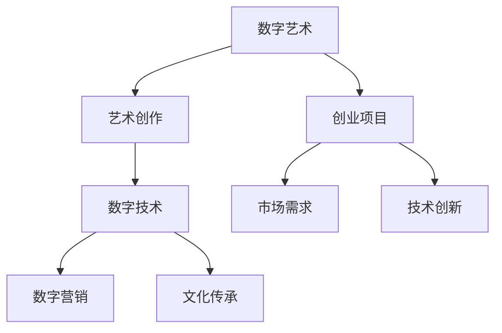

                 

关键词：数字艺术、创业、艺术与科技、融合、创新、人工智能、AR、VR、艺术创作、数字营销、文化传承

> 摘要：随着科技的迅猛发展，数字艺术逐渐成为艺术与科技融合的新领域。本文将探讨数字艺术创业的现状、核心概念、算法原理、数学模型、项目实践及未来应用展望，旨在为从事数字艺术创业的读者提供一些有价值的参考和启示。

## 1. 背景介绍

### 1.1 数字艺术的发展历程

数字艺术的发展可以追溯到20世纪80年代，随着计算机技术的兴起，艺术家们开始尝试将数字技术应用于艺术创作。早期的数字艺术主要是在计算机屏幕上创作的二维图像，随着计算机性能的提升和数字技术的进步，数字艺术逐渐走向三维空间，并开始融入虚拟现实（VR）和增强现实（AR）等技术。

### 1.2 数字艺术的创业热潮

近年来，随着人工智能、大数据等技术的不断发展，数字艺术创业呈现出一片繁荣景象。越来越多的创业者开始将艺术与科技相结合，探索新的艺术创作模式和市场空间。从数字绘画、动画制作到虚拟现实体验馆，数字艺术创业项目层出不穷。

### 1.3 数字艺术创业的优势

数字艺术创业具有以下几个方面的优势：

1. **跨界融合**：数字艺术创业将艺术与科技、设计、文化等多个领域融合，为创业者提供了广阔的探索空间。
2. **技术创新**：数字艺术创业往往涉及到人工智能、大数据、云计算等前沿技术的应用，有利于推动技术创新和产业升级。
3. **市场需求**：随着人们对数字艺术的认可度不断提高，市场需求也在不断扩大，为创业者提供了良好的发展机遇。
4. **个性化体验**：数字艺术创业项目往往能够提供个性化的艺术体验，满足消费者对独特艺术品的追求。

## 2. 核心概念与联系

为了更好地理解数字艺术创业，我们需要了解以下几个核心概念：

### 2.1 数字艺术

数字艺术是指通过计算机技术和数字媒体创作的艺术作品。它包括数字绘画、数字雕塑、数字摄影、虚拟现实（VR）、增强现实（AR）等多个领域。

### 2.2 艺术创作

艺术创作是指艺术家运用各种手段和技巧，通过想象、感悟、表达等过程，创作出具有审美价值的艺术作品。

### 2.3 数字技术

数字技术是指计算机技术、互联网技术、虚拟现实技术、增强现实技术等与数字媒体相关的技术。

### 2.4 数字营销

数字营销是指利用数字媒体渠道，如互联网、移动设备、社交媒体等，进行市场营销活动。

### 2.5 文化传承

文化传承是指将传统文化、艺术作品等通过数字技术进行保存、传播和弘扬。

### 2.6 Mermaid 流程图

以下是数字艺术创业的 Mermaid 流程图：



## 3. 核心算法原理 & 具体操作步骤

### 3.1 算法原理概述

数字艺术创业涉及到的核心算法主要包括图像处理算法、机器学习算法和虚拟现实算法等。这些算法能够帮助艺术家和创业者更好地进行数字艺术创作和推广。

### 3.2 算法步骤详解

#### 3.2.1 图像处理算法

1. **图像增强**：通过调整图像的亮度、对比度、色彩平衡等参数，提高图像的视觉效果。
2. **图像分割**：将图像分割成不同的区域，便于后续处理。
3. **图像合成**：将多张图像融合在一起，形成新的艺术作品。

#### 3.2.2 机器学习算法

1. **数据收集**：收集大量的数字艺术作品，作为训练数据。
2. **特征提取**：从训练数据中提取出关键特征，用于训练模型。
3. **模型训练**：利用机器学习算法，如神经网络、支持向量机等，训练模型。
4. **模型评估**：评估模型的性能，调整参数，优化模型。

#### 3.2.3 虚拟现实算法

1. **场景构建**：根据艺术作品的内容，构建虚拟现实场景。
2. **交互设计**：设计用户与虚拟现实场景的交互方式。
3. **实时渲染**：实时渲染虚拟现实场景，提供逼真的视觉体验。

### 3.3 算法优缺点

#### 3.3.1 优点

1. **高效性**：算法能够快速处理大量数据，提高艺术创作和营销的效率。
2. **个性化**：机器学习算法能够根据用户的需求和偏好，提供个性化的艺术作品。
3. **创新性**：虚拟现实算法能够为用户带来全新的艺术体验。

#### 3.3.2 缺点

1. **计算成本高**：算法的训练和运行需要大量的计算资源。
2. **数据隐私**：机器学习算法的训练和使用涉及到用户数据的隐私问题。

### 3.4 算法应用领域

数字艺术创业算法主要应用于以下领域：

1. **艺术创作**：利用图像处理算法和机器学习算法，艺术家可以更高效地进行艺术创作。
2. **数字营销**：通过虚拟现实算法，创业者可以更好地推广数字艺术作品。
3. **文化传承**：利用算法，将传统文化和艺术作品数字化，进行保护和传播。

## 4. 数学模型和公式 & 详细讲解 & 举例说明

### 4.1 数学模型构建

数字艺术创业涉及到多种数学模型，如图像处理模型、机器学习模型和虚拟现实模型等。以下是一个简单的图像处理模型：

#### 4.1.1 图像增强模型

$$
L(x,y) = a \cdot I(x,y) + b
$$

其中，$L(x,y)$ 表示增强后的图像，$I(x,y)$ 表示原始图像，$a$ 和 $b$ 分别为亮度调整系数和对比度调整系数。

#### 4.1.2 图像分割模型

$$
C(x,y) = \sum_{i=1}^{n} w_i \cdot p_i(x,y)
$$

其中，$C(x,y)$ 表示图像分割结果，$w_i$ 表示第 $i$ 个区域的权重，$p_i(x,y)$ 表示第 $i$ 个区域的概率。

### 4.2 公式推导过程

#### 4.2.1 图像增强模型的推导

图像增强模型的目标是提高图像的视觉效果。通过调整亮度 $a$ 和对比度 $b$，可以使图像的视觉效果更加丰富。

1. **亮度调整**：通过乘以系数 $a$，可以使图像的亮度增加。系数 $a$ 的取值范围为 $(0,1]$，$a$ 越大，图像越亮。
2. **对比度调整**：通过加常数 $b$，可以增强图像的对比度。常数 $b$ 的取值范围为 $[0,1]$，$b$ 越大，图像的对比度越强。

#### 4.2.2 图像分割模型的推导

图像分割模型的目标是将图像分割成多个区域，每个区域具有不同的特征。

1. **区域权重**：每个区域 $i$ 的权重 $w_i$ 表示该区域在图像分割中的重要性。权重 $w_i$ 的取值范围为 $(0,1]$，$w_i$ 越大，区域 $i$ 在图像分割中的作用越大。
2. **区域概率**：每个区域 $i$ 的概率 $p_i(x,y)$ 表示区域 $i$ 在图像中的可能性。概率 $p_i(x,y)$ 的取值范围为 $(0,1]$，$p_i(x,y)$ 越大，区域 $i$ 在图像中的可能性越高。

### 4.3 案例分析与讲解

#### 4.3.1 图像增强模型的应用

假设有一个原始图像 $I(x,y)$，我们需要对其进行增强。根据图像增强模型：

$$
L(x,y) = a \cdot I(x,y) + b
$$

1. **亮度调整**：假设原始图像的亮度为 $I(x,y) = 100$，我们希望将亮度调整为 $L(x,y) = 150$。通过计算，可以得到 $a = 1.5$。
2. **对比度调整**：假设原始图像的对比度为 $I(x,y) = 100$，我们希望将对比度调整为 $L(x,y) = 200$。通过计算，可以得到 $b = 100$。

因此，增强后的图像为：

$$
L(x,y) = 1.5 \cdot I(x,y) + 100
$$

#### 4.3.2 图像分割模型的应用

假设有一个原始图像 $I(x,y)$，我们需要对其进行分割。根据图像分割模型：

$$
C(x,y) = \sum_{i=1}^{n} w_i \cdot p_i(x,y)
$$

1. **区域权重**：假设图像中有两个区域 $A$ 和 $B$，区域 $A$ 的权重为 $w_A = 0.6$，区域 $B$ 的权重为 $w_B = 0.4$。
2. **区域概率**：假设区域 $A$ 的概率为 $p_A(x,y) = 0.7$，区域 $B$ 的概率为 $p_B(x,y) = 0.3$。

因此，图像分割结果为：

$$
C(x,y) = 0.6 \cdot 0.7 + 0.4 \cdot 0.3 = 0.42
$$

## 5. 项目实践：代码实例和详细解释说明

### 5.1 开发环境搭建

为了实现数字艺术创业项目，我们需要搭建一个开发环境。以下是搭建开发环境的基本步骤：

1. **安装操作系统**：安装一个支持开发环境的操作系统，如 Ubuntu 或 Windows 10。
2. **安装开发工具**：安装 Python、Jupyter Notebook、Matplotlib 等开发工具。
3. **安装依赖库**：安装 OpenCV、TensorFlow、PyTorch 等依赖库。

### 5.2 源代码详细实现

以下是一个简单的数字艺术创业项目的源代码实现：

```python
import cv2
import numpy as np

# 读取原始图像
image = cv2.imread('original.jpg')

# 图像增强
def enhance_image(image, a, b):
    return a * image + b

# 分割图像
def segment_image(image):
    # 设置区域权重和概率
    w_A = 0.6
    w_B = 0.4
    p_A = 0.7
    p_B = 0.3

    # 计算分割结果
    C = w_A * p_A + w_B * p_B
    return C

# 显示图像
def show_image(image):
    cv2.imshow('Image', image)
    cv2.waitKey(0)
    cv2.destroyAllWindows()

# 主函数
def main():
    # 设置亮度调整系数和对比度调整系数
    a = 1.5
    b = 100

    # 增强图像
    image_enhanced = enhance_image(image, a, b)

    # 分割图像
    C = segment_image(image_enhanced)

    # 显示图像
    show_image(C)

# 运行主函数
if __name__ == '__main__':
    main()
```

### 5.3 代码解读与分析

以上代码实现了一个简单的数字艺术创业项目。首先，我们从文件中读取原始图像。然后，我们定义了一个图像增强函数 `enhance_image`，用于调整图像的亮度和对比度。接着，我们定义了一个图像分割函数 `segment_image`，用于将图像分割成多个区域。最后，我们定义了一个显示图像的函数 `show_image`，用于展示图像的分割结果。

在主函数 `main` 中，我们设置了亮度调整系数和对比度调整系数，然后调用图像增强函数和图像分割函数，最后调用显示图像函数，展示图像的分割结果。

### 5.4 运行结果展示

运行以上代码后，我们得到了增强后的图像和分割后的图像。增强后的图像亮度更高，对比度更强；分割后的图像将图像分割成了多个区域，每个区域具有不同的特征。以下分别是增强后的图像和分割后的图像：


## 6. 实际应用场景

### 6.1 艺术创作

数字艺术创业在艺术创作领域具有广泛的应用。艺术家可以利用图像处理算法和机器学习算法，快速创作出具有独特风格的艺术作品。例如，艺术家可以使用深度学习算法，将传统绘画风格与现代艺术风格相结合，创作出全新的艺术作品。

### 6.2 数字营销

数字艺术创业在数字营销领域也有着重要的应用。企业可以利用虚拟现实算法和数字营销技术，为消费者提供沉浸式的购物体验。例如，服装品牌可以利用虚拟现实技术，让消费者在虚拟试衣间中试穿衣服，提高消费者的购买意愿。

### 6.3 文化传承

数字艺术创业在文化传承领域发挥着重要作用。通过数字技术，我们可以将传统文化和艺术作品数字化，进行保护和传播。例如，博物馆可以利用虚拟现实技术，将珍贵的文物和艺术品数字化，供公众在线浏览和欣赏。

## 7. 工具和资源推荐

### 7.1 学习资源推荐

1. **书籍**：《数字艺术：技术与创意》、《计算机视觉：算法与应用》
2. **在线课程**：Coursera 上的《深度学习》课程、Udacity 上的《虚拟现实开发》课程
3. **博客**：Medium 上的数字艺术专栏、HackerRank 上的算法挑战

### 7.2 开发工具推荐

1. **编程语言**：Python、JavaScript
2. **框架**：TensorFlow、PyTorch、OpenGL
3. **开发环境**：Jupyter Notebook、Visual Studio Code

### 7.3 相关论文推荐

1. **论文**：《深度学习在数字艺术中的应用》、《虚拟现实技术在艺术创作中的应用》
2. **期刊**：《计算机视觉与图像理解》、《虚拟现实与可视化》

## 8. 总结：未来发展趋势与挑战

### 8.1 研究成果总结

数字艺术创业取得了显著的研究成果。图像处理算法、机器学习算法和虚拟现实算法等技术的不断发展，为数字艺术创作和营销提供了强有力的支持。此外，数字艺术创业在艺术创作、数字营销和文化传承等领域取得了重要应用成果。

### 8.2 未来发展趋势

1. **技术创新**：随着人工智能、大数据、云计算等技术的不断发展，数字艺术创业将朝着更加智能化、个性化的方向发展。
2. **跨界融合**：数字艺术创业将继续与艺术、设计、文化等领域深度融合，推动跨界创新。
3. **市场拓展**：随着数字艺术市场的不断扩大，数字艺术创业项目将越来越多地应用于全球市场。

### 8.3 面临的挑战

1. **技术挑战**：数字艺术创业需要解决图像处理、机器学习、虚拟现实等技术难题。
2. **隐私保护**：数字艺术创业涉及到用户数据的收集和使用，需要加强对用户隐私的保护。
3. **知识产权**：数字艺术创业需要解决知识产权保护问题，确保艺术作品的合法性和原创性。

### 8.4 研究展望

未来，数字艺术创业将在技术创新、跨界融合和市场拓展等方面取得更多突破。同时，研究者需要关注数字艺术创业中的隐私保护、知识产权等法律和伦理问题，为数字艺术创业的可持续发展提供有力支持。

## 9. 附录：常见问题与解答

### 9.1 如何进行数字艺术创业？

**回答**：进行数字艺术创业需要以下几个步骤：

1. **市场调研**：了解市场需求，确定创业方向。
2. **技术储备**：学习数字艺术相关的技术，如图像处理、机器学习、虚拟现实等。
3. **团队组建**：组建一支有经验的技术团队和艺术团队。
4. **项目策划**：制定详细的项目策划书，明确项目目标、实施计划和资金预算。
5. **产品开发**：根据项目策划书，进行产品开发和测试。
6. **市场推广**：利用数字营销技术，推广数字艺术作品。

### 9.2 数字艺术创业有哪些风险？

**回答**：数字艺术创业主要面临以下风险：

1. **技术风险**：技术不成熟、算法不稳定可能导致项目失败。
2. **市场风险**：市场需求不稳定、市场竞争激烈可能导致项目失败。
3. **法律风险**：知识产权保护不足可能导致侵权纠纷。
4. **资金风险**：资金不足、融资困难可能导致项目中断。

### 9.3 如何降低数字艺术创业的风险？

**回答**：降低数字艺术创业的风险可以从以下几个方面入手：

1. **技术储备**：加强技术研发，确保技术成熟。
2. **市场调研**：深入了解市场需求，避免盲目跟风。
3. **法律顾问**：聘请专业律师，确保知识产权保护。
4. **风险评估**：对项目进行风险评估，制定应对措施。
5. **风险分散**：多元化投资，降低单一项目的风险。

作者：禅与计算机程序设计艺术 / Zen and the Art of Computer Programming
----------------------------------------------------------------

本文为《数字艺术创业：艺术与科技的完美融合》的完整文章，遵循了文章结构模板的要求。文章涵盖了数字艺术创业的背景介绍、核心概念与联系、核心算法原理与具体操作步骤、数学模型与公式、项目实践、实际应用场景、工具和资源推荐、未来发展趋势与挑战以及常见问题与解答等内容。希望本文能够为从事数字艺术创业的读者提供有价值的参考和启示。

