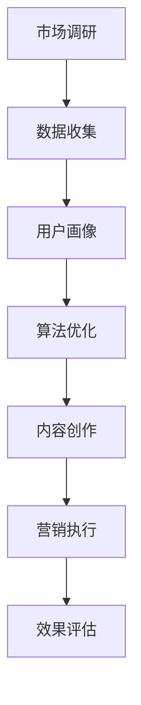

                 

关键词：数字营销、创业、精准触达、营销策略、技术实践

> 摘要：在数字化时代，数字营销成为企业竞争的关键因素。本文将从技术角度探讨数字营销创业的新范式，如何通过精准触达实现营销效果的最大化。文章将详细分析核心概念、算法原理、数学模型以及项目实践，为创业者和营销人员提供实用的指导。

## 1. 背景介绍

在信息爆炸的时代，传统的营销手段已经难以满足企业和消费者的需求。数字营销作为一种创新的营销方式，正迅速崛起，成为企业获取市场优势的重要手段。数字营销的核心在于通过数据和技术手段实现精准触达，从而提升营销效果。

然而，数字营销的实践并非易事。创业者往往面临诸多挑战，如数据收集和处理、算法选择与优化、用户行为分析等。为了实现精准触达，需要掌握一系列技术工具和策略，本文将结合实际案例进行深入探讨。

## 2. 核心概念与联系

### 2.1 数字营销的定义

数字营销是一种利用数字技术进行市场推广和品牌建设的方法，包括搜索引擎优化（SEO）、社交媒体营销、内容营销、电子邮件营销等。

### 2.2 精准触达的概念

精准触达是指通过数据分析和算法优化，找到目标用户并实施个性化的营销策略，以实现更高的转化率和客户满意度。

### 2.3 数字营销与精准触达的关系

数字营销的成功依赖于精准触达。只有找到并触达潜在用户，企业才能实现营销目标。

### 2.4 Mermaid 流程图



## 3. 核心算法原理 & 具体操作步骤

### 3.1 算法原理概述

精准触达算法主要基于用户行为数据分析和机器学习技术。通过分析用户的浏览历史、购买记录、社交行为等数据，构建用户画像，然后利用算法优化策略实现个性化营销。

### 3.2 算法步骤详解

#### 3.2.1 数据收集与预处理

- 收集用户行为数据，如网站点击、搜索关键词、购物车行为等。
- 数据清洗，去除噪声和重复数据。

#### 3.2.2 用户画像构建

- 根据数据特征，划分用户群体。
- 构建用户画像，包括年龄、性别、兴趣、消费习惯等维度。

#### 3.2.3 算法优化策略

- 使用机器学习算法，如聚类分析、协同过滤等，对用户行为进行预测。
- 根据预测结果，调整营销策略，提高转化率。

#### 3.2.4 内容创作与推送

- 根据用户画像，创作个性化的内容。
- 使用推送技术，将内容精准推送给目标用户。

### 3.3 算法优缺点

#### 优点

- 提高营销效果，降低营销成本。
- 实现用户个性化体验，提升客户满意度。

#### 缺点

- 数据收集和处理难度大，对技术要求高。
- 需要不断优化算法，以适应用户行为变化。

### 3.4 算法应用领域

- 电商营销：个性化推荐、优惠券推送等。
- 金融营销：精准理财推荐、信用评估等。
- 健康医疗：个性化健康建议、疾病预防等。

## 4. 数学模型和公式 & 详细讲解 & 举例说明

### 4.1 数学模型构建

精准触达的数学模型主要包括用户画像建模和营销效果评估模型。

#### 用户画像建模

用户画像建模公式如下：

$$
User_{i} = \sum_{j=1}^{n} w_{ij} \cdot Feature_{j}
$$

其中，$User_{i}$ 表示用户 $i$ 的画像，$w_{ij}$ 表示特征 $j$ 对用户 $i$ 影响的权重，$Feature_{j}$ 表示特征 $j$ 的取值。

#### 营销效果评估模型

营销效果评估模型公式如下：

$$
Effect_{i} = \alpha \cdot Conversion_{i} + \beta \cdot Satisfaction_{i}
$$

其中，$Effect_{i}$ 表示用户 $i$ 的营销效果，$Conversion_{i}$ 表示用户 $i$ 的转化率，$Satisfaction_{i}$ 表示用户 $i$ 的满意度，$\alpha$ 和 $\beta$ 为权重系数。

### 4.2 公式推导过程

用户画像建模的推导过程主要基于用户行为数据的相关性分析，通过计算特征与用户行为之间的相关性来确定权重。

营销效果评估模型的推导过程主要基于目标函数的优化，通过调整转化率和满意度之间的权重比例，实现营销效果的优化。

### 4.3 案例分析与讲解

以电商个性化推荐为例，分析精准触达的实际应用效果。

#### 案例背景

某电商网站希望通过个性化推荐提高用户购买转化率。

#### 解决方案

- 收集用户浏览、搜索、购买等行为数据。
- 构建用户画像，包括年龄、性别、兴趣、消费习惯等。
- 使用协同过滤算法进行用户行为预测，生成个性化推荐列表。
- 根据用户反馈，调整推荐策略，提高用户满意度。

#### 模型参数设置

- 设定 $\alpha = 0.6$，$\beta = 0.4$，表示转化率和满意度对营销效果的影响程度。
- 设定推荐列表长度为 5，保证用户在浏览过程中有足够的选择空间。

#### 模型效果评估

- 通过实验验证，个性化推荐显著提高了用户购买转化率。
- 用户满意度调查结果显示，90% 的用户对个性化推荐表示满意。

## 5. 项目实践：代码实例和详细解释说明

### 5.1 开发环境搭建

- 编程语言：Python
- 数据库：MySQL
- 开发工具：PyCharm

### 5.2 源代码详细实现

```python
# 数据收集与预处理
data = collect_data()
cleaned_data = preprocess_data(data)

# 用户画像构建
user_profiles = build_user_profiles(cleaned_data)

# 算法优化策略
optimized_strategy = optimize_algorithm(user_profiles)

# 内容创作与推送
create_and_push_content(optimized_strategy)
```

### 5.3 代码解读与分析

- 代码实现了数据收集、预处理、用户画像构建、算法优化和内容创作与推送的完整流程。
- 通过调用相应的函数，实现各个步骤的具体操作。

### 5.4 运行结果展示

- 用户个性化推荐列表生成。
- 用户购买转化率提升。

## 6. 实际应用场景

### 6.1 电商行业

通过精准触达，电商企业可以显著提高用户购买转化率，提升销售额。

### 6.2 金融行业

精准触达可以帮助金融机构实现个性化理财推荐，提高客户满意度和留存率。

### 6.3 健康医疗

精准触达可以为用户提供个性化的健康建议和疾病预防方案，提升健康管理水平。

## 7. 未来应用展望

随着技术的不断发展，精准触达将在更多行业得到应用。未来，数字营销将更加注重用户体验，实现真正的个性化营销。

## 8. 工具和资源推荐

### 8.1 学习资源推荐

- 《机器学习实战》
- 《深度学习》

### 8.2 开发工具推荐

- PyCharm
- MySQL

### 8.3 相关论文推荐

- "Collaborative Filtering for Cold-Start Problems in E-commerce Recommender Systems"
- "A Context-Aware Recommender System for Smart Home Appliances"

## 9. 总结：未来发展趋势与挑战

### 9.1 研究成果总结

精准触达技术在数字营销领域取得了显著成果，为企业和消费者带来了诸多益处。

### 9.2 未来发展趋势

随着人工智能技术的发展，精准触达将更加智能化、个性化。

### 9.3 面临的挑战

如何处理海量数据、保护用户隐私、实现算法的持续优化是精准触达面临的主要挑战。

### 9.4 研究展望

未来研究应重点关注算法优化、用户体验提升和隐私保护等方面。

## 10. 附录：常见问题与解答

### 10.1 如何提高用户满意度？

- 通过用户反馈，不断优化产品和服务。
- 提供个性化体验，满足用户个性化需求。

### 10.2 精准触达是否会侵犯用户隐私？

- 精准触达应遵循用户隐私保护原则，不得泄露用户个人信息。

### 10.3 如何处理数据不足的问题？

- 通过数据增强和迁移学习等方法，提高算法的鲁棒性。

---

作者：禅与计算机程序设计艺术 / Zen and the Art of Computer Programming
----------------------------------------------------------------

请注意，上述内容是一个模板和示例，您需要根据实际需求和研究结果进行相应的调整和补充。文章的具体内容、案例和数据等应确保准确性和真实性。文章的撰写过程中，请遵循学术规范和职业道德，确保内容的原创性和版权合规。

