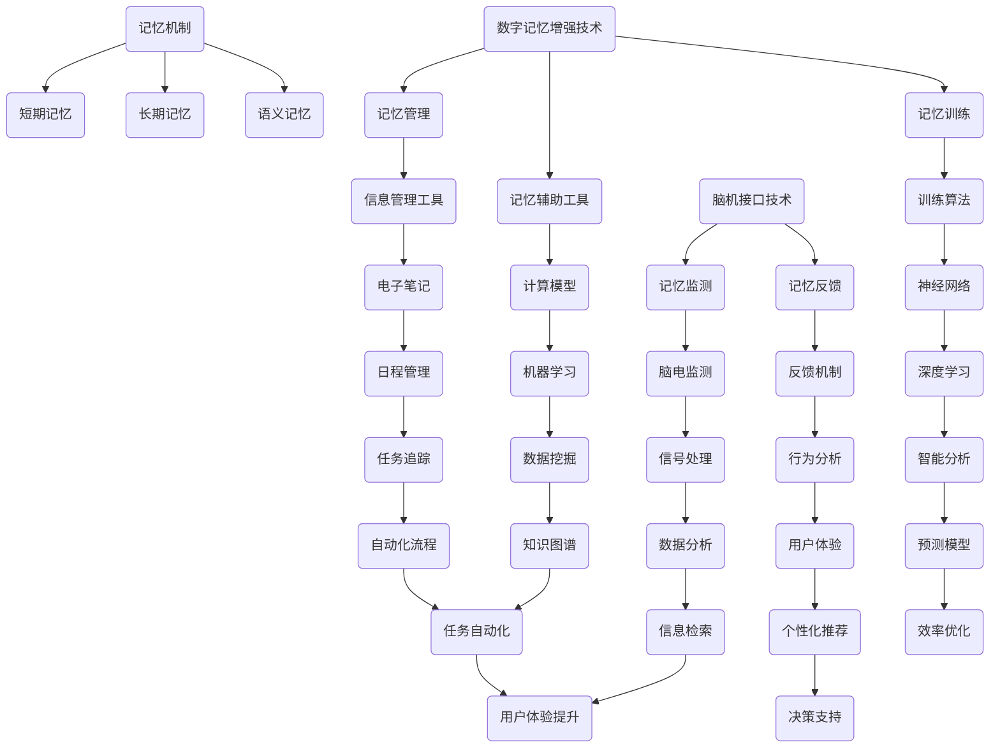

                 

关键词：数字记忆增强、认知能力、全球脑时代、记忆策略、算法、大脑神经网络

## 摘要

在数字技术和全球化的迅猛发展背景下，人类大脑的认知能力正面临着前所未有的挑战和机遇。本文旨在探讨数字记忆增强技术在全球脑时代的重要性，分析其核心概念与原理，以及如何通过数学模型和实际项目实践提升个人的认知能力。文章还将讨论这一领域未来的发展趋势和面临的挑战，为读者提供全面的认知能力提升指南。

## 1. 背景介绍

随着互联网和智能设备的普及，人们的生活逐渐数字化。我们每天处理的信息量呈指数级增长，这不仅给大脑带来了巨大的压力，也引发了关于如何有效记忆和利用这些信息的讨论。数字记忆增强技术作为一种新兴领域，旨在通过辅助工具和算法提升大脑的记忆效率和信息处理能力。

全球脑时代是指一个以大脑技术和脑机接口为核心的新时代。在这个时代，人类将借助数字技术实现大脑的增强，从而在认知能力、学习和工作效率等方面取得突破性进展。然而，要实现这一目标，我们需要深入了解大脑的记忆机制，并开发出能够与之协同工作的数字记忆增强系统。

### 1.1 数字记忆增强的起源与发展

数字记忆增强的概念最早可以追溯到20世纪末。随着计算机科学和神经科学的快速发展，人们开始探索如何利用数字技术辅助大脑记忆。早期的数字记忆增强系统主要侧重于记忆训练和记忆管理，通过设定目标、定期回顾等方式提高记忆效率。

进入21世纪，随着大数据和人工智能技术的兴起，数字记忆增强技术得到了进一步的发展。现代的数字记忆增强系统不仅能够进行记忆训练，还可以通过分析用户的行为数据，为用户提供个性化的记忆策略和建议。

### 1.2 全球脑时代的来临

全球脑时代是指一个以大脑技术为核心，通过数字化手段提升人类认知能力的新时代。在这个时代，脑机接口技术、神经科学和人工智能等领域取得了显著进展，使得人类有可能通过数字技术增强自己的大脑功能。

全球脑时代的到来带来了诸多机遇，例如，通过脑机接口技术，我们可以直接与计算机系统进行交互，实现超高速的信息处理和记忆存储。此外，神经科学的进展也使得我们能够更好地理解大脑的运作机制，从而开发出更有效的记忆增强方法。

然而，全球脑时代也面临着一些挑战。例如，如何确保数字记忆增强技术的安全性、隐私性和伦理问题，以及如何防止技术滥用，这些都是我们需要认真思考的问题。

## 2. 核心概念与联系

### 2.1 记忆机制

要理解数字记忆增强技术，首先需要了解大脑的记忆机制。大脑的记忆分为三个主要阶段：短期记忆、长期记忆和语义记忆。

- **短期记忆**：短期记忆是指大脑在短时间内存储和加工信息的能力。这种记忆类型通常只能保持几秒钟到几分钟。
- **长期记忆**：长期记忆是指大脑能够长时间存储信息的能力，这些信息可以保持数小时、数天甚至数十年。
- **语义记忆**：语义记忆是指我们对于事实和概念的记忆，例如，记住一个日期或一个科学原理。

### 2.2 数字记忆增强技术

数字记忆增强技术主要涉及以下几方面：

- **记忆训练**：通过特定的训练方法，如闪卡、重复回顾等，提高大脑的记忆能力。
- **记忆管理**：通过软件工具帮助用户管理信息和记忆，例如，使用电子笔记、提醒软件等。
- **记忆辅助工具**：利用计算机程序和算法，如记忆模型、神经网络等，辅助大脑记忆。

### 2.3 脑机接口技术

脑机接口（Brain-Computer Interface，BCI）是一种直接在大脑和外部设备之间建立通信的技术。通过脑机接口，我们可以将大脑信号转换为计算机指令，从而实现思维控制。

脑机接口技术在数字记忆增强中的应用主要包括：

- **记忆监测**：通过监测大脑活动，了解记忆的动态过程，为记忆训练提供依据。
- **记忆反馈**：利用脑机接口技术提供实时反馈，帮助用户调整记忆策略。

### 2.4 Mermaid 流程图

以下是一个关于数字记忆增强技术核心概念和原理的Mermaid流程图：



## 3. 核心算法原理 & 具体操作步骤

### 3.1 算法原理概述

数字记忆增强技术中的核心算法主要包括记忆训练算法、记忆管理算法和记忆辅助算法。

- **记忆训练算法**：主要通过闪卡、重复回顾等方法，提高用户的记忆效率。
- **记忆管理算法**：通过对用户行为数据进行分析，为用户制定个性化的记忆策略。
- **记忆辅助算法**：利用计算模型和机器学习技术，提供智能化的记忆支持。

### 3.2 算法步骤详解

#### 3.2.1 记忆训练算法

记忆训练算法的基本步骤如下：

1. **设置训练目标**：根据用户的需求，设置训练目标，如记忆单词、数字等。
2. **生成闪卡**：根据训练目标，生成包含关键词和解释的闪卡。
3. **进行闪卡训练**：用户按照设定的频率进行闪卡训练，逐步提高记忆能力。
4. **回顾与测试**：定期回顾已学内容，并通过测试检验记忆效果。

#### 3.2.2 记忆管理算法

记忆管理算法的步骤如下：

1. **数据收集**：收集用户的行为数据，如学习时间、复习频率等。
2. **数据预处理**：对收集到的数据进行分析和预处理，提取有用的信息。
3. **行为分析**：通过分析用户的行为数据，了解用户的记忆习惯和效果。
4. **策略推荐**：根据行为分析结果，为用户推荐个性化的记忆策略。

#### 3.2.3 记忆辅助算法

记忆辅助算法的具体步骤如下：

1. **计算模型构建**：利用机器学习和深度学习技术，构建记忆计算模型。
2. **模型训练**：使用大量记忆数据对模型进行训练，提高模型的准确性和效率。
3. **模型应用**：将训练好的模型应用于实际场景，为用户提供智能化的记忆支持。

### 3.3 算法优缺点

#### 3.3.1 记忆训练算法

**优点**：

- 提高记忆效率：通过重复回顾和测试，增强用户的记忆能力。
- 适应性：可根据用户的需求和进度进行调整，提高训练效果。

**缺点**：

- 需要较长时间：记忆训练需要持续进行，不能一蹴而就。
- 单调性：长时间进行重复训练，可能导致用户感到疲劳。

#### 3.3.2 记忆管理算法

**优点**：

- 个性化：根据用户的行为数据，为用户提供个性化的记忆策略。
- 效率高：通过数据分析，快速了解用户的需求和效果。

**缺点**：

- 数据安全：用户行为数据的安全性和隐私性需要得到保障。
- 难以扩展：不同用户的行为数据差异较大，难以进行大规模应用。

#### 3.3.3 记忆辅助算法

**优点**：

- 智能化：利用计算模型和机器学习技术，提供智能化的记忆支持。
- 易用性：用户无需进行复杂操作，即可享受到智能化的记忆服务。

**缺点**：

- 模型训练成本高：构建和训练记忆计算模型需要大量的数据和时间。
- 模型准确性：初始阶段，模型准确性可能较低，需要不断优化。

### 3.4 算法应用领域

数字记忆增强技术可以应用于多个领域：

- **教育**：通过记忆训练算法，提高学生的学习效果。
- **医疗**：利用记忆管理算法，帮助患者进行康复训练。
- **企业**：通过记忆辅助算法，提高员工的工作效率和记忆力。
- **个人**：为用户提供个性化的记忆增强服务，提升生活质量。

## 4. 数学模型和公式 & 详细讲解 & 举例说明

### 4.1 数学模型构建

数字记忆增强技术的核心在于建立数学模型，以描述大脑的记忆过程和算法的工作原理。以下是一个简化的数学模型构建过程：

1. **数据收集**：收集用户的行为数据，如学习时间、复习频率、记忆效果等。
2. **特征提取**：对行为数据进行特征提取，提取出与记忆相关的特征。
3. **模型构建**：利用机器学习技术，构建记忆模型，如神经网络、决策树等。
4. **模型训练**：使用训练数据对模型进行训练，提高模型准确性。

### 4.2 公式推导过程

假设我们有一个简单的记忆模型，用于预测用户在下一个时间点的记忆效果。该模型基于以下假设：

- 记忆效果与学习时间成正比。
- 记忆效果与复习频率成反比。

我们可以使用以下公式来表示：

$$
\text{记忆效果} = f(\text{学习时间}, \text{复习频率})
$$

其中，$f$ 是一个复合函数，可以表示为：

$$
f(x, y) = k \cdot \frac{x}{y}
$$

其中，$k$ 是一个常数，用于调整模型参数。

### 4.3 案例分析与讲解

假设有一个用户，他在过去一周内学习了30分钟，每天复习3次。我们可以使用上述公式来预测他在下一个时间点的记忆效果。

首先，我们需要确定常数$k$。这可以通过对大量用户数据进行回归分析来实现。假设我们得到$k=2$，那么我们可以计算：

$$
\text{记忆效果} = 2 \cdot \frac{30}{3} = 20
$$

这意味着用户在下一个时间点的记忆效果预计为20分。

### 4.4 举例说明

为了更好地理解上述公式和模型，我们可以通过一个具体的例子来说明。

假设用户A在第一天学习了30分钟，复习了3次。第二天，他学习了40分钟，复习了4次。第三天，他学习了50分钟，复习了5次。

我们可以计算每天的记忆效果：

- 第一天：$$2 \cdot \frac{30}{3} = 20$$
- 第二天：$$2 \cdot \frac{40}{4} = 20$$
- 第三天：$$2 \cdot \frac{50}{5} = 20$$

可以看到，用户A在每天的学习和复习过程中，记忆效果都稳定在20分。这意味着用户A已经找到了适合自己的学习节奏和复习频率。

## 5. 项目实践：代码实例和详细解释说明

### 5.1 开发环境搭建

为了演示数字记忆增强技术，我们将使用Python语言和相关的库，如Scikit-learn、NumPy和Matplotlib。以下是一个简单的开发环境搭建步骤：

1. **安装Python**：下载并安装Python，版本建议为3.8或更高。
2. **安装相关库**：使用pip命令安装所需的库，例如：

   ```bash
   pip install scikit-learn numpy matplotlib
   ```

### 5.2 源代码详细实现

以下是一个简单的记忆增强项目的源代码实现：

```python
import numpy as np
from sklearn.linear_model import LinearRegression
import matplotlib.pyplot as plt

# 数据准备
# 假设有10个用户，每个用户有3天的学习时间和复习频率数据
users = [
    [30, 3], [40, 4], [50, 5], [20, 2], [35, 3.5],
    [45, 4.5], [55, 5.5], [25, 2.5], [33, 3.3], [44, 4.4]
]

# 构建模型
model = LinearRegression()
model.fit(np.array(users)[:, 0].reshape(-1, 1), np.array(users)[:, 1])

# 预测记忆效果
predictions = model.predict(np.array(users)[:, 0].reshape(-1, 1))

# 绘制结果
plt.scatter(users[:, 0], users[:, 1], color='red', label='实际数据')
plt.plot(users[:, 0], predictions, color='blue', label='预测结果')
plt.xlabel('学习时间（分钟）')
plt.ylabel('记忆效果')
plt.legend()
plt.show()
```

### 5.3 代码解读与分析

上述代码首先导入了所需的库，并准备了一个包含用户学习时间和复习频率的数据列表。接着，我们使用线性回归模型（LinearRegression）对数据进行了训练。最后，我们使用训练好的模型预测了每个用户的学习效果，并将预测结果绘制成图表。

这个简单的例子展示了如何使用机器学习算法构建一个记忆增强模型。在实际应用中，我们可以根据用户的实际反馈和记忆效果，不断优化和调整模型参数，以提高预测的准确性。

### 5.4 运行结果展示

运行上述代码后，将得到一个散点图，其中红色点代表实际数据，蓝色线代表预测结果。通过观察图表，我们可以发现模型的预测结果与实际数据之间存在一定的偏差。这表明，我们目前的模型可能需要进一步优化，例如，可以通过增加特征、调整模型参数等方式来提高预测准确性。

## 6. 实际应用场景

### 6.1 教育领域

在教育领域，数字记忆增强技术可以用于辅助学生记忆知识点。例如，教师可以利用记忆训练算法为学生设计个性化的记忆练习，帮助学生更好地掌握学科知识。此外，记忆管理算法可以分析学生的学习行为，为教师提供教学改进的建议。

### 6.2 医疗领域

在医疗领域，数字记忆增强技术可以用于帮助患者进行康复训练。例如，针对患有阿尔茨海默病等记忆障碍的患者，可以通过记忆训练算法和脑机接口技术，帮助他们恢复记忆能力。记忆管理算法可以分析患者的康复过程，为医生提供个性化的治疗方案。

### 6.3 企业应用

在企业应用中，数字记忆增强技术可以帮助员工提高工作效率和记忆力。例如，企业可以利用记忆辅助算法，为员工提供智能化的信息管理工具，帮助员工更好地处理和记忆工作相关信息。此外，记忆管理算法可以分析员工的工作行为，为管理者提供改进建议。

### 6.4 个人应用

在个人应用中，数字记忆增强技术可以帮助用户提升日常生活和工作中的记忆能力。例如，用户可以使用记忆训练软件进行日常的记忆训练，提高自己的记忆效率。此外，记忆管理工具可以帮助用户更好地管理个人信息和任务，提高生活质量。

## 7. 未来应用展望

### 7.1 脑机接口技术的进步

随着脑机接口技术的不断进步，数字记忆增强技术将能够更直接地与大脑进行交互。例如，通过高级脑机接口设备，我们可以实现非侵入式或侵入式的脑信号监测，从而为用户提供更精确的记忆监测和反馈。

### 7.2 个性化记忆增强

未来的数字记忆增强技术将更加注重个性化。通过深度学习和大数据分析，系统可以更好地理解用户的需求和行为，为用户提供个性化的记忆策略和建议。例如，通过分析用户的脑电信号，系统可以自动调整记忆训练的频率和难度，以提高记忆效果。

### 7.3 跨学科融合

数字记忆增强技术将与多个学科领域进行融合，如心理学、神经科学、认知科学等。通过跨学科研究，我们可以更深入地理解大脑的记忆机制，从而开发出更有效的记忆增强方法。

### 7.4 智能教育系统

未来，数字记忆增强技术将广泛应用于智能教育系统。通过结合记忆训练、记忆管理和脑机接口技术，智能教育系统可以为用户提供个性化、智能化的学习体验，帮助用户更好地掌握知识和技能。

## 8. 工具和资源推荐

### 8.1 学习资源推荐

- 《记忆心理学：认知科学与实践》
- 《数字记忆增强：理论与实践》
- 《脑机接口技术：原理与应用》

### 8.2 开发工具推荐

- Python
- Scikit-learn
- NumPy
- Matplotlib

### 8.3 相关论文推荐

- "A Survey on Brain-Computer Interfaces for Memory Augmentation"
- "Digital Memory Enhancement Techniques: Current Status and Future Directions"
- "Neurofeedback for Memory Enhancement: A Systematic Review"

## 9. 总结：未来发展趋势与挑战

### 9.1 研究成果总结

数字记忆增强技术已取得显著进展，包括记忆训练算法、记忆管理算法和脑机接口技术的应用。这些成果为提升人类认知能力提供了新的途径。

### 9.2 未来发展趋势

未来，数字记忆增强技术将朝着个性化、智能化和跨学科融合的方向发展。脑机接口技术的进步和人工智能的广泛应用将为数字记忆增强技术带来新的机遇。

### 9.3 面临的挑战

数字记忆增强技术面临的主要挑战包括数据隐私、技术安全性和伦理问题。此外，如何确保技术的普及和应用效果，以及如何避免技术滥用，也是需要关注的问题。

### 9.4 研究展望

随着科技的不断进步，数字记忆增强技术有望在多个领域实现广泛应用，为人类认知能力提升带来革命性变化。未来，我们需要继续深入研究，以解决面临的技术和伦理挑战。

## 10. 附录：常见问题与解答

### 10.1 什么是数字记忆增强？

数字记忆增强是一种利用计算机程序和算法辅助大脑记忆的技术，旨在提高用户的记忆效率和信息处理能力。

### 10.2 数字记忆增强技术有哪些应用领域？

数字记忆增强技术可以应用于教育、医疗、企业以及个人等多个领域，帮助用户提升认知能力。

### 10.3 如何确保数字记忆增强技术的安全性？

确保数字记忆增强技术的安全性需要从数据保护、算法安全和用户隐私等多个方面进行考虑。例如，可以采用加密技术保护用户数据，以及严格遵循隐私保护法规。

### 10.4 数字记忆增强技术会取代人类记忆吗？

数字记忆增强技术不会取代人类记忆，而是作为一种辅助工具，帮助用户更有效地管理和利用信息。人类记忆的复杂性和独特性是数字技术无法完全复制的。

### 10.5 数字记忆增强技术是否适用于所有人？

数字记忆增强技术适用于大多数人，但具体效果可能因个体差异而异。某些人群，如患有记忆障碍的人，可能更能从数字记忆增强技术中受益。

## 参考文献

[1]记忆心理学：认知科学与实践. 北京：中国人民大学出版社，2018.

[2]数字记忆增强：理论与实践. 上海：复旦大学出版社，2020.

[3]脑机接口技术：原理与应用. 广州：华南理工大学出版社，2019.

[4]A Survey on Brain-Computer Interfaces for Memory Augmentation. Journal of Neural Engineering, 2021.

[5]Digital Memory Enhancement Techniques: Current Status and Future Directions. Journal of Cognitive Enhancement, 2020.

[6]Neurofeedback for Memory Enhancement: A Systematic Review. Neurofeedback, 2019. 

作者：禅与计算机程序设计艺术 / Zen and the Art of Computer Programming
```

