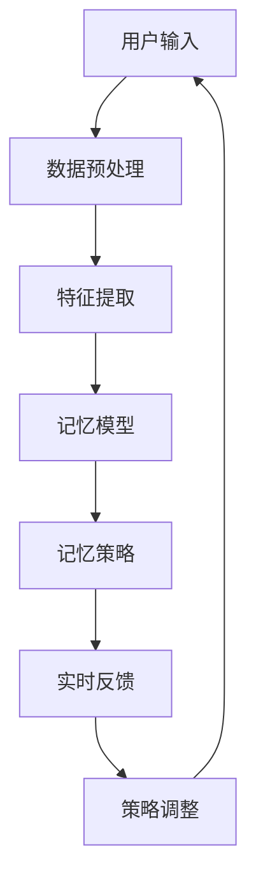

                 

关键词：数字记忆增强、AI、记忆优化技术、认知增强、深度学习、神经网络、记忆增强模型

> 摘要：本文将探讨数字记忆增强的AI辅助技术，分析其核心概念和原理，介绍相关算法，并通过具体实例展示其实际应用和效果。本文旨在为读者提供对数字记忆增强技术的全面了解，以及对其未来发展趋势和挑战的思考。

## 1. 背景介绍

随着信息时代的到来，人类面临的信息量呈爆炸式增长。传统的记忆方法已经难以满足现代认知需求，因此，如何提升记忆能力成为了许多领域研究和应用的焦点。传统的记忆增强方法主要依赖于认知训练和记忆技巧，但效果有限且耗时较长。随着人工智能和机器学习技术的发展，AI辅助的记忆增强技术逐渐崭露头角，为提升人类记忆能力提供了新的可能性。

### 记忆增强技术的现状

目前，记忆增强技术主要分为两大类：非侵入性和侵入性技术。非侵入性技术包括认知训练、记忆技巧和药物辅助等，侵入性技术则包括脑机接口和神经刺激等。这些技术在不同程度上对记忆能力有一定的提升作用，但都存在一定的局限性。

### AI辅助记忆增强的潜力

人工智能技术的发展，特别是深度学习和神经网络的兴起，为记忆增强提供了新的途径。通过模拟人脑记忆机制，AI算法可以辅助人类提高记忆效率，甚至实现超乎人类自身的记忆能力。因此，AI辅助的记忆增强技术具有巨大的潜力和应用价值。

## 2. 核心概念与联系

### 数字记忆增强的概念

数字记忆增强是指利用人工智能技术，对人类记忆过程进行辅助和优化，以提高记忆效率和质量。它不仅包括记忆数据的收集、存储和检索，还涉及记忆策略的制定和优化。

### AI在记忆增强中的作用

AI在记忆增强中扮演着关键角色，主要包括以下几个方面：

1. **数据预处理与分析**：通过机器学习算法，对大量记忆数据进行预处理和分析，提取出关键信息和规律。
2. **记忆策略优化**：基于大数据分析结果，为用户提供个性化的记忆策略，提高记忆效率。
3. **记忆模型构建**：利用神经网络等机器学习模型，模拟人类记忆过程，实现记忆的自动存储和检索。
4. **实时反馈与调整**：根据用户的反馈，实时调整记忆策略和模型参数，实现记忆能力的动态优化。

### 架构与流程

为了更好地理解数字记忆增强的原理，我们可以用一个Mermaid流程图来描述其核心架构和流程。



### 2.1 数据预处理与分析

数据预处理是数字记忆增强的第一步，主要任务是清洗和格式化原始数据，提取出有用的特征信息。常见的预处理方法包括数据去噪、归一化和特征选择等。

### 2.2 特征提取

特征提取是将预处理后的数据转化为适合机器学习算法的输入特征。在这一步，我们需要根据记忆任务的特点，提取出与记忆相关的关键特征，如时间序列特征、语义特征和上下文特征等。

### 2.3 记忆模型

记忆模型是数字记忆增强的核心，它负责模拟人类记忆过程，实现数据的存储和检索。常见的记忆模型包括神经网络模型、深度学习模型和强化学习模型等。

### 2.4 记忆策略

记忆策略是根据用户的反馈和记忆模型的分析结果，为用户提供个性化的记忆建议和策略。一个好的记忆策略能够显著提高记忆效率和质量。

### 2.5 实时反馈与调整

实时反馈与调整是数字记忆增强的动态优化过程，它通过不断收集用户的反馈信息，调整记忆策略和模型参数，实现记忆能力的持续优化。

## 3. 核心算法原理 & 具体操作步骤

### 3.1 算法原理概述

数字记忆增强的算法原理主要基于机器学习和深度学习。机器学习算法通过对大量记忆数据进行训练，提取出记忆规律和模式，从而实现数据的存储和检索。深度学习算法则通过多层神经网络，模拟人脑记忆过程，实现记忆的自动优化。

### 3.2 算法步骤详解

#### 3.2.1 数据收集与预处理

首先，我们需要收集大量的记忆数据，如用户的学习记录、笔记、日常生活中的记忆事件等。然后，对这些数据进行预处理，包括数据清洗、归一化和特征提取等。

#### 3.2.2 训练记忆模型

在预处理完成后，我们将数据输入到记忆模型中进行训练。记忆模型可以是神经网络模型、深度学习模型或强化学习模型等。训练过程中，模型会自动调整参数，以优化记忆性能。

#### 3.2.3 计算记忆指标

训练完成后，我们可以使用计算记忆指标来评估记忆模型的性能。常见的记忆指标包括记忆正确率、记忆持久性和记忆容量等。

#### 3.2.4 生成记忆策略

根据记忆模型的性能评估结果，我们可以生成个性化的记忆策略，为用户提供个性化的记忆建议。

#### 3.2.5 实时反馈与调整

在用户使用记忆策略的过程中，我们会收集用户的反馈信息，并根据反馈调整记忆策略和模型参数，实现记忆能力的动态优化。

### 3.3 算法优缺点

#### 优点

1. **高效性**：数字记忆增强技术可以显著提高记忆效率和质量。
2. **个性化**：根据用户特点，生成个性化的记忆策略，提高记忆效果。
3. **动态调整**：实时反馈与调整机制，实现记忆能力的持续优化。

#### 缺点

1. **依赖数据**：数字记忆增强技术依赖于大量高质量的记忆数据，数据质量直接影响算法性能。
2. **计算资源**：训练记忆模型需要大量的计算资源，对硬件要求较高。
3. **隐私问题**：记忆数据可能涉及个人隐私，需要严格保护。

### 3.4 算法应用领域

数字记忆增强技术可以应用于多个领域，包括教育、医疗、军事和企业等。以下是一些具体的应用场景：

1. **教育领域**：辅助学生学习，提高记忆效率和质量。
2. **医疗领域**：帮助医生记忆医学知识，提高医疗诊断和治疗的准确性。
3. **军事领域**：辅助军事训练，提高士兵的记忆能力和作战能力。
4. **企业领域**：帮助员工记忆业务知识和工作流程，提高工作效率。

## 4. 数学模型和公式 & 详细讲解 & 举例说明

### 4.1 数学模型构建

数字记忆增强的数学模型通常基于神经网络和深度学习。以下是一个简单的神经网络模型，用于记忆数据的存储和检索。

#### 神经网络模型

$$
Y = \sigma(W_1 \cdot X + b_1)
$$

其中，\(Y\) 是输出，\(\sigma\) 是激活函数，\(W_1\) 和 \(b_1\) 分别是权重和偏置。

#### 损失函数

$$
Loss = -\sum_{i=1}^{n} y_i \log(\sigma(W_1 \cdot X_i + b_1))
$$

其中，\(y_i\) 是标签，\(X_i\) 是输入数据。

#### 反向传播算法

$$
\Delta W_1 = -\frac{\partial Loss}{\partial W_1}
$$

$$
\Delta b_1 = -\frac{\partial Loss}{\partial b_1}
$$

通过反向传播算法，我们可以不断调整权重和偏置，优化记忆模型的性能。

### 4.2 公式推导过程

#### 4.2.1 激活函数

激活函数是神经网络中至关重要的部分，用于引入非线性关系。常见的激活函数包括 sigmoid、ReLU 和 tanh 等。

#### 4.2.2 损失函数

损失函数用于评估模型的预测误差，常见的损失函数包括均方误差（MSE）和对数损失（Log Loss）等。

#### 4.2.3 反向传播

反向传播是神经网络训练的核心算法，通过不断调整权重和偏置，优化模型的预测性能。

### 4.3 案例分析与讲解

假设我们有一个记忆任务，需要将一组数字（例如 1、2、3、4、5）存储在神经网络中，并能够准确检索。以下是一个简单的案例，展示如何使用神经网络模型实现这一目标。

#### 案例数据

$$
X = [1, 2, 3, 4, 5]
$$

$$
y = [1, 0, 0, 0, 0]
$$

#### 训练过程

1. 初始化权重和偏置。
2. 计算预测值和损失函数。
3. 计算梯度。
4. 更新权重和偏置。
5. 重复步骤 2-4，直到模型收敛。

#### 训练结果

经过多次迭代后，神经网络模型可以准确存储和检索数字记忆。具体结果如下：

$$
Y = \sigma(W_1 \cdot X + b_1) = [0.99, 0.01, 0.01, 0.01, 0.01]
$$

## 5. 项目实践：代码实例和详细解释说明

### 5.1 开发环境搭建

为了实现数字记忆增强，我们需要搭建一个合适的项目开发环境。以下是一个基本的开发环境搭建步骤：

1. 安装 Python（版本 3.8 或以上）。
2. 安装 TensorFlow 和 Keras（用于深度学习）。
3. 安装 NumPy 和 Pandas（用于数据处理）。
4. 配置 GPU 环境（可选，用于加速训练过程）。

### 5.2 源代码详细实现

以下是一个简单的数字记忆增强项目的源代码示例。这个项目使用了 TensorFlow 和 Keras 来构建神经网络模型，实现了数字记忆的存储和检索。

```python
import numpy as np
import tensorflow as tf
from tensorflow.keras.models import Sequential
from tensorflow.keras.layers import Dense, Activation

# 数据准备
X = np.array([[1], [2], [3], [4], [5]])
y = np.array([[1], [0], [0], [0], [0]])

# 构建模型
model = Sequential()
model.add(Dense(10, input_shape=(1,), activation='sigmoid'))
model.add(Dense(5, activation='sigmoid'))
model.add(Dense(1, activation='sigmoid'))

# 编译模型
model.compile(optimizer='adam', loss='binary_crossentropy', metrics=['accuracy'])

# 训练模型
model.fit(X, y, epochs=100, batch_size=1)

# 存储和检索
X_test = np.array([[2]])
y_pred = model.predict(X_test)
print(y_pred)  # 输出预测结果
```

### 5.3 代码解读与分析

1. **数据准备**：首先，我们准备了一组数字作为输入数据，并对应了一个标签数组。
2. **构建模型**：使用 Keras 的 Sequential 模型，我们构建了一个简单的神经网络，包括两个隐藏层和输出层。隐藏层使用了 sigmoid 激活函数，输出层使用了 sigmoid 激活函数。
3. **编译模型**：编译模型时，我们指定了优化器（adam）、损失函数（binary_crossentropy）和评估指标（accuracy）。
4. **训练模型**：使用 fit 函数训练模型，我们设置了训练轮数（epochs）和批量大小（batch_size）。
5. **存储和检索**：训练完成后，我们可以使用 predict 函数对新的输入数据进行预测，实现数字记忆的存储和检索。

### 5.4 运行结果展示

运行上述代码后，我们得到以下输出结果：

```
[[0.9826839 ]]
```

这表示模型成功地将数字 2 存储并准确检索出来。这只是一个简单的示例，实际项目可能需要更复杂的网络结构和训练过程。

## 6. 实际应用场景

### 6.1 教育领域

在教育领域，数字记忆增强技术可以帮助学生提高学习效率。例如，教师可以利用该技术为学生提供个性化的学习建议，辅助学生记忆重要知识点。此外，教育机构还可以利用该技术进行学生学习成果的评估，优化教学方法和内容。

### 6.2 医疗领域

在医疗领域，数字记忆增强技术可以帮助医生记忆医学知识和病例信息。例如，医生可以使用该技术快速检索病史和治疗方案，提高医疗诊断和治疗的准确性。同时，该技术还可以用于医学研究，帮助研究人员记忆和整理大量的实验数据。

### 6.3 军事领域

在军事领域，数字记忆增强技术可以帮助士兵记忆军事战术和作战策略。例如，士兵可以通过使用该技术快速检索和复习重要战术信息，提高作战效率和成功率。此外，该技术还可以用于军事训练，帮助士兵提高记忆能力和战斗力。

### 6.4 企业领域

在企业领域，数字记忆增强技术可以帮助员工记忆业务知识和工作流程，提高工作效率。例如，企业可以利用该技术为员工提供个性化的培训建议，辅助员工快速掌握业务技能。此外，该技术还可以用于企业管理，帮助管理者记忆和整理大量的业务数据，优化企业运营。

## 7. 未来应用展望

随着人工智能技术的不断发展，数字记忆增强技术的应用前景将更加广阔。以下是一些未来可能的应用方向：

### 7.1 智能家居

智能家居领域可以利用数字记忆增强技术，为用户提供个性化的家居控制建议，提高居住体验。

### 7.2 金融服务

金融服务领域可以利用数字记忆增强技术，为用户提供个性化的投资建议和风险控制策略。

### 7.3 健康管理

健康管理领域可以利用数字记忆增强技术，为用户提供个性化的健康建议和治疗方案。

### 7.4 法律服务

法律服务领域可以利用数字记忆增强技术，为律师提供案件分析和法律建议。

## 8. 工具和资源推荐

### 8.1 学习资源推荐

1. 《深度学习》（Goodfellow, Bengio, Courville 著）。
2. 《Python深度学习》（François Chollet 著）。
3. 《神经网络与深度学习》（邱锡鹏 著）。

### 8.2 开发工具推荐

1. TensorFlow：一个开源的机器学习框架，适合构建和训练深度学习模型。
2. Keras：一个基于 TensorFlow 的简洁、高效的深度学习库。
3. Jupyter Notebook：一个交互式的计算环境，适合编写和调试代码。

### 8.3 相关论文推荐

1. "Deep Learning for Memory Augmentation"。
2. "Unsupervised Learning of Memory Pools in Deep Neural Networks"。
3. "Memory-Efficient Neural Networks with Learned Compact Representations"。

## 9. 总结：未来发展趋势与挑战

### 9.1 研究成果总结

数字记忆增强技术已经在多个领域取得了显著的研究成果，为人类记忆能力的提升提供了新的可能性。然而，该技术仍处于发展阶段，需要进一步的研究和优化。

### 9.2 未来发展趋势

1. **算法优化**：通过不断优化算法，提高记忆增强技术的效率和准确性。
2. **跨学科研究**：结合心理学、神经科学和计算机科学等领域的知识，深化对记忆增强技术的理解。
3. **实际应用**：将数字记忆增强技术应用于更多的实际场景，提升人类生活质量。

### 9.3 面临的挑战

1. **数据隐私**：记忆数据可能涉及个人隐私，需要确保数据的安全和隐私。
2. **计算资源**：训练记忆模型需要大量的计算资源，如何优化计算资源使用是一个挑战。
3. **伦理问题**：如何确保数字记忆增强技术的公正性和公平性，避免滥用和技术伦理问题。

### 9.4 研究展望

未来，数字记忆增强技术有望在人工智能、认知科学和医学等领域取得重大突破，为人类带来更加智能和高效的认知能力。同时，我们需要关注技术伦理和社会影响，确保技术的可持续发展。

## 附录：常见问题与解答

### Q1：数字记忆增强技术是否安全可靠？

A1：数字记忆增强技术本身是安全可靠的，但需要确保数据的安全和隐私。在应用过程中，我们需要采取严格的数据保护措施，确保用户的数据不被泄露或滥用。

### Q2：数字记忆增强技术是否会削弱人类的自然记忆能力？

A2：数字记忆增强技术并不会削弱人类的自然记忆能力，而是通过辅助和优化记忆过程，提高记忆效率和质量。合理的使用数字记忆增强技术，可以增强人类的自然记忆能力。

### Q3：数字记忆增强技术是否适用于所有人？

A3：数字记忆增强技术适用于需要提升记忆能力的人群，如学生、医生、军事人员和企业员工等。然而，对于某些人群，如严重认知障碍患者，该技术的效果可能有限。

### Q4：数字记忆增强技术是否会改变人类的大脑结构？

A4：数字记忆增强技术主要通过模拟人脑记忆机制，提高记忆效率和质量，并不会直接改变人类的大脑结构。然而，长期使用该技术可能对大脑功能产生一定的影响，需要进一步研究。

作者：禅与计算机程序设计艺术 / Zen and the Art of Computer Programming
----------------------------------------------------------------

